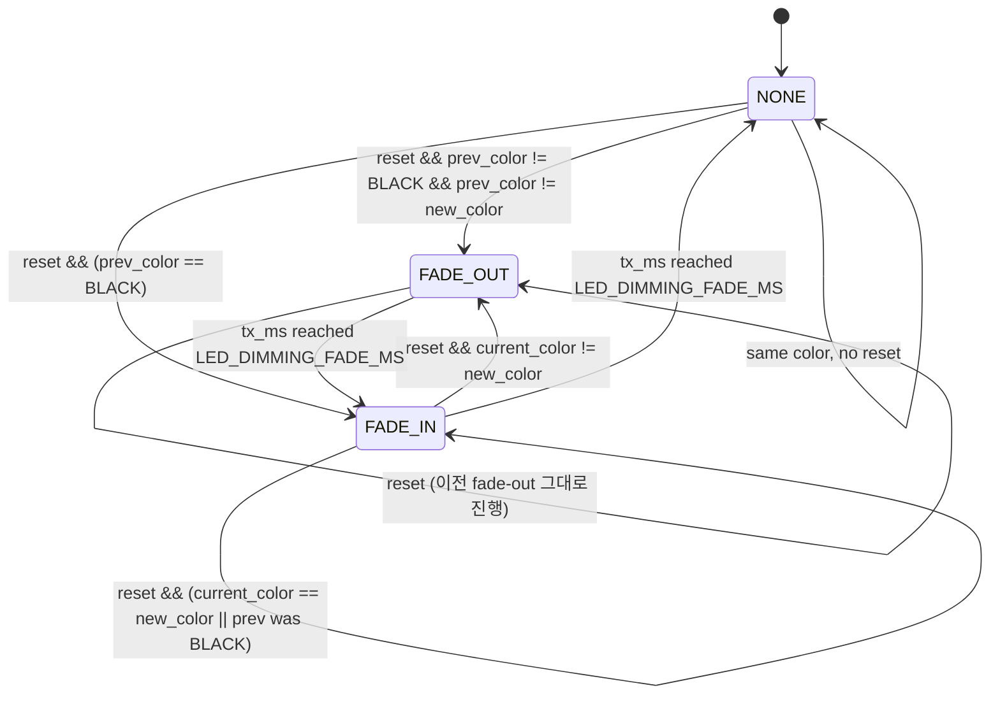

# LED Dimming Cross-fade 보강 구현계획

작성자: 김은수
작성일: 2026-04-23
상태: 리뷰 대기
관련:
- [`[요구사항] LED Cross-fade 보강 Rev.0 by 김은수.md`]([요구사항]%20LED%20Cross-fade%20보강%20Rev.0%20by%20김은수.md)
- [`[현상분석] LED Cross-fade 보강 Rev.0 by 김은수.md`]([현상분석]%20LED%20Cross-fade%20보강%20Rev.0%20by%20김은수.md)

---

## 1. 결정

| # | 항목 | 결정 |
|---|---|---|
| Q1 | fade-out 중 새 reset | 진행 중 fade-out 그대로 끝낸 후 새 색 fade-in |
| Q2 | 같은 색 reset | Phase A 생략 (fade-in 만) |
| Q3 | 이전 색 OFF | Phase A 생략 (기존 Rev.0 동작 유지) |

---

## 2. 상태 머신 설계



### 2.1 상태 변수

```c
typedef enum
{
    LED_TX_NONE = 0,
    LED_TX_FADE_OUT,
    LED_TX_FADE_IN,
} led_tx_phase_t;

static led_tx_phase_t s_tx_phase     = LED_TX_NONE;
static EN__LED_COLOR  s_tx_prev_color = en__LED_BLACK;
static uint16_t       s_tx_ms        = 0;
```

`s_color_changed_ms` 는 제거 (s_tx_ms 가 같은 역할 + 더 명시적).

### 2.2 reset 처리 (`led_engine_run()` 진입부)

```c
if (reset)
{
    timer_ms       = 0;
    burst_done_cnt = 0;

    /* 이전 색 캡처 — fade-out 중이면 prev_color 보존 (덮어쓰지 않음) */
    EN__LED_COLOR new_color = (k_led_patterns[st].period_ms == 0)
                              ? k_led_patterns[st].color
                              : k_led_patterns[st].color;  /* 점멸도 ON 구간 색 사용 */

    if (s_tx_phase != LED_TX_FADE_OUT)
    {
        if (LED_outputColor != en__LED_BLACK && LED_outputColor != new_color)
        {
            /* Phase A 시작 — 이전 색을 fade-out */
            s_tx_phase      = LED_TX_FADE_OUT;
            s_tx_prev_color = LED_outputColor;
            s_tx_ms         = 0;
        }
        else
        {
            /* Phase B 직행 — 이전이 OFF 였거나 같은 색 */
            s_tx_phase = LED_TX_FADE_IN;
            s_tx_ms    = 0;
        }
    }
    /* fade-out 중이면 진행 그대로 둠 */
}
```

### 2.3 fade-out 단계 (Phase A)

```c
if (s_tx_phase == LED_TX_FADE_OUT)
{
    /* 이전 색을 출력 + brightness 점진 감소 */
    LED_outputColor = s_tx_prev_color;
    uint32_t b = (uint32_t) 255 * (LED_DIMMING_FADE_MS - s_tx_ms) / LED_DIMMING_FADE_MS;
    s_led_pwm_on_count = (uint8_t) (b * LED_DIMMING_PWM_STEPS / 255);

    s_tx_ms++;
    if (s_tx_ms >= LED_DIMMING_FADE_MS)
    {
        /* fade-out 완료 → 다음 tick 부터 Phase B */
        s_tx_phase = LED_TX_FADE_IN;
        s_tx_ms    = 0;
        /* timer_ms 는 이미 reset 시 0 — 새 패턴은 Phase B 부터 시작 */
    }
    return;  /* 패턴 진행은 Phase B 부터 */
}
```

> [!NOTE]
> Phase A 동안 `timer_ms` 가 그대로 0 으로 멈춰 있어야 새 패턴이 fade-out 끝난 시점부터 시작된다. 위 reset 블록에서 `timer_ms = 0` 설정 + Phase A 동안 `timer_ms++` 호출 안 함 → 정상.

### 2.4 fade-in 단계 (Phase B) + 패턴 진행

```c
/* 출력 색상 결정 (점멸 / 지속 ON 분기) */
if (p->period_ms == 0)
{
    LED_outputColor = p->color;
}
else
{
    LED_outputColor = (timer_ms < p->on_ms) ? p->color : en__LED_BLACK;
}

/* Brightness 산출 (점멸 fade) */
uint8_t bright = led_dim_calc_brightness(timer_ms, p->on_ms, p->period_ms);

/* Phase B fade-in: 새 색이 점진적으로 등장 */
if (s_tx_phase == LED_TX_FADE_IN)
{
    bright = (uint8_t) ((uint32_t) bright * s_tx_ms / LED_DIMMING_FADE_MS);
    s_tx_ms++;
    if (s_tx_ms >= LED_DIMMING_FADE_MS)
    {
        s_tx_phase = LED_TX_NONE;
    }
}

s_led_pwm_on_count = (uint8_t) ((uint32_t) bright * LED_DIMMING_PWM_STEPS / 255);

/* 점멸 주기 진행 — 기존 그대로 */
if (p->period_ms != 0)
{
    timer_ms++;
    /* burst 처리 (변경 없음) */
}
```

---

## 3. 단계 / 커밋

단일 커밋:

> Refactor : LED Dimming 색상 전환 cross-fade — 이전 색 fade-out 후 새 색 fade-in

영향 파일: `LedOutput.c` 만.

---

## 4. 검증

### 4.1 정적

- 빌드 성공 (사용자 환경)
- `Grep`: `s_color_changed_ms` 잔존 0 건

### 4.2 실기 시나리오 (요구사항 §5)

요구사항 §5 의 a~e 모두 확인.

---

## 5. 위험 / 잔여 과제

- (R1) Phase A (fade-out 150 ms) 중에는 새 패턴 진행이 보류되므로, 점멸 패턴의 첫 ON 구간 도달이 150 ms 지연됨. PAIR latch 1000 ms 안에서는 충분히 표시 가능.
- (R2) burst 패턴 (POWER_ON ×5) 의 첫 burst 도달 ≈ 150 ms 지연. 실기 영향 미미.
- (R3) 색상 전환이 매우 빠르게 연속 발생 시 (Arbiter 가 ms 단위로 best 변경) 시각적으로 끊겨 보일 수 있음. 일반 시나리오에서는 발생하지 않음.

---

## 6. 작업 순서

1. 본 문서 + 요구사항/현상분석 작성 — 완료
2. `LedOutput.c` 의 `led_engine_run()` 갱신 (`s_color_changed_ms` → `s_tx_phase` 상태머신)
3. 빌드 확인 (정적 grep 으로 잔존 변수 확인)
4. 단일 커밋
5. 사용자 확인 후 `claude_develop` 병합
