# [분석] CFX–CM3 공유메모리 시퀀스 및 타이밍 Rev.1

> **이전 버전**: [`[분석] CFX 프로젝트 구조 및 시퀀스 Rev.0 by 김은수.md`](./%5B%EB%B6%84%EC%84%9D%5D%20CFX%20%ED%94%84%EB%A1%9C%EC%A0%9D%ED%8A%B8%20%EA%B5%AC%EC%A1%B0%20%EB%B0%8F%20%EC%8B%9C%ED%80%80%EC%8A%A4%20Rev.0%20by%20%EA%B9%80%EC%9D%80%EC%88%98.md)
>
> **Rev.1 변경 사항**
>
> 1. 모든 ASCII 아트 다이어그램을 **Mermaid** 로 재작성 (영문/한글 폰트 섞여 깨지던 문제 해소)
> 2. **CM3 프로젝트** 쪽 writer/reader 를 모두 매핑하여 양방향 매트릭스 작성
> 3. **부팅 순서 (부트로더 → CFX → CM3)** 과 **런타임 1 msec 공통 틱** 타이밍 모델 추가
> 4. 각 핸드셰이크 시퀀스의 **총 소요 ms** 를 표기, **시퀀스 축소/개선 제안** 을 별도 섹션으로 분리

---

## 목차

1. [배경과 핵심 결론](#1-배경과-핵심-결론)
2. [부팅 순서 — 부트로더의 두-코어 기동](#2-부팅-순서--부트로더의-두-코어-기동)
3. [런타임 공통 타이밍 모델 — 1 msec PCM 틱](#3-런타임-공통-타이밍-모델--1-msec-pcm-틱)
4. [공유 메모리 접근 매트릭스 (Writer × Reader)](#4-공유-메모리-접근-매트릭스-writer--reader)
5. [핵심 시퀀스 다이어그램 8종](#5-핵심-시퀀스-다이어그램-8종)
6. [신호처리 파이프라인 (전체 데이터 흐름)](#6-신호처리-파이프라인-전체-데이터-흐름)
7. [타이밍 버짓 요약표](#7-타이밍-버짓-요약표)
8. [시퀀스 축소 · 개선 제안](#8-시퀀스-축소--개선-제안)
9. [부록 : 참조 파일 · 함수 색인](#9-부록--참조-파일--함수-색인)

---

## 1. 배경과 핵심 결론

이 문서의 목적은 **두 코어(LPDSP32 기반 CFX, ARM Cortex-M3)가 PRAM5 한 장 짜리 공유 메모리 위에서 어떤 순서와 주기로 데이터를 주고 받는지** 를 완전히 드러내고, **레거시 E7150/BTE 시리즈에서 옮겨오는 과정에서 불필요하게 늘어진 시퀀스** 를 숫자(ms 단위) 로 보여주는 것이다.

Rev.1 분석으로 확인된 **세 가지 핵심 사실**:

| # | 사실 | 함의 |
|:-:|---|---|
| ① | **두 코어의 main-loop 틱은 PCM 출력 FIFO(FA0_4)의 1 msec 인터럽트로 동기화** 되어 있다. CFX는 `FIFO_4_ISR`, CM3는 `FIFO_5_IRQHandler → CFX_0_IRQHandler → enable_iteration()` 로 같은 프레임 경계에서 깨어난다. | **새 시그널을 공유 메모리로 주고 받는 최소 지연은 1 msec**. 핸드셰이크 단계가 많을수록 ms 단위로 누적된다. |
| ② | 현재 **맵 변경 시퀀스는 3-way 핸드셰이크** 로 최소 **3~4 msec** 이 걸린다. CM3 요청 → CFX 리로드 → CM3 재계산 → CFX 재적용의 왕복 구조. | **두 번의 왕복을 한 번으로 줄이면 2 msec 단축** 가능. 사용자 체감은 없지만 자극 공백 구간이 짧아진다. |
| ③ | **SpecificCommand 경쟁 방지 플래그(`is_pcm_specific_command_reading`)** 는 CFX가 세팅/클리어만 하고, **CM3의 `changePcmOutputMode()` 는 이 플래그를 대기하지 않는다**. 2026-02-24 에 CFX에만 구현된 상태. | 실제 race 보호가 되어 있지 않음. CM3 쪽에도 동일 플래그 polling 추가 필요. |

---

## 2. 부팅 순서 — 부트로더의 두 코어 기동

### 2.1 물리적 기동 순서

부트로더(`src/0__bootloader/source/bootloader.c`)는 **한 바이너리가 CFX 파일과 CM3 파일을 모두 flash 에서 읽어**, 각각 PRAM 영역에 DMA 로 넣은 뒤 **CFX → CM3 순서로 시작** 시킨다. 둘의 기동 간격은 수십 μs 수준이다.

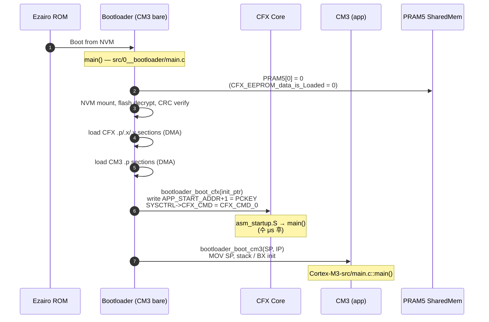

### 2.2 소프트-레벨 기동 핸드셰이크

두 코어가 동시에 뛰기 시작하지만, **실제 응용 레벨의 동기화**는 `shared_memory` 의 두 플래그가 담당한다.

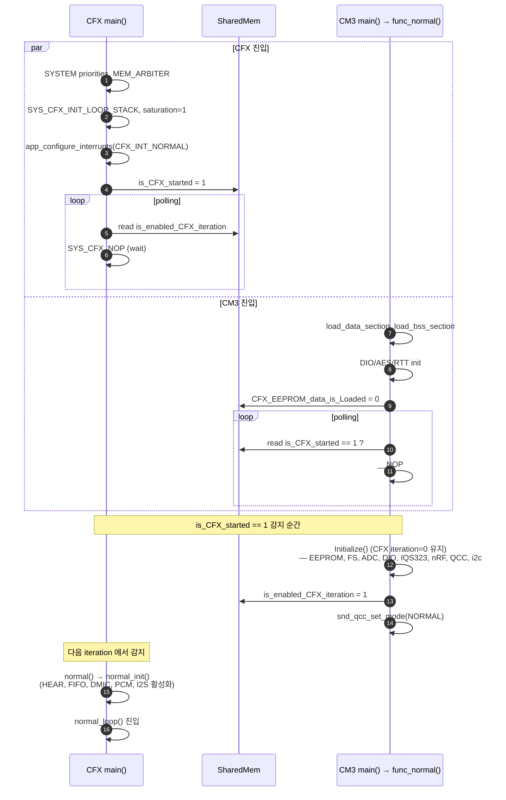

> **타이밍 노트** — CM3의 `Initialize()` 가 무거워(파일시스템 mount, QCC 초기화 등) **수백 msec ~ 수 sec** 소요된다. 이 기간 CFX는 `SYS_CFX_NOP` 루프만 돌기 때문에 아무 일도 하지 않는다. **CFX는 완전히 idle 상태** 로 CM3 초기화를 기다린다.

### 2.3 부팅 시퀀스에서 아끼기 어려운 이유

이 부분은 **단순한 2-플래그 handshake 로 이미 최소화**되어 있다. 더 줄일 이유가 없다. 다만 다음은 검토 포인트:

- `is_CFX_started` 를 CFX가 "main 진입" 이 아니라 "normal_init 전" 에서 세팅하면, CM3는 CFX가 HEAR/FIFO 세팅까지 끝나기 전이라 여전히 기다려야 하므로 실익 없음.
- 반대로 CM3의 `Initialize()` 항목 중 **CFX와 무관한 부분(파일시스템, BLE, 터치 센서)** 은 그대로 두되, **CFX 동작에 필요한 설정(FS 메모리의 pass-bin, 창 계수)** 만 선행 배치해도 전체 시간은 변하지 않는다(기기 전원 on 지연).

---

## 3. 런타임 공통 타이밍 모델 — 1 msec PCM 틱

### 3.1 틱의 정체

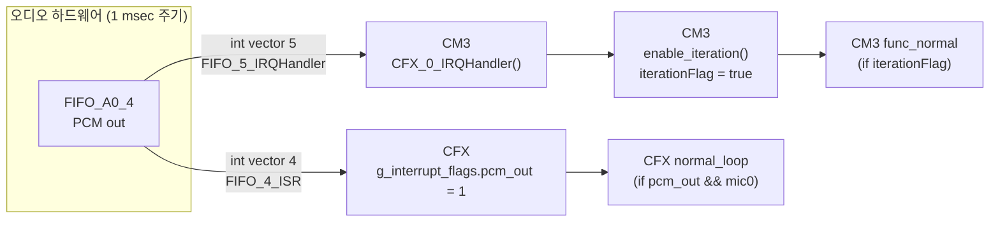

- **CFX** 의 `lib_audio_in.c:53` 에서 `SYS_FIFO_CFXINTCONFIG(4, FIFO_INT_A0_4)` 로 PCM-out 을 CFX 에 연결.
- **CM3** 의 `lib_audio_in.c:48` 에서 `SYS_FIFO_CM3INTCONFIG(5, FIFO_INT_A0_4)` 로 동일 FIFO 를 CM3 에 연결.
- CM3 쪽 `driver_timmer.c:10` 의 `CFX_0_IRQHandler()` 와 `FIFO_5_IRQHandler()` 는 **모두 `enable_iteration()` + `ci_timer_increase_tick()`** 로 귀결.

즉 **CM3 의 "1 msec 타이머"는 실제 독립 타이머가 아니라 CFX 가 내보내는 PCM 프레임의 부산물**이다. 레거시 Ezairo7150 에는 CM3 용 HW 타이머가 없어서 CFX 가 보내는 주기 인터럽트를 타이머처럼 사용하던 흔적이 그대로 남아 있다.

### 3.2 예외 경로 : Standby(ULP) 모드

ULP 진입 후에는 PCM FIFO 가 비활성화되므로 **CM3 는 자체 TIMER_3 의 19-count(약 1 msec) 인터럽트로 전환**된다. `main.c:729` `ci_timer_init(19)` 가 이 스위칭 구간이다. 깨어나면 다시 FIFO_A0_4 틱으로 복귀한다.

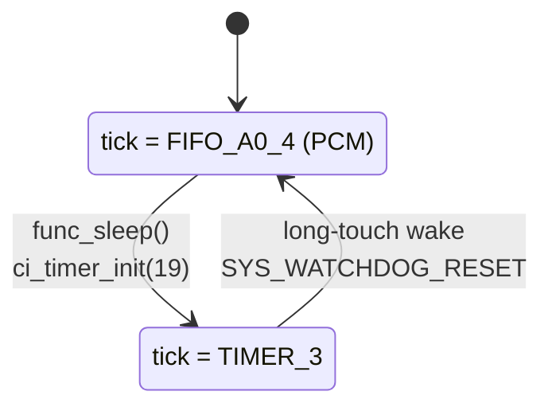

### 3.3 틱이 의미하는 최소 지연

- CFX 가 한 필드를 써서 CM3 가 그 값을 "반응" 하기까지 **최대 1 msec + CM3의 메인 루프 처리 시간**.
- 3-way 핸드셰이크는 **최소 3 × 1 msec = 3 msec**, 실제로는 CM3의 무거운 단일-스텝(맵 로드 등) 까지 합쳐 **5~7 msec**.

---

## 4. 공유 메모리 접근 매트릭스 (Writer × Reader)

CFX 측 구조체 정의는 `src/1__cfx/environment/shared_memory.h`, CM3 측 접근은 대부분 `src/2__cm3/systemControl/cfx_cm3_shared_Memory_Addr.h` (주소 매크로) 및 `src/2__cm3/Cortex-M3-src/systemControl/cfx_cm3_sharedMemory.c` (wrapper API) 를 경유한다.

| 그룹 | 필드 | Writer (CFX) | Reader (CFX) | Writer (CM3) | Reader (CM3) | 메모 |
|---|---|:-:|:-:|:-:|:-:|---|
| 부팅 | `is_CFX_started` | ★ `main.c:47` | – | – | ★ `main.c:391` | 단방향 CFX→CM3 |
| 부팅 | `is_enabled_CFX_iteration` | – | ★ `main.c:49` | ★ `main.c:408` | – | 단방향 CM3→CFX |
| 부팅 | `CFX_EEPROM_data_is_Loaded` | (FS 로드 후 CM3) | (현재 미참조) | ★ bootloader + `main.c:384` | `main.c:134` via `isUserSettingValueLoaded_CFX` | 초기값 0 |
| 에러 | `CFX_ErrorCode` | (미사용) | – | – | `error.c` | 필드만 유지 |
| 충전 | `chargerState.chargerConnectorPluggedIn` | – | ★ `main.c:153` (live stim 가드) | ★ `cfx_cm3_sharedMemory.c:66` `readUsbConnectorState` | `systemControl.c:44` `NRF_On_OFF` | CM3가 GPIO 읽어 공유 |
| 충전 | `chargerState.carryingCasePluggedIn` | – | – | ★ 동일 writer | 가속도 ISR 분기 | – |
| 충전 | `chargerState.carryingCaseCoverOpen` | – | – | ★ 동일 writer | 가속도 ISR 분기 | – |
| PCM | `cfx_PCM_interface.PCM_mode` | `driver_PCM.c:69` (Preamble→NopStandby 자동), `driver_PCM.c:105` (Specific→next) | ★ `main.c:139` | ★ `changePcmOutputMode()` | `readCurrentPcmOutputMode()` | **양방향 writer 주의** |
| PCM | `cfx_PCM_interface.PCM_mode_next` | – | `driver_PCM.c:105` | ★ `changeNextPcmOutputMode()` | – | Specific 후 복귀용 |
| PCM | `cfx_PCM_interface.PCM_specificBuffer[24]` | – | `driver_PCM.c:97` | ★ `fillSepcificCommndBuffer()` | – | – |
| PCM | `cfx_PCM_interface.Reset_PCM` | ★ `fn_reset_PCM` → 0 | – | ★ 1 로 세팅 | – | request/ack |
| PCM | `cfx_PCM_interface.conneded_ISDCheckPCM_state` | ★ `driver_PCM_liveStimulation.c` 0/1/2 | – | – | ★ ISD check polling | 오타 유지 |
| PCM | `cfx_PCM_interface.PCM_liveStimulationTemplate[24]` | – | – | – | – | **완전 미사용** |
| I2C | `cfx_i2c_interface.*` | – | – | ★ `driver_cfx_i2c.c` | ★ 동일 | CM3→CFX i2c 프록시 |
| ISD | `connected_ISD_num` | – | ★ `system_control.c:44` | ★ `changeConnected_isd_num_CFX` | `main.c:144` via `readProgramMapNum` | – |
| ISD | `connected_ISD_Map_info.*` | – | – | ★ 초기 ISD 열거 | UI 표시 | – |
| ISD | `cfx_ISD_info[4]` | – | – | ★ `cfx_cm3_sharedMemory.c:347` | 로깅 | – |
| 사용자 | `userSettingValue.mapNum` | – | ★ `nonlinearMapping.c:170` (live 맵 중 분기) | ★ `changeProgramMapNum` | UI | – |
| 사용자 | `userSettingValue.stimulVolume` | – | ★ `system_control.c:119,136` | ★ `changeStimulVolume` | – | ±1 ~ ±10 |
| 사용자 | `userSettingValue.audioVolume` | – | ★ `system_control.c:137` | ★ `changeAudioVolume` | – | – |
| 사용자 | `userSettingValue.indicatorLED_OnOff` | – | – | ★ 리모콘 | – | – |
| 사용자 | `userSettingValue.indicatorStimul_OnOff` | – | `nonlinearMapping.c:164` 분기 | ★ 리모콘 | – | – |
| 사용자 | `userSettingValue.teleCoil_OnOff` | – | – | ★ 리모콘 | – | – |
| 사용자 | `userSettingValue.Ble_Onff` | – | – | ★ 리모콘 | – | 오타 유지 |
| 사용자 | `userSettingValueLoadedFlag` | ★ `system_control.c:165,227` | – | – | ★ `main.c:134` | CFX가 "읽었다" 신호 |
| 맵 | `currentMapData.{strategy,...,T_level_uA[],C_level_uA[],xMin[],xMax[]}` | – | ★ `copy_MappingData` | ★ `fn_from_cfx_eeprom_read.c:75` | – | 맵 변경 시 |
| 맵 계산 | `calculatedStimulPara_byCM3.T_level_255[32]` | – | ★ `nonlinearMapping.c:200` | ★ `stimulationParaCal.c:604` | FPGA 세팅 | uA→255 |
| 맵 계산 | `calculatedStimulPara_byCM3.C_level_255[32]` | – | ★ `nonlinearMapping.c:201` | ★ `stimulationParaCal.c:605` | – | – |
| 맵 계산 | `calculatedStimulPara_byCM3.frameNumPerChannel` | – | ★ `stimulationStrategy.c:30` | ★ `stimulationParaCal.c:592` | DMA 세팅 | 펄스폭 기반 |
| 맵 계산 | `calculatedStimulPara_byCM3.transferableFrameNum` | – | ★ 동일 | ★ `stimulationParaCal.c:593` | – | 24 frame 기준 |
| 지시 | `calculatedStimulationIndcator_byCM3.indicatorStimulLevel_255` | – | ★ `nonlinearMapping.c:190` | ★ `setCalculatedStimulationIndcatorLevel_byCM3` | – | – |
| 지시 | `calculatedStimulationIndcator_byCM3.indicatorStimulOutput_OnOff_Coltroled_byCM3` | – | ★ `nonlinearMapping.c:164` | ★ `setStimulationIndcatorOnOff_byCM3` | – | 오타 `Coltroled` |
| 피드백 | `currentOutputStimulLevel_255[32]` | ★ `nonlinearMapping.c:154`, `main.c:262,269,289,296` | – | – | ★ 이퀄라이저 UI | **30/31 자극값 + I2S 디버그 오염 혼용** |
| 맵 변경 | `mapChangeFlag.cm3Command_mapChange` | ★ `system_control.c:87` ← 0 | ★ `system_control.c:60` | ★ 1 세팅 (CM3) | – | request |
| 맵 변경 | `mapChangeFlag.cfx_Reloaded_MapdataFlag` | ★ `system_control.c:84` ← 1 | – | – | ★ polling | ack #1 |
| 맵 변경 | `mapChangeFlag.cm3_audioParameterCalculationDone_Flag` | ★ `system_control.c:112` ← 0 | ★ `system_control.c:94` | ★ `setFlag_AudioParametersCalculationDone_Cm3ToCfx` | – | ack #2 |
| 시스템 | `systemShare.system_opMode` | – | – | – | – | **완전 미사용** (주석: "지울 것") |
| 시스템 | `systemShare.powerButton_pushed_CFX_to_CM3` | (set 지점 미발견) | – | – | `batteryNPowerControl.c`, main | – |
| 시스템 | `systemShare.batteryLevel_CfX_to_CM3` | – | – | – | – | **미사용 "CM3에서 제어한 이후"** |
| 시스템 | `systemShare.consumptionPowerControl_Command_CM3_to_CFX` | – | (set 지점 미발견) | ★ batt module | – | – |
| 시스템 | `systemShare.enter_ULP_mode_Command_CM3_to_CFX` | ★ `main.c:235` ← 0 | ★ `main.c:128` | ★ `main.c:702` ← 1 | ★ `main.c:714` polling | CM3가 1→ CFX가 0 |
| FLASH | `ReadWriteCommand_ForFlash.*` | – | – | ★ `setReadWriteMapDataFlashCommand` | ★ `isd_interface_mapping_readWrtieMapData.c` | CM3 내부만 사용 |
| FLASH | `repositoryForReadWriteMapData.*` | – | – | ★ `fn_from_cfx_eeprom_read.c` | ★ 동일 | CM3 내부 staging |
| Backtel | `backtelControlRegister` | ★ `driver_PCM_liveStimulation.c:42,220` | ★ 동일 | ★ `updagteBacktelControlValue_toCFX` | ★ FPGA 상태 | **양쪽 write 있음** |
| BLE | `isMappingProgramConneted` | – | ★ `system_control.c:208,218` | ★ `shareMappingProgramConnection` | – | – |
| 감지 | `earpieceDetecion` | – | – | ★ `updateEarpieceDetectionValue_toCFX` | 진단 | 오타 `Detecion` |
| 감지 | `maxAudioInput` | ★ `agc.c:105` | – | – | ★ `readAudioSignalMax` (이퀄라이저) | – |
| 상태 | `CM3_status` | – | – | ★ `update_CM3Status_toCFX` (main_counter) | – | 디버그 |
| 상태 | `CM3_tempValue1/2` | `#if 0` 디버그 | – | (디버그) | – | – |
| Mute | `is_enabled_mute_stimulation_under_t_level` | – | ★ `nonlinearMapping.c:129`, `stimulationStrategy.c:393` | ★ `ci_stim_mute.c:127` | `remoteControl.c:1369` | **두 해석 불일치** |
| Mute | `mute_stimulation_t_level_offset` | – | ★ `nonlinearMapping.c:130` | ★ `ci_stim_mute.c:128` | – | – |
| PCM race | `is_pcm_specific_command_reading` | ★ `driver_PCM.c:90,107` | – | – | ★ `isd_interface_mapping_SepcificStimulation.c:516` | **CM3의 `changePcmOutputMode`는 polling 안 함** |
| PCM race | `pcm_specific_command_read_index` | ★ `driver_PCM.c:100` | – | – | ★ 동일 | – |

범례: ★ = 주요 writer/reader · 같은 필드에 ★가 양쪽에 있으면 race 가능성 주시.

---

## 5. 핵심 시퀀스 다이어그램 8종

### 5.1 맵(프로그램) 변경 — 3-way 핸드셰이크 (약 4~7 msec)

현재 구조의 **가장 긴** 시퀀스. BLE 리모콘으로 프로그램을 바꾸거나 내부기 연결 시 실행된다.

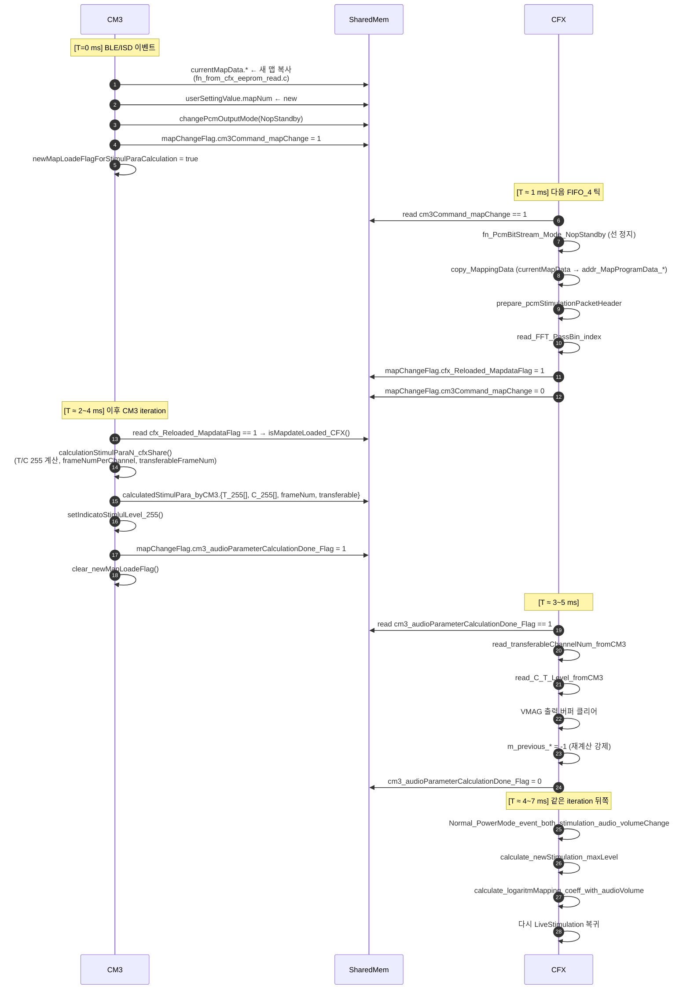

**핵심 관찰**

- CFX ↔ CM3 이 **공을 세 번 주고 받는다** : `cm3Command_mapChange=1` → `cfx_Reloaded=1` → `Done=1` + 최종 recalc.
- 중간에 CM3가 **약 수백 μs ~ 2 msec** 간 T/C 255 계산에 시간을 쓰기 때문에 실제 체감 지연은 3 msec 넘어간다.
- 이 기간 동안 CFX 는 `NopStandby` 패킷만 FPGA 로 송신 → **자극 공백**이 발생.

### 5.2 볼륨 변경 (1~2 msec)

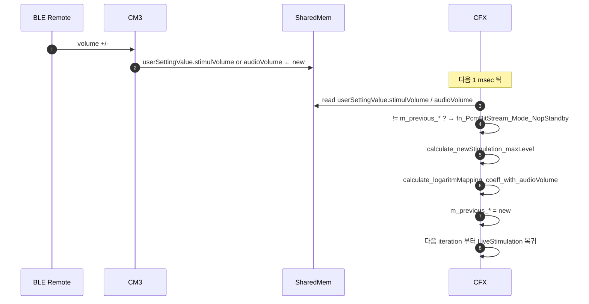

> **현재 상태** : 핸드셰이크 없이 CFX 가 polling 하는 단순 구조. CM3 는 "요청" 이후 ack 를 기다리지 않고 바로 다음 동작으로 간다. 이건 **좋은 설계**다.

### 5.3 자극 지시(Indicator) — 80 msec × 3회

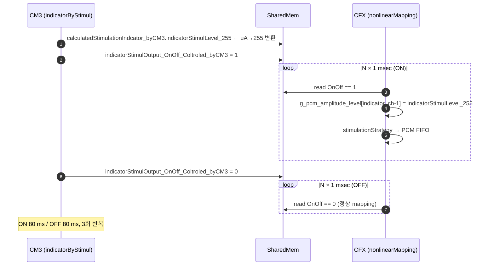

### 5.4 SpecificCommand — 레이스 위험 구조 (1 msec)

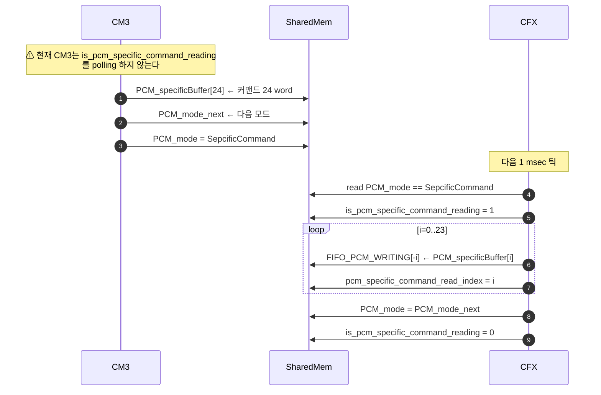

> **⚠ Rev.0 에서 제기한 race** 가 여기서 확인된다. CM3 의 `changePcmOutputMode()` 는 단순히 `PCM_mode = newMode` 만 수행하고 **플래그 대기 로직이 없다**. CFX 가 버퍼를 읽는 도중 CM3 가 이미 다음 특수 커맨드를 쓰면 read_index 와 실제 버퍼가 엇갈린다.

### 5.5 ISD 연결 감지 / 해제 (1~2 msec)

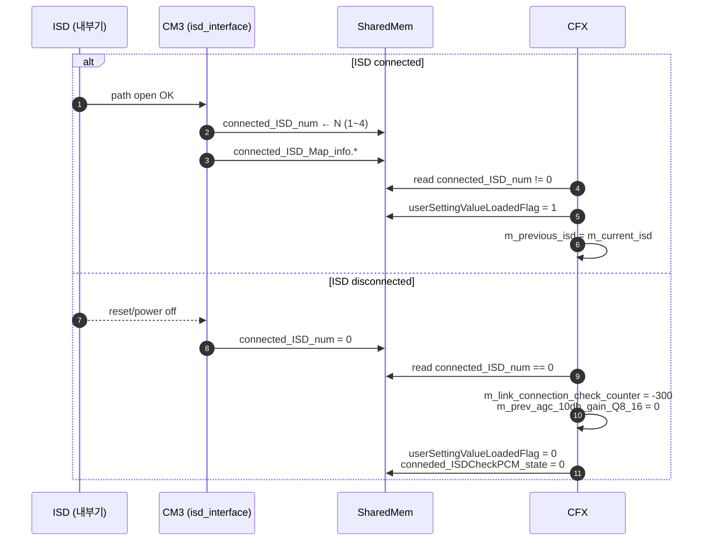

### 5.6 ISD 연결 유지 확인 (백텔, 300 msec 주기 · 3 msec 실행)

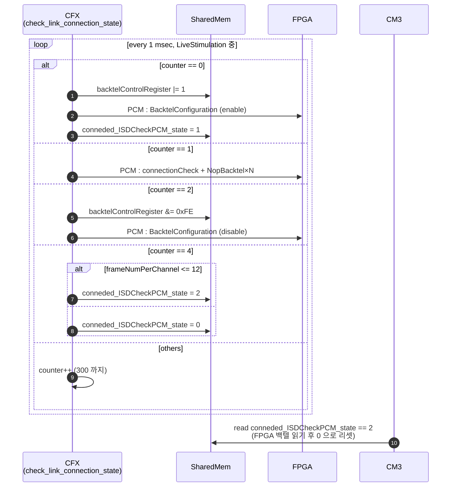

### 5.7 ULP 진입 / 복귀 (수백 msec ~)

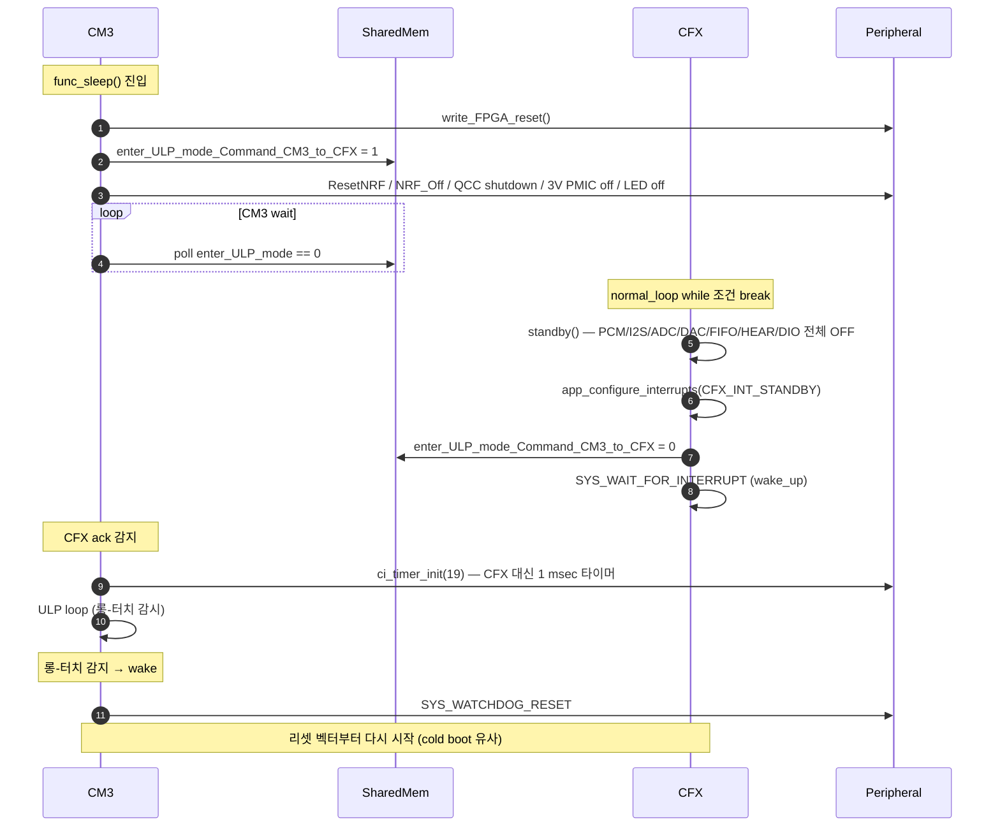

> **ULP 탈출은 watchdog reset** 을 사용한다(`main.c:768, 836`). 즉 "복귀" 라기보다 **완전한 리부트** 이다. shared memory 는 `func_sleep()` 끝에 `memset(...)` 으로 전부 0 처리된다.

### 5.8 신호처리 1 msec 라운드 (정상 동작 중)

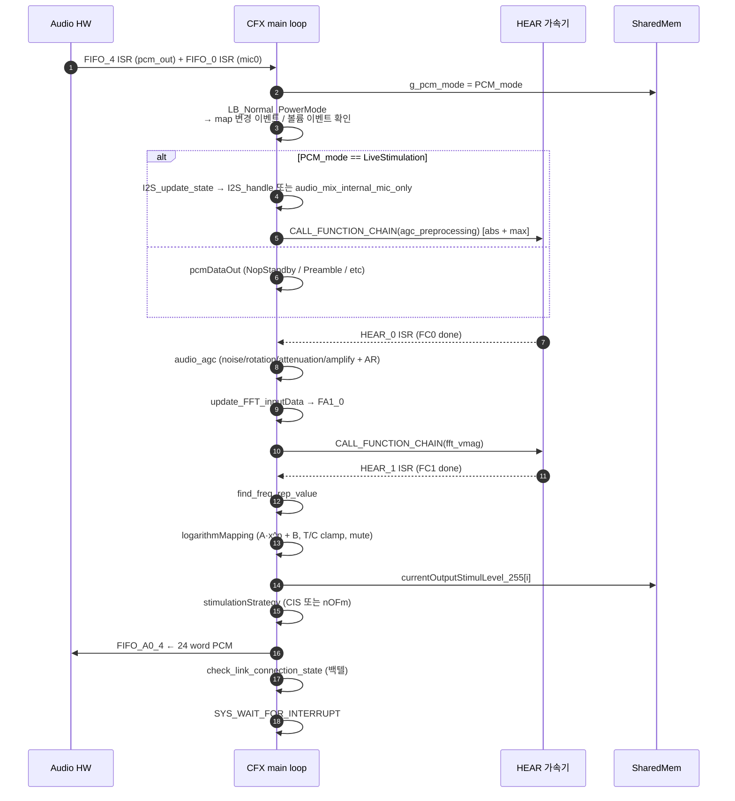

---

## 6. 신호처리 파이프라인 (전체 데이터 흐름)

```mermaid
flowchart LR
    DMIC0[DMIC0 EZ<br/>ADC1] --> FA00[FIFO_A0_0]
    DMIC1[DMIC1 QCC<br/>ADC2] --> FA01[FIFO_A0_1]
    I2Sin[I2S slave<br/>PCM1 RX] --> FA05[FIFO_A0_5]

    FA00 --> Mix[audio_mixer<br/>>>5 & 합산]
    FA05 --> Mix
    Mix --> HAM[HEAR_ADDR_AUDIO_MIX]

    HAM --> FC0[HEAR FC0<br/>abs + max]
    FC0 --> HAMMAX[AUDIO_MIX_ABS_MAX]
    HAMMAX --> AGC[audio_agc<br/>calc+AR+apply]
    AGC --> AGCOUT[m_agc_output_buffer]

    AGCOUT --> FFTIN[FIFO_A1_0]
    FFTIN --> FC1[HEAR FC1<br/>Win-DFT + vMag]
    FC1 --> VMAG[VMAG_OUTPUT 256 bin]

    VMAG --> FREQ[find_freq_rep_value<br/>pass_bin → 32 그룹 max]
    FREQ --> LOG[logarithmMapping<br/>A·x^p+B clamp mute]
    LOG --> AMP[g_pcm_amplitude_level 32]
    AMP -->|공유| SHMEQ[currentOutputStimulLevel_255]

    AMP --> STRAT{stimulation<br/>Strategy}
    STRAT -->|CIS| CIS[CIS loop]
    STRAT -->|nOFm| NOFM[nOFm P0/P1]
    CIS --> FA04[FIFO_A0_4 PCM out]
    NOFM --> FA04
    FA04 --> FPGA[FPGA / ISD]

    LOG -.경로.-> INDIC[indicator CH 덮어쓰기]
    CM3cal[CM3 stimulationParaCal] -.공유.-> LOG
```

---

## 7. 타이밍 버짓 요약표

(정상 LiveStimulation 모드 기준, 1 msec = 1 tick)

| 이벤트 | 필요 tick | 실제 ms | 병목 |
|---|:-:|:-:|---|
| 부팅 — CFX 진입 ↔ CM3 감지 | 1 | ~1 ms | CM3 polling loop |
| 부팅 — CM3 Initialize() | – | 수백 ms~수 s | 파일시스템, QCC, BLE |
| **맵 변경 3-way 핸드셰이크** | **3~5** | **3~7 ms** | **CM3 T/C 255 계산 (수백 μs)** |
| 볼륨 변경 | 1~2 | 1~2 ms | 단순 polling |
| Indicator on/off 1회 | ~80 | 80 ms | 의도된 지속 시간 |
| SpecificCommand 1회 | 1 | 1 ms | – (race 위험) |
| ISD 연결 감지 | 1~2 | 1~2 ms | – |
| 백텔 사이클 1회 | 4 / 300 | 4 ms / 300 ms 주기 | 의도된 주기 |
| ULP 진입 (CM3→CFX ack) | 1 | 1 ms | – |
| ULP 복귀 | – | 리셋 | watchdog reset |
| **신호처리 1 msec 라운드** | **1** | **≈ 400~600 μs** | FFT+vMag 216 μs |

---

## 8. 시퀀스 축소 · 개선 제안

### 8.1 ★★★ 맵 변경 3-way → 2-way 로 축소 (−2 msec)

현재:

```
CM3: command=1          │ tick 0
CFX: copy + ack(reloaded=1)       │ tick 1
CM3: calc + done=1                │ tick 2~4
CFX: apply + done=0               │ tick 3~5
```

제안: **CM3가 맵을 쓸 때 T/C 255 와 frameNum 도 같이 써서** 한 번에 전달.

```
CM3: 맵 + T/C 255 + frameNum + command=1   │ tick 0
CFX: copy + apply + ack(reloaded=1)        │ tick 1
```

구현 순서:

1. CM3 에서 `changeProgramMapNum()` 직후 **`calculationStimulParaN_cfxShare()` 를 동기적으로 먼저 수행** (현재는 CFX 의 `cfx_Reloaded=1` 을 기다린 뒤에 수행).
2. 모든 파라미터를 한 번에 `currentMapData.*` + `calculatedStimulPara_byCM3.*` 에 쓴 뒤 `cm3Command_mapChange=1`.
3. CFX 의 `Normal_PowerMode_event_mapChange()` 에 `read_C_T_Level_fromCM3()` + `read_transferableChannelNum_fromCM3()` 를 병합.
4. `cm3_audioParameterCalculationDone_Flag` 는 제거 (3 플래그 → 2 플래그).

**효과** : 자극 공백 구간이 3~7 ms 에서 1~3 ms 로 단축. 맵 전환 품질 ↑.

**주의** : CM3 가 `calculationStimulParaN_cfxShare()` 를 **`stimulationStandAlone()` 에서가 아니라 `changeProgramMapNum()` 경로에서** 호출하도록 구조 변경 필요. `newMapLoadeFlagForStimulParaCalculation` 의 수명 재정의.

### 8.2 ★★★ SpecificCommand 레이스 보호 완성

CM3 의 `changePcmOutputMode()` 를 다음으로 교체:

```c
void changePcmOutputMode(int mode)
{
    if (mode == PcmBitStream_Mode_SepcificCommand)
    {
        // CFX 가 이전 specific 버퍼를 소비 중이면 대기
        while (cfx_cm3_sharedMemoryAll.is_pcm_specific_command_reading == 1)
        {
            __NOP();   // 최대 1 msec
        }
    }
    cfx_cm3_sharedMemoryAll.cfx_PCM_interface.PCM_mode = mode;
}
```

동일하게 `fillSepcificCommndBuffer()` 앞에도 guard 추가.

**효과** : 24 word 커맨드가 중간에 잘리지 않음. 레거시에서 가끔 발생하던 "internal stim chip config 오류" 재현이 사라질 가능성.

### 8.3 ★★ 볼륨 변경 경로 단일화

현재 CFX 의 `Normal_PowerMode_event_stimulationVolumeChange()` 와 `calculate_logaritmMapping_coeff()` (xMin 미적용 버전) 은 호출되지 않는 dead code 지만 여전히 링크된다.

제안:

- `#if 0 / #else` 로 감춰진 구 버전 블록과 두 함수 **완전 삭제**.
- `Normal_PowerMode_event_both_stimulation_audio_volumeChange()` 를 `Normal_PowerMode_event_volumeChange()` 로 리네임.

**효과** : CFX 바이너리 약간 축소, 미래 수정 시 실수로 구 함수 호출 방지.

### 8.4 ★★ Mute enum 통일

현재 `is_enabled_mute_stimulation_under_t_level` 는 `nonlinearMapping.c` 와 `stimulationStrategy_CIS()` 에서 **해석이 다르다**. `1 / 2 / 기타` 3-값 enum 으로 정의하고 한 곳 (`logarithmMapping()`) 에서만 분기, stimulationStrategy 는 `amp == 0` 만 보도록 단순화.

```c
typedef enum {
    MUTE_DISABLED = 2,
    MUTE_ENABLED  = 1,
    MUTE_INVALID  = 0
} EN__MUTE_MODE;
```

**효과** : "정의되지 않은 상태" 에서 CFX/CIS 가 엇갈려 자극 패킷을 보내던 미묘한 버그 제거.

### 8.5 ★★ 공유 메모리 미사용 필드 정리 PR

`shared_memory.h` 안에서 **사용되지 않는 필드**:

- `systemShare.system_opMode` (주석 "지울 것")
- `systemShare.batteryLevel_CfX_to_CM3` (주석 "미사용")
- `cfx_PCM_interface.PCM_liveStimulationTemplate[24]`
- `CFX_ErrorCode` (write 지점 없음)
- `CM3_tempValue1/2` (릴리스 빌드에서 0 고정)

이 필드들은 양쪽 코어가 struct pointer 로 접근하므로 **한 번의 동기 PR로 양쪽 shared_memory 정의를 축소**하면 안전하게 지울 수 있다. **단 CM3 의 `cfx_cm3_shared_Memory_Addr.h` 주소 매크로는 오프셋 기반이므로 동시에 정정해야 함.**

**효과** : 공유 메모리 크기 감소(캐시 효율 거의 무관하지만 디버거에서 구조체 가독성 ↑).

### 8.6 ★★ `currentOutputStimulLevel_255` 디버그 오염 제거

`main.c::I2S_handle` 이 `[0..15]` / `[30]` / `[31]` 을 I2S 상태로 덮어쓰는 문제. `#ifdef DEBUG_I2S` 가드 추가로 릴리스 빌드에서 제외.

**효과** : CM3 이퀄라이저 UI 에 실제 자극 값만 표시되어 진단 정확도 ↑.

### 8.7 ★ Backtel 백텔 공유 레지스터 양방향 write 제거

`backtelControlRegister` 는 CFX (`driver_PCM_liveStimulation.c`) 와 CM3 (`updagteBacktelControlValue_toCFX`) 양쪽에서 write 가능.

- Enable/Disable 시 CFX가 읽고 bit0 만 수정해서 다시 쓰기 때문에 **CM3 가 다른 비트를 수정한 시점과 겹치면 lost update**.
- 제안 : CM3 가 이 레지스터를 직접 쓰지 않도록 하고, **대신 "backtel 초기값 설정 요청"** 플래그를 추가. CFX 만 실제 비트 토글.

### 8.8 ★ dead mic1 인터럽트 해제

`FIFO_1_ISR` (mic1) 은 세팅은 되지만 `normal_loop` 에서 무시된다. `lib_audio_in.c:50` 의 `SYS_FIFO_CFXINTCONFIG(1, FIFO_INT_A0_1)` 를 NONE 로 바꿔 인터럽트 오버헤드 제거.

### 8.9 ★ ULP 복귀 — watchdog reset 대신 정상 복귀

현재 ULP 탈출은 watchdog reset 으로 cold boot. 이로 인해:

- 파일시스템 remount, CFX 재로드 수백 msec.
- "롱터치 → 켜짐" 사이 지연이 체감됨.

제안 : `ci_power_sleep()` / `ci_power_normal()` 경로로 peripheral 을 켜고 끄기만 하도록 리팩토링 (현재 주석처리 되어 있음). 보존할 수 있는 상태(맵 인덱스, ISD 정보 등)를 `.no_init` 섹션으로 옮기거나 FS 에서 즉시 재로드.

**주의** : 이 개선은 안정성 트레이드오프가 크므로 별도 분석 문서로 검토 후 진행 권장.

---

## 9. 부록 : 참조 파일 · 함수 색인

### 9.1 CFX 측 주요 함수

| 함수 | 파일 | 역할 |
|---|---|---|
| `main()` | [1__cfx/systemControl/main.c:13](../src/1__cfx/systemControl/main.c) | 부팅 엔트리, 핸드셰이크 |
| `normal_loop()` | main.c:126 | LiveStimulation 루프 |
| `standby()` | main.c:175 | ULP 진입 시퀀스 |
| `PCM_LiveStimulation_Mode()` | main.c:312 | 입력 믹싱 + FC0 호출 |
| `HEAR_LiveStimulation_Mode()` | main.c:329 | AGC + FFT + mapping |
| `LB_Normal_PowerMode()` | system_control.c:42 | ISD 상태 분기 |
| `Normal_PowerMode_event_mapChange` | system_control.c:57 | 맵 변경 처리 |
| `Normal_PowerMode_event_audioParameterCalculation` | system_control.c:91 | CM3 계산 결과 수신 |
| `Normal_PowerMode_event_both_stimulation_audio_volumeChange` | system_control.c:134 | 볼륨 재계산 |
| `copy_MappingData` | system_control.c:234 | currentMapData → 로컬 |
| `audio_agc` | agc.c:92 | AGC 게인 적용 |
| `update_FFT_inputData` | FrequencyAnalysis.c:32 | FA1_0 로 복사 |
| `find_freq_rep_value` | FrequencyAnalysis.c:45 | 32 그룹 max |
| `logarithmMapping` | nonlinearMapping.c:57 | A·x^p+B + clamp + mute + indicator |
| `calculate_x_power_p` | nonlinearMapping.c:602 | x^0.15 |
| `calculate_newStimulation_maxLevel` | nonlinearMapping.c:206 | 볼륨 1~4 비율 |
| `calculate_logaritmMapping_coeff_with_audioVolume` | nonlinearMapping.c:353 | A/B 재계산 |
| `stimulationStrategy` | stimulationStrategy.c:42 | CIS/nOFm 분기 |
| `stimulationStrategy_nOFm` | stimulationStrategy.c:109 | 상위 16 선별 + 배열 |
| `pcmDataOut` | driver_PCM.c:10 | PCM 모드 분기 |
| `fn_PcmBitStream_Mode_SepcificCommand` | driver_PCM.c:86 | 24 word 주입 |
| `check_link_connection_state` | driver_PCM_liveStimulation.c:9 | 300 msec 백텔 주기 |

### 9.2 CM3 측 주요 함수

| 함수 | 파일 | 역할 |
|---|---|---|
| `main()` | [2__cm3/Cortex-M3-src/main.c:265](../src/2__cm3/Cortex-M3-src/main.c) | 부팅 엔트리, while(1) |
| `func_normal()` | main.c:367 | 정상 메인 루프 |
| `func_sleep()` | main.c:680 | ULP 진입 |
| `update_mapNum()` | main.c:107 | 맵 번호 확인/변경 |
| `enable_iteration()` | main.c:97 | 1 msec 틱 마킹 |
| `CFX_0_IRQHandler` / `FIFO_5_IRQHandler` | driver_timmer.c:10 | PCM 틱 → enable_iteration |
| `changePcmOutputMode` | cfx_cm3_sharedMemory.c:214 | PCM_mode 쓰기 (⚠ race 미보호) |
| `changeNextPcmOutputMode` | cfx_cm3_sharedMemory.c:219 | PCM_mode_next 쓰기 |
| `fillSepcificCommndBuffer` | cfx_cm3_sharedMemory.c:224 | Specific 24 word 쓰기 |
| `changeProgramMapNum` | cfx_cm3_sharedMemory.c:468 | mapNum + cm3Command_mapChange=1 |
| `isMapdateLoaded_CFX` | cfx_cm3_sharedMemory.c:262 | cfx_Reloaded_MapdataFlag 읽기 |
| `setFlag_AudioParametersCalculationDone_Cm3ToCfx` | cfx_cm3_sharedMemory.c:315 | Done=1 |
| `calculationStimulParaN_cfxShare` | stimulationParaCal.c:571 | T/C 255 + frameNum 계산 |
| `stimulationStandAlone` | isd_interface_stimulationStandAlone.c:55 | Normal 자극 FSM |
| `isd_interface` | isd_interface.c (다수) | PowerIC → FPGA → ISD path → 10V OK FSM |
| `ci_timer_init` | ci_timer.c:143 | ULP 용 TIMER_3 설정 |
| `snd_qcc_set_mode` | snd_qcc.c | QCC 제어 |
| `iqs323_proc` | main.c:316 | 100 ms 주기 터치 처리 |

### 9.3 공유 메모리 루트

- 구조체 정의 : `src/1__cfx/environment/shared_memory.h:178~219` (`ST__CFX_CM3_SharedMemory_ALL`)
- CFX 측 매크로 : `Addr_SharedMem = (volatile ST__CFX_CM3_SharedMemory_ALL *) 0x28000`
- CM3 측 베이스 : `DSP_PRAM5_REMAP_BASE`, 접근 wrapper : `2__cm3/Cortex-M3-src/systemControl/cfx_cm3_sharedMemory.{c,h}`
- CM3 오프셋 기반 매크로 (레거시 BTE 시대) : `2__cm3/systemControl/cfx_cm3_shared_Memory_Addr.h`

---

## 10. 작성자 주

본 문서는 정적 분석 결과이며 **실측 타이밍은 로직 분석기 또는 HW GPIO 토글을 이용한 프로파일링으로 검증** 필요. §8 의 개선안 중 8.1(맵 변경 2-way) 와 8.2(Specific race) 는 즉시 착수 가능한 작은 PR 단위이다.

이후 Rev.2 에서는 다음을 보강할 예정:

- FFT window 계수 로드 시퀀스 (FS 메모리 ↔ HEAR 메모리)
- eCAP 측정 시퀀스 (현재 코드에서 거의 주석 상태)
- BLE mapping app Live 모드의 실시간 맵 갱신 세부 경로
