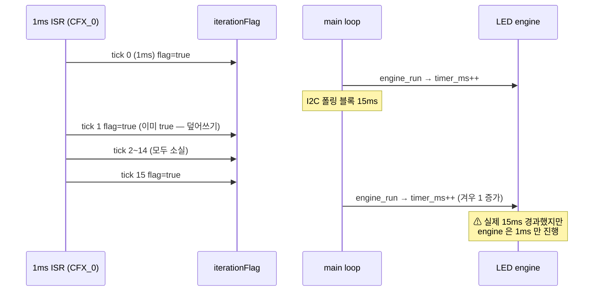
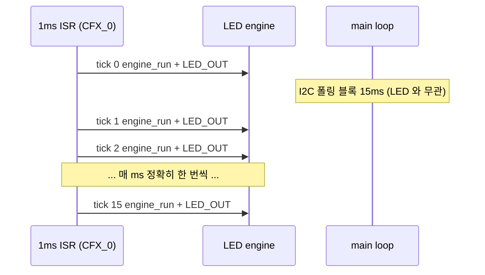
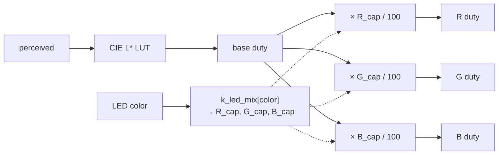

# LED 색감·타이밍 보강 요구사항

작성자: 김은수
작성일: 2026-04-23
상태: 리뷰 대기
근거: 사용자 지시 — Dimming Rev.0 의 비목표 (RGB 색감 보정) + fade 타이밍·ISR 일관성
선행 문서:
- [`[요구사항] LED 인지 기반 Dimming Rev.0`]([요구사항]%20LED%20인지%20기반%20Dimming%20Rev.0%20by%20김은수.md)
- [`[구현계획] LED 인지 기반 Dimming Rev.0`]([구현계획]%20LED%20인지%20기반%20Dimming%20Rev.0%20by%20김은수.md)

---

## 1. 배경

현 LED 구현에 3가지 한계가 동시에 드러남:

### 1.1 RGB 색감 편향

회로 물리적 제약 (저항 1.2K 공통 + 3.3V + LRTBR48G) 과 LED 효율·Vf 차이로 각 채널 밝기 불균형:

| # | 원인 | 영향 |
|---|---|---|
| C1 | Vf 차이 — R(~1.9V), G(~3.0V), B(~3.2V) | 채널별 전류 크게 다름 |
| C2 | 발광 효율 차이 — LRTBR48G R=560 / G=900 / B=200 mcd (20mA) | 같은 전류에도 밝기 다름 |
| C3 | 3.3V 헤드룸 부족 (G/B) | Vf 편차 · 온도로 전류 불안정 |

사용자 실측: **ORANGE (R+G) 조합이 연두색 (G-dominant) 으로 보임**. 단순 per-channel gain 으로는 조합색마다 색감 독립 튜닝 불가.

### 1.2 Fade 상한이 긴 패턴에서 과도

현 `LED_DIMMING_FADE_MAX_MS = 150ms` · fade = `min(on_ms/3, 150)`:

| 패턴 | on_ms | 현 fade | 현 peak | 비고 |
|---|---|---|---|---|
| **POWER_ON** | **80 ms** | **26 ms** | **26 ms** | **가장 짧은 ON 패턴** |
| POWER_OFF | 100 ms | 33 ms | 33 ms | |
| MAPPING_ISD_BATT_LOW | 100 ms | 33 ms | 33 ms | |
| ERROR_* | 180 ms | 60 ms | 60 ms | |
| PAIR | 500 ms | 150 ms | 200 ms | fade 과도 |
| BATT_CRITICAL | 1100 ms | 150 ms | 800 ms | fade 과도 |

긴 패턴은 fade 150ms 가 peak 대비 상대적으로 짧지만 **절대값** 으로는 과도 (체감 둔화). 가장 짧은 POWER_ON 80ms 는 /3 룰 자동 축소로 fade 26ms 가 최솟값 — 여기에 후술 타이밍 왜곡 (1.3) 이 겹치면 peak 미도달 위험.

### 1.3 iterationFlag 메커니즘의 타이밍 손실

현 구조: 정상 동작 시 **`CFX_0_IRQHandler`** (`driver_timmer.c`) 가 매 1ms `iterationFlag = true` 설정 → main loop 가 처리. (`TIMER_3_IRQHandler` 는 ULP 모드 전용 fallback.) 하지만 **I2C/EEPROM 폴링 블록 (수~수십 ms) 이 발생하면** iterationFlag 은 단순 bool 이라 다중 tick 이 하나로 합쳐지고, LED engine 의 `timer_ms++` 도 1회만 진행 → **fade 타임라인이 비연속 jitter**.

→ 짧은 패턴 (POWER_OFF 100ms) 은 jitter 로 peak 이 사라지거나 LED 가 깜빡이듯 보일 수 있음.

---

## 2. 요구사항

### 2.1 단일색 밝기 자연스러움

R, G, B 각각 단일 ON 에서 체감 색상이 의도와 일치. (균등 밝기 필수 아님 — 자연스러운 "빨강/녹색/파랑" 인식이면 충분)

### 2.2 조합색 색감 교정 — 색상별 독립 PWM cap

각 조합색 (`ORANGE`, `SKYBLUE`, `PURPLE`, `WHITE`) 에 대해 **R/G/B 채널별 최대 PWM duty 독립 설정** 가능.

| 색상 | 현 체감 | 목표 체감 |
|---|---|---|
| ORANGE (R+G) | **연두색** | **주황색** (R 우세) |
| SKYBLUE (G+B) | 추후 실측 | 시안 |
| PURPLE (R+B) | 추후 실측 | 마젠타 / 보라 |
| WHITE (R+G+B) | 추후 실측 | 백색/미색 (편향 없음) |

→ ORANGE 연두색 → 주황색 은 사용자 명시 피드백.

### 2.3 Fade 상한 80ms 로 단축

fade-in/out 이 **80ms 이내** 에 완료. 즉 `LED_DIMMING_FADE_MAX_MS : 150 → 80`.

**/3 룰은 그대로 유지** — fade = `min(on_ms/3, 80)`. 따라서 상한 80 은 **길이 상한** 일 뿐, 짧은 패턴은 `on/3` 으로 자동 축소 (POWER_ON 80ms 에서도 fade 26ms 유지, 충돌 없음).

영향:
- POWER_ON (on=80ms) : fade 26ms — /3 룰 지배, 변화 없음
- POWER_OFF (on=100ms) : fade 33ms — 변화 없음
- PAIR (on=500ms) : fade 150→80ms, peak 200→340ms (peak 길어짐)
- BATT_CRITICAL (on=1100ms) : fade 150→80ms, peak 800→940ms
- Cross-fade (색 전환) : 각 phase 150→80ms, 전체 전환 300→160ms (snappy)

### 2.4 LED arbiter/engine/PWM 을 1ms ISR 로 이동

LED 처리 (`led_arbiter_tick()` = arbiter + engine + LED_OUT) 를 **1ms tick ISR 에서 직접 호출**. main loop 의 iterationFlag 경로 제거.

1ms tick ISR:
- 정상 모드: `CFX_0_IRQHandler` (`driver_timmer.c`) — 주요 소스
- ULP 모드: `TIMER_3_IRQHandler` (`ci_timer.c`, 500ms) — fallback

근거:
- I2C/EEPROM 폴링 블록 시에도 LED timing (fade, PWM) 이 1ms 정밀도 유지
- ISR 실행시간 추정 ~15μs @ 30.72MHz / ~60μs @ 7.68MHz → 1ms 예산 1.5~6% (여유)
- shared state (`s_req[]`, `s_pair_latch_until_tick`, `LED_outputColor` 등) 모두 Cortex-M3 에서 원자 접근 범위

### 2.5 turnOffLED race 방지

`turnOffLED()` 은 수동 fade (main loop, blocking) → ISR engine 과 shared state 경쟁. 해결: ISR 에서 engine/LED_OUT 일시 정지 플래그 도입 (`s_led_isr_suspended`).

### 2.6 Dimming Rev.0 호환

기존 CIE 1931 L\* 곡선, 패턴별 자동 fade, cross-fade 아키텍처 유지. 색상 cap 은 dimming 결과 **뒤에 post-LUT 적용**.

### 2.7 컴파일 타임 튜닝

색상별 R/G/B cap 은 compile-time `static const` 테이블. 런타임 UI 조정은 범위 외.

### 2.8 수용 기준

- [ ] R / G / B 단일 — 의도한 색 자연스럽게 인식
- [ ] **ORANGE 가 주황색** (연두색 아님)
- [ ] WHITE / SKYBLUE / PURPLE 색편향 허용 범위 내
- [ ] POWER_ON (on=80ms, 최단) fade 26ms · peak 26ms 유지, peak 도달
- [ ] POWER_OFF (on=100ms) fade 33ms 유지, peak 도달
- [ ] PAIR / BATT_CRITICAL 등 긴 패턴 fade 80ms, peak 길어짐
- [ ] 색상 전환 160ms 로 snappy
- [ ] I2C/EEPROM 폴링 블록 중에도 fade/PWM 부드러움 유지 (시각 jitter 없음)
- [ ] `turnOffLED()` 정상 동작 (ISR engine 과 경쟁 없음)

---

## 3. 비목표

- HW 변경 (저항, 전압, boost 등) — 범위 외
- PWM 단계 수 증가 (`LED_DIMMING_PWM_STEPS = 10`) — 유지
- 런타임 (UI) 으로 cap / fade 조정 — compile-time 만
- 색좌표 (xy / CCT) 기반 정밀 색 교정 — 육안 매칭 수준
- Timer 3 tick 주기 변경 (1ms 유지) — PWM 해상도 향상은 후속

---

## 4. 제약

- 저항 1.2 kΩ × 3, 공급 3.3V_STBY 고정
- PWM 단계 10 steps → cap 해상도 10% 단위
- ISR 실행시간 ≤ 100μs (1ms 주기의 10% 이하 권장)
- Flash 추가: cap 테이블 24 byte + 플래그 몇 byte
- `driver_timmer.c` 의 `CFX_0_IRQHandler()` + `ci_timer.c` 의 `TIMER_3_IRQHandler()` 수정 (LedOutput.h 참조 추가)

---

## 5. 참고

- [LRTBR48G datasheet (OSRAM)](https://look.ams-osram.com/m/41504eadb60aa7b1/original/LRTB-R48G.pdf)
- `LedOutput.c` 현 구현 — Dimming Rev.0 cross-fade
- `driver_timmer.c:10` — `CFX_0_IRQHandler` (정상 모드 1ms tick)
- `ci_timer.c:17` — `TIMER_3_IRQHandler` (ULP 모드 fallback)
- `main.c:546` — 현 `led_arbiter_tick()` 호출 지점
- [Additive color mixing — Wikipedia](https://en.wikipedia.org/wiki/Additive_color)

---

## 6. 시각화

### 6.1 iterationFlag 타이밍 손실

### 6.2 ISR 이동 후

### 6.3 색상별 cap 구조

