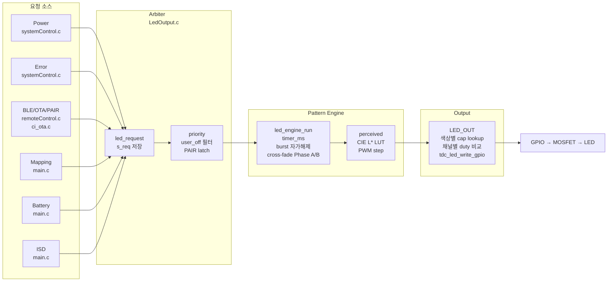

# LED 시스템 기술 문서 — 아키텍처 · 운용

작성자: 김은수
최종 갱신: 2026-04-23

본 문서는 E8300 외부기기의 **RGB LED 인디케이터 시스템** 전반을 서술한다. 설계 철학, 계층 구조, 상태/소스 정의, arbiter 우선순위, 소스별 요청 규칙, 부팅·절전 시퀀스, ISR 구동, 디버그 도구까지 포괄한다.

Dimming 엔진 내부 (CIE L* LUT, fade 곡선) 는 별도 문서 [`[참고] LED 시스템 — Dimming · 인지 곡선 · LUT`]([참고]%20LED%20시스템%20—%20Dimming%20·%20인지%20곡선%20·%20LUT.md) 참조. 색감 교정 (per-color cap 테이블) 은 [`[참고] LED 시스템 — 색감 관리 · 회로 보정`]([참고]%20LED%20시스템%20—%20색감%20관리%20·%20회로%20보정.md) 참조.

---

## 1. 개요

### 1.1 목적

기기 상태 (전원, 에러, BLE, 매핑, 배터리, ISD 연결 등) 를 사용자에게 RGB LED 1 개로 표시한다. 여러 소스가 동시에 LED 를 점유 시도할 수 있으므로 **Arbiter (중재자)** 가 우선순위에 따라 하나만 선택한다.

스펙 원본 사진: [`docs/led_ind_state.JPG`](led_ind_state.JPG)

### 1.2 하드웨어

- **LED IC**: OSRAM LRTBR48G (3-in-1 RGB LED, PLCC-4)
- **회로**: 공통 3.3V_STBY + 채널별 저항 1.2 kΩ + N-MOSFET (PMH550UNEH) low-side switching
- **GPIO 극성**: Active HIGH (Board_OTE_ver1_5 기준). MCU 핀 HIGH → MOSFET ON → LED 발광
- **PWM**: 소프트웨어 PWM. CFX 1 ms tick × 10 step = 100 Hz 주기

상세 회로·LED 특성 · 색감 보정은 [색감 관리 문서](#) 참조.

### 1.3 레이어 아키텍처



**구동 루프**: CFX 1 ms 인터럽트 ISR 이 `led_arbiter_tick()` 을 직접 호출 — arbiter + engine + LED_OUT 을 전부 ISR 컨텍스트에서 실행. main loop 의 I2C/EEPROM 폴링 블록으로 인한 타이밍 jitter 와 분리 ([§9 ISR 구동](#9-isr-구동)).

### 1.4 파일 구성

| 파일 | 역할 |
|---|---|
| `src/2__cm3/Cortex-M3-src/systemControl/LedOutput.h` | 공개 타입·함수 선언 (상태 enum, 색상 enum, pattern desc, API) |
| `src/2__cm3/Cortex-M3-src/systemControl/LedOutput.c` | Arbiter · Engine · LED_OUT · turnOffLED · led_force_fade_off |
| `src/2__cm3/Cortex-M3-src/systemControl/driver_timmer.c` | CFX_0_IRQHandler (주 1ms tick) → led_arbiter_tick 호출 |
| `src/2__cm3/Gen1_5/common/ci_timer.c` | TIMER_3_IRQHandler (ULP 모드 fallback) → led_arbiter_tick 호출 |
| `src/2__cm3/Cortex-M3-src/main.c` | 소스별 led_request 호출 (battery, ISD, mapping) · 절전 가드 |
| `src/2__cm3/Cortex-M3-src/systemControl/systemControl.c` | POWER_ON/OFF · ERROR 요청 |
| `src/2__cm3/Cortex-M3-src/BleCommunication/remoteControl.c` | PAIR 요청 |
| `src/2__cm3/Gen1_5/dfu/ci_ota.c` | OTA_QCC / OTA_EZAIRO 요청 |
| `src/2__cm3/Gen1_5/ui/tdc_ui_command.c` | 디버그 UI (`--led pattern N` 등) |

---

## 2. 상태 및 타입 정의

### 2.1 `led_state_t` — LED 상태 (15종)

`LedOutput.h` enum. Arbiter 가 선택하는 단위.

| Enum | 설명 | 색 | 패턴 |
|---|---|---|---|
| `LED_ST_NONE` | 요청 없음 | — | OFF |
| `LED_ST_IDLE` | 대기 | — | OFF |
| `LED_ST_BATT_READY` | 배터리 ≥ 80% | 🟢 GREEN | 지속 ON |
| `LED_ST_IN_USE` | ISD 사용 중 | ⚪ WHITE | 지속 ON |
| `LED_ST_BATT_MID` | 배터리 10~80% | 🟡 ORANGE | 지속 ON |
| `LED_ST_BATT_CRITICAL` | 배터리 < 10% | 🟡 ORANGE | ON 1100 / OFF 1100 |
| `LED_ST_MAPPING_ISD_BATT_READY` | 매핑+ISD+배터리>20% | 🔵 BLUE | ON 200 / OFF 800 |
| `LED_ST_MAPPING_NO_ISD_BATT_READY` | 매핑+ISD미연결+>20% | 🔵 BLUE | 지속 ON |
| `LED_ST_MAPPING_ISD_BATT_LOW` | 매핑+ISD+배터리≤20% | 🟣 PURPLE | ON 200 / OFF 800 |
| `LED_ST_MAPPING_NO_ISD_BATT_LOW` | 매핑+ISD미연결+≤20% | 🟣 PURPLE | 지속 ON |
| `LED_ST_PAIR` | BLE 페어링 중 | 🔵 BLUE | ON 500 / OFF 500 |
| `LED_ST_OTA_QCC` | QCC 펌웨어 업데이트 | 🟢 GREEN | ON 1100 / OFF 1100 |
| `LED_ST_OTA_EZAIRO` | Ezairo 펌웨어 업데이트 | 🟢 GREEN | ON 180 / OFF 180 |
| `LED_ST_ERROR_*` (5종) | 각종 에러 | 🔴 RED | ON 180 / OFF 180 |
| `LED_ST_POWER_ON` | 부팅 게이트 | 🔵 SKYBLUE | ON 180 / OFF 180 × 5 burst |
| `LED_ST_POWER_OFF` | 셧다운 게이트 | 🔵 BLUE | ON 180 / OFF 180 × 4 burst |

### 2.2 `led_src_t` — 요청 소스 (6종)

```c
typedef enum {
    LED_SRC_POWER,    /* POWER_ON / POWER_OFF */
    LED_SRC_ERROR,    /* ERROR_* */
    LED_SRC_BLE_IND,  /* PAIR / OTA_QCC / OTA_EZAIRO */
    LED_SRC_MAPPING,  /* MAPPING_* */
    LED_SRC_BATTERY,  /* BATT_* */
    LED_SRC_ISD,      /* IN_USE */
    LED_SRC__MAX
} led_src_t;
```

각 소스는 자신의 현재 요청을 `s_req[LED_SRC_*]` 배열에 기록. Arbiter 가 매 tick 순회하며 최상위 priority 선택.

### 2.3 `EN__LED_COLOR` — 물리 색상 (8종)

```c
typedef enum {
    en__LED_BLACK,    /* OFF */
    en__LED_RED,      /* R */
    en__LED_GREEN,    /* G */
    en__LED_BLUE,     /* B */
    en__LED_ORANGE,   /* R + G */
    en__LED_SKYBLUE,  /* G + B */
    en__LED_PURPLE,   /* R + B */
    en__LED_WHITE     /* R + G + B */
} EN__LED_COLOR;
```

단색 3종 + 조합색 4종 + BLACK. 각 색상의 R/G/B PWM duty cap 은 `k_led_mix[]` 에서 결정 ([색감 문서](#) 참조).

### 2.4 `led_pattern_desc_t` — 패턴 디스크립터

```c
typedef struct {
    EN__LED_COLOR color;
    uint16_t      on_ms;      /* ON 시간 (ms) */
    uint16_t      period_ms;  /* 한 주기 전체 = on + off. 0 = 지속 ON */
    uint8_t       burst_cnt;  /* 0 = 무한, >0 = N회 반복 후 자가 해제 */
} led_pattern_desc_t;
```

- 환산: `period_ms = on_ms + off_ms`
  예) `{on_ms=500, period_ms=1000}` ↔ "ON 500 / OFF 500"
- `on_ms == 0 && period_ms == 0` ⇒ 지속 ON (또는 BLACK 의 경우 지속 OFF)
- `burst_cnt > 0` 은 POWER_ON/POWER_OFF 게이트용 자가 해제

---

## 3. Arbiter

### 3.1 우선순위 테이블

`led_prio_of(st)` 반환값:

```
prio 100  ████████████████████  POWER_OFF       ← ERROR 도 선점하는 유일 상태
prio  95  ███████████████████   POWER_ON
prio  90  ██████████████████    ERROR_* (5종)   ← 일반 표시 전부 선점
prio  80  ████████████████      OTA_QCC / OTA_EZAIRO
prio  75  ██████████████        MAPPING_* (4종)
prio  70  ████████████          PAIR
prio  60  ██████████            BATT_CRITICAL   ← IN_USE 선점 가능
prio  40  ████████              IN_USE
prio  30  ██████                BATT_READY
prio  20  ████                  BATT_MID
prio  10  ██                    IDLE (OFF)
```

### 3.2 동작 흐름

`led_arbiter_tick()` 이 매 1 ms:

1. **suspension 가드**: `s_led_isr_suspended` true 면 즉시 return (turnOffLED 수동 제어 구간 보호)
2. **user_off 필터**: `readLED_indicatorOnOff() == 2` 이면 ERROR / POWER_ON / POWER_OFF 외 전부 억제
3. **PAIR latch**: `s_req[LED_SRC_BLE_IND]` 이 PAIR 아닌데 `ci_timer_get_tick() < s_pair_latch_until_tick` 면 PAIR 유지
4. **priority 선택**: 모든 src 순회 → 최상위 prio 상태 선출
5. **reset 감지**: `prev_best != best` 면 `reset = true` → cross-fade Phase A 트리거
6. **Engine 구동**: `led_engine_run(best, reset)` → perceived brightness → PWM duty
7. **출력**: `LED_OUT()` → 색상별 cap × duty → GPIO

### 3.3 PAIR latch (1000 ms)

BLE 인증이 매우 짧게 끝날 수 있어, PAIR 요청이 들어오면 최소 1 주기 (1000 ms) 표시 유지.

```
PAIR 요청 ──┐                              ┌── PAIR 해제 (자동)
            │         1000 ms latch         │
            ▼                               ▼
 LED:  ─────■■■■■■■■■■■■■■■■■■■■■■■■■■■■■■──────
            ▲                               ▲
            │                               │
         PAIR 해제가                      latch 만료 시점에
         중간에 와도                       실제 해제.
         무시됨.
```

구현: `led_request(LED_SRC_BLE_IND, LED_ST_PAIR)` 호출 시 `s_pair_latch_until_tick = ci_timer_get_tick() + 1000` 설정. Arbiter 가 매 tick `s_pair_latch_until_tick` 확인해 latch 유지.

### 3.4 사용자 LED off 플래그

`readLED_indicatorOnOff() == 2` 일 때 활성. 사용자가 LED 표시를 싫어해서 끈 상태. 안전·생존 피드백만 유지:

- **표시 (예외)**: ERROR_*, POWER_ON, POWER_OFF
- **억제 (OFF)**: 그 외 전부 (BATT_*, MAPPING_*, PAIR, OTA_*, IN_USE)

---

## 4. 패턴 엔진

### 4.1 패턴 디스크립터 테이블

`k_led_patterns[LED_ST__MAX]` (`LedOutput.c`). 현재 값:

```c
[LED_ST_NONE]                      = { BLACK,     0,     0, 0 }  // OFF
[LED_ST_IDLE]                      = { BLACK,     0,     0, 0 }  // OFF

[LED_ST_BATT_READY]                = { GREEN,     0,     0, 0 }  // 지속 ON
[LED_ST_IN_USE]                    = { WHITE,     0,     0, 0 }  // 지속 ON
[LED_ST_BATT_MID]                  = { ORANGE,    0,     0, 0 }  // 지속 ON
[LED_ST_BATT_CRITICAL]             = { ORANGE, 1100,  2200, 0 }  // ON 1100 / OFF 1100

[LED_ST_MAPPING_ISD_BATT_READY]    = { BLUE,    200,  1000, 0 }  // ON 200 / OFF 800
[LED_ST_MAPPING_NO_ISD_BATT_READY] = { BLUE,      0,     0, 0 }  // 지속 ON
[LED_ST_MAPPING_ISD_BATT_LOW]      = { PURPLE,  200,  1000, 0 }  // ON 200 / OFF 800
[LED_ST_MAPPING_NO_ISD_BATT_LOW]   = { PURPLE,    0,     0, 0 }  // 지속 ON

[LED_ST_PAIR]                      = { BLUE,    500,  1000, 0 }  // ON 500 / OFF 500
[LED_ST_OTA_QCC]                   = { GREEN,  1100,  2200, 0 }  // ON 1100 / OFF 1100
[LED_ST_OTA_EZAIRO]                = { GREEN,   180,   360, 0 }  // ON 180 / OFF 180

[LED_ST_ERROR_*] (5종)             = { RED,     180,   360, 0 }  // ON 180 / OFF 180

[LED_ST_POWER_ON]                  = { SKYBLUE, 180,   360, 5 }  // ON 180 / OFF 180 × 5 burst
[LED_ST_POWER_OFF]                 = { BLUE,    180,   360, 4 }  // ON 180 / OFF 180 × 4 burst
```

### 4.2 점멸 로직

```
  timer_ms
     ↓ (매 1ms 증가)
 ┌───────────────────────────┐
 │  0 ≤ t < on_ms            │ → LED_outputColor = p->color (ON 구간)
 │  on_ms ≤ t < period_ms    │ → LED_outputColor = BLACK    (OFF 구간)
 │  t >= period_ms           │ → timer_ms = 0 (한 주기 종료, 되감기)
 └───────────────────────────┘
```

brightness (perceived) 는 `calc_perceived_pattern(timer_ms, on_ms, period_ms)` 로 산출 — fade-in/peak/fade-out 프로파일 적용 ([Dimming 문서](#) 참조).

### 4.3 버스트 패턴 (POWER_ON / POWER_OFF)

`burst_cnt > 0` 인 패턴은 N 회 반복 후 **자가 해제**:

```
 burst_done_cnt:  0            1            2            3            4            5 → 해제
                  │            │            │            │            │
  |←one cycle→|  |←one cycle→|  |←one cycle→|  |←one cycle→|  |←one cycle→|
  ▉▁▁▁        ▉▁▁▁        ▉▁▁▁        ▉▁▁▁        ▉▁▁▁        →  LED_ST_NONE

  t=0              t=period     t=2×period   ...
```

자가 해제 시:
- `s_req[LED_SRC_POWER] = LED_ST_NONE`
- `updateLED_OutputPattern(en__LED_NA)` — 레거시 enum 게이트 해제 (systemControl.c 가 감지)
- `s_power_burst_in_progress = false` — `led_is_power_burst_in_progress()` 조회용

외부 코드 (`systemControl.c`) 는 `led_is_power_burst_in_progress()` 로 버스트 진행 여부를 게이트 조건으로 사용 (예: POWER_ON 완료까지 다른 결정 대기).

---

## 5. 소스별 요청 규칙

### 5.1 Power (POWER_ON / POWER_OFF)

**요청 위치**: `systemControl.c`

```
                  ┌──────────┐     5 burst 완료
 초기화 성공 ────►│ POWER_ON │──────────────────► NONE (자가 해제)
 & 에러 없음      └──────────┘

                  ┌───────────┐    4 burst 완료
 Power Off 조건 ─►│ POWER_OFF │──────────────────► NONE (자가 해제)
 성립             └───────────┘
```

초기화 중 에러 발생 시 POWER_ON 미요청 → ERROR 만 표시 (동시 래치 방지).

### 5.2 Error (5종)

**요청 위치**: `systemControl.c`

| 상태 | 조건 |
|---|---|
| `LED_ST_ERROR_MAP` | 매핑 데이터 에러 |
| `LED_ST_ERROR_MCU` | MCU 처리 에러 |
| `LED_ST_ERROR_ACCEL` | 가속도센서 에러 |
| `LED_ST_ERROR_FPGA` | FPGA 통신 에러 |
| `LED_ST_ERROR_PMIC` | PMIC 에러 |

5종 모두 동일한 빨강 점멸 패턴 — 에러 구분은 이벤트 로그로 식별. 사용자에게는 "빨간 LED 가 점멸 = 에러" 로 단순 매핑.

prio 90 — POWER_ON/POWER_OFF 외 전부 선점.

### 5.3 BLE Indication

**요청 위치**: `remoteControl.c` (PAIR), `ci_ota.c` (OTA)

| 상태 | 조건 | 구분 |
|---|---|---|
| `LED_ST_PAIR` | BLE 인증/연결 진행 중 | 1 주기 = 1000 ms |
| `LED_ST_OTA_QCC` | QCC 펌웨어 업데이트 | 느린 점멸 (1100/1100) |
| `LED_ST_OTA_EZAIRO` | Ezairo 펌웨어 업데이트 | 빠른 점멸 (180/180) |

OTA_QCC vs OTA_EZAIRO 는 동일 색 (녹색) 이지만 **점멸 속도로 시각 구분**.

BLE `led_ind = BATT` 는 별도 LED 상태 아님 (배터리 판정은 본체가 수행 — 사실상 no-op 트리거 신호).

### 5.4 Mapping (4종 분화)

**요청 위치**: `main.c` (매 tick)

매핑 프로그램 연결 상태 × ISD 연결 여부 × 배터리 LOW 임계 (20%) 조합:

```
                          배터리 > 20%              배터리 ≤ 20%
                      ┌─────────────────────┬─────────────────────┐
  ISD 연결           │                     │                     │
  ├────────────────  │  🔵 파랑 ON 200/800 │  🟣 보라 ON 200/800 │
                     │  BATT_READY         │  BATT_LOW           │
                      ├─────────────────────┼─────────────────────┤
  ISD 미연결         │                     │                     │
  ├────────────────  │  🔵 파랑 지속 ON    │  🟣 보라 지속 ON    │
                     │  NO_ISD_BATT_READY  │  NO_ISD_BATT_LOW    │
                      └─────────────────────┴─────────────────────┘
```

**히스테리시스**: `pct ≤ 20` 진입 LOW / `pct ≥ 22` 해제 (단독 배터리와 동일 ±2% 규칙). 구간 `pct == 21` 은 직전 상태 유지.

### 5.5 Battery

**요청 위치**: `main.c` (매 tick)

```
   0%        10%  12%              78%  80%         100%
   ├──────────┼────┼────────────────┼────┼──────────┤
   │          │    │                │    │          │
   │ CRITICAL │hyst│     MID        │hyst│  READY   │
   │  노랑    │    │   노랑         │    │  녹색    │
   │  점멸    │    │   지속 ON      │    │  지속 ON │
   │          │    │                │    │          │
   └──────────────────────────────────────────────────┘

   히스테리시스:
     CRITICAL 진입: pct < 10%  │ 해제: pct >= 12%  (±2%)
     READY    진입: pct >= 80% │ 해제: pct < 78%   (±2%)
```

**특수 규칙**:
- 충·방전 구분 없음 (통합 규칙)
- 배터리 상태가 `EN__SND_BATT_STATE_RESET` (정보 미수신) 이면 판정 보류 → `LED_ST_IDLE` 요청 ([§6.2 BATT RESET 가드](#62-batt-reset-가드))
- CRITICAL 은 IN_USE (ISD 연결) 를 선점 (prio 60 > 40) — 저전력 경고 우선

### 5.6 ISD

**요청 위치**: `main.c`

`isd_state.conneded_ISD == true` → `LED_ST_IN_USE` (WHITE 지속 ON). Mapping / BATT_CRITICAL 이 활성이면 자동 선점됨.

---

## 6. 부팅 시퀀스

### 6.1 타임라인

```
 시간 ─────────────────────────────────────────────────────────────────────►

 Initialize()        main loop 시작          QCC 0x34 수신 (~500ms)        POWER_ON 완료
      │                    │                        │                         │
      ▼                    ▼                        ▼                         ▼
  batt_state=RESET     state==RESET              pct=90                    자가 해제
  batt_pct=0           → 판정 보류              state=DISCHARGING
                       → IDLE 요청              → BATT_READY 요청
                                                + POWER_ON 요청

 LED:  ────(off)──────────(off)───────────(하늘색 버스트 × 5)──────(녹색 지속 ON)───
                     ▲                    ▲
                     │                    │
              RESET 가드 덕분에         POWER_ON(prio 95) 이
              노란색(CRITICAL) 안 남.   BATT_READY(prio 30) 선점.
```

### 6.2 BATT RESET 가드

**배경 — 실기에서 발견된 부팅 초기 노란색 잔상**:

- `Initialize()` 가 `snd_batt_set_state(RESET)` + `snd_batt_set_percent(0)` 로 초기화
- main loop 가 `pct = 0 < 10` 을 `BATT_CRITICAL` (노랑 점멸) 로 해석
- QCC `0x34 (Power info)` 프로토콜 수신 (~500 ms) 전까지 이 오판정이 Arbiter 에 반영
- 결과: 부팅 직후 ~500 ms 동안 의도치 않은 노란색 점멸

**가드**:

```c
if (!ovr_batt_active && snd_batt_get_state() == EN__SND_BATT_STATE_RESET)
{
    batt_st = LED_ST_IDLE;   /* 배터리 정보 미수신 구간 판정 보류 */
}
else if (pct < 10)       batt_st = LED_ST_BATT_CRITICAL;
else if (pct >= 80)      batt_st = LED_ST_BATT_READY;
else                     batt_st = LED_ST_BATT_MID;
/* (히스테리시스 pct < 12 / pct >= 78 생략) */
```

RESET 상태일 때는 `LED_ST_IDLE` 요청 → Arbiter 가 다른 요청자 (POWER_ON, ERROR) 선택 → 그것도 없으면 OFF.

QCC 수신 후 `snd_batt_set_state(DISCHARGING 또는 CHARGING)` 으로 전환되면 가드가 자동 해제되고 `pct` 기반 판정 재개.

---

## 7. 절전 모드 처리

### 7.1 가드 — 진행 중 작업 보호

절전 진입 트리거 (`systemState.systemOff == true`) 발생 시 사용자 중요 작업을 방해하지 않도록 **진입 보류**:

| 활성 상태 | 보류 이유 |
|---|---|
| Mapping 연결 | 매핑 프로그램 세션 중 |
| PAIR (BLE 인증 중) | 페어링 진행 완료까지 |
| OTA 진행 | 펌웨어 업데이트 중단 방지 |

```c
if (systemState.systemOff == true)
{
    bool map_active  = BLE_communicationState.mappingConnection;
    bool pair_active = (ind == TDC_LED_IND_STATE_PAIR);
    bool ota_active  = (ind == TDC_LED_IND_STATE_OTA_QCC) || (ind == TDC_LED_IND_STATE_OTA_EZAIRO);

    if (map_active || pair_active || ota_active)
    {
        ci_printw("[SYSTEM] SLEEP DEFERRED (map=%d pair=%d ota=%d) \r\n", ...);
        systemState.systemOff = false;  /* 다음 iteration 재평가 */
    }
    else
    {
        ci_printi("[SYSTEM] ENTERING SLEEP MODE \r\n");
        led_force_fade_off();  /* § 7.2 참조 */
        break;                  /* ULP 루프 진입 */
    }
}
```

### 7.2 `led_force_fade_off()` — cross-fade Phase A 강제

**문제**: POWER_OFF 버스트 4 회 자가 해제 → 다음 iteration 에서 Arbiter 가 새 best (예: BATT_READY GREEN) 선출 → cross-fade Phase B 시작 (LED_outputColor = GREEN) → 이 GREEN 상태로 절전 진입 → turnOffLED() 가 GREEN fade-out → **사용자에게 녹색 잔상 보임**.

**해법**: 절전 가드 통과 직후 `break` 전에 모든 src 를 NONE 으로 강제 + arbiter_tick 반복 호출로 cross-fade Phase A 자연 진행:

```c
void led_force_fade_off(void)
{
    /* 모든 src 강제 NONE */
    for (int src = 0; src < LED_SRC__MAX; src++)
        s_req[src] = LED_ST_NONE;

    /* PAIR latch 무효화 */
    s_pair_latch_until_tick = 0;

    /* Phase A (현재 색 fade-out) + 안정화 마진 */
    for (int i = 0; i < LED_DIMMING_FADE_MAX_MS + 10; i++)
    {
        led_arbiter_tick();
        delay_ms(1);
    }
}
```

호출 비용 ≈ `LED_DIMMING_FADE_MAX_MS + 10` ms (현재 25 ms). 체감 지연 없음 (절전 진입은 수백 ms 걸림).

### 7.3 `turnOffLED()` — 최종 안전망

절전 진입 후 `func_sleep()` 내부에서 호출되어 LED 를 확실하게 OFF 로 고정. cross-fade 가 정상 동작했다면 이미 BLACK 이지만, 다른 경로 (initialize.c 에러 루프 등) 에서도 호출되므로 안전망으로 유지:

```c
void turnOffLED(void)
{
    s_led_isr_suspended = true;   /* ISR engine 일시 정지 (race 방지) */

    for (uint16_t t = 0; t < LED_DIMMING_FADE_MAX_MS; t++)
    {
        uint8_t perceived = (uint8_t) (((uint32_t)(FADE_MAX_MS - t) * 255UL) / FADE_MAX_MS);
        s_led_pwm_on_count = perceived_to_pwm(perceived);
        LED_OUT();
        delay_ms(1);
    }

    LED_outputColor    = en__LED_BLACK;
    s_led_pwm_on_count = 0;
    LED_OUT();

    s_led_isr_suspended = false;  /* ISR 복귀 */
}
```

`s_led_isr_suspended` 플래그: main loop 에서 수동 LED 제어하는 구간에서 ISR 이 같은 state (`s_led_pwm_on_count`, `LED_outputColor`) 를 덮어쓰지 않도록 보호.

---

## 8. ISR 구동

### 8.1 왜 ISR 에서 구동하나

main loop 에서 `led_arbiter_tick()` 을 호출하던 이전 구조의 문제:

- `iterationFlag` 은 단순 bool. I2C/EEPROM 폴링으로 main loop 가 15 ms 블록되면 15 개 tick 모두 `iterationFlag = true` 로 설정되지만 처리는 **1 회만**
- `led_engine_run()` 의 `timer_ms++` 도 1 회만 → fade 타임라인이 비연속 jitter
- 짧은 패턴 (fade 15 ms) 일수록 체감 악화

**해결**: 1 ms tick ISR 에서 `led_arbiter_tick()` 을 직접 호출. main loop 블록 여부와 무관하게 LED 타이밍 유지.

### 8.2 ISR 소스

| ISR | 파일 | 호출 | 역할 |
|---|---|---|---|
| `CFX_0_IRQHandler` | `driver_timmer.c` | 정상 모드 1 ms | 주 소스. enable_iteration + led_arbiter_tick |
| `FIFO_5_IRQHandler` | `driver_timmer.c` | FIFO 이벤트 시 | CFX_0 delegate (동일 경로) |
| `TIMER_3_IRQHandler` | `ci_timer.c` | ULP 모드 500 ms | Fallback. CFX 안 돌 때. 주석 `/* Use when the CFX is not working */` |

> [!NOTE]
> 정상 모드에서 1 ms tick 은 **CFX_0_IRQHandler** 가 주 소스다. Timer 3 은 ULP 모드 진입 시 `ci_timer_init_prescaled(ULP_TIMER_PRESCALE, ULP_TIMER_TIMEOUT_VALUE)` 로 500 ms 주기로만 구동. 두 ISR 은 상호 배타적으로 동작.

### 8.3 ISR 실행시간 예산

`led_arbiter_tick()` 실행 cycle 추정:

| 단계 | 추정 cycle |
|---|---|
| readLED_indicatorOnOff + ci_timer_get_tick | ~10 |
| s_req 순회 (6회 × priority/compare) | ~150 |
| led_state_to_enum / updateLED_OutputPattern | ~15 |
| led_engine_run (perceived + LUT + fade) | ~100 |
| LED_OUT (per-channel duty + 3 GPIO write) | ~150 |
| overhead | ~50 |
| **합계** | **~475 cycles** |

실행시간:
- 30.72 MHz (Run 모드): **~15 μs** → 1 ms 예산의 1.5%
- 7.68 MHz (POR 모드): **~62 μs** → 1 ms 예산의 6.2%

CPU 여유 충분.

### 8.4 shared state 원자성

| 변수 | 작성자 | 독자 | 원자성 |
|---|---|---|---|
| `s_req[LED_SRC__MAX]` (uint8) | main loop (led_request), BLE, UI | ISR (arbiter) | STRB 1 inst → 원자 |
| `s_pair_latch_until_tick` (uint32) | main loop | ISR | STR 1 inst (aligned) → 원자 |
| `LED_outputColor` (enum) | ISR only | ISR only | 동일 context → 안전 |
| `s_led_pwm_on_count` (uint8) | ISR | ISR | 동일 context → 안전 |
| `s_power_burst_in_progress` (bool) | ISR | main loop | bool 1 byte → 원자 read |
| `testLED_Trigger` (bool) | main loop | ISR | bool 1 byte → 원자 |

Cortex-M3 정렬 접근 기준. torn read 없음.

---

## 9. 디버그 UI 명령

스펙 사진 ([`led_ind_state.JPG`](led_ind_state.JPG)) 의 14 개 패턴을 번호로 강제 표시. `tdc_ui_command.c` 에서 처리.

### 9.1 `--led pattern N`

| N | 상태 | 색 · 패턴 |
|--:|---|---|
| 0 | (all off) | OFF |
| 1 | `LED_ST_POWER_ON` | 하늘색 버스트 |
| 2 | `LED_ST_POWER_OFF` | 파랑 버스트 |
| 3 | `LED_ST_MAPPING_ISD_BATT_READY` | 파랑 200/800 |
| 4 | `LED_ST_MAPPING_NO_ISD_BATT_READY` | 파랑 지속 |
| 5 | `LED_ST_MAPPING_ISD_BATT_LOW` | 보라 200/800 |
| 6 | `LED_ST_MAPPING_NO_ISD_BATT_LOW` | 보라 지속 |
| 7 | `LED_ST_ERROR_MCU` (대표) | 빨강 180/180 |
| 8 | `LED_ST_BATT_CRITICAL` | 노랑 1100/1100 |
| 9 | `LED_ST_BATT_MID` | 노랑 지속 |
| 10 | `LED_ST_BATT_READY` | 녹색 지속 |
| 11 | `LED_ST_IN_USE` | 흰색 지속 |
| 12 | `LED_ST_PAIR` | 파랑 500/500 |
| 13 | `LED_ST_OTA_QCC` | 녹색 1100/1100 |
| 14 | `LED_ST_OTA_EZAIRO` | 녹색 180/180 |

동작:
- 모든 src 를 NONE 으로 강제 + 해당 src 에 override 플래그 활성 → 자동 src 가 덮어쓰지 않음
- `--led clr <src>` 로 override 해제

### 9.2 기타 LED UI 명령

| 명령 | 용도 |
|---|---|
| `--led req <src> <state>` | 특정 src 에 직접 state 요청 |
| `--led clr <src>` | src override 해제 |
| `--led pair` | PAIR 즉시 표시 |
| `--led burst` | POWER_ON 버스트 재현 |
| `--led info` | 현재 Arbiter 상태 덤프 |

상세 사용법: [`[참고] UI 명령어 사용법.md`](./%5B%EC%B0%B8%EA%B3%A0%5D%20UI%20%EB%AA%85%EB%A0%B9%EC%96%B4%20%EC%82%AC%EC%9A%A9%EB%B2%95.md)

---

## 10. 외부 API 요약

`LedOutput.h`:

```c
/* 요청 / 조회 */
void        led_request(led_src_t src, led_state_t st);
led_state_t led_get_request(led_src_t src);
bool        led_is_power_burst_in_progress(void);

/* ISR 에서 호출 (정상: CFX_0_IRQHandler, ULP: TIMER_3_IRQHandler) */
void        led_arbiter_tick(void);

/* 절전 진입 직전 1 회 호출 — cross-fade Phase A 강제 */
void        led_force_fade_off(void);

/* 수동 off — initialize.c, systemControl.c POWER_ON 전, main.c 셧다운 */
void        turnOffLED(void);

/* BLE led_ind state (QCC 경유) */
void               tdc_led_set_ind_state(tdc_led_ind_state_t state);
tdc_led_ind_state_t tdc_led_get_ind_state(void);

/* 디버그 */
void enabletestLED_Trigger(void);
void disabletestLED_Trigger(void);
bool isTestTriggerEanbled(void);
```

---

## 참고 문서

- [`[참고] LED 시스템 — Dimming · 인지 곡선 · LUT.md`]([참고]%20LED%20시스템%20—%20Dimming%20·%20인지%20곡선%20·%20LUT.md) — fade 곡선 / CIE L* LUT / cross-fade 내부
- [`[참고] LED 시스템 — 색감 관리 · 회로 보정.md`]([참고]%20LED%20시스템%20—%20색감%20관리%20·%20회로%20보정.md) — 회로 · 색감 cap 테이블 · 튜닝 절차
- [`[참고] UI 명령어 사용법.md`](./%5B%EC%B0%B8%EA%B3%A0%5D%20UI%20%EB%AA%85%EB%A0%B9%EC%96%B4%20%EC%82%AC%EC%9A%A9%EB%B2%95.md)
- [`[참고] Ezairo 8300 클럭·타이머·I2C 스펙 정리.md`](./%5B%EC%B0%B8%EA%B3%A0%5D%20Ezairo%208300%20%ED%81%B4%EB%9F%AD%C2%B7%ED%83%80%EC%9D%B4%EB%A8%B8%C2%B7I2C%20%EC%8A%A4%ED%8E%99%20%EC%A0%95%EB%A6%AC.md)
- 스펙 사진: [`led_ind_state.JPG`](led_ind_state.JPG)
