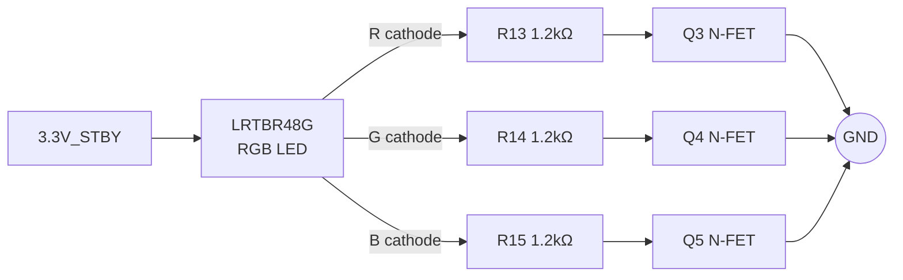

# LED 색감·타이밍 보강 현상 분석

작성자: 김은수
작성일: 2026-04-23
상태: 리뷰 대기
근거 요구사항: [`[요구사항] LED 색감·타이밍 보강 Rev.0`]([요구사항]%20LED%20색감·타이밍%20보강%20Rev.0%20by%20김은수.md)

---

## 1. 회로 현황 (Board_OTE_ver1_5)



Active HIGH (MCU → MOSFET → LED). 3 채널 동일 저항.

---

## 2. RGB 색감 분석

### 2.1 DC 동작점 (datasheet typical 추정)

| | Vf (typ) | I | Iv (추정) |
|---|---|---|---|
| R | 1.95 V | ~1.2 mA | ~34 mcd |
| G | 3.15 V | ~0.4 mA | ~18 mcd |
| B | 3.20 V | ~0.3 mA | ~3 mcd |

이론상 R > G > B.

### 2.2 실측 관찰

**사용자 피드백**: ORANGE (R+G) 가 **연두색** (G-dominant) 으로 보임. 이론 예측과 반대.

가능한 원인:
- O1: Vf 편차 (실측 R Vf ↑ 또는 G Vf ↓)
- O2: 저전류 efficacy droop — AlGaInP (R) 가 InGaN (G) 보다 저전류에서 손실 큼
- O3: MOSFET Vds_on 채널별 편차
- O4: 눈 감도 — 528nm (G) 가 V(λ) peak 근처, 625nm (R) 은 내려온 영역

→ datasheet typical 은 기준일 뿐, **실측 튜닝 필수**.

### 2.3 per-channel gain 만으로는 불충분

채널별 단일 gain (R_gain, G_gain, B_gain) 만 두면 모든 조합색의 R:G:B 비율 고정 → GREEN 단색을 밝게 유지하면서 ORANGE 의 G 만 따로 약화 불가. **조합색마다 독립 튜닝 필요** → per-color 테이블.

---

## 3. Fade 타이밍 분석

### 3.1 현 패턴별 fade 분포

`calc_pattern_fade_ms(on_ms) = min(on_ms / 3, 150)`:

| 패턴 | on_ms | fade | peak | 비고 |
|---|---|---|---|---|
| **POWER_ON** | **80** | **26** | **26** | **가장 짧은 ON, /3 룰 지배** |
| POWER_OFF | 100 | 33 | 33 | |
| MAPPING_ISD_BATT_LOW | 100 | 33 | 33 | |
| ERROR | 180 | 60 | 60 | |
| OTA_EZAIRO | 180 | 60 | 60 | |
| MAPPING_ISD_BATT_READY | 200 | 66 | 66 | |
| PAIR | 500 | 150 | 200 | fade 과도 |
| OTA_QCC | 1100 | 150 | 800 | fade 과도 |
| BATT_CRITICAL | 1100 | 150 | 800 | fade 과도 |

→ 긴 패턴 (≥240ms) 에서 fade 150ms 는 절대값 과도. 사용자 제안 80ms 상한이 더 균형적. 짧은 패턴 (POWER_ON 80ms 등) 은 /3 룰이 이미 fade 를 자동 축소 — 80ms cap 변경 무관.

### 3.2 FADE_MAX 단축 영향

`LED_DIMMING_FADE_MAX_MS : 150 → 80` 변경 시:

| 적용 위치 | 기존 | 신규 | 영향 |
|---|---|---|---|
| 패턴 fade cap | 150 | 80 | 긴 패턴 fade 짧아짐, peak 길어짐 |
| Cross-fade phase A/B | 150 ea | 80 ea | 색 전환 300→160ms (snappy) |
| turnOffLED 수동 fade | 150 | 80 | 꺼짐 시점 조금 빠름 |

### 3.3 iterationFlag 타이밍 손실

`main.c:92`:
```c
static bool iterationFlag = false;
void enable_iteration(void) { iterationFlag = true; }
```

**중요**: 평상시 1ms tick 소스는 `CFX_0_IRQHandler` (`driver_timmer.c`) 이다.
`TIMER_3_IRQHandler` (`ci_timer.c`) 는 ULP 모드 전용 fallback (주석 "Use when the CFX is not working").
ci_timer_init() 은 ULP 진입 시에만 호출되므로 (main.c:692, 500ms 주기) 정상 모드에서 Timer 3 은 fire 안 함.

`driver_timmer.c` (정상 모드 1ms tick):
```c
void CFX_0_IRQHandler(void) {
    enable_iteration();
    ci_timer_increase_tick();
}
```

`main.c:366` (main loop):
```c
while (1) {
    if (iterationFlag == true) { ... led_arbiter_tick() ... }
}
```

**문제**: iterationFlag 은 단순 bool. main loop 가 15ms 블록되면 15개 tick 모두 `iterationFlag=true` 로 설정되지만 main loop 진입 시 한 번만 처리. LED engine 의 `timer_ms++` 도 1회만 진행 → 실제 15ms 경과 vs engine 1ms 진행 → **fade 타임라인 비연속**.

POWER_ON (on=80ms, fade=26ms) 같은 짧은 패턴에서 이 15ms 손실은 **fade 의 절반이 1 tick 으로 건너뛰거나 peak 미도달** 위험.

I2C/EEPROM 폴링 블록은 `isd_interface()`, `bleCommunication()`, 배터리 / mapping 처리 등에서 주기적으로 발생.

---

## 4. ISR 이동 안전성 검토

### 4.1 shared state 원자성

| 변수 | 작성자 | 독자 (이동 후) | 원자성 |
|---|---|---|---|
| `s_req[LED_SRC__MAX]` (uint8) | main loop (`led_request`), BLE, UI | ISR | uint8 STRB 1 instruction → 원자 |
| `s_pair_latch_until_tick` (uint32) | main loop (`led_request` PAIR 시) | ISR | uint32 STR 1 instruction (aligned) → 원자 |
| `LED_outputColor` (enum, 4 byte) | ISR only (engine) | ISR only (LED_OUT) | 동일 context → 안전 |
| `s_led_pwm_on_count` (uint8) | ISR only | ISR only | 동일 context → 안전 |
| `s_power_burst_in_progress` (bool) | ISR (engine) | main loop (`led_is_power_burst_in_progress`) | bool 1 byte → 원자 read |
| `LedOutputPattern` (enum) | ISR (engine via `updateLED_OutputPattern`) | main loop (`geteLED_OutputPattern`) | enum 4 byte → 원자 read (aligned) |
| `testLED_Trigger` (bool) | main loop (`enabletestLED_Trigger`) | ISR (LED_OUT) | bool 1 byte → 원자 |

→ 모든 shared state 원자 접근 가능. torn read 없음.

### 4.2 ISR 에서 호출하는 외부 함수

| 함수 | 내용 | ISR 안전성 |
|---|---|---|
| `readLED_indicatorOnOff()` | shared memory struct 필드 read | 안전 (단순 read) |
| `ci_timer_get_tick()` | volatile int read | 안전 |
| `Sys_GPIO_Set_High/Low` | GPIO register write | 안전 (register 직접 접근) |

### 4.3 ISR 실행시간 예산

`led_arbiter_tick()` 구성 단계별 cycle 추정:

| 단계 | cycle |
|---|---|
| readLED_indicatorOnOff + ci_timer_get_tick | ~10 |
| s_req 루프 (6회 × priority + compare) | ~150 |
| led_state_to_enum + updateLED_OutputPattern | ~15 |
| led_engine_run (perceived + LUT + fade 로직) | ~100 |
| LED_OUT (per-channel duty + 3 GPIO write) | ~150 |
| 기타 branch/overhead | ~50 |
| **합계** | **~475 cycles** |

실행시간:
- 30.72 MHz : 475 / 30.72e6 ≈ **15 μs**
- 7.68 MHz (POR) : 475 / 7.68e6 ≈ **62 μs**

1ms 예산 대비 1.5~6%. 여유 충분.

### 4.4 turnOffLED race 완화

`turnOffLED()` 은 main loop 에서 blocking 으로 `s_led_pwm_on_count` / `LED_outputColor` 직접 쓰기 + `LED_OUT()` 호출 반복. ISR 이 같은 state 를 덮어쓰면 충돌.

**해결책**: 일시 중단 플래그

```c
static volatile bool s_led_isr_suspended = false;

void led_arbiter_tick(void) {  /* ISR 호출 */
    if (s_led_isr_suspended) return;
    /* ... 기존 로직 ... */
}

void turnOffLED(void) {
    s_led_isr_suspended = true;  /* ISR engine 일시 중단 */
    /* 기존 수동 fade 로직 */
    s_led_isr_suspended = false; /* ISR 복귀 */
}
```

`turnOffLED` 호출 위치:
- `main.c:673` — 셧다운 시점 (블로킹 OK, 이후 LED 안 켬)
- `initialize.c:179, 304` — 초기화 전 (ISR 미가동)
- `systemControl.c:211` — POWER_ON 패턴 시작 전

모두 1회성 동기 호출. 플래그 방식으로 안전.

---

## 5. 영향 범위

| 변경 대상 | 파일 | 내용 |
|---|---|---|
| 색상별 cap 테이블 | `LedOutput.c` | `tdc_led_mix_t` + `k_led_mix[]` |
| GPIO 극성 helper | `LedOutput.c` | `tdc_led_write_gpio()` |
| LED_OUT 리팩토링 | `LedOutput.c` | 3 `#ifdef` → 1분기 + per-channel duty |
| FADE_MAX 상수 | `LedOutput.c` | `LED_DIMMING_FADE_MAX_MS : 150 → 80` |
| ISR suspension 플래그 | `LedOutput.c` | `s_led_isr_suspended` + `turnOffLED` 에서 set/clear |
| CFX ISR (정상 모드 1ms) | `driver_timmer.c` | `led_arbiter_tick()` 호출 추가 (주요) |
| Timer 3 ISR (ULP fallback) | `ci_timer.c` | `led_arbiter_tick()` 호출 추가 |
| main loop | `main.c` | `led_arbiter_tick()` 호출 제거 |
| 헤더 포함 관계 | `ci_timer.c` | `#include "LedOutput.h"` 추가 |

→ 영향 3개 파일 (`LedOutput.c`, `ci_timer.c`, `main.c`).

---

## 6. 결정 필요 사항

| # | 항목 | 옵션 | 권장 |
|---|---|---|---|
| Q1 | 색감 아키텍처 | (A) per-channel gain (B) per-color R/G/B 테이블 | **(B)** |
| Q2 | cap 적용 위치 | pre-LUT / post-LUT | **post-LUT** |
| Q3 | 디폴트 cap | 실측 전 초안 | ORANGE (100,20,0) 중심 |
| Q4 | FADE_MAX | 150 / 80 / 기타 | **80** (사용자 제안) |
| Q5 | ISR 이동 범위 | (A) LED_OUT 만 (B) arbiter 전체 | **(B)** — fade timing 필수 |
| Q6 | turnOffLED race | (A) 플래그 suspension (B) 재설계 (request→wait) | **(A)** — 최소 변경 |
| Q7 | PWM 해상도 향상 | 본 작업 / 후속 | **후속** — Timer3 재설정 필요 |

---

## 7. 위험

- (R1) **디폴트 cap 값 실측 차이** — Rev.1 튜닝 필수
- (R2) **10% cap 해상도 양자화** — 미세 튜닝은 후속
- (R3) **ISR 실행시간** — 현재 15~62μs 로 여유지만, 추후 기능 추가 시 감시
- (R4) **turnOffLED 플래그 오용** — set 후 clear 누락 시 LED 영구 OFF. 단일 함수 내 완결로 제한
- (R5) **shared state 원자성 가정** — Cortex-M3 정렬 접근 기준. 패킹 구조체나 misaligned 접근 도입 금지

---

## 8. 검증 관점

### 8.1 정적

- 빌드 성공 (3 `LED_IS_ACTIVELOW` / `LED_B_pin_CFX_test` 조합)
- `k_led_mix[]` 모든 color enum entry 존재
- `Grep`: 새 테이블·helper·플래그 정의+사용, 중복 `LED_OUT` 제거, `FADE_MAX 80` 값 반영
- `main.c` `led_arbiter_tick()` 호출 제거
- `driver_timmer.c` `CFX_0_IRQHandler` 에 호출 추가 (주요 1ms tick)
- `ci_timer.c` `TIMER_3_IRQHandler` 에 호출 추가 (ULP fallback)

### 8.2 실기 시나리오

| # | 시나리오 | 기대 |
|---|---|---|
| a | RED / GREEN / BLUE 단일 | 자연스러운 색 인식 |
| b | **ORANGE** | **주황색** (연두색 아님) |
| c | WHITE / SKYBLUE / PURPLE | 편향 허용 범위 |
| d | POWER_OFF (on=100ms × 4 burst) | fade 33ms · peak 33ms, jitter 없음 |
| e | PAIR (on=500ms) | fade 80ms · peak 340ms |
| f | BATT_CRITICAL (on=1100ms) | fade 80ms · peak 940ms |
| g | 색 전환 (BATT_READY → PAIR) | 160ms snappy 전환 |
| h | I2C/EEPROM 폴링 동안 LED | 시각 jitter 없음 (ISR 구동) |
| i | turnOffLED 경유 shutdown | 80ms fade-out 정상, 이후 OFF 유지 |
| j | 전원 재부팅 | POWER_ON 버스트 정상 |
