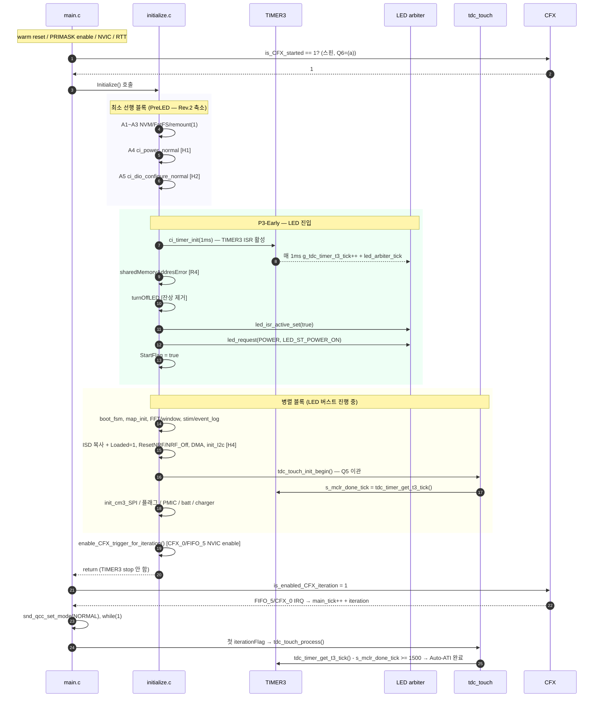
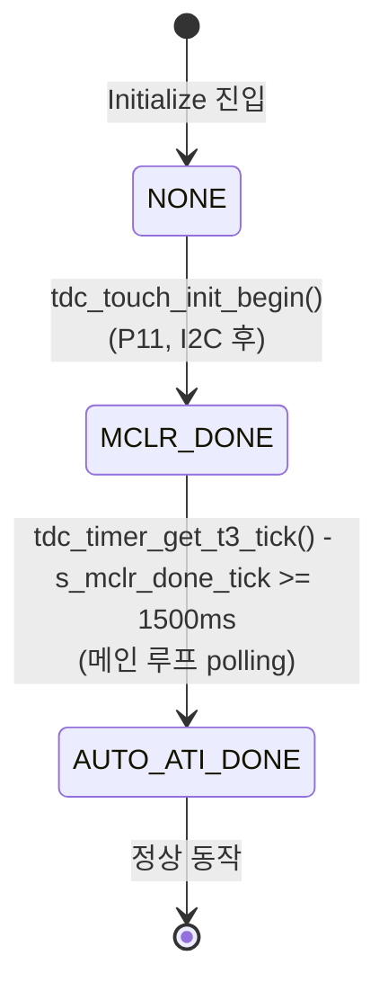

# POWER_ON LED 조기 점등 및 초기화 병렬화 — 구현 계획

**TL;DR**: 결정 Q1~Q10 반영 — 신규 카운터 `g_tdc_timer_t3_tick`(LED+터치 공유) 도입, LED_ST_POWER_ON 요청 위치를 P3-Early(`ci_dio_configure_normal()` 직후)로 이동, TIMER3 ISR 책임 분리, 터치 초기화 FSM 명시화. Rev.5에서 Fix A(P11 위치를 `init_cm3_SPI()` 직후로 이동) 적용 후 재테스트 대기 상태로 정리.

작성자: 김은수
최종 갱신: 2026-05-04 (Rev.5)
상태: Rev.5 — Fix A 적용 (P11 위치 init_cm3_SPI() 직후로 이동), 재테스트 대기

> [!NOTE]
> 본 계획은 [`요구사항.md`](요구사항.md) (G1~G5, H1~H5) 와 [`분석.md`](분석.md) Rev.3 결정 위에 작성. Rev.0 (P3 기반) → Rev.3 점프 — 분석 Rev.1, Rev.2 흐름은 분석.md 개정이력 참조.

---

## 1. 결정 사항 (Q1~Q10)

| # | 결정 | 근거 |
|---|---|---|
| Q1 | **TIMER3 timer_tick 옵션 C** — `g_tdc_timer_t3_tick` 신규 카운터. LED + 터치 공유 | [분석 §3.5](분석.md) |
| Q2 | LED 요청 위치 = **P3-Early** (`ci_dio_configure_normal()` 직후, Initialize 단계 5 후) | 분석 §6.3 |
| Q3 | (Q6 와 통합) | - |
| Q4 | Initialize 물리 분할 X, **내부 재배열만** | 분석 §6 |
| Q5 | `tdc_touch_init_begin()` Initialize 안 (P3-Early 병렬 블록 I2C init 후) 으로 이관. 시간 기준 = t3_tick | 분석 §8.4 |
| Q6 | **CFX 시작 대기 스핀 그대로 유지** — `is_CFX_started == 1` 확인 필수 | 분석 §6.3 |
| ~~Q7~~ | (폐기 — Q6=(a) 확정으로 무관) | - |
| Q8 | 분석.md / 구현계획.md **Rev.3 갱신** | - |
| Q9 | **FSM 적용 = LED·터치 초기화만** (본 작업). systemControl 전체 FSM 화는 미래 | 분석 §3.5.6 |
| Q10 | **A** — t3_tick 모듈 위치 = `ci_timer.c` 내부 신규 심볼 (`g_tdc_timer_t3_tick`, `tdc_timer_get_t3_tick()`) | 본 §1.1 |

### 1.1 Q10 — t3_tick 모듈 위치 (결정: A)

| | 옵션 | 장점 | 단점 |
|---|---|---|---|
| **A (채택)** | `ci_timer.c` 안에 신규 심볼 (`g_tdc_timer_t3_tick`, `tdc_timer_get_t3_tick()`) 만 추가 | 작업 범위 작음. 기존 ISR 핸들러 위치 일관 | 같은 모듈 안에 `g_ci_*`/`g_tdc_*` prefix 혼재 (어색) |
| B | 새 모듈 `tdc_timer.c/.h` 분리 (변수 + getter + ISR 위임) | `tdc_` 일관 적용. 모듈 분리 명확 | ISR 함수는 SDK 표준 이름이라 `ci_timer.c` 에 남고 본문에서 위임 호출 — 분산 |
| C | 새 모듈 `tdc_led_timer.c/.h` 분리 (LED·터치 공유 카운터 전용 모듈) | 본 작업 책임 명확. 향후 다른 timer 와 분리 | 모듈명에 LED 포함 → 터치도 쓰는 점 모호 |

**결정 근거 (A)**: 단일 파일 안 prefix 혼재는 네이밍 컨벤션 §"호환 필요 시 예외" 사유 (같은 모듈 일관성) 로 해석. 작업 범위 최소화. 향후 `ci_timer.c` 전체를 `tdc_timer.c` 로 리팩토링 시 일괄 변경.

---

## 2. 변경 파일 개요

| 파일 | 변경 유형 | 주요 변경 |
|---|---|---|
| [`src/2__cm3/Cortex-M3-src/main.c`](../../../../src/2__cm3/Cortex-M3-src/main.c) | **미변경** | Q6=(a) 채택 — CFX 대기 스핀 그대로 |
| [`src/2__cm3/Cortex-M3-src/systemControl/initialize.c`](../../../../src/2__cm3/Cortex-M3-src/systemControl/initialize.c) | **재배열 + 추가** | P3-Early 흐름: 단계 5 직후 LED 진입 + 병렬 블록 + 종료 배리어 (CFX iteration 활성화) |
| [`src/2__cm3/Cortex-M3-src/systemControl/systemControl.c`](../../../../src/2__cm3/Cortex-M3-src/systemControl/systemControl.c) | **제거** | `StartFlag == false` 분기 제거 (Initialize 로 이관) |
| [`src/2__cm3/Gen1_5/common/ci_timer.c`](../../../../src/2__cm3/Gen1_5/common/ci_timer.c) | **추가** | `g_tdc_timer_t3_tick` 변수 + `tdc_timer_get_t3_tick()` getter + `TIMER_3_IRQHandler` 갱신 (ISR 책임 분리) |
| [`src/2__cm3/Gen1_5/common/ci_timer.h`](../../../../src/2__cm3/Gen1_5/common/ci_timer.h) | **추가** | `tdc_timer_get_t3_tick()` 선언 |
| [`src/2__cm3/Cortex-M3-src/systemControl/driver_timmer.c`](../../../../src/2__cm3/Cortex-M3-src/systemControl/driver_timmer.c) | **수정** | `CFX_0_IRQHandler` / `FIFO_5_IRQHandler` 에서 `led_arbiter_tick()` 호출 제거 |
| [`src/2__cm3/Cortex-M3-src/systemControl/tdc_touch.c`](../../../../src/2__cm3/Cortex-M3-src/systemControl/tdc_touch.c) | **수정** | `s_mclr_done_tick = ci_timer_get_tick()` → `s_mclr_done_tick = tdc_timer_get_t3_tick()` (시간 기준 변경) + FSM 정리 |
| [`src/2__cm3/Cortex-M3-src/systemControl/LedOutput.c`](../../../../src/2__cm3/Cortex-M3-src/systemControl/LedOutput.c) | **선택 수정** | LED arbiter 자체 ms 카운터를 `g_tdc_timer_t3_tick` 활용으로 통일 (선택) |
함수 시그니처 신규 1 건 (`tdc_timer_get_t3_tick()`). 그 외 시그니처 변경 없음. 신규 파일 0 (Q10=A — `ci_timer.c/.h` 내부에만 추가).

---

## 3. 실행 순서

### 3.1 변경 후 부팅 흐름



### 3.2 PreLED · ParLED 분류 (Rev.3)

**PreLED (5 단계 + 게이트)** — LED 점등 사전조건만:

| # | 단계 | 제약 |
|---|---|---|
| I1 | `ci_filesystem_nvm_init()` | FS 기반 |
| I2 | `snd_fatfs_init_mem_map()` | FS 기반 |
| I3 | `snd_fatfs_remount(1)` | FS 기반 |
| I4 | `ci_power_normal()` | **H1** |
| I5 | `ci_dio_configure_normal()` | **H2** |

**LED 진입 게이트 (신규)**:

| 순서 | 호출 |
|---|---|
| L1 | `ci_timer_init(OTE_1_5_GEN_TIMER_TICK_1MS_PM_NORMAL)` — TIMER3 LED 전담 ISR 활성 |
| L2 | `sharedMemoryAddresError()` — R4 보존 (에러 시 무한루프 → LED 켜기 전) |
| L3 | `turnOffLED()` — 잔상 제거 (isr_active=false 상태에서 즉시 OFF 분기) |
| L4 | `led_isr_active_set(true)` — LED arbiter ISR 게이트 ON |
| L5 | `led_request(LED_SRC_POWER, LED_ST_POWER_ON)` |
| L6 | `tdc_touch_init_begin()` 은 ParLED 안 (I2C init 후) — Q5 |
| L7 | `StartFlag = true` |

**ParLED (LED 버스트 진행 중)**:

| # | 단계 | 비고 |
|---|---|---|
| P1 | `snd_fatfs_remount(0)` → `ci_boot_handle_fsm()` → `snd_fatfs_remount(1)` | |
| P2 | `ci_map_init_map_data_all(false)` | C2 (P3 ISD 복사 전제) |
| P3 | `ci_fft_init_pass_bin_all()` | |
| P4 | `ci_fft_init_window_coeff()` | |
| P5 | `ci_stim_mute_init()` | |
| P6 | `ci_event_log_init()` | |
| P7 | `ci_filesystem_copy_isd_info_*()` → `cfx_cm3_sharedMemoryAll.CFX_EEPROM_data_is_Loaded = 1` | C2·C3 (붙여 둠) |
| P8 | `ResetNRF()` → `NRF_Off_Command()` | |
| P9 | `reset_DMA_disable()` | |
| P10 | `init_I2c()` | **H4** |
| P12 | `init_cm3_SPI()` | |
| P11 | `tdc_touch_init_begin()` | Q5 (I2C 후) — t3_tick 기준. **Rev.5: init_cm3_SPI() 직후로 이동** (warm reset NRF SPI race 회피) |
| P13 | `cfx_cm3_sharedMemoryAll.systemShare.powerButton_pushed_CFX_to_CM3 = 0` | |
| P14 | `OnOff_3V_PMIC_CM3_to_CFX(false)` | |
| P15 | `clearAllErrorFlag()` | |
| P16 | `snd_batt_set_state/percent(RESET, 0)` | |
| P17 | `snd_charger_set_state(RESET)` | |

**종료 배리어**:

| 순서 | 호출 | 비고 |
|---|---|---|
| F1 | `enable_CFX_trigger_for_iteration()` | CFX_0/FIFO_5 NVIC enable |
| (Initialize return) | | TIMER3 stop 안 함 — sleep 진입 시점에 처리 |
| F2 (main.c) | `is_enabled_CFX_iteration = 1` | CFX iteration 시작 |

### 3.3 ISR 책임 분리 (Rev.3 신규)

```c
/* ci_timer.c */

static volatile int g_ci_timer_main_tick = 1;        /* 기존 — CFX FIFO 가 증가 */
static volatile int g_tdc_timer_t3_tick  = 0;        /* Rev.3 신규 — TIMER3 가 증가 */

void TIMER_3_IRQHandler(void)
{
    /* normal 모드: LED · 터치 공유 카운터 + LED arbiter */
    g_tdc_timer_t3_tick++;
    led_arbiter_tick();
    /* ULP 모드 분기는 §3.4 참조 */
}

int tdc_timer_get_t3_tick(void)
{
    return g_tdc_timer_t3_tick;
}
```

```c
/* driver_timmer.c */

void CFX_0_IRQHandler(void)
{
    enable_iteration();
    ci_timer_increase_tick();    /* main_tick 증가 (시스템 시간 전담) */
    /* led_arbiter_tick() 제거 — TIMER3 가 전담 */
}

void FIFO_5_IRQHandler(void)
{
    CFX_0_IRQHandler();
}
```

### 3.4 ULP 처리

`func_sleep()` 진입 시점에서 TIMER3 용도 변경:

```c
/* 기존 ULP 코드 — 그대로 유지 */
ci_timer_uninit();                                    /* normal 모드 1ms ISR 정지 */
ci_timer_init_prescaled(TIMER_PRESCALE_128, 155);     /* ULP 500ms wakeup */
```

`func_normal()` 재진입 시 `ci_timer_init(...)` 1ms 재 init. `g_tdc_timer_t3_tick` 은 0 또는 정지값 → 새 부팅 사이클로 간주.

### 3.5 FSM 설계 (Q9=A)

본 작업의 FSM 적용 범위 = **터치 초기화 상태머신 명시화**. LED arbiter 자체 FSM 은 본 작업 외 (이미 cross-fade phase 등 유지).

#### 3.5.1 터치 초기화 FSM (`tdc_touch.c`)

기존 `s_init_state` enum 을 명시적 FSM 으로 재정리. 헤더에 상태 enum 노출하지 않음 (모듈 내부 캡슐화).

```c
/* tdc_touch.c — 내부 정의 */

typedef enum {
    TDC_TOUCH_INIT_STATE_NONE,           /* 진입 — MCLR 호출 전 */
    TDC_TOUCH_INIT_STATE_MCLR_DONE,      /* MCLR 시작 — Auto-ATI 1500ms 대기 */
    TDC_TOUCH_INIT_STATE_AUTO_ATI_DONE,  /* Auto-ATI 완료 — 정상 동작 */
} tdc_touch_init_state_t;

static tdc_touch_init_state_t s_tdc_touch_init_state = TDC_TOUCH_INIT_STATE_NONE;
static int                    s_mclr_done_tick       = 0;

/* 전이 1: NONE → MCLR_DONE */
void tdc_touch_init_begin(void)
{
    SYS_WATCHDOG_REFRESH();
    tdc_drv_iqs323_mclr_reset();
    s_mclr_done_tick       = tdc_timer_get_t3_tick();      /* Rev.3 — main_tick → t3_tick */
    s_tdc_touch_init_state = TDC_TOUCH_INIT_STATE_MCLR_DONE;
}

/* 전이 2: MCLR_DONE → AUTO_ATI_DONE — 메인 루프에서 polling */
static void tdc_touch_try_finish_init(void)
{
    if (s_tdc_touch_init_state != TDC_TOUCH_INIT_STATE_MCLR_DONE) { return; }

    int elapsed = tdc_timer_get_t3_tick() - s_mclr_done_tick;
    if (elapsed < TDC_TOUCH_AUTO_ATI_WAIT_MS) { return; }

    /* Auto-ATI 완료 처리 (기존 로직) */
    /* ... */
    s_tdc_touch_init_state = TDC_TOUCH_INIT_STATE_AUTO_ATI_DONE;
}

/* 디버그: 현재 상태 조회 */
tdc_touch_init_state_t tdc_touch_get_init_state(void) { return s_tdc_touch_init_state; }
```

#### 3.5.2 FSM 다이어그램



전이 조건은 **순수 시간 기반** (`g_tdc_timer_t3_tick` 차이) — 외부 이벤트 없음.

### 3.6 systemControl.c 변경 (Q5)

기존 (`StartFlag == false` 분기, 약 line 209~224):

```c
} else if (StartFlag == false) {
    led_request(LED_SRC_POWER, LED_ST_POWER_ON);
    tdc_touch_init_begin();
    StartFlag = true;
}
```

**변경**: 분기 자체 삭제. `StartFlag` 는 `Initialize()` 에서 이미 `true` → 진입 절대 없음. 사표 코드 제거.

---

## 4. 검증 계획

### 4.1 정적 검증 (코드 리뷰)

- [ ] `ci_power_normal()` · `ci_dio_configure_normal()` 이 `Initialize()` 단계 4·5 위치 유지
- [ ] `ci_timer_init()` 호출이 PreLED 끝 (단계 5) 직후
- [ ] `ci_timer_uninit()` 이 `Initialize()` 안에 **없음** (sleep 진입 시점에만)
- [ ] `enable_CFX_trigger_for_iteration()` 가 `Initialize()` 끝 (CFX iteration 활성화 직전)
- [ ] `led_request(POWER, LED_ST_POWER_ON)` → `tdc_touch_init_begin()` (ParLED P11) → `StartFlag = true` 순서
- [ ] `systemControl.c` 의 `StartFlag == false` 분기 삭제
- [ ] `TIMER_3_IRQHandler` 본문 = `g_tdc_timer_t3_tick++ + led_arbiter_tick()` (main_tick·iteration 호출 제거)
- [ ] `CFX_0_IRQHandler` / `FIFO_5_IRQHandler` 본문에서 `led_arbiter_tick()` 호출 제거
- [ ] `tdc_touch.c` 의 `s_mclr_done_tick = tdc_timer_get_t3_tick()` 적용
- [ ] FSM enum (`tdc_touch_init_state_t`) 명시화, 전이 함수 분리
- [ ] 네이밍: 신규 심볼 모두 `tdc_` / `g_tdc_` / `s_tdc_` 접두 (네이밍 컨벤션 준수)

### 4.2 런타임 검증 (J-Link + RTT + 오실로스코프)

| # | 시나리오 | 확인 방법 | 기대 |
|---|---|---|---|
| V1 | 정상 부팅 | RTT 타임스탬프 로그 (변경 전 vs 후) | LED_ST_POWER_ON 시각이 **CM3 첫 시작 + ~수십 ms 이내** (Rev.0 대비 수백 ms 단축) |
| V2 | LED 버스트 패턴 | 오실로스코프 LED GPIO | SKYBLUE fade-in/out × 5 패턴, 기존과 구분 불가 |
| V3 | t3_tick 일관성 | `tdc_timer_get_t3_tick()` RTT 로그 (10ms 간격 샘플) | 1ms 당 정확히 1 증가, 누락 없음 |
| V4 | main_tick 일관성 | `ci_timer_get_tick()` RTT 로그 | CFX iteration 활성 후 정확히 1ms 당 1 증가 |
| V5 | 두 카운터 동시 활성 | V3·V4 동시 측정 | 서로 독립적으로 증가, 충돌 없음 |
| V6 | 터치 Auto-ATI 동기 | `tdc_touch_get_init_state()` RTT 로그 | LED 시작 + ~1500ms 에 NONE → MCLR_DONE → AUTO_ATI_DONE 전이 완료. LED 버스트 끝 (1.8s) 안에 들어감 |
| V7 | 충전기 연결 부팅 | 충전기 연결 상태로 전원 ON | POWER_ON 잠시 점등 후 충전 패턴 (R5 허용 동작). 크래시 없음 |
| V8 | MCU 에러 부팅 | 의도적 에러 후 재부팅 | POWER_ON 잠시 점등 후 ERROR 패턴으로 덮임 |
| V9 | Ezairo 워치독 리셋 | 워치독 만료 유도 | 재부팅 후 POWER_ON 정상 |
| V10 | ULP 진입/복귀 | 슬립 → 깨움 (전원버튼) | TIMER3 1ms → 500ms → 1ms 전환 정상. LED·터치 재기동 정상. main_tick 끊김 없음 |

### 4.3 회귀 위험 지점

- LED 페이드 (dimming): V2 육안
- ISR 이중 호출: V3·V4·V5
- 터치 1500ms 측정 시점: V6
- 공유 메모리 순서 (C2·C3): V1 RTT 로그 (ISD 정보 사용처)

---

## 5. 위험 대응 (분석 §9 Rev.3 기준)

| # | 위험 | 대응 |
|---|---|---|
| R1 (소멸) | TIMER3 + CFX FIFO 동시 활성 → 틱 2 배 | **ISR 책임 분리 (§3.3) 로 자연 해소**. TIMER3 = t3_tick + LED, CFX FIFO = main_tick + iteration |
| R2 | DIO 설정 전 LED 조작 | PreLED 안에 `ci_dio_configure_normal()` 보장. `led_isr_active_set(true)` 는 단계 5 이후 |
| R3 | ParLED 길이로 워치독 초과 | ParLED 중간에 `SYS_WATCHDOG_REFRESH()` 패턴 유지 |
| R4 | `sharedMemoryAddresError()` 후 LED 점등 | LED 진입 게이트 L2 위치 (LED 점등 전). 에러 시 LED 켜지지 않은 채 무한루프 |
| R5 | 충전기/에러 부팅 POWER_ON 잠시 깜빡 | 요구사항 §4.1 허용. V7·V8 확인 |
| R6 (갱신) | ULP TIMER3 용도 전환 | `func_sleep()` 진입 시 `ci_timer_uninit()` → `ci_timer_init_prescaled()` (기존 ULP 코드 유지). V10 확인 |
| R7 | MCLR 이 DIO 설정 전 실행 | `tdc_touch_init_begin()` 이 ParLED P11 (I2C init 후) 보장 — DIO·I2C 모두 끝난 시점 |

위험 등급: **낮음** (Rev.1 "중간" → Rev.2/3 ISR 분리로 R1 소멸 + Q6=(a) 로 R-PRIMASK·R-PWR-FS 폐기).

---

## 6. 롤백 방안

### 6.1 코드 수준

커밋 단위 분리 (§7) — 문제 발생 시 해당 커밋만 `git revert` 가능.

특히 위험한 커밋과 빠른 롤백 단서:
- 커밋 1 (ISR 책임 분리) — 회귀 시: TIMER3 ISR 본문 + CFX_0 ISR 본문 원상 복구. led_arbiter 호출이 한 ISR 에만 들어가도록 보장
- 커밋 3 (initialize.c P3-Early) — 회귀 시: PreLED → 단순히 Rev.0 P3 위치 (선행 블록 14 단계 끝) 로 LED 요청 이동

### 6.2 브랜치 수준

- 작업 브랜치: `claude_feature_early-power-on-led` (base = `claude_develop`)
- 병합 대상: `claude_develop`
- 병합 전 V1~V10 통과 필수

---

## 7. 커밋 전략

| # | 내용 | 메시지 (안) |
|---|---|---|
| 1 | `ci_timer.c/.h` — `g_tdc_timer_t3_tick` + getter + ISR 갱신. `driver_timmer.c` ISR LED 호출 제거 | `fw(timer): ISR 책임 분리 (TIMER3 LED 전담 / CFX FIFO 시스템 시간) + g_tdc_timer_t3_tick 도입` |
| 2 | `tdc_touch.c` — 시간 기준 t3_tick 변경 + FSM enum 명시화 + 디버그 getter | `fw(touch): 시간 기준 g_tdc_timer_t3_tick 으로 변경 + 초기화 FSM 명시화` |
| 3 | `initialize.c` — P3-Early 흐름 (PreLED + LED 진입 + ParLED + 종료 배리어) | `fw(init): P3-Early 재배열 (PreLED → LED 요청 → ParLED → CFX iteration 활성)` |
| 4 | `systemControl.c` — `StartFlag == false` 분기 제거 | `fw(systemControl): StartFlag 분기 제거 (Initialize 로 이관)` |
| 5 | (선택) `LedOutput.c` — LED arbiter 자체 ms 카운터를 t3_tick 활용으로 통일 | `fw(led): LED arbiter 시간 기준 g_tdc_timer_t3_tick 통일` |
| 6 | (선택) RTT 마일스톤 로그 | `fw(debug): early POWER_ON 전환 마일스톤 RTT 로그 추가` |

> 커밋·병합은 **사용자 "작업 끝났어. 마무리해" 시그널** 후. (V1~V10 검증 통과 후)

---

## 8. 예상 코드 변경 분량

| 파일 | 추가 | 삭제 | 순변경 |
|---|---|---|---|
| `ci_timer.c` | ~10 | ~3 | +7 |
| `ci_timer.h` | ~2 | 0 | +2 |
| `driver_timmer.c` | 0 | ~2 | -2 |
| `tdc_touch.c` | ~15 | ~5 | +10 (FSM 정리 포함) |
| `initialize.c` | ~10 | ~5 | +5 |
| `systemControl.c` | 0 | ~5 | -5 |
| (선택) `LedOutput.c` | ~5 | ~5 | 0 |
| **합계** | **~42** | **~25** | **+17** |

신규 파일 0 (Q10=A). 신규 함수 1 건 (`tdc_timer_get_t3_tick()`). 신규 변수 1 건 (`g_tdc_timer_t3_tick`). 시그니처 변경 0.

---

## 9. 이후 절차

1. ~~**Q10 결정**~~ — 완료 (A 채택, 2026-05-04)
2. ~~**사용자 승인**~~ — 완료 (Q10=A 결정 + "진행해" 시그널, 2026-05-04)
3. **구현 단계** — §7 커밋 1~6 전부 순차 작성 (선택 5·6 포함)
4. **빌드 검증** — Eclipse 빌드, 경고 0건 / 에러 0건 목표
5. **실기 검증** — V1~V10 (§4.2) — 은수님 직접 진행 후 결과 공유
6. **이력 기록** — `이력 및 결과.md` 작성
7. **완료 시그널** — 사용자 "작업 끝났어. 마무리해" 시 머지

---

## 10. 개정 이력

| Rev | 날짜 | 내용 |
|---|---|---|
| 0 | 2026-04-24 | 초안 — 분석 §10 권고안 (Q1~Q5, P3 기반) 수용. 사용자 승인 대기 |
| 3 | 2026-05-04 | **Rev.0 → Rev.3 점프** (Rev.1·Rev.2 는 분석.md 안에서만 진행). 분석 Rev.3 결정 반영: Q1=C (`g_tdc_timer_t3_tick` 신규 카운터, ISR 책임 분리), Q2=P3-Early (`ci_dio_configure_normal()` 직후), Q5=B (`tdc_touch_init_begin()` Initialize 안 이관, 시간 기준 t3_tick), Q6=(a) (CFX 대기 스핀 그대로 유지), Q9=A (LED·터치 초기화 FSM 명시화), Q7 폐기. Q10 신규 (t3_tick 모듈 위치 결정 필요). 변경 파일 6 개 (ci_timer + driver_timmer + tdc_touch + initialize + systemControl + 선택 LedOutput). 검증 V1~V10 (t3_tick 일관성, main_tick 독립성, ULP 전환 추가). 위험 등급 "낮음". 네이밍 컨벤션 ([`지침/코딩/네이밍 컨벤션.md`](../../../지침/코딩/네이밍%20컨벤션.md)) 적용. Q10 결정 + 사용자 승인 대기 |
| 4 | 2026-05-04 | **Q10=A 결정** — `ci_timer.c` 내부에 `g_tdc_timer_t3_tick` + `tdc_timer_get_t3_tick()` 추가, 신규 파일 0. 사용자 "진행해" 시그널 수신 → 구현 진입. 변경 파일 표·§8·§9 갱신. 코드 변경은 §7 커밋 1~6 전부 (선택 5·6 포함) 순차 진행 |
| 5 | 2026-05-04 | **Fix A 적용** — V10 검증에서 워치독 리셋 (3초 터치 슬립 → 깨움) 시 SPI 에러 (`DMA0/1_CNTS->TRANSFER_WORD_CNT_SHORT`) 회귀 발견. 원인: `tdc_touch_init_begin()` 이 P11 (init_I2c 직후) 위치라 `init_cm3_SPI()` 시점이 늦어져 NRF 잔존 SPI 통신과 race. **fix**: P11 위치를 `init_cm3_SPI()` 직후로 이동. 분석.md 의 "I2C init 후" 제약 만족 + SPI init 시점은 본 작업 전과 동등. 본 fix 후 재테스트 대기. (별도) POWER_OFF 미동작은 본 작업 무관 — `main.c:691` 에서 슬립 진입 직전 `turnOffLED()` 강제 호출 (기존 동작) |

## 자체 검토

### 지침 준수 여부
| 지침 | 준수 |
|---|---|
| [`작업 진행 규칙.md`](../../../../../../docs/지침/일반/작업%20진행%20규칙.md) | ✅ |
| [`문서 작성 규칙.md`](../../../../../../docs/지침/일반/문서%20작성%20규칙.md) | ✅ |

### 논리적 정합성
| 점검 | 결과 |
|---|---|
| 본문 기존 내용 보존 (양식 정합화 시 무손실) | ✅ |
| frontmatter·TL;DR 기준 충족 | ✅ |
| 관련 산출물(요구사항·분석·계획·이력) 상호 일관 | ✅ |

### 미해결 이슈
| 이슈 | 처리 |
|---|---|
| 해당 없음 | — |
