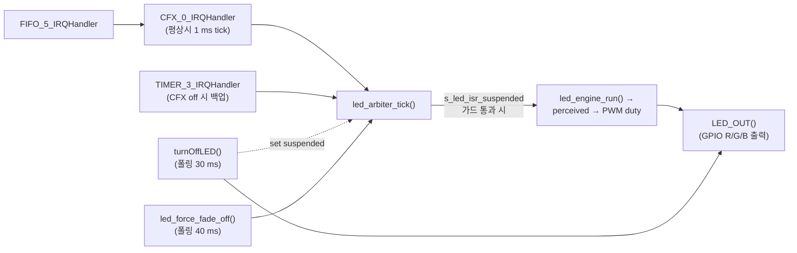

# LED Fade-Off 비차단 변환 — 분석

**TL;DR**: CFX_0_IRQHandler가 평상시 1 ms LED tick 소스이고 TIMER_3_IRQHandler가 백업임을 grep으로 확정. ISR 활성 시점은 `enable_CFX_trigger_for_iteration()` (`initialize.c:414`) 단 1곳, 그 이전엔 ISR 호출 없음. 요구사항 R-1~R-5 위험요소(폴링 호출자·sleep 진입·fade 중 우선순위 충돌)를 호출 그래프와 본문 read로 검증해 구현계획 결정 입력을 제공한다.

작성일: 2026-04-27
연계: [요구사항.md](요구사항.md)

> [!NOTE]
> 본 분석은 [요구사항.md §5 위험·전제](요구사항.md) R-1 ~ R-5 검증과 [구현계획.md](구현계획.md) 입력 산출이 목적이다. 모든 결론은 grep + 본문 read 로 근거가 있는 사실에 한정 (작업 규칙 §4 준수).

---

## 1. 시스템 LED tick 인프라

### 1.1 호출 그래프



### 1.2 ISR 주기 — 1 ms 확정

| ISR | 출처 | 주기 | 비고 |
|---|---|---|---|
| `CFX_0_IRQHandler` | [`driver_timmer.c:11`](../../../../src/2__cm3/Cortex-M3-src/systemControl/driver_timmer.c) | **1 ms** | 평상시 LED tick 소스 ("CFX 가 평상시 1ms tick 소스" — 주석) |
| `FIFO_5_IRQHandler` | [`driver_timmer.c:21`](../../../../src/2__cm3/Cortex-M3-src/systemControl/driver_timmer.c) | event-driven | 본문이 `CFX_0_IRQHandler()` 직접 호출 |
| `TIMER_3_IRQHandler` | [`ci_timer.c:18`](../../../../src/2__cm3/Gen1_5/common/ci_timer.c) | 1 ms (백업) | "Use when the CFX is not working" 주석 |

→ `led_arbiter_tick()` 은 **매 1 ms 호출 보장** (CFX 정상 시).

### 1.3 ISR 활성 시점

`enable_CFX_trigger_for_iteration()` 정의: [`initialize.c:129`](../../../../src/2__cm3/Cortex-M3-src/systemControl/initialize.c). NVIC 으로 `CFX_0_IRQn`, `FIFO_5_IRQn` 활성.

**호출 시점 (전수 grep)**: [`initialize.c:414`](../../../../src/2__cm3/Cortex-M3-src/systemControl/initialize.c) — 단 1 곳.

→ **`initialize()` 함수 안에서 :414 이전에는 CFX/FIFO IRQ 비활성 ⇒ `led_arbiter_tick()` ISR 호출 없음.**

---

## 2. 두 함수의 정밀 동작

### 2.1 `turnOffLED()` — [`LedOutput.c:632-662`](../../../../src/2__cm3/Cortex-M3-src/systemControl/LedOutput.c)

```c
s_led_isr_suspended = true;        /* arbiter ISR/main 둘 다 진입 가드 통과 못함 */
for (t = 0; t < 30; t++) {
    perceived = (30 - t) * 255 / 30;
    s_led_pwm_on_count = perceived_to_pwm(perceived);
    LED_OUT();                     /* arbiter 우회, GPIO 직접 갱신 */
    delay_ms(1);
}
LED_outputColor    = en__LED_BLACK;
s_led_pwm_on_count = 0;
LED_OUT();
s_led_isr_suspended = false;
```

특징:
- 기존 `LED_outputColor` 를 보존하며 perceived 만 감소 → 같은 색으로 fade-out
- `arbiter` 우회 — `LED_OUT()` 직접 호출
- 마지막에 `LED_outputColor = BLACK`, PWM 0, GPIO 모두 OFF

### 2.2 `led_force_fade_off()` — [`LedOutput.c:363-391`](../../../../src/2__cm3/Cortex-M3-src/systemControl/LedOutput.c)

```c
for (src = 0; src < LED_SRC__MAX; src++) s_req[src] = LED_ST_NONE;
s_pair_latch_until_tick = 0;
for (i = 0; i < 40; i++) {
    led_arbiter_tick();            /* main 이 직접 tick (ISR 도 동시에 호출 중) */
    delay_ms(1);
}
s_led_isr_suspended = true;        /* 영구 — sleep 진입 동안 LED 보호 */
```

특징:
- 모든 `s_req[*] = NONE` 강제 → arbiter `best = LED_ST_IDLE` 결정 → engine 이 cross-fade Phase A (현재 색 prev_color 캡처 후 fade-out 0)
- main 이 직접 `led_arbiter_tick()` 호출하지만 **ISR 도 동시 1 ms tick 으로 같은 함수 호출**
  - 결과적으로 한 사이클당 tick 2 회 호출 가능성. `led_engine_run()` 의 `timer_ms` 진행이 두 배 빨라질 수 있음 (실측 미확인).
  - 단 본 작업에서 main 호출을 제거하면 자연스럽게 ISR 만의 1 ms tick 으로 회귀.
- 마지막 `s_led_isr_suspended = true` → **영구 set** (해제 코드 없음, 다음 부팅 static 초기값 false 로 자연 reset)

### 2.3 `LED_OUT()` BLACK 처리 — [`LedOutput.c:791-828`](../../../../src/2__cm3/Cortex-M3-src/systemControl/LedOutput.c)

```c
mix = &k_led_mix[LED_outputColor];   /* BLACK 일 때 mix = {0, 0, 0} (cap_pc 모두 0) */
duty_r = pwm_count * mix->cap_pc_r / 100;   /* = 0 */
/* on_r = (timerCounter < 0) = false */
tdc_led_write_gpio(false, false, false);    /* 모든 채널 OFF */
```

→ **`LED_outputColor == BLACK` 이면 어떤 `s_led_pwm_on_count` 값이라도 GPIO 모두 OFF.**

### 2.4 `led_arbiter_tick()` 진입 가드 — [`LedOutput.c:513-520`](../../../../src/2__cm3/Cortex-M3-src/systemControl/LedOutput.c)

```c
void led_arbiter_tick(void) {
    if (s_led_isr_suspended) return;
    /* arbiter + engine + LED_OUT */
}
```

→ `s_led_isr_suspended = true` 면 **ISR · main 양쪽 모두 진입 차단**.

---

## 3. 호출 사이트 전수 분석

### 3.1 `turnOffLED()` — 4 곳

| # | 위치 | 컨텍스트 | 호출 시 ISR 상태 | 비차단 변환 시 처리 |
|---|---|---|---|---|
| 1 | [`initialize.c:179`](../../../../src/2__cm3/Cortex-M3-src/systemControl/initialize.c) | `Uninitialize()` 안. 직전: `__set_PRIMASK(DISABLE)` → `Sys_NVIC_DisableAllInt()` → `Sys_NVIC_ClearAllPendingInt()` | ❌ NVIC 전체 disable | 즉시 OFF 1 회 (ISR 안 돌아감) |
| 2 | [`initialize.c:304`](../../../../src/2__cm3/Cortex-M3-src/systemControl/initialize.c) | 메인 init 시퀀스 (FFT/STIM/EVENT/ISD copy 후). **`enable_CFX_trigger_for_iteration()` 호출은 :414** → 호출 시점에 CFX/FIFO IRQ 미활성 | ❌ CFX/FIFO 미활성 | 즉시 OFF 1 회 |
| 3 | [`systemControl.c:211`](../../../../src/2__cm3/Cortex-M3-src/systemControl/systemControl.c) | main loop. 충전기 disconnect 감지 직후, POWER_ON LED burst 시작 직전 | ✅ ISR 활성 | **비차단 fade 적용 — 본 작업의 주요 수혜자** |
| 4 | [`main.c:691`](../../../../src/2__cm3/Cortex-M3-src/main.c) | `func_sleep()` 안. **직전 시퀀스**: `led_force_fade_off()` (640ms 직전 main loop) → break → ResetNRF / NRF_Off / QCC SHUTDOWN / FPGA OFF / PMIC OFF → 본 호출 | ⚠️ `s_led_isr_suspended == true` (`led_force_fade_off()` 가 영구 set) | 즉시 OFF 1 회 (ISR 영구 suspended) |

### 3.2 `led_force_fade_off()` — 1 곳

| # | 위치 | 컨텍스트 | 호출 시 ISR 상태 | 비차단 변환 시 처리 |
|---|---|---|---|---|
| 1 | [`main.c:638`](../../../../src/2__cm3/Cortex-M3-src/main.c) | main loop, sleep 진입 결정 직후. 호출 후 `break` → `func_sleep()` 진입 | ✅ ISR 활성 | **비차단 적용 — main loop 40 ms 블로킹 해소** |

호출자는 fade 종료를 동기적으로 기다릴 의무 없음. break 후 `func_sleep()` 진입까지의 시간(NRF/QCC/PMIC 처리, ~수 ms ~ 수십 ms 추정) 동안 ISR 이 자연 tick 으로 fade 진행 가능.

---

## 4. `s_led_isr_suspended` 사용처 (전수)

| # | 위치 | 동작 | 의도 |
|---|---|---|---|
| 정의 | [`LedOutput.c:44`](../../../../src/2__cm3/Cortex-M3-src/systemControl/LedOutput.c) | `static volatile bool = false` | — |
| 가드 | [`LedOutput.c:517`](../../../../src/2__cm3/Cortex-M3-src/systemControl/LedOutput.c) | `if (s_led_isr_suspended) return;` | arbiter 진입 차단 (ISR + main 공통) |
| set/clear | `turnOffLED()` `:646` set / `:661` clear | fade 동안 일시 정지 | 직접 LED_OUT 과 ISR engine 의 GPIO 경쟁 방지 |
| set 영구 | `led_force_fade_off()` `:390` set (clear 없음) | fade 후 영구 lock | sleep 진입 시퀀스 동안 LED 갱신 차단 |

→ **외부 사용처 없음 — LedOutput.c 내부 전용 플래그.**

### 4.1 잠재 버그 (본 작업 범위 외 메모)

`main.c` sleep 시퀀스에서:

```text
led_force_fade_off()   → s_led_isr_suspended = true  (영구 의도)
…ResetNRF / NRF_Off / QCC SHUTDOWN / FPGA / PMIC…
turnOffLED()           → set true (no-op) → fade → clear false  ★ 영구 set 풀림
…ci_power_sleep…
```

`led_force_fade_off()` 의 영구 lock 의도가 `turnOffLED()` 종료 시 풀린다. 다만 이 시점에 모든 `s_req[*] = NONE`, `LED_outputColor = BLACK` 안정 상태 → IRQ 발생해도 `best = IDLE` → 큰 영향 없음. **수치적 회귀 위험은 낮으나 의도-구현 불일치는 본 작업 변환으로 자연 해소될 수 있음** (구현계획에서 다룸).

---

## 5. 위험·전제 검증 (요구사항 §5)

| ID | 항목 | 검증 결과 |
|---|---|---|
| **R-1** | Initialize-time 호출에서 ISR 미동작 | ✅ 사실. `turnOffLED()` 4 곳 중 3 곳 (#1, #2, #4) 이 ISR 비활성 / suspended 상태. **AC-4 (즉시 OFF 분기) 필수 조건** |
| **R-2** | 호출자가 fade 종료 동기 대기 | ❌ 발견 없음. `led_force_fade_off()` 호출자(`main.c:638`) 는 break 로 즉시 흐름 이탈, `turnOffLED()` 호출자들도 다음 명령으로 즉시 진행. **동기 대기 종속 코드 없음** |
| **R-3** | arbiter 와 fade-off 상태머신 우선순위 충돌 | 🔧 설계 상 처리 필요. arbiter tick 내부에서 fade-off ACTIVE 면 본 로직 skip 후 fade-off step 만 진행하도록 **arbiter tick 의 첫 분기 추가** 필요 (`s_led_isr_suspended` 가드 다음 위치). 구현계획에서 명세 |
| **R-4** | tick 정수배 정합 | ✅ 정합. ISR tick = 1 ms, `LED_DIMMING_FADE_MAX_MS = 30` ⇒ 정확히 30 step. 오차 없음. `led_force_fade_off()` 의 40 ms (= MAX + 10) 도 40 step 정수 |
| **R-5** | `s_led_isr_suspended` 다른 용도 | ❌ 발견 없음. LedOutput.c 내부 4 사용처 전부 본 두 함수와 arbiter 가드. **외부 호출 없음** → 본 작업에서 의미 재정의 / 제거 자유 |

---

## 6. 변환 설계 입력 (구현계획 산출용)

### 6.1 신규 데이터

```c
typedef enum {
    LED_FADE_OFF_IDLE   = 0,
    LED_FADE_OFF_ACTIVE,
} led_fade_off_state_t;

static volatile led_fade_off_state_t s_fade_off_state = LED_FADE_OFF_IDLE;
static volatile uint16_t             s_fade_off_t     = 0;
static volatile uint16_t             s_fade_off_max   = 0;  /* 30 (turnOff) / 40 (force) */
```

### 6.2 ISR 활성 검사

CFX/FIFO IRQ 활성 여부는 NVIC 레지스터 직접 query 가능 (`NVIC_GetEnableIRQ(CFX_0_IRQn)`). 또는 별도 정적 플래그 (`s_led_isr_running`) 도입 — `enable_CFX_trigger_for_iteration()` 내부에서 set, suspended 시 reset. 구현계획에서 둘 중 선택.

### 6.3 `turnOffLED()` 신규 동작

```c
void turnOffLED(void) {
    if (!led_isr_active()) {
        /* Initialize-time / sleep 진입 후 등 ISR 미동작 컨텍스트 */
        LED_outputColor    = en__LED_BLACK;
        s_led_pwm_on_count = 0;
        LED_OUT();
        return;
    }
    s_fade_off_state = LED_FADE_OFF_ACTIVE;
    s_fade_off_t     = 0;
    s_fade_off_max   = LED_DIMMING_FADE_MAX_MS;  /* 30 */
}
```

### 6.4 `led_force_fade_off()` 신규 동작

```c
void led_force_fade_off(void) {
    for (int src = 0; src < LED_SRC__MAX; src++) s_req[src] = LED_ST_NONE;
    s_pair_latch_until_tick = 0;
    /* 본 함수는 sleep 진입 직전에서만 호출 — ISR 활성 가정.
     * Initialize-time 호출 사이트 없음 (전수 grep 확인) */
    s_fade_off_state = LED_FADE_OFF_ACTIVE;
    s_fade_off_t     = 0;
    s_fade_off_max   = LED_DIMMING_FADE_MAX_MS + 10;  /* 40 */
}
```

`s_led_isr_suspended` 영구 set 동작은 본 함수에서 제거. 대신 sleep 진입 보호는 별도로:
- 옵션 A: 본 함수 끝에서 `s_led_isr_suspended = true` 영구 set 유지 (단, fade 진행은 arbiter tick 의 fade-off step 분기가 우선 처리하도록 가드 순서 조정)
- 옵션 B: 원래 의도 (sleep 진입 동안 LED 갱신 차단) 를 별도 API 로 분리 (`led_freeze_for_sleep()` 등)
- 구현계획에서 결정

### 6.5 `led_arbiter_tick()` 분기 추가

```c
void led_arbiter_tick(void) {
    if (s_led_isr_suspended) return;            /* 기존 */

    /* fade-off step (신규) */
    if (s_fade_off_state == LED_FADE_OFF_ACTIVE) {
        uint8_t perceived = (uint8_t) (((uint32_t) (s_fade_off_max - s_fade_off_t) * 255UL)
                                        / s_fade_off_max);
        s_led_pwm_on_count = perceived_to_pwm(perceived);
        LED_OUT();
        if (++s_fade_off_t >= s_fade_off_max) {
            LED_outputColor    = en__LED_BLACK;
            s_led_pwm_on_count = 0;
            LED_OUT();
            s_fade_off_state = LED_FADE_OFF_IDLE;
        }
        return;  /* arbiter 본 로직 skip */
    }

    /* … 기존 arbiter 로직 … */
}
```

### 6.6 호출 사이트 영향 — 변경 없음

| # | 호출자 | 시그니처 변경 | 호출자 코드 변경 |
|---|---|---|---|
| 1 | `Uninitialize()` (`initialize.c:179`) | 없음 | 없음 (즉시 OFF 분기로 동등 동작) |
| 2 | `Initialize()` (`initialize.c:304`) | 없음 | 없음 |
| 3 | `systemControl()` charger detach (`systemControl.c:211`) | 없음 | 없음 (비차단 → main loop 30 ms 절약) |
| 4 | `func_sleep()` (`main.c:691`) | 없음 | 없음 |
| 5 | `func_normal()` sleep 진입 (`main.c:638`) | 없음 | 없음 |

---

## 7. 회귀 테스트 시나리오 (시험방법 입력)

| ID | 시나리오 | 기대 |
|---|---|---|
| T-1 | 정상 부팅 (USB 분리) | POWER_ON SKYBLUE burst 정상, 충전 케이스에서 분리 시 LED 끊김·잔상 없음 |
| T-2 | 충전 케이스 → 분리 → POWER_ON | `systemControl.c:211` turnOffLED 의 비차단 효과. main loop 의 다른 처리 (터치 init 등) 가 30 ms 일찍 시작되는지 oscilloscope 측정 가능 |
| T-3 | 일반 동작 → sleep 진입 (3초 long touch) | `led_force_fade_off()` 후 fade-out 자연 완료, `func_sleep()` 진입까지 LED 잔상 없음 |
| T-4 | sleep 진입 직후 wake-up | 다시 부팅 시 LED 동작 정상 |
| T-5 | LED initialize (호출 #1, #2) | 즉시 OFF, 회귀 없음 |
| T-6 | fade-off 진행 중 새 LED 요청 (예: ERROR) | 우선순위 정의 필요 — 본 작업 R-3 처리 결과 확인 (본 fade 중단 후 새 요청 즉시 적용 vs. fade 완료 후 새 요청) |

---

## 8. 미해결 / 구현계획 결정 항목

1. **§6.2 ISR 활성 검사 방법**: NVIC query vs. 정적 플래그 — 정적 플래그 권장 (suspended 와 동일 메커니즘으로 일관)
2. **§6.4 옵션 A/B**: sleep 진입 LED 보호 메커니즘 — 옵션 A (영구 suspended 유지) 권장. 다만 가드 순서 조정 필수
3. **T-6 우선순위 정책**: ERROR 등 high-priority 요청이 fade-off 중 들어오면 → fade 중단 후 즉시 적용 vs. fade 완료 대기. 사용자 결정 필요

---

## 9. 결론

- 비차단 변환은 **위험 R-1 ~ R-5 모두 통제 가능** (R-1 은 즉시 OFF 분기, R-2/R-5 발견 없음, R-3 는 arbiter 가드 순서 명세, R-4 정합 확인).
- 호출 사이트 4 + 1 전수 분석 결과 **호출자 시그니처/코드 변경 없음**.
- 주요 효과: `systemControl.c:211` (charger detach → POWER_ON) 와 `main.c:638` (sleep 진입) 두 곳에서 main loop 블로킹 30 + 40 = 70 ms 해소.
- `led_force_fade_off` + `turnOffLED` 의 `s_led_isr_suspended` 잠재 충돌은 본 변환 과정에서 의미를 재정의하면서 자연 해소 가능 (§4.1).
- → **구현계획.md 작성 준비 완료**.

## 자체 검토

### 지침 준수 여부
| 지침 | 준수 |
|---|---|
| [`작업 진행 규칙.md`](../../../../../../docs/지침/일반/작업%20진행%20규칙.md) | ✅ |
| [`문서 작성 규칙.md`](../../../../../../docs/지침/일반/문서%20작성%20규칙.md) | ✅ |

### 논리적 정합성
| 점검 | 결과 |
|---|---|
| 본문 기존 내용 보존 (양식 정합화 시 무손실) | ✅ |
| frontmatter·TL;DR 기준 충족 | ✅ |
| 관련 산출물(요구사항·분석·계획·이력) 상호 일관 | ✅ |

### 미해결 이슈
| 이슈 | 처리 |
|---|---|
| 해당 없음 | — |
