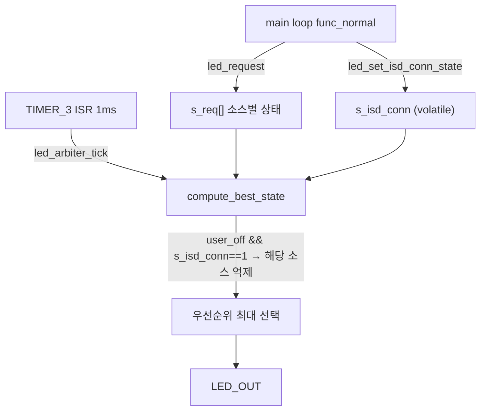

# ISD 연결/해제 LED 제어 — 정적 분석

**TL;DR**: 7개 상태 전이 시나리오 정적 추적 결과 **전부 의도대로 동작(7/7 PASS)**. 핵심 장치는 `compute_best_state`의 `s_isd_conn==1` 억제 게이트로, 연결 중에만 사용자 설정(끄기)을 적용하고 연결 해제 시 잔존 설정값을 무시해 배터리 레벨로 복귀시킨다. 리스크 6건 중 **배터리 임계 테스트값(pct<40)만 요구사항에 실제 영향**, `main.c:524` 조건은 fragile하나 현재 무해, 나머지는 코드 위생.

## 1. 검증 방법

정적 분석 — 서브에이전트 13개 병렬 워크플로(`wf_965f523e-bab`)로 각 시나리오·리스크를 독립 추적. `led_request()` → `s_req[]` 상태 → `compute_best_state()` 억제·우선순위 → 최종 색을 코드(`파일:라인`) 근거로 추적, 반례를 적극 탐색.

## 2. arbiter 동작 원리 (핵심)

- **연결 중(s_isd_conn=1) + 사용자 끄기(설정=2)**: ISD·BATTERY 등 일반 소스 전부 억제 → `LED_ST_IDLE` → 소등.
- **연결 해제(s_isd_conn=0)**: 잔존 설정값(2)이 있어도 억제 게이트가 닫혀 BATTERY 생존 → 배터리 레벨 점등.
- 우선순위: ERROR(90)·POWER(95/100)는 `user_off`여도 항상 표시(안전 carve-out). 배터리 위급 `BATT_CRITICAL`(60) > `IN_USE`(40).

## 3. 시나리오 검증 결과 (7/7 PASS)

| AC | 상황 | 배터리 정상 | 배터리 위급 | 판정 |
|---|---|---|---|---|
| 1 | 전원 인가·미연결 | BATT_READY(녹)/MID(주황) | BATT_CRITICAL(주황깜박) | ✅ |
| 2 | 연결·설정=1 | **IN_USE(백색)** | BATT_CRITICAL(주황깜박) | ✅ |
| 3 | 연결·설정=2 | IDLE(소등) | IDLE(소등) | ✅ |
| 4 | ③에서 해제(설정2 잔존) | BATT_READY/MID(점등) | BATT_CRITICAL(점등) | ✅ |
| 5 | 동일 ISD(설정2) 재연결 | IDLE(소등) | IDLE(소등) | ✅ |
| 6 | 다시 해제 | BATT_READY/MID(점등) | BATT_CRITICAL(점등) | ✅ |
| 7 | 새 ISD(설정1) 연결 | IN_USE(백색) | BATT_CRITICAL(주황깜박) | ✅ |

> [!NOTE]
> AC-2·7에서 "켜질 때 백색"은 배터리 정상 한정. 배터리 위급 시에는 `BATT_CRITICAL`(60)이 `IN_USE`(40)를 우선순위로 이겨 주황 깜박이 표시됨 — 요구사항("위급이면 주황 깜박")과 일치하나, 이는 **명시적 색 선택이 아니라 우선순위 경합 결과**라 우선순위 표 변경 시 취약(fragile).

## 4. 리스크 검증 결과 (6건)

| # | 리스크 | 확정 | 심각도 | 요구사항 영향 |
|---|---|---|---|---|
| R1 | `main.c:524 if (readLED_indicatorOnOff())` — 1·2 모두 참 → 설정=2여도 IN_USE 요청, `LED_ST_NONE` else는 dead branch | ✅ | medium | ❌(arbiter가 가려줌) |
| R2 | 연결 해제 시 `userSettingValue` 잔존(초기화 안 됨) | ✅ | low | ❌(s_isd_conn 게이트가 완화) |
| R3 | 해제 전환 시 main↔ISR race로 1-tick 백색 잔상 | ✅ | low | ❌(sub-perceptual, 1ms) |
| R4 | `compute_best_state` ERROR/POWER 예외 + 중첩 if 정합성 | ❌(결함아님) | low | ❌ |
| R5 | **배터리 임계 테스트값(pct<40)** | ✅ | medium | **✅** |
| R6 | 인코딩 손상(em dash/≈ → ?) | ✅ | low | ❌(전부 주석) |

### R1 — `main.c:524` 조건 (권장 수정)
`readLED_indicatorOnOff()`는 1/2를 반환하는데 `if(...)`는 둘 다 참 → 설정=2(끄기)에서도 `led_request(LED_SRC_ISD, LED_ST_IN_USE)` 실행, `main.c:532`의 `LED_ST_NONE` 분기는 **도달 불가(dead)**. 결과는 arbiter의 `user_off && s_isd_conn==1` 억제가 가려주나, 정상 동작이 *"main이 켜기 요청 → arbiter가 사후 억제"* 2단 우연 정합에 의존. 의미상 `== 1`로 고치면 dead branch·race-fragility 동시 제거.

### R5 — 배터리 임계 테스트값 (요구사항 영향·실기 검증 전 처리 필요)
`main.c:491` `pct < 40 /*10*/`(원래 10), `systemControl.c` `veryLowBattery`가 40% 미만으로 확장(원래 0%만). 영향 2가지:
- `BATT_CRITICAL`(60) > `IN_USE`(40)이므로 **배터리 40% 미만이면 ISD 연결+설정=1이어도 백색 대신 주황 깜박** → AC-2·7의 색이 깨짐.
- `veryLowBattery` 40% 미만 확장 → ISD 미연결+40%미만에서 `systemOff=true`(기기 전원 OFF) 경로 진입(단 ISD 연결 시 `isPowerOffEnabled=false` 가드 존재).

> [!IMPORTANT]
> 단, 배터리를 **40% 이상으로 충전한 상태**에서는 테스트값이어도 LED arbitration 검증이 정상(연결+설정1=백색, 미연결=배터리색). 색 세부(백색↔주황깜박)·전원 OFF 경로만 영향. 주석에 *"전기기계적안정성 시험을 위해"*라 명시돼 있어 **다른 시험 진행 여부 확인 필요**.

### R2·R3·R4·R6 — 코드 위생
- R2: 동작 정상. 견고성 위해 의도 주석·`s_isd_conn` 초기화 정정 권고.
- R3: disconnect 시 `s_isd_conn=0`(519) → `s_req[ISD]=NONE`(538) 순서 사이 ISR이 끼면 1-tick 백색 연장. sub-perceptual이나 과거 잔상 이력 감안, 쓰기 순서 뒤집기 권장.
- R4: ERROR/POWER 예외는 의도된 안전 carve-out, 중첩 if 논리 정확. 인덴트만 정렬 권고.
- R6: em dash(—)/≈ → `?` 손상이 `main.c` 9곳·`systemControl.c` 3곳, **전부 주석 내부**(코드/문자열/매크로 침범 0건, hexdump·grep 확인). 빌드·동작 무영향.

## 5. 종합 결론

- **ISD arbitration 로직 자체(`s_isd_conn` 게이트 + `main.c` ISD 분기)는 7 시나리오를 모두 충족** — 은수님 설계 의도가 정확히 구현됨.
- **실기 검증 전 처리**: R5 배터리 테스트값(시험 의도 확인 후 원복 또는 배터리 40%↑로 검증).
- **권장 수정**: R1(`== 1`), R3(disconnect 쓰기 순서).
- **위생(선택)**: R4 인덴트, R6 인코딩 복원(별도 커밋).
- **본 작업과 별개**: `ble` 0x36 CLASSIC_STATE, `remoteControl` passkey 우회, `systemControl` veryLowBattery 확장 — 커밋 분리.
