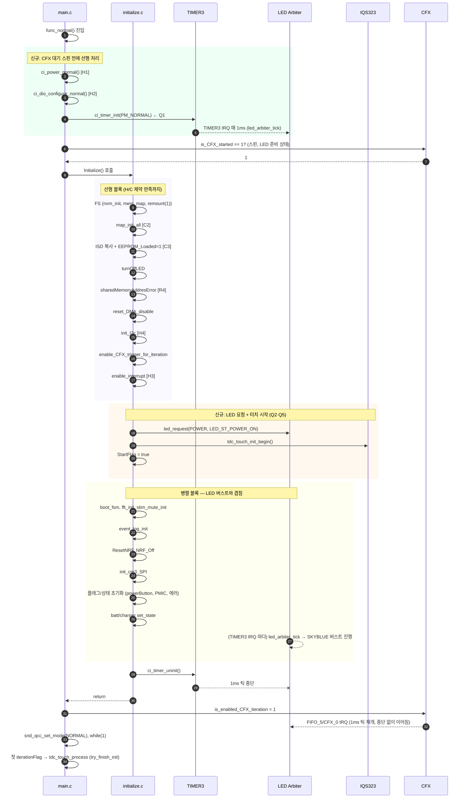

# POWER_ON LED 조기 점등 및 초기화 병렬화 — 구현 계획

작성자: 김은수
최종 갱신: 2026-04-24 (Rev.0 — 초안)
상태: 리뷰 대기 (사용자 승인 후 코드 구현 진입)

> [!NOTE]
> 본 계획은 다음 선행 문서의 결정·근거 위에 작성되었다:
> - [`요구사항.md`](요구사항.md) — 목표 G1~G5, 제약 C1~C4 · H1~H5, Q1~Q5 정의
> - [`분석.md`](분석.md) §10 — Q1~Q5 권고안, §9 — 위험 R1~R7
>
> Q1~Q5 결정은 분석 §10 권고안을 그대로 수용 (2026-04-24 사용자 승인).

---

## 1. 결정 사항 (Q1~Q5)

| # | 결정 | 근거 섹션 |
|---|---|---|
| **Q1** | 1 ms 틱 소스 = **옵션 A: TIMER3 재활용** | 분석 §5 |
| **Q2** | LED 요청 위치 = **P3: Initialize() 선행 블록 완료 직후** | 분석 §6 |
| **Q3** | CFX 시작 대기 스핀 유지. **스핀 앞에 `ci_power_normal` + `ci_dio_configure_normal` + `ci_timer_init` 3 단계를 이동** (스핀 구간도 LED 가 돌도록) | 분석 §7 |
| **Q4** | `Initialize()` 물리적 분할 X. **내부 재배열만** (선행 블록 → LED 요청 + 터치 시작 → 병렬 블록 → CFX iteration 활성화) | 분석 §6 |
| **Q5** | `tdc_touch_init_begin()` 을 **systemControl → initialize** 로 이관, LED 요청 바로 뒤에 배치. `try_finish_init()` 은 기존대로 메인 루프의 `tdc_touch_process()` 가 처리 (옵션 S2) | 분석 §8 |

---

## 2. 변경 파일 개요

| 파일 | 변경 유형 | 주요 변경 |
|---|---|---|
| [`src/2__cm3/Cortex-M3-src/main.c`](../../../../src/2__cm3/Cortex-M3-src/main.c) | 재배열 | CFX 대기 스핀 **앞**으로 `ci_power_normal`·`ci_dio_configure_normal`·`ci_timer_init` 이동. 스핀 직후 (기존 위치) 중복 호출 제거 |
| [`src/2__cm3/Cortex-M3-src/systemControl/initialize.c`](../../../../src/2__cm3/Cortex-M3-src/systemControl/initialize.c) | 재배열 + 추가 | Initialize() 내부 순서 재편, LED 요청·`tdc_touch_init_begin` 삽입, 끝에 `ci_timer_uninit()` 추가 |
| [`src/2__cm3/Cortex-M3-src/systemControl/systemControl.c`](../../../../src/2__cm3/Cortex-M3-src/systemControl/systemControl.c) | 제거 | `StartFlag == false` 분기의 `led_request(POWER, LED_ST_POWER_ON)`·`tdc_touch_init_begin()` 호출 제거. `StartFlag = true` 설정은 Initialize 로 이관 |
| (로그) | 선택 | RTT 마일스톤 로그 — 선행 블록 완료, LED 요청, 병렬 블록 시작/완료, TIMER3 uninit, CFX iteration 활성화 각 시점 |

**새 파일 생성 없음.** 함수 시그니처 변경 없음. 요구사항 §4.2 "기존 파일 수정 최소화" 준수.

---

## 3. 실행 순서 — 새 Initialize() 흐름

### 3.1 변경 후 타임라인



### 3.2 새 선행 블록 · 병렬 블록 분류

**선행 블록 (Initialize 초반, LED 요청 전 필수):**

| # | 단계 | 제약 |
|---|---|---|
| I1 | `ci_filesystem_nvm_init()` | FS 기반 |
| I2 | `snd_fatfs_init_mem_map()` | FS 기반 |
| I3 | `snd_fatfs_remount(1)` | FS 기반 |
| I4 | `snd_fatfs_remount(0)` → `ci_boot_handle_fsm()` → `snd_fatfs_remount(1)` | 기존 로직 유지 |
| I5 | `ci_map_init_map_data_all(false)` | C2 |
| I6 | `ci_filesystem_copy_isd_info_from_filesystem_to_shared_memory()` | C2 |
| I7 | `cfx_cm3_sharedMemoryAll.CFX_EEPROM_data_is_Loaded = 1` | C3 (I6 직후) |
| I8 | `turnOffLED()` | LED 잔상 제거 (요청 전) |
| I9 | `sharedMemoryAddresError()` | R4 (조기 실행으로 안전) |
| I10 | `reset_DMA_disable()` | 안정성 |
| I11 | `init_I2c()` | H4 (tdc_touch 전제) |
| I12 | `enable_CFX_trigger_for_iteration()` | CFX iteration 전제 |
| I13 | `enable_interrupt()` | H3 (ISR 허용) |

> 주의: `ci_power_normal()` · `ci_dio_configure_normal()` · `ci_timer_init()` 은 **main.c 의 CFX 대기 스핀 앞**에서 실행됨 (Q3). Initialize() 진입 시점엔 이미 활성. Initialize() 내부에는 중복 호출하지 않는다.

**LED 요청 구간 (Q2 · Q5):**

| 순서 | 호출 |
|---|---|
| L1 | `led_request(LED_SRC_POWER, LED_ST_POWER_ON)` |
| L2 | `tdc_touch_init_begin()` |
| L3 | `StartFlag = true` |

**병렬 블록 (LED 버스트 진행 중, 기존 순서 유지 내에서 재배치):**

| # | 단계 |
|---|---|
| P1 | `ci_fft_init_pass_bin_all()` |
| P2 | `ci_fft_init_window_coeff()` |
| P3 | `ci_stim_mute_init()` |
| P4 | `ci_event_log_init()` |
| P5 | `ResetNRF()` → `NRF_Off_Command()` |
| P6 | `init_cm3_SPI()` |
| P7 | `cfx_cm3_sharedMemoryAll.systemShare.powerButton_pushed_CFX_to_CM3 = 0` |
| P8 | `OnOff_3V_PMIC_CM3_to_CFX(false)` |
| P9 | `clearAllErrorFlag()` |
| P10 | `snd_batt_set_state(RESET) / snd_batt_set_percent(0)` |
| P11 | `snd_charger_set_state(RESET)` |

**Initialize() 종료 직전:**

| 순서 | 호출 | 비고 |
|---|---|---|
| F1 | `ci_timer_uninit()` | TIMER3 중지 — CFX iteration 활성화 전 배리어 |

### 3.3 main.c 변경 (Q3)

**기존 (pseudo):**

```c
func_normal() {
    // ... warm reset / PRIMASK / NVIC / RTT / AES ...
    while (1) {
        if (is_CFX_started == 1) break;
        __NOP();
    }
    Initialize();
    is_enabled_CFX_iteration = 1;
    snd_qcc_set_mode(NORMAL);
    while (1) { /* 메인 루프 */ }
}
```

**변경:**

```c
func_normal() {
    // ... warm reset / PRIMASK / NVIC / RTT / AES ...

    /* 신규: CFX 대기 전에 클럭/DIO/TIMER3 활성 — 스핀 중에도 LED 준비 */
    ci_power_normal();
    ci_dio_configure_normal();
    ci_timer_init(OTE_1_5_GEN_TIMER_TICK_1MS_PM_NORMAL);  /* TIMER3 on */

    while (1) {
        if (is_CFX_started == 1) break;
        __NOP();
    }

    Initialize();   /* 내부에서 LED 요청·병렬·ci_timer_uninit */

    is_enabled_CFX_iteration = 1;   /* CFX FIFO 틱 시작 */
    snd_qcc_set_mode(NORMAL);
    while (1) { /* 메인 루프 */ }
}
```

> TIMER3 활성화 시점과 CFX iteration 활성화 시점 사이엔 **오직 TIMER3 만 1ms 틱 소스**. Initialize 종료 직전 `ci_timer_uninit()` → `is_enabled_CFX_iteration = 1` 사이 구간엔 **틱 소스 없음** (수 μs ~ 수십 μs, 무시 가능).

### 3.4 initialize.c 변경 (Q4 기준, 내부 재배열)

**기존 상단부 (pseudo):**

```c
void Initialize(void) {
    /* NVM / FS / power / DIO / boot_fsm / map / ... 27 단계 순차 */
}
```

**변경:**

```c
void Initialize(void) {
    /* --- 선행 블록 (I1~I13) --- */
    ci_filesystem_nvm_init();
    snd_fatfs_init_mem_map();
    snd_fatfs_remount(1);
    snd_fatfs_remount(0);
    ci_boot_handle_fsm();
    snd_fatfs_remount(1);
    ci_map_init_map_data_all(false);
    ci_filesystem_copy_isd_info_from_filesystem_to_shared_memory();
    cfx_cm3_sharedMemoryAll.CFX_EEPROM_data_is_Loaded = 1;
    turnOffLED();
    sharedMemoryAddresError();
    reset_DMA_disable();
    init_I2c();
    enable_CFX_trigger_for_iteration();
    enable_interrupt();

    /* --- LED 요청 + 터치 초기화 시작 (Q2 · Q5) --- */
    led_request(LED_SRC_POWER, LED_ST_POWER_ON);
    tdc_touch_init_begin();
    StartFlag = true;   /* systemControl() 의 중복 호출 방지 */

    /* --- 병렬 블록 (P1~P11) --- */
    ci_fft_init_pass_bin_all();
    ci_fft_init_window_coeff();
    ci_stim_mute_init();
    ci_event_log_init();
    ResetNRF();
    NRF_Off_Command();
    init_cm3_SPI();
    cfx_cm3_sharedMemoryAll.systemShare.powerButton_pushed_CFX_to_CM3 = 0;
    OnOff_3V_PMIC_CM3_to_CFX(false);
    clearAllErrorFlag();
    snd_batt_set_state(RESET);
    snd_batt_set_percent(0);
    snd_charger_set_state(RESET);

    /* --- 종료 배리어 --- */
    ci_timer_uninit();  /* TIMER3 off — CFX iteration 활성화 직전 */
}
```

> 주: `ci_power_normal()`·`ci_dio_configure_normal()` 은 **Initialize 에서 제거** (main.c 로 이동). 이중 호출하면 상태 flip 가능성 있으므로 반드시 제거. DMA/타이머/인터럽트 등 다른 단계는 내부에서 처리.

### 3.5 systemControl.c 변경 (Q5)

**기존 (`StartFlag == false` 분기, 대략 line 209~224):**

```c
if (!chargerDisconnected) {
    /* ... 충전기 연결 처리 ... */
} else if (StartFlag == false) {
    led_request(LED_SRC_POWER, LED_ST_POWER_ON);
    tdc_touch_init_begin();
    StartFlag = true;
}
```

**변경:** `StartFlag == false` 분기 자체를 삭제 (Initialize 에서 이미 처리). 또는 방어적으로 남겨두되 내부 동작 제거:

```c
if (!chargerDisconnected) {
    /* ... 충전기 연결 처리 그대로 ... */
}
/* StartFlag == false 분기: Initialize 로 이관됨, 여기서 처리 안 함 */
```

> 권고: 분기 자체 삭제. `StartFlag` 는 Initialize 에서 이미 true 로 세팅되므로 이 분기는 절대 진입하지 않음. 사표 코드 제거가 정합성 유리.

---

## 4. 검증 계획

### 4.1 정적 검증 (코드 리뷰 체크리스트)

- [ ] `ci_power_normal()` · `ci_dio_configure_normal()` 이 Initialize() 에 **없음** (main.c 이동 확인)
- [ ] `ci_timer_init()` 이 main.c 의 CFX 대기 **앞**에 위치
- [ ] `ci_timer_uninit()` 이 Initialize() 종료 **직전** + `is_enabled_CFX_iteration = 1` **앞**
- [ ] `led_request(POWER, LED_ST_POWER_ON)` → `tdc_touch_init_begin()` → `StartFlag = true` 순서
- [ ] systemControl.c 의 `StartFlag == false` 분기 삭제 (혹은 비활성)
- [ ] 레지스터 변경 없음 → [`지침/레지스터 변경 검증 체크리스트.md`](../../../지침/레지스터%20변경%20검증%20체크리스트.md) 적용 대상 아님

### 4.2 런타임 검증 (J-Link + RTT)

| # | 시나리오 | 확인 방법 | 기대 |
|---|---|---|---|
| V1 | 정상 부팅 | RTT 로그 타임스탬프 비교 (변경 전 vs 후) | LED_ST_POWER_ON 요청 시각이 **수십~수백 ms 앞당겨짐** |
| V2 | LED 버스트 시각 패턴 | 육안 관찰 + 오실로스코프 (LED GPIO 채널) | SKYBLUE 180 ms ON / 180 ms OFF × 5 패턴, fade 포함. 기존과 구분 불가 |
| V3 | 틱 연속성 | `g_ci_timer_main_tick` 증가 추이 RTT 로그 | 전환 구간 (TIMER3 → CFX FIFO) 에서 중복·누락 없음. 1 ms 당 정확히 1 증가 |
| V4 | 터치 Auto-ATI | `tdc_touch_process()` 결과 로그 | MCLR → Auto-ATI 완료 타이밍이 기존과 동일 (~1.5 초 뒤) |
| V5 | 충전기 연결 부팅 | 충전기 연결 상태로 전원 on | POWER_ON LED 잠시 점등 후 충전 패턴으로 전환 (R5 허용 동작). 크래시/복구 없음 |
| V6 | MCU 에러 부팅 | 의도적 에러 유발 후 재부팅 | POWER_ON 점등 잠시 후 ERROR 패턴으로 덮이는지 확인 |
| V7 | Ezairo 워치독 리셋 | 워치독 만료 유도 | 재부팅 후 POWER_ON 정상 |
| V8 | ULP 진입/복귀 | 슬립 → 깨움 (전원버튼) | TIMER3 재init 에러 없음. LED·터치 재기동 정상 |

### 4.3 회귀 위험 지점 확인

- LED 페이드 (dimming) 이상 — V2 에서 육안 확인
- 공유 메모리 순서 위반 (C2·C3) — V1 에서 ISD 정보 사용처 (cfx_cm3_sharedMemory.c) 로그 확인
- 터치 센서 포착 실패 — V4 에서 Auto-ATI 완료 후 싱글터치 감지 테스트

---

## 5. 위험 대응 (분석 §9 참조)

| # | 위험 | 대응 |
|---|---|---|
| R1 | TIMER3 · CFX FIFO 이중 활성 → 틱 2배 | `ci_timer_uninit()` 과 `is_enabled_CFX_iteration = 1` 사이에 **동기화 배리어 로그 2 건** 삽입. V3 로 검증. 초기 구현에서 CFX iteration 활성화를 **아직 확인된 뒤** 로 당기지 않도록 조심 |
| R2 | DIO 설정 전 LED 조작 | Initialize 에서 `turnOffLED()` 는 유지 (DIO 이후). `led_request` 는 선행 블록 끝에서만 |
| R3 | 병렬 블록 길이로 워치독 초과 | 기존 `SYS_WATCHDOG_REFRESH()` 패턴 유지. 필요 시 병렬 블록 중간에 추가 |
| R4 | sharedMemoryAddresError 이후 LED 덮기 실패 | I9 를 선행 블록에 유지. 에러 시 LED 요청 전에 무한루프 진입 |
| R5 | 충전기/에러 부팅에서 POWER_ON 잠시 깜빡 | 요구사항 논의 대로 **허용**. V5·V6 에서 동작 확인 |
| R6 | ULP 재진입 시 TIMER3 이중 init | `ci_timer_init_prescaled()` 내부 `Sys_Timer_Stop` 선행으로 안전 (분석 §9 R6 확인됨) |
| R7 | MCLR 이 DIO 설정 전 실행 | `tdc_touch_init_begin()` 은 선행 블록 완료 후이므로 DIO·I2C 이미 완료. 위험 소멸 |

---

## 6. 롤백 방안

### 6.1 코드 수준

- 커밋 단위 분리:
  1. main.c 재배열 (ci_power_normal / dio / timer_init 이동)
  2. initialize.c 재배열 (선행 + LED 요청 + 병렬 + uninit)
  3. systemControl.c 중복 분기 제거
  4. (선택) RTT 로그 추가
- 문제 발생 시 해당 커밋만 `git revert` 가능

### 6.2 브랜치 수준

- 작업 브랜치: `claude_feature_early-power-on-led` (현재)
- 병합 대상: `claude_develop`
- 병합 전 실기 검증 필수 (V1~V8)

---

## 7. 커밋 전략

| 커밋 # | 내용 | 예상 메시지 제목 |
|---|---|---|
| 1 | main.c — CFX 대기 스핀 앞으로 clock/DIO/TIMER3 이동 | `fw(main): CFX 시작 대기 전 power·DIO·TIMER3 선행 활성화` |
| 2 | initialize.c — 선행/LED/병렬/uninit 재배열 | `fw(init): Initialize 내부 재배열 (선행→LED 요청→병렬→TIMER3 uninit)` |
| 3 | systemControl.c — StartFlag 분기 제거 | `fw(systemControl): LED·tdc_touch 시작을 Initialize 로 이관하고 레거시 분기 제거` |
| 4 (선택) | RTT 배리어 로그 | `fw(debug): early POWER_ON 전환 마일스톤 RTT 로그 추가` |

> 커밋·병합은 **사용자 `"작업 끝났어. 마무리해"` 시그널 수신 후** ([`feedback_work_completion_signal`](../../../../../../.claude/memory/feedback_work_completion_signal.md) 규칙).

---

## 8. 예상 코드 변경 분량

| 파일 | 추가 | 삭제 | 순변경 |
|---|---|---|---|
| `main.c` | ~5 | ~0 | +5 |
| `initialize.c` | ~5 | ~5 (재배열 포함) | 0 (순변경) |
| `systemControl.c` | ~0 | ~5 | -5 |
| **합계** | **~10** | **~10** | **~0** |

> 함수 시그니처·파일 구조 변경 없음. 신규 파일 없음. 레지스터 설정 변경 없음.

---

## 9. 이후 절차

1. **사용자 승인** — 본 계획 리뷰 후 "구현 시작" 명시
2. **구현 단계** — 커밋 4 건 (§7) 순차 작성
3. **빌드 검증** — IDE 빌드 (경고 0건 목표, 에러 0건)
4. **실기 검증** — V1~V8 (§4.2)
5. **이력 기록** — `이력.md` 작성 (본 작업 완료 후)
6. **완료 시그널** — 사용자 `"작업 끝났어. 마무리해"` 시 커밋·병합

---

## 10. 개정 이력

| Rev | 날짜 | 내용 |
|---|---|---|
| 0 | 2026-04-24 | 초안 — 분석 §10 권고안(Q1~Q5) 수용 기반 작성. 사용자 승인 대기 |
