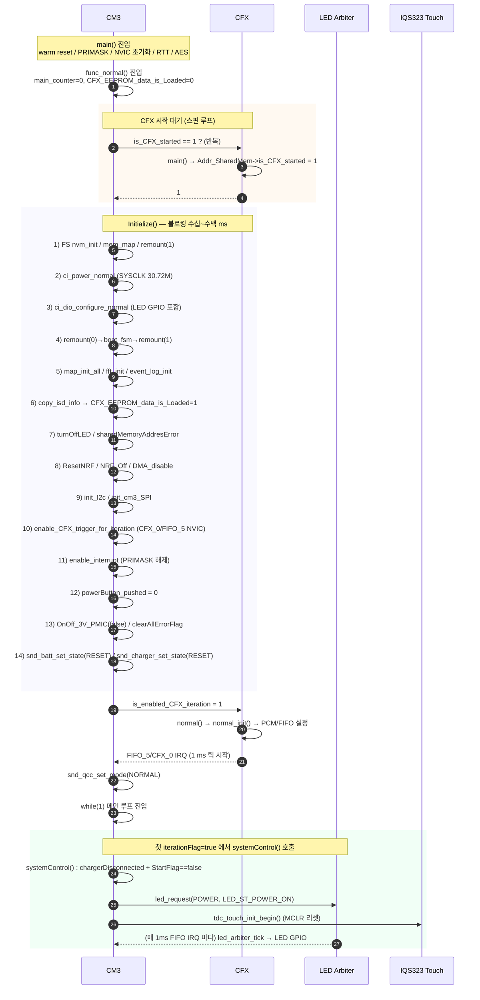

# POWER_ON LED 조기 점등 및 초기화 병렬화 — 현상 분석

작성자: 김은수
최종 갱신: 2026-05-04 (Rev.3 — `g_tdc_timer_t3_tick` 카운터 도입 + FSM 활용)
상태: Rev.3 리뷰 대기

> [!NOTE]
> 본 문서는 [`[요구사항] POWER_ON LED 조기 점등 및 초기화 병렬화 Rev.0 by 김은수.md`](%5B%EC%9A%94%EA%B5%AC%EC%82%AC%ED%95%AD%5D%20POWER_ON%20LED%20%EC%A1%B0%EA%B8%B0%20%EC%A0%90%EB%93%B1%20%EB%B0%8F%20%EC%B4%88%EA%B8%B0%ED%99%94%20%EB%B3%91%EB%A0%AC%ED%99%94%20Rev.0%20by%20%EA%B9%80%EC%9D%80%EC%88%98.md) 의 Q1~Q5 를 결정하기 위한 근거를 수집·정리한다.
>
> 본 분석은 전역 지침 [`[지침] [코딩] 분석·디버깅 규칙`](../../../docs/%5B%EC%A7%80%EC%B9%A8%5D%20%5B%EC%BD%94%EB%94%A9%5D%20%EB%B6%84%EC%84%9D%C2%B7%EB%94%94%EB%B2%84%EA%B9%85%20%EA%B7%9C%EC%B9%99.md) 에 따라 다음 원칙으로 작성되었다:
> 1. **호출 경로는 Grep 전수 확인** — 추정 금지, 모든 주장은 `파일:라인` 근거 제시
> 2. **가설 최소 3 개** — 옵션 · 후보 · 리스크 각각을 복수 관점으로 대조
> 3. **시스템 상태 시점 명시** — 전원 / 클럭 / IRQ / 공유 플래그 전이를 시간축으로 정렬
> 4. **사용자 제시 단서 적극 활용** — 요구사항 §6 Q1 "TIMER3 vs TIMER2" 는 사용자가 직접 지목한 선택지이므로 우선 검토

---

## 1. 현행 부팅 흐름 전체 호출 그래프

### 1.1 부트부터 LED_ST_POWER_ON 요청까지의 타임라인



### 1.2 각 단계의 시간 기준 상태

| 단계 | `iterationFlag` | `g_ci_timer_main_tick` | CFX 틱 | `led_arbiter_tick` 호출 | LED GPIO |
|---|---|---|---|---|---|
| main() 초입 | false (init 전) | 1 (초기값) | 없음 | 없음 | 불확정 |
| CFX 시작 대기 스핀 | false | 1 | 없음 | 없음 | 이전 세션 상태 잔존 가능 |
| Initialize 진행 중 | false | 1 (증가 없음) | 없음 | 없음 | DIO 구성 후 OFF (`turnOffLED()`) |
| `enable_interrupt()` 직후 | false | 1 | 없음 | 없음 | OFF |
| `is_enabled_CFX_iteration = 1` 직후 | false | 1 | CFX normal 시작 준비 중 | 없음 | OFF |
| CFX FIFO 첫 IRQ | **true** | 2 | **활성** | 1 회 | 색 없음 (요청 전) |
| systemControl() 첫 호출 | true→false | 3 이상 | 활성 | 매 tick | SKYBLUE (요청 후 1 tick 안에 점등) |

> [!IMPORTANT]
> 표에서 보듯 **`g_ci_timer_main_tick` 가 거의 증가하지 않는 구간이 수십~수백 ms 지속**된다. 이 구간에 LED 엔진을 돌리려면 별도 틱 소스가 필요하다.

---

## 2. Initialize() 27 단계 분류

### 2.1 전체 단계표 (initialize.c:238-465)

| # | 단계 | 함수 | 라인 | 공유 메모리 영향 | LED 시작 전 필수 여부 |
|---|---|---|---|---|---|
| 1 | NVM 인터페이스 | `ci_filesystem_nvm_init()` | 252 | - | **선행 필수** (FS 기반 모든 단계의 근원) |
| 2 | FFT/맵 공유 메모리 포인터 | `snd_fatfs_init_mem_map()` | 253 | - | **선행 필수** |
| 3 | 사용자 드라이브 마운트 | `snd_fatfs_remount(1)` | 254 | - | **선행 필수** |
| 4 | 전원/클럭 정상 설정 | `ci_power_normal()` | 255 | - | **H1 선행 필수** — SYSCLK 30.72 MHz |
| 5 | DIO 설정 (LED 포함) | `ci_dio_configure_normal()` | 259 | - | **H2 선행 필수** — LED GPIO 구성 |
| 6 | 부트 FSM | `ci_boot_handle_fsm()` | 266-269 | - | 병렬 가능성 중 |
| 7 | ISD 맵 파일 초기화 | `ci_map_init_map_data_all(false)` | 274 | - | **C2 선행 필수** (단계 12 의 전제) |
| 8 | FFT Pass Bin 초기화 | `ci_fft_init_pass_bin_all()` | 279 | - | 병렬 가능 |
| 9 | FFT Window Coeff | `ci_fft_init_window_coeff()` | 283 | - | 병렬 가능 |
| 10 | 자극 묵음 초기화 | `ci_stim_mute_init()` | 287 | - | 병렬 가능 |
| 11 | 이벤트 로그 초기화 | `ci_event_log_init()` | 290 | - | 병렬 가능 |
| 12 | **ISD 정보 FS → 공유 메모리 복사** | `ci_filesystem_copy_isd_info_from_filesystem_to_shared_memory()` | 298 | **쓰기** `cfx_ISD_info[0..3]` | **C2, C3 선행 필수** |
| 13 | EEPROM 로드 완료 플래그 | `cfx_cm3_sharedMemoryAll.CFX_EEPROM_data_is_Loaded = 1` | 299 | **쓰기** | **C3 선행 필수 (12 직후)** |
| 14 | LED OFF | `turnOffLED()` | 304 | - | **LED 점등 전에 실행되면 안 됨** (잔상 제거 목적) |
| 15 | 공유 메모리 주소 검증 | `sharedMemoryAddresError()` | 307 | 읽기 (검증) | 조기 실행 가능 — 에러 시 무한루프 |
| 16 | NRF 리셋 | `ResetNRF()` | 319 | - | 병렬 가능 |
| 17 | NRF 끄기 | `NRF_Off_Command()` | 323 | - | 병렬 가능 |
| 18 | DMA 초기화/비활성 | `reset_DMA_disable()` | 333 | - | **H (선행 권장)** — 안정적 상태 보장 |
| 19 | I2C 초기화 | `init_I2c()` | 336 | - | **H4 선행 필수** — 터치 초기화 (tdc_touch_init_begin) 의존 |
| 20 | SPI 초기화 | `init_cm3_SPI()` | 411 | - | 병렬 가능 (QCC 모드 설정 직전까지) |
| 21 | CFX 트리거 인터럽트 활성화 | `enable_CFX_trigger_for_iteration()` | 414 | - | **선행 필수** (CFX iteration 시작의 전제) |
| 22 | PRIMASK 해제 | `enable_interrupt()` | 417 | - | **H3 선행 필수** (ISR 실행 허용) |
| 23 | 전원 버튼 플래그 초기화 | `cfx_cm3_sharedMemoryAll.systemShare.powerButton_pushed_CFX_to_CM3 = 0` | 424 | **쓰기** | 병렬 가능 |
| 24 | 내부기 3V PMIC OFF | `OnOff_3V_PMIC_CM3_to_CFX(false)` | 427 | **쓰기** | 병렬 가능 |
| 25 | 에러 플래그 클리어 | `clearAllErrorFlag()` | 439 | - | 병렬 가능 |
| 26 | 배터리 상태 RESET | `snd_batt_set_state/percent(RESET, 0)` | 442-443 | - | 병렬 가능 |
| 27 | 충전기 상태 RESET | `snd_charger_set_state(RESET)` | 464 | - | 병렬 가능 |

### 2.2 분류 요약

```mermaid
flowchart LR
    subgraph PreLED["LED 시작 전 필수 (선행 블록)"]
        A1[1~3 FS 마운트]
        A2[4 ci_power_normal]
        A3[5 ci_dio_configure_normal]
        A4[7 map_init_all]
        A5[12~13 ISD 정보 복사 + Loaded=1]
        A6[14 turnOffLED]
        A7[18 reset_DMA_disable]
        A8[19 init_I2c]
        A9[21 enable_CFX_trigger_for_iteration]
        A10[22 enable_interrupt]
    end

    subgraph ParLED["LED 시작 이후 병렬 가능"]
        B1[6 boot FSM]
        B2[8 fft_init_pass_bin_all]
        B3[9 fft_init_window_coeff]
        B4[10 stim_mute_init]
        B5[11 event_log_init]
        B6[15 sharedMemoryAddresError]
        B7[16~17 ResetNRF / NRF_Off]
        B8[20 init_cm3_SPI]
        B9[23~27 플래그/상태 초기화]
    end

    PreLED --> POL[LED_ST_POWER_ON 요청<br/>tdc_touch_init_begin 호출]
    POL --> ParLED
    ParLED --> Finish[is_enabled_CFX_iteration = 1<br/>snd_qcc_set_mode NORMAL<br/>메인 루프 진입]
```



> [!NOTE]
> Rev.0: "선행 블록"에 들어간 단계 중 일부 (18 DMA / 7 map_init) 는 사실 **LED 점등이 요구하지 않는다** (DMA/map 은 LED GPIO 와 무관). 그러나 C2 제약 (map → ISD 복사) · H3 제약 (인터럽트) 등 때문에 LED 이전에 끝내야 한다.
>
> **Rev.2 갱신 (은수님 피드백)**: LED 점등 전 **진짜 필수**는 **NVM · FatFS · Power & Clock · Interrupt 설정만**. #7 (map_init) · #18 (DMA) · #19 (I2C) 는 LED 후로 이동 가능. 단 #7 에 의존하는 #12 (ISD 복사) 는 #7 과 같이 LED 후로 이동. 분류:
> - **PreLED (Rev.2 축소)**: A1~A3 (FS) + A4 (`ci_power_normal`) + A5 (`ci_dio_configure_normal`) + 인터럽트 게이트 (PRIMASK 이미 해제, TIMER3 IRQ 는 `ci_timer_init` 자동) + `led_isr_active_set(true)` + `sharedMemoryAddresError` (R4 보존)
> - **ParLED (Rev.2 확장)**: 위 외 모든 단계 — boot_fsm, map_init, FFT, ISD 복사+Loaded=1, NRF, DMA, I2C, tdc_touch_init, SPI, 플래그/PMIC/clearAllErrorFlag, batt, charger
>
> 즉 Rev.0 의 "선행 블록 14 단계" → Rev.2 "5 단계 + 게이트"로 축소.

---

## 3. 1 ms 틱 소스 현황

### 3.1 Normal 모드 (현재)

| IRQ | 핸들러 | 동작 | 활성 조건 |
|---|---|---|---|
| `CFX_0_IRQn` | [`CFX_0_IRQHandler`](../src/2__cm3/Cortex-M3-src/systemControl/driver_timmer.c#L11) | `enable_iteration(); ci_timer_increase_tick(); led_arbiter_tick();` | `enable_CFX_trigger_for_iteration()` + CFX normal 진입 |
| `FIFO_5_IRQn` | [`FIFO_5_IRQHandler`](../src/2__cm3/Cortex-M3-src/systemControl/driver_timmer.c#L21) | `CFX_0_IRQHandler()` 대행 | 동일 |
| `TIMER_3_IRQn` | [`TIMER_3_IRQHandler`](../src/2__cm3/Gen1_5/common/ci_timer.c#L18) | `g_ci_timer_main_tick++; enable_iteration(); led_arbiter_tick();` | **미활성** (normal 모드에선 `ci_timer_init()` 미호출) |

### 3.2 TIMER_3_IRQHandler 핵심 코드 확인

```c
/* ci_timer.c:18-30 */
void TIMER_3_IRQHandler(void)
{
    g_ci_timer_main_tick++;
    enable_iteration(); /* Use when the CFX is not working */  ← 이 주석이 결정적 단서

    /* LED arbiter/engine/PWM 을 ISR 에서 직접 구동 — main loop 의
     * I2C/EEPROM 폴링 블록으로 인한 fade/PWM 타이밍 jitter 방지.
     * 실행시간 추정 ~15 μs @ 30.72 MHz / ~62 μs @ 7.68 MHz. */
    led_arbiter_tick();
}
```

> [!IMPORTANT]
> 주석 `Use when the CFX is not working` 은 이 ISR 이 본래 **CFX 미동작 구간의 틱 백업**으로 설계되었음을 명시한다. 즉 이번 요구사항(LED를 CFX 기동 전에 돌림)은 **이 핸들러가 상정한 시나리오와 정확히 일치**한다.

### 3.3 TIMER3 사용 현황 전수 확인

```
Grep "TIMER_3_IRQHandler" → 2 건 (ci_timer.c 정의, ci_timer.h 선언)
Grep "ci_timer_init"      → main.c:701 (ULP 진입)
                          → ci_timer.c:164, 166 (구현)
```

결론: 현재 **Normal 모드 전구간에서 TIMER3 는 인터럽트가 발생하지 않는다**. ULP 진입 시 `ci_timer_init_prescaled(TIMER_PRESCALE_128, 155)` 로 500 ms 주기 타이머로 재구성될 뿐.

### 3.4 LED 엔진이 틱에 의존하는 지점

| 호출처 | 함수 | 의존 |
|---|---|---|
| `CFX_0_IRQHandler` | `led_arbiter_tick()` | fade-in / fade-out / PWM duty 갱신 |
| `FIFO_5_IRQHandler` | 동일 | 동일 |
| `TIMER_3_IRQHandler` | 동일 | 동일 |
| main loop | (직접 호출 없음 — 주석 `LedOutput.c` 에 명시) | - |

즉 LED 는 **어느 ISR 에서든 `led_arbiter_tick()` 이 1 ms 주기로 호출되기만 하면** 정상 동작한다. 본 요구사항을 위해 새 경로를 추가할 필요는 없고, 기존 TIMER3 경로를 임시 활성화하거나 TIMER2 에 동일 핸들러를 붙이면 된다.

### 3.5 Rev.2 권고 — ISR 책임 분리 (TIMER3 LED 전담)

은수님 피드백 (2026-05-04):
- CFX FIFO 인터럽트와 타이머 인터럽트는 **별개로 분리해도 안전**
- 시스템 시간 (`g_ci_timer_main_tick`) 갱신은 **CFX FIFO 가 담당**
- LED 갱신은 **TIMER3 가 전담**
- TIMER3 는 **normal 모드 동안 항상 활성** (`ci_timer_uninit()` 강제 호출 불필요)
- Sleep 진입 시점에서만 TIMER3 용도를 LED → 500 ms wakeup 으로 재구성

#### 3.5.1 책임 분리 모델

| ISR | 현재 (Rev.0) | Rev.3 권고 |
|---|---|---|
| `TIMER_3_IRQHandler` | `g_ci_timer_main_tick++ + enable_iteration + led_arbiter_tick` | **`g_tdc_timer_t3_tick++ + led_arbiter_tick`** (LED + 터치 공유 카운터 + LED). normal 동안 항상 활성. main_tick 은 더 이상 안 건드림 |
| `CFX_0_IRQHandler` | `enable_iteration + ci_timer_increase_tick + led_arbiter_tick` | **`enable_iteration + ci_timer_increase_tick`** (시스템 시간 main_tick 전담). LED 호출 제거 |
| `FIFO_5_IRQHandler` | `CFX_0_IRQHandler()` 대행 | 동일 (CFX_0 갱신 따라감) |

#### 3.5.2 Rev.0 R1 (틱 2 배) 위험 소멸

Rev.0 §9 R1 = "TIMER3 + CFX FIFO 동시 활성 → 틱 2 배". Rev.2 모델에선:
- TIMER3 ISR 이 `g_ci_timer_main_tick++` 더 이상 안 함
- CFX FIFO ISR 이 `led_arbiter_tick` 더 이상 안 함
- → 두 ISR 동시 활성 OK. R1 자연 소멸. `ci_timer_uninit()` 호출 시점 제약 풀림

#### 3.5.3 ULP / Sleep 처리

ULP 모드는 LED 사용 X. Sleep 진입 시 TIMER3 용도 변경:
1. `func_sleep()` 진입 직후 → `ci_timer_uninit()` (LED 전담 ISR 정지)
2. ULP 500 ms wakeup 용으로 `ci_timer_init_prescaled(...)` 재호출 (기존 ULP 코드 유지)
3. Wakeup → `func_normal()` 재진입 시 `ci_timer_init(...)` 1 ms 재 init

대안: `TIMER_3_IRQHandler` 안에서 `g_pm_mode` 분기 — 코드 단순성과 ISR 부담 trade-off. 구현계획 단계에서 확정.

#### 3.5.4 timer_tick 카운터 도입 (Rev.3 — LED · 터치센서 공유)

은수님 결정 (Q1=C): TIMER3 ISR 안에 **별도 카운터 `g_tdc_timer_t3_tick`** 도입. LED arbiter 와 터치센서가 이 카운터를 공유 사용. 시스템 시간 (`g_ci_timer_main_tick`) 은 CFX FIFO 가 그대로 담당 → **다른 모듈 영향 0**.

| 카운터 | 증가 ISR | 책임 | 활성 구간 | 사용처 |
|---|---|---|---|---|
| `g_ci_timer_main_tick` | `CFX_0_IRQHandler` (FIFO_5 대행) | 시스템 시간 (로그·상태 머신·시간 표시) | CFX iteration 활성화 후 ~ | 기존 모든 모듈 (변경 없음) |
| `g_tdc_timer_t3_tick` (Rev.3 신규) | `TIMER_3_IRQHandler` | LED fade · 터치 MCLR/Auto-ATI 시간 | TIMER3 init (P3-Early = Initialize 단계 5 직후) ~ sleep 진입 | LED arbiter, `tdc_touch.c` |

신규 인터페이스 (구현계획에서 명명 확정):
- `int tdc_timer_get_t3_tick(void);` — t3_tick 읽기

#### 3.5.5 영향 범위

- **`tdc_touch.c`**: `s_mclr_done_tick = ci_timer_get_tick()` → `s_mclr_done_tick = tdc_timer_get_t3_tick()` 로 변경. `tdc_touch_process()` 의 1500 ms 측정도 동일 변경. → LED 시작 시점부터 1500 ms 측정 시작 → Auto-ATI 가 LED 버스트 (~1.8 s) 안에 자연 동기.
- **LED arbiter**: 자체 ms 카운터 유지 또는 `g_tdc_timer_t3_tick` 활용 — 구현계획에서 결정. 일관성 측면에서 `g_tdc_timer_t3_tick` 활용 권장.
- **다른 모듈**: 변경 없음 (`g_ci_timer_main_tick` / `ci_timer_get_tick()` 인터페이스 그대로).

#### 3.5.6 FSM 활용 (Q3=A)

은수님 결정 (Q3=A): LED · 터치 초기화 시퀀스를 명시적 FSM 으로 표현. `systemControl()` 전체 FSM 화는 본 작업 범위 외 (별도 최적화 작업으로 미래).

본 작업의 FSM 대상:
- LED arbiter 내부 상태 (이미 일부 FSM): cross-fade phase, 요청 대기
- 터치 초기화 진행 상태 (`s_init_state` = NONE / MCLR_DONE / AUTO_ATI_DONE): 명시적 enum + 전이 함수로 정리
- 두 FSM 의 외부 트리거 (Initialize 안 LED 요청 + tdc_touch_init_begin 호출)

상세 FSM 설계 (상태 정의·전이 다이어그램·전이 조건) 는 **구현계획.md Rev.3** 에서 정리. 지침 [`구현 패턴.md`](../../../지침/코딩/구현%20패턴.md) FSM 우선 원칙 적용.

---

## 4. CFX-CM3 동기화 포인트 상세

### 4.1 핵심 플래그 4 종의 설정/참조

| 플래그 | 정의 | 쓰기 | 참조 |
|---|---|---|---|
| `is_CFX_started` | [`shared_memory.h:205`](../src/1__cfx/environment/shared_memory.h) | **CFX** [`src/1__cfx/systemControl/main.c:47`](../src/1__cfx/systemControl/main.c) | **CM3** [`main.c:337`](../src/2__cm3/Cortex-M3-src/main.c) (부트 대기) · [`calibration/app.c:222`](../src/5__calibration/source/app.c) |
| `is_enabled_CFX_iteration` | [`shared_memory.h:206`](../src/1__cfx/environment/shared_memory.h) | **CM3** [`main.c:354`](../src/2__cm3/Cortex-M3-src/main.c) | **CFX** [`src/1__cfx/systemControl/main.c:49`](../src/1__cfx/systemControl/main.c) (normal 진입 게이트) |
| `CFX_EEPROM_data_is_Loaded` | [`shared_memory.h:179`](../src/1__cfx/environment/shared_memory.h) | **CM3** [`initialize.c:299`](../src/2__cm3/Cortex-M3-src/systemControl/initialize.c) (1 설정), [`main.c:330`](../src/2__cm3/Cortex-M3-src/main.c) (0 초기화), [`bootloader/main.c`](../src/0__bootloader/main.c) (0 초기화) | **CM3** [`cfx_cm3_sharedMemory.c:36`](../src/2__cm3/Cortex-M3-src/systemControl/cfx_cm3_sharedMemory.c) 외 |
| `cfx_ISD_info[0..3]` | [`shared_memory.h:186`](../src/1__cfx/environment/shared_memory.h) | **CM3** [`ci_filesystem.c:919`](../src/2__cm3/Gen1_5/FS/ci_filesystem.c), [`fn_from_cfx_eeprom_read.c:16`](../src/2__cm3/Gen1_5/fn_fromCFX/fn_from_cfx_eeprom_read.c) | **CM3** [`cfx_cm3_sharedMemory.c:347-409`](../src/2__cm3/Cortex-M3-src/systemControl/cfx_cm3_sharedMemory.c) (isd_id / passkey / userName / location 조회) |

### 4.2 주의할 세 가지 순서 의존

1. **`is_enabled_CFX_iteration = 1` 이후에만 CFX FIFO 틱 발생** — 즉 이 플래그가 현재 구현상 "진짜 1 ms 틱의 시작 신호". Early POWER_ON 구간 LED 를 다른 틱 소스로 돌리더라도, 메인 루프 진입 후에는 결국 이 플래그가 설정되어야 시스템 전체가 돈다.
2. **`ci_filesystem_copy_isd_info_*` → `CFX_EEPROM_data_is_Loaded = 1`** — 순서 반전 시 다른 모듈이 "로드 완료 상태" 로 잘못 읽을 수 있음. 중간에 LED 요청이 끼어들어도 이 두 연산은 붙어 있어야 함.
3. **`sharedMemoryAddresError()` 체크는 `ci_filesystem_copy_isd_info_*` 이후에 놓여 있으나** 실제 검증은 공유 메모리 **주소 구조** 확인이므로 ISD 정보 복사 결과와 독립. LED 점등 전후 어디든 배치 가능하나 에러 시 무한루프 진입이라 조기 실행이 안전.

> [!NOTE]
> Rev.2 갱신: ISR 책임 분리 (§3.5) 로 TIMER3·CFX FIFO 동시 활성 OK. **LED 입장에선 TIMER3 가 자체 1 ms 틱을 제공**하므로 CFX iteration 활성화 타이밍과 무관하게 LED fade 진행 가능. 결과적으로 Initialize 를 다 끝낸 후 `is_enabled_CFX_iteration = 1` 켜는 모델로 단순화 — 4.2 의 "1번 의존" 제약 풀림.

### 4.3 CFX 가 `cfx_ISD_info` / `CFX_EEPROM_data_is_Loaded` 를 직접 참조하는가?

```
Grep in src/1__cfx/ for "cfx_ISD_info"            → 선언만 (shared_memory.h:186)
Grep in src/1__cfx/ for "CFX_EEPROM_data_is_Loaded" → 선언만 (shared_memory.h:179)
```

CFX 펌웨어 자체는 이 두 필드를 **read 하지 않는다.** 다만 signalProcessing / audio 경로가 읽을 가능성이 남아 있으므로 순서는 보수적으로 유지하는 게 안전하다. 이 사실은 "LED 를 일찍 켜도 ISD 정보 복사 전까지는 CFX 가 최소한 해당 필드를 바라보지는 않는다"는 보조 근거가 된다.

---

## 5. 1 ms 틱 소스 옵션 평가 (Q1)

### 5.1 옵션 A — TIMER3 재활용

**개요:** Initialize 초반에 `ci_timer_init(OTE_1_5_GEN_TIMER_TICK_1MS_PM_NORMAL)` (인자 39) 호출 → `TIMER_3_IRQHandler` 가 1 ms 마다 `g_ci_timer_main_tick++ / enable_iteration / led_arbiter_tick` 수행. `is_enabled_CFX_iteration = 1` 직전에 `ci_timer_uninit()` 호출.

**장점**
- ISR / 프레임워크가 **이미 완비**. 코드 추가 최소 (Initialize 에 한두 줄 수준).
- `Use when the CFX is not working` 주석이 시사하듯 **원래 이 용도로 설계된** 핸들러.
- `g_ci_timer_main_tick` 이 CFX 전환 후에도 이어서 증가 → 터치 초기화 타임스탬프(`s_mclr_done_tick`) 연속성 자연스럽게 유지.

**단점 / 위험**
- CFX_0/FIFO_5 와 동시 활성 구간이 생기면 **틱이 2 배로 증가** (Rev.2 에서 명시). 반드시 "uninit → CFX iteration 활성화" 순서 유지 필요.
- ULP (sleep) 에서 동일 TIMER3 를 500 ms 타이머로 재구성. 현 흐름에서는 `func_sleep()` 이전에 충분히 uninit 되어 충돌 없음을 **확인은 해야 함**.

### 5.2 옵션 B — TIMER2 신규

**개요:** 새 ISR `TIMER_2_IRQHandler` 를 추가해 `led_arbiter_tick()` 만 호출. 또는 `enable_iteration + ci_timer_increase_tick` 도 같이. 관련 init/uninit 헬퍼도 별도 정의.

**장점**
- TIMER3 의 용도(ULP 웨이크업)와 **물리적으로 분리** → 혼동 없음.
- ci_timer 프레임워크에 손 안 대고 병렬 동작 가능.

**단점 / 위험**
- 신규 ISR 추가 + 신규 init/uninit 헬퍼 + NVIC 설정 → 코드/리뷰 비용 증가.
- `g_ci_timer_main_tick` 증가를 중복시키지 않도록 별도 관리 필요 (예: 증가 호출 제외). 그러면 LED 버스트 구간에서 `ci_timer_get_tick()` 이 멈춰 있어 터치 초기화의 `s_mclr_done_tick` 기반 타임아웃이 오작동 가능.
- 만약 `ci_timer_increase_tick` 을 호출하면 TIMER3 재활용과 거의 동일한 결과 → 굳이 TIMER2 로 옮길 이득이 없음.

### 5.3 옵션 C — 타이머 없이 CFX 순서만 재배치

**개요:** TIMER 활성화 없이, Initialize 를 "LED 전 필수 블록 + `is_enabled_CFX_iteration = 1` + Early POWER_ON 요청" 순서로 묶어 CFX FIFO 틱 자체를 앞당김.

**장점**
- 타이머 추가 없음.

**단점 / 위험**
- CFX 가 normal 모드로 정상 진입하려면 자신의 `normal_init()` 내 FIFO 설정 · PCM 준비 등이 선행되어야 한다 ([`src/1__cfx/systemControl/main.c:67-111`](../src/1__cfx/systemControl/main.c)). 이 준비가 미완성된 상태에서 CM3 가 LED 요청 (공유 메모리 기반은 아니지만) 이나 기타 공유 메모리 쓰기를 시도하면 PCM / HEAR 초기 설정과 경쟁 조건 발생 가능.
- 특히 `ci_filesystem_copy_isd_info_*` (C2 · C3) 는 CFX normal 진입 **전** 에 끝나 있어야 안전. 그러면 병렬화 가능 구간이 좁아 기대 효과가 작다.
- Initialize 마지막 구간의 I2C/SPI/PMIC/상태 플래그 초기화를 병렬로 돌리려면 결국 LED 엔진이 돌아야 하는데 CFX 틱 없이는 불가능.

### 5.4 결론 후보

| 옵션 | 구현 난이도 | 리스크 | 기대 단축 | 종합 |
|---|---|---|---|---|
| A (TIMER3 재활용) | **낮음** | 낮음 (Rev.2 ISR 책임 분리로 R1 소멸) | 수십~수백 ms | **우선 후보 (Rev.2 강화)** |
| B (TIMER2 신규) | 중 | 낮음 (분리 명확) | A 와 동등 | A 로 얻기 어려운 가치 없음 |
| C (타이머 없이) | 낮음 | 높음 (CFX 경쟁) | 제한적 | 배제 |

> [!NOTE]
> **권고안: 옵션 A** (§6 참조). **Rev.2** — TIMER3 = LED 전담, normal 동안 항상 활성. `ci_timer_uninit()` 호출 시점은 **`func_sleep()` 진입 시**로 단순화. ULP 모드는 동일 TIMER3 를 500 ms wakeup 으로 재구성 (기존 ULP 코드 유지).

---

## 6. LED_ST_POWER_ON 요청 위치 옵션 (Q2)

### 6.1 후보 위치

| ID | 위치 | 코드 개요 |
|---|---|---|
| P1 | `main()` 에서 `Sys_DIO_CM3JTAGConfig` 이후 바로 | 가장 빠른 점등. 그러나 `ci_dio_configure_normal()` 전이라 LED GPIO 구성이 불확실. 전원·클럭도 디폴트 상태 |
| P2 | `func_normal()` 진입 직후 (CFX 대기 **전**) | 여전히 DIO/전원 미구성. 부적합 |
| **P3-Early** | **`ci_dio_configure_normal()` 직후 (Initialize 단계 5 직후)** | **H1·H2 만족 + LED 점등에 불필요한 단계 (FS · map · I2C · boot_fsm 등) 는 LED 후로 밀어 추가 단축. 사용자 신규 제안 (Rev.1). 상세 §6.3** |
| P3 | Initialize 선행 블록 완료 직후 (§2.2 PreLED 의 마지막 A10 다음) | H1~H4 모두 만족. 선행 블록 안전 최조기 시점. 상세 §6.2 |
| P4 | 현재와 동일 (`systemControl()` 분기) | 변경 없음. G1 미달 |

### 6.2 P3 세부

선행 블록 A1~A10 을 Initialize 초반에 몰아넣고, 그 직후에 다음 두 호출을 배치한다.

```c
/* initialize.c — 선행 블록 이후 */
ci_timer_init(OTE_1_5_GEN_TIMER_TICK_1MS_PM_NORMAL);   /* 옵션 A: TIMER3 활성 */
led_request(LED_SRC_POWER, LED_ST_POWER_ON);           /* 즉시 LED 요청 */
tdc_touch_init_begin();                                /* 기존 병렬 초기화 유지 */

/* ... 병렬 가능 블록 (§2.2 ParLED) ... */

ci_timer_uninit();                                     /* CFX iteration 전 전환 */
cfx_cm3_sharedMemoryAll.is_enabled_CFX_iteration = 1;  /* main.c 의 기존 위치 또는 initialize.c 끝 */
```

단, 배치 장소 (initialize.c vs main.c) 와 `StartFlag` / `systemControl()` 초기 분기 영향은 구현계획에서 확정.

### 6.3 P3-Early 세부 (사용자 제안 Rev.1)

은수님 제안: `ci_dio_configure_normal()` **직후** LED 점등 시작 + 인터럽트 관련 설정도 그 앞으로. 즉 P3 보다 더 이른 시점. P3 가 선행 블록 (A1~A10) 완료를 기준으로 했다면, P3-Early 는 **LED 점등의 진짜 최소 사전조건만** 만족하는 시점이다.

#### 6.3.1 LED 점등의 진짜 최소 사전조건 (코드 사실 확인)

| 사전조건 | 근거 | P3-Early 시점 만족 여부 |
|---|---|---|
| 전원·클럭 (H1) | `ci_power_normal()` ([initialize.c:258](../../../../src/2__cm3/Cortex-M3-src/systemControl/initialize.c)) | ✅ 단계 4 |
| LED GPIO (H2) | `ci_dio_configure_normal()` ([initialize.c:262](../../../../src/2__cm3/Cortex-M3-src/systemControl/initialize.c)) | ✅ 단계 5 |
| TIMER3 IRQ enable | `ci_timer_init()` 이 자체적으로 `NVIC_EnableIRQ(TIMER_3_IRQn)` 수행 ([ci_timer.c:153-154](../../../../src/2__cm3/Gen1_5/common/ci_timer.c)) | 🆕 새로 단계 5 직후에 추가 |
| LED arbiter 게이트 | `led_isr_active_set(true)` ([LedOutput.c:69-72](../../../../src/2__cm3/Cortex-M3-src/systemControl/LedOutput.c)) | 🆕 새로 단계 5 직후에 추가 |
| PRIMASK 해제 | `enable_interrupt()` = `__set_PRIMASK(ENABLE)` 한 줄 ([initialize.c:144-149](../../../../src/2__cm3/Cortex-M3-src/systemControl/initialize.c)). 단 [main.c:282-285](../../../../src/2__cm3/Cortex-M3-src/main.c) 에서 이미 해제됨 | ✅ main 진입 시점부터 만족, 단 R9(R-PRIMASK) 검증 필요 |
| LED 모듈 init | 명시적 init 함수 없음 (정적 초기화) | ✅ 자동 |
| `enable_CFX_trigger_for_iteration()` | CFX_0/FIFO_5 NVIC 활성화 ([initialize.c:129-142](../../../../src/2__cm3/Cortex-M3-src/systemControl/initialize.c)) | ❌ TIMER3 LED 점등에 **불필요**. CFX iteration 활성화 직전에만 호출 |

#### 6.3.2 P3-Early 흐름 (제안)

```c
/* initialize.c — P3-Early */
/* === 최소 선행 블록 === */
ci_filesystem_nvm_init();          /* FS init: ci_power_normal 의존성 검증 후 위치 결정 (Q7) */
snd_fatfs_init_mem_map();
snd_fatfs_remount(1);
ci_power_normal();                 /* H1 */
ci_dio_configure_normal();         /* H2 */

/* === LED 점등 진입 (P3-Early Rev.2) === */
ci_timer_init(OTE_1_5_GEN_TIMER_TICK_1MS_PM_NORMAL);  /* TIMER3 LED 전담 ISR — normal 동안 항상 활성 */
sharedMemoryAddresError();                             /* R4 보존: 에러 시 무한루프 → LED 켜기 전 */
turnOffLED();                                          /* 잔상 제거 (즉시 OFF 분기, isr_active=false 상태) */
led_isr_active_set(true);                              /* LED arbiter ISR 게이트 ON */
led_request(LED_SRC_POWER, LED_ST_POWER_ON);           /* 즉시 fade-in */
StartFlag = true;                                      /* systemControl 중복 진입 방지 */

/* === 병렬 블록 (LED 버스트 진행 중) === */
snd_fatfs_remount(0); ci_boot_init_fp(...); ci_boot_handle_fsm(); snd_fatfs_remount(1);
ci_map_init_map_data_all(false);
ci_fft_init_pass_bin_all(); ci_fft_init_window_coeff(); ci_stim_mute_init(); ci_event_log_init();
ci_filesystem_copy_isd_info_*(); cfx_cm3_sharedMemoryAll.CFX_EEPROM_data_is_Loaded = 1;
ResetNRF(); NRF_Off_Command();
reset_DMA_disable();
init_I2c();                                            /* H4 */
tdc_touch_init_begin();                                /* Q5 이관 */
init_cm3_SPI();
/* ... 플래그 / PMIC / clearAllErrorFlag / batt / charger ... */

/* === Initialize 종료 (Rev.2 — TIMER3 stop 안 함) === */
enable_CFX_trigger_for_iteration();                    /* CFX_0/FIFO_5 NVIC enable */
/* return → main.c: is_enabled_CFX_iteration = 1 */
/* TIMER3 LED 전담은 계속 활성. stop 은 func_sleep() 진입 시점에 처리 */
```

**ISR 변경 (Rev.2 책임 분리, 별도 파일):**

```c
/* ci_timer.c — TIMER_3_IRQHandler (Rev.3) */
void TIMER_3_IRQHandler(void)
{
    /* normal 모드: t3_tick (LED + 터치 공유) + LED arbiter. main_tick 은 CFX FIFO */
    g_tdc_timer_t3_tick++;          /* Rev.3 신규 — LED · 터치 공유 카운터 */
    led_arbiter_tick();
    /* ULP 분기는 구현계획 단계에서 확정 */
}

/* driver_timmer.c — CFX_0_IRQHandler / FIFO_5_IRQHandler (Rev.3) */
void CFX_0_IRQHandler(void)
{
    enable_iteration();
    ci_timer_increase_tick();      /* main_tick 증가 — 시스템 시간 전담 (기존 그대로) */
    /* led_arbiter_tick() 제거 — TIMER3 가 전담 */
}

/* tdc_touch.c — Rev.3 변경 */
void tdc_touch_init_begin(void)
{
    SYS_WATCHDOG_REFRESH();
    tdc_drv_iqs323_mclr_reset();
    s_mclr_done_tick = tdc_timer_get_t3_tick();   /* Rev.3 — main_tick → t3_tick */
    s_init_state     = TDC_TOUCH_INIT_STATE_MCLR_DONE;
}
```

#### 6.3.3 P3 대비 추가 단축 효과

| 단계 | P3 위치 | P3-Early 위치 | LED 후로 밀린 시간 |
|---|---|---|---|
| 6 boot_handle_fsm | LED 전 | LED 후 | 수 ms |
| 7 map_init_map_data_all | LED 전 | LED 후 | 수십 ms (FS 읽기) |
| 8~11 FFT/stim_mute/event_log | LED 전 | LED 후 | 수 ms ~ 수십 ms |
| 12 ISD 정보 복사 | LED 전 | LED 후 | 수 ms |
| 18 reset_DMA_disable | LED 전 | LED 후 | 수 μs |
| 19 init_I2c | LED 전 | LED 후 | 수 ms |
| 20 init_cm3_SPI | LED 전 | LED 후 | 수 μs |

추정 **추가 단축: 수십 ~ 수백 ms** (실측 필요).

### 6.4 P3 vs P3-Early 양안 비교

| 항목 | P3 (Rev.0 채택) | P3-Early (Rev.2 갱신) |
|---|---|---|
| LED 요청 위치 | Initialize 단계 22 (선행 블록 완료 직후) | Initialize 단계 5 직후 |
| LED 점등 사전 만족 | H1~H5 + 인터럽트 + I2C | H1·H2 + TIMER3 + isr_active |
| 코드 변경 분량 | ~10 라인 (재배열) | ~20 라인 (재배열 + 신규 호출 + ISR 책임 분리) |
| 추가 단축 | P3 대비 0 | P3 + 수십~수백 ms |
| `sharedMemoryAddresError` 위치 | 선행 블록 (LED 전) | LED 요청 **직전** (R4 보존) |
| 충전기·에러 부팅 점등 시간 | 짧음 | 약간 길어짐 (R5 허용) |
| 워치독 부담 | 낮음 | 동일 — Rev.2 ISR 분리로 LED 가 백그라운드. 기존 워치독 패턴 유지 |
| ISR 모델 | TIMER3 임시 활성 → uninit. CFX FIFO 가 LED 호출 | **TIMER3 LED 전담 (normal 항상 활성) / CFX FIFO 시스템 시간 전담** |
| `ci_timer_uninit()` 호출 시점 | Initialize 끝 (CFX iteration 직전) | **`func_sleep()` 진입 시점** (LED → 500 ms wakeup 용도 변경) |
| Rev.0 R1 (틱 2 배) | 잠재 위험 (uninit 타이밍) | **소멸** — ISR 책임 분리로 자연 해소 |
| 검증 부담 | V1~V8 | V1~V8 + R-PRIMASK (R9) / R-PWR-FS (R10) 검증 |
| 위험 종합 | 낮음 | **낮음** (Rev.1 "중간" → Rev.2 ISR 분리로 R1 소멸 → 낮음) |

### 6.5 systemControl() 과의 관계

현재 `systemControl()` 의 `StartFlag == false` 분기 ([systemControl.c:209-224](../src/2__cm3/Cortex-M3-src/systemControl/systemControl.c)) 가 LED 요청 + 터치 초기화 시작을 담당한다. LED 요청을 Initialize 초반에 이미 실행한 경우:

- 첫 메인 루프 진입 시 `StartFlag == false` 가 여전히 true 상태 ($←$ 오타 주의: `StartFlag` 의 초기값은 false) → 한 번 더 `led_request(POWER, LED_ST_POWER_ON)` 이 불릴 수 있다. **중복 요청은 idempotent** (같은 상태 재요청 무해) 이지만, `tdc_touch_init_begin()` 재호출은 부작용 있음 (MCLR 재시도).
- 대응: `StartFlag` 를 Initialize 에서 true 로 선 설정하거나, `tdc_touch_init_begin()` 을 중복 호출 방어 (현재 `s_init_state == NONE` 체크로 일부 가능).

---

## 7. CFX 시작 대기 스핀 루프 (Q3)

현재 [`main.c:335-344`](../src/2__cm3/Cortex-M3-src/main.c):

```c
while (1)
{
    if (cfx_cm3_sharedMemoryAll.is_CFX_started == 1) { break; }
    __NOP();
}
```

- **대기 시간** : CFX main() 이 `is_CFX_started = 1` 을 설정하기까지의 시간. CFX 입장에선 `D_SYSTEM->CTRL` / `MEM_ARBITER_CFG` / 인터럽트 설정만 거치면 되는 짧은 구간. 수백 μs~수 ms 정도로 추정.
- **LED 영향** : 이 구간이 짧으므로 LED 앞당김 효과에 미치는 영향은 제한적. 그러나 대기 루프 안에서 TIMER3 가 이미 활성화되어 있으면 `led_arbiter_tick` 이 돌아 LED GPIO 는 갱신됨 → **LED 스핀 전에 init 해두면 더 안전**.

**결론 후보:** 스핀 루프 자체는 유지. 단 이 스핀 **이전**에 (`ci_power_normal / ci_dio_configure_normal / ci_timer_init` 최소 3 단계) 를 끝내면 스핀 루프 자체가 LED 와 함께 돌기 시작한다.

하지만 현 구조에선 Initialize() 가 스핀 루프 **이후**에 있다. 즉 "스핀 루프 앞에 일부 초기화를 가져오기"가 필요 → 사용자 Q3 결정 대상.

---

## 8. `tdc_touch_init_begin()` 과 틱 의존성 (Q5)

### 8.1 현재 의존

```c
/* tdc_touch.c:149-159 */
void tdc_touch_init_begin(void)
{
    SYS_WATCHDOG_REFRESH();
    tdc_drv_iqs323_mclr_reset();
    s_mclr_done_tick = ci_timer_get_tick();   ← 틱 읽기
    s_init_state     = TDC_TOUCH_INIT_STATE_MCLR_DONE;
}
```

그리고 `tdc_touch_process()` 는 메인 루프 매 iteration 에서 `ci_timer_get_tick()` 으로 경과를 확인 ([tdc_touch.c:185](../src/2__cm3/Cortex-M3-src/systemControl/tdc_touch.c)).

### 8.2 Early POWER_ON 구간에서 호출 시

- 옵션 A (TIMER3 활성) : `g_ci_timer_main_tick` 이 정상 증가 → 문제 없음.
- 옵션 B (TIMER2 + main_tick 미증가) : `s_mclr_done_tick` 기준이 멈춘 채로 진행 → Auto-ATI 완료 판정 시점이 밀리거나, CFX 전환 시 갑자기 큰 tick jump 로 잘못된 폴링 간격 발생 가능.

→ **옵션 A 가 이 관점에서도 유리.**

### 8.3 메인 루프 진입 전 `tdc_touch_process()` 호출 여부

현재 `tdc_touch_process()` 는 메인 루프 `iterationFlag == true` 블록 안 ([main.c:379](../src/2__cm3/Cortex-M3-src/main.c)) 에서만 호출된다. Early POWER_ON 중 Auto-ATI 완료 체크를 돌리려면 추가 폴링 경로가 필요하다. 두 가지 선택:

| 선택 | 설명 | 장단 |
|---|---|---|
| S1 | Initialize 병렬 블록 중간에 명시적으로 `tdc_touch_process()` 폴링 | Auto-ATI 완료 더 빠르게 잡음. 단, main loop 와 구조 이중화 |
| S2 | Early POWER_ON 구간엔 MCLR 만 시작, `try_finish_init()` 은 메인 루프 진입 후에 첫 iteration 에서 처리 | 구조 단순. Auto-ATI 가 1.5 초 소요이므로 수십~수백 ms 차이는 사용자 체감상 무관 |

> S2 를 기본안으로 제안. 이유: 터치 `begin()` 은 MCLR 리셋을 시작하는 순간만 중요하며, 완료 체크는 메인 루프에서 첫 tick 만에 바로 수행되기 때문.

### 8.4 Rev.3 갱신 — `g_tdc_timer_t3_tick` 활용

은수님 결정 (Q1=C, Q5=B): 터치센서의 시간 기준을 `g_ci_timer_main_tick` 에서 **`g_tdc_timer_t3_tick`** 로 변경. P3-Early 의 `Initialize()` 안에서 `tdc_touch_init_begin()` 호출 시 `s_mclr_done_tick = tdc_timer_get_t3_tick()` (TIMER3 init 직후부터 흐르는 카운터 기준).

영향:
- LED 시작 시점 = TIMER3 init 시점 = `g_tdc_timer_t3_tick` 시작 시점
- 터치 1500 ms 측정 시작 = `tdc_touch_init_begin()` 호출 시점 (LED 시작 후 < 1 ms)
- Auto-ATI 완료 = LED 시작 + ~1500 ms (LED 버스트 1.8 s 안에 자연 동기)
- 메인 루프 진입 후 `tdc_touch_process()` 가 t3_tick 으로 차이 계산 → 정상 1500 ms 판정

§8.2 의 "옵션 A 가 이 관점에서 유리" 결론은 Rev.3 에서도 유효 — 단 main_tick 이 아닌 **t3_tick** 기준으로 변경.

---

## 9. 잠재적 위험 요소 및 대응

| # | 위험 | 시나리오 | 대응 |
|---|---|---|---|
| R1 (Rev.2 — 위험 소멸) | TIMER3 + CFX FIFO 동시 활성 → 틱 2 배 | Rev.0 위험 — Rev.2 ISR 책임 분리 (§3.5) 로 자연 해소 | TIMER3 = LED 전담, CFX FIFO = `g_ci_timer_main_tick++ + iteration`. 동시 활성 OK. `ci_timer_uninit()` 호출 시점 제약 풀림 |
| R2 | `Sys_DIO_CM3JTAGConfig` 전/후의 DIO 설정이 LED 에 영향 | `ci_dio_configure_normal()` 전에 LED 를 만지면 GPIO 가 다른 모드 | 선행 블록에 DIO 설정 포함. LED 요청은 DIO 설정 **이후** |
| R3 | Initialize 중 `SYS_WATCHDOG_REFRESH()` 누락 | 병렬 블록이 길어져 워치독 초과 | 각 병렬 단계 사이에 워치독 리프레시 삽입 (기존 패턴 유지) |
| R4 | `sharedMemoryAddresError()` 결과에 따라 LED 가 "ERROR" 패턴으로 덮여야 하는데 이미 POWER_ON 점등 | POWER_ON 버스트 중 에러 발견 | 선행 블록에 `sharedMemoryAddresError()` 배치 (조기 실행) |
| R5 | 충전기 연결 부팅 / MCU 에러 부팅 경로에서 원치 않는 POWER_ON 점등 | `systemControl()` 이 자체적으로 분기하지만 Initialize 에서 이미 요청하면 버스트 시작됨 | Initialize 내에서 `chargerState` 를 미리 확인할 수는 없음 (QCC 통신 후에만 알 수 있음). **후순위**: 현재 systemControl 분기처럼 에러/충전 시에도 잠시 POWER_ON 이 뜨는 것은 사용자 체감상 허용. 또는 요구사항 재협의 |
| R6 (Rev.2 갱신) | ULP 진입·복귀 시 TIMER3 용도 전환 | Rev.2 모델: normal = LED 1 ms / sleep = 500 ms wakeup | `func_sleep()` 진입 시 `ci_timer_uninit()` → `ci_timer_init_prescaled(prescale_128, 155)` (기존 ULP 코드 유지). `func_normal()` 재진입 시 `ci_timer_init(...)` 1 ms 재 init. `ci_timer_init_prescaled()` 가 `Sys_Timer_Stop` 선행으로 안전 ([ci_timer.c:151](../../../../src/2__cm3/Gen1_5/common/ci_timer.c)) |
| R7 | 요구사항 Q5 의 `tdc_touch_init_begin()` 호출 시점을 잘못 옮겨 MCLR 리셋이 DIO 설정 전에 실행 | 터치 센서 핀 구성 불완전 | 선행 블록에 DIO 설정 포함 + I2C 초기화 보장 |
| R8 (Rev.1, P3-Early 한정) | LED 점등 ~ Initialize 끝 사이 워치독 임박 | LED 후 병렬 블록이 길어 워치독 만료 가능 | 병렬 블록 중간에 `SYS_WATCHDOG_REFRESH()` 보강 |
| R9 (Rev.1, P3-Early 한정) | main.c:285 PRIMASK 해제 후 Initialize 진입까지 PRIMASK 가 다시 disable 되는 경로 존재 가능성 | 그 경우 P3-Early 의 LED ISR 미수신 | 구현 진입 전 grep `__set_PRIMASK(.*DISABLE)` 전수 확인 (R-PRIMASK 검증) |
| R10 (Rev.1, P3-Early 한정) | `ci_power_normal()` 이 FS init 에 의존 가능성 | 의존이면 main.c 스핀 앞으로 이동 불가 — Q6 옵션 (b) 제약 | 함수 내부 호출 그래프 grep 확인 (R-PWR-FS 검증). 의존 없으면 Q6 (b) 채택 가능 |

---

## 10. Q1~Q8 권고 요약 (Rev.1)

| # | 질문 | 분석 근거 섹션 | 권고 (Rev.1) |
|---|---|---|---|
| Q1 | 1 ms 틱 소스 | §5·§3.5 | **옵션 C 확정 (Rev.3)** — TIMER3 ISR 안에 신규 카운터 `g_tdc_timer_t3_tick` 도입. LED arbiter + 터치센서가 공유. CFX FIFO 는 기존 `g_ci_timer_main_tick + iteration` 그대로 → 다른 모듈 영향 0. R1 위험 소멸 |
| Q2 | LED 요청 위치 | §6 | **P3-Early 확정 (Rev.1)** — `ci_dio_configure_normal()` 직후 |
| Q3 | CFX 시작 대기 스핀 | §7·Q6 | Q6 와 통합 (Q6=(a) 확정으로 스핀 유지) |
| Q4 | Initialize 분할 | §2 · §6 | 물리적 분할 아니오 — `Initialize()` 내부 재배열만 |
| Q5 | `tdc_touch_init_begin()` 통합 | §8 | **B 확정 (Rev.3)** — `Initialize()` 안 (P3-Early 병렬 블록, I2C init 후) 으로 이관. 시간 기준 = `g_tdc_timer_t3_tick` (Q1 C). `try_finish_init()` 은 메인 루프 `tdc_touch_process()` 에서 처리 |
| **Q6** | CFX 대기 스핀 흡수 | §6.3·§7 | **(a) 확정 (Rev.3)** — CFX 부팅 완료 (`is_CFX_started == 1`) 확인은 필수 (CM3 가 CFX 동기화 의존). 스핀 그대로 유지. (b) 폐기 |
| ~~Q7~~ | `ci_power_normal()` FS 의존성 | (Q6=(a) 확정으로 무관) | **폐기** — Q6 (b) 가 폐기되면 FS 의존성 grep 검증도 무관 |
| **Q8** | 문서 갱신 방식 | - | **(a) 확정** — 분석.md Rev.1 → Rev.3 갱신. 구현계획.md 도 Rev.0 → Rev.3 으로 본 작업 진입 시 갱신 |
| **Q9 (신규 Rev.3)** | FSM 적용 범위 | §3.5.6·구현계획 | **(A) 확정 (Rev.3)** — LED·터치 초기화만 FSM 으로 명시화 (본 작업). `systemControl()` 전체 FSM 화는 별도 최적화 작업 (B 미래) |

---

## 11. 개정 이력

| Rev | 날짜 | 내용 |
|---|---|---|
| 0 | 2026-04-23 | 초안 — Grep 확인 기반, Q1~Q5 후보 제시 |
| 1 | 2026-05-04 | 은수님 제안 (`ci_dio_configure_normal()` 직후 점등) 반영. 신규 후보 **P3-Early** 추가 (§6.3, §6.4 양안 비교). LED 점등의 진짜 최소 사전조건 코드 사실 확인 (TIMER3 IRQ enable = `ci_timer_init` 자동, PRIMASK = main.c:285 이미 해제, `led_isr_active_set` 게이트 필요). Q1~Q5 권고 갱신 + Q6/Q7/Q8 신규 추가. 위험 §9 R8/R9/R10 추가 (워치독 보강·R-PRIMASK·R-PWR-FS 검증). 진행 여부 사용자 승인 대기 |
| 2 | 2026-05-04 | 은수님 피드백 3 건 반영. ① **§2 분류 갱신** — LED 전 진짜 필수는 NVM·FatFS·Power·Clock·Interrupt 만 (#7 map_init 등 LED 후로 OK, #12 ISD 복사도 #7 따라 LED 후로). ② **§3.5 신규 — ISR 책임 분리 모델** (TIMER3 LED 전담 / CFX FIFO 시스템 시간 전담) → R1 위험 소멸, `ci_timer_uninit()` 강제 호출 X, sleep 진입 시점에만 용도 변경. ③ **§4.2 동기화 단순화** — Initialize 다 끝낸 후 CFX iteration 켜는 모델. §6.3.2 흐름 갱신 (uninit 제거 + ISR 분리 코드), §6.4 양안 비교 갱신, §9 R1·R6 갱신, §10 Q1·Q3 권고 갱신. **P3-Early 위험 등급 Rev.1 "중간" → Rev.2 "낮음"**. Rev.2 리뷰 대기 |
| 3 | 2026-05-04 | 은수님 결정 Q1=C / Q2=B / Q3=A 반영 + 네이밍 컨벤션 ([`지침/코딩/네이밍 컨벤션.md`](../../../지침/코딩/네이밍%20컨벤션.md)) 적용. ① **§3.5.4 신규 — `g_tdc_timer_t3_tick` 카운터 도입** (TIMER3 ISR 에서 증가). LED arbiter + 터치센서가 공유. `g_ci_timer_main_tick` 은 CFX FIFO 가 그대로 담당 → 다른 모듈 영향 0. ② **§3.5.6 신규 — FSM 활용 (Q9=A)** 본 작업 = LED·터치 초기화 FSM 만, systemControl 전체는 미래. ③ **Q5=B 확정** — `tdc_touch_init_begin()` 을 Initialize 안 (P3-Early 병렬 블록) 으로 이관, 시간 기준 = t3_tick. ④ **Q6=(a) 확정** — CFX 부팅 플래그 확인 필수, main.c 스핀 그대로 유지. (b) 폐기, Q7 (FS 의존성 grep) 도 폐기. ⑤ **네이밍**: 신규 심볼은 `tdc_` 접두 — 변수 `g_tdc_timer_t3_tick`, getter `tdc_timer_get_t3_tick()`. 모듈 위치 (ci_timer.c 안 vs `tdc_timer.c` 분리) 는 구현계획 Q10 결정. §3.5.1 표 갱신 (TIMER3 = t3_tick + LED), §6.3.2 ISR 코드 갱신 + tdc_touch.c diff 추가, §8.4 신규 (터치 t3_tick 활용), §10 권고 갱신 + Q9 신규. Rev.3 리뷰 대기 |
