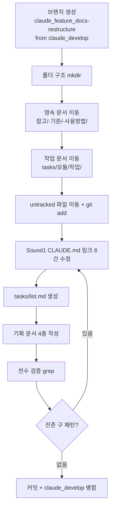

# 구현계획: Sound1 docs 폴더 구조 세분화

**TL;DR**: claude_feature_docs-restructure 브랜치에서 폴더 mkdir → 영속/작업 문서 이동(tracked는 git mv, untracked는 mv+add) → CLAUDE.md 링크 6건 갱신 → tasks/list.md 생성 → grep 전수 검증 → claude_develop 머지의 9-step 시퀀스로 진행한다.

## 1. 실행 순서



## 2. 단계별 내용

### Step 1: 브랜치 준비
- `git -C /e/Claude/projects/Sound1 checkout claude_develop`
- `git -C /e/Claude/projects/Sound1 checkout -b claude_feature_docs-restructure`
- 목표: 기존 `claude_feature_early-power-on-led`와 분리된 깨끗한 브랜치

### Step 2: 폴더 생성
- `mkdir -p docs/참고 docs/기준 docs/사용방법 docs/tasks/meta/docs-restructure docs/tasks/LED/{operation-scheme,power-on-early-lighting} docs/tasks/power/low-power-mode docs/tasks/touch/{layer-separation,init-split/로그}`

### Step 3: 영속 문서 이동 (10건)
참고/·기준/·사용방법/ 폴더로 이동. 파일명에서 프리픽스 제거, "by 김은수" 저자 suffix 제거.

### Step 4: 작업 문서 이동 (17건 tracked + 5건 untracked)
- tracked 17건: `git mv` (rename 보존)
- untracked 5건: `mv` 후 `git add` (POWER_ON LED 요구사항·분석, 터치 로그 3건)

### Step 5: Sound1 CLAUDE.md 링크 갱신 (6건)
- 라인 4, 11, 48, 49, 50, 51 링크 URL 업데이트
- Layout 주석 (라인 39) 새 구조 반영

### Step 6: `tasks/list.md` 생성
- 활성: `meta/docs-restructure` (진행), `LED/power-on-early-lighting` (진행)
- 완료: `LED/operation-scheme`, `power/low-power-mode`, `touch/layer-separation`, `touch/init-split`
- 완료일은 원본 파일 mtime 기준 (추정값, 사용자 정정 가능)

### Step 7: 기획 문서 4종 작성
- `tasks/meta/docs-restructure/` 아래 `요구사항.md`, `분석.md`, `구현계획.md` (본 문서), `진행상황.md`

### Step 8: 검증
```bash
# 구 프리픽스 잔존 확인
find docs -name "\[*\] *" -not -path "*/meta/docs-restructure/*"
# 전수 파일 존재 확인
ls -R docs/
# git status 요약
git status --short | awk '...'
```

### Step 9: 커밋 + 병합
```bash
git add -A docs/ CLAUDE.md
git commit -m "docs: 폴더 구조 세분화 (루트 컨벤션 적용)"
git checkout claude_develop
git merge --no-ff claude_feature_docs-restructure -m "Merge ..."
```

## 3. 롤백

- Step 3~8 중 오류: `git reset --hard HEAD && git clean -fd docs/` 후 재시작
- Step 9 커밋 후: `git revert <commit>` 또는 `git reset --hard HEAD~1` (push 전이면)

## 4. 영향 범위

| 파일 수 | 내용 |
|---|---|
| 17 | tracked rename |
| 5 | untracked add |
| 1 | CLAUDE.md modify |
| 5 | 신규 (list.md + 기획 4종) |
| **28** | 총 변경 |

---

**작성일:** 2026-04-24
