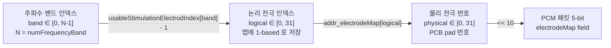
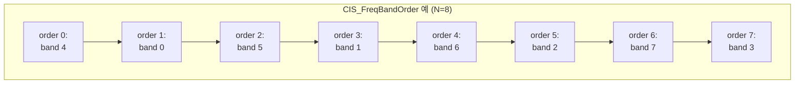
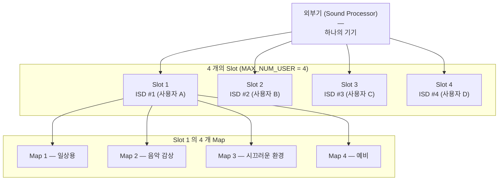
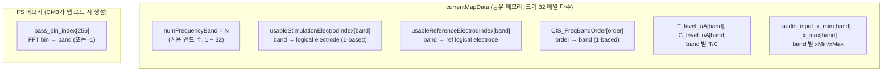
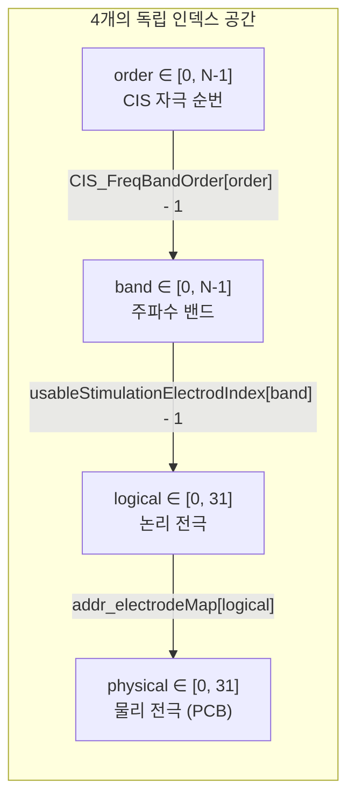
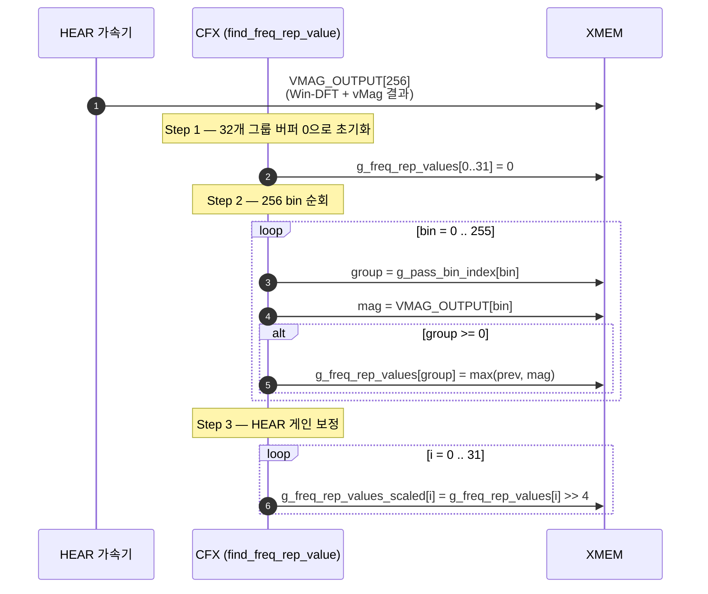
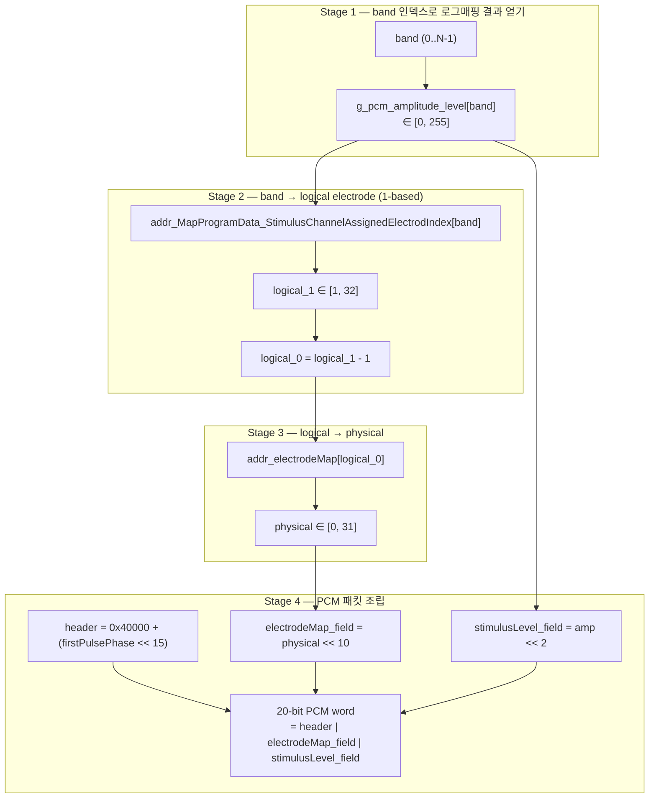
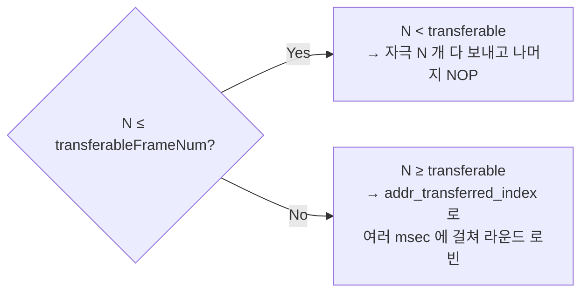

# CFX 주파수 밴드·전극·채널 매핑 Rev.2

**TL;DR**: 인공와우 도메인에서 FFT 결과가 어떻게 주파수 밴드 대표값 → 논리 전극 → 물리 전극 → PCM 패킷이 되는지 라인 단위 분해. order/band/logical/physical 4축 인덱스 공간 명시 + Slot(외부기 4개 ISD 등록 공간, MAX_NUM_USER=4) · Map(slot당 4 프로그램, MAX_NUM_MAP=4) 계층 + CIS Order의 공간적 교대 배치 원리. 채널 단어 다의 정리 + 리네이밍 제안. v2 내부 정정 (2026-04-18) — slot은 CIS 순서 위치가 아닌 ISD 등록 공간, order는 별개 자극 순번.

> **이전 버전**
> - Rev.0 : [CFX 프로젝트 구조 및 시퀀스](./%5B%EB%B6%84%EC%84%9D%5D%20CFX%20%ED%94%84%EB%A1%9C%EC%A0%9D%ED%8A%B8%20%EA%B5%AC%EC%A1%B0%20%EB%B0%8F%20%EC%8B%9C%ED%80%80%EC%8A%A4%20Rev.0%20by%20%EA%B9%80%EC%9D%80%EC%88%98.md)
> - Rev.1 : [CFX-CM3 공유메모리 시퀀스 및 타이밍](./%5B%EB%B6%84%EC%84%9D%5D%20CFX-CM3%20%EA%B3%B5%EC%9C%A0%EB%A9%94%EB%AA%A8%EB%A6%AC%20%EC%8B%9C%ED%80%80%EC%8A%A4%20%EB%B0%8F%20%ED%83%80%EC%9D%B4%EB%B0%8D%20Rev.1%20by%20%EA%B9%80%EC%9D%80%EC%88%98.md)
>
> **Rev.2 초점**
> 인공와우 도메인 관점에서 **"FFT 결과가 어떻게 주파수 밴드 대표값이 되고, 그 밴드가 어떻게 물리 전극 번호로 변환되어 PCM 패킷에 실리는가"** 를 숫자·예시·소스 라인 단위로 분해한다.
> 레거시 E7150/BTE 코드에서 옮겨오면서 **"채널 (Channel)" 이라는 단어가 두 가지 의미로 섞여 쓰이는 문제** 를 전면 정리하고, 이름 정정을 위한 리네이밍 제안을 포함한다.
>
> **v2 내부 정정 (2026-04-18)**
> 초기 원고에서 **"slot" 을 CIS 자극 순서 위치** 로 쓴 것은 도메인 의미와 어긋나는 오해였다. 실제 도메인에서 **slot 은 "외부기(사운드 프로세서) 가 ISD 정보를 저장하는 등록 공간"** (최대 4개, §1.4) 을 뜻하며, CIS 자극에서의 순서 위치는 **order (자극 순번)** 이라는 별도 개념이다. 문서 전체를 이 관점으로 재작성했다.

---

## 목차

1. [도메인 용어 정의 (ISD · Slot · Map · 주파수 밴드 · 논리 전극 · 물리 전극 · Order)](#1-도메인-용어-정의)
2. [맵 데이터의 인덱스 축 전체 지도](#2-맵-데이터의-인덱스-축-전체-지도)
3. [FFT 결과 → 주파수 밴드 대표값 (find_freq_rep_value 상세)](#3-fft-결과--주파수-밴드-대표값)
4. [pass_bin_index 의 생성·전달 경로](#4-pass_bin_index-의-생성전달-경로)
5. [주파수 밴드 → 논리 전극 → 물리 전극 → PCM 패킷 (3단 변환)](#5-주파수-밴드--논리-전극--물리-전극--pcm-패킷)
6. [CIS 자극 스트리밍 라인별 해석 — Order 개념 포함](#6-cis-자극-스트리밍-라인별-해석--order-개념-포함)
7. [nOFm 에서의 동일 변환 + 인접 방지 재배열](#7-nofm-에서의-동일-변환)
8. [참조 전극(Reference Electrode) — CFX는 미사용](#8-참조-전극reference-electrode--cfx는-미사용)
9. [자극 알림(Indicator) 채널](#9-자극-알림indicator-채널)
10. [레거시 네이밍 혼동 총정리 · 개선 제안](#10-레거시-네이밍-혼동-총정리--개선-제안)
11. [예시 시나리오 — 16 밴드 환자 맵](#11-예시-시나리오--16-밴드-환자-맵)
12. [부록 — 변수/배열 원본 색인](#12-부록--변수배열-원본-색인)

---

## 1. 도메인 용어 정의

인공와우(Cochlear Implant) 시스템 펌웨어를 다루려면 **여섯 개의 개념** 을 명확히 분리해야 한다.

| 용어 | 영문/약어 | 범위/크기 | 본 펌웨어에서의 의미 |
|---|---|---|---|
| **ISD** | Internal Stimulation Device | – | 몸에 이식된 **자극 펄스 출력 칩**. CFX → FPGA → RF → ISD 경로로 PCM 패킷 수신 후 전극으로 전류 펄스 출력. |
| **Slot** (User Slot) | – | 1 ~ 4 | **외부기(사운드 프로세서) 가 ISD 정보를 등록·저장하는 공간**. 한 외부기는 최대 4개의 slot 을 가지며, 각 slot 은 **한 명의 사용자 = 한 개의 ISD** 를 대표한다. `MAX_NUM_USER = 4`. 부트로더의 `tdc_boot_get_slot_num()` 이 이 번호를 반환하며, 값 `255` 는 공장 초기화(Factory Reset) slot 을 의미한다. |
| **Map** (Program) | – | 1 slot 당 4 개 | **한 ISD(한 사용자) 용 자극 튜닝 프로그램**. T/C 레벨, 사용 전극 집합, 주파수 밴드 수, CIS order, 자극 모드 등으로 구성. `MAX_NUM_MAP = 4`. 한 외부기 최대 **4 slot × 4 map = 16 프로그램** 저장. |
| **주파수 밴드** | Frequency Band | 1 ~ 32개 | 0 ~ 8 kHz 대역을 **Greenwood 함수** 로 비선형 분할한 음향 대역. 맵의 `numFrequencyBand` 로 개수 결정(사용 가능한 전극 수와 동일하게 설정). 밴드 대표값이 로그매핑 → 자극 레벨로 이어진다. |
| **논리 전극 인덱스** | Logical Electrode Index | 0 ~ 31 | 맵 데이터에 저장되는 전극 번호(1-based 로 저장). `addr_electrodeMap[logical] = physical` 테이블로 물리 전극 번호로 변환된다. CM3 디버그 메시지에서 `PCB : N` 으로 표시되는 것이 물리 번호. |
| **물리 전극** | Physical Electrode (PCB pad) | 0 ~ 31 (32개) | 와우 내부로 들어가는 실제 자극 출력 포인트. 기저부(고주파) ↔ 첨단부(저주파) 방향으로 배치. PCM 패킷의 5-bit `electrodeMap` 필드로 지정. |
| **Order** (자극 순번) | Stimulation Order / Pulse Position | 0 ~ N-1 | **CIS 자극 기법에서, 한 자극 주기 안에서 각 주파수 밴드를 자극할 "순서"**. 공간적으로 인접한 전극이 연속 자극되지 않도록 교차 배치한다. `CIS_FreqBandOrder[i]` 의 `i` 가 order 위치이고, 저장된 값이 "이 order 에서 자극할 band 번호 (1-based)" 이다. |
| **자극 전략** | Stimulation Strategy | CIS / nOFm / medium | CIS = 전체 밴드를 order 순서대로 자극. nOFm = 매 프레임 amplitude 상위 n(=16) 밴드만 자극. |
| **자극 모드** | Stimulation Mode | monopolar_body / rod / 둘 다 / bipolar / common ground / semi_simultaneously | 전극 전류 복귀 경로(=참조 전극 사용 방식). CFX의 CIS/nOFm은 **mode 와 무관하게** 자극 전극 번호만 PCM 에 싣는다. 참조 전극 매핑은 **CM3의 FPGA 세팅 단계에서만** 사용됨. |
| **T-level / C-level** | Threshold / Comfort level | uA 또는 0~255 | 청각 역치(T) 와 쾌적 최대(C). 전극별로 환자마다 튜닝. |
| **xMin / xMax** | audio_input_x_mim / _x_max | 맵 값 | 로그매핑 입력 x 의 하한/상한. T→C 와 대응되는 입력 범위. |

### 1.1 세 가지 "전극 번호" — 가장 자주 혼동되는 지점



- **band ≠ logical ≠ physical** 세 축이 모두 다르다. 한 축에서 다른 축으로 갈 때마다 **별도의 룩업 테이블** 이 필요하다.
- 맵 UI 에서 "전극 N 번 사용" 이라고 하면 보통 **physical N** 을 의미한다(사용자 입장).
- 코드 내부에서는 한동안 **logical** 공간에서 작업하고, PCM 패킷을 실을 때 비로소 `addr_electrodeMap[]` 으로 **physical** 로 변환한다.

### 1.2 Order 개념 — CIS 자극에서 왜 순서가 필요한가

와우 내부의 전극은 물리적으로 매우 좁은 간격(수백 μm)으로 배치되어 있다. **인접한 두 전극을 연속으로 자극하면** 전류가 서로 간섭을 일으키고(**channel interaction**), 청각 정보가 겹쳐서 음색 분해능이 떨어진다. 이를 피하기 위해 CIS (Continuous Interleaved Sampling) 기법은 다음과 같이 동작한다.



- 같은 band 가 같은 electrode 에 매핑되어 있으므로, **order 를 건너뛰며 자극하면 인접 전극 간에 자극 간격이 생긴다**.
- 이 order 표는 **환자 맵에 속한 데이터** 이고, BLE 앱에서 임상의가 조정하거나 기본 패턴으로 생성된다.

### 1.3 "채널(Channel)" 이라는 용어

의료 도메인에서 "**자극 채널 (stimulation channel)**" 은 "한 주파수 밴드 ↔ 한 전극으로 이어지는 신호 경로" 를 뜻하며 **주파수 밴드와 동의어** 처럼 쓰인다. 하지만 현 펌웨어 코드에서는 `Channel` 이라는 단어가 여러 의미로 섞여 쓰인다 (§10 에서 정리).

### 1.4 Slot · Map · User 의 계층 구조



- **한 외부기** 는 서로 다른 **사용자 4명까지** 지원 (각자의 ISD 정보가 slot 에 등록).
- **각 사용자(= slot) 당 프로그램 4개** 저장 (리모콘으로 1~4 전환).
- 부트로더는 `tdc_boot_get_slot_num()` 으로 현재 활성 slot 번호를 읽어 해당 slot 의 펌웨어 이미지(`/1/`, `/2/`, `/3/`, `/4/` 디렉터리) 에서 앱을 로드한다. `255` = 공장 초기화 slot.
- 공유 메모리 `cfx_ISD_info[MAX_NUM_USER]` 배열이 4개 slot 의 ISD 정보(시리얼·L/R·패스키 등) 를 보관한다.
- 공유 메모리 `connected_ISD_num` (1~4) 이 **"지금 연결 중인 ISD 가 몇 번 slot 의 것인지"** 를 가리킨다 (0 이면 연결 없음).

---

## 2. 맵 데이터의 인덱스 축 전체 지도

한 Map 안에는 다음 네 종류의 축을 인덱스로 쓰는 배열들이 들어있다.



### 2.1 축별 의미 요약표

| 인덱스 축 | 값 의미 | 1-based? |
|---|---|:-:|
| `usableStimulationElectrodIndex[band]` | band → logical electrode | ○ |
| `usableReferenceElectrodIndex[band]` | band → 참조 logical electrode | ○ |
| `CIS_FreqBandOrder[order]` | order → band | ○ |
| `T_level_uA[band]`, `C_level_uA[band]` | band → 자극 레벨 (uA) | – |
| `audio_input_x_mim[band]`, `_x_max[band]` | band → 입력 범위 | – |
| `pass_bin_index[fft_bin]` | FFT bin → band (-1 = 미사용) | band 는 0-based |
| `addr_electrodeMap[logical]` | logical → physical | logical/physical 모두 0-based |

> **핵심 관찰** : `T_level_uA[]`, `C_level_uA[]`, `x_mim[]`, `x_max[]` 는 **band 인덱스로 접근** 되지, logical 이나 physical 로 접근되지 않는다. "전극별 T/C" 라고 흔히 말하지만, 실제로는 "band 별 T/C (= 그 band 가 할당받은 electrode 의 T/C)" 이다.

### 2.2 band · logical · physical · order 네 축의 관계



- order 는 **시간축** (언제 자극할지).
- band 는 **주파수축** (어떤 음향 대역에 해당하는지).
- logical 은 **ISD 레지스터 주소 공간**.
- physical 은 **와우 내부 실제 배치 공간**.

---

## 3. FFT 결과 → 주파수 밴드 대표값

### 3.1 함수 전체 흐름

`signalProcessing/FrequencyAnalysis.c:45` 의 `find_freq_rep_value()` 가 담당. HEAR FC1 (FFT + vMag) 완료 직후 1 msec 주기로 호출된다.



### 3.2 Step 2 의 수학적 의미

**FFT pass bin** = DFT 출력 중 **양의 주파수 대역만 추린 256 개 빈**. 각 bin 은 `fs / FFT_SIZE = 16000 / 512 = 31.25 Hz` 간격.

Greenwood 함수로 0 ~ 8 kHz 를 N 개 밴드로 비선형 분할하면 **저주파 쪽에 bin 이 많이 몰리고 고주파는 듬성** 해진다. 따라서 `pass_bin_index[]` 테이블의 값 분포는 예를 들어 N=16 일 때 대략 다음 형태를 갖는다.

```
pass_bin_index 값 예 (N=16)
  bin   0..  3 →  0  (≈ 0~125 Hz)    사용 안 하면 -1
  bin   4..  7 →  1  (≈ 125~250 Hz)
  bin   8.. 12 →  2
  ...
  bin 220..255 → 15  (≈ 6.9~8 kHz)
```

group 당 bin 수가 다르기 때문에 "더 많은 bin 을 가진 그룹" 은 원래라면 단순 합산 시 값이 커지겠지만, 이 코드는 **합산이 아니라 max** 를 취한다. 즉 **그룹 내 가장 강한 주파수 성분** 을 그룹의 대표값으로 사용한다.

### 3.3 Step 3 의 스케일 보정 원리

`definitionsForAlgorithm.h` 의 주석에 자세히 정리되어 있으나, 요지만 뽑으면 :

```
시간 영역의 사인파 → Win-DFT 후 주파수 영역 크기:
   · FFT_SIZE 곱셈 효과 (DFT)
   · 사인파는 ±f 두 피크로 분산 → 1/2
   · Hanning window → 1/2
   · Ezairo BFP(Block Floating Point) → 1/4
   · vMag (sqrt(Re² + Im²)) → 1/2
총 게인 = FFT_SIZE · 1/2 · 1/2 · 1/4 · 1/2 = FFT_SIZE / 32 = 16 = 2^4
```

따라서 주파수 영역 값에 `>> 4` 하면 시간 영역과 동일 스케일. Rev.0 에서 지적했듯 `HEAR_FC_DFT_TYPE_NO_WINDOW` 를 선택할 경우 `>> 5` 가 되어야 해서 `RIGHT_SHIFT_MAX_MAG_FREQ_SCALE` 이 분기되어 있다.

### 3.4 결과물

- `g_freq_rep_values[band]` : 보정 전, 그룹 내 최대 magnitude
- `g_freq_rep_values_scaled[band]` : `>> 4` 보정 후. **이 값이 logarithmMapping 의 입력** 이 된다.
- 인덱스 범위 : `0 ~ 31`. N < 32 인 맵이라도 배열 크기는 32 로 고정. N 이후 슬롯은 0 으로 남음.

---

## 4. pass_bin_index 의 생성·전달 경로

`g_pass_bin_index[]` 는 **CFX가 직접 계산하지 않는다**. 이 테이블은 맵에 귀속되어 있고, CM3가 맵을 로드할 때 FS(File System) 메모리에 써 놓은 것을 CFX가 읽어 온다.

```mermaid
flowchart LR
    subgraph CM3_side["CM3 쪽 (맵 로드 시점)"]
        A[BLE/EEPROM 에서<br/>환자 맵 로드]
        B[Greenwood 함수로<br/>N 밴드 분할 계산]
        C[pass_bin_index[256] 생성<br/>numFrequencyBand = N 도 함께]
        D["FS memory<br/>D_DSP_PRAM4_BASE<br/>+1 = pass bin[256]"]
    end
    subgraph CFX_side["CFX 쪽 (맵 변경 이벤트)"]
        E["Normal_PowerMode_event_mapChange"]
        F["read_FFT_PassBin_index()"]
        G["g_pass_bin_index[256] ← 복사"]
    end

    A --> B --> C --> D
    E --> F --> G
    D -.FS memory 공유.-> G
```

### 4.1 CFX 의 로드 코드 (`FrequencyAnalysis.c:13`)

```c
int _IOMEM* p_FS_num_of_freqBand = (int _IOMEM*) ADDR_NUM_OF_FREQ_BAND_IN_FS_MEM;
int _IOMEM* p_FS_indexPassBin    = (int _IOMEM*) ADDR_FFT_PASS_BIN_IN_FS_MEM;

if (addr_MapProgramData_FrequencyAnalysisBandNumbers == (*p_FS_num_of_freqBand))
{
    for (i = 0; i < HALF_FFT_SIZE; i++)
        g_pass_bin_index[i] = p_FS_indexPassBin[i];
}
```

- `ADDR_NUM_OF_FREQ_BAND_IN_FS_MEM` = `D_DSP_PRAM4_BASE` (첫 워드에 N 저장)
- `ADDR_FFT_PASS_BIN_IN_FS_MEM` = 그 다음 워드부터 256 워드

### 4.2 가드 조건의 의미

`if (map의 N == FS의 N)` 이 만족될 때만 복사한다. 즉 **"맵에 기재된 밴드 수"와 "FS에 저장된 pass-bin 테이블이 가정한 밴드 수"가 일치** 해야 한다. 불일치시 테이블은 갱신되지 않고 **이전 값 또는 초기 0이 그대로 남는다**.

> **★★ 주의** : 첫 부팅 직후 FS 메모리가 아직 쓰이기 전이거나, CM3가 맵을 로드하기 전에 CFX의 이 함수가 호출되면 `pass_bin_index[] = {0, 0, ...}` 상태 → `find_freq_rep_value()` 에서 **모든 magnitude 가 index 0 에만 쌓여** band 0 에 쏠린다. Rev.0 §8.1.4 에서 지적했던 이슈와 동일.

### 4.3 언제 CM3가 pass_bin_index 를 쓰는가

`read_FFT_PassBin_index()` 는 `Normal_PowerMode_event_mapChange()` 안에서만 호출되므로, **맵 변경 이벤트가 있어야 pass bin 이 갱신** 된다. 부팅 직후라면 `cm3Command_mapChange = 1` 이 한 번 발생해야 하는데, 이게 Rev.1 §5.1 의 "3-way 핸드셰이크" 경로 안에 있다.

---

## 5. 주파수 밴드 → 논리 전극 → 물리 전극 → PCM 패킷

### 5.1 단계별 변환 도식



### 5.2 각 변환 테이블의 출처

| 변환 | 테이블 이름 | 채움 주체 | 채움 경로 |
|---|---|---|---|
| band → amp | `g_pcm_amplitude_level[32]` | CFX | `logarithmMapping()` 매 1 msec |
| band → logical | `addr_MapProgramData_StimulusChannelAssignedElectrodIndex[32]` | CFX (맵 로드 시) | `copy_MappingData_without_mappingDate` 에서 `currentMapData.usableStimulationElectrodIndex[]` 복사 |
| logical → physical | `addr_electrodeMap[32]` | CFX (하드코딩) | `stimulationStrategy.c:14` 에 상수로 박혀 있음 |
| band → reference logical | `addr_MapProgramData_ReferenceChannelAssignedElectrodIndex[32]` | CFX (맵 로드 시) | `currentMapData.usableReferenceElectrodIndex[]` 복사 — **CFX 자극 생성에서는 참조 안 함** |

### 5.3 `addr_electrodeMap[]` 의 실제 값 (stimulationStrategy.c:14)

```c
int _XMEM addr_electrodeMap[32] = {
    31, 12, 11,  9,  7,  5,  3,  1,  0,  2,  4,  6,  8, 10, 13, 15,
    17, 18, 20, 22, 24, 26, 28, 30, 14, 29, 27, 25, 23, 21, 19, 16,
};
```

이 배열의 의미는 **"논리 전극 인덱스 i 번은 ISD 의 물리 전극 번호 `addr_electrodeMap[i]` 번에 자극을 내보낸다"**.

```
logical 0  →  physical 31   (← 와우 기저부 쪽, 가장 큰 번호)
logical 1  →  physical 12
logical 2  →  physical 11
...
logical 8  →  physical  0   (← 와우 첨단부 쪽)
logical 9  →  physical  2
...
logical 31 →  physical 16
```

**왜 이렇게 생겼는가** : ISD 하드웨어의 전극 물리 배치(와우 기저 ↔ 첨단) 순서가 ISD 레지스터 주소 순서와 다르기 때문이다. 환자용 맵은 **기저→첨단** 방향의 자연스러운 전극 번호로 작성되고, CFX 는 마지막 PCM 패킷 단계에서만 **ISD 레지스터 주소 순서로 재배치** 한다.

> **크로스 체크** : CM3 의 `isd_interface_stimulationParaSetting.c:492~500` 에서 동일한 `electrodeMap[]` 을 사용해 bipolar 참조 전극을 PCB 기준으로 재배열한다. 이때 디버그 메시지가
>
> ```
> [PARA] (1 BASE), BAND : 01, STIM ELEC NUM :  1 (PCB : 32), REF ELEC NUM : 32 (PCB : 17)
> ```
> 형태로 출력되어 **"STIM ELEC NUM = logical (1-base)", "PCB = physical (1-base)"** 의 두 축을 동시에 보여준다. 이 디버그 포맷이 **핵심적인 진단 근거** 이다.

### 5.4 `addr_electrodeMap[]` 가 CFX·CM3 양쪽에 중복 존재

- CFX : `src/1__cfx/signalProcessing/stimulationStrategy.c:14`
- CM3 : `src/2__cm3/...isd_interface_stimulationParaSetting.c` 의 `electrodeMap[]` (지역 또는 전역 선언)

**★ 두 곳의 값이 엇갈리면 즉시 자극 좌표가 뒤바뀐다.** 현재는 값이 일치하지만, 누구든 한 쪽만 수정하면 실제 환자에게 엉뚱한 전극이 자극된다. Rev.3 에서 단일 헤더(예: `electrode_mapping.h`) 로 추출하여 양쪽이 공유하도록 제안.

---

## 6. CIS 자극 스트리밍 라인별 해석 — Order 개념 포함

`signalProcessing/stimulationStrategy.c:347~419` 의 CIS 루프를 **order → band → logical → physical → PCM** 4단 변환 관점으로 다시 본다.

### 6.1 주요 루프

```c
for (i = 0; i < addr_MapProgramData_FrequencyAnalysisBandNumbers; i++) {
    //                                    ↑ i = 자극 순번(order)
    freqBandOrder = addr_MapProgramData_CIS_FreqBandOrder[i] - 1;                             // (A)
    electrodIndex = (addr_MapProgramData_StimulusChannelAssignedElectrodIndex[freqBandOrder] - 1); // (B)
    electrodeMap  = addr_electrodeMap[electrodIndex] << electrodIndexPositionAtPCM_Mold;      // (C)

    if (mute 활성 && amp == 0) {
        addr_stimulationTempBuff[i] = ISD_registerAddr_forwardPath_check_Data;                // (D)
    } else {
        stimulusLevel = g_pcm_amplitude_level[freqBandOrder] << stimulationPositionAtPCM_Mold; // (E)
        addr_stimulationTempBuff[i] = electrodeMap | stimulusLevel | g_pcm_stimulation_packet_header; // (F)
    }
}
```

### 6.2 한 줄씩 의미

| 줄 | 의미 | 인덱스 공간 변환 |
|---|---|---|
| 루프 | `i` 는 **자극 순번(order)**. i=0 은 이번 자극 주기에서 가장 먼저 자극할 위치. | order ∈ [0, N-1] |
| (A) | **이 order 에서 자극할 band 번호** 를 읽는다. `CIS_FreqBandOrder` 는 1-based 저장이므로 -1 로 0-based 복원. 변수명이 `freqBandOrder` 지만 **실제로는 해당 order 에 매핑된 band 번호** 이다. | order → band |
| (B) | **그 band 에 할당된 논리 전극 번호**. `StimulusChannelAssignedElectrodIndex[band]` 도 1-based 저장. | band → logical |
| (C) | **논리 → 물리 변환 후 비트 10 위치로 시프트**. `electrodIndexPositionAtPCM_Mold = 10`. | logical → physical → bit field |
| (D) | 로그매핑 결과가 0 이면(묵음 구간) 자극 패킷 대신 **ISD forward-path check** 레지스터 쓰기 패킷으로 대체 → 실제 자극 없음 + 백텔 확인용 레지스터에 값 기록. | – |
| (E) | 자극 레벨(0~255) 을 비트 2 위치로 시프트. `stimulationPositionAtPCM_Mold = 2`. | band → amplitude |
| (F) | 최종 PCM 워드 조립 : `header | electrode_bits | level_bits`. `g_pcm_stimulation_packet_header = 0x40000 | (firstPulsePhase << 15)`. | – |

### 6.3 CIS order 의 공간적 교대 배치 원리

`CIS_FreqBandOrder[]` 는 **인접한 order 위치에서 인접한 전극이 자극되지 않도록** 교차 배치된 band 번호를 담는다. 예를 들어 N=8 (모든 band 가 연속 전극에 매핑되어 있다고 가정) 일 때:

```
단순 순차 (나쁜 예):       order 0→band 0, 1→1, 2→2, 3→3, 4→4, 5→5, 6→6, 7→7
                          → 물리 전극이 옆옆옆 연속 자극 → channel interaction

공간적 교대 (CIS, 좋은 예): order 0→band 4, 1→0, 2→5, 3→1, 4→6, 5→2, 6→7, 7→3
                          → 물리 전극이 멀리 건너뛰며 자극 → 간섭 최소화
```

- 이 order 표는 **환자 맵 데이터의 일부** 로 BLE 매핑 앱(임상의 사용) 에서 생성/수정 가능.
- "동일 주기 안에서 모든 band 를 한 번씩" 자극하므로 **자극률(pulse rate)** 은 `1000 / 주기길이_ms` Hz.

### 6.4 전송 가능 자극 수 분기 (stimulationStrategy.c:504~624)

한 번에 PCM FIFO 로 쏠 수 있는 24 word = **1 msec 치 프레임**. 펄스폭에 따라 한 자극이 몇 프레임을 차지하는지 다르다 (`g_pcmFrameNum_per_channel` = 1, 2, 3, 4+). CM3 가 계산한 `transferableFrameNum = floor(24 / pcmFrameNum_per_channel)` 이 **1 msec 안에 낼 수 있는 자극 개수** 가 된다.



- `addr_transferred_index` 는 "마지막으로 전송한 order 위치 + 1" 을 보존하는 전역. N 이 transferable 보다 크면 1 msec 단위로 몇 msec 에 걸쳐 N 개 자극을 돌려 낸다.
- 예 : N=16, transferable=12 → 1 msec 에 order 0~11, 다음 1 msec 에 order 12~15 + order 0~7, 그 다음 1 msec 에 order 8~15 + order 0~3, ... 이런 식으로 **자극 주기가 2 msec** 가 된다.

---

## 7. nOFm 에서의 동일 변환

`stimulationStrategy_nOFm()` 의 차이점만 정리한다 (Stage 2/3/4 는 CIS 와 동일).

1. **Step 1** — N 개 밴드 중 amplitude 상위 16 개 선택 (`g_nOFm_adjacent_BandIndex[]` 에 band 번호 저장).
2. **Step 2** — "presence map" 으로 **band 번호 오름차순** 정렬.
3. **Step 3** — 인접 자극 방지를 위해 (0,8,1,9,2,10,3,11,4,12,5,13,6,14,7,15) 패턴으로 **재배열** → `g_nOFm_notAdjacent_BandIndex[16]`. **이 재배열이 nOFm 의 order 에 해당하며, CIS 와 달리 매 프레임마다 동적으로 생성** 된다 (amplitude 에 따라 선택되는 상위 16 개 band 가 매번 다르므로).
4. **Step 4** — 이전 프레임 마지막 자극 band (`g_nOFm_LastStimulus_BandIndex`) 와 가장 먼 band 부터 시작.
5. **Step 5** — 각 자극에 대해 CIS 와 동일한 **band → logical → physical → PCM word** 변환 수행 (`stimulationStrategy.c:260~281`).
6. **Phase 0 / Phase 1 분할** — Phase 0 에서 16 개 준비 + 상위 8 개 전송, Phase 1 에서 하위 8 개 전송 (2 msec 주기).

여기서도 Rev.0 §8.1.3 의 `present[idx]` 범위 버그가 그대로 존재 : `if (i >= 0 && idx < df_MaxNumOfElectrode)` 의 `i >= 0` 이 무의미.

---

## 8. 참조 전극(Reference Electrode) — CFX는 미사용

맵에 담긴 `usableReferenceElectrodIndex[32]` 는 **bipolar 자극 모드** 에서 참조 전극(전류 복귀 경로) 번호다.

### 8.1 CFX 쪽에서는 복사만 하고 쓰지 않는다

```c
// system_control.c:265
addr_MapProgramData_ReferenceChannelAssignedElectrodIndex[i]
    = Addr_SharedMem->currentMapData.usableReferenceElectrodIndex[i];
```

- 이 배열은 `stimulationStrategy.c` 에서도, `driver_PCM.c` 에서도 참조되지 않는다 → **CFX가 생성하는 PCM 자극 패킷에는 참조 전극 정보가 들어가지 않는다**.

### 8.2 참조 전극을 실제로 쓰는 곳은 CM3 + FPGA

- `isd_interface_stimulationParaSetting.c:492~493` 가 `bipolarReferenceElectrodeNum[physical] = electrodeMap[usableRef - 1]` 형태로 **FPGA 레지스터** 에 미리 프로그래밍한다.
- 즉 CFX 는 "어느 전극으로 얼마 자극하라" 만 PCM 으로 보내고, **bipolar 의 전류 복귀 경로 설정은 CM3 → FPGA** 가 정적으로 해 둔다.

### 8.3 함의

- `addr_MapProgramData_ReferenceChannelAssignedElectrodIndex[]` 는 **CFX에 복사되지만 전혀 사용되지 않는 dead 배열** 이다. §10의 개선 제안에 포함.
- 자극 모드(`stimulationMode`) 자체도 CFX 에서는 읽혀 복사되지만 분기점이 없다. **CFX 는 stimulation mode 와 무관하게 동일한 PCM 패킷을 생성** 한다.

---

## 9. 자극 알림(Indicator) 채널

`logarithmMapping()` 마지막 (nonlinearMapping.c:164~192) 에 있는 indicator 로직.

```c
if (calculatedStimulationIndcator_byCM3.indicatorStimulOutput_OnOff_Coltroled_byCM3 == 1) {
    if (userSettingValue.mapNum < 0) {
        // 매핑 App Live 중 실시간 채널 변경 경로
        addr_MapProgramData_indicatorStimulCannel_index
            = currentMapData.stimulationIndicatorChannelNum;
    }
    g_pcm_amplitude_level[addr_MapProgramData_indicatorStimulCannel_index - 1]
        = calculatedStimulationIndcator_byCM3.indicatorStimulLevel_255;
}
```

### 9.1 의미

- CM3 가 "알림 지시" ON 신호를 세팅하면, CFX 는 **특정 band 의 amplitude 를 강제로 `indicatorStimulLevel_255` 로 덮어쓴다**.
- 덮어쓰기 대상은 `indicatorStimulCannel_index - 1` (= 0-based band).
- 이 값이 이후 CIS/nOFm 의 (E) 줄에서 그대로 PCM 패킷 레벨로 들어간다.

### 9.2 문제점 — Rev.0 §8.1.5 에서 지적한 음수 인덱스

- `addr_MapProgramData_indicatorStimulCannel_index` 초기값은 0.
- `0 - 1 = -1` → `g_pcm_amplitude_level[-1]` 접근 → XMEM 영역의 직전 변수 오염.
- 방어 로직 없음. 반드시 CM3 가 1~32 범위 값을 먼저 써 놓는다는 계약에 의존.

### 9.3 변수명 오타

- `indicatorStimulCannel_index` 에 `Cannel` (Channel 오타). public 레거시 이름.
- `indicatorStimulOutput_OnOff_Coltroled_byCM3` 에 `Coltroled` (Controlled 오타).

---

## 10. 레거시 네이밍 혼동 총정리 · 개선 제안

### 10.1 "Channel" 이라는 단어의 3가지 해석 (코드 현실)

현재 코드에 존재하는 `Channel` / `channel` 단어는 문맥마다 의미가 다르다. 이것이 혼동의 근본 원인이다.

| 용례 | 실제 의미 | 예 |
|---|---|---|
| `PCM_MaxNumTransferableChannel = 24` | **PCM 프레임 word 수** (= 1 msec 치 24 word) | `df_MaxNumTransferableChannel` |
| `StimulusChannelAssignedElectrodIndex` | **주파수 밴드** (band → logical electrode 매핑) | 이 "Channel" 은 band |
| `ReferenceChannelAssignedElectrodIndex` | 동일 | band |
| `addr_MapProgramData_indicatorStimulCannel_index` | **band 인덱스 (1-based)** | Cannel 오타 |
| `stimulationIndicatorChannelNum` | 동일 | band 번호 |
| `PCM_liveStimulationTemplate[channel]` | **PCM word 위치** | 미사용 필드 |

즉 **코드의 "Channel" 은 대부분 "주파수 밴드"** 를 의미하나, `TransferableChannel` 과 `liveStimulationTemplate` 에서는 "PCM word 위치" 를 의미한다. 의료 도메인의 "채널"(= 자극 경로 = band) 과 문자열이 겹쳐 보여 혼동이 증폭된다.

### 10.2 "Slot" 과 "Order" 의 의미 유지

- **Slot** : 외부기의 사용자/ISD 등록 공간 (1~4). 코드에서 `slot`, `user`, `MAX_NUM_USER`, `tdc_boot_get_slot_num()` 등으로 표현. 이 의미는 그대로 유지.
- **Order** : CIS 자극의 공간적 교대 순서. `CIS_FreqBandOrder` 의 `Order` 가 이 의미. 유지.

### 10.3 리네이밍 제안 (공유 메모리 struct 필드 포함)

| 현재 이름 | 제안 이름 | 사유 |
|---|---|---|
| `currentMapData.usableStimulationElectrodIndex[i]` | `stimulus_electrode_per_band[i]` | "band → logical electrode" 임을 명시 |
| `currentMapData.usableReferenceElectrodIndex[i]` | `reference_electrode_per_band[i]` | 동일 |
| `currentMapData.CIS_FreqBandOrder[i]` | (유지, 의미 명확) | – |
| `addr_MapProgramData_StimulusChannelAssignedElectrodIndex[i]` | `addr_MapProgramData_StimulusElectrodePerBand[i]` | "Channel" 제거 |
| `addr_MapProgramData_ReferenceChannelAssignedElectrodIndex[i]` | `addr_MapProgramData_ReferenceElectrodePerBand[i]` | 동일 |
| `addr_MapProgramData_indicatorStimulCannel_index` | `addr_MapProgramData_indicator_band_index` | Cannel 오타 + band 명시 |
| `currentMapData.stimulationIndicatorChannelNum` | `stimulation_indicator_band_num` | 동일 |
| `calculatedStimulationIndcator_byCM3.indicatorStimulOutput_OnOff_Coltroled_byCM3` | `indicatorStimulOutput_OnOff_Controlled_byCM3` | 오타 2개 정정 |
| `cfx_PCM_interface.conneded_ISDCheckPCM_state` | `connected_ISDCheckPCM_state` | conneded 오타 정정 |
| `PcmBitStream_Mode_SepcificCommand` | `PcmBitStream_Mode_SpecificCommand` | Sepcific 오타 정정 |
| `Ble_Onff` | `Ble_OnOff` | Onff 오타 정정 |
| `audio_input_x_mim[i]` | `audio_input_x_min[i]` | mim 오타 정정 |
| `earpieceDetecion` | `earpieceDetection` | Detecion 오타 정정 |
| `BackelCircuit*` | `BacktelCircuit*` | Backel 오타 정정 (전역) |
| `df_MaxNumTransferableChannel` | `df_PcmFrameWordCount` | "channel" 용어 혼동 제거 |
| `g_transferableChannelNum_per_1msec` | `g_transferable_stimulus_count_per_1msec` | "channel" → "stimulus" |
| `g_pcmFrameNum_per_channel` | `g_pcmFrameNum_per_stimulus` | 동일 |
| `addr_electrodeMap` (CFX 지역) + `electrodeMap` (CM3 지역) | 공유 헤더 `electrode_mapping.h` 의 `kLogicalToPhysicalElectrode[32]` | **단일 소스** |

### 10.4 배열 중복 제거

| 현재 | 문제 | 제안 |
|---|---|---|
| `addr_electrodeMap[32]` (CFX) | CM3의 `electrodeMap[32]` 와 값 동기화 수동 관리 | `src/common/electrode_mapping.{h,c}` 로 추출, 빌드 시 양쪽에 포함 |
| `addr_MapProgramData_ReferenceChannelAssignedElectrodIndex[32]` | CFX에서 복사만 되고 참조되지 않음(dead) | CFX 쪽 사본 제거 |
| `addr_MapProgramData_StimulationMode` | CFX에서 복사만 되고 분기점 없음 | CFX 쪽 사본 제거 (bipolar 세팅은 CM3→FPGA 가 담당) |

### 10.5 주석 보강 권장

각 맵 배열의 **인덱스 축** 을 `shared_memory.h` 의 struct 필드 바로 옆 주석에 명시하는 것만으로도 혼란이 크게 줄어든다. 예 :

```c
/* [IDX: band 0..31] → logical electrode number (1..32), 99 = unused */
int usableStimulationElectrodIndex[df_MaxNumOfElectrode];

/* [IDX: order 0..31] → band number (1..32) — CIS 자극의 공간적 교대 순서 */
int CIS_FreqBandOrder[df_MaxNumOfElectrode];
```

---

## 11. 예시 시나리오 — 16 밴드 환자 맵

**환자 프로필**

- Slot 2 에 등록된 "사용자 B" 의 ISD, 현재 Map 1 (일상용 프로그램) 활성.
- `numFrequencyBand = 16` (32 전극 중 16 개만 사용)
- `usableStimulationElectrodIndex[0..15]` (1-based logical electrode) = `[ 1, 4, 7, 10, 13, 16, 19, 22, 25, 28, 31, 2, 5, 8, 11, 14 ]`
- 나머지 `[16..31]` = 99 (미사용)
- `CIS_FreqBandOrder[0..15]` (1-based band) = `[ 8, 1, 9, 2, 10, 3, 11, 4, 12, 5, 13, 6, 14, 7, 15, 16 ]`
  - **해석** : order 0 에서 band 7 자극, order 1 에서 band 0 자극, ... (공간적 교대)
- `firstPulsePhase = 0`, `stimulationMode = monopolar`
- 펄스폭 → `g_pcmFrameNum_per_channel = 2`, `g_transferableChannelNum_per_1msec = 12`

### 11.1 FFT 결과가 들어오면

어떤 특정 1 msec 프레임에서 `g_freq_rep_values_scaled[0..15]` 가 예를 들어

```
band 0:  50   band 4: 210   band 8:  60   band 12: 190
band 1: 120   band 5:  30   band 9: 180   band 13:  10
band 2:  80   band 6:  70   band 10: 95   band 14:  40
band 3: 160   band 7: 150   band 11: 20   band 15:  55
```

라면, `logarithmMapping()` 후 `g_pcm_amplitude_level[0..15]` 가 각 band 의 T~C 범위에 맵핑되어 (예:)

```
band 0:   0(뮤트)   band 4: 240          band 8:  45   band 12: 220
band 1:  75          band 5:   0(뮤트)   band 9: 200   band 13:   0(뮤트)
band 2:  38          band 6:  28          band 10: 60   band 14:  12
band 3: 180          band 7: 165          band 11:  0(뮤트)  band 15:  19
```

(실제 수치는 T/C 레벨과 xMin/xMax 에 따라 다름)

### 11.2 CIS 변환 — order 0 의 예

```
자극 순번 i = 0 (order = 0)
  (A) band          = CIS_FreqBandOrder[0] - 1 = 8 - 1 = 7
  (B) logical_0     = StimulusChannelAssignedElectrodIndex[7] - 1 = 22 - 1 = 21
  (C) physical      = addr_electrodeMap[21] = 26
      electrodeMap field = 26 << 10 = 0x6800
  (E) amplitude     = g_pcm_amplitude_level[7] = 165
      stimulusLevel field = 165 << 2 = 0x294
  (F) PCM word = 0x40000 | 0x6800 | 0x294 | (firstPulsePhase=0 << 15)
               = 0x46A94
```

→ **PCM 패킷 `0x46A94` 는 "ISD 물리 전극 26 번에 자극 레벨 165" 를 의미**한다.

### 11.3 전체 order 의 변환 결과 미리보기

| order i | band | logical_0 | physical | amp | PCM word (hex) |
|:-:|:-:|:-:|:-:|:-:|---|
| 0 | 7 | 21 | 26 | 165 | `0x46A94` |
| 1 | 0 | 0 | 31 | 0(mute) | **forward check 패킷** `0x50783` |
| 2 | 8 | 24 | 23 | 45 | `0x45CB4` |
| 3 | 1 | 3 | 9 | 75 | `0x4292C` |
| … | … | … | … | … | … |

### 11.4 전송 타이밍

- `transferable = 12`, `N = 16` → **밴드 수 ≥ transferable** 분기
- 매 1 msec 에 order 12 개씩 전송, 2 msec 에 전체 16 order 완주.
- 펄스폭 2 frame 이므로 각 자극 뒤에 NOP 1개 삽입. 24 frame 중 `12 × 2 = 24` frame 정확히 채움.
- 다음 1 msec 에 order [12..15] + 다시 [0..7] 이 전송됨 (`addr_transferred_index` 가 라운드 로빈).
- **결과적인 자극률** : 각 전극은 **2 msec 마다 1 회** 자극 → 500 pps (pulses per second).

---

## 12. 부록 — 변수/배열 원본 색인

### 12.1 CFX 측

| 이름 | 파일 | 크기 | 축 | 초기값 |
|---|---|:-:|---|---|
| `addr_MapProgramData_FrequencyAnalysisBandNumbers` | [system_control.c:16](../src/1__cfx/systemControl/system_control.c) | int | N (사용 밴드 수) | 0 |
| `addr_MapProgramData_StimulusChannelAssignedElectrodIndex[32]` | system_control.c:20 | 32 | band → logical (1-based) | 0 |
| `addr_MapProgramData_ReferenceChannelAssignedElectrodIndex[32]` | system_control.c:21 | 32 | band → ref logical (1-based) **dead** | 0 |
| `addr_MapProgramData_CIS_FreqBandOrder[32]` | system_control.c:22 | 32 | order → band (1-based) | 0 |
| `addr_MapProgramData_T_Level_uA[32]` / `_C_Level_uA[32]` | system_control.c:24,25 | 32 | band → uA | 0 |
| `addr_MapProgramData_xMinLevel[32]` / `_xMaxLevel[32]` | system_control.c:27,28 | 32 | band → 입력 범위 | 0 |
| `addr_MapProgramData_StimulationMode` | system_control.c:14 | int | enum | 0 — **CFX 자극 생성에서 참조 안 됨** |
| `addr_MapProgramData_indicatorStimulCannel_index` | system_control.c:17 | int | band (1-based?) | 0 — **-1 인덱스 위험** |
| `g_mapping_stimulus_amplitude_T_level[32]` / `_C_level[32]` | system_control.c:34,35 | 32 | band → 0~255 | 0 — CM3 계산 결과 수신 |
| `g_pass_bin_index[256]` | [FrequencyAnalysis.c:9](../src/1__cfx/signalProcessing/FrequencyAnalysis.c) | 256 | bin → band (-1 = 미사용) | 0 |
| `g_freq_rep_values[32]` / `_scaled[32]` | FrequencyAnalysis.c:10,11 | 32 | band → max mag | 0 |
| `g_pcm_amplitude_level[32]` | [nonlinearMapping.c:55](../src/1__cfx/signalProcessing/nonlinearMapping.c) | 32 | band → 0~255 | 0 |
| `g_max_limit_stimulus_amplitude_C_level[32]` | nonlinearMapping.c:54 | 32 | band → 볼륨 적용 C | 0 |
| `g_logaritmMapping_coeff_A_Q16_8[32]` / `_B_Q16_8[32]` | nonlinearMapping.c:51,52 | 32 | band → 계수 | 0 |
| `addr_electrodeMap[32]` | [stimulationStrategy.c:14](../src/1__cfx/signalProcessing/stimulationStrategy.c) | 32 | logical → physical | **하드코딩** |
| `addr_stimulationTempBuff[32]` | stimulationStrategy.c:12 | 32 | order → PCM word | 0 |
| `addr_transferred_index` | stimulationStrategy.c:10 | int | 다음에 보낼 order 위치 | 0 |
| `g_transferableChannelNum_per_1msec` | stimulationStrategy.c:8 | int | 1 msec 당 전송 자극 수 | 0 — CM3 계산값 수신 |
| `g_pcmFrameNum_per_channel` | stimulationStrategy.c:9 | int | 한 자극당 PCM frame 수 | 1 — CM3 계산값 수신 |
| `g_nOFm_adjacent_BandIndex[16]` / `_notAdjacent_BandIndex[16]` | stimulationStrategy.c:22,23 | 16 | 정렬된 band 번호 | 0 |
| `g_nOFm_LastStimulus_BandIndex` | stimulationStrategy.c:24 | int | 지난 프레임 마지막 band | 0 |
| `g_nOFm_Phase` | stimulationStrategy.c:25 | int | 0 또는 1 | 0 |
| `cfx_ISD_info[MAX_NUM_USER]` | shared_memory.h | 4 | slot → ISD 정보 | - |

### 12.2 CM3 측 (핵심만)

| 이름 | 파일 | 크기 | 축 | 용도 |
|---|---|:-:|---|---|
| `mappingPacket.liveStimulation.usableStimulationElectrodIndex[32]` | [mappingControl.h:67](../src/2__cm3/Cortex-M3-src/BleCommunication/mappingControl.h) | 32 | band → logical | BLE 수신 버퍼 |
| `mappingPacket.liveStimulation.CIS_FreqBandOrder[32]` | mappingControl.h:69 | 32 | order → band | BLE 수신 버퍼 |
| `electrodeMap[32]` | [isd_interface_stimulationParaSetting.c](../src/2__cm3/Cortex-M3-src/internalDevice/isd_interface_stimulationParaSetting.c) | 32 | logical → physical | CFX 의 `addr_electrodeMap` 과 동일 값 **중복** |
| `bipolarReferenceElectrodeNum[32]` | isd_interface_stimulationParaSetting.c | 32 | physical → physical | FPGA 레지스터에 프로그램 |

### 12.3 PCM 패킷 비트 배치 요약

```
bit  19 18 17 16 15  14 13 12 11 10   9  8  7  6  5  4  3  2   1  0
value  0  1  0  0  P   e4 e3 e2 e1 e0  a7 a6 a5 a4 a3 a2 a1 a0  0  0

           │       │  │                 │                        │
   Stimulation    P   electrodeMap[5]   amplitude[8]             pad
   mold = 0x40000     = physical        = g_pcm_amplitude_level  (stimulationPositionAtPCM_Mold=2)
                      (0..31)           (0..255)
                      ↑ addr_electrodeMap 후의 physical
                      (electrodIndexPositionAtPCM_Mold=10)
           ↑ firstPulsePhase (0 또는 1)
             (firstPulsePhasePositionAtPCM_Mold=15)
```

### 12.4 Slot · Map 관련 상수

| 상수 | 값 | 의미 |
|---|:-:|---|
| `MAX_NUM_USER` | 4 | 외부기의 **slot** 개수 (등록 가능 사용자/ISD 수) |
| `MAX_NUM_MAP` | 4 | 한 사용자(slot) 당 **프로그램(map)** 개수 |
| `ManufacturingDefault_ISD_No` | 1 | 공장 출하 기본 slot 번호 |
| `df_MaxNumOfElectrode` | 32 | 전극 수 (logical/physical 공통) |
| `df_MaxNum_nOFm` | 16 | nOFm 전략의 선택 band 수 |
| `df_MaxNumTransferableChannel` | 24 | PCM 프레임 word 수 (= 1 msec) |

---

## 13. 작성자 주

Rev.2 의 초점은 **"한 개 주파수 밴드의 대표값이 어떻게 특정 물리 전극의 자극 세기가 되는가"** 였다. 이 경로의 핵심은 **인덱스 공간이 4종 (order → band → logical → physical)** 이고, 각 전환에 **별도 룩업 테이블** 이 필요하다는 점이다. 여기에 더해 **Slot (외부기가 ISD 정보를 저장하는 등록 공간) × Map (slot 별 프로그램)** 의 상위 계층이 맵 데이터 자체를 선택한다.

레거시 코드의 "Channel" 네이밍은 위 네 축 중 어느 것을 지시하는지 모호해서 **코드 리뷰·버그 추적의 가장 큰 장애물** 이었다. §10 의 리네이밍 제안을 **단일 PR** 로 CM3/CFX 동시에 반영하면 향후 매핑 버그 재현 난이도가 크게 낮아진다.

Rev.3 에서는 다음을 보강할 예정 :

- FFT window 계수 (Hanning) 의 FS → HEAR 메모리 전달 경로
- Mapping App "Live 모드" 에서의 실시간 맵 변경 (`userSettingValue.mapNum < 0` 경로) 전체 그림
- eCAP 측정 시퀀스
- Slot 간 ISD 전환 시퀀스 (사용자 변경 시)
