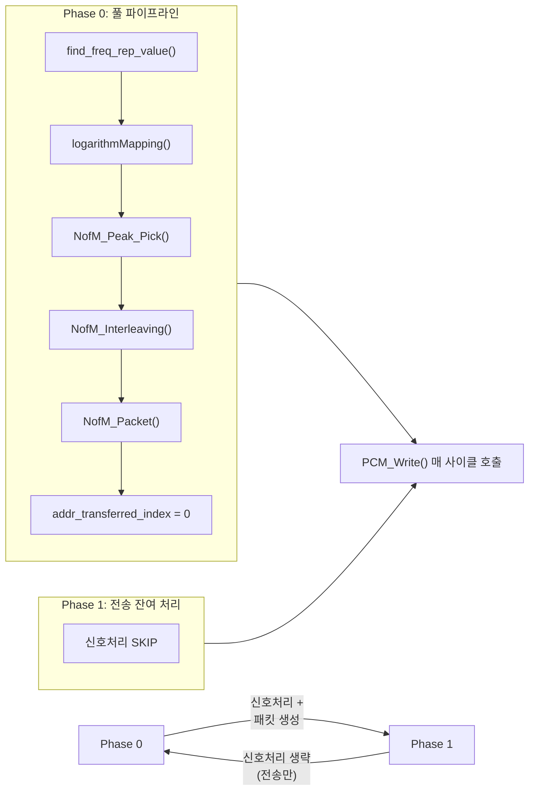
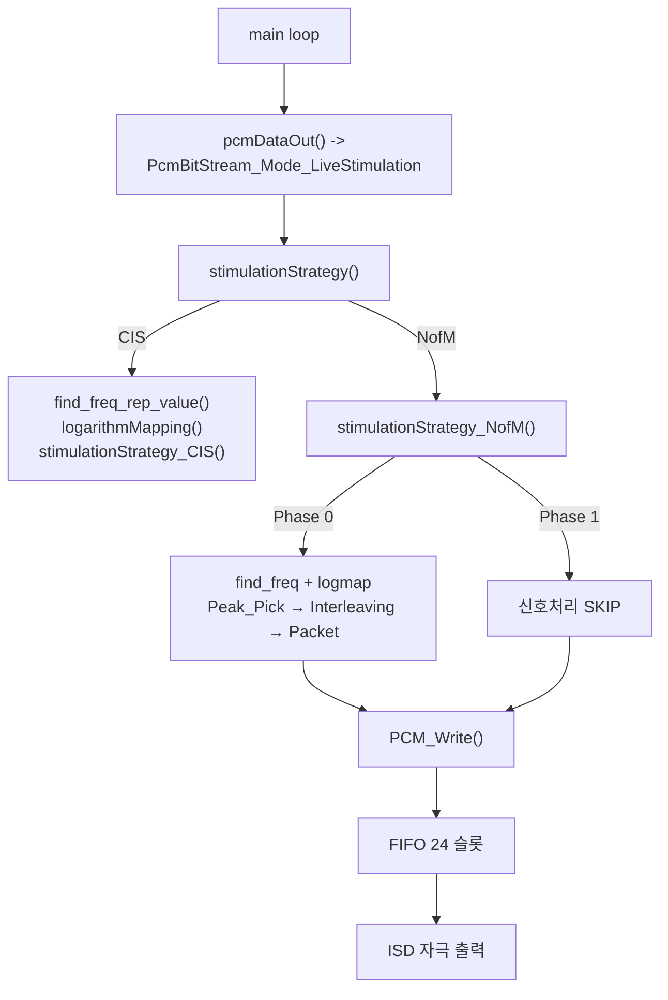
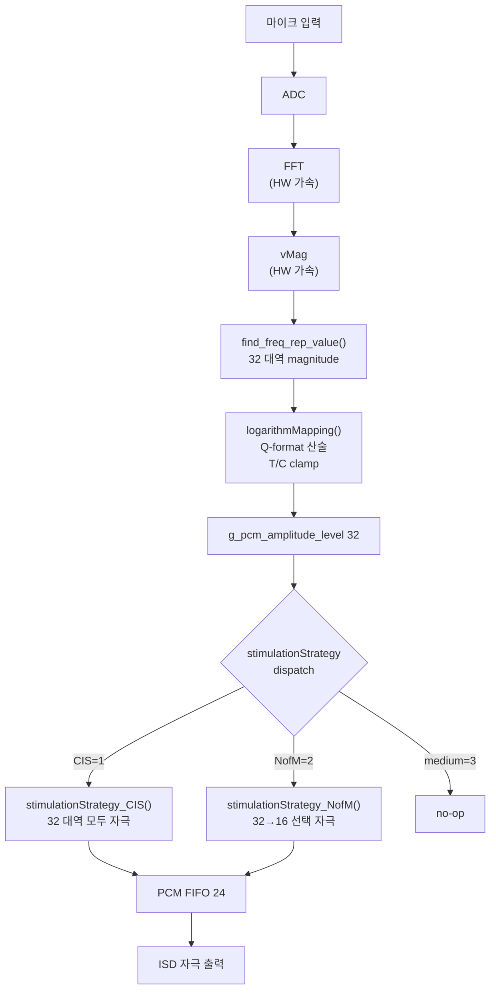
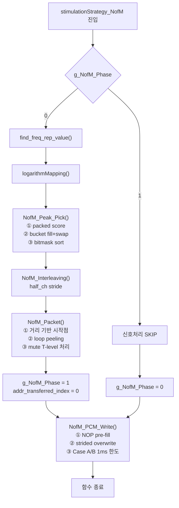

# CFX NofM 기능 구현 분석 (Rev.0)

**TL;DR**: 다른 팀원(다니엘) 이 `src/1__cfx/` 측에 추가한 **NofM (N-of-M) 자극 전략** 을 사용자(다) 가 본인 직접 working tree 병합(빌드 OK, unstaged 9 파일). 본 분석은 변경분 식별 + 함수별 walk-through 심화. 핵심 = `stimulationStrategy.c` 의 NofM 본체 6 신규 함수 (`stimulationStrategy_NofM` 마스터 + `Init_Buffers` + `Peak_Pick` + `Interleaving` + `Packet` + `PCM_Write`). **알고리즘 본질**: 32 주파수 대역 중 에너지 상위 16 개 선택 → 공간 분산(interleaving) → 프레임 간 crosstalk 최소화 → 1 ms 한도 내 strided FIFO 기록. **2단계 Phase 사이클** 로 신호처리(Phase 0)·전송 잔여(Phase 1) 분리 → CPU 부하 분산. 원본 (`nOFm`) 대비 ① 매크로/심볼명 정규화 (`nOFm` → `NofM`), ② Peak selection 알고리즘 brute-force loop → packed score + bitmask sort 로 재설계, ③ Interleaving 명시적 16 줄 매핑 → `half_ch` stride 일반화, ④ Packet 단순 modulo wrap → loop peeling + 거리 기반 시작점 결정, ⑤ Phase0/Phase1 별도 함수 (NOP+8 매핑) → 통합 `PCM_Write` (NOP pre-fill + strided overwrite + 1 ms 한도 Case A/B). 부수 변경 = `nonlinearMapping.c` 의 loop unswitching + branchless math, `FrequencyAnalysis.c` 의 포인터 최적화. CM3 측 2 파일 (`ci_ble_control_boot.c`, `LedOutput.c`) 은 NofM 무관 — 사용자 명시 별도 task 분리.

> [!IMPORTANT]
> 변경분은 unstaged 상태로 보존됨. 본 분석은 `git diff HEAD` 의 hunk + 현재 working tree 파일을 근거로 함. 인용 라인 번호는 working tree (변경 후) 기준.

## 1. 변경 통계 (9 파일)

| 구분 | 파일 | +/- | NofM 관련 |
|---|---|---|---|
| 핵심 | `src/1__cfx/signalProcessing/stimulationStrategy.c` | +522 / -353 | **본체** |
| 핵심 | `src/1__cfx/signalProcessing/stimulationStrategy.h` | +18 / -18 | 시그니처·extern |
| 핵심 | `src/1__cfx/signalProcessing/definitionsForAlgorithm.h` | +8 / -8 | 매크로 정규화 |
| 통합 | `src/1__cfx/systemControl/system_control.c` | +13 / -13 | Phase 초기화 트리거 |
| 통합 | `src/1__cfx/systemControl/main.c` | +4 / -4 | CIS 호출 분리 |
| 부수 | `src/1__cfx/signalProcessing/nonlinearMapping.c` | +174 / -174 | Loop Unswitching (NofM 직접 아님) |
| 부수 | `src/1__cfx/signalProcessing/FrequencyAnalysis.c` | +43 / -43 | 포인터 최적화 (NofM 직접 아님) |
| 무관 | `src/2__cm3/Cortex-M3-src/BleCommunication/ci_ble_control_boot.c` | +15 / -15 | OTA 후 QCC 절전 딜레이 |
| 무관 | `src/2__cm3/Cortex-M3-src/systemControl/LedOutput.c` | +2 / -2 | 팩토리 리셋 LED color default |
| **합계** | **9 파일** | **+446 / -353** | |

## 2. NofM 알고리즘 개요

**N-of-M**: 32 개 주파수 대역 중 에너지 상위 **16 개만 선택**하여 자극 (`df_MaxNum_NofM = 16`, `df_MaxNumOfElectrode = 32`). CIS (Continuous Interleaved Sampling) 은 32 개 전부 자극 — NofM 은 **선택적 자극** 전략.

### 2.1 CIS 와의 차이

| | CIS | NofM |
|---|---|---|
| 자극 채널 수 | 32 (`addr_MapProgramData_FrequencyAnalysisBandNumbers`) | 16 (`df_MaxNum_NofM`) |
| 자극 선택 | 모든 대역 자극 | 에너지 상위 16 선택 |
| 채널 간 정렬 | `addr_MapProgramData_CIS_FreqBandOrder[]` 미리 정의된 순서 | 매 프레임 packed score 기반 Top-N + interleaving |
| 신호처리 주기 | 매 사이클 | **2 사이클 1 회** (Phase 0/1 격번) |
| FIFO 작성 | 단일 함수 (CIS) 내부 1msec 분기 | `PCM_Write` 단일 함수 (NOP pre-fill + strided overwrite) |

### 2.2 핵심 아이디어 (다니엘 구현)

1. **Packed score** (`Peak_Pick`) — 진폭과 주파수 인덱스를 단일 32-bit 정수에 패킹: `score = (amp << 5) | (31 - idx)`. 동률 시 저주파(작은 idx) 가 우선 (`31 - idx` 가 더 큼).
2. **Bitmask sort** — 16 선택된 packed score 의 하위 5비트(`& 0x1F`)에서 원본 인덱스 복원 → 32-bit 비트마스크 set → 오름차순 순회로 자동 정렬.
3. **ID-Sorted Stride Interleaving** — 정렬된 16 대역을 `half_ch = 8` 단위로 분할 후 [A[0], A[8], A[1], A[9], ...] 식으로 interleave (인접 전극 연속 자극 회피).
4. **거리 기반 시작점 결정 + Loop Peeling** (`Packet`) — 이전 프레임 마지막 자극 전극과 현재 시퀀스 first/last 의 절대거리 비교 → 시작점 forward(0) 또는 reverse(N-1) 선택. modulo 회피 위해 reverse 케이스만 peeled 단일 처리.
5. **NOP pre-fill + Strided overwrite** (`PCM_Write`) — FIFO 전체를 NOP 으로 일괄 채우고, `stride = g_pcmFrameNum_per_channel` 간격으로 자극 패킷 덮어쓰기.

## 3. 2 단계 Phase 사이클

`g_NofM_Phase` (0/1) 로 신호처리 부하 분산.



매 사이클 끝에 `stimulationStrategy_NofM_PCM_Write()` 가 호출되어 FIFO 기록. Case B (펄스 N > 1 msec 한도) 일 때 `addr_transferred_index` 가 보존되어 다음 사이클(Phase 1) 에서 잔여 펄스 이어 전송.

## 4. 파일별 변경 분석

### 4.1 `definitionsForAlgorithm.h` — 매크로 정규화 + 위치 이동

[`src/1__cfx/signalProcessing/definitionsForAlgorithm.h`](../../../../src/1__cfx/signalProcessing/definitionsForAlgorithm.h)

| 변경 | 변경 전 | 변경 후 | 위치 |
|---|---|---|---|
| 상수명 정규화 | `df_MaxNum_nOFm` (L62-63, "// nOFm 주파수 밴드 수") | `df_MaxNum_NofM` (L145-146, "// NofM 주파수 밴드 수") | 위치 이동 + 표기 통일 |
| 전략 분기 | `df_stimulationStrategy_nOFm 2` (L156) | `df_stimulationStrategy_NofM 2` (L156) | 값 동일, 이름 정규화 |

위치를 `df_MaxNumOfElectrode 32` 바로 아래로 옮긴 의도 — 전극 수 (32) 와 NofM 선택 수 (16) 의 의미적 인접성 강화. 값 자체는 무변 (16, 2).

### 4.2 `stimulationStrategy.h` — 함수 시그니처 + extern

[`src/1__cfx/signalProcessing/stimulationStrategy.h`](../../../../src/1__cfx/signalProcessing/stimulationStrategy.h)

**삭제된 시그니처 (3 개)**:
```c
void stimulationStrategy_nOFm(void);
void stimulationStrategy_nOFm_Phase0(void);
void stimulationStrategy_nOFm_Phase1(void);
```

**신규 시그니처 (6 개, L27-32)**:
```c
void stimulationStrategy_NofM(void);
void stimulationStrategy_NofM_Init_Buffers(void);
void stimulationStrategy_NofM_Peak_Pick(void);
void stimulationStrategy_NofM_Interleaving(void);
void stimulationStrategy_NofM_Packet(void);
void stimulationStrategy_NofM_PCM_Write(void);
```

**전역 변수 extern 변경 (L43-46)**:
```c
extern int chess_storage(XMEM) g_NofM_adjacent_BandIndex[df_MaxNum_NofM];
extern int chess_storage(XMEM) g_NofM_notAdjacent_BandIndex[df_MaxNum_NofM];
extern int chess_storage(XMEM) g_NofM_LastStimulus_BandIndex;
extern int chess_storage(XMEM) g_NofM_Phase;  // 0 : 상위 0 ~ 7, 1 : 하위 8 ~ 15
```

원본은 `g_nOFm_LastStimulus_BandIndex`, `g_nOFm_Phase` 2 개만 헤더 extern. 본 변경에서 `adjacent_BandIndex[16]` / `notAdjacent_BandIndex[16]` 도 헤더로 공개 (의미: 다른 컴파일 유닛에서 디버깅·로깅 가능). `addr_electrodeMap` extern 도 추가 (L41).

### 4.3 `stimulationStrategy.c` — NofM 본체 walk-through

[`src/1__cfx/signalProcessing/stimulationStrategy.c`](../../../../src/1__cfx/signalProcessing/stimulationStrategy.c)

#### 4.3.1 전역 변수 정의 (L22-25)

```c
int _XMEM g_NofM_adjacent_BandIndex[df_MaxNum_NofM]    = {0};   // 16 대역 인덱스 (정렬됨, 인접 가능)
int _XMEM g_NofM_notAdjacent_BandIndex[df_MaxNum_NofM] = {0};   // 16 대역 인덱스 (interleaved, 비인접)
int _XMEM g_NofM_LastStimulus_BandIndex                = 0;     // 직전 프레임 마지막 자극 전극 idx
int _XMEM g_NofM_Phase                                 = 0;     // 0 = 신호처리 사이클, 1 = 전송 잔여
```

원본 (`nOFm`) 대비 — 변수 4 개 동일, 표기만 정규화. 다만 원본의 `g_nOFm_adjacent_BandIndex[df_MaxNum_nOFm]` 등 인덱스 사이즈 (`df_MaxNum_*`) 도 동일하게 16.

#### 4.3.2 `stimulationStrategy()` switch dispatch (L42-64) — **단순화**

**변경 전 (CIS 케이스)**:
```c
case df_stimulationStrategy_CIS:
    stimulationStrategy_CIS();
    break;
```

**변경 후 (CIS 케이스)**:
```c
case df_stimulationStrategy_CIS:
    find_freq_rep_value();
    logarithmMapping();
    stimulationStrategy_CIS();
    break;
```

→ `find_freq_rep_value()` + `logarithmMapping()` 호출이 dispatch 레이어로 이동. 변경 전에는 `main.c` 의 `HEAR_LiveStimulation_Mode()` 안에 있었음 (§4.7 참조 — 그 위치는 `#if 0` 무력화).

**변경 전 (nOFm 케이스)** — 인라인 Phase 분기 + 테스트 코드 + 세 함수 직접 호출 (`stimulationStrategy_nOFm`, `_nOFm_Phase0`, `_nOFm_Phase1`):
```c
case df_stimulationStrategy_nOFm:
#if 0 // 크기 순 정렬 테스트를 위한 입력 데이터
    if (g_nOFm_Phase == 0) { ... 32 줄 ... } else { ... } 
#endif
    if (g_nOFm_Phase == 0) {
        stimulationStrategy_nOFm();           // peak pick + interleave
        stimulationStrategy_nOFm_Phase0();    // FIFO 작성 (8개 자극, -0/-3/-6/.../-21)
        g_nOFm_Phase = 1;
    } else {
        stimulationStrategy_nOFm_Phase1();    // FIFO 작성 (다음 8개, -0/-3/.../-21)
        g_nOFm_Phase = 0;
    }
    break;
```

**변경 후 (NofM 케이스)** — 마스터 함수 단일 호출:
```c
case df_stimulationStrategy_NofM:
    stimulationStrategy_NofM();
    break;
```

dispatch 레이어 책임이 "정책 분기" 로 축소되고, Phase 사이클 제어 + 신호처리 호출 + FIFO 작성 모두 `stimulationStrategy_NofM` 마스터 안으로 캡슐화됨.

#### 4.3.3 `stimulationStrategy_NofM()` 마스터 (L66-95) — Phase 사이클

```c
void stimulationStrategy_NofM(void)
{
    if (g_NofM_Phase == 0) {
        /* Phase 0: 풀 파이프라인 */
        find_freq_rep_value();                          // FFT vMag → 32 대역 magnitude
        logarithmMapping();                             // log map + T/C clamp → g_pcm_amplitude_level[32]
        stimulationStrategy_NofM_Peak_Pick();           // 32 중 16 선택 → g_NofM_adjacent_BandIndex
        stimulationStrategy_NofM_Interleaving();        // 공간 분산 → g_NofM_notAdjacent_BandIndex
        stimulationStrategy_NofM_Packet();              // PCM 패킷 16 개 → addr_stimulationTempBuff

        g_NofM_Phase = 1;
        addr_transferred_index = 0;                     // 새 전송 사이클 시작
    }
    else {
        /* Phase 1: 신호처리 생략, 잔여 펄스 전송만 */
        g_NofM_Phase = 0;
    }

    stimulationStrategy_NofM_PCM_Write();               // FIFO 기록 (매 사이클)
}
```

원본 (`stimulationStrategy_nOFm` + `_nOFm_Phase0` + `_nOFm_Phase1`) 의 Phase 분기 + FIFO 기록을 단일 마스터로 통합. **PCM_Write 가 매 사이클 호출** 되는 점이 핵심 — Phase 1 에서도 FIFO 기록이 일어나야 잔여 자극이 끊김 없이 출력됨. 원본은 Phase0/Phase1 함수가 각각 NOP 채움 + 명시적 8개 자극 매핑.

#### 4.3.4 `stimulationStrategy_NofM_Init_Buffers()` (L97-114) — 초기화

```c
void stimulationStrategy_NofM_Init_Buffers(void)
{
    for (register int i = 0; i < df_MaxNum_NofM; i++)
        chess_loop_range(df_MaxNum_NofM, df_MaxNum_NofM)
    {
        g_NofM_adjacent_BandIndex[i]    = -1;
        g_NofM_notAdjacent_BandIndex[i] = -1;
    }

    for (register int i = 0; i < df_MaxNumOfElectrode; i++)
        chess_loop_range(df_MaxNumOfElectrode, df_MaxNumOfElectrode)
    {
        addr_stimulationTempBuff[i]     = -1;
    }
}
```

`adjacent_BandIndex[16]`, `notAdjacent_BandIndex[16]` 를 `-1` 로 초기화 (선택 안 됨 표시). `addr_stimulationTempBuff[32]` 도 `-1` 로 초기화 — Packet 단계에서 16 슬롯만 채워지므로 나머지 16 슬롯은 미사용 마커 유지.

`chess_loop_range(min, max)` 는 RSL10/CFX 컴파일러의 loop unrolling 힌트 (Synopsys ChessJet/HEAR 도구체인). `(16, 16)` 은 "이 루프는 정확히 16 회 반복" 명시 → 컴파일러가 zero-overhead loop (ZOL) 코드 생성.

#### 4.3.5 `stimulationStrategy_NofM_Peak_Pick()` (L116-232) — **Packed score 기반 Top-16 선택**

원본 (`stimulationStrategy_nOFm`) 의 brute-force 알고리즘과 본질적으로 다른 새 알고리즘. 전체 라인 단위로 따라가본다.

**Step 1: Packed score 사전 계산 (L141-145)**

```c
int packed_scores[df_MaxNumOfElectrode];   // 32 슬롯

for (register int i = 0; i < df_MaxNumOfElectrode; i++)
    chess_loop_range(df_MaxNumOfElectrode, df_MaxNumOfElectrode)
{
    packed_scores[i] = (g_pcm_amplitude_level[i] << 5) | (31 - i);
}
```

각 전극(`i`) 의 진폭(8-bit, `g_pcm_amplitude_level[i]`) 을 5 비트 좌측 시프트하여 상위 비트로 보내고, 하위 5 비트에 `31 - i` (전극 인덱스를 뒤집어 저장) 를 OR.

**핵심 트릭**: 진폭 동률 시 저주파(작은 `i`) 가 더 큰 `31 - i` 를 가져 packed score 가 큼 → 정렬 시 저주파 우선. 본문 주석에서 예시:
- Low Freq (idx 2, amp 10): `(10 << 5) | (31 - 2) = 320 | 29 = 349`
- High Freq (idx 6, amp 10): `(10 << 5) | (31 - 6) = 320 | 25 = 345`
- → 345 < 349 → 고주파(idx 6) 가 더 약한 peak 로 평가됨.

이 트릭으로 **정렬 단계와 동률 처리(tiebreak) 가 한 번에 패킹됨** — 별도 비교 로직 불필요.

**Step 2: 초기 버킷 채움 + 최소값 탐색 (L152-170)**

```c
for (register int i = 0; i < df_MaxNum_NofM; i++)    // 처음 16 개 무조건 채움
    chess_loop_range(df_MaxNum_NofM, df_MaxNum_NofM)
{
    top_packed[i] = packed_scores[i];
}

register int min_packed        = top_packed[0];
register int min_idx_in_bucket = 0;

for (register int i = 1; i < df_MaxNum_NofM; i++)    // 버킷 내 최소값 탐색
    chess_loop_range(1, df_MaxNum_NofM)
{
    if (top_packed[i] < min_packed) {
        min_packed        = top_packed[i];
        min_idx_in_bucket = i;
    }
}
```

전극 0~15 의 packed score 를 그대로 버킷에 복사하고, 버킷 안 최소값을 식별. 이후 16~31 스캔에서 이 최소값과 비교.

**Step 3: Brute-force bucket swap (L179-201)**

```c
for (register int i = df_MaxNum_NofM; i < df_MaxNumOfElectrode; i++)   // i = 16..31
    chess_loop_range(1, df_MaxNumOfElectrode)
{
    register int current_packed = packed_scores[i];

    if (current_packed > min_packed) {
        top_packed[min_idx_in_bucket] = current_packed;   // 약한 peak 교체

        // 새 약한 peak 다시 탐색 (O(N) 재스캔)
        min_packed        = top_packed[0];
        min_idx_in_bucket = 0;

        for (register int t = 1; t < df_MaxNum_NofM; t++)
            chess_loop_range(1, df_MaxNum_NofM)
        {
            if (top_packed[t] < min_packed) {
                min_packed        = top_packed[t];
                min_idx_in_bucket = t;
            }
        }
    }
}
```

남은 16 개 (idx 16~31) 의 packed score 가 버킷 최소값보다 크면 swap + 버킷 내 새 최소값 재탐색. 시간 복잡도 = 워스트 O(M·N) = O(32·16) = 512 비교. 본 CFX 의 자극 사이클 (2 msec 주기 × Phase 0) 안에 충분.

**원본 알고리즘과 비교**: 원본은 동일 brute-force 패턴이지만 packed score 미사용 (`g_pcm_amplitude_level` 직접 참조) + 버킷에 인덱스를 저장 + tiebreak 정책 명시 안 됨 (`amp > minAmp` 만, 동률 시 교체 안 함). 다니엘 구현은 packed score 로 tiebreak 정책 (저주파 우선) 을 알고리즘 안에 내재화.

**Step 4: Frequency Sort (Bitmask Presence) (L211-231)**

```c
register unsigned long present_mask = 0;

// 하위 5비트 (0x1F) 마스킹으로 원본 인덱스 복원 → 비트 set
for (register int i = 0; i < df_MaxNum_NofM; i++)
    chess_loop_range(df_MaxNum_NofM, df_MaxNum_NofM)
{
    register int original_idx = 31 - (top_packed[i] & 0x1F);
    present_mask |= (1UL << original_idx);
}

// 비트마스크를 0..31 순회하며 set 비트만 출력
register int presentOut = 0;
for (register int b = 0; b < df_MaxNumOfElectrode; b++)
    chess_loop_range(df_MaxNumOfElectrode, df_MaxNumOfElectrode)
{
    if (present_mask & (1UL << b)) {
        g_NofM_adjacent_BandIndex[presentOut++] = b;
    }
}
```

핵심: **packed score 에서 원본 인덱스 복원** — `top_packed[i] & 0x1F` 는 하위 5비트 (= `31 - original_idx`) → `31 - (...)` 로 원본 idx 복원. 16 개 idx 를 32-bit `present_mask` 에 set. 그 다음 `b = 0..31` 순회로 자동 오름차순 정렬.

**왜 비트마스크인가**: 16 개 정렬을 O(N²) 비교 정렬 없이 O(M) = O(32) 비트 스캔으로 처리. 동시에 sparse → dense 변환 (32 전극 중 16 선택의 dense 인덱스 추출).

**원본 알고리즘과 비교**: 원본은 `int present[df_MaxNumOfElectrode]` 배열 (32 슬롯) 을 0/1 로 사용. 비트마스크 (unsigned long 32 비트 단일 변수) 가 RAM 32× 절약 + 비트 연산이 빠름.

**출력**: `g_NofM_adjacent_BandIndex[0..15]` = 에너지 상위 16 대역의 인덱스, 주파수 오름차순 정렬.

#### 4.3.6 `stimulationStrategy_NofM_Interleaving()` (L234-269) — **ID-Sorted Stride 공간 분산**

```c
void stimulationStrategy_NofM_Interleaving(void)
{
    int half_ch = df_MaxNum_NofM / 2;    // 8

    for (int i = 0; i < half_ch; i++) {
        g_NofM_notAdjacent_BandIndex[i * 2]       = g_NofM_adjacent_BandIndex[i];
        g_NofM_notAdjacent_BandIndex[(i * 2) + 1] = g_NofM_adjacent_BandIndex[i + half_ch];
    }

    if (df_MaxNum_NofM % 2 != 0) {   // df_MaxNum_NofM = 16 → 조건 false
        g_NofM_notAdjacent_BandIndex[df_MaxNum_NofM - 1] = g_NofM_adjacent_BandIndex[df_MaxNum_NofM - 1];
    }
}
```

**알고리즘**: 정렬된 `adjacent_BandIndex[0..15]` 를 절반 분할 (`[0..7]`, `[8..15]`) 후 짝수/홀수 인덱스에 교차 배치.

| `i` | 짝수 idx (`i*2`) | 값 | 홀수 idx (`i*2+1`) | 값 |
|---|---|---|---|---|
| 0 | 0 | `adj[0]` | 1 | `adj[8]` |
| 1 | 2 | `adj[1]` | 3 | `adj[9]` |
| ... | ... | ... | ... | ... |
| 7 | 14 | `adj[7]` | 15 | `adj[15]` |

→ 결과 `notAdjacent_BandIndex` = `[adj[0], adj[8], adj[1], adj[9], adj[2], adj[10], ..., adj[7], adj[15]]`

**효과**: 연속 자극되는 두 전극의 idx 차이가 약 8 (half_ch) 이 됨 → 전기적 crosstalk (인접 전극 간섭) 감소. 단순 순차 자극 (`[0,1,2,...,15]`) 대비 공간 간격 8 배.

**홀수 처리**: `df_MaxNum_NofM` 이 홀수일 경우 마지막 슬롯에 직접 매핑. 현재 `df_MaxNum_NofM = 16` 이라 비활성 가지 — 그러나 향후 N 변경 시 일반화 가능.

**원본 알고리즘과 비교**: 원본은 16 줄을 펼쳐 명시적 매핑 (`g_nOFm_notAdjacent_BandIndex[0] = adj[0]; [1] = adj[8]; [2] = adj[1]; ...`). 다니엘 구현은 stride 로 일반화 — N 가변성 대비.

#### 4.3.7 `stimulationStrategy_NofM_Packet()` (L271-346) — **거리 기반 시작점 + Loop Peeling + Mute 처리**

원본의 `stimulationStrategy_nOFm` 마지막 단락 (best diff 탐색 + modulo 회전 루프) 을 함수 분리 + 최적화.

**Step 1: 시작점 결정 (L273-290)**

```c
int NofM_maxIndex   = df_MaxNum_NofM - 1;   // 15
int first_electrode = g_NofM_notAdjacent_BandIndex[0];
int last_electrode  = g_NofM_notAdjacent_BandIndex[NofM_maxIndex];
int prev_last_stim  = g_NofM_LastStimulus_BandIndex;    // 직전 프레임 마지막 자극

int dist_to_first = first_electrode - prev_last_stim;
dist_to_first = (dist_to_first < 0) ? -dist_to_first : dist_to_first;    // abs

int dist_to_last  = last_electrode - prev_last_stim;
dist_to_last = (dist_to_last < 0) ? -dist_to_last : dist_to_last;        // abs

int start_idx = (dist_to_last > dist_to_first) ? (NofM_maxIndex) : 0;
```

이전 프레임 마지막 자극 위치(`prev_last_stim`) 와 현재 시퀀스 first/last 의 절대거리 비교 → 더 먼 쪽에서 시작 (`start_idx = 0` forward 또는 `NofM_maxIndex` reverse).

**원본 알고리즘과 비교**: 원본은 16 개 슬롯 전부와 거리 비교 → bestIndex 찾기 (`bestDiff = max distance`). 다니엘 구현은 **first/last 2 개만 비교** → O(N) → O(1). 정당화 근거: notAdjacent 정렬이 stride 패턴이라 first 와 last 만이 후보로 유효 (intermediate 슬롯은 항상 first 또는 last 보다 가깝거나 같음).

**Step 2: 다음 프레임용 LastStimulus 사전 업데이트 (L294-298)**

```c
if (start_idx == 0) {
    g_NofM_LastStimulus_BandIndex = last_electrode;             // forward 시퀀스 → 마지막 = last
} else {
    g_NofM_LastStimulus_BandIndex = g_NofM_notAdjacent_BandIndex[df_MaxNum_NofM - 2];  // reverse 시퀀스 → 마지막 = N-2 슬롯
}
```

**왜 N-2** (reverse 케이스): reverse 시퀀스는 `[N-1, 0, 1, 2, ..., N-2]` 순서로 자극되므로 마지막 자극 슬롯이 `N-2`. (`g_NofM_notAdjacent_BandIndex[N-2]` 의 값을 다음 프레임 거리 계산 기준점으로.)

**Step 3: Sequence Generation with Loop Peeling (L300-345)**

Loop Peeling = 첫(또는 끝) 반복 1 회를 루프 밖으로 빼고 나머지를 단순 루프로 — modulo/조건 분기 제거 최적화.

```c
int pcmOut = 0;

// Peeled: reverse 시퀀스의 첫 자극 (= N-1 슬롯) 단독 처리
if (start_idx == NofM_maxIndex) {
    freqBandOrder = g_NofM_notAdjacent_BandIndex[NofM_maxIndex];
    electrodIndex = addr_MapProgramData_StimulusChannelAssignedElectrodIndex[freqBandOrder] - 1;
    electrodeMap  = addr_electrodeMap[electrodIndex] << electrodIndexPositionAtPCM_Mold;

    if (Addr_SharedMem->is_enabled_mute_stimulation_under_t_level == 1 && g_pcm_amplitude_level[freqBandOrder] == 0) {
        addr_stimulationTempBuff[pcmOut++] = ISD_registerAddr_forwardPath_check_Data;  // 묵음 → dummy packet
    } else {
        stimulusLevel = g_pcm_amplitude_level[freqBandOrder] << stimulationPositionAtPCM_Mold;
        addr_stimulationTempBuff[pcmOut++] = (electrodeMap | stimulusLevel | g_pcm_stimulation_packet_header);
    }
}

// 나머지: 0..(loop_end-1) 순차 처리 (forward 면 0..15, reverse 면 0..14)
int loop_end = (start_idx == NofM_maxIndex) ? NofM_maxIndex : df_MaxNum_NofM;

for (int pcmIdx = 0; pcmIdx < loop_end; pcmIdx++)
    chess_loop_range(df_MaxNum_NofM - 1, df_MaxNum_NofM)
{
    freqBandOrder = g_NofM_notAdjacent_BandIndex[pcmIdx];
    electrodIndex = addr_MapProgramData_StimulusChannelAssignedElectrodIndex[freqBandOrder] - 1;
    electrodeMap  = addr_electrodeMap[electrodIndex] << electrodIndexPositionAtPCM_Mold;

    if (Addr_SharedMem->is_enabled_mute_stimulation_under_t_level == 1 && g_pcm_amplitude_level[freqBandOrder] == 0) {
        addr_stimulationTempBuff[pcmOut++] = ISD_registerAddr_forwardPath_check_Data;
    } else {
        stimulusLevel = g_pcm_amplitude_level[freqBandOrder] << stimulationPositionAtPCM_Mold;
        addr_stimulationTempBuff[pcmOut++] = (electrodeMap | stimulusLevel | g_pcm_stimulation_packet_header);
    }
}
```

**핵심 비트 패킹 (CIS 와 동일 패턴)**:
- `electrodeMap`: `addr_electrodeMap[electrodIndex]` 의 전극 번호 (0~31) 를 `electrodIndexPositionAtPCM_Mold` 비트 좌측 시프트
- `stimulusLevel`: 진폭 (8-bit) 을 `stimulationPositionAtPCM_Mold` 비트 좌측 시프트
- `g_pcm_stimulation_packet_header`: `pcm_Mold_Stimulation` 패킷 헤더 마스크 + first pulse phase 비트 (`prepare_pcmStimulationPacketHeader()` 에서 미리 계산)
- 최종 `addr_stimulationTempBuff[pcmOut++] = electrodeMap | stimulusLevel | g_pcm_stimulation_packet_header` 결합

**Mute 처리 (T-level 미만 묵음)**: `is_enabled_mute_stimulation_under_t_level == 1` AND `g_pcm_amplitude_level == 0` 이면 자극 패킷 대신 dummy "forward path check" 패킷 (`ISD_registerAddr_forwardPath_check_Data = 0x50783`, definitionsForAlgorithm.h L21) 전송. CIS 의 `stimulationStrategy_CIS()` 와 동일 정책.

**원본 알고리즘과 비교**: 원본은 `for (int t = 0; t < df_MaxNum_nOFm; t++) { pcmIdx++; if (pcmIdx >= df_MaxNum_nOFm) pcmIdx = 0; }` 의 modulo wrap 사용. 다니엘 구현은 Loop Peeling 으로 modulo 제거 (각 iteration 에서 분기 1 회 제거 → 16 iteration × 1 분기 = 16 사이클 절약).

**출력**: `addr_stimulationTempBuff[0..15]` 에 16 개 PCM 자극 패킷 (또는 dummy 패킷). pcmOut = 16.

#### 4.3.8 `stimulationStrategy_NofM_PCM_Write()` (L348-408) — NOP Pre-fill + Strided Overwrite + 1 ms 한도

```c
void stimulationStrategy_NofM_PCM_Write(void)
{
    int _XMEM *p_pcmFIFO = (int _XMEM *) HEAR_ADDR_FIFO_PCM_WRITING;
    int stride = g_pcmFrameNum_per_channel;     // 1 자극당 PCM 프레임 수 (CM3 가 펄스폭 기반 계산)

    /* FAST PRE-FILL: 전체 버퍼 NOP 으로 채움 */
    for (register int i = 0; i < df_MaxNumTransferableChannel; i++)   // 24 회
        chess_loop_range(0, df_MaxNumTransferableChannel)
    {
        *p_pcmFIFO-- = pcm_Mold_NopStandby;
    }

    /* STRIDED OVERWRITE: stride 간격으로 자극 패킷 덮어쓰기 */
    int _XMEM *pulse_ptr = (int _XMEM *) HEAR_ADDR_FIFO_PCM_WRITING;

    if (df_MaxNum_NofM < g_transferableChannelNum_per_1msec) {
        /* Case A: N(=16) < 1 msec 한도 → 16 펄스 모두 기록 후 인덱스 리셋 */
        for (register int i = 0; i < df_MaxNum_NofM; i++)
            chess_loop_range(0, df_MaxNum_NofM)
        {
            *pulse_ptr = addr_stimulationTempBuff[addr_transferred_index];
            pulse_ptr -= stride;
            addr_transferred_index++;
        }
        addr_transferred_index = 0;
    }
    else {
        /* Case B: N(=16) >= 한도 → 한도까지만 기록, 인덱스 유지 + N 도달 시 wrap */
        for (register int i = 0; i < g_transferableChannelNum_per_1msec; i++)
            chess_loop_range(0, 24)
        {
            *pulse_ptr = addr_stimulationTempBuff[addr_transferred_index];
            pulse_ptr -= stride;

            addr_transferred_index++;
            if (addr_transferred_index >= df_MaxNum_NofM) {
                addr_transferred_index = 0;
            }
        }
    }
}
```

**FIFO 모델**: `HEAR_ADDR_FIFO_PCM_WRITING` 은 PCM 자극 FIFO 의 head. 포인터를 **감소** 방향 (`p_pcmFIFO--`) 으로 쓴다 — 하드웨어가 디크리먼트 주소 모드로 읽는 구조.

**Step 1: NOP Pre-fill (FAST)** — FIFO 의 24 슬롯 (`df_MaxNumTransferableChannel`) 전부에 `pcm_Mold_NopStandby` 기록. 자극이 없는 슬롯은 NOP 으로 자동 유지.

**Step 2: Strided Overwrite** — NOP 위에 자극 패킷을 stride (`g_pcmFrameNum_per_channel`) 간격으로 덮어씀. stride 의 의미 — 한 자극 채널당 PCM 프레임 수 (CM3 가 펄스폭 기반 계산). 예: stride = 3 이면 0, -3, -6, -9, ... 위치에 자극.

**Case A (16 < 한도)**: 16 자극 모두 한 사이클(1 ms)에 기록 가능. 모두 기록 후 `addr_transferred_index = 0` 리셋.

**Case B (16 >= 한도)**: 1 ms 한도 내에 다 못 보냄. 한도(`g_transferableChannelNum_per_1msec`, 예: 24) 만큼만 기록, `addr_transferred_index` 보존하여 다음 Phase 1 사이클에서 잔여 펄스 이어 전송 (`addr_transferred_index >= 16` 이면 0 으로 wrap).

**Phase 1 에서의 동작**: `stimulationStrategy_NofM` 마스터가 Phase 1 일 때 `PCM_Write` 만 호출. 그러나 Phase 1 의 PCM_Write 는 **이전 Phase 0 에서 채워진 `addr_stimulationTempBuff[0..15]` 를 재참조** → 동일 자극 시퀀스를 한 번 더 전송하는 게 아니라 Case A 였다면 인덱스가 0 이라 처음부터 다시, Case B 였다면 보존된 인덱스에서 이어서. 결국 다중 프레임 분산 전송으로 1 ms 한도 회피.

**원본 알고리즘과 비교**: 원본은 `_nOFm_Phase0` / `_nOFm_Phase1` 두 함수 각각에서 NOP 채움 + 명시적 8 개 자극 매핑 (`*(p_pcmFIFO - 0)`, `-3`, `-6`, ..., `-21`). 즉 stride = 3 (8 자극 × 3 프레임 = 24 슬롯) 하드코딩 + 8 + 8 분할 명시. 다니엘 구현은 stride 변수화 + Case A/B 분기로 **임의의 N·stride 조합 일반화**.

### 4.4 `nonlinearMapping.c` — Loop Unswitching + Branchless Math (NofM 직접 아님)

[`src/1__cfx/signalProcessing/nonlinearMapping.c`](../../../../src/1__cfx/signalProcessing/nonlinearMapping.c)

`logarithmMapping()` 함수의 +174/-174 변경. 의미는 동등 (출력 `g_pcm_amplitude_level[]` 동일), 구조 최적화.

**최적화 1: `temp_x_power_p[]` 사전 계산**
```c
int temp_x_power_p[df_MaxNumOfElectrode];

for (register int i = 0; i < df_MaxNumOfElectrode; i++)
    chess_loop_range(df_MaxNumOfElectrode, df_MaxNumOfElectrode) {
        temp_x_power_p[i] = calculate_x_power_p(g_freq_rep_values_scaled[i]);
}
```

각 전극의 `x_power_p` (Q8.16 형식) 를 사전 계산 → 이후 mute_mode 분기 루프에서 중복 호출 회피.

**최적화 2: Loop Unswitching — mute_mode 분기를 루프 외부로**

변경 전:
```c
for (i = 0..31) {
    // 매 iteration 내부에서 if (is_enabled_mute) ... else if ... else ...
}
```

변경 후:
```c
if (mute_mode == 1) {
    for (i = 0..31) { /* mute enabled 처리 */ }
} else if (mute_mode == 2) {
    for (i = 0..31) { /* mute disabled 처리 */ }
} else {
    for (i = 0..31) { /* unknown → y = 0 */ }
}
```

루프 내부 분기 제거 → 분기 예측 부담 감소 + 컴파일러가 각 루프를 개별 최적화. mute_mode 는 매 프레임 단위로 일정하므로 루프 내부 재평가 불필요.

**최적화 3: Branchless Saturation Clamp (ternary)**

변경 전:
```c
if (long_acc > INT24_MAX) long_acc = INT24_MAX;
else if (long_acc < INT24_MIN) long_acc = INT24_MIN;
```

변경 후:
```c
long_acc = (long_acc > INT24_MAX) ? INT24_MAX : ((long_acc < INT24_MIN) ? INT24_MIN : long_acc);
```

T-level / C-level clamp 도 동일 패턴.

**Q-format 산술 일관 유지**: 변경 후에도 주석에 산술 형식 명시 — Q8.16 × Q16.8 → Q24.24 → Q24.8 → Q16.8, Q16.8 + Q16.8 → Q16.8, `>> 8` 로 Q16.0 추출. 본 산술은 RSL10 CFX 코어의 24-bit 정수 누산기에 최적화된 형식.

**NofM 와의 관계**: 본 변경은 NofM 직접 영향 없음 — `logarithmMapping()` 은 `stimulationStrategy_NofM` Phase 0 에서 호출되지만, 본 함수의 출력 (`g_pcm_amplitude_level[32]`) 형식은 변경 전과 동등. 다니엘이 NofM 작업과 함께 부수 최적화로 진행한 것으로 추정.

### 4.5 `FrequencyAnalysis.c` — 포인터 최적화 + Branchless Max (NofM 직접 아님)

[`src/1__cfx/signalProcessing/FrequencyAnalysis.c`](../../../../src/1__cfx/signalProcessing/FrequencyAnalysis.c)

`find_freq_rep_value()` +43/-43.

**최적화 1: 포인터 후증가 (인덱스 접근 회피)**

변경 전:
```c
for (i = 0..31) {
    g_freq_rep_values[i] = 0;
}
```

변경 후:
```c
int* freq_rep_ptr = g_freq_rep_values;
for (i = 0..31) {
    *freq_rep_ptr++ = 0;
}
```

매 iteration 의 `base + i` 주소 계산을 단일 `++` 로 대체 — CFX 의 포인터 후증가 명령이 ADD 명령보다 빠름 (HEAR DSP 패턴).

FFT 결과 처리 루프(`HALF_FFT_SIZE = 256` 회) 도 동일 패턴:
```c
int* bin_index_ptr  = g_pass_bin_index;
int _XMEM* vmag_ptr = (int _XMEM*) HEAR_ADDR_VMAG_OUTPUT;

for (i = 0..255) {
    register int index     = *bin_index_ptr++;
    register int magnitude = *vmag_ptr++;
    // ...
}
```

**최적화 2: Branchless Max (ternary)**

변경 전:
```c
if (g_freq_rep_values[index] < magnitude) {
    g_freq_rep_values[index] = magnitude;
}
```

변경 후:
```c
register int current_max = g_freq_rep_values[index];
g_freq_rep_values[index] = (magnitude > current_max) ? magnitude : current_max;
```

분기 제거 + register 임시 변수로 메모리 접근 1회 절약 (read + 비교 + write 가 모두 일어나지만 분기 예측 부담 없음).

**NofM 와의 관계**: 본 함수의 출력 (`g_freq_rep_values[32]`, `g_freq_rep_values_scaled[32]`) 은 형식 무변. `logarithmMapping` 입력으로 그대로 사용됨. NofM 직접 영향 없음.

### 4.6 `system_control.c` — NofM Phase 초기화 트리거

[`src/1__cfx/systemControl/system_control.c:71-77`](../../../../src/1__cfx/systemControl/system_control.c)

```c
void Normal_PowerMode_event_mapChange(void)
{
    // ...
    /* NOTE: 프로그램 변경 시 NofM 전략이라면 NofM Phase가 0부터 수행될 수 있게 초기화. */
    if (addr_MapProgramData_stimulationStrategy == df_stimulationStrategy_NofM)
    {
        g_NofM_Phase = 0;
    }
    // ...
}
```

매핑 프로그램 변경 이벤트 시 NofM 전략이면 `g_NofM_Phase = 0` 으로 재시작 — 이전 매핑의 Phase 상태 (예: Phase 1 중간) 가 새 매핑에 누설되지 않도록.

**변경 전 대비**:
```c
if (addr_MapProgramData_stimulationStrategy == df_stimulationStrategy_nOFm)
{
    g_nOFm_LastStimulus_BandIndex = 0;
    g_nOFm_Phase                  = 0;
}
```

원본은 `LastStimulus_BandIndex` 도 0 으로 리셋. 다니엘 구현은 **LastStimulus 는 매핑 변경 시 보존** — 이전 자극 위치를 거리 계산에 계속 활용. 효과: 매핑 직후 첫 Phase 0 에서 packet 시작점 결정이 자연스러움 (0 으로 리셋 시 항상 first/last 거리 비교가 편향됨).

나머지 변경 (포인터 사이의 공백, 줄 합치기) 은 코드 스타일 정리, 의미 변경 없음.

### 4.7 `main.c` — CIS/NofM 호출 위치 dispatch 레이어 이동

[`src/1__cfx/systemControl/main.c:428-435`](../../../../src/1__cfx/systemControl/main.c)

```c
void HEAR_LiveStimulation_Mode(void)
{
    // ...
    do {
        // ... 입력 처리, 트리거 대기 ...
    } while ((volatile int) 1);

    /* pcmDataOut() -> PcmBitStream_Mode_LiveStimulation: 세부 설정으로 이동 */
#if 0
    find_freq_rep_value(); // 113usec @ 2025.01.10
    logarithmMapping(); // 76 usec 소요 @ 2025.01.20
#endif

    pcmDataOut(); // PCM
}
```

변경 전 — `find_freq_rep_value()` + `logarithmMapping()` 가 `main.c` 의 라이브 자극 루프에서 직접 호출. 변경 후 — `#if 0` 으로 무력화 + `stimulationStrategy()` dispatch 레이어 안으로 호출 이동 (§4.3.2 참조).

**의도**: 신호처리·자극 결정 책임을 `stimulationStrategy()` 단일 진입점으로 집중. CIS / NofM / medium 분기마다 호출 위치를 적절히 배치 (CIS = 매 사이클, NofM = Phase 0 만, medium = 호출 안 함).

주석 `pcmDataOut() -> PcmBitStream_Mode_LiveStimulation: 세부 설정으로 이동` 은 호출 이동 사실 명시.

## 5. NofM 통합 인터페이스

### 5.1 매크로 분기 지점

`stimulationStrategy()` (stimulationStrategy.c:42-64) 의 switch case:
```c
switch (addr_MapProgramData_stimulationStrategy)
{
    case df_stimulationStrategy_CIS:    // = 1
        find_freq_rep_value(); logarithmMapping(); stimulationStrategy_CIS();
        break;
    case df_stimulationStrategy_NofM:   // = 2
        stimulationStrategy_NofM();
        break;
    case df_stimulationStrategy_medium: // = 3
        // do nothing
        break;
}
```

매핑 데이터의 `stimulationStrategy` 필드가 1/2/3 중 어느 값인지에 따라 분기. 매핑 변경 이벤트 (`Normal_PowerMode_event_mapChange`) 시 NofM 면 Phase 초기화.

### 5.2 전역 변수 라이프사이클

| 변수 | 작성자 | 소비자 | 라이프사이클 |
|---|---|---|---|
| `g_NofM_Phase` | `stimulationStrategy_NofM` (토글) / `system_control.c:75` (리셋) | `stimulationStrategy_NofM` (분기) | 영구 (전역 상태) |
| `g_NofM_adjacent_BandIndex[16]` | `Peak_Pick` (16 idx 저장) | `Interleaving` (입력) | Phase 0 내부 (생명주기 = 1 사이클) |
| `g_NofM_notAdjacent_BandIndex[16]` | `Interleaving` (interleaved 16 idx) | `Packet` (입력) | Phase 0 내부 |
| `g_NofM_LastStimulus_BandIndex` | `Packet` (다음 프레임용 사전 업데이트) | `Packet` (다음 프레임 거리 계산) | 영구 (프레임 간 연속) |
| `addr_stimulationTempBuff[32]` | `Packet` (16 슬롯 PCM 패킷) / `Init_Buffers` (-1 초기화) | `PCM_Write` (FIFO 기록 입력) | Phase 0 → Phase 1 사이클 간 보존 (Phase 1 PCM_Write 가 재참조) |
| `addr_transferred_index` | `stimulationStrategy_NofM` (Phase 0 진입 시 0) / `PCM_Write` (Case A 후 0, Case B 후 보존) | `PCM_Write` (FIFO 기록 인덱스) | 사이클 간 보존 (Case B 다중 사이클 전송) |

### 5.3 main loop 와의 결합



`main.c` 의 라이브 자극 루프 → `pcmDataOut()` → `stimulationStrategy()` dispatch → CIS/NofM 분기 → FIFO 기록 → ISD 자극.

## 6. NofM 무관 변경 분별 (CM3 측 2 파일)

사용자(다) 명시 — 두 파일은 NofM 과 별개. 본 분석 범위 외. 별도 task 등재 권고.

### 6.1 `ci_ble_control_boot.c` — OTA DFU 후 QCC 절전 모드 진입 딜레이

[`src/2__cm3/Cortex-M3-src/BleCommunication/ci_ble_control_boot.c`](../../../../src/2__cm3/Cortex-M3-src/BleCommunication/ci_ble_control_boot.c)

**변경 내용** (+15/-15, L10/L117/L119-123 부근):
- 신규 include: `<snd_qcc.h>`
- 신규 호출: `snd_qcc_set_mode(SND_QCC_MODE_SHUTDOWN)` — QCC 칩에 절전 모드 진입 명령
- 딜레이 변경: 100 × 10 ms → 2200 × 1 ms (총 2.2 초)

**사용자 설명**: "OTA DFU 후 재부팅 시 QCC의 절전 모드 진입을 위한 딜레이 시간 확보가 목적". QCC 절전 진입에 ≥ 2 초 필요 → 100 × 10 ms (1 초) 부족 → 2200 × 1 ms (2.2 초) 로 확보.

**별도 task 후보**: `ble/qcc-shutdown-delay` 또는 `ble/ota-qcc-shutdown` placeholder 등재. ble 모듈.

### 6.2 `LedOutput.c` — 팩토리 리셋 LED color default

[`src/2__cm3/Cortex-M3-src/systemControl/LedOutput.c`](../../../../src/2__cm3/Cortex-M3-src/systemControl/LedOutput.c)

**변경 내용** (+2/-2, L208 부근):
- `#define TDC_FW_VARIANT TDC_FW_VARIANT_APP` → `#define TDC_FW_VARIANT TDC_FW_VARIANT_FACTORY_RESET`

**사용자 설명**: "처음 펌웨어 다운로드 받은 상태가 팩토리 리셋 상태라는 것을 표시하기위한 LED 색상 버전이야. 앞으로는 이 설정 상태를 기본으로 할거야".

LED 모듈의 `LED/ota-dfu-fw-variant` 완료 task (`356a1e5` commit) 에서 도입한 빌드 분기. 본 변경은 default 를 `APP` → `FACTORY_RESET` 으로 전환 (LED_ST_IN_USE = PURPLE, LED_ST_POWER_ON = WHITE).

**별도 task 후보**: `LED/factory-reset-default` placeholder 등재. LED 모듈. (또는 본 변경 자체가 단일 라인이라 별도 task 없이 직접 commit 도 가능 — 사용자 결정.)

## 7. 흐름도 (Mermaid)

### 7.1 신호처리 파이프라인 전체



### 7.2 NofM 내부 사이클 (Phase 0/1)



## 8. 결론·후속 권고

### 8.1 분석 결론

- **NofM 본체** = `stimulationStrategy.c` 의 신규 6 함수. 알고리즘 핵심 = ① packed score (진폭+주파수 인덱스 통합 정렬 키), ② bitmask sort (32-bit 단일 변수로 16 대역 자동 정렬), ③ ID-sorted stride interleaving, ④ 거리 기반 시작점 + loop peeling, ⑤ NOP pre-fill + strided overwrite + 1 ms 한도 Case A/B.
- **원본 (`nOFm`) 대비 개선** = ① 매크로/심볼명 정규화, ② Peak selection 효율화 (`int present[32]` → `unsigned long` 단일 비트마스크, RAM 32× 절약), ③ Interleaving 일반화 (명시적 16 줄 → stride 패턴), ④ Packet modulo wrap 제거 (loop peeling), ⑤ Phase0/1 별도 함수 → 통합 `PCM_Write`.
- **부수 최적화** = `nonlinearMapping.c` loop unswitching + branchless math, `FrequencyAnalysis.c` 포인터 후증가 + branchless max. 두 함수의 출력 형식은 무변 → NofM 동작에 직접 영향 없음, CFX 사이클 시간 절감 효과.
- **CM3 측 2 파일** = NofM 무관, 사용자 명시 별도 task.

### 8.2 후속 권고

1. **CM3 측 별도 task 등재** (사용자 명시 자유 — 지금/나중):
   - `ble/qcc-shutdown-delay` (또는 `ble/ota-qcc-shutdown`) — `ci_ble_control_boot.c` OTA 후 QCC 절전 진입 딜레이 2200×1 ms.
   - `LED/factory-reset-default` — `LedOutput.c` `TDC_FW_VARIANT_FACTORY_RESET` default 전환.
2. **NofM 코드 9 파일 staging/commit** = 본 분석 task 외. 사용자 본인 의도로 진행 — NofM 7 파일 일괄 vs CM3 2 파일 분리 commit 등 결정 가능.
3. **실기 검증** = 본 분석은 코드 정합성·알고리즘 흐름까지. 실기 청취 평가 (NofM 모드 음질, 자극 안정성, 사이클 부하 측정) 는 별도 단계.

## 9. 갱신 이력

| 날짜 | 변경 |
|---|---|
| 2026-05-14 | Rev.0 작성 — 다니엘 NofM 구현 변경 9 파일 식별, 함수별 walk-through 심화. NofM 본체 6 함수 (`stimulationStrategy_NofM` + `Init_Buffers` + `Peak_Pick` + `Interleaving` + `Packet` + `PCM_Write`) 라인 단위 분석. 부수 최적화 (`nonlinearMapping.c`, `FrequencyAnalysis.c`) + 통합 (`system_control.c`, `main.c`) 함께 정리. CM3 측 2 파일 NofM 무관 분별 + 별도 task 등재 권고. |
