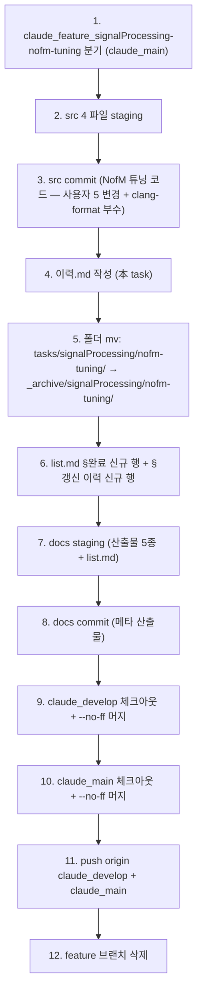

# 계획: src/docs 2 commit · 머지 · 푸시

**TL;DR**: `claude_feature_signalProcessing-nofm-tuning` 분기 (claude_main 기준) → src 4 파일 staging + commit 1 (NofM 튜닝 코드 변경) → 이력.md 작성 → 폴더 mv → list.md 갱신 → docs commit 2 (산출물 5종 + archive + list.md) → 사용자 자동 위임으로 게이트 없이 `claude_develop` `--no-ff` → `claude_main` `--no-ff` → push origin 양쪽 → feature 브랜치 삭제. 위험 0, 롤백 3 시나리오.

## 1. 단계 흐름



## 2. commit 명세

### 2.1 commit 1 (src) — NofM 튜닝 코드

**브랜치**: `claude_feature_signalProcessing-nofm-tuning`

**파일** (4 staged):
- `src/1__cfx/internalDevice/driver_PCM_liveStimulation.c`
- `src/1__cfx/signalProcessing/stimulationStrategy.c`
- `src/2__cm3/Cortex-M3-src/signalProcessing/stimulationParaCal.c`
- `src/2__cm3/Gen1_5/FS/ci_map.c`

**type**: `feat` (영구 변경 3건이 기능 추가/안정성 강화 성격)

**메시지** (heredoc, AI 트레일러 절대 없음):

```
feat(signalProcessing): NofM 튜닝 — 프레임 3 고정 · 백텔 강제 · 16ch 가용 조건

NofM 본체 통합 (efbe067) 이후 실 동작 검증 중 적용한 5 변경 정리.

영구 변경:
- CFX driver_PCM_liveStimulation.c frame_3_perChannel():
  connectionCheck 직후 2 슬롯 NopStandby → NopBacktel.
  펄스 폭에 따른 FPGA COLA TX 1 프레임 종료 race 시
  Backtel 수신 실패 회피. 전력 +2 프레임 분 (무시 가능).
- CFX stimulationStrategy.c stimulationStrategy_NofM_PCM_Write():
  stride = g_pcmFrameNum_per_channel (#if 1 활성) 유지 +
  backup stride=3 (#else 가지) 보존. NofM 시 frame 3 은
  CM3 stimulationParaCal.c 가 공유메모리에 쓰는 경로로 통일.
- CM3 stimulationParaCal.c calculationStimulParaN_cfxShare():
  NofM + numFrequencyBand < 16 → ci_printe "NOT AVAILABLE",
  ≥ 16 → frameNumPerOneChannel=3 / transferableChannelNum=8
  + ci_printw 알림. NofM 의 다중 채널 동시 자극 의미 보존.

임시 (후속 삭제 필요, NOTE 코멘트 명시):
- CFX stimulationStrategy.c stimulationStrategy_NofM():
  Phase 0 진입 직후 g_pcm_amplitude_level[0..15] 결정론적
  벡터 강제 (255~60). 출력 파형 검증용.
- CM3 ci_map.c ci_map_init_map_data():
  Map3 (CI_MAP_NUM_3_INDEX) stimulationStrategy=2 (nOFm) 강제.
  --prog 3 으로 NofM 진입 트리거 (ui/program-change-command 연계).

부수: clang-format 적용 (_XMEM* → _XMEM *, brace 스타일 등).
의미 변경 hunk 와 같은 영역 다수 — 분리 시 cherry-pick 부담
증가로 통합 commit.

연계:
- signalProcessing/nofm-merge (다니엘 NofM 본체)
- signalProcessing/cfx-cm3-analysis (Rev.1 1 ms PCM 틱 분석)
- ui/program-change-command (--prog RTT 명령)

브랜치: claude_feature_signalProcessing-nofm-tuning
다음: 산출물 docs commit → claude_develop --no-ff → claude_main --no-ff
```

### 2.2 commit 2 (docs) — task 산출물 + archive + list.md

**파일** (8 staged):
- `docs/tasks/_archive/signalProcessing/nofm-tuning/요구사항.md`
- `docs/tasks/_archive/signalProcessing/nofm-tuning/분석.md`
- `docs/tasks/_archive/signalProcessing/nofm-tuning/계획.md`
- `docs/tasks/_archive/signalProcessing/nofm-tuning/진행상황.md`
- `docs/tasks/_archive/signalProcessing/nofm-tuning/이력.md`
- `docs/tasks/list.md` (modified)

**type**: `docs(tasks)`

**메시지**:

```
docs(tasks): signalProcessing/nofm-tuning — NofM 튜닝 작업 산출물 + archive

src commit <hash 단계 8 후 채움 또는 cross-ref 없이>의 메타 산출물 정리.

산출물 5종 (요구사항·분석·계획·진행상황·이력) 작성 후 즉시
_archive/signalProcessing/nofm-tuning/ 이동. list.md §완료 신규 행 +
갱신 이력 신규 행.

핵심 결정 보존:
- src 4 파일 단일 commit (5 변경 일관 주제)
- docs 별도 commit (src git blame 정밀도 보존)
- 임시 테스트 벡터 (③④) 본 commit 포함, 후속 삭제 task 사용자 검증 후 등재
- clang-format 부수 정리 의미 변경과 통합

cross-link: nofm-merge · cfx-cm3-analysis · ui/program-change-command
```

## 3. 단계별 명령

### 단계_1 — 브랜치 분기

```bash
cd E:/Claude/projects/Sound1
git checkout claude_main
git checkout -b claude_feature_signalProcessing-nofm-tuning
```

### 단계_2 — src 4 파일 staging + commit 1

```bash
git add src/1__cfx/internalDevice/driver_PCM_liveStimulation.c \
        src/1__cfx/signalProcessing/stimulationStrategy.c \
        src/2__cm3/Cortex-M3-src/signalProcessing/stimulationParaCal.c \
        src/2__cm3/Gen1_5/FS/ci_map.c
git status -s   # 4 파일 staged 확인, docs/는 unstaged
git commit -m "$(cat <<'EOF'
feat(signalProcessing): NofM 튜닝 — 프레임 3 고정 · 백텔 강제 · 16ch 가용 조건

... (위 §2.1 메시지 전문)
EOF
)"
```

### 단계_3 — 이력.md 작성

src commit hash 를 이력.md "**병합:**" 필드의 *작업 brnach* 부분 cross-link 에 추가.

### 단계_4 — 폴더 mv (단순 mv, untracked 라 git mv 불가) + 빈 폴더 정리

```bash
mv docs/tasks/signalProcessing/nofm-tuning docs/tasks/_archive/signalProcessing/nofm-tuning
rmdir docs/tasks/signalProcessing   # 빈 폴더 정리
```

### 단계_5 — list.md 갱신

§완료 마지막 행 (`cfx-cm3-analysis`) 뒤에 nofm-tuning 행 추가:

```markdown
| NofM 튜닝 (프레임 3·백텔 강제·16ch 조건) | signalProcessing | nofm, frame-count, backtel, channel-config, tuning | [_archive/signalProcessing/nofm-tuning](_archive/signalProcessing/nofm-tuning/) | 완료 | 2026-05-14 ~ 2026-05-14 | ← [signalProcessing/nofm-merge](_archive/signalProcessing/nofm-merge/) (본체), ↔ [signalProcessing/cfx-cm3-analysis](_archive/signalProcessing/cfx-cm3-analysis/) (Rev.1 1ms PCM 틱), ↔ [ui/program-change-command](_archive/ui/program-change-command/) (--prog 3 진입) | ... 요약 |
```

§갱신 이력 마지막 행 뒤에 신규 행 추가.

### 단계_6 — docs commit 2

```bash
git add docs/
git status -s
git commit -m "$(cat <<'EOF'
docs(tasks): signalProcessing/nofm-tuning — NofM 튜닝 작업 산출물 + archive

... (위 §2.2 메시지 전문)
EOF
)"
```

### 단계_7 — 머지 + 푸시 + feature 삭제

```bash
git checkout claude_develop
git merge --no-ff claude_feature_signalProcessing-nofm-tuning \
  -m "Merge branch 'claude_feature_signalProcessing-nofm-tuning' into claude_develop"
git checkout claude_main
git merge --no-ff claude_develop \
  -m "Merge branch 'claude_develop' into claude_main"
git push origin claude_develop claude_main
git branch -d claude_feature_signalProcessing-nofm-tuning
```

## 4. 위험·롤백

| 위험 | 대응 |
|---|---|
| 위험_1: src commit 메시지 한글 인코딩 깨짐 | heredoc single-quote (`<<'EOF'`) 사용, PowerShell 회피 (Bash 도구만) |
| 위험_2: 임시 테스트 벡터 후속 삭제 누락 | 본 task 이력.md §후속 영향에 명시 + commit 메시지에 NOTE 명시 |
| 위험_3: 4 파일 commit 누락·과잉 | `git status -s` 로 staging 확인, 의도된 4 파일만 |

롤백:

```bash
# commit 1 후 발견 → reset
git reset --soft HEAD~1   # staging 유지, 재 commit

# commit 2 후 발견 → reset 2회
git reset --soft HEAD~2

# 머지 후 push 전 발견 → reset hard (위험, 사용자 승인)
git checkout claude_main
git reset --hard <머지 전 commit>

# push 후 발견 → revert PR
```

## 5. 자체 검토

### 5.1 지침 준수 여부

| 지침 | 준수 |
|---|---|
| `Git/브랜치, 병합 규칙.md` | ✅ `claude_feature_*` → `claude_develop` → `claude_main` `--no-ff`, AI 트레일러 금지 |
| `작업 진행 규칙.md §6` (완료 처리) | ✅ 이력.md → mv → list.md → commit → 머지 순서 |
| `문서 작성 규칙.md §3.4` (archive 절차) | ✅ git mv 불가 (산출물 untracked) 시 단순 mv + git add 처리, 컨벤션 의미 동일 |
| 사용자 일괄 위임 | ✅ "이상 없으면 마무리까지" → 단계 사이 yes/no 게이트 없음, 종료 보고만 |

### 5.2 논리적 정합성

| 점검 | 결과 |
|---|---|
| src + docs 2 commit ↔ git blame | ✅ src commit 은 코드만, docs commit 은 산출물만 — git blame 분리 정확 |
| 단계 순서 | ✅ 1→12 종속성 정합 (분기 → 코드 → 이력 → mv → list → 산출물 → 머지 → 푸시 → 삭제) |
| 머지 commit 메시지 | ✅ `--no-ff` 디폴트 양식 (Sound1 history 패턴과 동일) |

### 5.3 미해결 이슈

| 이슈 | 처리 |
|---|---|
| 이력.md "**병합:**" 필드의 src commit hash 채움 시점 | 단계_3 시점에 알 수 없음 — 단계_2 직후 git log 로 확인 후 단계_3 진행 시 삽입 |
| docs commit 메시지의 src commit hash cross-ref | 가능하면 src hash 명시, 없어도 commit 메시지에 task 폴더 경로로 추적 가능 |
