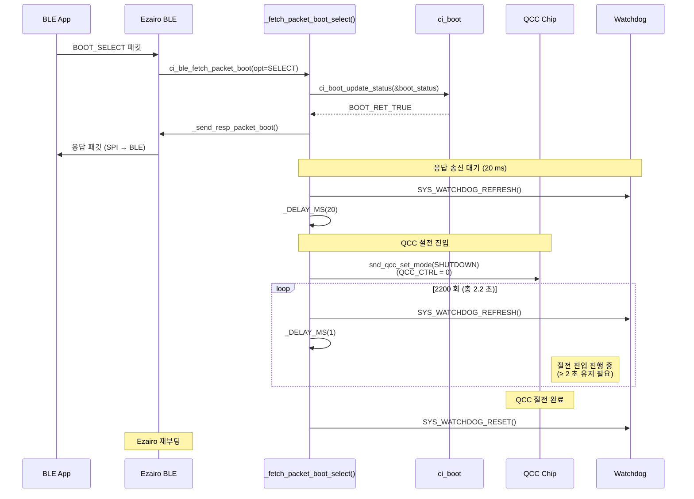

# QCC OTA 후 셧다운 진입 딜레이 — 분석 (Rev.0)

**TL;DR**: `ci_ble_control_boot.c` 의 `_fetch_packet_boot_select()` 함수 +15/-15 변경. **OTA DFU 후 부팅 슬롯 선택 패킷 응답 송신 → 20 ms 대기 → QCC 를 SHUTDOWN 모드로 진입 (`snd_qcc_set_mode(SND_QCC_MODE_SHUTDOWN)`) → 2.2 초 대기 (워치독 리프레시) → Ezairo 재부팅 (`SYS_WATCHDOG_RESET()`)** 시퀀스 삽입. 사용자(다) 명시 의도 = "OTA DFU 펌웨어 업데이트 후 Ezairo 재부팅 전에 QCC 를 절전 모드로 진입 시킨 후 재부팅". 변경 전에는 응답 송신 후 1 초 (100×10ms) 대기만 하고 재부팅 — QCC 절전 진입 명령 없음. QCC 사양 = "2 초 이상 QCC_CTRL 을 0 으로 유지해야 QCC 가 꺼진다" (코드 주석).

## 1. 변경 위치 및 함수 컨텍스트

- **파일**: `src/2__cm3/Cortex-M3-src/BleCommunication/ci_ble_control_boot.c`
- **함수**: `_fetch_packet_boot_select()` — OTA DFU 흐름에서 BLE 로 수신한 부팅 슬롯 선택 패킷을 처리하는 함수. 호출 경로:
  - BLE 패킷 수신 → `ci_ble_fetch_packet_boot()` → opt 분기 → `_fetch_packet_boot_select()`.
  - 본 함수는 boot status 갱신 + 응답 패킷 송신 + 일정 대기 후 재부팅 트리거.

## 2. 변경 hunk 정확 인용

### 2.1 신규 include (L10)

```c
#include <ci_ble_control_boot.h>
#include <ci_boot.h>
#include <driver_SPI.h>
#include <error.h>
#include <ci_filesystem.h>
+ #include <snd_qcc.h>
```

QCC 칩 제어 API 헤더. `snd_qcc_set_mode()` / `SND_QCC_MODE_SHUTDOWN` 매크로 정의 포함.

### 2.2 핵심 시퀀스 변경 (L110-128 부근)

**변경 전**:
```c
_send_resp_packet_boot(resp_packet, RESP_PKT_SIZE_BOOT_SELECT);

// 선택한 슬록으로 일정 시간 후 재부팅 시작
for (volatile int i = 0; i < 100; i++)
{
    SYS_WATCHDOG_REFRESH();
    _DELAY_MS(10);
}
SYS_WATCHDOG_RESET();
```

**변경 후**:
```c
_send_resp_packet_boot(resp_packet, RESP_PKT_SIZE_BOOT_SELECT);

/* 응답 패킷 송신 까지 일정 시간 딜레이  */
SYS_WATCHDOG_REFRESH();
_DELAY_MS(20);

/* 2초 이상 QCC_CTRL을 0으로 유지해야 QCC가 꺼진다. */
snd_qcc_set_mode(SND_QCC_MODE_SHUTDOWN);

for (volatile int i = 0; i < 2200; i++)
{
    SYS_WATCHDOG_REFRESH();
    _DELAY_MS(1);
}

// 선택한 슬롯으로 일정 시간 후 재부팅 시작
SYS_WATCHDOG_RESET();
```

### 2.3 차이 정리

| 단계 | 변경 전 | 변경 후 |
|---|---|---|
| 응답 송신 후 첫 대기 | 없음 | 20 ms (워치독 리프레시 1 회) |
| QCC 절전 진입 명령 | 없음 | `snd_qcc_set_mode(SND_QCC_MODE_SHUTDOWN)` |
| 주 대기 루프 | `100 × _DELAY_MS(10)` = 1 초 | `2200 × _DELAY_MS(1)` = 2.2 초 |
| 워치독 리프레시 주기 | 10 ms | 1 ms |
| 재부팅 트리거 | `SYS_WATCHDOG_RESET()` | `SYS_WATCHDOG_RESET()` (동일) |
| 부수 (오타) | `슬록` | `슬롯` |

## 3. 의도 분석

### 3.1 사용자(다) 명시 의도

> "ble의 OTA DFU 기능으로 펌웨어 업데이트 후 Ezairo를 재부팅 하기 전에 QCC를 절전 모드로 진입 시킨 후 재부팅하기 위한 내용이야."

### 3.2 시퀀스 의도

OTA DFU 후 재부팅 흐름이 변경 전에는 단순 1 초 대기 → 재부팅으로, **QCC 칩의 상태가 명시적으로 관리되지 않음**. QCC 는 Ezairo(CFX) 재부팅 시점에 능동 상태 (BLE 통신 + 오디오 활성) 였을 가능성. 재부팅 직후 QCC 와 Ezairo 간 통신 race condition 또는 전력 비효율 가능.

변경 후 시퀀스는 명시적으로:
1. **응답 송신 완료 대기 (20 ms)** — BLE 패킷이 hardware 까지 송신 완료 시간 확보. 재부팅 전 마지막 응답 손실 방지.
2. **QCC SHUTDOWN 모드 명령** — `snd_qcc_set_mode(SND_QCC_MODE_SHUTDOWN)` 호출. 코드 주석에 따르면 QCC_CTRL 핀을 0 으로 유지하는 동작. QCC 칩 사양상 2 초 이상 유지해야 꺼짐.
3. **2.2 초 대기** — QCC 가 안정적으로 절전 진입할 시간. 2 초 사양 + 0.2 초 여유분.
4. **워치독 리프레시 주기 1 ms** — 2.2 초 동안 워치독 timeout 회피. 1 ms 주기는 매우 짧지만 안전 우선.
5. **Ezairo 재부팅** — `SYS_WATCHDOG_RESET()` 으로 즉시 재부팅. 이 시점에 QCC 는 이미 절전 상태.

### 3.3 효과

- **QCC 절전 상태에서 Ezairo 재시작** — 재부팅 후 QCC 가 비활성 → 전력 절약 + 재부팅 초기화 시퀀스에서 QCC 와의 race condition 회피.
- **재부팅 시점의 전력 안정성** — QCC 가 미리 꺼져 있으면 Ezairo 재시작 순간의 전압 변동·전류 스파이크 감소.
- **OTA DFU 완료 응답 신뢰성** — 20 ms 응답 송신 대기로 BLE 측 (페어링된 모바일 앱 등) 이 완료 응답을 받을 시간 확보.

## 4. 시퀀스 다이어그램 (변경 후)



## 5. 부수 변경

- 주석 오타 수정: `// 선택한 슬록으로 일정 시간 후 재부팅 시작` → `// 선택한 슬롯으로 일정 시간 후 재부팅 시작`
- 신규 주석: `/* 응답 패킷 송신 까지 일정 시간 딜레이  */` + `/* 2초 이상 QCC_CTRL을 0으로 유지해야 QCC가 꺼진다. */`

## 6. 관련 작업·인접 흐름

- [`signalProcessing/20260514_nofm-merge`](../../signalProcessing/20260514_nofm-merge/) — 본 task 분리 출처 (NofM 분석 §6.1).
- [`bootloader/20260507_service-rtt-debug-console`](../../bootloader/20260507_service-rtt-debug-console/) — 부트로더 측 OTA DFU 흐름 (`bootloader_boot()` storage init + slot 적재).
- [`LED/20260508_ota-dfu-fw-variant`](../../LED/20260508_ota-dfu-fw-variant/) — OTA fw variant 분기 (APP / FACTORY_RESET 슬롯).
- [`Sullivan1.5 rel.2 sync`](../../sync/20260514_sullivan1.5-rel2/) 의 [`첨부_분석_BleCommunication.md`](../../sync/20260514_sullivan1.5-rel2/첨부_분석_BleCommunication.md) §4 (Sound1 후속 작업 인벤토리) — QCC SHUTDOWN 시퀀스 변경이 Sound1 측 추가분으로 명시되어 있음 (Sullivan 베이스 ↔ Sound1 비교 시 발견).

## 7. 결론·후속

### 7.1 결론

- 변경의 본질 = OTA DFU 후 재부팅 시퀀스에 **QCC 절전 진입 단계 명시적 삽입**. 사용자(다) 명시 의도와 정확히 부합.
- 코드 변경 사이즈 작음 (+15/-15) 이지만 시스템 동작 영향 명확 (재부팅 시 QCC 상태 명시적 제어).
- QCC 사양 (2 초 이상 QCC_CTRL = 0 유지) 명시적 반영 (2.2 초 대기로 여유분 확보).

### 7.2 검증 (사용자 본인 작업으로 완료)

- 빌드 통과 (NofM 코드와 함께 사용자 직접 병합 시 빌드 OK 확인).
- 실기 OTA DFU 검증은 사용자 본인 진행 가능 — 본 task 외.

### 7.3 후속 권고 없음

본 변경은 단일 함수 시퀀스 정정. 추가 후속 task 도출 없음.

## 8. 갱신 이력

| 날짜 | 변경 |
|---|---|
| 2026-05-14 | Rev.0 작성. `_fetch_packet_boot_select()` 함수 +15/-15 변경 hunk 인용 + 사용자(다) 명시 의도 ("OTA DFU 후 Ezairo 재부팅 전 QCC 절전 진입") 반영 + 시퀀스 다이어그램 (Mermaid). 코드 주석 ("2초 이상 QCC_CTRL을 0으로 유지해야 QCC가 꺼진다") 인용. |


## 1. 현 상태 (Current State)

해당 없음

## 2. 영향 범위

해당 없음

## 3. 가설·선택지

해당 없음

## 4. 핵심 결정

해당 없음

## 5. 위험·제약

해당 없음

## 6. 관련 산출물

해당 없음

## 자체 검토

### 지침 준수 여부
| 지침 | 준수 |
|---|---|
| [`작업 진행 규칙.md`](../../../../../../docs/지침/일반/작업%20진행%20규칙.md) | 완료 |
| [`문서 작성 규칙.md`](../../../../../../docs/지침/일반/문서%20작성%20규칙.md) | 완료 |

### 논리적 정합성
| 점검 | 결과 |
|---|---|
| 본문 기존 내용 보존 (양식 정합화 시 무손실) | 완료 |
| frontmatter·TL;DR 기준 충족 | 완료 |
| 관련 산출물(요구사항·분석·계획·이력) 상호 일관 | 완료 |

### 미해결 이슈
| 이슈 | 처리 |
|---|---|
| 해당 없음 | — |
