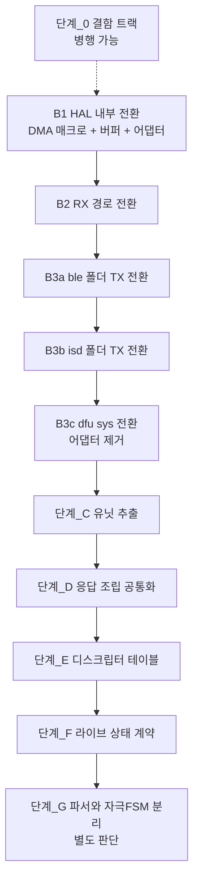
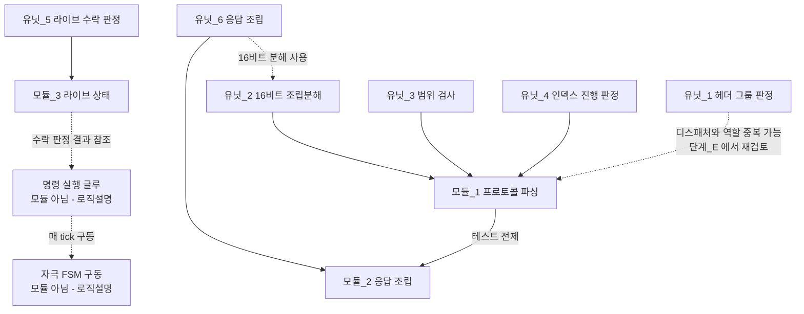

# ⑤ 구현 계획안

**TL;DR**: 선행 로드맵(6단계)에 8비트 전환을 앞단으로 삽입해 **7단계 통합 로드맵**으로 재편했다. 순서는 **실측 게이트 -> 8비트 전환(원자적) -> 유닛 추출 -> 응답 공통화 -> 디스크립터 테이블 -> 라이브 상태 계약 -> (별도 판단) FSM 분리**. 각 단계에 유닛/모듈 검증 라벨과 테스트 순서를 붙였고, **명령 추가 비용이 8파일에서 테이블 2행 + 핸들러 1개로 줄어드는 것**이 최종 목표다.

> [!IMPORTANT]
> **이번 작업의 산출은 이 계획서까지이며 코드는 변경하지 않는다.** 은수님 요청("분석해줄래", "계획안을 줘봐")에 따른다.

---

## 1. 통합 로드맵

> [!NOTE]
> **최초 계획의 단계_A(실측 게이트)는 삭제됐다.** 그 근거였던 미확인 2건(니블 재배치·정렬)이 2026-07-27 은수님 지적을 계기로 한 원문 재검증에서 **둘 다 해소**됐기 때문이다(③ 분석 §2.3). 별도 시험 빌드 없이 **B1 구현 후 실측 로그 7종 대조**로 검증한다.

| 단계 | 내용 | 위험 | 선행 조건 | 파일 수 |
|---|---|---|---|---|
| 단계_0 | 결함 트랙 (선행 작업에서 정의) | 낮~중 | 없음. 병행 가능 | - |
| **B1** | **DMA 매크로 2곳 + HAL 버퍼 3개 + 변환 어댑터.** 외부 API 는 `int*` 유지 | **중** | 없음 | 2 |
| **B2** | RX 경로 `uint8_t*` 전환 | 낮음 | B1 | 2 |
| **B3a** | `ble/` TX 전환 | 중 | B1 | 5 |
| **B3b** | `isd/` TX 전환 (`map_data` 10곳 포함) | 중 | B1 | 6 |
| **B3c** | `dfu/`·`sys/` 전환 + **어댑터 제거** | 중 | B3a·B3b | 3 |
| 단계_C | 유닛 추출 | 중 | B3c | - |
| 단계_D | 응답 조립 공통화 | 낮음 | 단계_C | - |
| 단계_E | 디스크립터 테이블 | 중 | 단계_C · `tests/` 인프라 | - |
| 단계_F | 라이브 상태 계약 명시 | 중 | 단계_E | - |
| 단계_G | 파서와 자극 FSM 분리 | **높음** | 별도 판단 | - |

> [!IMPORTANT]
> **B1 만으로 동작이 완결된다.** B2 이후는 타입 정합을 위한 정리이므로 중간에 멈춰도 제품은 정상 동작한다. 각 단계가 독립적으로 빌드·검증 가능하다.

---

## 2. 사전 확인 사항 (실측 게이트 대체)

별도 실측 단계는 폐지했으나, 아래 2건은 **구현 중 반영**한다.

| # | 항목 | 조치 |
|---|---|---|
| 사전_1 | 정렬 논쟁 (p.697 vs p.700) | 버퍼 선언에 **`__attribute__((aligned(4)))`** 를 붙여 우회. 어느 쪽이 맞든 안전 |
| 사전_2 | ROM 여유 | 단계_E 착수 전 맵 파일 확인 (B1~B3 는 ROM 이 오히려 줄어든다 - 버퍼 84바이트 -> 21바이트) |

---

## 3. 단계_B - 8비트 전환 (원자적)

> [!CAUTION]
> **DMA 설정과 버퍼 타입은 반드시 같은 커밋에서 함께 바꾼다.**
>
> - 버퍼만 바꾸면: 21바이트 버퍼에 **84바이트가 쓰여 메모리 오버런**
> - DMA 만 바꾸면: `int[21]` 의 앞 21바이트만 채워지고 나머지 63바이트는 쓰레기

### 3.1 변경 지점

| # | 파일 | 변경 |
|---|---|---|
| 변경_1 | `hal/tdc_hal_dma.h:7` | `WORD_SIZE_32BITS_TO_32BITS` -> `WORD_SIZE_8BITS_TO_8BITS` (DMA0 RX) |
| 변경_2 | `hal/tdc_hal_dma.h:13` | 동 (DMA1 TX) |
| 변경_3 | `hal/tdc_hal_spi.c:20-22` | `int SPI_Rx_Buffer[21]`·`SPI_Tx_Buffer[21]`·`Rx_DataPacket[20]` -> `uint8_t` |
| 변경_4 | `hal/tdc_hal_spi.h`·`.c` | `int *tdc_hal_spi_get_rx_packet_addr(void)` -> `uint8_t *` |
| 변경_5 | `hal/tdc_hal_spi.h`·`.c` | `tdc_hal_spi_write_tx_buffer(int *source, int dataSize)` -> `uint8_t *source` |

**`transferLength`(21)·주소 증가 설정(`INCR_1`)·SPI 설정은 손대지 않는다.**

### 3.2 전환 전 재확인 (④ 검증 보완_4)

착수 직전에 **"16비트 값을 쪼개지 않고 그대로 대입하는 곳이 정말 0건인가"** 를 재확인한다. 이 주장은 단일 노드 집계이며, 틀리면 **자극 파라미터의 상위 바이트가 조용히 잘린다.**

확인 방법: `write_tx_buffer` 에 넘기는 버퍼에 대입하는 모든 지점에서 우변이 255 를 넘을 수 있는지 검사.

### 3.3 전환 순서 (단계적)

원자적이라 함은 **DMA 설정과 HAL 버퍼**를 함께 바꾼다는 뜻이지, 57개 호출부를 한 번에 고친다는 뜻이 아니다.

| 순서 | 내용 | 규모 |
|---|---|---|
| 순서_1 | DMA 매크로 2곳 + HAL 내부 버퍼 타입 변경. **외부 API 는 어댑터로 `int*` 를 계속 노출** | 소 |

> [!CAUTION]
> **순서_1 의 어댑터는 단순 캐스팅이 아니라 "변환 복사"여야 한다.** 내부 버퍼가 `uint8_t[21]`(21바이트)인데 이를 `int*` 로 캐스팅해 넘기면 호출자가 4바이트씩 읽어 **즉시 깨진다.** 어댑터는 `uint8_t` 버퍼를 임시 `int` 배열로 **원소별 복사**해 넘겨야 한다. 순서_3 에서 어댑터를 제거하면 이 복사도 사라진다.
| 순서_2 | RX 경로 6개 시그니처를 `uint8_t*` 로 전환 (호출부 1곳) | 소 |
| 순서_3 | TX 경로 57개 호출부를 일괄 전환하고 어댑터 제거 | 대 |

순서_1 만으로도 **동작은 완결**된다. 순서_2·3 은 타입 정합을 위한 정리다.

### 3.4 검증

| # | 방법 |
|---|---|
| 검증_1 | 실측 로그 7종 전 시나리오 재현. **수신 패킷 바이트열과 응답 바이트열이 완전 일치** |
| 검증_2 | `[SPI RX]`/`[SPI TX]` 디버그 로그 출력이 기존과 동일한지 (단 RX `[20]` 은 §3.5 참조) |
| 검증_3 | 부수 효과 확인 - `char` 부호 확장 2곳이 해소되어 TX 로그의 `FFFFFFxx` 표기가 사라져야 한다 |

### 3.5 부수 정리

이 단계에서 함께 처리하면 좋은 것:

- **선행 작업 결함_3**: RX 로그가 20원소 배열의 `[20]` 을 읽는 범위 초과 접근. 버퍼 타입을 바꾸는 김에 제거
- **선행 작업 결함_13**: TX 로그 `FFFFFFxx` - 8비트 전환으로 자동 해소
- **판단 필요 3건**: 외부 함수 반환형 2곳 · 볼륨 상한 2곳 · `main.c` 타입 불일치 1곳

---

## 4. 단계_C - 유닛 추출

### 4.1 유닛 정의 (검증 라벨 포함)

| 유닛 | 입력 -> 출력 | 순수성 | 검증 라벨 |
|---|---|---|---|
| 유닛_1 `tdc_ble_group_of_header` | 헤더 바이트 -> 그룹 | 순수 | **[유닛테스트]** |
| 유닛_2 `tdc_ble_u16_join` / `_split` | 상위·하위 바이트 <-> 정수 | 순수 | **[유닛테스트]** |
| 유닛_3 `tdc_ble_range_check` | 값·최소·최대 -> 유효/무효 | 순수 | **[유닛테스트]** |
| 유닛_4 `tdc_ble_index_progress` | 수신 인덱스·기대 인덱스 -> 진행/완결/오류 | 순수 | **[유닛테스트]** |
| 유닛_5 `tdc_ble_live_accept` | 현재 서브상태·요청 서브커맨드 -> 수락/거부 | 순수 | **[유닛테스트]** |
| 유닛_6 `tdc_ble_reply_build` | 헤더·필드열 -> 응답 바이트열 | 순수 | **[유닛테스트]** |

> [!NOTE]
> **④ 검증 보완_2**: 유닛_1(헤더 그룹 판정)은 단계_E 의 핸들러 등록 테이블과 역할이 겹칠 수 있다. 단계_E 착수 시 **통합 여부를 재검토**하고, 중복이면 유닛_1 을 흡수한다.

### 4.2 모듈 정의

| 모듈 | 소속 유닛 | 통합 테스트 정의 | 검증 라벨 |
|---|---|---|---|
| 모듈_1 프로토콜 파싱 | 유닛_2 · 유닛_3 · 유닛_4 | 세 유닛을 함께 활성화한 상태에서 각 유닛이 단독 시험 때와 동일하게 동작 | **[통합테스트]** |
| 모듈_2 응답 조립 | 유닛_6 | 전 명령의 응답 바이트열이 로그 7종과 일치 | **[통합테스트]** |
| 모듈_3 라이브 상태 | 유닛_5 | 서브커맨드 전 조합에서 수락/거부 판정이 사양과 일치 | **[통합테스트]** |

**모듈화하지 않는 것**: 명령 실행 글루 · 자극 FSM 구동 · SPI 레지스터 접근. 순수 로직이 아니라 유닛이 될 수 없고, 감싸면 과도 추상화다. **[로직설명]** 으로 갈음한다.

### 4.2.1 의존성 그래프

실선 화살표는 구성 관계와 테스트 전제, 점선은 의존이다.

### 4.3 테스트 순서

밸리데이션 계층화 §3 "A는 B 통과 전제" 형식.

| 순서 | 대상 | 전제 |
|---|---|---|
| 1 | 유닛_2 (16비트 조립/분해) | 없음 |
| 2 | 유닛_3 (범위 검사) | 없음 |
| 3 | 유닛_4 (인덱스 진행) | 없음 |
| 4 | 유닛_1 (그룹 판정) | 없음 |
| 5 | 유닛_5 (라이브 수락) | 없음 |
| 6 | 유닛_6 (응답 조립) | 유닛_2 통과 전제 |
| 7 | 모듈_1 통합 | 유닛_2·3·4 통과 전제 |
| 8 | 모듈_2 통합 | 유닛_6 통과 전제 |
| 9 | 모듈_3 통합 | 유닛_5 통과 전제 |
| 10 | 시스템 (로그 7종 재현) | 모듈_1·2·3 통과 전제 |

### 4.4 온타깃 테스트 실현

밸리데이션 계층화 §5 를 따른다.

- **테스트 코드를 미리 삽입하지 않는다.** "테스트 가능한 구조"만 만든다
- 검증이 필요할 때 유닛 함수 진입부에 **테스트 벡터를 하드코딩**해 실기에서 자극-응답 확인
- 단순한 유닛(유닛_2 같은)은 **[로직설명]** 으로 갈음 가능

---

## 5. 단계_D - 응답 조립 공통화

`tdc_ble_general_debug.c` 의 검증된 패턴("패킷 포인터 주입 + `tx_index` 반환")을 승격한다. 에러 응답은 이미 `tdc_sys_error_send_to_app()` 로 공통화돼 있으므로 그것과 정합시킨다.

**검증**: 응답 바이트열이 로그 7종과 완전 일치.

---

## 6. 단계_E - 디스크립터 테이블

### 6.1 구조

명령 x 서브커맨드 x 데이터 인덱스 조합의 필드 레이아웃을 데이터로 선언하고, 파싱은 테이블을 순회하는 단일 루프가 담당한다.

**0x66 서브커맨드 1 실증**: 약 400줄 파싱 코드 -> **필드 23행 + 인덱스 15행**.

### 6.2 절제 원칙 (반드시 지킬 것)

| # | 원칙 |
|---|---|
| 절제_1 | **정적 범위가 아닌 것은 테이블에 넣지 않는다.** 상태 게이팅 서브커맨드(3·4·5), 런타임 의존 최대값은 훅 함수로 분리 |
| 절제_2 | **희소 배열 금지.** 그룹별 밀집 배열 + `enum - group_base` 인덱싱. 진짜 예외(0x91)만 명시 분기 |
| 절제_3 | **테이블이 안 맞는 명령은 손코딩으로 남긴다.** 하이브리드가 정답 |

### 6.3 선행 조건

| # | 조건 |
|---|---|
| 조건_1 | 단계_C 완료 (유닛이 있어야 테이블 파서가 그것을 호출한다) |
| 조건_2 | **`tests/` 인프라.** 명령 x 인덱스 전 조합의 파싱 결과를 기존 코드와 비교하는 오프라인 테스트가 필요하다. 현재 `tests/` 는 사실상 비어 있다 |
| 조건_3 | **ROM 여유 확인** (단계_A 측정_3). 약 2~2.5KB 증가 추정 |

### 6.4 검증

`.elf` 바이트 동일이 성립하지 않는다. 동작 등가는 테스트로만 보증된다.

1. 명령 x 인덱스 전 조합의 파싱 결과를 기존 코드와 바이트 비교
2. 로그 7종의 실제 패킷을 입력으로 넣어 결과 구조체 비교
3. 실기 게이트

---

## 7. 단계_F·G

| 단계 | 내용 | 비고 |
|---|---|---|
| 단계_F | 라이브 상태 층간 계약을 코드로 승격. 유닛_5 + 모듈_3 이 기반 | 선행 작업 단계_4 와 동일 |
| 단계_G | 파서와 자극 FSM 분리 | **고위험. 현상 유지(문서화만)도 유효한 선택지** |

---

## 8. 목표 - 명령 추가 비용

### 8.1 개선 전 (실측)

0x8C 게인 제어 추가 시 **커밋 2개, 8파일, 약 220줄**. 순수 프로토콜 배선만 **4파일**(열거형 · 디스패처 if-else · 리모콘 case · 신규 핸들러 파일).

### 8.2 개선 후 (목표)

| 작업 | 손댈 곳 |
|---|---|
| 명령 코드 선언 | `tdc_ble_protocol.h` 열거형 **1행** |
| 필드 레이아웃 선언 | 디스크립터 테이블 **N행** (필드 수만큼) |
| 핸들러 등록 | 그룹 테이블 **1행** |
| 실행 로직 | 신규 핸들러 함수 **1개** |

**디스패처 if-else 체인·범위 검사 코드·응답 조립 코드를 손댈 필요가 없어진다.**

### 8.3 기존 프로토콜 수정

| 수정 유형 | 손댈 곳 |
|---|---|
| 필드 범위 변경 | 디스크립터 테이블의 min/max **1행** |
| 필드 위치·폭 변경 | 디스크립터 테이블 **1행** |
| 데이터 인덱스 추가 | 인덱스 테이블 **1행** + 필드 행 추가 |

---

## 9. 위험과 완화

| # | 위험 | 완화 |
|---|---|---|
| 위험_1 | 니블 재배치가 발동해 8비트 전환 자체가 무산 | 단계_A 실측이 게이트. 무산 시 대안(8->32 유지 + 접근 매크로 개선) 검토 |
| 위험_2 | 16비트 미분할 대입이 실제로 존재해 상위 바이트 유실 | 단계_B 착수 직전 재확인 (§3.2) |
| 위험_3 | 테이블 주도로 흐름 추적이 어려워짐 | 테이블을 프로토콜 문서와 1:1 대응. 엔트리 주석에 데이터 인덱스 명시 |
| 위험_4 | 유닛 과다 분해 | 6개로 이미 절제. 단계_E 에서 유닛_1 흡수 여부 재검토 |
| 위험_5 | ROM 부족 | 단계_A 측정_3 에서 사전 확인 |
| 위험_6 | 57개 TX 호출부 일괄 수정 중 누락 | 어댑터를 마지막에 제거해 컴파일러가 타입 불일치를 잡게 한다 |

---

## 10. 이번 작업에서 하지 않는 것

| # | 항목 | 사유 |
|---|---|---|
| 제외_1 | 코드 변경 일체 | 은수님 요청 범위 (분석·계획까지) |
| 제외_2 | 실측 수행 | 실기 환경 필요 (은수님 게이트) |
| 제외_3 | `tests/` 인프라 구축 | 단계_E 선행 조건이나 이번 범위 밖 |
| 제외_4 | 프로토콜 규약 변경 | 앱·리모콘 공유 |
