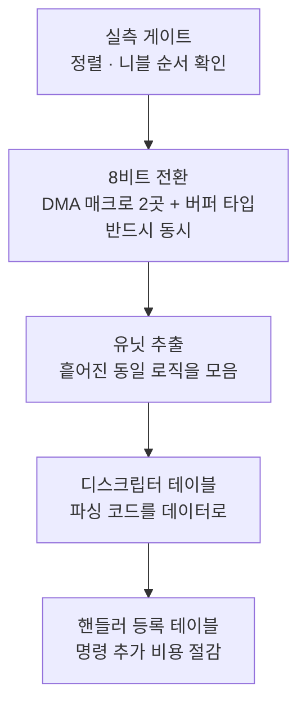

# ③ 분석 - 8비트 전환 및 구조 재설계

**TL;DR**: 8비트 전환은 **가능**하다. 결정적 답 - **`transferLength` 는 워드 수라 값 21 을 그대로 두면 되고, 주소 증가는 워드 크기 단위라 설정 변경 없이 자동으로 1바이트가 된다.** 실질 변경은 매크로 2곳과 버퍼 타입뿐이다. 최초에 실기 선결 조건으로 봤던 미확인 2건(니블 재배치·정렬)은 **은수님 지적을 계기로 원문 재검증해 둘 다 해소**했다. 단 **버퍼와 DMA 는 반드시 동시에 바꿔야 한다** - 따로 하면 21바이트 버퍼에 84바이트가 쓰인다.

## 1. 분석 방법

4노드 병렬 fan-out. 산출물은 [`에이전트-로그/`](에이전트-로그/). HW 설정은 루트 [`레지스터·하드웨어 설정 검증.md`](../../../../../rules/지침/코딩/레지스터·하드웨어%20설정%20검증.md) 5게이트, 계층 분해는 [`밸리데이션 계층화.md`](../../../../../rules/지침/코딩/밸리데이션%20계층화.md) 를 적용했다.

---

## 2. SPI+DMA 8비트 전환 (요구사항_1~7)

### 2.1 판정: **가능** (최초 "조건부 가능" -> 미확인 2건 해소로 상향)

### 2.2 풀린 핵심 질문

| 질문 | 답 | 근거 |
|---|---|---|
| **`transferLength` 가 워드 수인가 바이트 수인가** | **워드 수.** 현재 값 **21 을 변경 없이 유지** | SDK 헤더 + HW 레퍼런스 원문 + `0__bootloader/source/bootloader.c:314`·`:326`·`:438-450` 의 `dma_len_mul` 실증 코드 |
| 주소 증가 단위 | **워드 크기 단위로 정의됨.** `DMA_*_ADDR_INCR_1` 설정은 **불변**, 실제 증가량만 4바이트 -> 1바이트로 자동 축소 | SDK 정의 |
| 다른 비트가 유지되는가 | `Sys_DMA_ChannelConfig()` 는 `CFG0 = cfg & mask` 형태의 **마스크드 통째 write**. 예약 비트(4·9)는 항상 0 강제 | SDK 소스 직접 확인 |
| SPI 워드 크기를 함께 바꿔야 하는가 | **불필요.** SPI 는 이미 `SPI_WORD_SIZE_8` | `tdc_hal_spi.h:17` |
| 전송 길이를 어느 쪽 기준으로 세는가 | **양쪽 모두 메모리 기준.** DMA0(RX)은 `DEST_TRANS_LENGTH_SEL`(목적지=메모리), DMA1(TX)은 `SRC_TRANS_LENGTH_SEL`(소스=메모리) | `tdc_hal_dma.h:7`·`:13` |

**부트로더 실증 (④ 검증에서 직접 재확인)**

| 워드 크기 | `dma_len_mul` | 넘기는 값 |
|---|---|---|
| `WORD_SIZE_32BITS_TO_32BITS`(`bootloader.c:280`) | 0 (`:282`) | `read_size << 0` |
| `WORD_SIZE_8BITS_TO_24BITS`(`:314`·`:326`) | 2 (`:316`·`:328`) | `read_size << 2` = **×4** |

`read_size` 가 32비트 워드 수 단위이므로, **소스 워드가 8비트가 되면 4배로 곱해 넘긴다.** 즉 `transferLength` 는 **소스 워드 크기 기준 개수**다.

**우리 경우 대입**

| 설정 | transferLength | 실제 전송량 | 필요한 버퍼 |
|---|---|---|---|
| 현재 32->32 | 21 | 32비트 워드 21개 = **84바이트** | `int[21]` (84바이트) |
| 변경 후 8->8 | **21 그대로** | 8비트 워드 21개 = **21바이트** | `uint8_t[21]` (21바이트) |

**개수는 같고 단위가 바뀐다.** 그래서 21 을 손댈 필요가 없다.

> [!IMPORTANT]
> **변경 지점이 예상보다 훨씬 적다.** `tdc_hal_dma.h` 의 매크로 2곳(`:7` DMA0 · `:13` DMA1)에서 `WORD_SIZE_32BITS_TO_32BITS` 를 `WORD_SIZE_8BITS_TO_8BITS` 로 바꾸고 버퍼 타입을 `uint8_t` 로 바꾸면 된다. **전송 길이·주소 증가·SPI 설정은 손댈 필요가 없다.**

### 2.3 최초 미확인 2건 - **둘 다 해소됨** (2026-07-27 은수님 지적으로 재검증)

최초 분석은 아래 2건을 "실기 전 필수 해소"로 분류했으나, **은수님 지적**("애초에 SPI 8비트를 32비트에 저장하고 하위 8비트만 꺼내 쓰는 게 명확한데 니블을 따질 필요가 있나")을 계기로 원문을 재검증한 결과 **둘 다 해소**됐다.

#### 해소_1 - 니블 순서 재배치는 발동하지 않는다

하드웨어 레퍼런스 §19.4.2.6(p.700-701) 원문:

> "**If byte ordering is enabled**, the DMA can also order the bytes when the source word size and destination word size are the same. In the case of a word size of 8 bits for both source and destination, the nibble is ordered instead."

**조건절이 핵심이다.** `BYTE_ORDER` 는 **1비트 필드**이고 값이 둘뿐이다.

| 정의 | 값 | 근거 |
|---|---|---|
| `DMA_CFG0_BYTE_ORDER_Pos` | 0 (1비트) | `sk5_hw_cid101.h:10905` |
| `DMA_LITTLE_ENDIAN_BITBAND` | **0x0** | `:10923` |
| `DMA_BIG_ENDIAN_BITBAND` | 0x1 | `:10924` |

byte ordering 을 켜는 값은 `DMA_BIG_ENDIAN`(1)뿐이며, **현재 설정은 `DMA_LITTLE_ENDIAN`(0)** 이다(`tdc_hal_dma.h:7`·`:13`). 즉 **"If byte ordering is enabled" 조건이 성립하지 않으므로 니블 재배치 문단은 이 설정과 무관하다.**

> [!NOTE]
> **노드 판정의 한계 사례.** 노드 01 은 원문을 정확히 인용했으나 **조건절과 현재 설정값을 연결하지 못한 채** "이번 전환에서 처음 검증이 필요한 항목"으로 남겼다. 오케스트레이터도 그대로 채택했다. 은수님의 상식적 반문("크기 변환이 없는데 재배치할 것이 무엇인가")이 재검증을 촉발했다.

#### 해소_2 - 정렬 논쟁은 우회로 회피한다

p.697("주소는 워드 정렬 필요")과 p.700("8비트 워드는 바이트 주소 지정 가능")의 상충은 **어느 쪽이 맞는지 가릴 필요가 없다.**

버퍼 선언에 **`__attribute__((aligned(4)))`** 를 붙이면 양쪽 서술 모두를 만족한다. 비용은 패딩 최대 3바이트뿐이다.

#### 결과 - 별도 실측 게이트가 불필요해졌다

두 건이 해소되어 **시험 빌드를 따로 만들 이유가 없다.** 8비트 전송이 어긋나면 패킷이 깨져 실측 로그 재현에서 즉시 드러나므로, **구현 후 로그 7종 대조**로 검증이 충분하다.

### 2.4 나머지 미확인 3건

| # | 항목 | 성격 |
|---|---|---|
| 미확인_3 | RX 데이터 레지스터 상위 비트의 현재 내용 | **전환 후 오히려 소멸하는 리스크** (32비트로 읽으니 생기는 문제) |
| 미확인_4 | 저전력 모드 시 DMA 레지스터 유지 여부 | **기존부터 있던 미확인.** 이번 변경이 만든 것이 아님 |
| 미확인_5 | 버퍼 타입 전환의 코드 파급 | §3 에서 별도 분석 완료 |

---

## 3. 타입 전환 영향 범위 (요구사항_1 부작용 축)

### 3.1 가장 중요한 발견 - 두 변경은 분리 불가

> [!CAUTION]
> **버퍼만 `uint8_t` 로 바꾸고 DMA 설정을 그대로 두면 21바이트 버퍼에 84바이트가 쓰인다.** DMA 가 여전히 32비트 워드 21개를 전송하기 때문이다. **메모리 오버런이며 인접 변수를 파괴한다.**
>
> 반대로 DMA 만 8비트로 바꾸고 버퍼를 `int[21]` 로 두면 21바이트만 채워지고 나머지 63바이트는 쓰레기가 남는다.
>
> **두 변경은 반드시 같은 커밋에서 함께 이뤄져야 한다.**

### 3.2 규모

| 항목 | 실측 |
|---|---|
| `tdc_hal_spi_get_rx_packet_addr()` 호출부 | **1개** |
| `tdc_hal_spi_write_tx_buffer()` 호출부 | **57개 (12파일)** |
| 16비트 값을 쪼개지 않고 그대로 넣는 사례 | **0건** |

> [!NOTE]
> **"16비트 미분할 0건"이 이번 전환의 최대 안심 근거다.** 만약 `Tx_dataBuff[i] = 어떤_16비트_값` 같은 코드가 있었다면 `uint8_t` 전환 시 조용히 상위 바이트가 잘려 **자극 파라미터가 틀어졌을 것**이다. 전수 조사 결과 모든 16비트 값이 이미 상위/하위 바이트로 분해되어 대입되고 있다.

### 3.3 부수 효과 - 기존 결함이 해소된다

`char` 경유 부호 확장이 2곳 있다 (`tdc_isd_map_impedance.c:544-561`·`:637-641`, `tdc_ble_remote_sp_para.c:61-64`·`:119-122`). `uint8_t` 전환은 이 부호 확장을 없애므로, 선행 분석에서 기록한 **결함_13(TX 로그의 `FFFFFFxx` 표기)이 부수적으로 해소**된다.

### 3.4 페이로드 구조체는 그대로 둬도 된다

`ST__MAPPING_PACKET`·`ST__REMOTECONTROL_PACKET` 의 필드는 전부 `int` 인데, **패킷 버퍼만 `uint8_t` 로 바꿔도 안전**하다. 파싱 시 정수 승격으로 `int` 에 대입되기 때문이다.

**단 전제가 있다** - 패킷 타입이 정확히 `uint8_t`(부호 없음)여야 한다. `char` 로 하면 구현 정의 부호에 따라 깨질 수 있다.

### 3.5 판단이 필요한 잔여 항목

| # | 항목 | 처리 |
|---|---|---|
| 판단_1 | 외부 함수 반환형 미확인 2곳 | 전환 시 확인 필요 |
| 판단_2 | 볼륨 상한 미검증 2곳 | 255 초과 가능성 확인 필요 |
| 판단_3 | `main.c` 의 `char*` / `uint8_t[]` 타입 불일치 1곳 | 기존 불일치. 전환 시 정리 |

공유 메모리(`cfx_cm3_sharedMemoryAll`)에 패킷 값을 직접 넣는 지점은 **없다.** 기존 `int*` 오버레이 포인터는 **공유 ABI 이므로 그대로 유지**한다.

---

## 4. 유닛/모듈 재설계 (요구사항_9~10)

### 4.1 핵심 발견 - 새로 만드는 게 아니라 모으는 것이다

> [!IMPORTANT]
> **유닛으로 뽑을 로직 대부분이 이미 코드에 존재한다.** 다만 함수로 추출되지 않은 채 인라인으로 반복되고 있을 뿐이다.
>
> | 로직 | 현재 상태 |
> |---|---|
> | 범위 검사 | **40여 곳에 인라인 반복** |
> | 데이터 인덱스 진행 판정 | 4개 명령에서 **동형 반복** |
> | 라이브 서브커맨드 수락 게이트 | **4곳 동일 패턴** |
>
> 즉 이 재설계는 새 추상화를 도입하는 것이 아니라 **흩어진 동일 로직을 한 곳으로 모으는 작업**이다. 밸리데이션 계층화 §6 의 "테스트용 추상화 금지" 에 저촉되지 않는다.

그리고 **올바른 분리 선례가 이미 저장소에 있다** - `tdc_ble_gain_control.c` 의 `gc_is_valid_request()` 등.

### 4.2 최종 유닛 6개 · 모듈 3개

1차 후보 10개에서 **자기점검으로 4개를 덜어내** 6개로 수렴했다.

| 유닛 | 역할 |
|---|---|
| 유닛_1 | 헤더 -> 그룹 판정 |
| 유닛_2 | 16비트 조립/분해 |
| 유닛_3 | 범위 검사 |
| 유닛_4 | 데이터 인덱스 진행 판정 |
| 유닛_5 | 라이브 서브커맨드 수락 판정 |
| 유닛_6 | 응답 패킷 조립 |

| 모듈 | 소속 유닛 |
|---|---|
| 모듈_1 프로토콜 파싱 | 유닛_2 · 유닛_3 · 유닛_4 |
| 모듈_2 응답 조립 | 유닛_6 |
| 모듈_3 라이브 상태 | 유닛_5 |

**명령 실행 · 자극 FSM 구동 · SPI 레지스터 접근은 모듈화하지 않는다.** 순수 로직이 아니라 유닛이 될 수 없고, 억지로 감싸면 과도 추상화다. 이들은 얇은 글루로 두고 **[로직설명]** 으로 검증을 갈음한다.

### 4.3 오케스트레이터 가설의 반증

분석 착수 시 유닛 후보로 "자극 파라미터 범위 강제(클램프)"를 제시했으나, **실재하지 않는다**(grep 0건). 해당 코드(`tdc_ble_mapping.c:807-871`)는 클램프가 아니라 **거부 판정**이며, 공유메모리를 직접 읽는 비순수 로직이라 유닛 대상이 아니다.

---

## 5. 프로토콜 확장성 (요구사항_8)

### 5.1 개선 전 기준선 (실제 git 이력)

0x8C(게인 제어) 추가 시 **커밋 2개에 걸쳐 8파일 약 220줄**을 손댔다. 순수 프로토콜 배선만 추려도 **4파일**(열거형 · 디스패처 if-else · 리모콘 case · 신규 핸들러 파일).

### 5.2 디스크립터 테이블 효과

0x66 서브커맨드 1(전체 파라미터, 데이터 인덱스 1~15)의 **약 400줄 파싱 코드**가 **필드 23행 + 인덱스 15행**으로 접힌다.

### 5.3 설계에서 지킨 세 가지 절제

| # | 절제 | 이유 |
|---|---|---|
| 절제_1 | **정적 범위가 아닌 것은 테이블에 넣지 않는다** | 상태 게이팅 서브커맨드 3·4·5, 런타임 의존 최대값은 훅 함수로 분리. 전부 테이블화하면 테이블이 오히려 복잡해진다 |
| 절제_2 | **희소 배열을 만들지 않는다** | 헤더가 0x30~0xC3 에 흩어져 있어 256칸 배열은 낭비. 그룹별 밀집 배열 + `enum - group_base` 인덱싱, 진짜 예외(0x91)만 명시 분기 |
| 절제_3 | **테이블이 안 맞는 명령은 손코딩으로 남긴다** | 하이브리드 |

### 5.4 비용

ROM 약 **2~2.5KB 증가** 추정(테이블 rodata + 파서), RAM 약 0. 반복 분기 코드 제거로 상쇄될 가능성이 있으나 **측정값이 아닌 추정**이다.

---

## 6. 두 변경의 연계 순서 (요구사항_11)

**8비트 전환을 먼저 해야 한다.** 이유는 두 가지다.

| # | 이유 |
|---|---|
| 이유_1 | 디스크립터 테이블의 `offset`·`width` 는 **바이트 단위 개념**이다. 버퍼가 `int[]` 인 채로 테이블을 설계하면 워드 인덱스와 바이트 오프셋이 섞여 혼란스럽다 |
| 이유_2 | 유닛 추출 후에 타입을 바꾸면 **막 만든 유닛 시그니처를 전부 다시 고쳐야 한다** |

---

## 7. 선행 로드맵과의 통합

[`20260727_ble-protocol-restructure`](../20260727_ble-protocol-restructure/) 의 6단계 로드맵은 **`int[]` 버퍼를 전제**로 세워졌다. 이번 분석으로 전제가 바뀌므로 갱신이 필요하다 (② 검증 보완_1).

| 선행 로드맵 | 이번 분석 반영 |
|---|---|
| 단계_0 결함 트랙 | 유지. 단 **결함_13(TX 로그 부호확장)은 8비트 전환으로 자동 해소** |
| 단계_1a 파일 이동 | 유지 |
| 단계_1b 함수 추출 | **유닛 6개 추출로 구체화** (§4.2) |
| 단계_2 응답 공통화 | 유닛_6 + 모듈_2 로 구체화 |
| 단계_3 디스크립터 테이블 | **8비트 전환을 선행 조건으로 추가** (§6) |
| 단계_4 상태 계약 | 유닛_5 + 모듈_3 으로 구체화 |
| 단계_5 FSM 분리 | 유지 (고위험, 별도 판단) |

**신규 단계**: 8비트 전환이 로드맵 앞단에 삽입된다.

---

## 8. 미확인 사항 종합

| # | 항목 | 해결 방안 | 시급도 |
|---|---|---|---|
| ~~미확인_1~~ | ~~`uint8_t[21]` 정렬 요구~~ | **해소** - `__attribute__((aligned(4)))` 로 우회. 논쟁을 가릴 필요 없음 | - |
| ~~미확인_2~~ | ~~8->8 니블 순서 재배치~~ | **해소** - 원문 조건절 "If byte ordering is enabled" 가 `DMA_BIG_ENDIAN`(1)일 때만 성립. 현재는 `DMA_LITTLE_ENDIAN`(0) | - |
| 미확인_3 | RX 레지스터 상위 비트 내용 | 전환 후 소멸 예상. 확인 불필요 | 낮음 |
| 미확인_4 | 저전력 시 DMA 레지스터 유지 | 기존부터 존재하던 미확인 | 낮음 |
| 미확인_5 | 외부 함수 반환형 2곳 · 볼륨 상한 2곳 · `main.c` 타입 불일치 1곳 | 전환 구현 시 개별 확인 | 중간 |
| 미확인_6 | ROM 증가 2~2.5KB 는 추정치 | 구현 후 맵 파일로 실측 | 낮음 |

## 9. 결론

1. **은수님 구상은 타당하다.** SPI 는 이미 8비트인데 DMA 만 32비트로 퍼 담고 있어 버퍼가 `int[]` 가 됐다. 프로토콜 요구가 아니라 설정 문제다.
2. **변경 지점은 매크로 2곳 + 버퍼 타입뿐**이다. 전송 길이·주소 증가는 손댈 필요가 없다.
3. **단 두 변경은 원자적이어야 한다.** 분리하면 84바이트 오버런 또는 63바이트 쓰레기가 남는다.
4. **실측 2건이 선결 조건**이다. HW 레퍼런스가 정렬 요구를 자기모순되게 서술하고, 니블 재배치가 하필 8->8 조합에서만 발동한다.
5. **재설계는 새 추상화가 아니라 모으는 작업**이다. 유닛 로직이 이미 인라인으로 40여 곳에 반복되고 있다.
6. **프로토콜 추가 비용이 실제로 준다.** 0x8C 추가 시 8파일을 손댔던 것이 테이블 항목 추가로 축소된다.
