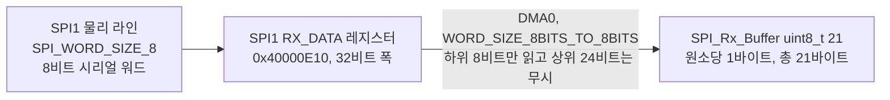

# 01. SPI1 DMA 8비트 전환 5게이트 검증

**TL;DR**: `DMA_CFG0.SRC_DEST_WORD_SIZE` 를 `0x0`(32→32)에서 `0x12`(8→8)로 바꾸는 안을 5게이트로 검증했다. 최우선 질문이던 `transferLength` 단위는 SDK·하드웨어 레퍼런스 원문으로 "워드 수"임을 확정했고, 워드가 8비트로 줄어도 `21` 값은 그대로 유지된다. 다만 주소 정렬 요구사항 상충·니블 순서 동작 등 실기 검증 전 필수 미확인이 남아 **조건부 가능**으로 판정한다.

## 0. 최종 판정

> [!WARNING]
> **조건부 가능 (미확인 5건, 이 중 2건은 실기 전 필수 해소)**
>
> - 레지스터 필드·근거·전후 동작·부작용 4게이트는 원문 근거로 확정했다.
> - 다만 게이트_5 의 **미확인_2(주소 정렬 요구사항 상충)** 와 **미확인_4(니블 순서 동작)** 는 하드웨어 레퍼런스 원문 자체에서 애매하거나 이번 전환에서만 새로 노출되는 항목이라 실측 또는 벤더 확인 없이 "가능"으로 단정하지 않는다.

## 게이트_1 설정 대상 식별

### 1.1 `DMA_CFG0` 전체 비트 필드 맵

근거: `<SDK>/include/cm3/sk5_hw_cid101.h:10888-10905` (Pos/Mask 매크로), 각 필드 의미는 `Ezairo 8300 Hardware Reference.pdf` §19.4.3.1(p.712) "Field Name / Description" 표.

| 비트 | 필드명 | 폭 | 현재 값(DMA0/DMA1 공통 부분 제외 시 개별 표기) | 이번 전환 대상 |
|---|---|---|---|---|
| 31 | `COMPLETE_INT_ENABLE` | 1 | `DMA_COMPLETE_INT_ENABLE`(0x1) | 아니오 |
| 30 | `CNT_INT_ENABLE` | 1 | `DMA_CNT_INT_DISABLE`(0x0) | 아니오 |
| 29 | `DEST_ADDR_LSB_TOGGLE` | 1 | `DISABLE`(0x0) | 아니오 |
| 28 | `SRC_ADDR_LSB_TOGGLE` | 1 | `DISABLE`(0x0) | 아니오 |
| 27:24 | `DEST_ADDR_STEP` | 4 | DMA0=`INCR_1`(0x1) / DMA1=`STATIC`(0x0) | 아니오 |
| 23:20 | `SRC_ADDR_STEP` | 4 | DMA0=`STATIC`(0x0) / DMA1=`INCR_1`(0x1) | 아니오 |
| **19:14** | **`SRC_DEST_WORD_SIZE`** | **6** | **`0x0`(32→32)** | **예 → `0x12`(8→8)** |
| 13:10 | `DEST_SELECT` | 4 | DMA0=`DMA_DEST_ALWAYS_ON`(0x0) / DMA1=`DMA_DEST_SPI1`(0x2) | 아니오 |
| 9 | (예약) | 1 | 갭 - 아래 §1.4 참조 | 해당 없음 |
| 8:5 | `SRC_SELECT` | 4 | DMA0=`DMA_SRC_SPI1`(0x2) / DMA1=`DMA_SRC_ALWAYS_ON`(0x0) | 아니오 |
| 4 | (예약) | 1 | 갭 - 아래 §1.4 참조 | 해당 없음 |
| 3:2 | `CHANNEL_PRIORITY` | 2 | `DMA_PRIORITY_1`(0x1) | 아니오 |
| 1 | `SRC_DEST_TRANS_LENGTH_SEL` | 1 | DMA0=`DEST_TRANS_LENGTH_SEL`(0x0) / DMA1=`SRC_TRANS_LENGTH_SEL`(0x1) | 아니오 |
| 0 | `BYTE_ORDER` | 1 | `DMA_LITTLE_ENDIAN`(0x0) | 아니오 |

`SRC_DEST_WORD_SIZE` 값 정의(`sk5_hw_cid101.h:10972,10983`): `WORD_SIZE_32BITS_TO_32BITS = 0x0`, `WORD_SIZE_8BITS_TO_8BITS = 0x12`. Pos=14, Mask=`0x3FU << 14`(`sk5_hw_cid101.h:10896-10897`) - 현재값·목표값·위치·폭 전부 요구사항대로 확정.

### 1.2 `TDC_HAL_DMA0_CFG0` / `TDC_HAL_DMA1_CFG0` 플래그 전수 분해

근거: `src/2__cm3/source/hal/tdc_hal_dma.h:7-14`

| 매크로 | 채널 | 의미(하드웨어 레퍼런스 원문 요약) | 값 |
|---|---|---|---|
| `DMA_LITTLE_ENDIAN` | 둘 다 | "DMA channel uses little endian mode" (p.717) | 0x0 |
| `DEST_TRANS_LENGTH_SEL` | DMA0 | "Transfer length counter depends on the destination word count" (p.717) | 0x0 |
| `SRC_TRANS_LENGTH_SEL` | DMA1 | "...depends on the source word count" (p.718) | 0x1 |
| `DMA_PRIORITY_1` | 둘 다 | 채널 중재 우선순위 1 | 0x1 |
| `DMA_SRC_SPI1` | DMA0 | 소스 요청선 = SPI1 | 0x2 |
| `DMA_SRC_ALWAYS_ON` | DMA1 | 소스(메모리)는 요청 대기 없이 즉시 읽음 | 0x0 |
| `DMA_DEST_ALWAYS_ON` | DMA0 | 목적지(메모리)는 요청 대기 없이 즉시 씀 | 0x0 |
| `DMA_DEST_SPI1` | DMA1 | 목적지 요청선 = SPI1 | 0x2 |
| `WORD_SIZE_32BITS_TO_32BITS` | 둘 다 | **전환 대상** | 0x0 → 0x12 |
| `DMA_SRC_ADDR_STATIC` | DMA0 | SPI1 RX_DATA 주소 고정(증가 없음) | 0x0 |
| `DMA_SRC_ADDR_INCR_1` | DMA1 | 메모리(Tx 버퍼) 주소 1워드씩 증가 | 0x1 |
| `DMA_DEST_ADDR_INCR_1` | DMA0 | 메모리(Rx 버퍼) 주소 1워드씩 증가 | 0x1 |
| `DMA_DEST_ADDR_STATIC` | DMA1 | SPI1 TX_DATA 주소 고정 | 0x0 |
| `DMA_SRC_ADDR_LSB_TOGGLE_DISABLE` | 둘 다 | 순환 버퍼(LSB 토글) 미사용 | 0x0 |
| `DMA_DEST_ADDR_LSB_TOGGLE_DISABLE` | 둘 다 | 상동(목적지) | 0x0 |
| `DMA_CNT_INT_DISABLE` | 둘 다 | 카운터 인터럽트(부분 전송 트리거) 미사용 | 0x0 |
| `DMA_COMPLETE_INT_ENABLE` | 둘 다 | 전송 완료 인터럽트 사용 (SPI1_COM/DMA0/DMA1 핸들러의 근간) | 0x1 |

### 1.3 통째 write 여부 (read-modify-write 아님)

`Sys_DMA_ChannelConfig()` 정의(`<SDK>/source/shared/HAL/include/dma.h:62-94`):

```c
dma->CFG0 = cfg &
            (((uint32_t)0x1U << DMA_CFG0_BYTE_ORDER_Pos) |
             ((uint32_t)0x1U << DMA_CFG0_SRC_DEST_TRANS_LENGTH_SEL_Pos) |
             DMA_CFG0_CHANNEL_PRIORITY_Mask |
             DMA_CFG0_SRC_SELECT_Mask |
             DMA_CFG0_DEST_SELECT_Mask |
             DMA_CFG0_SRC_DEST_WORD_SIZE_Mask |
             DMA_CFG0_SRC_ADDR_STEP_Mask |
             DMA_CFG0_DEST_ADDR_STEP_Mask |
             ((uint32_t)0x1U << DMA_CFG0_SRC_ADDR_LSB_TOGGLE_Pos) |
             ((uint32_t)0x1U << DMA_CFG0_DEST_ADDR_LSB_TOGGLE_Pos) |
             ((uint32_t)0x1U << DMA_CFG0_CNT_INT_ENABLE_Pos) |
             ((uint32_t)0x1U << DMA_CFG0_COMPLETE_INT_ENABLE_Pos));
```

`dma->CFG0 = ...` 는 **대입**이다 - 이전 레지스터 내용을 보존하는 `|=` 가 아니라 `cfg`(우리가 넘긴 `TDC_HAL_DMA0_CFG0`/`DMA1_CFG0` 전체)로 완전히 덮어쓴다. `tdc_hal_spi.c` 의 두 매크로는 워드 크기를 제외한 모든 필드를 이미 명시적으로 OR 조합하고 있으므로, 매크로 안의 `WORD_SIZE_32BITS_TO_32BITS` 토큰 하나만 `WORD_SIZE_8BITS_TO_8BITS` 로 바꾸면 **다른 필드는 소스 코드 그대로 유지되고, 레지스터 결과값도 해당 필드들만 그대로 재기록**된다. 즉 "다른 비트가 그대로 유지되는지"는 코드 구조상 보장된다.

### 1.4 예약 비트 취급 규칙

비트 4와 비트 9는 위 표(§1.1)의 명명된 필드 사이 갭이며, `Sys_DMA_ChannelConfig()`의 마스크(§1.3)에도 **포함되어 있지 않다** - `DMA_CFG0_SRC_SELECT_Mask`(비트 5-8)와 `DMA_CFG0_CHANNEL_PRIORITY_Mask`(비트 2-3) 사이의 비트 4, `DMA_CFG0_DEST_SELECT_Mask`(비트 10-13)와 `SRC_SELECT_Mask`(비트 5-8) 사이의 비트 9. 따라서 `cfg`에 어떤 값이 들어와도 이 두 비트는 **항상 0으로 강제**된다(드라이버 코드 차원의 확정 사실). 다만 하드웨어 레퍼런스 본문에서 "예약 비트는 0을 유지해야 한다"는 명시적 문장은 찾지 못했다 - §1.3 코드 사실만으로 결론 내렸다.

## 게이트_2 근거 확인 (원문 인용)

### 2.1 `WORD_SIZE_8BITS_TO_8BITS` 정의

- SDK 헤더: `((uint32_t)(0x12U << DMA_CFG0_SRC_DEST_WORD_SIZE_Pos))` (`sk5_hw_cid101.h:10983`)
- CMSIS 드라이버: `DMA_CFG0_DEST_WORD_SIZE_8BITS_TO_8BITS = 0x12, /**< Source data uses 8-bit word and destination data uses 8-bit word. */` (`<SDK>/include/cm3/cmsis_drivers/Driver_DMA.h:149`)
- 하드웨어 레퍼런스 원문(p.715): "`WORD_SIZE_8BITS_TO_8BITS` source data uses 8-bit word and destination data uses 8-bit word"

세 출처가 일치한다.

### 2.2 `transferLength` 단위 - 이번 분석의 최우선 질문 (확정: 워드 수)

**결론: 워드 수다. 바이트 수가 아니다.** 근거 3중:

1. 하드웨어 레퍼런스 §19.4.3.2 `DMA*_CFG1`, `TRANSFER_LENGTH` 필드 설명 원문(p.718):
   > "The length, in words, of each data transfer using DMA channel"
2. §19.4.2.8 "DMA Operation"(p.704-705) 원문:
   > "This can be selected using the bit location DMA_CFG0_SRC_DEST_TRANS_LENGTH_SEL in the DMA_CFG0 register. ... If bit DMA_CFG0_SRC_DEST_TRANS_LENGTH_SEL is set to DEST_TRANS_LENGTH_SEL, the transfer length depends on the destination transfer count. When SRC_TRANS_LENGTH_SEL is set, the transfer length depends on the source word count."
   > "The DMA continues to transfer data from source to destination, until the destination transfer length (configured through the DMA_CFG1_TRANSFER_LENGTH field...) is reached. The DMA increments a destination word counter which can be read by the DMA_CNTS_TRANSFER_WORD_CNT field..."
3. **같은 저장소 실제 코드 선례** - `src/0__bootloader/source/bootloader.c:449-450`:
   ```c
   Sys_DMA_ChannelConfig(SECTION_TRANSFER_DMA,
                         ... | dma_src_inc | word_size | ... | SRC_TRANS_LENGTH_SEL | ...,
                         read_size << dma_len_mul,   // transferLength
                         0, (uint32_t)_data_temp_buffer, (uint32_t)dest_addr);
   ```
   `word_size` 가 `WORD_SIZE_32BITS_TO_32BITS`(기본)에서 `WORD_SIZE_8BITS_TO_24BITS`(`:314`,`:326`, CFX 섹션)로 바뀔 때 **`dma_len_mul` 도 0 → 2 로 같이 바뀌어 `read_size << 2`(×4) 를 넘긴다.** 이 채널은 `SRC_TRANS_LENGTH_SEL` 이므로 길이가 소스 워드 수 기준인데, 소스 워드 크기가 32비트에서 8비트로 4배 줄었으니 **같은 바이트량을 옮기려면 카운트를 4배로 올려야** 한다는 실증 사례다.

   **우리 케이스에 대입**: DMA0(RX)는 `DEST_TRANS_LENGTH_SEL` - 카운트 기준이 **목적지(메모리 버퍼) 워드**다. 목적지 워드 크기가 32비트→8비트로 줄면서 목적지 버퍼도 `int[21]`(21워드×4바이트=84바이트)→`uint8_t[21]`(21워드×1바이트=21바이트)로 **함께** 줄어든다. "옮기려는 바이트량"이 84바이트에서 21바이트로 의도적으로 줄어드는 것이므로, `dma_len_mul` 같은 보정 없이 `TDC_HAL_SPI_COMM_PACKET_SIZE`(21) 값 **그대로** 두면 정확히 21바이트(=새 버퍼 전체)가 채워진다. DMA1(TX)도 `SRC_TRANS_LENGTH_SEL` 로 소스(메모리 `SPI_Tx_Buffer`) 워드 기준이라 동일 논리다. **부트로더 사례의 "4배 보정"은 목적지 워드 크기는 그대로 두고 소스만 줄인 비대칭 케이스(8→24)에서 필요했던 것이고, 우리 전환은 양쪽을 대칭으로(8→8) 줄이면서 버퍼 원소 개수(21)도 그대로 유지하는 케이스라 보정이 필요 없다.**

### 2.3 주소 증가 단위 - `DMA_DEST_ADDR_INCR_1`/`DMA_SRC_ADDR_INCR_1`

하드웨어 레퍼런스 §19.4.3.1 필드 설명(p.711-712) 원문:
> "`DEST_ADDR_STEP` - Configure whether the destination address increments/decrements **in terms of destination word size**"
> "`SRC_ADDR_STEP` - Configure whether the source address increments/decrements **in terms of source word size**"

즉 `INCR_1` = "그 쪽에 설정된 워드 크기 1개 분"만큼 증가한다 - 고정 4바이트가 아니다. 32비트 워드일 때는 4바이트씩, 8비트 워드로 바뀌면 **1바이트씩** 증가한다. 이는 §19.4.2.2(p.696-697) 원문과도 일치한다:
> "These addresses need to be word aligned, a requirement for the 32-bit accesses this block performs." (직후 문단, INCR/DECR 설명 바로 앞)
> "The address step size is applied to the address after each word is transferred."

→ `DMA_DEST_ADDR_INCR_1`(DMA0, Rx 버퍼)과 `DMA_SRC_ADDR_INCR_1`(DMA1, Tx 버퍼)은 코드 수정 없이 그대로 두면 **자동으로 1바이트 단위 증가로 전환**된다. `uint8_t[21]` 배열의 연속 원소를 정확히 한 칸씩 채우는 데 필요한 동작과 일치한다.

### 2.4 `DEST_TRANS_LENGTH_SEL`/`SRC_TRANS_LENGTH_SEL` 의미

§2.2에서 인용한 원문과 동일 - "전송 길이 카운터가 목적지 워드 수 기준이냐 소스 워드 수 기준이냐"를 고르는 비트다(`DMA_CFG0` 비트 1). DMA0=목적지 기준, DMA1=소스 기준이며, 두 채널 모두 "메모리 버퍼가 있는 쪽"을 카운트 기준으로 선택해 두었다 - 이 설계 자체가 이미 "메모리 버퍼 워드 크기 = 전송 길이 단위"를 전제하고 있어, 이번 전환과 정합적이다.

### 2.5 SPI 데이터 레지스터 주소 확인

`SPI_Type` 구조체(`sk5_hw_cid101.h:16499-16509`): `CFG(+0x00)`, `CTRL(+0x04)`, `STATUS(+0x08)`, `TX_DATA(+0x0C)`, `RX_DATA(+0x10)`, ... `SPI1_BASE = 0x40000E00`(`:16518`).

계산: `SPI1->TX_DATA = 0x40000E00 + 0x0C = 0x40000E0C`, `SPI1->RX_DATA = 0x40000E00 + 0x10 = 0x40000E10`. **`tdc_hal_spi.c:223,232`의 하드코딩 값과 정확히 일치**한다. 심볼(`SPI1->RX_DATA`/`SPI1->TX_DATA`)이 SDK에 존재하는데도 하드코딩된 이유는 코드에서 별도로 확인되지 않는다(주석 없음) - 관례적 선택으로 보이나 근거 문서는 없다.

`RX_DATA`/`TX_DATA` 레지스터 자체는 **워드 크기 설정과 무관하게 항상 이 고정 주소**다(레지스터 정의: "31:0 RX_DATA - Single word buffer for received data", `hw_ref p.668`). DMA 쪽에서 해당 채널의 SPI1 방향 주소는 이미 `DMA_SRC_ADDR_STATIC`/`DMA_DEST_ADDR_STATIC`(증가 없음)로 고정돼 있으므로, 워드 크기가 8비트로 바뀌어도 **DMA가 매 전송마다 접근하는 주소는 동일하게 0x40000E10/0x40000E0C 그대로**다.

### 2.6 엔디안 영향

`DMA_LITTLE_ENDIAN`(현재 값, `sk5_hw_cid101.h:10925`, BITBAND=0x0)이 두 채널 모두에 설정돼 있다. 하드웨어 레퍼런스 §19.4.2.6(p.700-701) 원문:
> "If byte ordering is enabled, the DMA can also order the bytes when the source word size and destination word size are the same. **In the case of a word size of 8 bits for both source and destination, the nibble is ordered instead.** No ordering occurs for word sizes of 4 bits."

→ 목표 설정(8→8, 동일 워드 크기)은 바로 이 "니블 순서 재배치"가 적용될 수 있는 조건에 해당한다. 현재 32→32 설정에서는 이 특수 케이스가 아예 발동하지 않으므로, **이 문구가 실제로 어떤 값(리틀/빅)에서 "재배치 없음"을 의미하는지는 이번 전환에서 처음 검증이 필요한 항목**이다 → 게이트_5 미확인_4.

## 게이트_3 전후 동작 시뮬레이션

### 3.1 변경 전 (32→32, 현재)


- DMA0 목적지 워드 크기가 32비트이므로 언패킹이 발생하지 않는다(§19.4.2.6: "동일 워드 크기면 direct mode, 특별 처리 없음"). RX_DATA 레지스터의 32비트 값을 그대로 `int` 슬롯에 복사한다.
- 상위 24비트에 무엇이 들어가는지는 **SPI 레지스터 자체의 동작**(§게이트_5 미확인_1)에 달려 있고, DMA는 이를 가공하지 않고 그대로 옮긴다. 현재 코드가 출력 시 항상 `& 0xFF` 로 마스킹하는 것(`tdc_hal_spi.c:97,145,187`)이 이 불확실성에 대한 기존의 방어책이다.
- `transferLength=21` = 목적지(메모리) 워드 21개 = 84바이트. `DMA_DEST_ADDR_INCR_1` = 4바이트씩 증가.

### 3.2 변경 후 (8→8, 목표)



- 하드웨어 레퍼런스 §19.4.2.6(p.700) 원문: "When the source word size is less than 32 bits, the data is read from the lower portion of the 32-bit word. **The upper bits are ignored.**" → 상위 24비트가 무엇이든 DMA가 명시적으로 버리므로, 변경 전 존재하던 "상위 24비트 불명확" 리스크가 **전환 후에는 애초에 발생하지 않는다.**
- 목적지 워드 크기 8비트는 "byte addressable"(p.700)이므로, DMA는 각 심볼을 별도 바이트 주소에 그대로 쓴다(패딩 없음) - 32→32일 때처럼 4바이트 슬롯에 담기지 않는다.
- `transferLength=21`(변경 없음) = 목적지 워드 21개 = 21바이트(새 버퍼 전체와 정확히 일치). `DMA_DEST_ADDR_INCR_1`(설정값 변경 없음) = 이제 1바이트씩 증가.

### 3.3 버퍼 타입을 바꿔야 하는 이유 / 안 바꾸면 생기는 일

`SPI_Rx_Buffer`/`SPI_Tx_Buffer`를 `int[21]`로 **그대로 둔 채** DMA 워드 크기만 8→8로 바꾸면:
- `Sys_DMA_ChannelConfig(DMA0, ..., TDC_HAL_SPI_COMM_PACKET_SIZE, 0, 0x40000E10, (uint32_t)SPI_Rx_Buffer)` 에서 목적지 주소는 여전히 `int[21]`의 시작 주소이지만, DMA는 이제 **1바이트씩** 21번 순차 기록한다. 그러면 `SPI_Rx_Buffer[0]`의 최하위 바이트에 패킷 바이트 0이, `SPI_Rx_Buffer[0]`의 2번째 바이트 위치(리틀엔디안 기준 바이트 오프셋 1)에 패킷 바이트 1이 들어가는 식으로 **`int` 배열의 내부 바이트 구조를 침범**하며, 21바이트가 배열 앞쪽 5.25개 `int` 슬롯에만 몰려 쓰이고 나머지 15.75개 슬롯은 손대지 않은 상태(0 또는 이전 값)로 남는다. 기존 코드의 `SPI_Rx_Buffer[i] & 0xFF` 인덱싱 로직이 전부 어긋난다.
- 결론: **DMA 워드 크기 변경과 버퍼 타입 변경은 반드시 같은 커밋에서 동시에 이뤄져야 하며, 하나만 바꾸면 패킷이 깨진다.** 이는 실행 중 발생하는 "초기화 순서 의존성"이 아니라 **컴파일 타임에 세 곳(①`tdc_hal_dma.h`의 워드 크기 매크로, ②`tdc_hal_spi.c`의 버퍼 선언 타입, ③ 이를 참조하는 함수 시그니처)이 원자적으로 함께 바뀌어야 하는 정합성 제약**이다.

### 3.4 전송 길이 · 주소 증가 · 완료 인터럽트 발생 시점 변화

| 항목 | 변경 전 | 변경 후 |
|---|---|---|
| `transferLength`(CFG1) | 21 (32비트 워드 21개 = 84바이트) | 21 (8비트 워드 21개 = 21바이트) - **값 불변** |
| 목적지/소스 주소 증가폭 | 4바이트/스텝 | 1바이트/스텝 - **설정값(`INCR_1`) 불변, 실제 증가량만 축소** |
| `DMA_COMPLETE_INT` 발생 시점 | 84바이트(21워드) 전송 완료 시 | 21바이트(21워드) 전송 완료 시 - **"21개 전송 완료"라는 논리적 조건은 동일**, 물리적으로 옮기는 바이트량만 1/4로 감소 |
| `DMA0_CNTS->TRANSFER_WORD_CNT_SHORT` 비교(`tdc_hal_spi.c:71,78`) | `!= 21` 이면 에러 | `!= 21` 이면 에러 - **비교식 그대로 유효** (카운터도 "워드" 단위이므로) |

→ 인터럽트가 걸리는 "논리적 타이밍"(21개 다 옮겼을 때)은 그대로다. 다만 SPI 물리 라인 자체의 초당 바이트 처리량은 이번 DMA 변경과 무관(SPI 클럭·워드 크기는 이미 8비트로 고정돼 있었음)하므로, 실제 완료까지 걸리는 물리 시간(SPI 전송 시간)은 이번 변경으로 달라지지 않는다 - 달라지는 것은 **메모리 점유량**(84→21바이트)뿐이다.

### 3.5 초기화 시퀀스(`tdc_hal_spi_init`, `tdc_hal_spi.c:241-284`) 순서 의존성

함수 순서: ①상태 idle ②SPI 핀 설정 ③SPI 비활성화 ④`Sys_SPI_Config`(`SPI_WORD_SIZE_8` 등, 워드 크기 변경과 무관 - 이미 8비트) ⑤Tx 버퍼 채움 ⑥플래그 클리어 ⑦`tdc_hal_spi_enable_dma()`(DMA0/1 재설정) ⑧SPI 활성화 ⑨NVIC 설정.

이 순서 자체는 워드 크기가 32비트든 8비트든 **동일한 논리로 동작**하며, `tdc_hal_spi_enable_dma()`가 매번 DMA0/1을 끄고(①`DMA_DISABLE`) 완전히 재설정(②`Sys_DMA_ChannelConfig`, 통째 write)한 뒤 다시 켜는(③`DMA_ENABLE`) 패턴이므로 순서 의존성이 깨지는 지점은 발견하지 못했다.

## 게이트_4 부작용

### 4.1 DMA0/DMA1 사용처 전수 확인 (Grep, 추정 아님)

`2__cm3` 전체에서 `DMA0`/`DMA1`/`DMA0_IRQHandler`/`DMA1_IRQHandler` 를 참조하는 파일은 **4개뿐**이다:

| 파일 | 역할 |
|---|---|
| `source/hal/tdc_hal_spi.c` | 정상 경로 - DMA0(RX)/DMA1(TX) 설정·인터럽트 핸들러 (`:127-196`, `:216-239`) |
| `source/hal/tdc_hal_dma.h` | `TDC_HAL_DMA0_CFG0`/`DMA1_CFG0` 등 매크로 정의 (`:7-16`) |
| `source/ble/tdc_ble_communication.c` | `SPI_CMMM_ERROR` 복구 경로에서 DMA0/1 비활성화 (`:366-367`), NVIC 클리어 (`:370-371`) |
| `source/sys/tdc_sys_init.c` | 시스템 초기화 시 DMA0-3 전체를 일괄 비활성화·상태 클리어 (`:83-96`) - SPI1 전용 로직 아님, "전원 인가 직후 모든 DMA를 확실히 끈다"는 범용 초기화 |

`2__cm3` 안에서 DMA0/DMA1을 SPI1 이외의 다른 기능이 쓰는 코드는 **발견되지 않았다.** 다른 채널(DMA2-7)의 용도까지는 이번 분석 범위(요구사항_6은 DMA0/1 한정) 밖이라 확인하지 않았다.

### 4.2 `SPI_CMMM_ERROR` 복구 경로(`tdc_ble_communication.c:352-391`) 영향

복구 경로는 `Sys_SPI_TransferConfig(DISABLE)` → `DMA0/1 DISABLE` → NVIC 클리어 → 플래그 클리어 → **`tdc_hal_spi_enable_dma()` 재호출**(`:378`) → `SPI_CTRL_ENABLE` 순서다. `tdc_hal_spi_enable_dma()`가 매크로(`TDC_HAL_DMA0_CFG0`/`DMA1_CFG0`)를 참조해 **완전히 새로 설정**하므로, 이 매크로 안의 워드 크기 토큰만 바꾸면 복구 경로도 **자동으로 8비트 설정을 그대로 재사용**한다. 복구 경로 자체에 워드 크기별 분기나 하드코딩은 없다 - 별도 수정이 필요 없다.

### 4.3 저전력 모드·클럭 게이팅 시 설정 유지 여부

`source/pwr/tdc_pwr_clock.c`/`.h`에서 `DMA` 문자열을 검색했으나 참조가 없다 - 프로젝트 저전력 코드가 DMA를 명시적으로 다루지 않는다. 하드웨어 레퍼런스에서도 "저전력/스탠바이 진입 시 `DMA_CFG0/CFG1` 레지스터가 유지되는가"를 직접 서술하는 문장을 찾지 못했다. **이는 워드 크기와 무관하게 기존 32비트 설정에도 이미 존재하던 미확인이며, 이번 전환이 새로 만드는 리스크가 아니다** → 게이트_5 미확인_3.

### 4.4 부트로더의 8비트 워드 DMA 사용 선례 정독 (`src/0__bootloader/source/bootloader.c`)

- `:280-283` 기본값: `word_size = WORD_SIZE_32BITS_TO_32BITS`, `dma_len_mul = 0`, `dma_src_inc = DMA_SRC_ADDR_INCR_1`
- `:314`, `:326` (CFX X/Y 섹션): `word_size = WORD_SIZE_8BITS_TO_24BITS`, `dest_inc = (_DATA_TEMP_BUFFER_SIZE * 4) / 3`, **`dma_len_mul = 2`**
- `:436-439` (AES 패딩이 있는 마지막 전송): `word_size == WORD_SIZE_32BITS_TO_32BITS` 이면 `WORD_SIZE_8BITS_TO_32BITS` 로 전환, 동시에 `dma_len_mul = 0` 으로 리셋
- `:449-450`: `Sys_DMA_ChannelConfig(..., word_size | ... | SRC_TRANS_LENGTH_SEL | ..., read_size << dma_len_mul, ...)`

이 선례가 게이트_2의 최우선 질문(transferLength 단위)을 실증했다(§2.2). 아울러 **`SECTION_TRANSFER_DMA = DMA0`, `CRC_CALCULATION_DMA = DMA1`**(`src/0__bootloader/include/bootloader/bootloader_internal.h:75-76`)로 정의돼 있어, **부트로더도 CM3 앱과 동일한 물리 채널 DMA0/DMA1을 사용**한다.

### 4.5 부트로더 ↔ 앱 설정 인계 여부

부트로더는 각 섹션 전송이 끝날 때마다 `Sys_DMA_Mode_Enable(SECTION_TRANSFER_DMA, DMA_DISABLE)`/`(CRC_CALCULATION_DMA, DMA_DISABLE)`(`bootloader.c:470-471`)로 DMA0/1을 명시적으로 끈 뒤 앱으로 점프한다. 앱 쪽 `tdc_hal_spi_init()`도 `tdc_hal_spi_enable_dma()`를 통해 DMA0/1을 다시 `DMA_DISABLE` 시킨 뒤 `Sys_DMA_ChannelConfig()`로 **CFG0/CFG1을 통째로 재기록**한다(게이트_1 §1.3). 따라서 부트로더가 남긴 이전 설정(워드 크기 포함)이 앱에 **인계되거나 영향을 주는 경로는 없다** - 이번 전환이 부트로더 쪽 코드나 동작에 아무 영향을 주지 않는다는 것도 같은 논리로 확인된다(부트로더는 자신의 매크로만 참조, 앱의 `tdc_hal_dma.h`를 공유하지 않음).

## 게이트_5 불확실성 명시

| 번호 | 미확인 항목 | 근거를 못 찾은 이유 | 해결 방안 | 전환 차단 여부 |
|---|---|---|---|---|
| 미확인_1 | `SPI_WORD_SIZE_8` 설정 하에서 `SPI1->RX_DATA`(32비트 레지스터) 상위 24비트가 0으로 채워지는지, 이전 값이 남는지 | 하드웨어 레퍼런스 §18.7.4.5 에 "31:0 RX_DATA - Single word buffer" 로만 기술, 워드 크기별 상위 비트 동작 명시 없음. 현재 코드의 `&0xFF` 마스킹(`tdc_hal_spi.c:97,145,187`)은 간접 정황일 뿐 확정 근거 아님 | 로직 애널라이저로 SPI 라인 캡처 + `SPI_Rx_Buffer` 원시 덤프 비교, 또는 onsemi 기술지원 문의 | **아니오** - 전환 후에는 DMA가 하위 8비트만 읽고 상위를 무시하도록 명세돼 있어(§3.2) 이 불확실성 자체가 소멸함 |
| 미확인_2 | `DMA_SRC_ADDR`/`DMA_DEST_ADDR` 의 정렬 요구사항 - "주소는 워드 정렬돼야 한다(32비트 접근 요구사항)"(p.697)와 "4/8비트 워드는 바이트 주소 지정 가능"(p.700)이 상충하는 것으로 읽힘. `uint8_t[21]` 정적 배열이 컴파일러/링커에 의해 4바이트 정렬이 안 될 경우 위반 여부 불명 | 두 문장이 서로 다른 절(§19.4.2.2 일반 주소 설명 vs §19.4.2.5 워드 크기 설명)에 있어 우선순위 판단 근거 부족 | (a) onsemi 기술지원에 8→8 모드에서 비4바이트-정렬 주소 허용 여부 질의 (b) 실측 - 링커 맵에서 실제 버퍼 주소 확인 + 실기 DMA 동작(패킷 무결성) 검증 | **예 - 실기 전 필수 해소** |
| 미확인_3 | 저전력/클럭 게이팅 진입 시 `DMA_CFG0/CFG1` 레지스터 유지 여부 | 하드웨어 레퍼런스에서 DMA와 저전력 모드를 직접 연결하는 서술을 찾지 못함. `tdc_pwr_clock.c`에도 DMA 참조 없음 | Low Power/Clock Gating 챕터 별도 완독, 또는 저전력 진입·복귀 전후 `DMA_CFG0` 레지스터 값을 디버거로 실측 비교 | 아니오 - 32비트 설정에도 이미 있던 기존 미확인, 이번 전환이 새로 만든 리스크 아님 |
| 미확인_4 | `WORD_SIZE_8BITS_TO_8BITS`(소스=목적지 워드 크기 동일)에서 발동하는 "니블 순서 재배치"(p.700-701 원문)가 현재 설정값 `DMA_LITTLE_ENDIAN`(0x0)에서 순서를 바꾸지 않는 상태인지 | 원문이 "니블이 순서 재배치된다"는 조건만 서술하고, 리틀/빅 엔디안 각각에서 구체적으로 어떻게 재배치되는지(또는 안 되는지)는 명시하지 않음. 32→32 설정에는 이 특수 케이스가 적용되지 않아 기존 운용 경험으로 검증된 적 없음 | 실측 - 알려진 바이트 패턴(예 0x12, 0x34...)을 SPI로 송수신해 `SPI_Rx_Buffer` 값이 니블 스왑 없이 그대로 들어오는지 확인 | **예 - 실기 전 필수 해소** |
| 미확인_5 | 버퍼 타입 전환(`int[21]`→`uint8_t[21]`)의 파급 범위 - `tdc_hal_spi_write_tx_buffer(int*, int)`/`tdc_hal_spi_get_rx_packet_addr()->int*` 호출부가 `ble/`·`isd/`·`dfu/`·`sys/` 전반에 50곳 이상(Grep 확인) 있고 전부 `int` 배열을 소스로 사용 | 이번 분석은 DMA 레지스터 레벨 검증이 목적이라 호출부 각각의 타입 변경 계획까지는 다루지 않음 | 별도 재설계 산출물(요구사항_8~12, 별도 노드)에서 호출부 전수 목록화 및 타입 변경/캐스팅 계층 설계 | 하드웨어적 차단은 아니나, 실기 검증 전 구현 규모를 인지해야 함 |

## 요약 표 - 전환 전/후 핵심 수치

| 항목 | 변경 전 (32→32) | 변경 후 (8→8) |
|---|---|---|
| `SRC_DEST_WORD_SIZE` (bit 19:14) | `0x0` | `0x12` |
| 버퍼 타입 | `int[21]` | `uint8_t[21]` (동반 변경 필수) |
| 버퍼 크기 | 84바이트 | 21바이트 |
| `transferLength`(CFG1) | 21 | 21 (**불변**) |
| 주소 증가폭(`INCR_1`) | 4바이트 | 1바이트 (**설정값 불변, 실제 증가량만 축소**) |
| SPI 데이터 레지스터 주소 | `0x40000E10`/`0x40000E0C` | 동일 (**불변**) |
| 그 외 CFG0 필드(우선순위·요청선·엔디안 등) | - | **불변** (통째 write지만 매크로가 명시 유지) |
