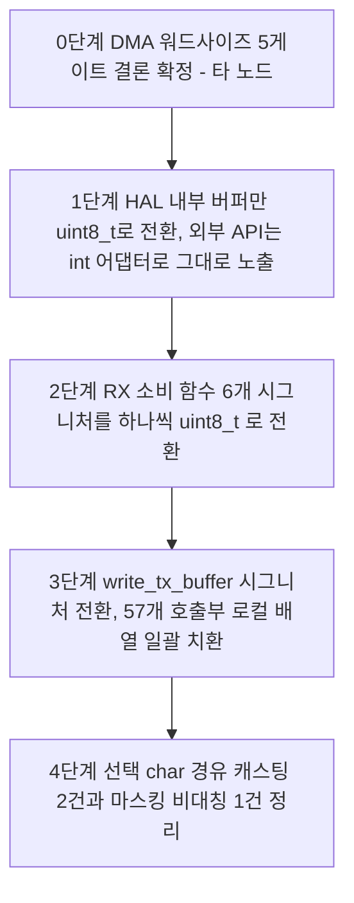

# 02. 타입 전환 영향 범위 - BLE 패킷 버퍼 int -> uint8_t (소프트웨어 파급)

**TL;DR**: `tdc_hal_spi_write_tx_buffer()` 57개 호출부·`tdc_hal_spi_get_rx_packet_addr()` 1개 호출부(6개 소비 함수로 분기)를 전수 조사했다. 16비트 값은 이미 전부 상위/하위 분할돼 있어 대입 초과 사례는 없었고, 위험은 `char` 경유 부호확장 2건·마스킹 비대칭 1건·외부 함수 반환형 미확인 몇 건에 집중된다. 하드웨어 DMA 워드사이즈는 별도 노드 소관이나 버퍼 타입과 반드시 동시 전환돼야 한다.

> [!NOTE]
> 이 문서는 [`20260727_ble-8bit-packet-redesign`](../요구사항.md) 작업의 ③ 분석 단계 fan-out 중 **소프트웨어 파급 전담 노드**의 산출물이다. DMA/SPI 워드사이즈 5게이트 검증(하드웨어 설정 가능 여부)은 별도 노드가 담당하며, 본 문서는 그 결과를 전제로 하지 않고 **"버퍼 타입이 바뀌면 소프트웨어 쪽에서 무엇이 깨지는가"만** 다룬다. `src/`는 읽기 전용으로 조사했으며 어떤 소스도 수정하지 않았다.

## 0. 조사 방법

직접 정독한 파일(`tdc_hal_spi.c/.h`, `tdc_hal_dma.h`, `tdc_ble_communication.c`, `tdc_ble_protocol.h`, `tdc_ble_mapping.h`, `tdc_ble_remote.h`, `tdc_ble_general_debug.c`, `tdc_shm.h` 관련 발췌)에 더해, 나머지 대용량 파일(`tdc_ble_mapping.c` 2196줄, `tdc_ble_remote.c` 1389줄, `tdc_ble_remote_sp_para.c`, `tdc_ble_gain_control.c`, `isd/` 5개 파일 4543줄, `tdc_sys_error.c`, `dfu/` 2개 파일)은 5개 조사 에이전트에 파일 단위로 분담해 병렬 정독시켰다. 모든 조사자에게 "읽기 전용, Write/Edit 금지"를 명시했고 실제로 어떤 파일도 변경되지 않았다.

## 1. 배경 사실 (재확인 완료)

| # | 사실 | 근거 |
|---|---|---|
| 배경_1 | 패킷 버퍼 3종: `SPI_Rx_Buffer[21]`·`SPI_Tx_Buffer[21]`·`Rx_DataPacket[20]`, 전부 `static int` | `tdc_hal_spi.c:20-22` |
| 배경_2 | RX 노출 API `int *tdc_hal_spi_get_rx_packet_addr(void)`, 호출부는 **`tdc_ble_communication.c:260` 단 1곳** | `tdc_hal_spi.c:44-47`, `tdc_hal_spi.h:47` |
| 배경_3 | TX 노출 API `void tdc_hal_spi_write_tx_buffer(int *source, int dataSize)`, 호출부는 **12개 파일에 57곳** | `tdc_hal_spi.c:287`, `tdc_hal_spi.h:49`, grep 전수 |
| 배경_4 | DMA0/DMA1 모두 `WORD_SIZE_32BITS_TO_32BITS`로 버퍼를 32비트 단위로 읽고/쓴다 (SPI 주변장치 자체는 이미 `SPI_WORD_SIZE_8`) | `tdc_hal_dma.h:7,13`, `tdc_hal_spi.h:17` |
| 배경_5 | RX 패킷을 소비하는 함수 시그니처는 **6개**이며 전부 `int*`/`const int*` | 본문 §3 표 |

## 2. 사용처 전수표

### 2.1 `tdc_hal_spi_get_rx_packet_addr()` - RX 포인터 소비 경로

RX 쪽은 호출부가 1곳뿐이지만, 반환된 포인터가 `static int *p_Rx_dataPacket`(`tdc_ble_communication.c:235`)에 저장된 뒤 6개 함수로 그대로 전달되므로 실제 파급은 함수 시그니처 6개로 갈라진다.

| 소비 함수(파일:라인) | 시그니처 | 용도 | 타입전환 시 영향 | 난이도 |
|---|---|---|---|---|
| `fetch_readDataForBleSetting`(`tdc_ble_communication.c:29`) | `const int *Rx_dataPacket` | QCC 시스템 정보(0x33~0x36) 파싱 | 시그니처 변경 필요, static 함수라 이 파일 안에서만 수정 | 기계적 |
| `tdc_ble_remote_fetch_packet`(`tdc_ble_remote.h:42`) | `const int *Rx_dataPacket` | 리모콘(0x40~0x59)·게인(0x8C)·범용디버그(0x8F) 파싱 | 시그니처 변경 + 내부 18건 비트시프트 조립부 영향(§4.1) | 판단필요 |
| `tdc_ble_mapping_fetch_packet`(`tdc_ble_mapping.h:140`) | `const int *Rx_dataPacket` | 매핑(0x60~0x91) 파싱, 2196줄 최대 파일 | 시그니처 변경 + 내부 20건 비트시프트 조립부 영향(§4.1) | 판단필요 |
| `tdc_dfu_ble_fetch_boot`(`tdc_dfu_ble_boot.h:121`) | `int *p_packet` | OTA BOOT(0xC2) 파싱 | 시그니처 변경. 내부 로직은 이미 바이트 단위 설계 | 기계적 |
| `tdc_dfu_ble_fetch_ota_start_end`(`tdc_dfu_ble_ota.h:143`) | `int *p_packet` | OTA 시작/종료(0xC0/0xC1) 파싱 | 시그니처 변경 + 내부 static 함수 5개(`_handle_command_option_*`, `_fetch_packet_command`, `_fetch_packet_data`)까지 연쇄 | 판단필요(연쇄 범위) |
| `tdc_dfu_ble_fetch_ota`(`tdc_dfu_ble_ota.h:144`) | `int *p_packet` | OTA 데이터(0xC3) 파싱, 32비트 주소/크기 조립 다수 | 시그니처 변경. 조립 로직 자체는 바이트 단위라 안전 | 기계적 |

또한 `tdc_ble_communication.c:452` `p_Rx_dataPacket[0] = 0;`(BLE 연결해제 플래그 클리어) - RX 버퍼에 대한 유일한 쓰기. 대입값 0은 어떤 타입에서도 안전. `static int *p_Rx_dataPacket`(:235) 자체의 선언도 함께 바꿔야 함(기계적).

### 2.2 `tdc_hal_spi_write_tx_buffer()` - TX 호출부 (57곳, 파일별 집계)

모든 호출부가 **로컬 `int` 배열**(`bufferForSPI_tx`/`Tx_dataBuff`/`spi_buffer`, 대부분 `int buf[BLE_DataPacketSize]`, 함수 스코프 지역변수)을 채운 뒤 그대로 넘기는 동일 패턴이다. 값 출처별로 분류하면:

| 파일 | 호출부 라인 | 건수 | 대입값 성격 | 255 초과/음수 위험 | 난이도 |
|---|---|---|---|---|---|
| `tdc_ble_communication.c` | 89, 117, 165, 195, 226 | 5 | 헤더 echo, 배터리%(0-100), 충전상태(0-2), LED상태, 클래식상태, ISD 위치·유저이름(ASCII, `p_currentUserName` int* 경유) | 없음 | 기계적 |
| `tdc_ble_mapping.c` | 708, 1118, 1372, 1676, 1771, 1840, 1854, 2128 | 8 | 헤더 echo, 서브커맨드 인덱스(1~15), 상태 상수 | 없음(§4.4의 마스킹 비대칭 1건 제외) | 기계적 |
| `tdc_ble_mapping.c` | 1989 | 1 | `tdc_pwr_battery_read_percentage()`(외부 반환형 미확인), `(int) errorCode.ISD_ErrorFlag`(원 타입 미확인) | 미확인 | 판단필요 |
| `tdc_ble_remote.c` | 320,540,762,813,844,882,916,960,998,1019,1040,1061,1092,1204,1232,1279,1313 | 17 | 헤더 echo, 볼륨 레벨(1~상한), 배터리%, 맵스탬프(년/월/일/시/분/초, int* 경유), 게인 인덱스(0~255 확정) | 없음(§4.3 FW정보 타입 불일치 1건 제외) | 기계적 |
| `tdc_ble_remote.c` | 1092 | 1 | Ezairo FW 정보 14바이트, `char*`로 반환되는 `uint8_t[]` 구조체(§4.3) | 판단필요(타입 불일치, 실값은 안전) | 판단필요 |
| `tdc_ble_remote.c` | 1190 | 1 | `tdc_ble_general_debug_handle()` 결과 그대로 전송 - 내부는 §2.3 참고 | 없음 | 기계적 |
| `tdc_ble_remote_sp_para.c` | 261 | 1 | 시리얼/uA값 - **`(char)` 경유 4바이트 분해 2세트**(§4.2) | 판단필요(값 보존되나 스타일 취약) | 판단필요 |
| `tdc_isd_map_data.c` | 94,154,310,387,554,619,680,778,859,935 | 10 | 헤더 echo, 슬롯번호(1~4), ISD 정보(년·시리얼hi/lo·유저이름), 상태상수(`en__DONE_OK`) | 없음 | 기계적(310만 판단필요, §4.5) |
| `tdc_isd_map_impedance.c` | 652 | 1 | 전극번호(1~32), **`char` 배열 `impedanceValue`를 `(int)` 재캐스팅**(§4.2) | 판단필요(char 경유, 값은 보존) | 판단필요 |
| `tdc_isd_map_ecap.c` | 1492 | 1 | 커맨드/반복횟수/패턴인덱스 + `bufferForReading_eCAP[...]`(외부 FPGA 함수 의존, 범위 미확인) | 미확인 | 판단필요 |
| `tdc_isd_map_ecap.c` | 1372 | 1 | 동일 패턴이나 `#if 0`로 **미빌드 죽은 코드** | 해당없음(비활성) | - |
| `tdc_isd_map_live.c` | 191,271(오기 아님, 236 포함),317,455,768 | 5 | 헤더 echo, on/off 상수, 배터리%(0-100) | 없음 | 기계적 |
| `tdc_isd_map_live.c` | 236, 271 | 2 | `tdc_shm_read_stimul_volume()`/`tdc_shm_read_audio_volume()` 반환값(int 필드, 상한 문서화·검증 없음) | 판단필요 | 판단필요 |
| `tdc_isd_map_live.c` | 411 | 1 | 전극별 자극레벨 uA - **이미 `>>8`/`&0xFF`로 명시 분할된 유일한 TX 사례** | 없음(가장 안전한 참고 사례) | 기계적 |
| `tdc_isd_map_specific_stim.c` | 497 | 1 | 헤더 echo, 상수 1 | 없음 | 기계적 |
| `tdc_sys_error.c` | 172 | 1 | 에러 커맨드/major/minor(uint8_t 소스)/lineNumber(이미 `>>8`/`&0xFF` 분할) | 없음 | 기계적 |
| `tdc_dfu_ble_ota.c` | 59 | 1 | `uint8_t* packet_data`를 그대로 int로 1:1 복사 후 전송 | 없음(오히려 중간 변환 제거 가능) | 기계적(단순화 기회) |
| `tdc_dfu_ble_boot.c` | 26 | 1 | 위와 완전 동일한 중복 코드(`_send_resp_packet_boot`) | 없음 | 기계적(단순화 기회) |

**합계 57건.** 그중 16비트 값을 **분할하지 않고 그대로** 대입하는 사례는 **전수 조사 결과 0건**이었다(모든 uA/2바이트 값이 RX 파싱 시 `<<8 | 다음바이트`로 조립되거나, TX 시 `>>8`/`&0xFF`로 이미 분할됨). 이는 이번 조사의 가장 중요한 안심 근거다.

### 2.3 `tdc_ble_gain_control.c` · `tdc_ble_general_debug.c` (write_tx_buffer 직접 호출 없음, 버퍼를 인자로 받아 채우는 하위 계층)

이 두 파일은 `tdc_hal_spi_write_tx_buffer()`를 직접 부르지 않고, `tdc_ble_remote.c`(2.2의 1190·1204행)가 채워진 버퍼를 받아 대신 전송한다.

| 파일:라인 | 함수 | 버퍼 파라미터 | 대입값 | 위험 |
|---|---|---|---|---|
| `tdc_ble_gain_control.c` (호출부 remote.c:1204) | 게인 read/write 핸들러 | `int *` (추정, 상세는 §2.2 remote 조사 참고) | 게인 인덱스 0~255(`TDC_FS_GAIN_TABLE_INDEX_MIN/MAX`로 고정) | 없음 |
| `tdc_ble_general_debug.c:35` | `tdc_ble_general_debug_handle` | `int *tx_buf` | 터치센서 디버그(`lta`/`count`/`delta`/`abs_thr`는 `uint16_t`를 `(v>>8)&0x00FF`/`v&0x00FF`로 **이미 명시 분할**, `:87-94`), 백텔체크 옵션, 맵초기화 RL | 없음 - 가장 모범적인 기존 분할 패턴 |

## 3. 페이로드 구조체 영향 판정

`ST__MAPPING_PACKET`(`tdc_ble_mapping.h:109-121`)의 8개 하위 구조체와 `ST__REMOTECONTROL_PACKET`(`tdc_ble_remote.h:24-31`, `data[19]` 포함)은 **모두 필드가 `int`이며, 패킷 버퍼만 `uint8_t`로 바꾸고 구조체는 `int`로 유지해도 안전하다**.

근거: RX 파싱 코드는 예외 없이 `구조체필드 = Rx_dataPacket[index++]` 또는 `value = Rx_dataPacket[index++] << 8; 구조체필드 = value | Rx_dataPacket[index++]` 형태다. `Rx_dataPacket`이 `uint8_t*`가 되어도 인덱싱 결과는 C 정수 승격 규칙에 따라 `uint8_t -> int`로 **값 손실 없이** 승격되므로, 대입·시프트·OR 연산 결과는 현재(`int` 배열)와 **완전히 동일**하다. 이는 `uint8_t`가 **부호 없는** 타입이라 승격 시 부호확장이 일어나지 않기 때문이며 (`int8_t`나 평범한 `char`가 부호 있는 플랫폼이었다면 이 보장이 깨졌을 것이다 - 아래 위험_주의 참고), 전수 조사에서 확인된 20+건의 비트시프트 조립부(`tdc_ble_mapping.c` 20건, `tdc_ble_remote.c` 다수, `tdc_dfu_ble_ota.c` 5건) 전부가 이 논리로 안전하다고 판정됐다.

배열형 필드(`usableStimulationElectrodIndex[32]`, `T_level_uA[32]`, `C_level_uA[32]` 등, `tdc_ble_mapping.h:67-71`)도 원소 단위 대입이므로 동일 논리가 적용되어 안전하다.

> [!WARNING]
> **구조체를 `int`로 유지하는 안전성은 패킷 버퍼가 정확히 `uint8_t`(부호 없음)일 때만 성립한다.** 만약 구현 단계에서 실수로 `int8_t`나 `char`(플랫폼에 따라 부호 있음)를 선택하면, 헤더 값 중 0x80 이상(`0x8C`·`0x8F`·`0xC0~0xC3`·`0xF0` 등, `tdc_ble_protocol.h:37,42-46,117-118`)이 음수로 승격되어 헤더 비교·비트시프트 조립이 전부 깨진다. 이는 이번 조사에서 발견된 가장 근본적인 설계 제약이다.

구조체까지 바꿔야 하는 케이스는 **발견되지 않았다.**

## 4. 위험 패턴 사례표

| # | 패턴 | 파일:라인 | 코드 요지 | 전환 시 결과 | 대응 |
|---|---|---|---|---|---|
| 위험_1 | DMA 워드사이즈 - 버퍼 타입 교차의존 (범위 경계, 판단은 타 노드) | `tdc_hal_spi.c:223,232`, `tdc_hal_dma.h:7,13` | DMA0/DMA1이 `WORD_SIZE_32BITS_TO_32BITS`로 21회 전송하며, 이는 21개 `int`(84바이트)와 정확히 대응 | 버퍼만 `uint8_t[21]`(21바이트)로 바꾸고 DMA 설정을 그대로 두면 DMA가 여전히 21회 x 4바이트 = 84바이트를 실어 날라 **버퍼 경계를 4배 초과하는 메모리 오버런**이 발생한다 | 버퍼 타입 전환과 DMA 워드사이즈 전환은 **반드시 같은 커밋에서 동시에** 이뤄져야 한다. DMA 설정 자체의 실현 가능성 판단은 별도 노드(5게이트 분석) 소관이며 여기서는 교차의존 사실만 명시한다 |
| 위험_2 | char 경유 부호확장 (임피던스) | `tdc_isd_map_impedance.c:544-545,560-561`(char 캐스팅), `:637-641`((int) 재캐스팅 후 TX 대입) | `impedanceValue`가 `char`(부호 있음)이라 음수 측정값(-98 등)이 `(int)`로 부호확장되어 `bufferForSPI_tx`에 `0xFFFFFF9E`로 담김 | `bufferForSPI_tx`가 `uint8_t[]`가 되면 대입 시 하위 1바이트만 남아 `0x9E`가 되므로 **오히려 결함_13(TX 로그 `FFFFFFxx` 표기)의 근본 원인이 사라진다** - 개선 방향 | 특별 대응 불요. 다만 `impedanceValue` 자체의 `char` 선언은 이번 범위 밖이므로 그대로 둬도 결과는 정확함 |
| 위험_3 | char 경유 부호확장 (리모콘 sp_para) | `tdc_ble_remote_sp_para.c:61-64`(`(char)(adc_inputMax>>24)` 등), `:119-122`(`(char)(isd_id>>24)` 등) | 위와 동일한 char 경유 4바이트 분해 패턴 | 최종 바이트값은 보존되나(위와 동일 논리), `char` 캐스팅을 거치는 스타일 자체가 유지되면 향후 다른 개발자가 오독하기 쉽다 | 전환 작업 중 이 두 지점을 `uint8_t` 직접 캐스팅으로 정리 권장(선택) |
| 위험_4 | TX 마스킹 비대칭 | `tdc_ble_mapping.c:2122`(`value>>24`, 마스킹 없음) vs `:2123-2125`(`0xff & (value>>16/8/0)`, 마스킹 있음) | `value`(connected ID, 부호 있는 int)의 최상위 바이트만 마스킹이 빠짐 | 대입 대상이 `int`든 전환 후 `uint8_t`든 C의 좁히기 변환(모듈로 256)으로 결과 바이트값은 우연히 정확 - 기능 버그 아님 | 전환 작업 중 형제 라인과 통일해 `0xff & (value>>24)`로 명시 권장(가독성) |
| 위험_5 | 디버그 출력 마스킹 누락 (기존 결함_13) | `tdc_hal_spi.c:323-345`(TX `%02X`x21, `&0xFF` 없음) vs `:97,104,145`(RX 에러덤프, `&0xFF` 있음) | 현재 `int` 배열에 부호확장된 값이 들어오면 `FFFFFFxx`로 출력됨(결함_13) | 버퍼가 `uint8_t[]`가 되면 원소가 애초에 1바이트이므로 마스킹 여부와 무관하게 항상 정확한 2자리 hex로 출력됨 - 개선 | 특별 대응 불요(부수 효과로 결함_13 해소) |
| 위험_6 | 함수 시그니처 연쇄 (RX) | §2.1 표 6개 함수 + `tdc_dfu_ble_ota.c` 내부 static 5개 | RX 포인터 타입이 `int*`로 6개 이상 함수를 관통 | `get_rx_packet_addr()` 반환 타입을 바꾸면 6개 공개 시그니처 + 5개 내부 정적 함수 + `tdc_ble_communication.c`의 `static int *p_Rx_dataPacket`까지 한 번에 맞춰야 컴파일됨 | §6 단계적 전환에서 순차 처리 |
| 위험_7 | 외부 함수/필드 반환형 미확인 | `tdc_ble_mapping.c:1977`(`tdc_pwr_battery_read_percentage()`), `:1982`(`(int) errorCode.ISD_ErrorFlag`), `tdc_isd_map_ecap.c:1492`(`bufferForReading_eCAP`가 `tdc_isd_fpga_read_backtel_fifo()` 결과 의존) | 반환형·최종 범위가 이 조사 범위(ble/isd 6파일) 밖 파일에 정의됨 | **미확인**. 값이 실제로 0~255 범위인지 별도 확인 필요 | 전환 착수 전 `tdc_pwr_battery.c`, `tdc_sys_error.h`(`ISD_ErrorFlag` 원 타입), `tdc_isd_fpga.c` 3곳의 반환형·범위를 추가 확인 권장 |
| 위험_8 | 볼륨류 상한 미검증 | `tdc_isd_map_live.c:236,271`(`tdc_shm_read_stimul_volume()`/`tdc_shm_read_audio_volume()`) | 공유메모리 필드가 `int stimulVolume`/`int audioVolume`(`tdc_shm.h`)일 뿐 0~255 범위 검증 코드가 없음 | 실사용 범위가 문서화된 상한(예: `df_maxStimulationVloumeLevel`) 내라면 안전하나 코드 자체는 이를 강제하지 않음 | 전환 전 실제 설정 경로(`tdc_ble_remote.c`의 adjustStimulationVolume/adjustMicVolume 핸들러)에서 상한이 실제로 걸리는지 재확인 |
| 위험_9 | FW 정보 포인터 타입 불일치 | `main.c:120-122`(`char *readFirmwareInfo()`가 `uint8_t version[3]; uint8_t buildData[11];` 구조체를 재해석), 소비처 `tdc_ble_remote.c:1092` | 실제 필드는 `uint8_t`인데 접근 타입은 `char*` | 값 자체(버전 0/1, `__DATE__` ASCII)는 128 미만이라 안전하나 타입 불일치가 존재 | 전환 작업과 함께 `uint8_t*`로 정정 권장(선택) |
| 위험_10 | 구조체 경계 초과 인덱싱(공유메모리, 기존 설계) | `tdc_shm.c:537,542`(`(int*)&(cfx_cm3_sharedMemoryAll...)` 캐스팅), 소비처 `tdc_isd_map_data.c:283-304`가 `ISD_info_mapData`(33 int) 경계를 넘어 인접 `userSettingValue_mapData`/`mapStamp`까지 인덱싱 | 공유메모리 구조체 필드 연속 배치를 전제로 한 기존 오버레이 | 패킷 버퍼 타입 전환과는 **무관**하지만, 이 `int*` 포인터들은 공유메모리 ABI 경계이므로 **절대 uint8_t로 바꾸면 안 됨**(불가침 재확인) | 손대지 않음. 전환 작업 시 이 포인터들이 여전히 `int*`로 남아야 함을 인지 |
| 위험_11 | 부호 의존 하한 검사 무력화(회귀 아님) | `tdc_ble_mapping.c:253,284,402,423,550,568,586,604,622,640,658,676` 등 다수의 `필드 < 0` 검사, `tdc_ble_remote.c:344,402`의 `(tempValue>=0)` | RX에서 조립된 값에 대한 하한 0 검사가 다수 존재 | `uint8_t` 승격 후에도 이미 "0~255 전제"였으므로 **동작 변화 없음** - 다만 이 분기들이 타입 시스템 차원에서 확정적으로 도달 불가능해짐 | 대응 불요. 재구조화(단계_3) 시 "항상 참" 분기로 인지하고 제거 검토 가능 |
| 위험_12 | 죽은 코드 재활성 위험 | `tdc_isd_map_ecap.c:1372` 부근(`#if 0`, 미빌드) | 현재 컴파일되지 않는 블록에 위험_7과 동일한 외부 함수 의존 패턴 존재 | 현재 영향 없음. 향후 이 블록이 재활성화되면 위험_7과 동일 검토 필요 | 재활성화 시 재검토 조건부 기록만 |

**전수 조사에서 확인되지 않은(= 안전이 확인된) 패턴**: `sizeof`를 버퍼 크기 계산에 쓰는 곳(유일한 사용처 `tdc_ble_mapping.c:1012`는 결과가 즉시 덮어써지는 죽은 대입), `memcpy`/`memset`을 패킷 복사에 쓰는 곳(전부 수동 for-루프), `== -1` 음수 센티널 비교, 포인터를 통한 버퍼-구조체 오버레이(공유메모리 접근자 제외) - 이 네 가지는 **12개 파일 전수 grep 결과 0건**이었다.

## 5. 공유 메모리 경계

`ble/`·`isd/` 코드가 `cfx_cm3_sharedMemoryAll`에 **패킷 원소값을 직접(가공 없이) 대입하는 지점은 발견되지 않았다.**

확인된 대입은 전부 스칼라 상태값이며 원본 패킷 배열과 타입 충돌이 없다:
- `tdc_ble_communication.c:221` - `cfx_cm3_sharedMemoryAll.is_i2s_source_cradle = (조건식) ? 1 : 0;` (0/1 스칼라)
- `tdc_ble_gain_control.c:29-31,117,121` - `gain_table_index_a/b`, `is_i2s_source_cradle`에 상수 또는 0~255 검증된 `gain_index` 대입 (전부 `int` 필드, `tdc_shm.h:260-262`)

읽기 방향으로는 `p_RepositoryFor_ISD_info`/`p_RepositoryFor_stimulPara`(`tdc_shm.c:537,542`에서 `(int*)&(cfx_cm3_sharedMemoryAll...)`로 획득)에 RX 패킷 값을 **써넣는** 경로가 있으나(`tdc_ble_mapping.c`, `tdc_isd_map_data.c`), 이는 공유메모리 쪽 타입(`int`)을 그대로 유지한 채 패킷 쪽에서 승격된 `int` 값을 대입하는 것이라 문제가 없다. **공유메모리 ABI 타입을 바꾸자는 제안은 하지 않는다** - 위험_10에서 확인했듯 이 포인터들은 그대로 `int*`로 남아야 한다.

## 6. 전환 난이도 종합

### 6.1 집계

- 영향받는 파일: **15개** (`tdc_hal_spi.c/.h`, `tdc_ble_communication.c`, `tdc_ble_mapping.c/.h`, `tdc_ble_remote.c/.h`, `tdc_ble_remote_sp_para.c`, `tdc_ble_gain_control.c`, `tdc_ble_general_debug.c`, `tdc_isd_map_data.c`, `tdc_isd_map_ecap.c`, `tdc_isd_map_impedance.c`, `tdc_isd_map_live.c`, `tdc_isd_map_specific_stim.c`, `tdc_sys_error.c`, `tdc_dfu_ble_ota.c/.h`, `tdc_dfu_ble_boot.c/.h`)
- 직접 API 호출 지점: **58곳** (`get_rx_packet_addr` 1 + `write_tx_buffer` 57)
- 파생 함수 시그니처: **6개**(RX 소비 함수) + 내부 static 함수 약 9개(`tdc_dfu_ble_ota.c` 5, `tdc_ble_general_debug.c` 3, `tdc_ble_communication.c`의 `p_Rx_dataPacket` 1)
- 위험 패턴 사례: **12건**(위 표), 그중 실제 동작 변화 우려가 있는 것은 위험_1(HW 교차의존)·위험_7(외부 반환형 미확인)·위험_8(볼륨 상한 미검증) 3건뿐이고 나머지는 스타일 문제이거나 오히려 기존 결함을 개선한다.

### 6.2 3등급 분류

| 등급 | 정의 | 해당 항목 |
|---|---|---|
| **기계적** | 타입만 `int -> uint8_t`로 바꾸면 값·동작이 그대로 보존됨이 확인된 곳 | write_tx_buffer 57곳 중 약 50곳(헤더 echo·enum 상수·0-255 확정값·이미 분할된 16비트값), RX 소비 함수 6개 중 `fetch_readDataForBleSetting`·`tdc_dfu_ble_fetch_boot`·`tdc_dfu_ble_fetch_ota`, 구조체 필드(§3), `tdc_dfu_ble_ota.c:59`/`tdc_dfu_ble_boot.c:26`(오히려 단순화 기회) |
| **판단필요** | 값 자체는 안전할 가능성이 높지만 이 조사 범위만으로 확정할 수 없거나, 조사 범위 밖 파일 확인이 필요한 곳 | 위험_4(마스킹 비대칭)·위험_6(시그니처 연쇄 범위)·위험_7(외부 반환형)·위험_8(볼륨 상한)·위험_9(FW정보 타입)·`tdc_isd_map_data.c:310`(구조체 오버레이 전제 이해 필요) |
| **위험** | char/signed 경유로 부호확장이 실제로 일어나는 지점 - 결과는 우연히 보존되지만 회귀 테스트 없이는 확신할 수 없는 곳, 그리고 HW와의 동시 전환이 강제되는 지점 | 위험_1(DMA 워드사이즈 동시 전환 필수)·위험_2(impedance.c char 캐스팅)·위험_3(remote_sp_para.c char 캐스팅) |

### 6.3 한 번에 vs 단계적 - 판단 및 근거

**단계적 전환을 권고한다.** 근거:

1. 직접 API 호출 지점이 58곳, 파일이 15개로 원자적 일괄 전환은 컴파일이 한 번에 맞아떨어져야 하며, 회귀가 나면 58곳 중 어디가 원인인지 특정하기 어렵다.
2. 반면 §6.2에서 보듯 대다수(57곳 중 약 50곳)가 이미 "기계적"으로 판정되어 안전망(컴파일 타입 체크)만으로 충분히 검증 가능한 반면, 일부(위험_1·6·7·8)는 이 조사 범위 밖 파일 확인이나 하드웨어 트랙과의 동기화가 먼저 필요하다.
3. 선행 문서([`재구조화 설계안.md §3`](../../../../참고/ble/재구조화/재구조화%20설계안.md))도 "타입을 좁히는 것 자체가 동작 변경 위험(부호확장·범위검사 경계)이므로 착수 시 선결하라"고 이미 경고하고 있어, 원칙_6("단계마다 되돌릴 수 있는 크기로 자른다")과 부합한다.

### 6.4 단계적 전환 경로 (어댑터 전략)

- **0단계**: DMA `WORD_SIZE_8BITS_TO_8BITS` 전환 가능 여부와 `transferLength`/주소증가단위 의미가 확정돼야 위험_1을 닫을 수 있다(별도 노드 산출물 의존).
- **1단계(HAL 내부만)**: `SPI_Rx_Buffer`/`SPI_Tx_Buffer`/`Rx_DataPacket`을 `uint8_t`로 바꾸되, `tdc_hal_spi_get_rx_packet_addr()`와 `tdc_hal_spi_write_tx_buffer()`는 시그니처를 `int*`로 유지하고 HAL 내부에서 1회 변환 루프(어댑터)를 추가한다. 이렇게 하면 이번 단계는 `tdc_hal_spi.c` **1개 파일**만 수정하면 되고, 나머지 57개 호출부는 전혀 손대지 않아도 컴파일·동작이 유지된다. 단, 이 어댑터 자체가 매 호출 21회 복사를 추가하므로 "접근을 단순화"하는 원래 목표는 아직 달성되지 않는 **임시 단계**임을 명시해야 한다.
- **2단계(RX, 6개 시그니처)**: `get_rx_packet_addr()` 반환형을 `uint8_t*`로 바꾸고, §2.1의 6개 함수를 파일 단위로 순차 전환한다. 6개 함수는 서로 독립적으로 컴파일되므로(`tdc_ble_communication.c`의 각 분기가 개별 함수를 부를 뿐 상호 의존 없음) 순서는 자유롭되, `tdc_dfu_ble_fetch_ota_start_end`는 내부 static 함수 5개까지 함께 바꿔야 하므로 마지막에 배치하는 것을 권장한다.
- **3단계(TX, 57곳)**: `write_tx_buffer()` 파라미터를 `uint8_t*`로 바꾸면 57개 호출부의 로컬 `int buf[...]` 선언이 전부 컴파일 에러가 나므로, **컴파일러가 누락을 자동으로 잡아준다.** 이것이 가장 규모가 크지만 가장 안전한 단계다. 위험_7·위험_8(외부 반환형·볼륨 상한)은 이 단계 착수 전에 별도로 확인해 둔다.
- **4단계(선택, 마무리)**: 위험_2·3(char 캐스팅)과 위험_4(마스킹 비대칭)를 정리해 결함_13 계열의 근본 원인을 완전히 제거한다. 기능에 영향 없는 가독성 개선이므로 필수는 아니다.

## 7. 참고 - 기존 문서와의 접점

이번 조사에서 재확인되거나 새로 연결된 기존 결함:
- 결함_13(TX 로그 `FFFFFFxx`) - 위험_2·5로 원인 재확인, uint8_t 전환이 부수적으로 해소함을 신규 확인
- 결함_3/이상징후_2(`Rx_DataPacket[20]` 범위 밖 읽기) - 배열이 20원소(`int`)에서 20바이트(`uint8_t`)로 바뀌면 이 OOB 읽기가 가리키는 인접 메모리 내용이 달라진다(현상 자체는 여전히 미수정 상태로 남음, 전환과 별개로 조치 권장)
- 결함_9(static 포인터 NULL 역참조 가능성) - §2.1의 `p_Rx_dataPacket` 시그니처 변경 시 함께 손대는 지점이므로 전환 작업 중 주의 환기
