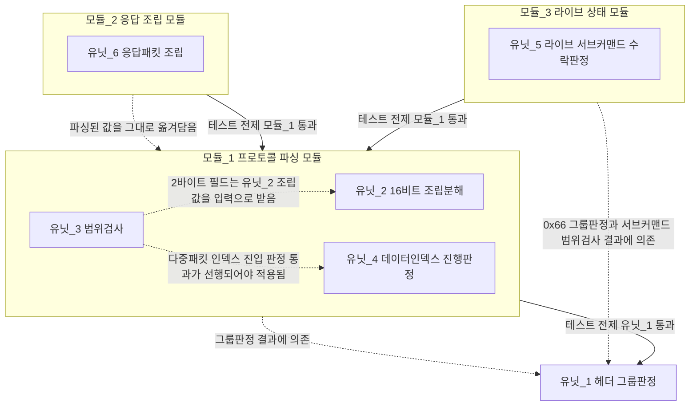

# 유닛-모듈 분해 - BLE 프로토콜 계층

**TL;DR**: `ble/` 코드에서 독립·결정론 입출력을 갖는 부분을 넓게 10개 후보로 추린 뒤 자기점검으로 4개를 덜어내 **최종 유닛 6개**(헤더 그룹판정·16비트 조립분해·범위검사·데이터인덱스 진행판정·라이브 서브커맨드 수락판정·응답패킷 조립)로 확정했다. 이를 **모듈 3개**(프로토콜 파싱·응답 조립·라이브 상태)로 묶고, 명령 실행·자극 FSM 구동·SPI 레지스터 접근은 유닛화 대상 밖의 **로직설명 전용 글루**로 분리했다. 대부분의 유닛이 코드에는 이미 그 로직이 존재하되 **함수로 뽑히지 않은 상태**(인라인 반복)라는 점이 핵심 발견이다.

## 0. 요약

| 항목 | 값 |
|---|---|
| 1차 후보(넓게) | 10개 |
| 최종 유닛 | **6개** (유닛_1~6) |
| 덜어낸 항목 | 4개(§2) |
| 모듈 | **3개** (모듈_1~3) |
| 모듈화 대상 밖(로직설명) | 명령 실행(step) · 자극 FSM 4종 tick 구동 · SPI/DMA/NVIC 레지스터 접근 |
| 기존에 이미 올바르게 분리된 선례 | `tdc_ble_gain_control.c` (`gc_is_valid_request()` 등, §5) |

## 1. 유닛 1차 후보 (넓게 도출)

방법론 §6("독립성이 자연스러운 곳만 유닛으로 가른다")을 적용하기 전, 과제 안내 후보 + 실코드 정독으로 확인한 10개를 우선 나열한다.

| # | 후보명 | 근거 위치 | 비고 |
|---|---|---|---|
| 후보_1 | 헤더 -> 그룹 판정 | `tdc_ble_communication.c:291-345` | 채택(유닛_1) |
| 후보_2 | 페이로드 필드 추출(1바이트, 오프셋->값) | 예 `tdc_ble_mapping.c:131-135` | 덜어냄(§2) |
| 후보_3 | 범위 검사(값 -> 유효/무효) | 예 `tdc_ble_mapping.c:140-159`, `:239-296` | 채택(유닛_3) |
| 후보_4 | 16비트 조립/분해(상위·하위 바이트 <-> 정수) | 예 `tdc_ble_mapping.c:136-137`, `:370-372` | 채택(유닛_2) |
| 후보_5 | 응답 패킷 조립(헤더+데이터 -> 바이트열) | 예 `tdc_ble_mapping.c:700-708`, `:1838-1840` | 채택(유닛_6) |
| 후보_6 | 데이터 인덱스 누적 상태 판정(인덱스 -> 완결 여부) | `tdc_ble_mapping.c:347-360`, `:1426-1440` | 채택(유닛_4) |
| 후보_7 | 라이브 서브커맨드 수락 판정(상태+요청 -> 수락/거부) | `tdc_ble_mapping.c:750,779,805,885` | 채택(유닛_5) |
| 후보_8 | 자극 파라미터 범위 강제(원값 -> 클램프값) | `tdc_ble_mapping.c:807-871`(추정 대응 코드) | 덜어냄(§2) - 실제로는 클램프가 아님 |
| 후보_9 | TX 로컬 버퍼 바이트 append(glue) | 예 `tdc_ble_mapping.c:700-707` | 덜어냄(§2) - 유닛_6에 흡수 |
| 후보_10 | 에러 응답 6바이트 조립 | `tdc_sys_error.c:147-173`(sys 소관) | 덜어냄(§2) - 이미 존재하는 외부 자산 |

## 2. 과도 추상화 자기점검 - 덜어낸 항목

방법론 §6·요구사항의 "테스트하려고 쪼개지 마라"를 각 후보에 적용한 결과다.

| 후보 | 덜어낸 이유 |
|---|---|
| 후보_2(1바이트 필드 추출) | `Rx_dataPacket[index++]`는 변환이 없는 배열 접근 그 자체다. 순수성을 논할 대상이 없고, 함수로 감싸면 "테스트용 포장"에 불과하다(방법론 §6 위반). 실제 로직(비트 연산)이 있는 2바이트 필드만 유닛_2로 남긴다 |
| 후보_8(자극 파라미터 클램프) | 전수 grep(`clamp`/`Clamp`/`CLAMP`) 결과 이 저장소에 **클램프 자체가 존재하지 않는다**(0건). 과제가 예상한 "원값 -> 클램프값"에 대응하는 실제 코드(`tdc_ble_mapping.c:807-871`, 알림 자극 안전범위 계산)는 클램프가 아니라 **범위 밖이면 거부**이며, 그 판정 기준값(`max_C_uA`/`min_T_uA`)조차 `tdc_shm_get_pointer_current_map_data()`로 그때그때 공유메모리를 읽어야 나오는 **비순수** 로직이다(전역 상태 의존, 방법론 §2.1 "순수 로직 권장"의 반례). 이 계산 자체를 유닛으로 승격하지 않고, 계산된 두 값을 유닛_3(범위검사)에 넘기는 글루로만 분류한다 |
| 후보_9(TX 버퍼 append) | 배열 대입 + 인덱스 증가뿐으로 분기가 없다. 방법론 §6 "간단한 glue는 하드코딩해도 된다"에 정확히 해당해 별도 유닛으로 뽑지 않고 유닛_6(응답패킷 조립) 안의 구현 디테일로 둔다 |
| 후보_10(에러 응답 6바이트 조립) | `tdc_sys_error_send_to_app()`이 이미 `tdc_sys_error.c:147-173`에서 순수 함수로 존재한다(입력: 명령·대분류·소분류·라인번호, 출력: 6바이트). `ble/`가 아니라 `sys/` 소관이라 이번 재설계에서 새로 유닛화할 대상이 아니며, 모듈_2의 **기존 의존 자산**으로만 인용한다 |

**남은 4개 후보(그룹판정 하나로 유닛_1 확정, 이하 동일)**도 재검토했다: 후보_1(그룹판정)을 조건 9개별로 쪼갤지 검토했으나, 9개 조건 전부 "헤더값 하나 보고 목적지 하나 결정"이라는 동일 성격이라 유닛 하나(입력 헤더, 출력 그룹id)로 충분하다 - 조건마다 쪼개면 개수만 늘리는 억지 분해다.

**결과**: 10개 후보 중 4개를 덜어내 **최종 유닛 6개**로 확정했다. 처음 도출보다 적다는 요구사항 조건을 충족한다.

## 3. 최종 유닛 상세표

| 유닛 | 이름(`tdc_` 접두어, 제안) | 입력 | 출력 | 순수성 | 현재 코드 위치 | 검증 라벨 |
|---|---|---|---|---|---|---|
| 유닛_1 | `tdc_ble_classify_header` | 헤더 바이트(0~255) | 그룹 식별자(설정_30/리모콘_40/매핑_60/사운드1_80/DFU_C0/에러/미정의) | 순수(부작용 없음). **현재는 함수로 뽑히지 않고 if-else 체인으로 인라인** | `tdc_ble_communication.c:291-345` | [유닛테스트] |
| 유닛_2 | `tdc_ble_u16_from_bytes` / `tdc_ble_bytes_from_u16` | (상위바이트,하위바이트) <-> 정수 | 정수 <-> (상위바이트,하위바이트) | 순수. **현재 6곳 이상에 동일 코드가 반복 인라인**됨 | `tdc_ble_mapping.c:136-137`(임피던스), `:184-186,188-190`(eCAP), `:230-232`(특정자극), `:370-372,822-823`(라이브) | [유닛테스트] |
| 유닛_3 | `tdc_ble_is_in_range` | (min, max, value) | 유효/무효(bool) | 순수. **현재 40여 곳에 리터럴 min/max를 박은 if문으로 반복 인라인** | 예 `:140-159`(0x62, 4중첩) · `:239-296`(0x65, 평평한 7개) · `:381-399`(0x66 sub1 idx1) · `:754-756`(0x66 sub3) · `:1467-1506`(0x6D, `switch(i)` 내 필드별) | [유닛테스트] |
| 유닛_4 | `tdc_ble_data_index_progress` | (수신 인덱스, 이전 인덱스, 총 단계 수) | {순서정상 여부, 완결 여부} | 순수. **4개 명령(0x66 sub1·0x68·0x6C·0x6D)에 동형 코드가 반복 인라인**됨(복잡도 실측 문서가 이미 "동형" 지적) | `tdc_ble_mapping.c:347-360`(0x66 sub1) · `:1426-1440`(0x6D) · 0x68(`:967` 이하)·0x6C(`:1163` 이하)에 유사 패턴 | [유닛테스트] |
| 유닛_5 | `tdc_ble_live_subcommand_is_granted` | (현재 층_2 서브상태, 요청 서브커맨드) | 수락/거부(bool) | **현재 비순수** - 전역 `mappingPacket.tdc_isd_map_live_step.subCommand`를 인자가 아니라 직접 참조. 파라미터화하면 순수화 가능 | `tdc_ble_mapping.c:750`(볼륨) · `:779`(감도) · `:805`(알람) · `:885`(이퀄라이저) - 4곳 동일 `if (subCommand==en__HoldOn){...}else{거부}` 패턴 | [유닛테스트](추출 후) / 현재는 [로직설명] |
| 유닛_6 | `tdc_ble_reply_assemble` | (명령 헤더, 페이로드 값들) | TX 바이트 배열 + 길이 | **조립 자체는 순수**(정수 배열 생성, 부작용 없음). 그 다음 `tdc_hal_spi_write_tx_buffer()` 호출부터 HW 경계(§5) | 예 `:700-708`(0x66 sub1 ack) · `:1838-1840`(0x60 연결) · `:1852-1854`(0x61 연결해제) - `tdc_hal_spi_write_tx_buffer()` 호출 9곳 중 6곳이 `[명령, 인덱스]` 관용구(복잡도 실측 문서 인용) | [유닛테스트] |

기존에 **이미 올바르게 분리된 선례**로 `tdc_ble_gain_control.c:76-101`의 `gc_is_valid_request(control_type, gain_type, gain_index)`이 있다 - 전역 비참조, 순수 판정 함수로 유닛_3과 정확히 같은 모양이다. 유닛_2·3·4를 새로 만드는 게 아니라 **이미 이 저장소 안에 검증된 패턴을 `tdc_ble_mapping.c`에 적용하는 것**임을 보여주는 근거다.

## 4. 모듈 후보

| 모듈 | 책임 | 소속 유닛 | 통합 테스트 정의 |
|---|---|---|---|
| 모듈_1 프로토콜 파싱 모듈 | RX 20바이트를 그룹판정 -> 필드추출 -> 범위검사 -> (다중패킷이면) 인덱스 진행판정까지 거쳐, 유효한 값만 패킷 구조체에 적재한다 | 유닛_2, 유닛_3, 유닛_4 (진입점은 유닛_1의 결과에 의존) | 유닛_2·3·4를 모두 살아있는 채로 실제 명령 패킷(예 0x6D 15단계)을 순서대로 흘렸을 때, 각 유닛이 단독 테스트 때와 동일한 결과(조립값·유효판정·진행판정)를 내는지 확인 |
| 모듈_2 응답 조립 모듈 | 파싱·실행 결과를 프로토콜 규약(헤더 에코, 0x30 예외)에 맞는 TX 바이트열로 변환한다. HW 송신 호출은 이 모듈 바깥의 1줄 glue로 위임 | 유닛_6 | 여러 명령(0x60·0x61·0x66 sub1 등)의 응답을 연달아 조립해도 각 조립 결과가 로그 7종의 실측 바이트열과 일치하는지 |
| 모듈_3 라이브 상태 모듈 | 라이브 서브커맨드 9종의 수락/거부 판정을 하나의 계약(허용 선행 상태 테이블)으로 통일한다(재구조화 설계안 단계_4의 실행 단위) | 유닛_5 | 서로 다른 현재상태(대기·자극유지·시작처리중 등)에서 서브커맨드 3~6 요청을 번갈아 넣어도, 4곳에 흩어져 있던 판정이 하나로 통일된 뒤에도 각각 원래와 동일하게 동작하는지 |

**모듈화 대상 밖(로직설명 전용)**: 명령 실행(`tdc_ble_mapping_step()`), 자극 FSM 4종 tick 구동(`:1902,1919,1943,1956`), SPI/DMA/NVIC 레지스터 접근(`tdc_ble_communication.c:352-391`)은 하드웨어·전역상태·FSM 타이밍에 강하게 결합돼 있어 유닛/모듈로 분해하지 않는다. §5에서 별도로 다룬다.

## 5. 의존성 그래프

근거: 모듈_1 내부 유닛 간 관계는 §1·§3의 코드 위치, 모듈_3과 유닛_1의 관계는 `tdc_ble_mapping.c:309-338`(0x66 진입 시 서브커맨드 1~9 범위검사가 유닛_3 재사용), 모듈_2와 모듈_1의 관계는 응답이 파싱 결과값을 그대로 옮겨 담는다는 패킷 구조와 응답 규약 문서 §4.

## 6. 테스트 순서

"A는 B 통과 전제" 형식.

| 순서 | 대상 | 전제 조건 | 검증 방법 | 테스트 벡터 예시 |
|---|---|---|---|---|
| 1 | 유닛_1 헤더 그룹판정 | 없음(최상위) | [유닛테스트] | `0x66`->매핑그룹, `0x45`->리모콘그룹, `0x8C`->리모콘경유(게인), `0x37`->미정의(폐기) |
| 2 | 유닛_2 16비트 조립분해 | 없음(독립) | [유닛테스트] | (상위`0x07`,하위`0xD0`) -> `2000`, 역으로 `2000` -> (`0x07`,`0xD0`) |
| 3 | 유닛_3 범위검사 | 2바이트 필드 입력 시 유닛_2 통과 전제 | [유닛테스트] | (min=13,max=255,value=12)->무효, (min=13,max=255,value=13)->유효 |
| 4 | 유닛_4 데이터인덱스 진행판정 | 유닛_1 통과 전제(다중패킷 명령으로 그룹판정된 후) | [유닛테스트] | (recv=1,prev=0,total=15)->순서정상·미완결, (recv=15,prev=14,total=15)->완결, (recv=3,prev=0,total=15)->순서오류 |
| 5 | 유닛_5 라이브 서브커맨드 수락판정 | 유닛_1 통과 전제(0x66 그룹 확정) + 유닛_3 통과 전제(서브커맨드 1~9 범위검사) | [유닛테스트]* | (state=HoldOn, req=StimulationVolumeAdjust)->수락, (state=Standby, req=StimulationVolumeAdjust)->거부 |
| 6 | 유닛_6 응답패킷 조립 | 모듈_1(유닛_1~4) 통과 전제 | [유닛테스트] | (header=0x60, payload=[1]) -> `[0x60,0x01,0,0,...]`, dataSize=2 |
| 7 | 모듈_1 프로토콜 파싱 모듈(통합) | 유닛_1~4 각각 통과 전제 | [통합테스트] | 0x6D 15단계 패킷을 순서대로 연속 주입, 각 단계 판정이 단독 테스트 때와 동일한지 |
| 8 | 모듈_2 응답 조립 모듈(통합) | 모듈_1 통과 전제 | [통합테스트] | 로그 7종 각 명령의 실측 응답 바이트열과 조립 결과 대조 |
| 9 | 모듈_3 라이브 상태 모듈(통합) | 모듈_1 통과 전제(0x66 서브커맨드 파싱 확정) | [통합테스트] | 대기->시작->볼륨조절->정지 순서를 연속 주입해 유닛_5 판정이 매 단계 원래대로인지 |
| 10 | 시스템(전 모듈 통합) | 모듈_1~3 전부 통과 전제 | [통합테스트]/[로직설명](FSM·HW 글루 구간) | 실측 RTT 로그 7종(연결·라이브·특정자극·라이브+알람+볼륨·연결해제·임피던스 개별·전체) 재현 |

\* 유닛_5는 현재 비순수(§3)이므로 실제 [유닛테스트]가 가능해지려면 먼저 파라미터화 추출이 선행돼야 한다 - 그 전까지는 [로직설명]으로만 검증 가능하다.

## 7. 하드웨어 격리 경계

방법론 §7.1 "순수 계산과 하드웨어 접근을 한 함수에 섞지 않는다"가 깨진 지점 3곳과 해법이다.

| # | 위반 지점 | 현재 상태 | 제안 |
|---|---|---|---|
| 위반_1 | 파서가 SPI 송신을 직접 호출 | 응답 조립(정수 배열 채우기)과 `tdc_hal_spi_write_tx_buffer()` 호출이 같은 코드 블록에 섞여 있다. 9곳 중 예 `:700-708`(0x66 sub1), `:1838-1840`(0x60), `:1852-1854`(0x61) | 조립(유닛_6, 순수)과 송신(HW 호출 1줄)을 **함수 경계로만** 분리한다. 호출 순서는 그대로 유지: `len = tdc_ble_reply_assemble(buf, ...); tdc_hal_spi_write_tx_buffer(buf, len);`. 재구조화 설계안 단계_2의 개념 스케치(`tdc_ble_reply_begin/u8/u16`)와 정합 |
| 위반_2 | 파서가 자극 FSM을 매 tick 구동 | `tdc_ble_mapping_step()`의 switch가 그 tick 안에서 `tdc_isd_map_*_step()` 4종을 직접 호출 - `tdc_ble_mapping.c:1902`(임피던스) · `:1919`(eCAP) · `:1943`(특정자극) · `:1956`(라이브), 이번 정독으로 4곳 모두 재확인 | 이번 유닛/모듈 설계 범위에서는 **분리하지 않는다**(재구조화 설계안 단계_5, 고위험·별도 판단 유지). 대신 모듈_1·2·3이 이 4개 호출과 **무관하게 독립적으로 테스트 가능**하다는 것 자체가 이번 설계의 성과다 - 지금은 fetch/step이 한 파일에 있어 이 경계가 안 보이지만, 모듈이 분리되면 "모듈_1 테스트는 FSM 호출 없이 가능"이 명시적으로 드러난다 |
| 위반_3 | 파서가 SPI/DMA/NVIC 레지스터를 직접 조작 | `tdc_ble_communication.c:352-391`(`SPI_CMMM_ERROR` 케이스) - `NVIC_DisableIRQ`(`:361`) · `Sys_SPI_TransferConfig`(`:364,383`) · `Sys_DMA_Mode_Enable`(`:366-367`) · `NVIC_ClearPendingIRQ`(`:369-371,385`) · `SPI1->STATUS`(`:374`) · `NVIC_EnableIRQ`(`:386`) 직접 대입, 이번 정독으로 재확인. 헤더 디스패치 로직과 섞여 있지는 않다(이미 별도 `case` 블록)는 점은 위안 |
| | | | 소속 폴더 자체가 계층 위반이다 - `hal/` 래퍼가 있어야 할 레지스터 접근이 `ble/tdc_ble_communication.c`에 있다. 이 블록 전체를 `tdc_hal_spi_recover_from_error()`(가칭)로 `hal/tdc_hal_spi.c`에 옮기고 `communication.c`는 호출 1줄만 남긴다 - 재구조화 설계안 단계_1b(함수 추출)와 같은 위험도(`.elf` 바이트 동일 불성립, 디스어셈블 대조 필요) |

**이미 올바른 예시**: `tdc_ble_gain_control.c`는 `gc_is_valid_request()`(순수 판정) · `gc_write_index()`(공유메모리 glue) · `gc_save_to_file()`(파일시스템 glue)를 이미 함수 경계로 분리해 놓았다(`:76-101`, `:113-123`, `:126-150`). `tdc_ble_mapping.c`에 없는 것은 새 패턴이 아니라 **이미 검증된 패턴의 적용**이다.

## 8. 근거 및 관련 문서

- `E:\workspace\rules\지침\코딩\밸리데이션 계층화.md` - 적용 방법론(§2·§3·§5·§6·§7.3)
- `docs/참고/ble/코드구조/복잡도 실측.md` - `fetch_packet` 함수 인벤토리·데이터 인덱스 분기 비중·순환복잡도
- `docs/참고/ble/코드구조/결합도와 계층 경계.md` - `isd/`·`cfx_link/` 결합, 자극 계통 접점 3종
- `docs/참고/ble/코드구조/아키텍처와 디스패치.md` - fetch/step 2단 구조, 9분기 디스패치
- `docs/참고/ble/프로토콜/패킷 구조와 응답 규약.md`, `명령 카탈로그.md` - 21바이트 레이아웃, 명령 63개 전수
- `docs/참고/ble/라이브모드/상태머신 사양.md` - 라이브 4층 상태·서브커맨드 9종 전수·재진입 가드
- `docs/참고/ble/재구조화/재구조화 설계안.md` - 6단계 로드맵(이번 유닛/모듈 설계가 정밀화하는 대상)
- 직접 정독 확인: `tdc_ble_mapping.c`(52-408, 690-960, 1422-1511, 1777-1990), `tdc_ble_mapping.h`(전체), `tdc_ble_communication.c`(280-399), `tdc_ble_gain_control.c`(전체), `tdc_isd_map_live.c`(1-30, 125-224) - 참고 문서의 인용 라인을 이번 세션에서 재확인해 일치함을 검증했다
