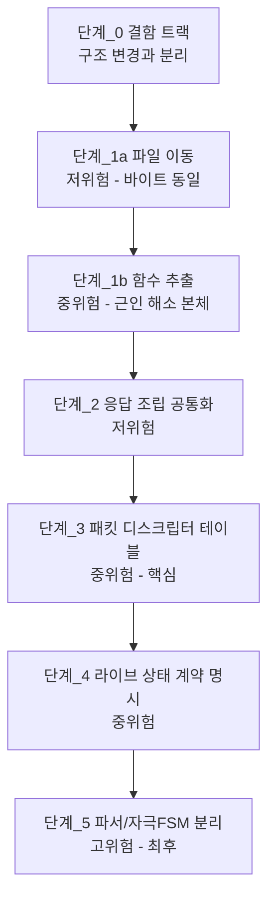

# ⑤ 계획 - BLE 프로토콜 재구조화 설계안

**TL;DR**: 재구조화를 **5단계 로드맵**으로 제시한다. 핵심 설계는 ① 헤더 그룹별 폴더 분할, ② **패킷 디스크립터 테이블**로 데이터 인덱스 분기 흡수, ③ **층간 계약을 코드로 승격**해 라이브 상태 4층을 명시화, ④ 파서와 자극 FSM 구동 분리. 단계마다 동작 보존 위험도와 검증 방법을 붙였다. **이번 작업의 산출은 설계 문서까지이며 코드는 변경하지 않는다.**

---

## 1. 이번 단계(⑦ 구현)에서 실제로 할 일

> [!IMPORTANT]
> **이번 작업의 ⑦ 구현은 코드가 아니라 문서 저술이다.** 은수님 결정(2026-07-27): 종료 지점은 분석·설계까지, 코드 무변경.
>
> 아래 §3 로드맵은 **후속 작업을 위한 설계안**이며, 이번에 실행하지 않는다.

| # | 산출물 | 위치 |
|---|---|---|
| 산출_1 | 프로토콜 레퍼런스 (명령 전수 카탈로그 · 그룹 체계 · 패킷 구조 · 응답 규약) | `docs/참고/ble/프로토콜/` |
| 산출_2 | 코드 구조 해부 (아키텍처 · 디스패치 · 복잡도 실측 · 결합도) | `docs/참고/ble/코드구조/` |
| 산출_3 | **라이브모드 상태머신 사양** (4층 · 서브커맨드 · 전이 · 알람/볼륨) | `docs/참고/ble/라이브모드/` |
| 산출_4 | 재구조화 설계안 (본 문서 §3 을 영속 문서로 승격) | `docs/참고/ble/재구조화/` |
| 산출_5 | `docs/참고/ble/README.md` 갱신 (하위 폴더 인덱스 추가) | 기존 파일 |
| 산출_6 | `docs/tasks/ble/작업 목록.md` 신규 생성 (모듈 인덱스 부재 해소) | ② 검증 보완_1 |

---

## 2. 설계 원칙

분석 §8 제약과 ④ 검증 이월 조건에서 도출했다.

| # | 원칙 | 근거 |
|---|---|---|
| 원칙_1 | **프로토콜 규약은 불변.** 명령 코드·페이로드 레이아웃·응답 형식을 바꾸지 않는다 | 앱·리모콘과 공유. 규약 §2.1 |
| 원칙_2 | **데이터 인덱스 분기는 제거가 아니라 흡수.** 20바이트 MTU 제약은 사라지지 않는다 | 분석 §4.2 |
| 원칙_3 | **동작 보존이 기본값.** 동작 변경은 별도 트랙으로 분리하고 명시 승인을 받는다 | 자극 계통 안전 |
| 원칙_4 | **결함 수정과 구조 리팩토링을 섞지 않는다.** 섞으면 회귀 원인 규명이 불가능해진다 | 이월조건_5 |
| 원칙_5 | **`isd/` 역결합 해소 없이는 폴더 분할이 완결되지 않는다** | 이월조건_3 · 분석 §6.2 |
| 원칙_6 | 단계마다 **되돌릴 수 있는 크기**로 자른다. 각 단계 종료 시 빌드·실기 게이트 통과 | 2차 리팩토링 노하우 |

---

## 3. 재구조화 로드맵 (후속 작업 설계안)



### 단계_0 - 결함 트랙 (구조 변경과 분리)

분석 §7 의 결함 13건을 구조 리팩토링과 **분리해** 먼저 처리한다. 구조를 바꾼 뒤 처리하면 회귀인지 원래 결함인지 구분이 안 된다.

| 결함 | 조치안 | 위험 |
|---|---|---|
| 결함_1 (0x90 핸들러 부재) | 은수님 판단 대기 (미결_3). 핸들러 구현 or 현상 유지. **정의는 존치** | 낮음 |
| 결함_2 (0x51·0x53·0x58 부재) | 실제 사용 여부 확인 후 핸들러 구현 or 미지원 명문화 | 낮음 |
| 결함_4 (라이브 Stop 거부) | **선행: 위험 창 길이 정량화**(미확인_2). 그 뒤 가드 조건에 `en__Stop` 예외 추가 검토 | **중** - 자극 정지 관련 |
| 결함_3·13 (로그 출력) | `[20]` 접근 제거, TX 출력에 `& 0xFF` 추가 | 낮음 |
| 결함_5 (0x64 무동작) | 미지원 명문화 or 구현 | 낮음 |
| 결함_6·7·10·11·12 | 주석 정정 · 도달 불가 분기 정리 · 이름 정정 검토 | 낮음 |
| 결함_8·9 (버퍼/포인터) | 명령 유실·NULL 역참조 실재 여부 실측 후 판단 | 낮음 |

**검증**: 각 결함마다 재현 절차 + 수정 후 실기 확인. 로그 7종과 대조.

### 단계_1 - 파일 분할

> [!CAUTION]
> **⑥ 검증에서 자기모순이 적발돼 두 단계로 분리했다.** 최초안은 "순수 이동이므로 `.elf` 바이트 동일로 검증"이라 했으나, `fetch_packet` 이 **단일 1,724줄 함수**라 명령별로 파일을 나누려면 **함수 추출이 필수**다. 함수 추출은 인라인·레지스터 할당을 바꾸므로 바이트 동일이 성립하지 않는다.

| 하위 단계 | 내용 | 위험 | 바이트 동일 |
|---|---|---|---|
| **단계_1a** | 기존 파일을 폴더로 **옮기기만** 한다. 파일 내부 분할 없음 | 낮음 | **성립** |
| **단계_1b** | `fetch_packet`/`step` 의 case 블록을 명령별 static 함수로 **추출**한 뒤 파일 분할 | **중** | **불성립** |

> [!NOTE]
> **단계_1a 만 하고 멈추면 실익이 거의 없다.** 근인_1(함수 분해 부재) 해소의 실체는 1b 에 있다. 1a 는 1b 의 안전한 준비 단계로만 의미가 있다.

**폴더안** (단계_1a 는 파일 이동만, 단계_1b 에서 `mapping/` 내부가 3개로 갈라짐)

```
ble/
├── tdc_ble_communication.c/.h      디스패치 (유지)
├── tdc_ble_protocol.h              프로토콜 정의 (유지, 불가침)
├── system/                         Ezairo_BT_30 (0x30~0x36)
│   └── tdc_ble_system_info.c/.h    현 communication.c 의 setting_nrf_ble_adv_info 분리
├── remote/                         통신 프로토콜_40 (0x40~0x59)
│   ├── tdc_ble_remote.c/.h
│   └── tdc_ble_remote_sp_para.c/.h
├── mapping/                        매핑 프로토콜_60 (0x60~0x72, 0x91)
│   ├── tdc_ble_mapping.c/.h        디스패치 + 공통
│   ├── tdc_ble_map_flash.c/.h      0x68·0x69·0x6A·0x6C·0x6D (슬롯·맵 읽기/쓰기)
│   ├── tdc_ble_map_measure.c/.h    0x62·0x63·0x64 (임피던스·eCAP)
│   └── tdc_ble_map_stim.c/.h       0x65·0x66 (특정자극·라이브)
└── sound1/                         SOUND1_80 (0x8C·0x8F)
    ├── tdc_ble_gain_control.c/.h
    └── tdc_ble_general_debug.c/.h
```

> [!NOTE]
> **`mapping/` 내부를 기능별로 더 쪼갠 이유**: 헤더 그룹만으로 나누면 `tdc_ble_mapping.c` 2,196줄이 그대로 남는다. 근인_1 이 해소되지 않는다.

**위험 및 대응**

| 위험 | 대응 |
|---|---|
| 새 폴더 `-I` 누락 -> 빌드 실패 | `.cproject` 에 **컴파일러·어셈블러 각각** 등록 (규약 §8) |
| 헤더명 전역 유일 규약 위반 | 신규 헤더명 사전 grep |
| `Debug/*/subdir.mk` 미갱신 | CLI 빌드 시 갱신 필요. Eclipse 재빌드 시 자동 |
| 전역 변수(`mappingPacket`)가 파일 경계를 넘음 | 접근자 함수로 노출하되 **단계_1 에서는 `extern` 유지**(변경 최소화) |
| 함수 추출 시 전역 의존 누락 (단계_1b) | 추출 대상마다 **읽는 전역·쓰는 전역을 표로 명시**한 뒤 대조 |

**검증**

| 단계 | 방법 |
|---|---|
| 단계_1a | **`.elf` 바이트 동일.** 2차 리팩토링 노하우_2 의 라인 보존 대조본 기법. `__LINE__` 이동분 제외 시 md5 일치가 나와야 한다 |
| 단계_1b | ① **디스어셈블 대조** - 니모닉·호출 시퀀스·분기 구조를 함수 단위 비교(노하우_3: 크기 증감만으로 판단 금지) ② **로그 7종 전 시나리오 재현** - 응답 바이트열·로그 문구 완전 일치 ③ **추출 함수 입출력 계약 표** 작성 후 누락 확인 ④ 브레이스 균형·전처리 깊이 검산(노하우_4) |

### 단계_2 - 응답 조립 공통화 (저위험)

보조_4 해소. 에러 응답은 이미 `tdc_sys_error_send_to_app()` 로 공통화돼 있으나 **정상 응답은 명령마다 손으로 조립**한다.

**설계**: `tdc_ble_general_debug.c` 의 검증된 패턴("패킷 포인터 주입 + `tx_index` 반환")을 응답 빌더로 승격한다.

```c
/* 개념 스케치 - 확정 시그니처 아님 */
int tdc_ble_reply_begin(int *tx_buf, int header);          // 헤더 에코
int tdc_ble_reply_u8(int *tx_buf, int idx, int v);
int tdc_ble_reply_u16(int *tx_buf, int idx, int v);        // 상위/하위 바이트 분해 공통화
void tdc_ble_reply_send(const int *tx_buf, int idx);
```

**검증**: 응답 바이트열이 **로그 7종과 완전 일치**해야 한다. 실측 로그가 기준선이다.

### 단계_3 - 패킷 디스크립터 테이블 (중위험, 핵심)

원칙_2 실행. 근인 해소의 본체다.

**설계 개념**: 명령 x 데이터 인덱스 조합마다 "이 위치에 이 필드가 온다"를 **데이터로 선언**하고, 파싱 코드는 그 테이블을 순회하는 단일 루프로 만든다.

```c
/* 개념 스케치 */
typedef struct {
    uint8_t  data_index;      // 0 = 인덱스 미사용
    uint8_t  offset;          // 패킷 내 시작 위치
    uint8_t  width;           // 1 or 2 바이트
    uint16_t min, max;        // 범위 검사 (0,0 = 검사 없음)
    size_t   field_offset;    // 대상 구조체 필드 오프셋
} tdc_ble_field_desc_t;
```

> [!CAUTION]
> **타입 정합을 먼저 결정해야 한다.** 위 스케치는 `uint8_t`/`uint16_t` 를 쓰지만, 이 프로젝트의 BLE 패킷은 **`int` 배열**(`tdc_hal_spi.c:22`)이고 페이로드 구조체 필드도 전부 `int` 다(`tdc_ble_mapping.h:10-107`). **타입을 좁히는 것 자체가 동작 변경 위험**(부호 확장·범위 검사 경계)이므로, 기존 `int` 관행을 유지할지 여부를 설계 착수 시 선결한다.

**효과**: 범위 검사 중첩(최대 9단)과 인덱스별 분기가 테이블로 흡수된다. `fetch_packet` 1,724줄의 대부분이 여기 해당한다.

**가독성 대응**: 테이블 주도 코드는 흐름 추적이 어려워질 수 있다(⑥ 검증 반증_2). 이를 상쇄하기 위해 **테이블을 프로토콜 문서와 1:1 대응**시키고, 각 엔트리 주석에 데이터 인덱스 번호를 명시한다. ⑦ 산출_1 프로토콜 레퍼런스가 그 대응표 역할을 한다.

**위험**: **중.** 파싱 결과가 한 필드라도 달라지면 자극 파라미터가 틀어진다.

**검증**:
1. 명령 x 인덱스 전 조합에 대해 **기존 코드와 신규 테이블의 파싱 결과를 비교하는 오프라인 테스트**를 `tests/` 에 작성
2. 로그 7종의 실제 패킷을 입력으로 넣어 결과 구조체 바이트 비교
3. 실기 게이트

> [!CAUTION]
> 단계_3 은 **`.elf` 바이트 동일이 성립하지 않는다.** 동작 등가는 테스트로만 보증된다. 이 단계부터는 검증 방식이 바뀐다.

### 단계_4 - 라이브 상태 계약 명시 (중위험)

근인_2 해소. 이월조건_2.

**설계**: 층간 규칙을 코드로 승격한다.

| 현재 | 설계안 |
|---|---|
| "볼륨은 HoldOn 일 때만" 이 각 case 안 조건문에 흩어짐 | 서브커맨드별 **허용 선행 상태 테이블**로 선언 |
| 4층 관계가 암묵적 | 층별 상태 조회·전이 인터페이스를 명시 (`tdc_ble_live_get_state()` 등) |
| 재진입 가드가 최상위에 한 덩어리(`:89-112`) | 명령별 수락 조건의 일부로 편입 |

**위험**: 중. 상태 전이 타이밍이 바뀌면 자극 제어에 영향.

**검증**: 로그 7종의 상태 전이 시퀀스 재현 + 알람/볼륨 경합 시나리오 신규 실측(미확인_5).

### 단계_5 - 파서와 자극 FSM 분리 (고위험, 최후)

근인_3 · 원칙_5. **가장 어렵고 가장 위험하다.**

**현재**: `tdc_ble_mapping_step()` switch 가 매 tick `tdc_isd_map_*_step()` 4종을 직접 호출하고, 반대로 `isd/` 6파일이 `ble/` 상태를 56회 참조·클리어한다.

**설계 방향** (택일은 후속 판단)

| 안 | 내용 | 장점 | 단점 |
|---|---|---|---|
| 안_1 | 자극 FSM tick 구동을 `main` 루프로 올리고, `ble/` 는 명령 큐만 전달 | 계층 정상화 | 호출 순서 변화 -> 타이밍 회귀 위험 |
| 안_2 | `ble/` 와 `isd/` 사이에 **중재 계층**(`tdc_map_session`) 신설, 양쪽이 그것만 참조 | 점진 적용 가능 | 계층 하나 추가 |
| 안_3 | 현상 유지 + 경계를 문서화만 | 위험 0 | 근인 미해소 |

**위험**: **높음.** 자극 FSM 의 tick 순서·주기가 바뀌면 실기에서만 드러나는 회귀가 난다.

**검증**: 단계별 실기 게이트 필수. 로그 7종 전 시나리오 재현 + 자극 파형 실측.

---

## 4. 권고 순서와 판단 지점

| 순위 | 단계 | 위험 | 권고 |
|---|---|---|---|
| 1 | 단계_0 결함 트랙 | 낮~중 | **먼저 하는 것이 맞다.** 특히 결함_4 위험 창 정량화 |
| 2 | 단계_1a 파일 이동 | 낮음 | `.elf` 바이트 동일로 검증되므로 안전. 즉시 착수 가능. **단 이것만으로는 실익이 거의 없다** |
| 3 | 단계_1b 함수 추출 | **중** | 근인_1 해소의 본체. 4중 검증 필요 |
| 4 | 단계_2 응답 공통화 | 낮음 | 단계_1b 와 묶어도 무방 |
| 5 | 단계_3 디스크립터 테이블 | 중 | **효과 최대.** 단 `tests/` 인프라 선행 필요 |
| 6 | 단계_4 상태 계약 | 중 | 단계_3 이후 |
| - | 단계_5 FSM 분리 | **높음** | **별도 판단.** 실익 대비 위험이 커서 안_3(문서화만)도 유효한 선택지 |

> [!IMPORTANT]
> **단계_3 부터는 `tests/` 인프라가 전제**다. 현재 `tests/` 는 사실상 비어 있다. 오프라인 파싱 테스트 없이 디스크립터 테이블로 가는 것은 권하지 않는다.

---

## 5. 이번 작업 ⑦ 구현 계획 (문서 저술)

| 순서 | 작업 | 산출 |
|---|---|---|
| 1 | `docs/참고/ble/` 하위 폴더 4개 개설 + 각 README | 구조 |
| 2 | 프로토콜 레퍼런스 저술 (노드 01 카탈로그 정제) | 산출_1 |
| 3 | 코드 구조 해부 저술 (노드 02·03·05·07 종합) | 산출_2 |
| 4 | **라이브모드 상태머신 사양 저술** (노드 04·06 종합) | 산출_3 |
| 5 | 재구조화 설계안 승격 (본 문서 §2~§4) | 산출_4 |
| 6 | `docs/참고/ble/README.md` 갱신 | 산출_5 |
| 7 | `docs/tasks/ble/작업 목록.md` 신규 + `모듈 현황.md` 갱신 | 산출_6 |
| 8 | 커밋 (병합 전 은수님 확인) | - |

**품질 기준**: ② 검증 보완_2 의 조작적 정의를 따른다. (가) 대상이 `파일:라인` 으로 특정될 것, (나) 각 단계의 선행 조건과 검증 방법이 있을 것, (다) 불가침 항목이 명시될 것.

---

## 6. 이번 작업에서 하지 않는 것

| # | 항목 | 사유 |
|---|---|---|
| 제외_1 | 소스 코드 변경 일체 | 은수님 결정 |
| 제외_2 | 결함 수정 | 단계_0 로 분리, 후속 판단 |
| 제외_3 | 프로토콜 규약 변경 제안 | 앱·리모콘 공유, CM3 단독 결정 불가 |
| 제외_4 | `tests/` 인프라 구축 | 단계_3 선행 조건이나 이번 범위 밖 |
| 제외_5 | 미확인 6건의 실측 | 실기 환경 필요 (은수님 게이트) |
