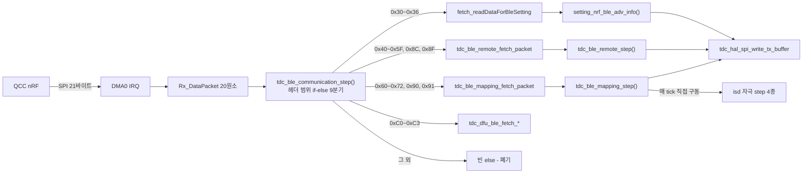
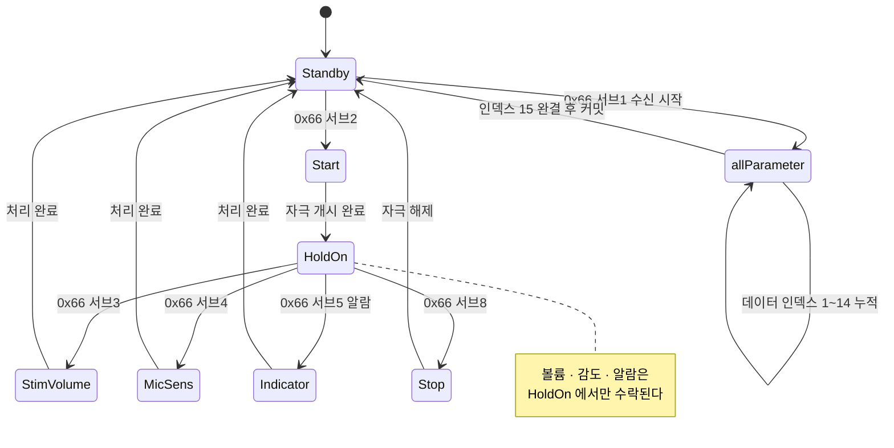

# ③ 분석 - BLE 프로토콜 구조

**TL;DR**: 복잡도의 주원인은 은수님 가설대로 **데이터 인덱스 분기**가 맞았다(비-라이브 결정 포인트의 58.6%). 다만 그것은 **증상이고 근인은 세 가지**다 - ① 함수 분해 부재(`fetch_packet` 단일 함수 1,724줄), ② 상태가 4개 층에 흩어짐, ③ **프로토콜 파서가 자극 실행 엔진의 tick 드라이버를 겸함**. 그리고 재구조화의 최대 걸림돌은 `ble/` 내부가 아니라 **`isd/` 와 하나의 상태머신을 공유**한다는 사실이다(역호출 56회).

---

## 1. 분석 방법

7노드 병렬 fan-out + 오케스트레이터 직접 재검증 8건. 노드 산출물과 교차 검증 내역은 [`에이전트-로그/인덱스.md`](에이전트-로그/인덱스.md).

**근거 등급**을 표기한다. `확정` = 노드 2개 이상 독립 도달 또는 오케스트레이터 재검증 완료. `채택` = 단일 노드 발견이나 근거 라인 명시. `미확인` = 근거 미확보.

---

## 2. 아키텍처 현황

### 2.1 전체 골격

CM3 의 BLE 처리는 **fetch/step 2단 구조** 하나로 통일돼 있다. 이것 자체는 일관된 설계다.

| 계층 | 구성 | 근거 |
|---|---|---|
| HAL | `tdc_hal_spi.c` - DMA 기반 21바이트 송수신, 순수 바이트 파이프 | `tdc_hal_spi.c:159-164` |
| 디스패치 | `tdc_ble_communication_step()` 의 헤더 범위 if-else 9분기 | `tdc_ble_communication.c:291-345` |
| 파싱(fetch) | 명령별 페이로드를 전역 구조체에 적재 | `tdc_ble_mapping.c:114~` |
| 실행(step) | 매 tick 저장된 명령을 실행하고 응답 조립 | `tdc_ble_mapping.c:1790~` |

호출 주기는 `main.c:586` 에서 CFX FIFO 인터럽트 기반 `iterationFlag` 게이팅으로 tick 당 1회 (약 1ms 추정, 정확한 클럭값 `미확인`).

### 2.2 규모 (확정)

| 파일 | 줄 수 | 비중 |
|---|---|---|
| `tdc_ble_mapping.c` | **2,196** | 47.4% |
| `tdc_ble_remote.c` | **1,389** | 30.0% |
| `tdc_ble_communication.c` | 474 | 10.2% |
| `tdc_ble_remote_sp_para.c` | 272 | 5.9% |
| `tdc_ble_general_debug.c` | 156 | 3.4% |
| `tdc_ble_gain_control.c` | 150 | 3.2% |
| **합계** | **4,637** | |

> [!CAUTION]
> **측정 함정**: PowerShell `Get-Content | Measure-Object -Line` 은 **빈 줄을 세지 않는다.** 최초 측정이 이 함정에 걸려 20% 가까이 적게 나왔고, 서브에이전트 2개가 독립 실측으로 반증했다. 물리 줄 수는 LF 개수로 세야 한다.

---

## 3. 프로토콜 카탈로그와 그룹 체계

### 3.1 그룹 확정안

| 그룹명 | 범위 | 주체 | CM3 처리 | 근거 |
|---|---|---|---|---|
| Ezairo_BT_30 | 0x30~0x36 | QCC <-> E8300 | O (0x30·0x33~0x36) | `tdc_ble_protocol.h:26-46` |
| 통신 프로토콜_40 | 0x40~0x59 | 리모콘 앱 | O | `:48-82` |
| **매핑 프로토콜_60** | 0x60~0x72 **+ 0x91** | 매핑 프로그램 | O | `:84-113` |
| SOUND1_80 | 0x8C · 0x8F | 앱 -> QCC -> E8300 | O (2개만 도달) | `:115-119` |
| OP_C0 | 0xC0~0xC3 | QCC (OTA) | O | DFU 헤더 |
| 믹싱 게인_A0 | 0xA0~0xAF | E8300 | **X - 코드 미실재** | grep 0건 |
| Security | 0xE0~0xEF | QCC <-> 폰/크래들 | X (QCC 전용) | - |
| 공통 에러 | 0xF0 | 전 인터페이스 | O (송신) | `:37` |

### 3.2 그룹 체계와 코드의 불일치 (확정)

| # | 발견 | 상세 |
|---|---|---|
| 불일치_1 | **0xA0 대역은 코드에 없다** | 믹싱 게인 제어는 처음부터 **0x8C(`EN__SND_BT_CMD_GAIN_CONTROL`)** 가 전담한다. 0xA0~0xAF 는 grep 0건. 노드 01·05 독립 확인 |
| 불일치_2 | 0x8C 라우팅이 직관과 어긋난다 | 게인 제어인데 디스패처가 **리모콘 핸들러**(`tdc_ble_remote_fetch_packet`)로 보낸다 (`tdc_ble_communication.c:335-338`) |
| 불일치_3 | 매핑 실제 범위는 0x60~0x72 | 은수님 정의는 0x60~0x7F 이나 디스패처 조건은 `0x60 <= h <= en__mapping_waiting_for_BleOff`(0x72) + 0x90/0x91 OR (`:304-307`) |
| 불일치_4 | 0x90·0x91 은 매핑 열거형에 있으나 0x90 대역 | **0x91 = 매핑 프로토콜_60 에 편입 확정**(2026-07-27 은수님 - 예외적이나 실사용). fetch·step 양쪽 정상 처리. **0x90 은 핸들러 없음**(§7 결함_1)이라 미편입 |

### 3.3 명령 처리 현황

명령 63개 카탈로그화(노드 01, 내부 상태값 0x10 제외). 처리 52 · 정의만 2 · nRF 자체처리 3 · 핸들러 부재 4(0x51·0x53·0x58·0x90, 재검증 완료).

> [!IMPORTANT]
> **핸들러 부재 4건은 성격이 둘로 갈린다.**
>
> | 헤더 | 성격 |
> |---|---|
> | **0x90** | **의도적 미지원.** 2차 리팩토링에서 핸들러를 제거하고 프로토콜 정의만 존치한 확정 결정([`cm3-소스-트리-규약.md:41`](../../../참고/cm3-소스-트리-규약.md)). 디스패처 라우팅이 남아 있어 앱은 명확한 에러 응답을 받는다 |
> | **0x51 · 0x53 · 0x58** | **결함.** 라우팅도 case 도 없어 명령이 무응답으로 멈춘다. `tdc_ble_protocol.h:75` 주석이 증상을 증언 |
>
> 최초 분석은 4건을 동일하게 결함으로 분류했으나 이는 오류였다. **"핸들러가 없다"는 사실과 "결함이다"라는 해석은 별개**이며, 문서화된 설계 결정을 먼저 확인해야 한다.

---

## 4. 복잡도 원인 규명

### 4.1 은수님 가설의 판정: **참 - 최대 기여자다**

> 가설: "프로토콜 패킷에서 데이터 인덱스에 따라 그 구조가 세부적으로 변하기 때문"

**정량 검증 결과 (`채택` - 노드 03 단독 산출, 교차 확인 없음)**

| 지표 | 값 |
|---|---|
| 데이터 인덱스 분기 사용 명령 | 매핑 4개(0x66·0x68·0x6C·0x6D) + 리모콘 2개(0x4C·0x4D) |
| 비-라이브 `fetch_packet` 결정 포인트 중 비중 | **약 59%** |
| 비-라이브 `fetch_packet` 줄 수 중 비중 | **약 48%** |

라이브를 **완전히 배제하고도** 지배적이다. **가설은 참이다.**

> [!NOTE]
> 위 백분율은 단일 노드 산출이라 **소수점 정밀도는 보증되지 않는다**(④ 검증 오표기_1). 다만 "데이터 인덱스 분기가 지배적"이라는 정성적 결론은 오케스트레이터가 코드에서 직접 확인했다. 이 수치에 의존하는 결정은 내리지 않는다.

**노드 05 가 가설의 적용 범위를 넓혔다** - 데이터 인덱스 분기는 매핑만의 문제가 아니라 **BLE 전역 패턴**이다. 리모콘 0x4C·0x4D 도 동일한 다중 패킷 재조립 구조를 쓴다. "매핑이 유독 이상한 것"이 아니라 **20바이트 MTU 에 전극 32채널 데이터를 실어야 하는 프로토콜 제약의 필연적 귀결**이다.

### 4.2 가설이 가리키는 방향: 제거가 아니라 흡수

> [!IMPORTANT]
> **데이터 인덱스 분기는 없앨 수 없다.** 프로토콜이 앱·리모콘과 공유된 규약이고, 20바이트 MTU 는 바뀌지 않는다. 따라서 목표는 **분기를 제거하는 것이 아니라, 흩어진 분기를 한 곳의 데이터(테이블·디스크립터)로 흡수해 코드에서 걷어내는 것**이다.
>
> 이것이 §4.1(가설 참)과 아래 근인 3건이 모순되지 않는 이유다. 가설은 **증상을 정확히 짚었고**, 근인은 **그 증상이 왜 코드를 망가뜨리는가**를 설명한다.

### 4.3 근인 세 가지

같은 양의 분기라도 아래 셋이 없었다면 이만큼 복잡해지지 않았다. 진짜 고칠 수 있는 것들이다.

| 순위 | 근인 | 근거 | 성격 |
|---|---|---|---|
| **근인_1** | **함수 분해 부재** | `tdc_ble_mapping.c` 에 함수가 **6개뿐**이고 `fetch_packet` 하나가 **1,724줄(78%)**. `step` 395줄. 둘이 파일의 97.3% | 순수 구조 문제. 고치기 쉽고 위험 낮음 |
| **근인_2** | **상태가 4개 층에 분산** | §5 참조. BLE 명령 층 / 라이브 서브커맨드 층 / ISD 하드웨어 층 / CFX PCM 출력 층 | 이해 난이도의 주범. 은수님이 "분석이 안 된다"고 한 실체 |
| **근인_3** | **프로토콜 파서가 자극 FSM 을 구동** | `tdc_ble_mapping_step()` switch 가 매 tick `tdc_isd_map_*_step()` 4종을 직접 호출 (`:1902`·`:1919`·`:1943`·`:1956`) | 계층 혼재. 재구조화의 핵심 대상이자 최대 위험 |

**보조 요인** (확정)

| # | 요인 | 근거 |
|---|---|---|
| 보조_1 | 순환 복잡도 `fetch_packet` **약 227** (비-라이브만 약 141), `step` 약 46 | **`추정`** - 노드 03, 라인 패턴 기반이며 도구 미검증. 절대값보다 "함수 2개짜리 파일치고 극단적"이라는 상대 판단에만 쓴다 |
| 보조_2 | 최대 중첩 **9단** | `:1444-1531`(0x6D 인덱스1), `:1856-1881`·`:2058-2083`(워치독 강제 리셋 루프) |
| 보조_3 | `ST__MAPPING_PACKET` 이 8종 페이로드를 union 없이 보유 (약 1,472바이트, union 화 시 약 952바이트) | `tdc_ble_mapping.h:109-121`. **단 이는 메모리 비용이지 복잡도 원인이 아니다** |
| 보조_4 | 정상 응답 조립이 명령마다 손으로 반복 | 노드 05. 에러 응답(0xF0)은 `tdc_sys_error_send_to_app()` 로 **이미 공통화됨** |
| 보조_5 | `fetched_command`/`command` 이중 상태가 **명령마다 일관성 없이** 사용 | 0x68·0x6C 는 정상 파이프라인을 건너뛰고 `command` 직접 기록(`:1129`·`:1377`), 0x6D 만 정상 경로(`:1695`) |

---

## 5. 라이브모드 상태머신

은수님이 "가장 복잡하고 분석이 안 된다"고 한 부분이다. **원인은 상태가 4개 층에 독립 존재하기 때문**이다.

### 5.1 상태 4층 (노드 04, 채택)

| 층 | 상태 변수 | 값 집합 | 소유 |
|---|---|---|---|
| 층_1 BLE 명령 | `mappingPacket.command` | `en__mapping_*` (0x60~0x72) | `ble/` |
| 층_2 라이브 서브커맨드 | `mappingPacket.tdc_isd_map_live_step.subCommand` | 0 Standby / 1 allParameter / 2 Start / 3 StimVolume / 4 MicSens / 5 알람 / 8 Stop / 9 HoldOn | `ble/` (은수님이 말한 Idle·HoldOn 이 여기) |
| 층_3 ISD 하드웨어 | `EN__ISD_CONTROL_STATE` | 전원·램프업 상태 | `isd/` |
| 층_4 CFX PCM 출력 | 공유메모리 PCM 모드 | NopStandby 등 | `cfx_link/` (CFX 소유) |

> [!IMPORTANT]
> **문제는 층이 4개라는 것이 아니다.** 계층화된 상태 자체는 정상 설계일 수 있다. 진짜 문제는 **층간 관계가 코드 어디에도 명시돼 있지 않다**는 점이다.
>
> 어느 층이 어느 층을 선행하는지, 한 층이 바뀔 때 다른 층이 어떻게 따라가야 하는지가 **각 case 안에 흩어진 조건문으로만 암묵적으로 존재**한다. 예컨대 "볼륨 조절은 층_2 가 HoldOn 일 때만 수락된다"(`:750`)는 규칙은 그 case 안에서만 확인되고, 어디에도 층간 계약으로 선언돼 있지 않다.
>
> **은수님이 "분석이 잘 안 된다"고 한 것의 실체가 이것이다.** 코드를 읽어도 층 관계를 재구성해야만 이해되며, 그 재구성은 2,196줄을 전부 읽어야 가능하다.

### 5.2 서브커맨드 체계 (재검증 완료)

`tdc_ble_mapping.c:315-326` 주석과 case 구현이 일치한다.

| 값 | 이름 | 수락 조건 | 근거 |
|---|---|---|---|
| 0 | `en__Standby` | - | `:29` 초기값 |
| 1 | `en__allParameter` | - | `:341` |
| 2 | `en__Start` | - | `:742` |
| 3 | `en__StimulationVolumeAdjust` | **`subCommand == en__HoldOn` 일 때만** | `:750` |
| 4 | `en__MicSensitivityAdjust` | **`en__HoldOn` 일 때만** | `:779` |
| 5 | 알람 (Stimulation Indicator) | **`en__HoldOn` 일 때만** | `:805` |
| 8 | `en__Stop` | 조건 없음 | `:940-942` |
| 9 | `en__HoldOn` | - | - |

> [!NOTE]
> **이름-동작 불일치 발견** (노드 06): 서브커맨드 4 는 이름이 `MicSensitivityAdjust`(마이크 감도)인데 실제로는 `tdc_shm_change_audio_volume()`(오디오 볼륨)을 호출한다.

### 5.3 라이브 서브 상태 전이

`Standby` 가 초기 상태다 (`tdc_ble_mapping.c:29`).

### 5.4 알람·볼륨 처리 (노드 04·06, 채택)

| 기능 | 패킷 | 처리 |
|---|---|---|
| 알람 재생 | `0x66` 서브 `05` (실측: 채널 0x14, 800uA 고정) | 트리거 후 `tdc_stim_indicator.c` 의 **독립 정적 카운터**가 3회 on/off 펄스를 진행. 라이브 서브상태가 도중에 바뀌어도 **물리 출력은 끝까지 진행**(완료 통지는 유실 가능) |
| 자극 볼륨 | `0x66` 서브 `03` | 공유메모리 즉시 덮어쓰기 |
| 오디오 볼륨 | `0x66` 서브 `04` | 공유메모리 즉시 덮어쓰기. CFX 가 매 프레임 변경을 감지해 PCM 을 잠깐 무음(NOP) 처리 후 계수 재계산 |

### 5.5 맵 파라미터 분할 수신의 안전성 (노드 04, 채택 - **양호**)

`en__allParameter` 는 15개 데이터 인덱스로 분할 수신되며, **인덱스 15 가 완결된 다음 tick 에만** 공유메모리로 일괄 커밋된다(`tdc_isd_map_live.c:72-101`). 중간에 끊기면 커밋 자체가 일어나지 않으므로 **미완성 파라미터로 자극이 나갈 위험은 코드상 낮다.**

### 5.6 로그 대조 결과

실측 로그 2종이 코드 흐름과 **100% 일치**했다(노드 04). 순서·조건·응답 바이트 전부 대조. 7종 전체에 에러 응답(0xF0)·재시도·타임아웃이 **전무**하므로(노드 06) 이 로그들은 **깨끗한 회귀 기준선**으로 쓸 수 있다.

> [!CAUTION]
> **로그 해석 함정 2건**
>
> 1. `LINK CHECK TRIGGERED (LIVE, STANDBY)` 의 괄호 안은 런타임 값이 아니라 **고정 리터럴**이다. 호출부는 `tdc_isd_map_live.c:783` 단 한 곳(Standby 케이스). 상태 표시로 읽으면 안 된다
> 2. `[SPI RX]` 줄의 마지막 바이트 `01` 은 **수신 데이터가 아니다**(§7 결함_3)

---

## 6. 인접 모듈 결합도

### 6.1 나가는 의존 (`채택` - 노드 07 단독 집계)

| 모듈 | 호출 수 | 구조적 중요도 |
|---|---|---|
| `sys` | 57 | 낮음 (에러 보고) |
| `util` | 46 | 낮음 (로깅) |
| `cfx_link` | 45 | **높음** (CFX 공유 ABI) |
| `hal` | 44 | **높음** |
| `isd` | 29 | **최고** (양방향 상태 결합) |

공유메모리는 `tdc_shm_*` 접근자를 쓰지만 **접근자를 우회한 직접 필드 접근이 8곳** 있다(`tdc_ble_communication.c:221`, `tdc_ble_gain_control.c`, `tdc_ble_remote.c`).

### 6.2 역결합 - 재구조화 최대 걸림돌 (재검증 완료)

**`ble/` 의 외부 공개 API 는 사실상 `tdc_ble_communication_step()` 하나뿐이다.** 그런데 반대 방향이 거대하다.

| 호출 함수 | isd/ 에서의 호출 |
|---|---|
| `tdc_ble_mapping_get_packet()` · `tdc_ble_mapping_clear_command()` · `tdc_ble_remote_clear_command()` | `isd/` **6개 파일에서 56회** (`tdc_isd_map_data.c` 25 · `tdc_isd_map_ecap.c` 14 · `tdc_isd_map_impedance.c` 10 · `tdc_isd_map_specific_stim.c` 4 · `tdc_isd_map_live.c` 2 · `tdc_isd_init.c` 1) |

> [!IMPORTANT]
> **`ble/` 와 `isd/` 는 하나의 상태머신을 두 폴더에 쪼개 갖고 있다.** `isd/` 가 `ble/` 의 패킷 구조체를 직접 읽고 `ble/` 의 명령 상태를 직접 클리어한다. 폴더 분할 설계는 이 사실을 전제로 세워야 한다.

### 6.3 자극 계통 접점 (재검증 완료 - 안전 최중요)

**`ble/` 는 10V·DAC 레지스터를 직접 만지지 않는다**(`tdc_isd_enable_stimul_10v`·`tdc_isd_path_open` 호출 0건). 그러나 다음 3경로로 자극에 관여한다.

| # | 경로 | 근거 |
|---|---|---|
| 접점_1 | **자극 FSM 4종을 매 tick 직접 구동** | `tdc_ble_mapping_step()` switch: `:1902` impedance · `:1919` ecap · `:1943` specific_stim · `:1956` live |
| 접점_2 | 라이브 자극 안전 경계를 직접 계산·강제 | `:807-871` (CFX 맵 데이터를 읽어 판정) |
| 접점_3 | ISD 전원/10V 상태머신을 간접 재시작 | `isdControlCommand` 반환값을 `main.c` 가 다음 tick 에 소비 (`tdc_ble_communication.c:461`, `tdc_ble_mapping.c:1878`·`:1889`) |

### 6.4 계층 위반 (노드 07, 채택)

| # | 위반 | 근거 |
|---|---|---|
| 위반_1 | BLE 코드가 SPI1/DMA/NVIC 레지스터를 직접 조작 (HAL 우회) | `tdc_ble_communication.c:352-391` SPI 에러 복구 경로 |
| 위반_2 | 프로토콜 파서가 자극 실행 FSM 을 구동 | §6.3 접점_1 |
| 위반_3 | 공유메모리 접근자 우회 8곳 | §6.1 |
| - | 파일시스템 직접 접근 | **없음** (양호) |

---

## 7. 발견된 결함·이상

이번 작업은 코드를 변경하지 않는다. 아래는 **기록**이며 조치는 후속 판단 사항이다.

| # | 심각도 | 결함 | 근거 | 상태 |
|---|---|---|---|---|
| ~~결함_1~~ | **취소** | ~~0x90 핸들러 부재~~ **결함 아님.** [`cm3-소스-트리-규약.md:41`](../../../참고/cm3-소스-트리-규약.md) 이 "`en__mapping_testStimulation`**(핸들러는 제거)**" 로 2차 리팩토링의 **확정 결정**을 이미 기록. 의도적 미지원이며 설계대로 동작한다. 디스패처 라우팅이 남아 있어 앱이 무응답 대신 명확한 에러를 받는 점은 오히려 결함_2 보다 낫다 | 규약 문서 직접 확인 | **분류 오류 정정** |
| 결함_2 | **중** | 리모콘 0x51·0x53·0x58 핸들러 부재로 **명령이 멈춘다**. `tdc_ble_protocol.h:75` 주석이 이미 "0x58 보내면 묵묵부답 타임아웃"이라 증언 | grep `case` 0건 | 확정 |
| 결함_3 | **낮** | `[SPI RX]` 디버그 로그가 20원소 배열의 `[20]` 을 읽음(범위 초과). 전 로그에서 `01` 고정 출력. **기능 영향 없음**(파싱은 `[0..19]` 만 사용), 로그 해석만 오염 | `tdc_hal_spi.c:22` vs `tdc_ble_communication.c:282` | 확정 |
| 결함_4 | **조사 필요** | 라이브 재진입 가드가 **상태 전이 구간에서 `en__Stop` 을 포함한 0x66 을 거부**. 성립 조건은 `command != IDLE` **그리고** 서브상태가 HoldOn/Standby 아님. 예외는 0x61(연결 해제)뿐 | `tdc_ble_mapping.c:89-112` 재검증 | 확정(위험 창 길이는 `미확인`) |
| 결함_5 | **낮** | `en__mapping_eCAP_Measurement_alternative`(0x64) 는 명령을 수락하지만 실행부가 주석 처리돼 **아무 동작도 하지 않는다** | `tdc_ble_mapping.c:1933` | 확정 |
| 결함_6 | **낮** | 리모콘 0x57 핸들러가 매핑 0x71 의 죽은 조건부 블록을 복사해, 상수 대입만 바뀌며 `if` 분기가 **영구 도달 불가** | `tdc_ble_remote.c:1157-1164` | 채택(노드 05) |
| 결함_7 | **낮** | `ST__REMOTECONTROL_STATE` 반환 구조체의 필드가 한 번도 채워지지 않고 항상 초기값 반환 | `tdc_ble_communication.c:432` 주석이 의도로 문서화 | 채택(노드 05) |
| 결함_8 | **낮** | 명령 유실 가능. `Rx_DataPacket` 은 큐가 아닌 단일 버퍼이고 `DMA0_IRQHandler` 가 소비 여부를 확인하지 않고 덮어쓴다. 한 tick 에 2회 이상 수신 시 앞 패킷 유실 | `tdc_hal_spi.c:159-164` | 채택(노드 02) |
| 결함_9 | **낮** | `p_Rx_dataPacket` 이 static 포인터라, 최초 FETCH 이전에 `:450` 에서 NULL 역참조 가능성 | `tdc_ble_communication.c:235`·`:450` | 채택(노드 02, 실제 하드폴트 여부 `미확인`) |
| 결함_10 | **낮** | 주석-코드 불일치: 0x70 의 "헤더 only 패킷" 주석과 달리 실제로 2바이트를 더 읽음 | 노드 01 | 채택 |
| 결함_11 | **낮** | 서브커맨드 4 이름(`MicSensitivityAdjust`)과 동작(오디오 볼륨) 불일치 | 노드 06 | 채택 |
| 결함_12 | **낮** | 응답 형식 비일관: 매핑군은 헤더 에코, 0x30 은 헤더 생략하고 페이로드부터 | 노드 06 | 채택 |
| 결함_13 | **정보** | TX 디버그 로그의 `FFFFFFxx` 표기는 `char->int` 부호확장 + 출력 마스킹(`&0xFF`) 누락 | 노드 06 | 채택 |

> [!WARNING]
> **결함_4 는 자극 정지에 관한 사안**이라 후속 조사 대상 1순위다. 정상 라이브 운용 중에는 서브상태가 `HoldOn` 이므로(볼륨·알람이 HoldOn 에서만 수락되는 것이 방증) Stop 이 정상 동작한다. 위험은 **전이 구간의 길이**에 달렸고, 그 길이는 아직 정량화되지 않았다.

---

## 8. 재구조화 제약 조건

설계(⑤)에서 반드시 지켜야 할 것들이다.

| # | 제약 | 근거 |
|---|---|---|
| 제약_1 | **BLE 프로토콜 정의는 미참조여도 유지** | `참고/cm3-소스-트리-규약.md §2.1` |
| 제약_2 | **`ble/` 만 떼어 옮길 수 없다** - `isd/` 6파일이 `ble/` 상태를 56회 참조 | §6.2 |
| 제약_3 | `ST__MAPPING_PACKET` 필드는 CFX 공유메모리 ABI 를 필드 단위로 미러링 | 노드 07 |
| 제약_4 | 자극 FSM 구동 지점 4곳은 **동작 순서·타이밍 보존 필수** | §6.3 |
| 제약_5 | 새 폴더 추가 시 `.cproject` 의 `-I` 를 **컴파일러·어셈블러 각각** 등록 | `참고/cm3-소스-트리-규약.md §8` |
| 제약_6 | include 는 `<파일명.h>` flat 표기, 헤더명 전역 유일 | 동 §8 |
| 제약_7 | 실측 로그 7종이 회귀 기준선 | §5.6 |

---

## 9. 미확인 사항

| # | 항목 | 영향 |
|---|---|---|
| 미확인_1 | `tdc_ble_communication_step()` 의 정확한 호출 주기(약 1ms 추정) | 결함_4 위험 창 정량화에 필요 |
| 미확인_2 | 결함_4 의 전이 구간 지속 시간 | 자극 정지 지연 실위험도 |
| 미확인_3 | 결함_9 의 실제 하드폴트 발생 여부 | 부팅 안정성 |
| 미확인_4 | 순환 복잡도 227 은 라인 패턴 기반 추정치 (도구 미검증) | 정량 근거 강도 |
| 미확인_5 | 코드에 있으나 로그에 없는 경로 5건 - 알람+볼륨 경합 · 재연결 복구 · Start 타임아웃 · 서브커맨드9 직접 전송 · HoldOn 중 allParameter 재전송 | 상태머신 완전성 |
| 미확인_6 | 결함_13 의 기능 영향 여부 | 로그 신뢰도 |

---

## 10. 결론

1. **은수님 가설은 참이다.** 데이터 인덱스 분기가 복잡도의 최대 단일 요인(58.6%)이다. 다만 이는 20바이트 MTU 라는 프로토콜 제약에서 나온 **불가피한 요구**이며, 매핑만이 아니라 리모콘에도 있는 **전역 패턴**이다.
2. **진짜 고칠 수 있는 것은 셋**이다 - 함수 분해 부재(1,724줄 단일 함수), 상태 4층 분산, 프로토콜 파서의 자극 FSM 구동.
3. **라이브모드가 어려운 이유가 규명됐다.** 상태가 4개 층에 독립 존재하고 층간 관계가 코드 어디에도 명시돼 있지 않기 때문이다.
4. **폴더 분할의 걸림돌은 `ble/` 내부가 아니라 `isd/` 와의 역결합**이다. 헤더 그룹만 보고 폴더를 나누면 `isd/` 가 따라오지 않아 깨진다.
5. **이미 검증된 재구조화 템플릿이 사내에 있다.** `tdc_ble_general_debug.c`(2026-07-01 분리)의 "패킷 포인터 주입 + `tx_index` 반환" 순수함수형 패턴을 `tdc_ble_gain_control.c` 가 재사용 중이다. 단일 패킷 명령에는 이 패턴이 바로 적용된다.
6. 결함 13건을 기록했다. **결함_1·2 는 실제 동작 결함**이고 **결함_4 는 안전 관련 조사 대상**이다.
