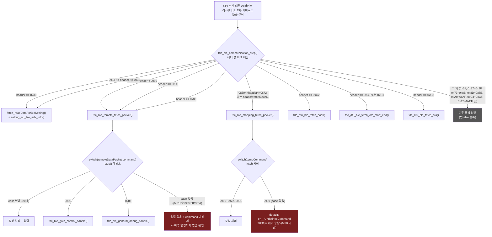

# 01 프로토콜 카탈로그

**TL;DR**: CM3 BLE 명령 64개(내부 상태값 제외)를 전수 카탈로그화했다. 52개는 실제 처리되고, 9개는 정의만 있고 핸들러가 없으며(그중 4개는 명령이 멈춰버릴 위험), 0x90은 라우팅만 되고 case가 없어 항상 에러로 응답한다. 매핑 그룹은 실제 디스패치 경계가 0x60~0x72로, 은수님이 제시한 0x60~0x7F와 어긋난다. 0xA0 대역은 코드에 전혀 없고 게인 제어는 0x8C가 전담한다.

## 0. 조사 범위와 방법

- **대상**: `src/2__cm3/source/ble/` 전 파일(7개 .c, 6개 .h) + BLE 명령을 처리하는 `src/2__cm3/source/dfu/`(OTA·부트 선택) + `src/2__cm3/source/sys/tdc_sys_error.*`(에러 응답 규약)
- **판정 기준**: ① 디스패처(`tdc_ble_communication_step()`)가 해당 헤더를 어느 핸들러로 보내는가, ② 그 핸들러의 switch/if 분기에 해당 case가 실제로 존재하고 응답을 만드는가. 둘 다 있으면 "처리", 하나라도 없으면 "미처리"로 분류했다.
- **읽기 전용**: `src/` 어떤 파일도 수정하지 않았다.

## 1. 전체 명령 카탈로그 (헤더값 오름차순)

> 표기 규칙: "CM3 처리 여부" 열은 근거가 확인된 사실만 적었다. 앱이 실제로 그 명령을 보내는지(트래픽 유무)는 이 노드의 조사 범위 밖이라 다루지 않았다 — 미확인.

| 헤더값(hex) | 열거값 이름 | 소속 그룹 | 정의 위치 | CM3 처리 여부 | 처리 핸들러 | 비고 |
|---|---|---|---|---|---|---|
| 0x10 | `en__mapping_ble_disconneted` | (그룹 밖) | `tdc_ble_protocol.h:87` | 내부 상태값 — wire 헤더 아님 | `tdc_ble_mapping.c:1885` (`step()` case) | SPI로 수신되는 값이 아니라 `tdc_ble_mapping_change_command_ble_disconnected()`(`tdc_ble_mapping.c:34-37`)가 BLE 연결 해제 시 소프트웨어적으로만 설정. 0x30 미만이라 7개 그룹 어디에도 안 들어감 |
| 0x30 | `en__bleSetting_ReadConnected_ISD_info` | Ezairo_BT_30 | `tdc_ble_protocol.h:29` | 처리 | 디스패치 `tdc_ble_communication.c:291` → `fetch_readDataForBleSetting:29` → 응답 `setting_nrf_ble_adv_info:59` | 헤더만으로 전량 라우팅(등호 비교, 범위 아님) |
| 0x31 | `en__BLE_COMM_COMMAND_connecteLogDate` | Ezairo_BT_30 | `tdc_ble_protocol.h:35` | **미처리 (정의만 존재)** | 없음 | 디스패처 if-else 어디에도 이 값을 향한 조건이 없다. `tdc_ble_communication.c` 전체에서 이 상수는 정의 라인 외 참조 0건(grep 확인) |
| 0x32 | `en__BLE_Disconnected_Flag` | Ezairo_BT_30 | `tdc_ble_protocol.h:36` | 처리(특수 경로) | `tdc_ble_communication.c:450-471` | 매 `step()` 호출마다 무조건 검사되는 **상태 플래그**. SPI 응답을 만들지 않고 패스키·명령 상태를 리셋하는 내부 트리거. 헤더 범위 디스패치 체인(291-345)과는 별도 경로 |
| 0x33 | `EN__SND_BT_CMD_SYSTEM_INFO_BATTERY` | Ezairo_BT_30 | `tdc_ble_protocol.h:42` | 처리 | 디스패치 `:312-313` → `fetch_readDataForBleSetting:29` → 응답 `:93` | |
| 0x34 | `EN__SND_BT_CMD_SYSTEM_INFO_POWER` | Ezairo_BT_30 | `tdc_ble_protocol.h:43` | 처리 | 응답 `tdc_ble_communication.c:121` | 페이로드 3바이트(배터리·충전·크래들뚜껑) 파싱 |
| 0x35 | `EN__SND_BT_CMD_SYSTEM_INFO_LED_IND` | Ezairo_BT_30 | `tdc_ble_protocol.h:44` | 처리 | 응답 `tdc_ble_communication.c:170` | |
| 0x36 | `EN__SND_BT_CMD_SYSTEM_INFO_CLASSIC_STATE` | Ezairo_BT_30 | `tdc_ble_protocol.h:45` | 처리 | 응답 `tdc_ble_communication.c:200` | |
| 0x37~0x3F | (없음) | Ezairo_BT_30 | — | 코드에 없음 | — | 그룹 정의상 남는 구간, enum에 값 자체가 없다 |
| 0x40 | `en__remoteControl_check_isd_passKey` | 통신 프로토콜_40 | `tdc_ble_protocol.h:51` | 처리 | `tdc_ble_remote.c:696`(switch 진입 전 별도 if) | 패스키 검증 로직은 **의도적으로 무효화**돼 항상 통과(`:700-715` 주석) |
| 0x41 | `en__remoteControl_readInfoOfExtenalDevice` | 통신 프로토콜_40 | `tdc_ble_protocol.h:52` | 미처리(설계상 정상) | `tdc_ble_remote.c:782` case는 존재하나 **본문이 비어 있음** | 주석 "NRF에서 바로 응답하기 때문에 Ezairo로 명령이 수신되지 않는다" — nRF가 자체 처리해 CM3까지 안 옴. 헤더주석 "확인 완료: nRF 자체 처리"와 일치 확인 |
| 0x42 | `en__remoteControl_readInfoOfMap` | 통신 프로토콜_40 | `tdc_ble_protocol.h:53` | 처리 | `tdc_ble_remote.c:788` | |
| 0x43 | `en__remoteControl_readStatusOfExtenalDevice` | 통신 프로토콜_40 | `tdc_ble_protocol.h:54` | 처리 | `tdc_ble_remote.c:822` | 헤더주석 "확인 완료: 헤더 only 패킷"과 일치 — 핸들러가 `remoteDataPacket.data`를 전혀 참조하지 않음 |
| 0x44 | `en__remoteControl_changeMapNum` | 통신 프로토콜_40 | `tdc_ble_protocol.h:55` | 처리 | `tdc_ble_remote.c:849` | 1~2 범위 외 `en__EN__BLE_PROTOCOL_ERROR`+`en__OutOfDataRange`(`:927`) — 헤더주석과 일치 |
| 0x45 | `en__remoteControl_adjustStimulationVolume` | 통신 프로토콜_40 | `tdc_ble_protocol.h:56` | 처리 | `tdc_ble_remote.c:933` | 범위 외 에러 처리(`:965`) 확인 |
| 0x46 | `en__remoteControl_adjustMicVolume` | 통신 프로토콜_40 | `tdc_ble_protocol.h:57` | 처리 | `tdc_ble_remote.c:971` | 범위 외 에러 처리(`:1003`) 확인 |
| 0x47 | `en__remoteControl_OnOffTelecoil` | 통신 프로토콜_40 | `tdc_ble_protocol.h:58` | 처리 | `tdc_ble_remote.c:1009` | 범위 외 에러(`:1024`) 확인 |
| 0x48 | `en__remoteControl_OnOffStimulationIndicator` | 통신 프로토콜_40 | `tdc_ble_protocol.h:59` | 처리 | `tdc_ble_remote.c:1030` | 범위 외 에러(`:1045`) 확인 |
| 0x49 | `en__remoteControl_OnOffLED` | 통신 프로토콜_40 | `tdc_ble_protocol.h:60` | 처리 | `tdc_ble_remote.c:1051` | 범위 외 에러(`:1066`) 확인 |
| 0x4A | `en__remoteControl_read_SlotData_ISD_N_USER` | 통신 프로토콜_40 | `tdc_ble_protocol.h:61` | 처리 | fetch `tdc_ble_remote.c:81` → step `:1099`(→`tdc_isd_map_read_info_setting`) | 슬롯 1~4 범위 검사(`:86`), 헤더주석과 일치 |
| 0x4B | `en__remoteControl_read_Mapdata_STIMUL_PARA` | 통신 프로토콜_40 | `tdc_ble_protocol.h:62` | 처리 | fetch `:340` → step `:1111` | |
| 0x4C | `en__remoteControl_write_SlotData_ISD_N_USER` | 통신 프로토콜_40 | `tdc_ble_protocol.h:63` | 처리 | fetch `:101`(3단계 서브패킷) → step `:1105` | |
| 0x4D | `en__remoteControl_write_Mapdata_STIMUL_PARA` | 통신 프로토콜_40 | `tdc_ble_protocol.h:64` | 처리 | fetch `:372`(15단계 서브패킷) → step `:1117` | |
| 0x4E | `en__remoteControl_erase_SlotData` | 통신 프로토콜_40 | `tdc_ble_protocol.h:65` | 처리 | fetch `:574` → step `:1123` | |
| 0x4F | `en__remoteControl_erase_mapData_STIMUL_PARA` | 통신 프로토콜_40 | `tdc_ble_protocol.h:66` | 처리 | fetch `:583` → step `:1129` | |
| 0x50 | `en__remoteControl_erase_mppingData_exceptSlot_1` | 통신 프로토콜_40 | `tdc_ble_protocol.h:67` | 처리 | fetch `:592` → step `:1135` | |
| 0x51 | `en__remoteControl_read_OwnerNameOfExternalDevice` | 통신 프로토콜_40 | `tdc_ble_protocol.h:68` | **미처리 (핸들러 없음)** | 없음 | fetch의 `default:`(`:609-617`)로 떨어져 `remoteDataPacket.command`에 값이 남는데, `step()`의 switch(`:780-1371`)에 이 값의 case가 없고 **`default` 절도 없다.** → 아래 §4-1 참조(명령 멈춤 위험) |
| 0x52 | `en__remoteControl_readSoundSignal` | 통신 프로토콜_40 | `tdc_ble_protocol.h:69` | 처리 | step `:1072` → `tdc_ble_remote_sp_para.c:11` `tdc_ble_remote_read_sp_para()` | |
| 0x53 | `en__remoteControl_read_NRF_FirmwareInfo` | 통신 프로토콜_40 | `tdc_ble_protocol.h:70` | **미처리 (핸들러 없음)** | 없음 | 0x51과 동일한 구조적 문제 |
| 0x54 | `en__remoteControl_read_Ezairo_FirmwareInfo` | 통신 프로토콜_40 | `tdc_ble_protocol.h:71` | 처리 | `tdc_ble_remote.c:1078` | |
| 0x55 | `en__remoteControl_write_SerialNumOfExternalDevice` | 통신 프로토콜_40 | `tdc_ble_protocol.h:72` | 미처리(설계상 정상) | 없음 | 헤더주석 "확인 완료: nRF 자체 처리"와 일치 — nRF가 자체 종결 |
| 0x56 | `en__remoteControl_write_ParingKey` | 통신 프로토콜_40 | `tdc_ble_protocol.h:73` | 미처리(설계상 정상) | 없음 | 위와 동일 |
| 0x57 | `en__remoteControl_recover_ALL_SlotData_ManufactureData` | 통신 프로토콜_40 | `tdc_ble_protocol.h:74` | 처리 | fetch `:602` → step `:1141` | 0x60 초과 여부로 매핑/리모콘 분기하는 특수 로직 포함(`:1157`) |
| 0x58 | `en__remoteControl_readSystemErrorCode` | 통신 프로토콜_40 | `tdc_ble_protocol.h:75` | **미처리 (핸들러 없음)** | 없음 | 헤더주석 자체가 "NOTE: 실제 사용되고 있나? 이거 보내면 묵묵 부답으로 시간 초과 타임아웃 발생함" — 코드 조사 결과(step switch에 case 없음)와 정확히 일치. 원 작성자도 이미 문제를 인지하고 있었다 |
| 0x59 | `en__remoteControl_specificSystemOperationSetting` | 통신 프로토콜_40 | `tdc_ble_protocol.h:80` | 처리 | `tdc_ble_remote.c:1215` | 자극 묵음 기능 읽기/쓰기, 3단 서브옵션 |
| 0x5A | `en__remoteControl_waiting_for_BleOff` | 통신 프로토콜_40 | `tdc_ble_protocol.h:81` | **미처리 (정의만 존재)** | 없음 | 프로젝트 전체에서 정의 라인 외 참조 0건(grep 확인). 매핑 그룹의 동명 이웃(`en__mapping_waiting_for_BleOff`, 0x72)과 혼동 주의 — 그쪽은 실사용됨 |
| 0x60 | `en__mapping_connect` | 매핑 프로토콜_60 | `tdc_ble_protocol.h:88` | 처리 | fetch `tdc_ble_mapping.c:116` → step `:1832`(switch 진입 전 if) | 헤더주석 "헤더 only 패킷" 일치 |
| 0x61 | `en__mapping_disconnect` | 매핑 프로토콜_60 | `tdc_ble_protocol.h:89` | 처리 | fetch `:123` → step `:1849` | 응답 후 시스템 재부팅(`:1857-1874`) |
| 0x62 | `en__mapping_impedanceChekck` | 매핑 프로토콜_60 | `tdc_ble_protocol.h:90` | 처리 | fetch `:129` → step `:1895` | 4개 필드 전부 범위검사 (`:140-166`) — 헤더주석 일치 |
| 0x63 | `en__mapping_eCAP_Measurement_masking` | 매핑 프로토콜_60 | `tdc_ble_protocol.h:91` | 처리(단, 앱 미사용) | fetch `:173` → step `:1913` | 헤더주석 "현재 버전 매핑 앱에서 사용 X" — 코드는 처리 로직을 갖추고 있으나 앱이 이 명령을 보내는지는 이 노드 조사 범위 밖(미확인) |
| 0x64 | `en__mapping_eCAP_Measurement_alternative` | 매핑 프로토콜_60 | `tdc_ble_protocol.h:92` | 처리(단, 앱 미사용) | fetch `:203` → step `:1929` | 0x63과 동일 사유 |
| 0x65 | `en__mapping_specific_stimulation` | 매핑 프로토콜_60 | `tdc_ble_protocol.h:93` | 처리 | fetch `:221` → step `:1937` | 범위 외 에러(`:300`) 확인 |
| 0x66 | `en__mapping_live_stimulation` | 매핑 프로토콜_60 | `tdc_ble_protocol.h:94` | 처리 | fetch `:309`(9개 서브명령) → step `:1953` | 서브명령·데이터인덱스별 범위검사 다수 확인(`en__OutOfDataRange`/`en__DATA_Order` 총 9곳, `:331,355,694,763,791,815,864,904,912`) |
| 0x67 | `en__mapping_deviceStatus` | 매핑 프로토콜_60 | `tdc_ble_protocol.h:95` | 처리 | fetch `:955` → step `:1961` | 헤더 only — 헤더주석 일치 |
| 0x68 | `en__mapping_write_original_ISD_N_USER` | 매핑 프로토콜_60 | `tdc_ble_protocol.h:96` | 처리 | fetch `:967` → step `:2001` | 수술위치(location) 1~2만 범위검사(`:1035`), 나머지 필드 무검사 — 헤더주석 "수술 위치 1~2 범위 확인, 다른 멤버는 범위 없음"과 정확히 일치 |
| 0x69 | `en__mapping_read_original_ISD_N_USER` | 매핑 프로토콜_60 | `tdc_ble_protocol.h:97` | 처리 | fetch `:961` → step `:1995` | 헤더 only — 일치 |
| 0x6A | `en__mapping_read_SlotData_ISD_N_USER` | 매핑 프로토콜_60 | `tdc_ble_protocol.h:98` | 처리 | fetch `:1143` → step `:2010` | 슬롯 1~4 범위검사, 헤더주석 일치 |
| 0x6B | `en__mapping_read_Mapdata_STIMUL_PARA` | 매핑 프로토콜_60 | `tdc_ble_protocol.h:99` | 처리 | fetch `:1392` → step `:2022` | 범위 외 에러(`:1410,1417`) 확인 |
| 0x6C | `en__mapping_write_SlotData_ISD_N_USER` | 매핑 프로토콜_60 | `tdc_ble_protocol.h:100` | 처리 | fetch `:1163` → step `:2016` | |
| 0x6D | `en__mapping_write_Mapdata_STIMUL_PARA` | 매핑 프로토콜_60 | `tdc_ble_protocol.h:102` | 처리 | fetch `:1422`(15단계) → step `:2028` | 자극 기법 등 필드별 범위검사 다수 (`:1467` 등) |
| 0x6E | `en__mapping_erase_SlotData_manufacture` | 매핑 프로토콜_60 | `tdc_ble_protocol.h:104` | 처리 | fetch `:1708` → step `:2034` | 슬롯 1~4 범위검사(`:1713`), 헤더주석 일치 |
| 0x6F | `en__mapping_erase_mapData_STIMUL_PARA` | 매핑 프로토콜_60 | `tdc_ble_protocol.h:106` | 처리 | fetch `:1721` → step `:2040` | 슬롯·맵 번호 각각 1~4 범위검사(`:1727,1733`), 헤더주석 일치 |
| 0x70 | `en__mapping_recover_mppingData_exceptSlot_1` | 매핑 프로토콜_60 | `tdc_ble_protocol.h:108` | 처리 | fetch `:1741` → step `:2046` | 헤더주석 "헤더 only 패킷"이나, 실제로는 fetch에서 2바이트(slot/map index)를 더 읽는다(`:1745-1746`) — **주석과 코드가 정확히 일치하지 않는 표본**(§4-2 참조) |
| 0x71 | `en__mapping_recover_ALL_SlotData_ManufactureData` | 매핑 프로토콜_60 | `tdc_ble_protocol.h:109` | 처리 | fetch `:1750` → step `:2052` | 헤더 only — 일치. "공장 초기화" |
| 0x72 | `en__mapping_waiting_for_BleOff` | 매핑 프로토콜_60 | `tdc_ble_protocol.h:110`(명시값 없음, 0x71+1로 계산됨) | 처리 | 설정 `tdc_ble_mapping.c:41` → step `:2088` | 명시적 `= 0x72` 표기가 없어 컴파일러 자동 부여값에 의존 — 실측이 아닌 **enum 순서 계산값**(§4-3 참조) |
| 0x73~0x8B | (없음) | 매핑 프로토콜_60 / SOUND1_80 | — | 코드에 없음 | — | §2 (가) 참조 |
| 0x80 | `CI_OTA_PKT_HEADER`(매크로) | SOUND1_80 | `tdc_dfu_ble_ota.h:27` | **정의만 존재, 미사용(dead code)** | 없음 | `#define`이지만 자기 정의 줄 외 프로젝트 전체 참조 0건(grep 확인). 디스패처(`tdc_ble_communication.c`)의 어떤 조건에도 등장하지 않음 |
| 0x8C | `EN__SND_BT_CMD_GAIN_CONTROL` | SOUND1_80 | `tdc_ble_protocol.h:117` | 처리 | 디스패치 `tdc_ble_communication.c:335`(→`tdc_ble_remote_fetch_packet`) → case `tdc_ble_remote.c:1200` → `tdc_ble_gain_control.c:34` `tdc_ble_gain_control_handle()` | **믹싱 게인 제어 명령 그 자체.** 0xA0 대역이 아니라 이 헤더가 담당(§3 참조). 처리 모듈은 "매핑"이 아니라 리모콘 인프라(`tdc_ble_remote_fetch_packet`)를 경유 |
| 0x8D~0x8E | (없음) | SOUND1_80 | — | 코드에 없음 | — | |
| 0x8F | `EN__SND_BT_CMD_GENERAL_DEBUG` | SOUND1_80 | `tdc_ble_protocol.h:118` | 처리 | 디스패치 `:339`(→`tdc_ble_remote_fetch_packet`) → case `tdc_ble_remote.c:1186` → `tdc_ble_general_debug.c:35` `tdc_ble_general_debug_handle()` | 옵션 1(터치 디버깅)/2(백텔 체크 무시)/3(맵 초기화) 서브 프로토콜. 0x8C와 마찬가지로 리모콘 인프라 경유 |
| 0x90 | `en__mapping_testStimulation` | 매핑 프로토콜_60(그룹 밖 대역) | `tdc_ble_protocol.h:111` | **라우팅만 되고 case 없음 → 항상 에러 응답** | 디스패치 `tdc_ble_communication.c:306`(명시적 OR 조건으로 매핑 핸들러행) → `tdc_ble_mapping.c` fetch의 switch에 이 case가 **없음** → `default:`(`:1763-1772`)로 낙하 → `[0]=0x90 loop-back, [1]=en__UndefinedCommand` 응답 | §4-4 참조. 페이로드 구조체 `ST__MAPPINGPAYLOAD_TEST_STIMULATION testStimulation`(`tdc_ble_mapping.h:117`)은 존재하지만 어디서도 채워지지 않는 고아 필드 |
| 0x91 | `en__mapping_read_Connected_ISD_id` | 매핑 프로토콜_60(그룹 밖 대역) | `tdc_ble_protocol.h:112` | 처리 | 디스패치 `:307`(명시적 OR) → fetch `tdc_ble_mapping.c:1757` → step `:2114` | 연결된 ISD ID 4바이트를 응답으로 반환. 0x90과 달리 완전히 처리됨 |
| 0xA0~0xAF | (없음) | 믹싱 게인_A0 | — | **코드에 없음** | — | 프로젝트 전체 grep(0xA0~0xAF)으로 확인 — BLE 헤더로서의 사용례 0건. 유일한 매치는 `main.c:109`의 무관한 예약영역 마커 배열과 `bootloader.c`의 `SHOULD_BOOT` 상수(둘 다 BLE 프로토콜과 무관). 게인 제어는 0x8C가 전담(§3) |
| 0xC0 | `CI_BLE_OTA_COMMAND_OTA_START` | OP_C0 | `tdc_dfu_ble_ota.h:110` | 처리 | 디스패치 `:326` → `tdc_dfu_ble_fetch_ota_start_end()`(`tdc_dfu_ble_ota.c`) | |
| 0xC1 | `CI_BLE_OTA_COMMAND_OTA_END` | OP_C0 | `tdc_dfu_ble_ota.h:111` | 처리 | 디스패치 `:327` → 동일 함수 | |
| 0xC2 | `PKT_HEADER_BOOT` | OP_C0 | `tdc_dfu_ble_boot.h:22` | 처리 | 디스패치 `:322` → `tdc_dfu_ble_fetch_boot()`(`tdc_dfu_ble_boot.c:129`) | 서브옵션 INFO(`:137`)·SELECT(`:142`) 둘 다 구현, 그 외는 `PKT_BOOT_ERROR_INVALID_OPTION` 에러(`:147`) |
| 0xC3 | `CI_BLE_OTA_COMMAND_OTA` / `PKT_HEADER_OTA` | OP_C0 | `tdc_dfu_ble_ota.h:63,112` | 처리 | 디스패치 `:331` → `tdc_dfu_ble_fetch_ota()`(`tdc_dfu_ble_ota.c`) | 같은 값(0xC3)이 서로 다른 이름의 enum 2개에 중복 정의(`EN__PKT_HEADER_OTA`와 `CI_BLE_CONTROL_COMMAND_OTA_E`) — 기능상 문제는 없으나 네이밍 중복 |
| 0xC4~0xCF | (없음) | OP_C0 | — | 코드에 없음 | — | |
| 0xE0~0xEF | (없음) | Security | — | **코드에 없음** | — | 프로젝트 전체 grep으로 확인 — CM3 소스에 이 대역을 다루는 정의가 전혀 없다. QCC↔폰/크래들 구간에서만 처리되고 E8300까지 도달하지 않는 것으로 추정되나, CM3 코드만으로는 "코드에 없다"는 사실만 확정할 수 있고 그 이상(QCC 쪽 구현)은 미확인 |
| 0xF0 | `en__ERROR_Response` / `en__BLE_COMM_COMMAND_REPlY_ERROR_BLE` | 공통(전 그룹 횡단) | `tdc_ble_protocol.h:23,37` | 처리(응답 전용) | `tdc_sys_error.c:147-173` `tdc_sys_error_send_to_app()` | 인바운드 디스패치 대상이 아니라 **아웃바운드 에러 헤더**. 같은 값 0xF0이 서로 다른 이름의 enum 2개에 정의돼 있는데, 실제 코드는 전부 `en__ERROR_Response`만 사용하고 `en__BLE_COMM_COMMAND_REPlY_ERROR_BLE`는 참조 0건(정의만 존재) |

### 표에서 제외한 순수 센티널 값

`en__bleSetting_IDLE`(0) · `en__mapping_IDLE`(0) · `en__remoteControl_IDLE`(0)은 값 0으로, SPI 수신 헤더로 관측되지 않는 "명령 없음" 초기값이다. 세 열거형 모두 0이라 값 충돌은 없으며 각자 자기 상태 구조체의 기본값으로만 쓰인다.

## 2. 그룹 체계 검증

### (가) 그룹에 속하지만 코드에 없는 구간

| 구간 | 소속 그룹 | 확인 방법 |
|---|---|---|
| 0x37~0x3F | Ezairo_BT_30 | `tdc_ble_protocol.h` 전수 확인 — enum에 값 없음 |
| 0x73~0x7F | 매핑 프로토콜_60(은수님 정의상 0x7F까지) | 동일 — 마지막 매핑 값은 0x72(`en__mapping_waiting_for_BleOff`) |
| 0x80~0x8B, 0x8D~0x8E | SOUND1_80 | 동일 — 0x8C·0x8F만 존재(은수님 사전 설명과 일치 확인) |
| 0xA0~0xAF | 믹싱 게인_A0 | 프로젝트 전체 grep 0건 |
| 0xC4~0xCF | OP_C0 | `tdc_dfu_ble_ota.h`/`tdc_dfu_ble_boot.h` 전수 확인 |
| 0xE0~0xEF | Security | 프로젝트 전체 grep 0건 |

### (나) 코드에 있지만 어느 그룹에도 안 들어가는 값

| 값 | 정체 | 근거 |
|---|---|---|
| 0x10 (`en__mapping_ble_disconneted`) | 내부 소프트웨어 상태값. SPI로 수신되는 wire 헤더가 아니라 BLE 연결 해제 시 코드가 스스로 설정하는 값 | `tdc_ble_mapping.c:34-37` |
| 0x90/0x91 (`en__mapping_testStimulation`/`en__mapping_read_Connected_ISD_id`) | 매핑 열거형 소속이나 0x90 대역이라 "매핑 프로토콜_60"(0x60~0x7F) 그룹 정의 밖 | `tdc_ble_protocol.h:111-112` (은수님이 사전에 지적하신 내용, 코드로 재확인 완료) |

### (다) 그룹 경계와 실제 디스패치 경계의 불일치

| 그룹 | 은수님 정의 경계 | 실제 디스패치 경계 (근거) | 일치 여부 |
|---|---|---|---|
| 통신 프로토콜_40 (리모콘) | 0x40~0x5F | `en__remoteControl_check_isd_passKey(0x40) <= header < en__mapping_connect(0x60)` → **정확히 0x40~0x5F** (`tdc_ble_communication.c:297-298`) | **일치**. 소스 주석도 "실제 유효한 마지막 헤더는 0x59"라고 밝혀 두었는데, 이는 "그 안에서 실사용되는 마지막 enum 값"을 말한 것이지 디스패치 경계 자체가 어긋난다는 뜻은 아니다 |
| 매핑 프로토콜_60 | 0x60~0x7F | `(en__mapping_connect(0x60) <= header <= en__mapping_waiting_for_BleOff(0x72)) \|\| (header==0x90) \|\| (header==0x91)` → **실제로는 0x60~0x72 + {0x90, 0x91}만 매핑 핸들러로 감** (`tdc_ble_communication.c:304-307`) | **불일치**. 0x73~0x8F 구간은 매핑 헤더 정의가 아예 없어 어차피 도달할 수 없지만, "그룹 경계=0x60~0x7F"라는 명세와 "실제 디스패치=0x60~0x72"인 코드 사이에는 0x73~0x7F 만큼의 간극이 있다. 게다가 0x90·0x91은 그룹 정의 범위(0x60~0x7F) 밖인데도 OR 조건으로 강제 편입돼 있다 |
| SOUND1_80 | 0x80~0x8F | 0x8C·0x8F 두 값만 `tdc_ble_communication.c:335,339`에서 개별 등호 비교로 걸러 **`tdc_ble_remote_fetch_packet()`(리모콘 핸들러)로 위임**. "SOUND1_80 전용 디스패처"는 존재하지 않는다 | **구조적 불일치**. 헤더 값의 라우팅 자체는 은수님 사전 설명("0x8C·0x8F만 E8300까지 도달")과 정확히 일치하지만, 그룹 이름(SOUND1_80)과 실제로 그 값을 소비하는 모듈(리모콘 인프라 `tdc_ble_remote.c`, 그 안에서도 다시 `tdc_ble_gain_control.c`/`tdc_ble_general_debug.c`로 위임)이 서로 다르다. 즉 그룹 분류는 "헤더 값의 의미론적 출처"이고, 디스패치는 "코드 재사용 편의"를 기준으로 되어 있어 두 기준이 어긋난다 |
| Ezairo_BT_30 | 0x30~0x3F | 0x30만 등호 비교(`:291`)로 별도 처리, 0x33~0x36은 범위 비교(`:312-313`)로 별도 처리. **0x31·0x32는 이 두 조건 어디에도 없음**(0x32는 §1에서 설명한 별도 상시 검사 경로) | **부분 불일치**. 그룹 안에 있는 값(0x31)이 디스패치 체인에서 완전히 누락돼 있다 |
| OP_C0 | 0xC0~0xCF | 0xC0/0xC1/0xC2/0xC3 개별 등호 비교(`:322,326-327,331`) — 정의된 값과 정확히 일치, 초과분(0xC4~0xCF) 없음 | 일치 |

## 3. 특히 답해야 할 질문에 대한 답

**CM3가 처리하는 명령은 총 몇 개이고, 정의만 있고 핸들러가 없는 명령은 몇 개인가?**

내부 상태값(0x10)과 순수 센티널(0x00 계열 3종)을 제외하고 실제 wire 헤더로 정의된 상수 62개(§1 표 기준, 0x80 미사용 매크로 포함) 중:

- **처리됨(응답 또는 상태 변화까지 확인): 52개**
- **미처리 — 정의만 존재(디스패처가 아예 안 보냄): 2개** — 0x31(`en__BLE_COMM_COMMAND_connecteLogDate`), 0x5A(`en__remoteControl_waiting_for_BleOff`). 여기에 미사용 매크로 0x80(`CI_OTA_PKT_HEADER`), 미사용 별칭 0xF0(`en__BLE_COMM_COMMAND_REPlY_ERROR_BLE`)까지 포함하면 4개
- **미처리 — nRF가 자체 처리해서 설계상 정상(CM3 도달 자체가 없음): 3개** — 0x41, 0x55, 0x56
- **미처리 — 디스패처는 라우팅하지만 핸들러 switch에 case가 없어 명령이 멈춰버림: 4개** — 0x51, 0x53, 0x58, 0x5A(중복 집계 방지: 0x5A는 위에서 이미 셈) → 순증분 3개(0x51, 0x53, 0x58)
- **미처리 — 라우팅되지만 case가 없어 "정상적으로" 에러 응답만 나감: 1개** — 0x90

52(처리) + 2(정의만) + 3(nRF 자체처리) + 3(멈춤 위험) + 1(0x90) = 61, 나머지 미사용 매크로/별칭 2개(0x80, 0xF0-별칭)를 더하면 § 1 표의 총 63개 실제 상수(0x10 제외)와 맞는다.

**디스패처의 헤더 범위 조건과 은수님 그룹 정의 사이에 불일치가 있는가?**

있다. §2-(다)에 정리한 대로 매핑 그룹(0x60~0x7F 정의 vs 0x60~0x72+{0x90,0x91} 실제)과 Ezairo_BT_30 그룹(0x31이 범위 안인데 디스패치에서 누락) 두 곳에서 명확한 불일치를 확인했다. 반면 리모콘 그룹(0x40~0x5F)과 OP_C0 그룹(0xC0~0xCF)은 정확히 일치한다.

**0x90~0x91 두 명령은 실제로 핸들러가 있는가? 있다면 어디인가?**

0x91(`en__mapping_read_Connected_ISD_id`)은 완전한 핸들러가 있다 — fetch `tdc_ble_mapping.c:1757`, step `:2114`(연결된 ISD ID 4바이트 응답). 0x90(`en__mapping_testStimulation`)은 디스패처가 명시적으로 매핑 핸들러로 라우팅하지만(`tdc_ble_communication.c:306`), `tdc_ble_mapping.c`의 fetch switch에는 이 값을 위한 case가 없다. 결과적으로 default 절(`:1763-1772`)로 떨어져 **항상 "정의되지 않은 명령" 에러**([0]=0x90 loop-back, [1]=`en__UndefinedCommand`)로 응답한다. 페이로드를 담을 구조체(`ST__MAPPINGPAYLOAD_TEST_STIMULATION testStimulation`, `tdc_ble_mapping.h:117`)는 준비돼 있지만 실제로 채워지는 코드가 없는 고아 필드다.

**0xA0 대역(믹싱 게인)은 CM3 코드에 존재하는가? 없다면 게인 제어는 어느 헤더로 오는가? (`EN__SND_BT_CMD_GAIN_CONTROL`=0x8C와의 관계를 밝혀라)**

0xA0~0xAF는 CM3 코드 어디에도 존재하지 않는다(프로젝트 전체 grep 0건). 게인 제어는 처음부터 0x8C(`EN__SND_BT_CMD_GAIN_CONTROL`, SOUND1_80 그룹) 하나로 전담된다. `tdc_ble_gain_control.h:4-10`의 주석이 이를 명시한다 — "Gain control 프로토콜(EN__SND_BT_CMD_GAIN_CONTROL, 0x8C) 처리... 앱이 QCC를 거쳐 E8300까지 보내는 패킷으로, Gain Conversion Table의 인덱스를 읽거나 쓴다." 즉 "믹싱 게인_A0"이라는 그룹명이 가리키는 기능(오디오 입력 믹싱 게인 제어)은 실제로는 0xA0 대역이 아니라 0x8C 하나로 구현돼 있고, 0xA0~0xAF는 코드상 완전히 빈 대역이다. `tdc_ble_gain_control.c:34` `tdc_ble_gain_control_handle()`이 `data[0]`=Read/Write, `data[1]`=Gain_A/Gain_B, `data[2]`=인덱스(0~255)를 받아 `cfx_cm3_sharedMemoryAll.gain_table_index_a/b`에 반영하고 파일에 저장한다.

## 4. 주석-코드 불일치 및 그 외 발견 사항

### 4-1. 발견_1 — 핸들러 없는 리모콘 명령 4종은 "무응답"이 아니라 "이후 명령 전체가 멈출 위험"

`tdc_ble_remote.c`의 `tdc_ble_remote_fetch_packet()`은 알 수 없는 헤더도 `default:`(`:609-617`)에서 `remoteDataPacket.command = tempCommand`로 그대로 저장한다. 그런데 `tdc_ble_remote_step()`의 switch(`:780-1371`)에는 **`default` 절이 없다.** 0x51/0x53/0x58/0x5A가 들어오면 `remoteDataPacket.command`가 그 값으로 계속 남아 `en__remoteControl_clear_command()`가 절대 호출되지 않는다. 그 상태에서 다음 명령이 들어오면 `tdc_ble_remote_fetch_packet()` 상단의 "이전 명령 미완료" 검사(`:73-77`)에 걸려 `en__PreviouCommnadIsNotCompleted` 에러가 나며 **새 명령까지 함께 무시**된다. 이 상태는 BLE 연결이 끊어져 `en__BLE_Disconnected_Flag`(0x32) 경로가 `tdc_ble_remote_clear_command()`를 호출(`tdc_ble_communication.c:454`)할 때까지 풀리지 않는다. 헤더주석이 0x58에 대해 남긴 "묵묵부답으로 시간 초과 타임아웃 발생함"이라는 실측 관찰과 정확히 부합하며, 같은 구조적 결함이 0x51·0x53·0x5A에도 동일하게 적용된다는 것이 이번 조사의 확장 발견이다.

### 4-2. 발견_2 — 0x70 헤더주석 "헤더 only 패킷"은 실제 코드와 다르다

`tdc_ble_protocol.h:108`의 주석은 `en__mapping_recover_mppingData_exceptSlot_1`(0x70)을 "확인 완료: 헤더 only 패킷"이라 적어 두었다. 그러나 실제 fetch 핸들러(`tdc_ble_mapping.c:1741-1748`)는 헤더 뒤에 `slot_index`·`map_index` 2바이트를 추가로 읽는다:
```c
mappingPacket.ReadWriteMapData_Flash.slot_index = Rx_dataPacket[index++];
mappingPacket.ReadWriteMapData_Flash.map_index  = Rx_dataPacket[index++];
```
표본 검증 대상 8~9건 중 이 1건만 주석과 코드가 어긋났고, 나머지(0x43·0x60·0x61·0x67·0x69·0x71 등 "헤더 only" 표기 건과 0x44~0x49·0x62·0x68 등 "범위 검사" 표기 건)는 모두 코드와 일치했다. 즉 검증 주석은 대체로 신뢰할 수 있으나 전수는 아니다.

### 4-3. 발견_3 — `en__mapping_waiting_for_BleOff`(0x72 추정)는 명시적 hex 값이 없다

다른 매핑 enum 멤버는 전부 주석으로 hex 값을 병기했는데(`// 60`, `// 61`, … `// 71`), 이 값만 `tdc_ble_protocol.h:110`에서 병기가 빠져 있다. C enum 규칙상 직전 값(`en__mapping_recover_ALL_SlotData_ManufactureData = 0x71`) 다음 정수이므로 0x72가 맞지만, 이는 **소스 읽기로 계산한 값이지 주석에 명시된 값이 아니다.** 그룹 경계 계산(§2-다)의 근거이기도 하므로 향후 새 매핑 명령을 이 자리 앞에 끼워 넣으면 값이 밀리는 구조적 취약점이 있다.

### 4-4. 발견_4 — 에러 응답 규약이 두 갈래로 나뉘어 있다

- **정식 경로** — `tdc_sys_error_send_to_app()`(`tdc_sys_error.c:147-173`): `[0]=en__ERROR_Response(0xF0)`, `[1]=원 명령 loop-back`, `[2]=대분류 에러`(`tdc_sys_error_major_t`, 예: `en__EN__BLE_PROTOCOL_ERROR`=8), `[3]=소분류 에러`(`tdc_sys_error_ble_protocol_error_t`, 예: `en__OutOfDataRange`=6), `[4..5]=발생 라인번호(상위/하위 바이트)`. 총 6바이트, 리모콘·매핑 대부분의 범위 오류가 이 경로를 쓴다.
- **예외 경로** — `tdc_ble_mapping.c` fetch switch의 `default:`(`:1763-1772`, 즉 0x90을 포함해 매핑 그룹에 정의되지 않은 헤더가 걸렸을 때): `[0]=수신 헤더 그대로 loop-back`(0xF0이 아님!), `[1]=en__UndefinedCommand`(값 5). 2바이트뿐이고 0xF0 에러 헤더를 전혀 쓰지 않는다.

앱 입장에서는 "정상 응답처럼 보이는 2바이트 패킷"과 "0xF0으로 시작하는 6바이트 정식 에러 패킷"이라는 서로 다른 두 신호가 같은 "정의되지 않은 명령"이라는 의미로 혼재한다. 이것이 의도된 설계인지 리팩토링 잔재인지는 이 노드의 조사 범위(정적 코드 판독)로는 **미확인**이다.

### 4-5. 발견_5 — SPI 패킷 [20]번 바이트는 "종류"가 아니라 "길이"임을 실측 확인

전제로 제공된 "[20]=길이/종류 바이트(추정)"를 코드로 확정할 수 있었다. `tdc_hal_spi_write_tx_buffer()`(`tdc_hal_spi.c:287-305`)는 호출자가 넘긴 `dataSize`만큼 버퍼에 쓰고 나머지를 0으로 채운 뒤, 마지막에 `SPI_Tx_Buffer[20] = dataSize`로 **실제 쓰여진 바이트 수**를 기록한다(`:305`). "종류"를 나타내는 값이 아니라 순수한 길이 바이트다.

### 4-6. 발견_6 — 0xC3가 서로 다른 이름의 enum 2개에 중복 정의

`tdc_dfu_ble_ota.h:63`의 `EN__PKT_HEADER_OTA`(`PKT_HEADER_OTA = 0xC3`)와 `:108-113`의 `CI_BLE_CONTROL_COMMAND_OTA_E`(`CI_BLE_OTA_COMMAND_OTA = 0xC3`)가 같은 값을 갖는 별개 enum이다. 실질적인 동작 문제는 없지만(디스패처는 `CI_BLE_OTA_COMMAND_OTA`만 참조), 유지보수 시 두 이름 중 하나만 바꾸면 값이 어긋날 수 있는 잠재 위험이다.

## 5. 디스패치 구조 다이어그램



## 6. 미확인으로 남긴 항목

- 0x63·0x64(eCAP 측정) 및 다수 명령이 실제 앱 트래픽에서 얼마나 자주/전혀 쓰이는지 — 정적 코드 판독만으로는 판정 불가
- 0xE0~0xEF(Security)가 QCC 측에서 어떻게 처리되는지 — CM3 저장소 범위 밖
- §4-4의 두 에러 응답 경로 분기가 의도된 설계인지 리팩토링 과정의 누락인지
- 매핑 그룹 실제 앱이 0x73~0x7F를 예비로 남겨둔 것인지, 애초에 그룹 정의 자체가 넉넉하게(라운드 숫자로) 잡힌 것인지
