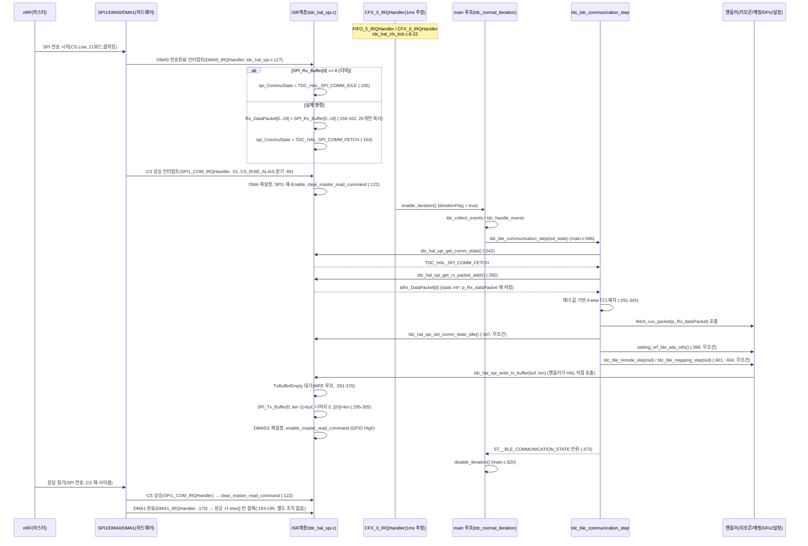
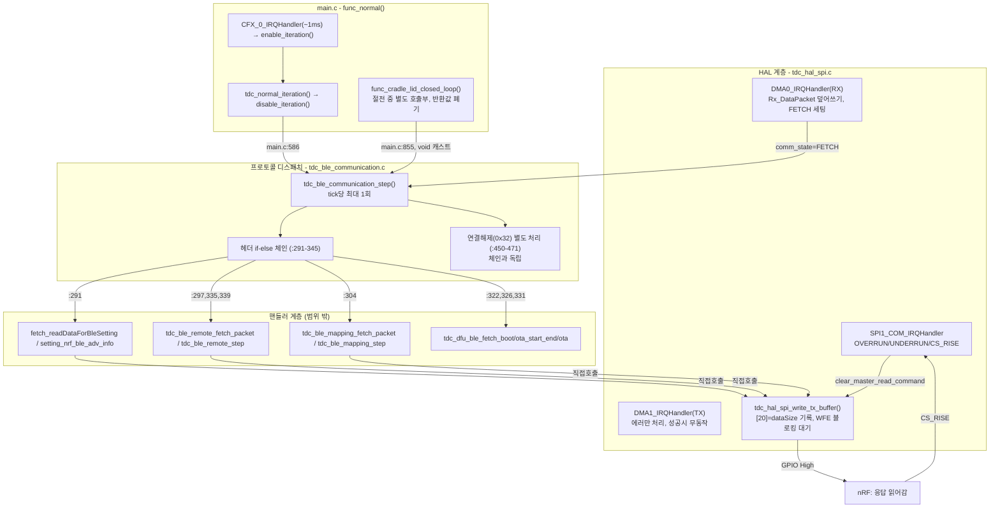

# BLE 디스패치·전송 경로 해부

## TL;DR

nRF↔CM3는 21바이트 고정 SPI/DMA 프레임으로 통신한다. 수신은 DMA0 완료 인터럽트가 20바이트를 전역 버퍼에 복사하고 상태를 FETCH로 세팅, 메인 루프(약 1ms 주기, CFX FIFO 인터럽트 구동)의 `tdc_ble_communication_step()`이 같은 호출 안에서 헤더 기반 if-else 체인으로 즉시 디스패치·응답한다. 겹치는 조건은 없으나 조용히 버려지는 헤더 구간이 다수 존재하고, 단일 버퍼 구조상 한 tick 사이 2회 수신 시 앞 패킷이 유실되며, `p_Rx_dataPacket`은 static이라 최초 FETCH 이전 호출에서 미초기화(NULL) 역참조 위험이 있다. 디버그 출력이 RX 버퍼 범위를 1바이트 초과 읽는 결함도 발견했다.

## 1. 조사 범위와 읽은 파일

- `src/2__cm3/source/ble/tdc_ble_communication.c` (전체, 1~474행)
- `src/2__cm3/source/hal/tdc_hal_spi.c` (전체, 1~377행)
- `src/2__cm3/source/hal/tdc_hal_spi.h` (전체)
- `src/2__cm3/source/ble/tdc_ble_communication.h` (전체)
- `src/2__cm3/source/ble/tdc_ble_protocol.h` (전체, 헤더 값 상수 정의)
- `src/2__cm3/source/main.c` (444~626행, 790~874행 - 메인 루프·호출부)
- `src/2__cm3/source/hal/tdc_hal_cfx_tick.c` (전체 - iterationFlag 트리거원)
- `src/2__cm3/source/hal/tdc_hal_timer.c` (1~50행, 125~146행 - tick 주기 근거)
- `src/2__cm3/source/sys/tdc_sys_control.c` (85~130행, 330~370행 - 반환값 소비/순환구조 주석)
- `src/2__cm3/source/dfu/tdc_dfu_ble_ota.h`, `tdc_dfu_ble_boot.h` (헤더 상수 확인용, grep)

핸들러 내부 로직(`tdc_ble_remote.c`, `tdc_ble_mapping.c`, `tdc_dfu_ble_*.c`)의 세부 처리는 다른 노드 소관이므로, 본 문서에서는 진입점 시그니처와 호출 관계까지만 다룬다.

---

## 2. 전체 경로 (수신 → 디스패치 → 송신) 시퀀스 다이어그램



**핵심 관찰**: 응답 송신 완료 확인(마스터 read command 해제)은 `DMA1_IRQHandler`가 아니라 `SPI1_COM_IRQHandler`의 CS_RISE 분기(:122)에서 처리된다. `DMA1_IRQHandler`의 성공 경로는 완전히 빈 블록(:193-195)이다.

---

## 3. 수신 경로 상세 (HAL)

- 21바이트 고정 프레임: `TDC_HAL_SPI_COMM_PACKET_SIZE = BLE_DataPacketSize(20) + 1 = 21` (`tdc_hal_spi.h:10`).
- 원시 하드웨어 버퍼: `SPI_Rx_Buffer[21]` / `SPI_Tx_Buffer[21]` (`tdc_hal_spi.c:20-21`). `SPI_Tx_Buffer` 최초 리터럴 초기값은 `{21,20,...,1}` 이지만 `tdc_hal_spi_init()`(:241)에서 즉시 `1+i` 패턴(:259-262)으로 덮어써진다 - 리터럴 초기값은 사실상 죽은 값(부팅 시 재기록됨).
- 인터럽트 3종:
  - `SPI1_COM_IRQHandler` (:51) - OVERRUN(:53-57), UNDERRUN(:59-63), CS_RISE(:65-123, DMA0/1 전송 워드 수 검증 → 불일치 시 `SPI_CMMM_ERROR` 및 RX/TX 버퍼 덤프, 이후 SPI 재구성)
  - `DMA0_IRQHandler` (:127-167) - **RX 전용**(주석 :126 "DMA0: SPI 수신"). 완료 인터럽트 미수신 시 에러(:130-150). 성공 시 `SPI_Rx_Buffer[0]==0`(더미, 마스터 read 전용 트랜잭션)이면 `IDLE`(:155), 아니면 **`Rx_DataPacket[0..19]`에 20개만 복사**하고 `FETCH`로 전이(:159-164).
  - `DMA1_IRQHandler` (:170-196) - **TX 전용**(주석 :169 "DMA1: SPI 송신"). 에러만 처리, 성공은 빈 블록.
- DMA 채널 설정: `tdc_hal_spi_enable_dma()`(:216-239) - DMA0: 목적지 `SPI_Rx_Buffer`, 소스 레지스터 주소 `0x40000E10`(정확한 레지스터 명은 미확인). DMA1: 소스 `SPI_Tx_Buffer`, 목적지 `0x40000E0C`(미확인). 두 채널 모두 전송 길이 `TDC_HAL_SPI_COMM_PACKET_SIZE`(21)로 설정.
- 상태 열거형: `TDC_HAL_SPI_COMM_RESET(-1) / TDC_HAL_SPI_COMM_IDLE(0) / TDC_HAL_SPI_COMM_FETCH(1) / SPI_CMMM_ERROR(2)` (`tdc_hal_spi.h:25-31`). 부팅 시 초기값은 `tdc_hal_spi_init()`이 호출하는 `tdc_hal_spi_set_comm_state_idle()`(:243)로 `IDLE`.
- **RX 버퍼 크기 불일치(발견_1, 결함)**: `Rx_DataPacket`은 `int[BLE_DataPacketSize]` = `int[20]` (`tdc_hal_spi.c:22`, `tdc_ble_protocol.h:5`), 유효 인덱스는 0~19뿐이다. 그런데 `tdc_ble_communication.c:275-283`의 디버그 출력 코드는 `p_Rx_dataPacket[20]`까지 21개를 찍는다(:282). 이는 `Rx_DataPacket` 배열 경계를 1워드 초과하는 **배열 범위 밖 읽기**이며, 실제로 SPI로 수신된 21번째 바이트(`SPI_Rx_Buffer[20]`)가 아니라 `tdc_hal_spi.c`의 다음 정적 변수(`TxBufferEmpty` 등) 인접 메모리를 정수로 잘못 해석해 출력하는 것으로 판단된다. `TDC_HAL_SPI_COMM_PAYLOAD_SIZE_INDEX`(`tdc_hal_spi.h:12`, 값 20)는 정의만 있고 코드 전체에서 실사용처가 없다(grep 확인, 정의 1곳뿐). 즉 **nRF→CM3 방향의 21번째 바이트는 HAL 계층에서 아예 `Rx_DataPacket`으로 전달되지 않으며, 그 의미(길이/종류/카운터)는 CM3 코드베이스 어디에도 소비되는 곳이 없다** (RX 방향은 미확인/미사용, TX 방향과는 비대칭).

---

## 4. 송신 경로 상세 - 21번째 바이트([20])의 정체

`tdc_hal_spi_write_tx_buffer(int *source, int dataSize)` (`tdc_hal_spi.c:287-377`):

1. `TxBufferEmpty`가 `true`가 될 때까지 `__WFE()` 로 블로킹 대기(:291-376, **타임아웃 없음**).
2. `source[0..dataSize-1]`를 `SPI_Tx_Buffer`에 복사(:295-298).
3. `dataSize`부터 `TDC_HAL_SPI_COMM_PACKET_SIZE-1`(=20)까지 나머지를 0으로 채움(:300-303).
4. **`SPI_Tx_Buffer[TDC_HAL_SPI_COMM_PACKET_SIZE - 1] = dataSize;`** (:305) - **21번째 바이트(인덱스 20)에는 "전송한 데이터 바이트 수(dataSize)"가 기록된다.** 종류나 카운터가 아니라 **길이(payload size) 필드**임을 코드로 확정.
5. `dataSize == 0`인 경우: 2단계 for문이 실행되지 않고 3단계가 인덱스 0부터 20까지 전부 0으로 채운 뒤, 4단계에서 `SPI_Tx_Buffer[20] = 0`으로 재확인 - `tdc_ble_communication.c:80-82` 주석("TX 크기가 0이면 SPI TX 버퍼에서 알아서 21바이트를 0으로 채운다")과 **정확히 일치함을 코드로 검증**.
6. 이후 DMA0/1 재설정, SPI 재-Enable, `tdc_hal_spi_enable_master_read_command()`(:365)로 `TxBufferEmpty=false` 세팅 및 GPIO High(마스터에게 "읽어갈 데이터 준비됨" 통지).

**블로킹 위험(발견_2)**: 3단계 대기 루프(:291-376)는 타임아웃이 없다. 만약 이전 응답을 nRF가 오래 읽어가지 않아 `TxBufferEmpty`가 `false`로 유지되면, `tdc_hal_spi_write_tx_buffer()`를 호출한 핸들러(예: `setting_nrf_ble_adv_info()`)가 무한정 블로킹되고, 이는 곧 `tdc_ble_communication_step()` → `tdc_normal_iteration()`(main.c:612-621) 전체를 블로킹시켜 **메인 루프가 멈춘다**. 워치독 리프레시는 메인 루프 본문 뒤(`main.c:514 SYS_WATCHDOG_REFRESH()`)에서만 일어나므로, 이 블로킹이 풀리지 않으면 최종적으로 워치독 리셋이 유일한 탈출구가 된다(워치독 타임아웃 값 자체는 본 조사 범위 밖, 미확인). `SPI1_COM_IRQHandler`의 CS_RISE 분기(:122)가 `clear_master_read_command()`를 호출해 `TxBufferEmpty=true`로 되돌리므로, 정상 동작 시엔 nRF가 CS 사이클을 완료하는 순간 즉시 풀리는 구조다.

---

## 5. 호출부: 누가, 얼마나 자주 부르는가

### 5.1 호출 주기

- `tdc_ble_communication_step()`은 `main.c:586`에서 `tdc_handle_events()` 안에 위치, 이는 `tdc_normal_iteration()`(:612-621)에서 1회 호출된다.
- `tdc_normal_iteration()`은 `func_normal()`의 `while(1)` 루프(:470-516) 안에서 **`iterationFlag == true`일 때만** 실행된다(:472-475).
- `iterationFlag`는 `enable_iteration()`/`disable_iteration()`(main.c:129-137)으로 제어되며, `tdc_normal_iteration()` 마지막에 `disable_iteration()`(:620, 주석 "중요!!")으로 매번 꺼진다.
- `enable_iteration()`은 `CFX_0_IRQHandler` / `FIFO_5_IRQHandler`(`tdc_hal_cfx_tick.c:8-22`)에서만 호출된다. 같은 ISR에서 `tdc_hal_timer_increase_tick()`(`tdc_hal_timer.c:130-141`)도 호출되며, 이 함수가 증가시키는 변수명이 `_tdc_hal_timer_elapsed_1msec_counter`(`tdc_hal_timer.c:14,133`)다.
- `tdc_sys_control.c:108-113`, `:346-351`의 주석이 명시적으로 "1-tick(=1ms)"이라 기술한다.
- **결론**: `tdc_ble_communication_step()`의 호출 주기는 **CFX FIFO 인터럽트 1회당 1회**이며, 코드 내 변수명·주석 근거로 **약 1ms 주기로 추정**된다. 다만 이 주기가 실제로 정확히 1.000ms인지(오디오 프레임 레이트/클럭 설정에 의해 결정)는 CM3 소스만으로는 최종 확인 불가 - **미확인**(정황 증거는 강하나 하드웨어 클럭 설정까지 추적하지 않음).
- 이 주기는 main 루프 방식이며, 별도의 하드웨어 타이머(Timer3 등)가 직접 호출하는 구조가 아니다 - CFX(오디오 처리 칩/코어)가 FIFO 이벤트를 통해 CM3의 iteration을 간접적으로 게이팅한다.

### 5.2 두 번째 호출부 (main.c:855)

- `func_cradle_lid_closed_loop()`(:814-874) - 크래들 뚜껑 닫힘 시 진입하는 "약 절전(light sleep)" 루프. `while(1)` 안에서 매 반복 `(void) tdc_ble_communication_step(dummy_isd)`(:855)를 호출한다.
- `dummy_isd = {en__isdStatus_NA, false}`(:847)로 ISD 상태를 고정 입력하고, **반환값은 `(void)`로 완전히 버린다.** 즉 이 경로에서는 `isdControlCommand`/`mappingConnection`/`StimulationIndicatorTrigger`/`BLE_Off_Command` 4개 필드 모두 호출자 쪽에서 소비되지 않는다.
- 다만 함수 내부의 **부수효과**(SPI TX 응답 송신, `p_Rx_dataPacket[0]=0` 초기화, `setting_nrf_ble_adv_info()`를 통한 크래들 뚜껑 상태 갱신 등)는 그대로 발생한다. 주석(:857)에 "뚜껑 열림 패킷 감지 (data[2]=1 또는 else → setter가 df_Connected으로 갱신)"이라 명시되어, 이 루프의 목적이 **SPI 수신 처리(0x34 Power info 패킷의 크래들 뚜껑 상태)만을 계속 살려두기 위함**임을 알 수 있다.
- 이 루프에는 `iterationFlag` 게이팅이 없고 `SYS_WAIT_FOR_INTERRUPT`(:867)로 단순 인터럽트 대기 후 즉시 재호출하는 구조라, 정상 모드의 "1ms 주기" 가정이 **이 루프에는 적용되지 않는다** - 인터럽트가 오는 대로 매번 `tdc_ble_communication_step()`을 부른다(더 빈번할 수 있음, 정확한 빈도는 미확인).
- **`p_Rx_dataPacket`은 함수 정적 지역변수이므로 두 호출부가 완전히 동일한 저장소를 공유한다** - `func_normal()`의 정상 루프와 `func_cradle_lid_closed_loop()`의 절전 루프가 별개의 실행 문맥이 아니라 **동일 프로세스 내 순차 실행**(절전 루프는 `func_normal()` 호출 스택 안에서 진입, :814 함수 정의 및 호출 지점 :494 참조)이라는 점에서 상태 공유 자체는 안전하다(재진입/멀티스레딩 아님).

### 5.3 반환값(`ST__BLE_COMMUNICATION_STATE`) 소비 - main.c:586 경로

| 필드 | 소비 위치 | 용도 |
|---|---|---|
| `isdControlCommand` | `main.c:579` (다음 tick `tdc_isd_step()` 입력) | ISD(내부기) 제어 상태 전이. 매핑 우선, 리모콘은 매핑값이 `NA`일 때만 보조 반영(:410-417, :434-438) |
| `mappingConnection` | `main.c:500`(파워오프 게이트 `tdc_can_enter_sleep`), `:572`(다음 tick `tdc_sys_control_step()` 입력), `:596`(`tdc_apply_mapping_mode`), `:598`(`tdc_update_led_requests`), `:603`(`tdc_sys_control_nrf_on_off`), `:606`(`tdc_ui_command_set_mapping_connected`, `ENABLE_UI_CMD`) | 매핑 앱 연결 여부에 따른 시스템 모드/LED/nRF 전원/파워오프 허용 판단 |
| `StimulationIndicatorTrigger` | `main.c:588-591` (`tdc_stim_indicator_out`) | 자극 표시등 트리거 |
| `BLE_Off_Command` | `main.c:603` (`tdc_sys_control_nrf_on_off`) | nRF(BLE) 전원 On/Off 판단 입력 |

**순환 구조(주석 근거)**: `main.c:557` 및 `tdc_sys_control.c:108-113,346-351`이 명시하듯, `ctx->ble_state.mappingConnection`/`ctx->isd_state.conneded_ISD`는 **지난 tick 값**이 다음 tick의 `tdc_sys_control_step()`/`tdc_isd_step()` 입력으로 다시 들어가는 1-tick 지연 순환 구조다. 코드 주석은 이 지연이 "시간 누적 판정 또는 인간 조작 스케일 소비처만 있어 1ms 지연은 무해하다"고 명시적으로 정당화하고 있다.

---

## 6. 디스패치 체인 정밀 분해 (`tdc_ble_communication.c:291-345`)

| 발견 | 조건식 | 커버 헤더 범위(16진) | 대상 핸들러 | 라인 |
|---|---|---|---|---|
| 조건_1 | `p_Rx_dataPacket[0] == en__bleSetting_ReadConnected_ISD_info` | `== 0x30` | `fetch_readDataForBleSetting()` | :291-294 |
| 조건_2 | `en__remoteControl_check_isd_passKey <= h < en__mapping_connect` | `0x40 ≤ h ≤ 0x5F` | `tdc_ble_remote_fetch_packet()` | :297-301 |
| 조건_3 | `(en__mapping_connect <= h <= en__mapping_waiting_for_BleOff) \|\| h==en__mapping_testStimulation \|\| h==en__mapping_read_Connected_ISD_id` | `0x60 ≤ h ≤ 0x72`, `h==0x90`, `h==0x91` | `tdc_ble_mapping_fetch_packet()` | :304-310 |
| 조건_4 | `EN__SND_BT_CMD_SYSTEM_INFO_BATTERY <= h <= EN__SND_BT_CMD_SYSTEM_INFO_CLASSIC_STATE` | `0x33 ≤ h ≤ 0x36` | `fetch_readDataForBleSetting()` | :312-320 |
| 조건_5 | `h == PKT_HEADER_BOOT` | `== 0xC2` | `tdc_dfu_ble_fetch_boot()` | :322-325 |
| 조건_6 | `h == CI_BLE_OTA_COMMAND_OTA_START \|\| h == CI_BLE_OTA_COMMAND_OTA_END` | `0xC0`, `0xC1` | `tdc_dfu_ble_fetch_ota_start_end()` | :326-330 |
| 조건_7 | `h == CI_BLE_OTA_COMMAND_OTA` | `== 0xC3` | `tdc_dfu_ble_fetch_ota()` | :331-334 |
| 조건_8 | `h == EN__SND_BT_CMD_GAIN_CONTROL` | `== 0x8C` | `tdc_ble_remote_fetch_packet()` | :335-338 |
| 조건_9 | `h == EN__SND_BT_CMD_GENERAL_DEBUG` | `== 0x8F` | `tdc_ble_remote_fetch_packet()` | :339-342 |
| 조건_10(빈 else) | 위 어느 것도 아님 | 아래 §6.2 참조 | 없음(조용히 버림) | :343-345 |

값 산정 근거: `tdc_ble_protocol.h`의 열거형 순서로 계산. `en__remoteControl_waiting_for_BleOff`는 명시적 상수 없이 이전 값(`en__remoteControl_specificSystemOperationSetting = 0x59`, :80)에 이어지는 암묵 증가값이므로 **`0x5A`** (protocol.h:81). `en__mapping_waiting_for_BleOff`도 마찬가지로 `en__mapping_recover_ALL_SlotData_ManufactureData(0x71)` 다음 암묵 증가값 **`0x72`** (protocol.h:110).

> **주석-코드 불일치 발견(발견_3)**: `tdc_ble_communication.c:296`의 주석은 "실제 유효한 마지막 헤더는 0x59 en__remoteControl_systemOperatingMode 까지"라고 적혀 있으나, 현재 열거형에는 `en__remoteControl_systemOperatingMode`라는 이름이 존재하지 않고 대신 `en__remoteControl_waiting_for_BleOff = 0x5A`가 마지막 값이다(protocol.h:77-81 주석에 2026-01-20 `en__remoteControl_specificSystemOperationSetting` 추가 이력 존재). 조건식 자체(`< en__mapping_connect`, 즉 `< 0x60`)는 심볼릭 상수를 사용하므로 **동작에는 영향 없음** - 주석만 과거 리네이밍/추가 이전 상태로 방치된 것으로 판단.

### 6.1 판정 (가): 조건 범위 중복 여부

**중복 없음.** 9개 매치 조건이 커버하는 16진 구간(`0x30`, `0x33-0x36`, `0x40-0x5F`, `0x60-0x72`, `0x8C`, `0x8F`, `0x90-0x91`, `0xC0-0xC3`)을 전부 나열해도 서로 겹치는 구간이 없다.

### 6.2 판정 (나): 조용히 버려지는 헤더 값

빈 `else{}`(:343-345)로 떨어지는 구간(디스패치 체인 관점):

- `0x00`: 값 자체는 `en__bleSetting_IDLE`(protocol.h:28)이지만, **애초에 이 값은 HAL 계층에서 FETCH 상태로 승격되지 않는다** - `DMA0_IRQHandler`가 `SPI_Rx_Buffer[0]==0`이면 `TDC_HAL_SPI_TX_DUMMY_FOR_MASTER_READ`(더미)로 간주해 `IDLE` 처리하기 때문(`tdc_hal_spi.c:153-156`). 즉 0x00은 디스패치 체인에 도달할 수조차 없다.
- `0x01-0x2F`: 미정의/미사용 구간. 정의된 프로토콜 상수 없음.
- **`0x31` (`en__BLE_COMM_COMMAND_connecteLogDate`, protocol.h:35)**: 열거형에는 정의되어 있으나, grep 전수 조사 결과 이 상수를 참조하는 코드가 정의부 외에 **전무**하다. 디스패치 체인 어디에도 안 걸리고, §7에서 다루는 0x32 전용 처리(:450)도 값이 다르므로 걸리지 않는다. **정의되었지만 CM3 쪽에서 완전히 죽어있는 헤더**로 보인다(BLE 프로토콜 정의 자체의 제거를 제안하는 것은 아님 - 제약사항 준수).
- `0x37-0x3F`: `EN__SND_BT_CMD_SYSTEM_INFO_CLASSIC_STATE`(0x36)와 리모콘 시작(0x40) 사이 미정의 구간.
- `0x73-0x8B`: 매핑 종료(0x72)와 `EN__SND_BT_CMD_GAIN_CONTROL`(0x8C) 사이 미정의 구간.
- `0x8D-0x8E`: `0x8C`와 `0x8F` 사이 미정의 구간.
- `0x92-0xBF`: 매핑 확장(0x91)과 DFU 시작(0xC0) 사이 미정의 구간.
- `0xC4-0xFF`: OTA(0xC3) 이후 미정의 구간.

**단, `0x32`(`en__BLE_Disconnected_Flag`)는 디스패치 체인 관점에서는 else로 떨어지지만, 함수 후반부(:450)에서 체인과 독립적으로 별도 처리된다** - §8에서 상세 분석.

### 6.3 판정 (다): 조건 순서 의존성

**의존성 없음(기능 관점).** 6.1에서 확인했듯 모든 매치 조건의 구간이 상호 배타적이므로, if-else 체인의 순서를 바꾸어도 각 헤더 값이 매치되는 핸들러는 동일하다. 순서가 영향을 주는 것은 **오직 비교 횟수(성능)**뿐이다 - 예를 들어 매우 빈번한 것으로 보이는 `0x66`(`en__mapping_live_stimulation`, 라이브모드 실시간 전류값 - :267의 디버그 억제 로직이 이 헤더를 특별 취급하는 것으로 보아 고빈도로 추정)은 3번째 조건(:304-310)에서 매치되어 비교 횟수가 적은 편이나, 상대적으로 드물 것으로 보이는 DFU/GAIN/DEBUG류는 5~9번째 조건까지 순차 비교를 거친다. 기능적 정합성에는 영향 없음.

---

## 7. fetch/step 분리의 실제 의미

### 7.1 같은 tick인가, 다음 tick인가

**두 층위를 구분해야 한다.**

1. **HAL의 "fetch"(FETCH 상태 세팅)는 SPI 인터럽트 문맥에서, `tdc_ble_communication_step()` 호출과 비동기로 발생한다.** `DMA0_IRQHandler`(:127-167)는 nRF가 SPI 트랜잭션을 완료하는 시점에 즉시 실행되며, 메인 루프의 tick과 무관하다.
2. **`tdc_ble_communication_step()` 내부의 "디스패치(fetch_xxx_packet 호출)"와 "핸들러 step(`tdc_ble_remote_step`/`tdc_ble_mapping_step`) 호출"은 같은 함수 호출, 즉 같은 tick 안에서 순차 실행된다.** 디스패치 체인(:291-345, 헤더 매치 시 각 `fetch_xxx_packet()` 호출)이 먼저 실행되고, 그 아래(:398, :401, :404)에서 `setting_nrf_ble_adv_info()` / `tdc_ble_remote_step()` / `tdc_ble_mapping_step()`이 **매 호출마다 무조건** 실행된다. 따라서 **어떤 tick에서 FETCH가 감지되어 `fetch_xxx_packet()`으로 명령이 모듈 내부 상태에 적재되면, 바로 그 다음 줄들에서 같은 tick 안에 해당 모듈의 step()이 그 상태를 소비하고 응답까지 만들어 `tdc_hal_spi_write_tx_buffer()`를 호출할 수 있다.** 즉 **명령 수신부터 응답 전송까지가 단일 `tdc_ble_communication_step()` 호출(같은 tick) 안에서 완결될 수 있는 구조**다.

### 7.2 연속 fetch 시 명령 유실 가능성 - **가능하다(구조적 결함)**

근거:

- `Rx_DataPacket`(`tdc_hal_spi.c:22`)은 **단일 전역 버퍼**다 - 큐나 더블 버퍼가 아니다.
- `DMA0_IRQHandler`(:159-164)는 FETCH 여부·이전 패킷 소비 여부를 **전혀 확인하지 않고** 매 수신마다 무조건 `Rx_DataPacket`을 덮어쓴다.
- `spi_CommuState`(`tdc_hal_spi.c:49`)는 **스칼라 열거형 하나**이지 카운터가 아니다 - 두 번 연속 FETCH가 발생해도 값은 여전히 `TDC_HAL_SPI_COMM_FETCH` 하나뿐이며, "몇 번 왔는지"·"소비되지 않은 게 있는지"는 기록되지 않는다.
- `tdc_ble_communication_step()`은 tick마다 최대 1회만 실행되고, 그 안에서 comm_state를 확인해 FETCH면 처리 후 즉시 `IDLE`로 되돌린다(:347).

**결론**: 만약 두 번의 독립적인 SPI 트랜잭션(두 번의 `DMA0_IRQHandler` 완료)이 연속된 두 번의 `tdc_ble_communication_step()` 호출 **사이**(약 1ms 윈도우, §5.1 근거)에 발생하면, 먼저 온 패킷은 `Rx_DataPacket`에 적재된 직후 아직 디스패치되지 않은 상태에서 두 번째 패킷에 의해 **그대로 덮어써져 유실**된다. 이후 `tdc_ble_communication_step()`이 실행되면 오직 **두 번째(최신) 패킷만** 디스패치되며, 첫 번째 패킷이 왔었다는 사실 자체를 코드 어디에서도 알 수 없다. nRF 측이 실제로 1ms 이내에 SPI 트랜잭션을 2회 이상 개시할 수 있는지는 nRF 펌웨어(본 저장소 범위 밖)에 달려 있어 **미확인**이나, CM3 쪽 코드만 놓고 보면 이를 막는 어떤 방어 장치(큐, 세마포어, 카운터)도 존재하지 않는다.

---

## 8. 에러 처리 경로 (`SPI_CMMM_ERROR`, :352-391)

동작 요약:

1. 진단 로그 출력(:354-358).
2. `NVIC_DisableIRQ(SPI1_COM_IRQn)`(:361) - SPI 인터럽트 비활성화.
3. `Sys_SPI_TransferConfig(SPI1, TDC_HAL_SPI_CTRL_DISABLE)`(:364) - SPI 전송 중지.
4. `Sys_DMA_Mode_Enable(DMA0/DMA1, DMA_DISABLE)`(:366-367) - 양 DMA 채널 정지.
5. 각종 pending IRQ 클리어(:369-371), STATUS 레지스터 클리어(:374).
6. `tdc_hal_spi_clear_tx_buffer()`(:376) - `SPI_Tx_Buffer` 21워드 전부 0으로 리셋(`tdc_hal_spi.c:208-214`).
7. `tdc_hal_spi_enable_dma()`(:378) - DMA0/1 재설정.
8. `tdc_hal_spi_set_comm_state_idle()`(:380).
9. SPI 재-Enable, IRQ 재-Enable(:383-386).
10. 주석(:388-390): "SPI 플래그 신호는 High, Low 상태 상관 없이 QCC가 타임아웃으로 처리하도록 현재 상태를 유지한다" - 즉 **GPIO 마스터 read 플래그(`TxBufferEmpty`/`ReadCommandForSPI_Master`)는 의도적으로 건드리지 않는다.**

**진행 중이던 명령 상태에 대한 영향(발견_4)**:

- 이 복구 루틴은 **SPI/DMA 하드웨어 레벨만** 리셋한다. `bleSettingPacket.command`(`tdc_ble_communication.c:27`), 그리고 리모콘/매핑 모듈 내부의 명령 상태(각 모듈 소관, 본 문서 범위 밖)는 **전혀 초기화되지 않는다.**
- `p_Rx_dataPacket`(정적 포인터) 및 그것이 가리키는 `Rx_DataPacket`의 내용도 이 경로에서 지워지지 않는다 - 다음 정상 FETCH가 오기 전까지 마지막 수신 내용이 그대로 남는다.
- `TxBufferEmpty`가 에러 발생 시점에 `false`(즉 이전 응답 전송 대기 중)였다면, 이 복구 루틴은 그것을 리셋하지 않으므로, `SPI_Tx_Buffer`는 0으로 비워졌지만(6단계) `TxBufferEmpty` 플래그 자체는 그대로 `false`로 남을 수 있다 - 이 경우 §4의 블로킹 위험(발견_2)이 에러 복구 이후에도 잠재적으로 이어질 수 있다(다음 CS_RISE에서 해소되는지는 하드웨어 타이밍에 달려 있어 **미확인**).
- 요컨대 이 에러 경로는 "**통신 채널을 리셋**"하는 것이지 "**진행 중이던 명령의 의미 상태를 되돌리는**" 것이 아니다. 이는 각 핸들러 모듈이 자체적으로 견고해야 한다는 암묵적 설계 전제로 보이나, 그 견고성 자체는 핸들러 내부 로직(다른 노드 소관)에 달려 있다.

---

## 9. BLE 연결 해제 처리(`:450-471`)와 `p_Rx_dataPacket` static 위험

### 9.1 처리 내용

```
if (p_Rx_dataPacket[0] == en__BLE_Disconnected_Flag)   // :450, 0x32
{
    p_Rx_dataPacket[0] = 0;                              // :452, 재트리거 방지용 자가 클리어
    tdc_ble_remote_clear_passkey_match();                // :454
    tdc_ble_remote_clear_command();                      // :455
    if (mappingState.mappingConnection)                  // :457
    {
        tdc_ble_mapping_change_command_ble_disconnected();
        ble_communication_state.mappingConnection = false;
        ble_communication_state.isdControlCommand = en__isdStatus_PowerIC_Reset;
    }
    tdc_fs_event_log_update_bt_addr(NULL);                // :469
}
```

**결정적 특징**: 이 블록은 §6의 디스패치 체인(:291-345)과 **완전히 독립적으로**, `tdc_ble_communication_step()` 함수 본문 맨 뒤에서 **매 호출마다 무조건(comm_state와 무관하게) 실행**된다. `p_Rx_dataPacket`이 가리키는 내용이 이전 tick에 세팅된 것이든 방금 세팅된 것이든 상관없이 검사한다. `:452`에서 자기 자신을 0으로 지워, 다음 tick에 같은 값이 남아 있어 재차 걸리는 것을 방지한다 - 이는 `Rx_DataPacket`이 **다음 실제 FETCH가 오기 전까지 내용이 유지되는 영속 버퍼**라는 전제 위에서만 성립하는 로직이다.

### 9.2 `p_Rx_dataPacket`이 static인 이유 - 의도로 판단됨

`static int *p_Rx_dataPacket;`(:235)가 만약 **static이 아니라면**, 매 함수 호출마다 초기화되지 않은 지역변수가 되어 FETCH가 아닌 tick에서 `:450`의 역참조가 완전히 임의의 스택 쓰레기값을 가리키게 된다. static으로 선언함으로써 "**FETCH가 아닌 tick에서도 마지막으로 수신한 패킷 주소를 계속 가리킨다**"는 의도가 성립하고, 이는 §9.1의 자가-클리어 패턴(:452)과 정확히 맞물린다. 따라서 **static 자체는 의도적 설계로 판단**한다(높은 확신).

다만 포인터가 가리키는 실제 대상 - `tdc_hal_spi_get_rx_packet_addr()`가 반환하는 `&Rx_DataPacket[0]`(`tdc_hal_spi.c:44-47`) - 은 **고정 정적 배열의 주소**이므로 호출마다 바뀌지 않는다. 즉 이 용도만 놓고 보면 `static int *p_Rx_dataPacket` 대신 "매 호출 시 항상 `tdc_hal_spi_get_rx_packet_addr()`를 호출해서 쓰는" 방식으로도 동일한 결과를 더 안전하게 얻을 수 있었을 것으로 보인다(대안 판단, 제안이 아님 - 읽기 전용 원칙 준수).

### 9.3 위험: 최초 호출(들)에서 미초기화 역참조 가능성 - **발견_5, 결함 가능성 높음**

- C 표준상 정적 저장기간을 갖는 포인터 `p_Rx_dataPacket`는 명시적 초기화가 없으므로 **프로그램 시작 시 NULL(0)로 0-초기화**된다.
- `p_Rx_dataPacket`에 값이 대입되는 곳은 오직 `case TDC_HAL_SPI_COMM_FETCH:` 블록 내부(:260) 뿐이다.
- `tdc_hal_spi_init()`(`tdc_hal_spi.c:241-284`, `tdc_sys_init.c:303`에서 호출, 메인 루프 진입 전)은 `spi_CommuState`를 `IDLE`로 초기화할 뿐, **FETCH를 강제로 한 번 발생시키거나 `p_Rx_dataPacket`을 초기화하지 않는다.**
- `func_normal()`의 `while(1)` 루프(main.c:470)는 `tdc_normal_boot_sequence()`(:468, 내부에서 `tdc_hal_spi_init()` 실행) 직후 곧바로 시작되며, **nRF가 실제로 첫 SPI 트랜잭션을 완료했는지 기다리는 코드가 없다.**
- 따라서 부팅 후 `iterationFlag`가 처음 `true`가 되어 `tdc_ble_communication_step()`이 처음 몇 차례 호출될 때, 아직 한 번도 FETCH가 발생하지 않았다면 `communicationState`는 `IDLE`(`case TDC_HAL_SPI_COMM_IDLE: { i++; } break;`, :248-252, `p_Rx_dataPacket` 대입 없음)로 스위치문을 빠져나가고, **곧바로 :450에서 `p_Rx_dataPacket[0]`을 역참조한다.** 이 시점 `p_Rx_dataPacket == NULL`이므로 이는 **NULL 포인터 역참조**다.

**실제 영향 판단(미확인 부분 명시)**: Cortex-M 계열에서 주소 0은 통상 인터럽트 벡터 테이블(또는 그 앨리어스)이 매핑되어 있어, 이 역참조가 즉시 하드폴트를 유발하지 않고 벡터 테이블의 첫 워드(초기 스택 포인터 값)를 정수로 잘못 읽어 `en__BLE_Disconnected_Flag`(0x32)와 비교할 가능성이 높다 - 이 값이 우연히 0x32가 될 확률은 극히 낮으므로 **기능적으로는 대개 무해하게 스쳐 지나갈 것**으로 추정된다. 그러나 이는 근본적으로 **미정의 동작(undefined behavior)** 이며, 메모리 맵·부트로더 구성에 따라 결과가 달라질 수 있어 **실제 크래시 여부는 코드 정적 분석만으로 단정할 수 없다(미확인)**. 설계 의도(static 사용 이유, §9.2)는 명확하나, "**FETCH가 한 번도 없었던 최초 구간**"에 대한 가드가 빠진 것은 **사고(리팩토링 과정에서 놓친 경계 조건)일 가능성이 높다** - 주변 코드(:256-259 주석)에 "2차 리팩토링에서 제거했다"는 기록이 여러 곳 있어, static 변수화 자체가 리팩토링 산물일 가능성을 시사한다(다만 이 변수의 도입 이력 자체는 git blame 등 추가 조사가 필요해 **미확인**).

---

## 10. 계층 경계와 새는 지점

| 계층 | 파일 | 책임 |
|---|---|---|
| HAL(하드웨어 추상화) | `tdc_hal_spi.c/.h` | ISR, DMA 설정, 21바이트 원시 버퍼(`SPI_Rx_Buffer`/`SPI_Tx_Buffer`) 관리, `comm_state` 플래그, GPIO 핸드셰이크. 헤더 바이트의 "의미"는 전혀 모른다 - 순수 바이트 파이프 |
| 프로토콜 디스패치 | `tdc_ble_communication.c` (`tdc_ble_communication_step`, :232-474) | `comm_state` 폴링, 20바이트(`p_Rx_dataPacket[0..19]`) 헤더 기반 라우팅(:291-345), 각 모듈 `fetch_xxx_packet()`/`step()` 무조건 호출 |
| 핸들러(프로토콜 처리) | `tdc_ble_remote.c`, `tdc_ble_mapping.c`, `tdc_dfu_ble_boot.c`, `tdc_dfu_ble_ota.c` (본 문서 범위 밖) | 명령 의미론 실행, 응답 페이로드 구성, `tdc_hal_spi_write_tx_buffer()` 직접 호출 |

**경계가 새는 지점**:

- **누수_1 - 송신 경로가 디스패처를 우회한다**: TX는 디스패치 함수가 중앙에서 관장하지 않는다. `setting_nrf_ble_adv_info()`(같은 파일, :48-230)를 포함해 각 핸들러가 `tdc_hal_spi_write_tx_buffer()`(HAL 함수)를 **직접** 호출한다(`tdc_ble_communication.c:89,117,165,195,226` 등). 디스패처는 오직 RX 라우팅만 중앙화되어 있고 TX는 완전 분산 구조다.
- **누수_2 - "디스패처"와 "핸들러"가 한 파일에 혼재**: `fetch_readDataForBleSetting()`(:29-46)과 `setting_nrf_ble_adv_info()`(:48-230)는 사실상 `0x30`/`0x33-0x36` 프로토콜의 **완전한 핸들러**이지만, 디스패치 함수(`tdc_ble_communication_step`)와 동일 파일에 위치해 계층 구분이 코드 조직상 드러나지 않는다.
- **누수_3 - 연결 해제 처리가 디스패치 테이블 밖에 있다**: `0x32` 처리(:450-471)는 §6의 조건 테이블에 없고, 함수 후반부에서 별도로 `p_Rx_dataPacket`을 직접 재해석한다. "헤더로 분기한다"는 디스패처의 일관된 규칙이 이 값에 대해서만 깨진다.
- **누수_4 - 디버그 로그가 HAL 경계 밖 데이터를 노출**: §3의 `p_Rx_dataPacket[20]` OOB 읽기(발견_1)는 디스패치 계층 코드가 HAL이 실제로 보장하는 범위(0~19)를 넘어선 것으로, 계층 간 "몇 바이트가 유효한가"에 대한 암묵적 계약이 어긋난 사례다.
- **누수_5 - 에러 복구가 하드웨어만 리셋하고 프로토콜 상태는 그대로 둔다**(§8, 발견_4): 계층 경계상 "정상"이라 볼 수도 있으나(HAL은 HAL만 책임진다는 관점), 그 결과 프로토콜 계층/핸들러 계층이 에러 이후에도 정합적인 상태인지에 대한 책임 소재가 불분명하다.

---

## 11. 핵심 질문에 대한 답

**Q1. fetch와 step 사이에 명령이 유실되거나 덮어써질 수 있는가?**
가능하다. `Rx_DataPacket`이 단일 버퍼이고 `DMA0_IRQHandler`(`tdc_hal_spi.c:159-164`)가 소비 여부를 확인하지 않고 무조건 덮어쓰기 때문에, 한 tick(약 1ms) 사이에 SPI 트랜잭션이 2회 이상 발생하면 앞선 패킷은 디스패치되지 못하고 유실된다(§7.2). 단, 정상적으로 한 tick에 한 번만 온다면 fetch(디스패치)와 각 모듈의 step 소비는 **같은 tick, 같은 함수 호출 안에서 순차적으로 완결**된다(§7.1).

**Q2. 디스패처가 커버하지 못하고 조용히 버리는 헤더 값이 있는가?**
있다. `0x01-0x2F`, `0x31`(정의는 되어 있으나 미참조), `0x37-0x3F`, `0x73-0x8B`, `0x8D-0x8E`, `0x92-0xBF`, `0xC4-0xFF`가 `else{}`(:343-345)로 조용히 버려진다(§6.2). `0x00`은 HAL 단계에서 걸러져 애초에 도달 못 한다. `0x32`는 체인상 else로 떨어지지만 별도 경로(:450)로 처리된다.

**Q3. `p_Rx_dataPacket`이 static인 것은 의도인가 사고인가?**
static 자체(포인터를 tick 간 유지하는 것)는 §9.1의 자가-클리어 로직(:452)과 맞물려 **의도된 설계로 판단**한다. 그러나 **"최초 FETCH 이전 구간"에 대한 가드가 없는 것은 리팩토링 과정에서 놓친 경계 조건(사고)일 가능성이 높다**(§9.3) - 프로그램 시작 시 NULL로 0-초기화되는 이 포인터가, 부팅 직후 nRF의 첫 SPI 트랜잭션 완료를 기다리지 않는 메인 루프 구조상 미초기화 상태로 역참조될 수 있다. 실제 크래시로 이어지는지는 대상 MCU의 주소 0 메모리 맵에 좌우되어 **미확인**이나, 코드 자체는 결함으로 판단한다.

---

## 12. 미확인 목록 (근거 부족으로 단정하지 않은 것)

- `tdc_hal_spi.c:223,232`의 DMA 소스/목적지 레지스터 주소(`0x40000E10`, `0x40000E0C`)의 정확한 레지스터 명칭.
- CFX FIFO 인터럽트(및 메인 루프 tick)가 정확히 1.000ms인지 여부(변수명·주석 근거는 강하나 오디오 클럭 설정까지는 미추적).
- `func_cradle_lid_closed_loop()`(main.c:850-874) 루프에서 `tdc_ble_communication_step()`이 실제로 호출되는 정밀한 빈도(인터럽트 기반, 카운트 미추적).
- SPI 에러 복구(§8) 이후 `TxBufferEmpty`가 실제로 다음 CS_RISE에서 항상 정상 해소되는지의 타이밍 보장.
- `p_Rx_dataPacket`의 NULL 역참조(§9.3)가 실기(대상 실리콘, 벡터 테이블 배치)에서 하드폴트를 유발하는지 여부.
- `en__BLE_COMM_COMMAND_connecteLogDate`(0x31)가 과거에는 사용되었으나 제거된 것인지, 애초에 미구현 상태로 정의만 된 것인지의 이력.
- 워치독 타임아웃 값 및 `tdc_hal_spi_write_tx_buffer()`의 무한 대기(§4, 발견_2)가 실제 운용 중 관측된 적이 있는지.

---

## 13. 아키텍처 개요 다이어그램


