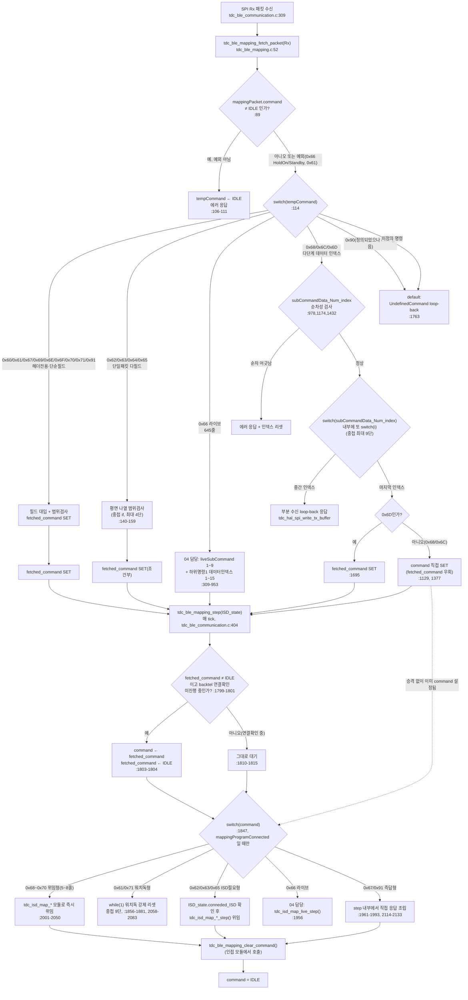

# 03 매핑 핸들러 골격 해부

**TL;DR**: `tdc_ble_mapping.c`(2,196줄, 사전 브리핑 1,791줄 대비 +405줄 정정)는 사실상 함수 6개뿐이며 그중 `fetch_packet` 1개가 1,724줄(78%)을 차지한다. 데이터 인덱스 분기는 비-라이브 구간만 봐도 결정 포인트의 58.6%를 차지해 "데이터 인덱스가 복잡도 주원인"이라는 가설은 **정량적으로 참**으로 확인됐다. 단, `command`/`fetched_command` 이중 상태 사용도 명령마다 불일치하는 새 결함을 발견했다.

## 0. 실측 정정 (사전 브리핑 대비)

| 항목 | 사전 브리핑(00_오케스트레이터-입력.md 사실_1) | 실측 | 근거 |
|---|---|---|---|
| 발견_1 | `tdc_ble_mapping.c` 1,791줄 | **2,196줄**(`wc -l` 기준, 마지막 22줄은 공백) | `tdc_ble_mapping.c` 전체, `wc -l` 실행 결과 |
| 발견_2 | - | 실제 코드는 2,171줄(`tdc_ble_mapping_step` 종료 지점)까지이며 2,173~2,176줄은 2026-07-22 G6 게이트에서 제거된 구 디버그 진입점 15개를 설명하는 주석, 이후는 공백 | `tdc_ble_mapping.c:2173-2197` |

지시문의 "1,791줄"은 이전 노드(00 오케스트레이터)의 사전 확인치이며, 실측 결과 약 23% 과소평가되어 있었다. 이후 모든 수치는 실측(2,196줄) 기준이다.

## 1. 함수 인벤토리

파일 전체에 **함수가 6개뿐**이다(static 데이터 2개 제외). 이 자체가 핵심 발견이다 — 복잡도가 "여러 함수에 분산"된 게 아니라 **2개 함수(그중 1개)에 응축**되어 있다.

| 함수명 | static | 시작~끝 라인 | 줄 수 | 역할 | 호출하는 곳 |
|---|---|---|---|---|---|
| `tdc_ble_mapping_fetch_packet` | 아니오 | `tdc_ble_mapping.c:52-1775` | **1,724** | Rx 20워드 SPI 패킷을 명령별로 파싱해 `mappingPacket`에 적재, 범위 검사, 필요 시 loop-back 응답 | `tdc_ble_communication.c:309`(SPI Rx 디스패치) |
| `tdc_ble_mapping_step` | 아니오 | `tdc_ble_mapping.c:1777-2171` | **395** | 매 tick `mappingPacket.command`를 실행 — 대부분 `tdc_isd_map_*` 모듈로 위임 | `tdc_ble_communication.c:404`(매 tick) |
| `tdc_ble_mapping_clear_command` | 아니오 | `tdc_ble_mapping.c:26-32` | 7 | `command`를 IDLE로, 라이브 subCommand를 Standby로 리셋 + PCM 모드 정지 | 파일 내부 11곳(1863,1876,1887,1908,1924,1948,1991,2064,2107,2131,2160) + 외부 `tdc_isd_map_data.c`·`tdc_isd_map_specific_stim.c`·`tdc_isd_map_ecap.c`·`tdc_isd_map_impedance.c`·`tdc_isd_map_live.c`(합계 약 30곳 이상) |
| `tdc_ble_mapping_change_command_ble_disconnected` | 아니오 | `tdc_ble_mapping.c:34-37` | 4 | `command`를 `en__mapping_ble_disconneted`(0x10)로 설정 | `tdc_ble_communication.c:459` |
| `tdc_ble_mapping_change_command_waiting_ble_off` | 아니오 | `tdc_ble_mapping.c:39-42` | 4 | `command`를 `en__mapping_waiting_for_BleOff`로 설정 | `tdc_isd_map_data.c:182` |
| `tdc_ble_mapping_get_packet` | 아니오 | `tdc_ble_mapping.c:45-48` | 4 | `mappingPacket`의 **가변 포인터**를 반환(주석 처리된 `const` 버전 시그니처가 44줄에 죽어있음) | `tdc_isd_init.c:321`, `tdc_isd_map_specific_stim.c:87`, `tdc_isd_map_ecap.c:178`, `tdc_isd_map_data.c:135`, `tdc_isd_map_impedance.c:76`, `tdc_isd_map_live.c:62` (6개 인접 모듈) |

**줄 수 내림차순**: `fetch_packet`(1,724) ≫ `step`(395) > `clear_command`(7) > `get_packet`(4) = `change_command_ble_disconnected`(4) = `change_command_waiting_ble_off`(4)

기타 파일 스코프 정적 데이터: `static ST__MAPPING_PACKET mappingPacket;`(`tdc_ble_mapping.c:24`), `static int writingStartSlot_index = 0;`(`tdc_ble_mapping.c:50`, 0x70/0x71 처리에서만 기록).

**함수 6개가 파일의 2,138/2,196줄(97.3%)** 을 차지한다(7+4+4+4+1724+395=2138). 즉 이 파일에는 사실상 "함수 분해"라는 개념이 없고, `fetch_packet` 내부의 `switch(tempCommand)` → `switch(liveSubCommand)`/`switch(subCommandData_Num_index)` 중첩 스위치가 함수 분해를 대신하고 있다.

`tdc_ble_mapping_get_packet()`이 `const` 아닌 원본 포인터를 그대로 반환한다는 점(주석 처리된 `const` 버전이 `tdc_ble_mapping.c:44`에 죽어있음, 헤더에도 동일하게 `tdc_ble_mapping.h:137-138`)도 6개 인접 모듈이 `mappingPacket`을 자유롭게 직접 수정할 수 있음을 의미한다 — §9 참조.

## 2. fetch_packet 경로 해부

### 2.1 명령 분기 개요

`switch (tempCommand)`(`tdc_ble_mapping.c:114`) 1단 구조이며, `EN__MAPPING_COMMAND`(`tdc_ble_protocol.h:84-113`)의 0x60~0x71 + 0x91에 대해 case가 존재한다(총 20개 case 레이블: `default` 포함).

> **발견_3**: `en__mapping_testStimulation`(0x90, `tdc_ble_protocol.h:111`)은 `ST__MAPPING_PACKET`에 전용 페이로드(`ST__MAPPINGPAYLOAD_TEST_STIMULATION testStimulation`, `tdc_ble_mapping.h:117`)까지 갖고 있고 `tdc_ble_communication.c:306`에서 라우팅 대상으로 명시되어 있으나, `fetch_packet`의 `switch(tempCommand)`에는 **0x90에 대한 case가 없다**(`tdc_ble_mapping.c:116-1773` 전체 확인). 0x90 패킷이 들어오면 `default:`(`tdc_ble_mapping.c:1763-1773`)로 떨어져 `en__UndefinedCommand` loop-back 오류로 처리된다. `step()`의 `switch(mappingPacket.command)`(`tdc_ble_mapping.c:1847-2146`)에도 동일하게 case가 없다. 제거를 제안하지 않으며 현상만 기록한다.

명령이 진행 중(`mappingPacket.command != en__mapping_IDLE`)일 때 새 명령을 받으면 원칙적으로 거부하고 에러를 보내는 가드가 `switch` 진입 전에 있다(`tdc_ble_mapping.c:89-112`). 예외 2건: ① 라이브 서브커맨드가 HoldOn/Standby일 때의 0x66(`:95-98`), ② 0x61 disconnect(`:101-104`). 이 가드는 `mappingPacket.command`의 **현재 값이 무엇인지는 보지 않고** 오직 "IDLE이 아니다"와 "들어온 명령이 0x66/0x61인가"만 본다 — 라이브 서브커맨드 상태와의 상호작용 세부는 04(라이브모드 심층) 담당 범위이므로 여기서는 구조만 기록한다.

### 2.2 데이터 인덱스 분기 구조 표 (핵심 — 은수님 가설의 직접 증거)

`BLE_DataPacketSize=20`(`tdc_ble_protocol.h:5`, 헤더 1 + 페이로드 19)이라는 고정 패킷 크기 제약 때문에, 한 번에 다 못 보내는 명령은 **패킷 [1]번 바이트를 "데이터 인덱스"(`subCommandData_Num_index`/라이브의 `liveSubCommand`+데이터 인덱스)로 써서 여러 패킷에 걸쳐 순차 전송**한다. 이 순차성 자체도 `prev_subCommandData_Num_index`로 검사한다(`tdc_ble_mapping.c:58, 352, 978, 1174, 1432` 등). 데이터 인덱스를 쓰는 명령은 **4개**다(라이브 포함):

| 명령(헤더) | 데이터 인덱스 스위치 위치 | 인덱스 개수 | 인덱스별 페이로드 레이아웃 요약 | 줄 수 |
|---|---|---|---|---|
| 0x66 라이브(하위명령1 `en__allParameter`) | `tdc_ble_mapping.c:363-690` | 1~15(+default) | idx1: 스칼라 9개+검증(365-442) / idx2·3: 전극번호 17+15개(446-475) / idx4·5: 기준전극 17+15개(478-506) / idx6·7: 밴드순서 17+15개(510-538) / idx8~11: T레벨 8×4그룹(542-611) / idx12~15: C레벨 8×4그룹(614-683) | 328 | (세부는 **04 담당** — 여기서는 규모·구조만) |
| 0x68 `en__mapping_write_original_ISD_N_USER` | `tdc_ble_mapping.c:990-1109` | 1~2 | idx1: 18바이트를 다시 `switch(i)`로 분기(제조번호/시리얼 상하위바이트 조합/수술위치/사용자명, `:996-1051`) / idx2: 사용자명 나머지 + 패스키·맵번호 등 11개 기본값 하드코딩(`:1056-1102`) | 120 |
| 0x6C `en__mapping_write_SlotData_ISD_N_USER` | `tdc_ble_mapping.c:1186-1363` | 1~3 | idx1: 슬롯번호 검증 후 17바이트 `switch(i)`(`:1198-1228`) / idx2: 18바이트 순회 + `switch(i)`로 패스키(30~33)·맵번호(34) 검증(`:1245-1263`) / idx3: 필드별 순차 개별 검증(볼륨/마이크/LED/알림/텔레코일/BLE옵션) + 맵스탬프 6바이트(`:1270-1353`) | 178 |
| 0x6D `en__mapping_write_Mapdata_STIMUL_PARA` | `tdc_ble_mapping.c:1442-1662` | 1~15 | idx1: 슬롯·맵 범위 검증 2중 `if` 후 12바이트 `switch(i)`(필드 6~11 검증) + 2바이트 조합(`:1444-1531`) / idx2~7: 전극·기준전극·밴드순서 18·14개씩 3쌍(`:1534-1616`) / idx8~11: T레벨 8개×4그룹(fall-through case, `:1618-1636`) / idx12~15: C레벨 8개×4그룹(fall-through case, `:1638-1656`) | 221 |

**데이터 인덱스 스위치 4개 합계 847줄**(328+120+178+221). `fetch_packet` 전체 1,724줄의 **49.1%**.

## 3. step 경로 해부

`tdc_ble_mapping_step()`은 최상위가 `if (command==connect) {...} else { if(mappingProgramConnected) { switch(command) {...} } else {...} }` 구조다(`tdc_ble_mapping.c:1832-2163`). `switch(mappingPacket.command)`(`:1847`)는 21개 case(0x60 계열 + `en__mapping_waiting_for_BleOff` + `IDLE`/`default`)를 갖는다.

핵심 관찰: **fetch/step 비대칭**. `fetch_packet`은 바이트 레이아웃을 직접 다루며 무겁지만(§4), `step()`의 데이터-쓰기 계열 명령(0x68,0x69,0x6A,0x6B,0x6C,0x6D,0x6E,0x6F,0x70)은 각 case가 **5~8줄짜리 단순 위임 호출**(`tdc_isd_map_read_info_setting`, `tdc_isd_map_write_stim_para` 등)뿐이다(예: `tdc_ble_mapping.c:2022-2026`). 즉 파싱 지식은 `tdc_ble_mapping.c`에, 실행 지식은 `tdc_isd_map_*.c`에 있어 **파싱과 실행의 복잡도 소재지가 다르다**.

`step()`에서 유독 무거운 case는 실행 위임이 아니라 **워치독 강제 리셋 루프**를 인라인으로 갖는 두 곳이다: `en__mapping_disconnect`(`:1849-1883`, 35줄, `while(1){ if(tx버퍼 비었으면) ... SYS_WATCHDOG_RESET(); }`)와 `en__mapping_recover_ALL_SlotData_ManufactureData`(`:2052-2086`, 35줄, 동일 패턴). 두 곳 모두 중첩 깊이 약 9단계에 도달한다(§4.2).

## 4. 복잡도 정량 실측

### 4.1 명령별 규모 표 (fetch 파싱 줄 수 + step 실행 줄 수)

| 명령(헤더) | fetch 줄 수 | step 줄 수 | 합계 | 데이터 인덱스 사용 | 비고 |
|---|---|---|---|---|---|
| 0x66 라이브 | 645(`:309-953`) | 7(`:1953-1959`, 위임만) | 652 | **예**(04 담당) | fetch가 절대적으로 큼 |
| 0x6D 쓰기(맵 자극파라미터) | 285(`:1422-1706`) | 5(`:2028-2032`, 위임만) | 290 | 예 | **비-라이브 중 최대** |
| 0x6C 쓰기(슬롯 ISD/사용자) | 228(`:1163-1390`) | 5(`:2016-2020`, 위임만) | 233 | 예 | |
| 0x68 쓰기(최초등록 ISD/사용자) | 175(`:967-1141`) | 8(`:2001-2008`, 위임만) | 183 | 예 | |
| 0x65 특정전극 자극 | 87(`:221-307`) | 15(`:1937-1951`) | 102 | 아니오 | 평평한 범위검사 7개 나열형 |
| 0x62 임피던스 체크 | 43(`:129-171`) | 17(`:1895-1911`) | 60 | 아니오 | 4중 중첩 if 범위검사(§4.2) |
| 0x71 전체 슬롯 복구 | 6(`:1750-1755`) | 35(`:2052-2086`) | 41 | 아니오 | step에 워치독 리셋 루프 |
| 0x61 연결해제 | 5(`:123-127`) | 35(`:1849-1883`) | 40 | 아니오 | step에 워치독 리셋 루프 |
| 0x63 eCAP(마스킹) | 29(`:173-201`) | 15(`:1913-1927`) | 44 | 아니오 | |
| 0x67 장치상태 | 5(`:955-959`) | 33(`:1961-1993`) | 38 | 아니오 | |
| 0x6B 읽기(맵 자극파라미터) | 29(`:1392-1420`) | 5(`:2022-2026`) | 34 | 아니오 | |
| 0x91 연결 ISD id 읽기 | 5(`:1757-1761`) | 20(`:2114-2133`) | 25 | 아니오 | |
| 0x64 eCAP(대안) | 17(`:203-219`) | 7(`:1929-1935`) | 24 | 아니오 | step은 사실상 빈 위임(주석 처리) |
| 0x6A 읽기(슬롯 ISD/사용자) | 19(`:1143-1161`) | 5(`:2010-2014`) | 24 | 아니오 | |
| 0x6F 삭제(맵 자극파라미터) | 19(`:1721-1739`) | 5(`:2040-2044`) | 24 | 아니오 | |
| 0x60 연결 | 6(`:116-121`) | 11(`:1832-1842`, switch 밖 특례) | 17 | 아니오 | |
| 0x6E 삭제(슬롯) | 12(`:1708-1719`) | 5(`:2034-2038`) | 17 | 아니오 | |
| 0x70 슬롯1 제외 복구 | 8(`:1741-1748`) | 5(`:2046-2050`) | 13 | 아니오 | |
| 0x69 읽기(최초등록 ISD/사용자) | 5(`:961-965`) | 5(`:1995-1999`) | 10 | 아니오 | |
| (내부전용) `en__mapping_waiting_for_BleOff` | - | 25(`:2088-2112`) | 25 | 해당없음 | Rx에서 오는 명령이 아니라 `change_command_waiting_ble_off()`로만 진입 |
| 0x90 테스트자극 | 0 | 0 | 0 | 해당없음 | **미분기**(발견_3) |

### 4.2 최대 중첩 깊이 (중괄호 기준, 함수 본문=깊이1)

| 위치 | 대략 깊이 | 경로 |
|---|---|---|
| 발견_4: 0x6D 데이터인덱스1 내부 `switch(i)`의 case별 `if` | **약 9단계** | `tdc_ble_mapping.c:1464-1507` — 함수→`switch(tempCommand)`case→순차성검사`else`→`switch(subCommandData_Num_index)`case1→슬롯범위`if`→맵범위`if`→`for(i<12)`→`switch(i)`→필드검증`if` |
| 발견_5: `step()`의 0x61/0x71 워치독 리셋 루프 내부 `if/else` | **약 9단계** | `tdc_ble_mapping.c:2060-2069`(0x71 예) — 함수→`if-else`(connect 특례)→`else`→`if(mappingProgramConnected)`→`switch(command)`case→`if(result)`→`while(1)`→`if(tx버퍼비었나)`→`if(0x71>0x60)/else` |
| 0x68 데이터인덱스1 내부 `switch(i)`의 위치검증 `if` | 약 8단계 | `tdc_ble_mapping.c:1035-1041` |
| 0x66 라이브 하위명령5(`en__mapping_Stimul_indicator`) 내부 `for`+중첩 `if` | 약 8단계 | `tdc_ble_mapping.c:851-858` (04 담당 영역이므로 위치만 기록) |
| 0x66 라이브 데이터인덱스 case 2~15 내부 `for`+`if` | 약 7단계 | `tdc_ble_mapping.c:446-459` 등(04 담당 영역) |

### 4.3 분기 총계 / 순환복잡도 추정

정적 라인 패턴(`^\s*if \(` / `^\s*case ` / `^\s*for \(` / `^\s*while \(`) 매칭 기준 자동 계수다. 정식 CC 분석 도구(lizard/pmccabe 등) 미실행이므로 **추정치**이며 ±소수 오차가 있을 수 있다.

| 범위 | if | case | for | while | 결정 포인트 합 | 순환복잡도 추정(합+1) |
|---|---|---|---|---|---|---|
| 파일 전체 | 129 | 104 | 36 | 2 | 271 | **272** |
| `fetch_packet` 전체 | 109 | 83 | 34 | 0 | 226 | **227** |
| `fetch_packet` 중 라이브(0x66) case | 44 | 24 | 18 | 0 | 86 | 87 |
| `fetch_packet` 중 **비-라이브** | 65 | 59 | 16 | 0 | 140 | **141** |
| `step()` 전체 | 20 | 21 | 2 | 2 | 45 | **46** |

**함수 6개짜리 파일에서 전체 CC 추정치 272**는 극단적으로 높다. 통상 함수 단위 CC 10 초과를 "복잡", 50 초과를 "고위험"으로 보는 기준(McCabe 관행치)에 비추면, `fetch_packet` 하나(227)만으로도 관행치의 4배가 넘는다. 더구나 이 227은 **비-라이브 구간만으로도 141**로, 04가 맡을 라이브(87)를 빼도 여전히 압도적으로 크다.

### 4.4 데이터 인덱스 분기가 차지하는 비중

| 기준 | 데이터 인덱스 스위치(4개) 내 결정 포인트 | 대상 구간 결정 포인트 | 비중 |
|---|---|---|---|
| `fetch_packet` 전체 대비 | if 50 + case 56 + for 28 = 134 (0x66 포함) | 226 | **59.3%** |
| `fetch_packet` **비-라이브** 대비 | if(1+9+17)=27 + case(7+13+21)=41 + for(2+3+9)=14 = 82 (0x68·0x6C·0x6D만) | 140 | **58.6%** |

라이브를 완전히 빼고 봐도(즉 04의 담당 영역을 전혀 포함하지 않고도) 데이터 인덱스 분기가 비-라이브 `fetch_packet`의 결정 포인트 **58.6%**, 줄 수의 **48.1%**(519/1,079줄, 1,079=1,724-645)를 차지한다.

### 4.5 가설 검증 결론

**은수님 가설("데이터 인덱스에 따라 구조가 변하는 것이 복잡도의 주원인")은 정량적으로 참으로 확인된다.** 라이브 모드를 완전히 배제한 비교에서도 데이터 인덱스 분기가 결정 포인트의 약 59%, 코드 줄 수의 약 48%를 차지하며, 단일 최대 항목이다. 다만 유일한 원인은 아니다 — §7(응답 조립 중복)·§8(에러 처리 반복)·§9(인접 모듈 결합)도 규모는 작지만 별도의 복잡도 원인으로 공존한다. §11에 기여도 순위표로 정리한다.

## 5. `ST__MAPPING_PACKET` 구조체 분석

8종 페이로드 구조체가 union 없이 동시에 필드로 존재한다(`tdc_ble_mapping.h:109-121`). 멤버 선언 개수 기반 바이트 추정치이며(4바이트 `int`/열거형 가정, `bool` 패딩 등 컴파일러 실제 정렬은 **미검증**), `df_MaxNumOfElectrode=32`(`tdc_stim_definitions.h:68`) 기준이다.

| 페이로드 구조체 | 추정 크기 | 근거 |
|---|---|---|
| `ST__MAPPINGPAYLOAD_IMPEDANCE` | 20B | int 5개 (`tdc_ble_mapping.h:10-18`) |
| `ST__MAPPINGPAYLOAD_eCAP` | 56B | int 14개 (`:20-36`) |
| `ST__MAPPINGPAYLOAD_SPECIFIC_STIMULATION` | 32B | int 8개 (`:38-48`) |
| `ST__MAPPINGPAYLOAD_LIVE_STIMULATION` | **944B** | 스칼라 12개(48B) + 배열 7개×32×4B(896B) (`:50-75`) |
| `ST__MAPPINGPAYLOAD_READWRITEDATA_FLASH` | 8B | int 2개 (`:77-81`) |
| `ST__MAPPINGPAYLOAD_ORIGINAL_ISD_INFO` | 약 108~112B | int 2개+`userName[25]`(100B)+`bool` 2개(패딩 미확정) (`:83-90`) |
| `ST__MAPPINGPAYLOAD_TEST_STIMULATION` | 292B | 스칼라 4개(16B)+배열 2개×32×4B(256B)+스칼라 5개(20B) (`:92-107`) |
| **합계(현재 구조, union 아님)** | **약 1,464B** + `fetched_command`/`command` 8B ≈ **1,472B** | |
| 만약 8종을 union했다면 | max(...) = 944B(LIVE 지배) + 8B ≈ **952B** | 절감 약 520B(약 35%) |

**동시 생존 필요성 검토**: `fetch_packet` 진입부 가드(`tdc_ble_mapping.c:89-112`)는 `mappingPacket.command != IDLE`이면 새 명령을 원칙적으로 거부한다. 예외는 ① 0x66 라이브 서브커맨드 재진입(같은 `tdc_isd_map_live_step` 구조체 내부 재기록이므로 **다른 페이로드와 충돌 없음**), ② 0x61 disconnect(페이로드 없는 헤더 전용 명령). 이 두 예외 모두 "두 개의 **서로 다른** 페이로드 구조체가 동시에 유효해야 하는" 사례가 아니다. 파일 내에서 두 개의 서로 다른 페이로드 필드(예: `impedanceCheck`와 `tdc_isd_map_live_step`)가 동시에 유효값을 가져야 참조되는 지점은 **발견하지 못했다**(미확인 — `tdc_isd_map_*.c` 내부까지 전수 확인은 범위 밖). 다만 `en__mapping_write_original_ISD_N_USER`(0x68)는 `mappingPacket.rx_orignal_ISD_info` 필드와 별도로 `tdc_shm_get_pointer_repository_for_read_write_map_data_isd_info()`가 반환하는 **외부 공유메모리 버퍼**에도 동시에 값을 쓴다(`tdc_ble_mapping.c:969, 999, 1006` 등) — 이는 이 구조체 자체와는 무관한 별도 저장소로의 이중 기록이다.

## 6. `fetched_command` vs `command` 이중 상태 전수 추적

### 6.1 `fetched_command` 쓰기/클리어 전수

| 위치 | 동작 | 명령 |
|---|---|---|
| `tdc_ble_mapping.c:118` | SET | 0x60 connect |
| `:125` | SET | 0x61 disconnect |
| `:160` | SET(조건부, 범위통과 시) | 0x62 impedance |
| `:199` | SET | 0x63 eCAP masking |
| `:217` | SET | 0x64 eCAP alternative |
| `:304` | SET(조건부) | 0x65 specific stim |
| `:336` | SET(조건부, liveSubCommand 1~9 범위 통과 시) | 0x66 live |
| `:957` | SET | 0x67 deviceStatus |
| `:963` | SET | 0x69 read orig ISD |
| `:1152` | SET(조건부) | 0x6A read slotdata |
| `:1404` | SET(조건부) | 0x6B read mapdata |
| `:1695` | SET(전체 데이터 인덱스 수신 완료 시) | **0x6D write mapdata** |
| `:1710` | SET | 0x6E erase slot |
| `:1716` | CLEAR(→IDLE, 범위 에러 시) | 0x6E |
| `:1723` | SET | 0x6F erase mapdata |
| `:1730`,`:1736` | CLEAR(→IDLE, 범위 에러 시) | 0x6F |
| `:1744` | SET | 0x70 recover except slot1 |
| `:1753` | SET | 0x71 recover all |
| `:1759` | SET | 0x91 read connected ISD id |
| `:1804`(step 내부) | CLEAR(→IDLE, `command`로 승격 소비 후) | 전체 공통 |

### 6.2 `command` 쓰기/클리어 전수

| 위치 | 동작 | 경로 |
|---|---|---|
| `:28`(`clear_command()` 내부) | SET → IDLE | 파일 내 11곳 + 외부 5개 모듈 약 30곳 이상에서 호출 |
| `:36`(`change_command_ble_disconnected()`) | SET → `en__mapping_ble_disconneted` | 외부 `tdc_ble_communication.c:459`만 호출 |
| `:41`(`change_command_waiting_ble_off()`) | SET → `en__mapping_waiting_for_BleOff` | 외부 `tdc_isd_map_data.c:182`만 호출 |
| `:1129` | **SET 직접**(→ `en__mapping_write_original_ISD_N_USER`) | `fetch_packet` 내부, 0x68 전체 데이터 인덱스 수신 완료 시 |
| `:1377` | **SET 직접**(→ `en__mapping_write_SlotData_ISD_N_USER`) | `fetch_packet` 내부, 0x6C 전체 데이터 인덱스 수신 완료 시 |
| `:1803`(`step()` 내부) | SET ← `fetched_command`(정상 승격 경로) | ISD backtel 연결확인 미진행 중일 때만(`:1801`) |
| `:1841`(`step()` 내부) | SET → IDLE(connect 응답 직후) | `en__mapping_connect` 특례 |

### 6.3 발견 — 이중 상태 사용이 명령마다 불일치

> **발견_6**: 데이터 인덱스형 "다단계 쓰기" 명령 3개(0x68, 0x6C, 0x6D)는 구조적으로 동형(마지막 인덱스 수신 시 완료 처리)임에도, **완료 시점에 서로 다른 상태 변수에 쓴다**. 0x68(`:1129`)과 0x6C(`:1377`)는 `fetched_command` 파이프라인을 건너뛰고 **`command`에 직접 기록**하는 반면, 0x6D(`:1695`)는 정상적으로 `fetched_command`에 기록해 `step()`의 승격 경로(`:1803`)를 거친다. 0x68/0x6C의 직접-쓰기는 `:1798-1799`의 "backtel 연결확인 중이면 승격을 늦춘다"는 가드를 **우회**한다는 뜻이다. 이 우회가 의도된 것인지, 정리 대상 불일치인지는 이 파일만으로는 판단할 근거가 없다(미확인 — `tdc_isd_is_connection_check_with_mapping()`의 0x68/0x6C 실행 시점 안전성은 `tdc_isd_*` 쪽 확인 필요, 07 인접모듈 노드 영역).

**필요성 평가**: `fetched_command`/`command` 분리 자체는 §6.1~6.2로 볼 때 **의도적 설계**로 보인다 — `fetch_packet`(SPI 수신 컨텍스트로 추정)이 파싱을 즉시 끝내되, `step()`의 tick에서 "ISD backtel 연결확인이 진행 중이면 명령 실행을 늦춘다"(`tdc_ble_mapping.c:1798-1816` 주석)는 게이팅을 위해 깊이 1의 생산자-소비자 버퍼가 필요했던 것으로 읽힌다. 다만 §6.3의 불일치(0x68·0x6C의 우회)는 이 설계 의도와 어긋나는 **실제 결함 후보**로, 정리 여지가 있어 보인다(현상 기록이며 수정 제안 아님).

## 7. 응답 패킷 조립 패턴

`tdc_hal_spi_write_tx_buffer()` 호출이 파일 내 **9곳**이며, 전부 동일한 관용구를 반복한다: 지역 배열 `bufferForSPI_tx[]`에 `buffer_tx_index++`로 값을 채우고 마지막에 `tdc_hal_spi_write_tx_buffer(buf, idx)` 호출.

| 위치 | 명령/상황 | 패턴 |
|---|---|---|
| `:708` | 0x66 라이브 allParameter loop-back | `[명령, 서브명령, 인덱스번호]` 3필드 |
| `:1118` | 0x68 loop-back | `[명령, 인덱스번호]` 2필드 |
| `:1372` | 0x6C loop-back | `[명령, 인덱스번호]` 2필드 |
| `:1676` | 0x6D loop-back | `[명령, 인덱스번호]` 2필드 |
| `:1771` | `default:` 미정의 명령 응답 | `[명령, en__UndefinedCommand]` 2필드 |
| `:1840`(step) | 0x60 connect 응답 | `[명령, 1]` 2필드 |
| `:1854`(step) | 0x61 disconnect 응답 | `[명령, 1]` 2필드 |
| `:1989`(step) | 0x67 deviceStatus 응답 | `[명령, 연결상태, 배터리%, 에러플래그, 0]` 5필드 |
| `:2128`(step) | 0x91 read connected ISD id 응답 | `[명령, id 바이트 4개]` 5필드 |

**중복 관찰**: `[명령, 1]` 또는 `[명령, 인덱스번호]`로 시작하는 "루프백 확인" 패턴이 최소 6곳(708, 1118, 1372, 1676, 1840, 1854)에서 거의 동일한 3~4줄로 반복된다. 공통 헬퍼로 뽑아낼 수 있어 보이는 형태이지만, 이는 **현상 기록**이며 설계 제안은 하지 않는다.

## 8. 에러 처리 패턴

`tdc_sys_error_send_to_app()` 호출이 파일 내 **32곳**. 전형적 관용구는 `tdc_sys_error_send_to_app(<명령>, en__EN__BLE_PROTOCOL_ERROR, <에러코드>, __LINE__);` 뒤에 상태 리셋(`dataRangeError`/`prev_subCommandData_Num_index = 0`/`subCommand = en__Standby` 등)이 뒤따르는 것이다. 사용되는 에러 코드는 3종으로 관찰된다: `en__OutOfDataRange`(범위 검사 실패, 가장 빈번), `en__DATA_Order`(데이터 인덱스 순차성 위반), `en__Command_Order`(명령 순서 위반, 예: 라이브 HoldOn 상태가 아닐 때 서브커맨드 수신). 범위 검사 자체는 명령마다 `if (하한 <= 값 && 값 <= 상한) {...} else { dataRangeError = true; }` 또는 `if (값 < 하한 || 상한 < 값) { dataRangeError = true; }` 두 스타일이 혼재하며(예: `:140-159`는 중첩 `if`로 "전부 통과해야 성공" 스타일, `:239-295`는 평평하게 나열된 `if`로 "하나라도 실패하면 `dataRangeError=true`" 스타일), 공통 검증 헬퍼 없이 매 필드마다 인라인으로 반복된다.

## 9. 인접 모듈 결합 (참고 — 07 담당 영역과 중복 최소화)

`tdc_ble_mapping_get_packet()`이 반환하는 **가변** 포인터(`tdc_ble_mapping.c:45-48`, 헤더 `tdc_ble_mapping.h:138`)를 통해 `tdc_isd_map_impedance.c`(`:76`), `tdc_isd_map_ecap.c`(`:178`), `tdc_isd_map_specific_stim.c`(`:87`), `tdc_isd_map_data.c`(`:135`), `tdc_isd_map_live.c`(`:62`), `tdc_isd_init.c`(`:321`) 6개 모듈이 `mappingPacket` 내부 필드를 직접 읽고 쓴다. 또한 `tdc_ble_mapping_clear_command()`가 이들 5개 모듈에서 도합 약 30곳 이상 직접 호출된다(예: `tdc_isd_map_ecap.c`만 12곳). 이는 이 파일 자체의 줄 수·분기 수에는 잡히지 않지만, `ST__MAPPING_PACKET`의 명령 생명주기(§6)가 **파일 경계를 넘어 분산 관리**되고 있음을 뜻한다. 세부 결합도 지도는 07(인접모듈 결합도) 담당 영역이므로 여기서는 사실만 기록한다.

## 10. fetch/step 전체 흐름 (Mermaid)

## 11. 복잡도 원인 순위표 (기여도 근거 포함)

| 순위 | 원인 | 기여도(정량 근거) | 근거 |
|---|---|---|---|
| 1 | **데이터 인덱스 분기** | 비-라이브 `fetch_packet` 결정 포인트의 58.6%(82/140), 줄 수의 48.1%(519/1,079). 라이브 포함 시 각각 59.3%(134/226), 49.1%(847/1,724) | §2.2, §4.3, §4.4 |
| 2 | **단일 함수로의 응축(함수 분해 부재)** | 파일 2,196줄 중 6개 함수가 2,138줄(97.3%) 차지, 그중 `fetch_packet` 1,724줄(78%)이 함수 1개. 순환복잡도 추정 227 (라이브 제외해도 141) | §1, §4.3 |
| 3 | **불규칙한 중첩 깊이(최대 9단)** | 0x6D 데이터인덱스1 내부(§4.2 발견_4), step()의 워치독 루프(§4.2 발견_5) 모두 9단 근접 — 데이터 인덱스와 별개로 "검증 중첩" 자체가 깊이를 더함 | §4.2 |
| 4 | **`fetched_command`/`command` 이중 상태의 불일치 사용** | 3개 동형 명령(0x68/0x6C/0x6D) 중 2개가 정상 파이프라인을 우회(§6.3 발견_6) — 규모는 작지만(줄 수 기준 미미) 상태 추적 난이도를 높임 | §6 |
| 5 | **응답 패킷 조립 반복** | `tdc_hal_spi_write_tx_buffer` 9곳, 그중 6곳이 거의 동일한 `[명령, 인덱스]` 관용구 | §7 |
| 6 | **에러 처리 반복** | `tdc_sys_error_send_to_app` 32곳, 검증 스타일 2종 혼재, 공통 헬퍼 없음 | §8 |
| 7 | **인접 모듈 직접 결합(파일 자체 줄 수엔 미반영)** | 가변 포인터 반환(`get_packet`)으로 6개 모듈이 직접 필드 접근, `clear_command` 외부 호출 약 30곳 이상 | §9 |
| (참고) | 8종 페이로드 구조체 비-union화 | 메모리 비용 추정 약 520B(35%) — 코드 복잡도(분기/줄수)에는 직접 기여하지 않고 **정적 메모리 비용**에만 기여 | §5 |

**결론**: 은수님 가설(1위: 데이터 인덱스)은 정량적으로 지지되나, 단독 원인은 아니다. 2위(함수 미분해)가 1위와 사실상 동전의 양면 — 데이터 인덱스 분기들이 별도 함수로 추출되지 않고 `fetch_packet` 하나의 중첩 `switch` 안에 그대로 눌어붙어 있기 때문에 1위 효과가 그대로 파일 복잡도로 직결된다.

## 12. 가장 복잡한 지점 상위 3곳

전체 파일 기준(라이브 포함) 규모 1위는 명백히 **0x66 라이브 하위명령1 데이터인덱스 스위치**(`tdc_ble_mapping.c:363-690`, 328줄·15 case·깊이 약 7)이지만 **세부 분석은 04 담당**이므로 위치·규모만 표기하고 아래 상위 3은 **비-라이브 범위**에서 선정한다.

1. **0x6D 쓰기(맵 자극파라미터) 데이터인덱스1 내부 `switch(i)`** — `tdc_ble_mapping.c:1444-1531`. 중첩 깊이 약 9단(§4.2 발견_4), 슬롯·맵 2중 범위검사 뒤에 12필드 순회+필드별 검증+2바이트 조합 진폭 검사까지 한 case 안에 밀집.
2. **`step()`의 0x61/0x71 워치독 강제 리셋 루프** — `tdc_ble_mapping.c:1856-1881`(0x61), `:2058-2083`(0x71). 중첩 깊이 약 9단(§4.2 발견_5), `while(1)` 무한루프 안에서 SPI 버퍼 상태를 폴링하며 워치독을 직접 제어하는 하드웨어 근접 로직이 `switch` 깊숙이 박혀 있음.
3. **0x68 쓰기(최초등록 ISD/사용자) 데이터인덱스1 내부 `switch(i)`** — `tdc_ble_mapping.c:992-1053`. 깊이 약 8단, 18바이트 순회 중 `case 0~4`는 `i` 오프셋 그대로, `default`(사용자명)부터는 `i-1` 오프셋으로 바뀌는 등 인덱스 규칙이 case마다 달라 가독성이 특히 낮음(바이트 상/하위 시프트 조합까지 동일 루프 안에서 수행, `:1001-1010`).

## 13. 미확인 목록 (근거 부족으로 단정하지 않은 항목)

- `ST__MAPPING_PACKET` 내 `bool` 필드의 실제 컴파일러 정렬/패딩 (§5, sizeof 미검증)
- `tdc_isd_map_*.c` 내부에서 서로 다른 페이로드 필드를 동시에 참조하는 경로가 전무한지의 전수 확인(§5, 이 파일 범위 밖)
- 0x68/0x6C의 `command` 직접 우회(§6.3)가 의도적 설계인지 결함인지 — `tdc_isd_is_connection_check_with_mapping()`의 0x68/0x6C 실행 시점 안전성은 07 영역
- `writingStartSlot_index`(`tdc_ble_mapping.c:50`)의 외부 소비처 — 이 파일에서는 0x70/0x71 파싱 시 기록만 확인(`:1743, 1752`), 읽는 쪽은 미추적(범위 밖)
