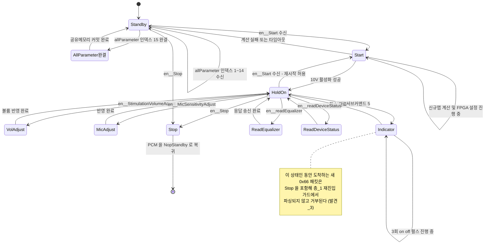
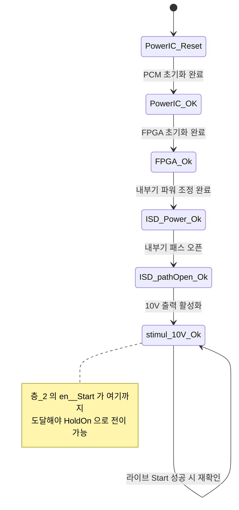
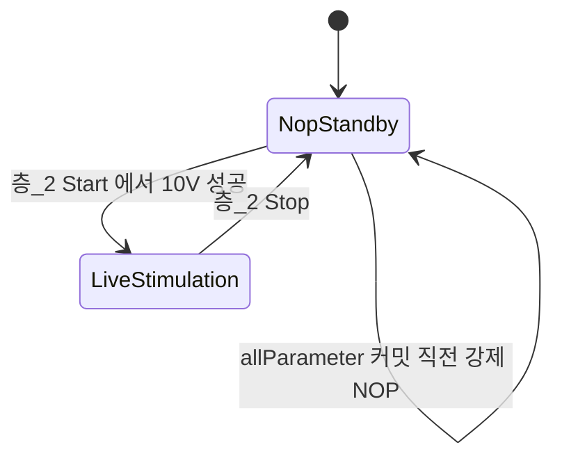
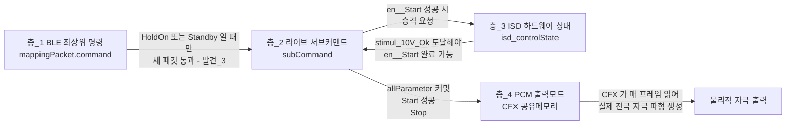

# 04 라이브모드 상태머신 규명

**TL;DR**: 0x66 라이브 경로는 서로 독립적으로 맞물리는 4개 층(BLE 매핑 명령·라이브 서브커맨드·ISD 하드웨어 상태·PCM 출력모드)으로 구성된다. 서브커맨드 9종, `en__allParameter`는 15개 데이터 인덱스로 분할 수신되며 인덱스 15 완결 전에는 공유메모리에 커밋되지 않아 미완성 자극 위험은 낮다. 반면 "라이브 서브상태가 HoldOn/Standby가 아닐 때 들어온 새 0x66 패킷(Stop 포함)은 전량 거부된다"는 재현 가능한 정지-지연 경합을 코드에서 확인했다(로그에는 미관측).

## 0. 핵심 발견 요약

| 번호 | 발견 | 확신도 |
|---|---|---|
| 발견_1 | 라이브 상태는 4개 층(§2)으로 독립 존재: ①`mappingPacket.command`(BLE 최상위 명령) ②`tdc_isd_map_live_step.subCommand`(라이브 서브상태) ③`EN__ISD_CONTROL_STATE`(ISD 하드웨어 램프업) ④PCM 출력모드(`PcmBitStream_Mode_*`, CFX 공유메모리) | 코드 확인 |
| 발견_2 | `en__allParameter`(하위명령1)의 15개 데이터 인덱스는 스테이징 구조체(`mappingPacket.tdc_isd_map_live_step`)에만 순차 기록되고, **인덱스 15 완결 시에만** 실제 CFX 공유 맵데이터로 일괄 커밋된다 → 중간에 끊겨도 절반짜리 자극 파라미터가 출력단에 도달하지 않음 | 코드 확인 |
| 발견_3 | **가장 중요**: `tdc_ble_mapping_fetch_packet()` 최상위 재진입 가드(89-112행)는 `subCommand`가 `en__HoldOn`/`en__Standby`가 아닌 동안 도착한 모든 새 0x66 패킷을 **`en__Stop`(정지 명령) 포함해서** 전량 거부한다. 알람 재생 중(~3사이클) 또는 Start 설정 중에는 Stop 패킷도 무시된다 | 코드 확인, 로그 미관측 |
| 발견_4 | 알람(Stimulation Indicator) 트리거는 발화 시점에만 `sitmulationIndicatorTrigger=true`로 상위 전파되고, 이후 3회 on/off 펄스는 `tdc_stim_indicator.c`의 **독립된 정적 상태**로 진행된다 - 라이브 서브상태가 도중에 바뀌어도 물리적 출력 자체는 끊기지 않는다 | 코드 확인 |
| 발견_5 | 볼륨(자극/오디오) 변경은 공유메모리 값 갱신만으로 반영되며, CFX 쪽에서 매 프레임 변경 감지 시 PCM을 잠시 NOP으로 무음 처리한 뒤 계수를 재계산한다 - "즉시"이지만 순간 무음 구간이 존재 | 코드 확인 |
| 발견_6 | `[MAPPING] LINK CHECK TRIGGERED (LIVE, STANDBY)`는 변수 2개의 런타임 치환이 아니라 **고정 리터럴 문자열**이며, 코드베이스 전체에서 호출부가 단 1곳(`tdc_isd_map_live.c:783`, 라이브 모듈의 `en__Standby` 케이스)뿐이다 | 코드 확인 |
| 발견_7 | 실측 로그의 패킷 마지막(21번째) 바이트는, TX 방향에서는 `buffer_tx_index`(SPI TX 버퍼에 채운 유효 바이트 수)와 정확히 일치한다(6개 서브커맨드 교차검증). RX 방향의 "01" 의미는 `Rx_dataPacket` 파싱 범위(0~19) 밖이라 `fetch_packet()`이 읽지 않음 - 미확인 | 부분 확인 |
| 발견_8 | 두 로그 모두 실제 코드 흐름과 100% 일치(순서·조건·응답 바이트 전부 대조 성공). 로그에 나타나되 코드로 설명 안 되는 전이는 없었고, 반대로 코드에는 있으나 로그에 없는 경로(재연결 복구, 알람+볼륨 경합, Stop 지연)는 §11에 정리 | 코드+로그 교차 |

## 1. 범위와 방법

- 주 대상: `src/2__cm3/source/ble/tdc_ble_mapping.c`의 `en__mapping_live_stimulation`(0x66) 처리 블록(309-953행), `tdc_ble_mapping_step()`(1777-2171행)
- 핵심 협력 파일: `src/2__cm3/source/isd/tdc_isd_map_live.c`(라이브 서브상태 머신 본체), `tdc_isd_map_live.h`, `tdc_ble_mapping.h`, `tdc_isd.h`(ISD 하드웨어 상태), `tdc_stim_indicator.c/h`(알람), `tdc_shm.c`(볼륨/PCM모드 공유메모리), 참고로 `src/1__cfx/systemControl/system_control.c`·`signalProcessing/nonlinearMapping.c`(CFX 쪽 소비 지점 - 볼륨/알람이 실제로 자극에 반영되는 마지막 단계)
- 실측 로그: `docs/참고/ble/매핑로그 - 라이브모드.md`(130줄), `docs/참고/ble/매핑로그 - 라이브모드 + 알람재생 + 볼륨변경.md`(192줄) - 직접 읽고 바이트 단위로 디코딩(§10)
- 제약 준수: 읽기 전용(소스 미수정), 모든 사실 주장에 `파일:라인` 근거, 근거 없는 부분은 "미확인"으로 명시, BLE 프로토콜 정의는 미참조라도 제거 제안 안 함

## 2. 계층 구조 개관 - 라이브 상태는 몇 겹인가

라이브모드 상태는 **서로 다른 모듈이 독립적으로 관리하는 4개 층**으로 존재한다. 층 사이에는 명시적 동기화가 아니라 "조건부 게이팅"(예: 층3이 특정 값 이상이어야 층2 진입 허용)과 "부수효과 트리거"(예: 층2 전이가 층4 값을 바꿈)만 있다.

| 층 | 이름 | 변수·타입 | 정의 위치 | 소유 모듈 | 값 집합 |
|---|---|---|---|---|---|
| 층_1 | BLE 매핑 최상위 명령 | `mappingPacket.command` (`EN__MAPPING_COMMAND`) | `tdc_ble_mapping.h:112`, 열거형 `tdc_ble_protocol.h:84-113` | `tdc_ble_mapping.c` | `en__mapping_IDLE`(0) ~ 0x71 등. 라이브 세션 중에는 `en__mapping_live_stimulation`(0x66)에 고정 |
| 층_2 | 라이브 서브커맨드(라이브 서브상태) | `mappingPacket.tdc_isd_map_live_step.subCommand` (`EN__LIVE_STIMULATION_SUB_COMMAND`) | `tdc_ble_mapping.h:116`, 열거형 `tdc_isd_map_live.h:7-19` | `tdc_ble_mapping.c`(fetch) + `tdc_isd_map_live.c`(step) | `en__Standby`(0) ~ `en__HoldOn`(9), §3 전수표 |
| 층_3 | ISD 하드웨어 제어 상태(자극칩 램프업) | `s_isd_state.isd_controlState` (`EN__ISD_CONTROL_STATE`) | `tdc_isd.h:9-19`, 정적 변수 `tdc_isd.c:119` | `tdc_isd.c` | `en__isdStatus_NA`(0) → `PowerIC_Reset` → `PowerIC_OK` → `FPGA_Ok` → `ISD_Power_Ok` → `ISD_pathOpen_Ok` → `stimul_10V_Ok`(6) |
| 층_4 | PCM 출력모드(CFX 오디오 경로) | `Addr_SharedMem->cfx_PCM_interface.PCM_mode`, CM3 쪽 진입점 `tdc_shm_change_pcm_output_mode()` | 매크로 `src/1__cfx/internalDevice/driver_PCM.h:27,29` (`LiveStimulation=2`, `NopStandby=4`), 함수 `tdc_shm.c:97-110` | CM3 `tdc_shm.c` 기록, CFX `driver_PCM.c` 소비 | `PcmBitStream_Mode_LiveStimulation`(2) / `PcmBitStream_Mode_NopStandby`(4) 등 |
| 참고 (층_5) | 전극별 DAC/FPGA 레지스터 설정 마이크로스텝 | `flowControlCounter`(카운터 기반, 이름 있는 상태 없음) | `tdc_isd_stim_para_setting.c:1096` `tdc_isd_stim_setting_step()` | `tdc_isd_stim_para_setting.c` | 카운터 진행, enum 없음 - 상세분석 범위 밖(참고만) |

**층간 관계 요약**:
- 층_2(`en__Start`)는 층_3이 `en__isdStatus_stimul_10V_Ok`까지 올라가야 완료된다(`tdc_isd_map_live.c:174` `tdc_isd_change_state(en__isdStatus_stimul_10V_Ok)`). 즉 층_2가 층_3을 끌어올리는 트리거 역할.
- 층_2(`en__allParameter`/`en__Start`/`en__HoldOn`)가 층_4를 직접 전환한다(`tdc_shm_change_pcm_output_mode(...)` 호출, §5.2 다이어그램의 전이 라벨 참조).
- 층_1은 층_2에 대해 "누가 새 패킷을 받아도 되는가"만 게이팅한다(§6, §11의 정지-지연 경합 참조). 층_1 자체는 라이브 세션 내내 0x66에 고정되어 거의 움직이지 않는다.
- 층_5는 층_2의 `en__Start`/`en__HoldOn` 케이스가 내부적으로 호출하는 하위 마이크로스텝이며, 이 노드의 상세 분석 범위 밖이다(참고용 인용만).

## 3. 라이브 서브커맨드 전수표

정의: `tdc_isd_map_live.h:7-19` (`EN__LIVE_STIMULATION_SUB_COMMAND`). 와이어 상 유효 범위는 `tdc_ble_mapping.c:328` `(liveSubCommand < 1) || (9 < liveSubCommand)` 체크로 **1~9만 허용**된다(0은 프로토콜 외부 전용 - 앱이 보낼 수 없음, 9는 통과는 하지만 아래 switch의 `default`로 떨어져 사실상 무의미).

| 값 | 이름 | 의미 | fetch 처리(RX, `tdc_ble_mapping.c`) | step 처리(TICK, `tdc_isd_map_live.c`) | 비고 |
|---|---|---|---|---|---|
| 0 | `en__Standby` | 유휴/대기 서브상태 | 앱이 직접 보낼 수 없음(범위검사 `liveSubCommand<1`에서 차단, `tdc_ble_mapping.c:328`) - 내부 전용 | 775-801행: `ISD_state.conneded_ISD`이면 300틱 주기로 `tdc_isd_update_link_by_backtel_mapping()` 호출, 첫 진입 시 `[MAPPING] LINK CHECK TRIGGERED (LIVE, STANDBY)` 출력(783행) | §9 참조 |
| 1 | `en__allParameter` | 전체 파라미터 전달(15개 데이터 인덱스 분할) | 341-740행. 15번째 인덱스까지 순차 검증·저장 | 72-123행: 공유메모리에 일괄 커밋, `stimulVolume`/`audioVolume` 반영, `tdc_shm_change_program_map_num(-1/-2)` 호출 후 subCommand→`en__Standby` | §4.1 |
| 2 | `en__Start` | 라이브 자극 시작 | 742-746행: 무조건 subCommand=`en__Start` (게이팅 없음) | 125-214행: 신규맵 계산→FPGA 설정→10V 활성화, 완료 시 subCommand→`en__HoldOn`, 실패 시 →`en__Standby` | §4.2, 층_3·층_4 동시 전이 |
| 3 | `en__StimulationVolumeAdjust` | 자극 볼륨 조절(1~4) | 748-775행: `subCommand==en__HoldOn`일 때만 수락 | 216-250행: `tdc_shm_change_stimul_volume()`, 응답 후 subCommand→`en__HoldOn` | §4.3, §8 |
| 4 | `en__MicSensitivityAdjust` | 마이크 감도(오디오 볼륨) 조절(1~10) | 777-801행: 동일하게 HoldOn 게이팅 | 252-284행: `tdc_shm_change_audio_volume()` | §4.4, §8 |
| 5 | `en__mapping_Stimul_indicator` | 알림(알람)용 자극 출력 | 803-881행: HoldOn 게이팅, 채널·진폭 범위검사(현재 맵의 T/C 레벨 기준) | 286-334행: `flowCounter==0`에 트리거 세팅, 이후 알람 종료까지 subCommand 유지 | §4.5, §7 |
| 6 | `en__readEqualizer` | 자극 출력값 읽기(이퀄라이저) | 883-932행: HoldOn 게이팅, 시작/끝 인덱스(1~32, 차이≤8) | 336-426행: 255레벨→uA 환산 응답 | §4.6 |
| 7 | `en__readDeviceStatus` | 장치 상태 읽기 | 934-938행: 무조건 수락(게이팅 없음) | 428-461행: 연결상태+배터리 응답 | §4.7 |
| 8 | `en__Stop` | 라이브 자극 종료 | 940-944행: 무조건 수락(게이팅 없음) | 753-773행: PCM→NOP, 응답 후 `tdc_ble_mapping_clear_command()`(층_1도 IDLE로) | §4.8 |
| 9 | `en__HoldOn` | 자극 유지(대기, 앱이 직접 못 보냄) | switch에 `case`가 없어 `default`로 낙하 → subCommand=`en__Standby`(946-949행) | HoldOn은 "안정 상태"로서 조건 검사에만 쓰이고 자체 케이스가 없음(각 서브커맨드가 완료 시 여기로 복귀) | 하위명령 3/4/5/6의 게이트 조건이자, en__Start 완료 후 도착점 |

## 4. 서브커맨드별 페이로드 레이아웃(바이트 오프셋)

전제: 로그 상 패킷은 21바이트(`[0]`=헤더 0x66, `[1]`=서브커맨드, `[2..19]`=서브커맨드별 페이로드, `[20]`=§4.9 참조). `tdc_ble_mapping_fetch_packet(const int *Rx_dataPacket)`이 실제로 읽는 배열 크기는 `BLE_DataPacketSize=20`(`tdc_ble_protocol.h:5`)이므로 인덱스 0~19만 파싱 대상이다.

### 4.1 하위명령 1 (`en__allParameter`) - 데이터 인덱스 1~15

`[2]`가 데이터 인덱스(1~15, `Live_AllParameter_payloadNum=15`, `tdc_isd_map_live.h:21`). 순서 강제: 수신된 인덱스가 `prev+1`이 아니면 에러+처음(인덱스1)부터 재시작(`tdc_ble_mapping.c:352-357`).

| 인덱스 | 대상 필드 | 바이트 오프셋(`[3..19]` 내) | 범위검사 | 코드 위치 |
|---|---|---|---|---|
| 1 | `stimulVolume`(1B,1~4) / `audioVolume`(1B,1~10) / `stimulationIndicatorChannelNum`(1B,1~32) / `stimulationIndicatorAmplitude_uA`(2B BE,0~1800) / `stimulationStrategy`(1B,1~3) / `stimulationMode`(1B,1~6) / `firstPulsePhase`(1B,0~1) / `stimulationPulsePhaseWidth`(1B,13~255) / `numFrequencyBand`(1B,1~32) | `[3]`,`[4]`,`[5]`,`[6..7]`,`[8]`,`[9]`,`[10]`,`[11]`,`[12]` (나머지 `[13..19]` 패딩) | 각 필드별, 코드 참조 | `tdc_ble_mapping.c:365-442` |
| 2 | `usableStimulationElectrodIndex[0..16]` (17B, 각 1~100) | `[3..19]` | 원소별 1~100 | `tdc_ble_mapping.c:446-459` |
| 3 | `usableStimulationElectrodIndex[17..31]` (15B) | `[3..17]`(`[18..19]` 미사용) | 동일 | `tdc_ble_mapping.c:462-475` |
| 4 | `usableReferenceElectrodIndex[0..16]` (17B) | `[3..19]` | 1~100 | `tdc_ble_mapping.c:478-491` |
| 5 | `usableReferenceElectrodIndex[17..31]` (15B) | `[3..17]` | 1~100 | `tdc_ble_mapping.c:494-507` |
| 6 | `CIS_FreqBandOrder[0..16]` (17B) | `[3..19]` | 1~100 | `tdc_ble_mapping.c:510-523` |
| 7 | `CIS_FreqBandOrder[17..31]` (15B) | `[3..17]` | 1~100 | `tdc_ble_mapping.c:526-539` |
| 8 | `T_level_uA[0..7]` (8×2B BE, 각 0~1800) | `[3..18]` | 0~1800 | `tdc_ble_mapping.c:542-557` |
| 9 | `T_level_uA[8..15]` | `[3..18]` | 0~1800 | `tdc_ble_mapping.c:560-575` |
| 10 | `T_level_uA[16..23]` | `[3..18]` | 0~1800 | `tdc_ble_mapping.c:578-593` |
| 11 | `T_level_uA[24..31]` | `[3..18]` | 0~1800 | `tdc_ble_mapping.c:596-611` |
| 12 | `C_level_uA[0..7]` | `[3..18]` | 0~1800 | `tdc_ble_mapping.c:614-629` |
| 13 | `C_level_uA[8..15]` | `[3..18]` | 0~1800 | `tdc_ble_mapping.c:632-647` |
| 14 | `C_level_uA[16..23]` | `[3..18]` | 0~1800 | `tdc_ble_mapping.c:650-665` |
| 15 | `C_level_uA[24..31]` | `[3..18]` | 0~1800, **완결 시 커밋 트리거** | `tdc_ble_mapping.c:668-690`, 완결 판정 `:710` |

인덱스 1~15 모두 정상 수신되면(`subCommandData_Num_index == 15`) 그제서야: (a) `audio_input_x_mim/x_max` 32채널 기본값 채움, (b) subCommand=`en__allParameter`로 전환(`:729`), 다음 tick에 `tdc_isd_map_live_step()`의 `en__allParameter` 케이스가 실제 공유메모리(`p_mapDataSharedMemory`) 커밋을 수행한다(`tdc_isd_map_live.c:84-101`). **인덱스 1~14 사이에는 이 커밋이 절대 발생하지 않는다** - §12 질문_3 답변의 근거.

### 4.2 하위명령 2 (`en__Start`)

`[2..19]` 전부 미사용(페이로드 읽지 않음, `tdc_ble_mapping.c:742-746`). 게이팅 없이 무조건 수락.

### 4.3 하위명령 3 (`en__StimulationVolumeAdjust`)

`[2]` = 자극 볼륨 값(1~4, `df_maxStimulationVloumeLevel`, `tdc_stim_definitions.h:72`). `subCommand==en__HoldOn`일 때만 수락(`tdc_ble_mapping.c:750`).

### 4.4 하위명령 4 (`en__MicSensitivityAdjust`)

`[2]` = 오디오 볼륨 값(1~10, `df_maxMicVloumeLevel`, `tdc_stim_definitions.h:30`). HoldOn 게이팅(`tdc_ble_mapping.c:779`).

### 4.5 하위명령 5 (`en__mapping_Stimul_indicator`)

`[2]` = 알림용 채널 번호(1~`numFrequencyBand`, 고정 1~32가 아니라 **현재 맵의 실제 밴드 수**로 상한 - `tdc_ble_mapping.c:811`). `[3..4]` = 알림용 자극 진폭 uA(BE16), 유효 범위는 고정폭이 아니라 **런타임에 현재 맵의 `max_C_uA`/`min_T_uA`를 스캔해 계산**(`tdc_ble_mapping.c:825-860`). HoldOn 게이팅(`:805`).

### 4.6 하위명령 6 (`en__readEqualizer`)

`[2]` = 시작 인덱스(1~32), `[3]` = 끝 인덱스(1~32), 추가 제약 `(끝-시작) ≤ 8`(`tdc_ble_mapping.c:890-914`). HoldOn 게이팅.

### 4.7 하위명령 7 (`en__readDeviceStatus`)

페이로드 없음(헤더+서브커맨드만). 게이팅 없음.

### 4.8 하위명령 8 (`en__Stop`)

페이로드 없음. 게이팅 없음(단, §11·§6 전이표 참조 - 이 "게이팅 없음"은 하위명령 스위치 내부 얘기이고, **더 바깥의 층_1 재진입 가드는 게이팅한다** - 발견_3).

### 4.9 패킷 21번째 바이트(`[20]`)의 정체

`BLE_DataPacketSize=20`(`tdc_ble_protocol.h:5`)이므로 `Rx_dataPacket`/`bufferForSPI_tx` 배열은 논리적으로 20개 원소(인덱스 0~19)이고, `tdc_ble_mapping_fetch_packet()`은 이 범위만 읽는다. TX 쪽에서 로그의 21번째 바이트를 6개 서브커맨드(1/2/3/4/5/8, §10 표 참조)에 대해 실제 `buffer_tx_index`(코드가 채운 유효 바이트 수)와 대조하면 **전부 정확히 일치**한다(예: 하위명령1 응답은 3바이트 채움→끝자리 `03`, `en__Start`/`en__mapping_Stimul_indicator`/`en__Stop` 응답은 2바이트→`02`, 0x67 장치상태 응답은 5바이트→`05`). 따라서 **TX 방향 끝자리는 SPI TX 버퍼 유효 바이트 수**로 결론 내릴 수 있다(높은 확신도). RX 방향은 로그에서 항상 `01`로 고정되어 있으나, `fetch_packet()` 코드 안에서 이 위치를 읽는 로직이 전혀 없어 **의미는 미확인**(SPI/RTT 캡처 계층이 붙이는 프레이밍 바이트로 추정되나 확정 근거 없음).

## 5. Mermaid 상태 다이어그램(층별)

### 5.1 층_2 - 라이브 서브커맨드 상태머신 (핵심)



**전이 근거**

| 전이 | 근거 | 비고 |
|---|---|---|
| 초기 진입 | 부팅 또는 `tdc_ble_mapping_clear_command()` | - |
| allParameter 인덱스 15 완결 | `tdc_ble_mapping.c:710`·`:729` | 인덱스 1~14 는 매번 재설정 |
| 공유메모리 커밋 | `tdc_isd_map_live.c:120` | - |
| Start 진입 | 게이팅 없음 | Standby·HoldOn 양쪽에서 가능 |
| Start 유지 | `flowCounter <= 1000` | 신규맵 계산 중 |
| Start 실패 | `flowCounter > 1000` 타임아웃 | 에러 통지 |
| Start -> HoldOn | 로그 `SUCCESS TO ENABLE STIM 10V`. PCM 모드가 LiveStimulation 으로 전환 | - |
| 볼륨 조절 | ISD 연결 시에만 | `subCommand != HoldOn` 상태에서 수신하면 `en__Command_Order` 로 거부 후 Standby 복귀 |
| 알람 펄스 완료 | `tdc_stim_indicator_is_triggered() == false` | `tdc_stim_indicator` 독립 카운터가 진행 |
| ReadDeviceStatus·Stop | 게이팅 없음 | - |
| Stop -> 종료 | `tdc_ble_mapping_clear_command()` 호출로 **층_1 도 IDLE 복귀** | - |

### 5.2 층_3 - ISD 하드웨어 제어 상태(자극칩 램프업)



**전이 근거**: 10V 활성화는 `tdc_isd_enable_stimul_10v`, 재확인은 `tdc_isd_change_state()`(`tdc_isd_map_live.c:174`). 상태 열거형 정의는 `tdc_isd.h:9-19`.

### 5.3 층_4 - PCM 출력모드(CFX 오디오 경로)



**전이 근거**: `NopStandby` 가 부팅 기본값. 라이브 진입 `tdc_isd_map_live.c:195`, 해제 `:755`. 강제 NOP 은 map_num 변경 때문이며 `tdc_isd_stim_standalone.c:25`.

### 5.4 층간 관계(개략)



## 6. 전이 규명 표(트리거→전이→부수효과)

| 전이 | 트리거(패킷/조건) | 전이 전 | 전이 후 | 부수효과 | 근거 |
|---|---|---|---|---|---|
| 전이_1 | `0x66 01 <idx=1..15>` 순차 수신 | Standby(또는 HoldOn) | idx<15: Standby 유지 / idx=15: `en__allParameter` | 스테이징 구조체 필드만 갱신, 커밋 없음(idx<15) | `tdc_ble_mapping.c:341-737` |
| 전이_2 | idx=15 완결 다음 tick | `en__allParameter` | `en__Standby` | 공유메모리 일괄 커밋, `audioVolume`/`stimulVolume` 반영, `tdc_shm_change_program_map_num(-1/-2)` 호출→`newMapLoadeFlagForStimulParaCalculation=true`+**PCM 강제 NOP**+`[INDICATE] NEW MAP LOADED...` 로그 | `tdc_isd_map_live.c:72-122`, `tdc_shm.c:331-378`, `tdc_isd_stim_standalone.c:23-30` |
| 전이_3 | `0x66 02 00`(Start) | Standby 또는 HoldOn | 신규맵 있으면 계산/FPGA설정, 없으면 즉시 재확인 | 성공 시 층_3→`stimul_10V_Ok`, 에러 클리어(`RF_PowerIC/FPGA_CONFIGUARATION/ISD_ERROR`), 층_4→`LiveStimulation`, subCommand→HoldOn. 실패 시 subCommand→Standby+에러통지 | `tdc_isd_map_live.c:125-213` |
| 전이_4 | flowCounter>1000(약 13msec 주석, 정확 주기 미확인) | `en__Start` | `en__Standby` | `en__stimulationParameterUnloaded` 에러 통지 - Start가 무한정 걸리지 않도록 하는 타임아웃 | `tdc_isd_map_live.c:206-212` |
| 전이_5 | `0x66 03 <vol>`(VolAdjust), `subCommand==HoldOn`이고 `ISD_state.conneded_ISD`일 때 | HoldOn | HoldOn(자기순환) | `tdc_shm_change_stimul_volume()`, TX 응답 | `tdc_isd_map_live.c:216-250`, §8 |
| 전이_6 | `0x66 04 <vol>`(MicAdjust), 동일 조건 | HoldOn | HoldOn | `tdc_shm_change_audio_volume()` | `tdc_isd_map_live.c:252-284`, §8 |
| 전이_7 | `0x66 05 <ch><amp>`(Indicator), `subCommand==HoldOn` | HoldOn | `en__mapping_Stimul_indicator` | `sitmulationIndicatorTrigger=true`(1틱만), `tdc_stim_indicator_set_level_255()` | `tdc_isd_map_live.c:286-304`, §7 |
| 전이_8 | 알람 3사이클 종료(`!tdc_stim_indicator_is_triggered()`) | `en__mapping_Stimul_indicator` | HoldOn | TX 응답 송신 | `tdc_isd_map_live.c:305-321` |
| 전이_9 | `0x66 08 00`(Stop), **`subCommand`가 HoldOn/Standby일 때만 층_1 가드 통과** | HoldOn 또는 Standby | (종료) | 층_4→NopStandby, TX 응답, `tdc_ble_mapping_clear_command()`로 **층_1도 IDLE 복귀** | `tdc_isd_map_live.c:753-773`, 층_1 가드 `tdc_ble_mapping.c:89-112` |
| 전이_10(경합) | HoldOn/Standby가 아닌 서브상태(예: Indicator 진행 중, Start 계산 중) 동안 새 0x66 패킷 도착 | (임의) | **무변화**(패킷 자체가 파싱되지 않음) | `en__PreviouCommnadIsNotCompleted` 에러 통지만 발생, `liveSubCommand` 바이트조차 읽히지 않음 | `tdc_ble_mapping.c:89-112`, 발견_3 |
| 전이_11 | 하위명령 3/4/5/6이 층_1은 통과했으나(Standby로 통과) 내부 `subCommand==HoldOn` 체크 실패 | Standby | Standby(사실상 무변화) | `en__Command_Order` 에러 통지 | `tdc_ble_mapping.c:750,772` 등(§11) |
| 전이_12 | 재연결 복구(en__HoldOn 안에서 `ISD_state.conneded_ISD`가 false→true로 복귀) | HoldOn(연결끊김 중) | HoldOn(재계산 경로) | `needResetting` 플래그로 데이터 재적용, 필요 시 파라미터 재계산 재실행 | `tdc_isd_map_live.c:463-627`, §11 로그 미관측 항목 |

## 7. 알람 재생(Stimulation Indicator) 경로

경로: BLE `0x66 05 <ch> <amp_hi> <amp_lo>` 수신(`tdc_ble_mapping.c:803-881`, HoldOn 게이트) → `mappingPacket.tdc_isd_map_live_step.stimulationIndicatorChannelNum/Amplitude_uA` 저장, 범위검사는 **현재 맵의 실측 T/C 레벨**로 계산(`max_C_uA`/`min_T_uA` 스캔, `:826-858`) → subCommand=`en__mapping_Stimul_indicator` → 다음 tick `tdc_isd_map_live_step()`에서 `flowCounter==0`일 때 공유맵 데이터에 채널/진폭 반영 후 `tdc_stim_indicator_set_level_255()`(uA→255레벨 환산, `tdc_stim_indicator.c:75-124`) 호출하고 반환값 `sitmulationIndicatorTrigger=true`(`tdc_isd_map_live.c:286-304`).

이 bool은 `tdc_ble_mapping_step()`(`:1956,2165`) → `tdc_ble_communication_step()`(`:445`) → `main.c` 메인 루프에서 **바로 그 tick에** `tdc_stim_indicator_out(사용자설정, 저전력트리거, 매핑트리거)`(`main.c:588-591`)로 전달된다. `tdc_stim_indicator.c:23-69`의 `tdc_stim_indicator_out()`은 자신만의 **독립 정적 변수**(`stimulationIndicatorTrigger`, `counter`, `outputPulseTrainCounter`)로 이후 진행을 관리한다 - `counter<80`이면 알림 출력 ON, 아니면 OFF, `counter>=160`마다 사이클 카운트 증가, 3사이클(`outputPulseTrainCounter==3`) 후 자동 해제. 이 on/off 플래그는 `tdc_shm_set_stimulation_indicator_on_off_by_cm3()`로 공유메모리에 기록되고, CFX 쪽 `nonlinearMapping.c:163-196`에서 `mapNum<0`(라이브 모드)일 때 지시 채널의 PCM 진폭을 알림 레벨로 덮어써 실제 전극 자극을 출력한다.

**핵심**: 트리거가 한 번 세팅되면 이후 3사이클 진행은 `tdc_isd_map_live_step`의 `subCommand`와 **완전히 분리**되어 진행된다(발견_4). 즉 알람 재생 도중 라이브 서브상태가 외부 요인으로 바뀌어도(§11 경합 시나리오) 물리적 알림 출력 자체는 끊기지 않고 끝까지 실행된다. 다만 "알람 완료" TX 응답과 subCommand의 HoldOn 복귀는 `tdc_isd_map_live_step`의 `en__mapping_Stimul_indicator` 케이스가 다시 호출되어야 발생하므로, 서브상태가 도중에 다른 값으로 바뀌면 **그 완료 통지 자체는 유실**된다(§11).

## 8. 볼륨 변경 경로

`stimulVolume`(1~4)·`audioVolume`(1~10)은 두 경로로 들어온다: (a) `en__allParameter` 인덱스1(§4.1)로 최초 설정, (b) 라이브 중 `en__StimulationVolumeAdjust`(3)/`en__MicSensitivityAdjust`(4)로 개별 조정(§4.3, §4.4) - 둘 다 `subCommand==HoldOn`일 때만 허용.

반영 메커니즘: `tdc_shm_change_stimul_volume()`/`tdc_shm_change_audio_volume()`(`tdc_shm.c:386-414`)은 공유메모리 `cfx_cm3_sharedMemoryAll.userSettingValue.stimulVolume/audioVolume`을 즉시 덮어쓸 뿐이다. 실제 반영은 CFX 쪽 `Normal_PowerMode_event_both_stimulation_audio_volumeChange()`(`system_control.c:182-202`)가 **매 프레임 값 변경을 폴링**해 감지하고, 변경이 있으면 `fn_PcmBitStream_Mode_NopStandby()`로 잠깐 무음 처리한 뒤 `calculate_newStimulation_maxLevel()`/`calculate_logaritmMapping_coeff_with_audioVolume()`로 계수를 재계산한다(`:186-199`). 즉 "즉시 반영"이되 **재계산 구간 동안 순간 무음이 발생**하는 구조다(정확한 무음 지속시간은 미확인). 이 폴링 함수는 `Normal_PowerMode_isdConnected()`류 CFX 메인 루프에서 매 프레임 무조건 호출되므로(`system_control.c:217-249`), 라이브 스트리밍 여부와 무관하게 항상 적용된다.

로그 상 실측 대조(§10.2): `0x66 03 04`(볼륨=4) → TX `0x66 03 04...` (`tdc_shm_read_stimul_volume()` 값이 그대로 echo, `tdc_isd_map_live.c:233`), `0x66 04 0A`(마이크=10) → TX `0x66 04 0A...`, `0x66 04 01`(마이크=1) → TX `0x66 04 01...` - 모두 코드 예측과 정확히 일치.

## 9. `LINK CHECK TRIGGERED (LIVE, STANDBY)` 규명

이 문자열은 `%s`/`%d` 같은 런타임 치환이 전혀 없는 **고정 리터럴**이다:

```c
TDC_PRINTF_V("\r\n[MAPPING] LINK CHECK TRIGGERED (LIVE, STANDBY) \r\n");
```

(`tdc_isd_map_live.c:783`, `tdc_isd_map_live_step()`의 `case en__Standby:` 블록 안, `ISD_connectionCounter_withMapping==0`일 때 1회 출력). 코드베이스 전체에서 이 문자열의 호출부는 **여기 한 곳뿐**이다(`Grep "LINK CHECK TRIGGERED"` 전체 결과 1건). 따라서 괄호 안 값은 "런타임 상태를 두 개 채운 것"이 아니라 **호출 지점을 사람이 읽을 수 있게 라벨링한 것**이다:
- `LIVE` = 이 링크체크 호출이 **라이브(0x66) 모듈**(`tdc_isd_map_live.c`)의 `tdc_isd_update_link_by_backtel_mapping()` 호출 지점(`:786`)에서 발생했다는 뜻.
- `STANDBY` = 그 중에서도 층_2 서브상태가 **`en__Standby`**일 때(`:781-793`)라는 뜻. `en__HoldOn`을 포함한 다른 서브상태들은 대신 `tdc_isd_update_link_by_backtel_live()`(다른 함수, PCM 백텔 기반)를 호출하므로 이 로그가 나오지 않는다(`tdc_isd_map_live.c:222,257,291,341,634,651`).

구조적으로 동일한 성격의 링크체크가 층_1 쪽에도 하나 더 있다(`tdc_ble_mapping.c:2138-2143`, 최상위 명령이 `en__mapping_IDLE`일 때 `tdc_isd_update_link_by_backtel_mapping(connectionCheckCounter)` 호출) - 하지만 그쪽 진입 로그는 "2차 리팩토링에서 제거했다"는 주석과 함께 삭제되어 있다(`:2140-2141`). 그래서 실측 로그에는 항상 `(LIVE, STANDBY)`만 보이고 다른 라벨(예: `(MAPPING, IDLE)`)은 등장하지 않는다 - 애초에 그 경로는 로그를 찍지 않기 때문이다.

로그 대조: `매핑로그 - 라이브모드.md`에서 이 로그는 `allParameter` 인덱스 전송 사이(인덱스1→2, 5→6, 10→11, 13→14 직전 등)에 산발적으로 등장한다(38,56,78,92행). 인덱스 1~14 사이에는 subCommand가 매번 `en__Standby`로 재설정되므로(전이_1) `en__Standby` 케이스의 300틱 주기 카운터가 우연히 0으로 랩어라운드되는 시점에 걸리면 출력된다 - 매 패킷마다 나오지 않는 것도 코드와 정합적이다(카운터 주기가 패킷 간격보다 길 수 있음).

## 10. 실측 로그 대조

### 10.1 로그1 - `매핑로그 - 라이브모드.md` (알람/볼륨 없음, 130줄)

| 시각(SYSTIME) | RX/TX 패킷(요약) | 디코딩 | 상태머신 대응 |
|---|---|---|---|
| ~185~215 | `0x67 00...` ↔ `0x67 01 50...` 반복 | 0x67(장치상태) 폴링 - 층_1/층_2와 무관한 하트비트 | 라이브 진입 전 배경 트래픽 |
| - | `0x66 01 01` ~ `0x66 01 0F` (인덱스1~15) | §4.1 그대로, 각 TX가 `0x66 01 <idx> 00...0<idx수>` 형태로 echo | 전이_1, 중간에 `LINK CHECK TRIGGERED (LIVE,STANDBY)` 3회 산발 등장(§9) |
| 220 | `[LIVE] LIVE ALL PARAMETER PAYLOAD NUM : NOW...` → `[FFT]...` → `[INDICATE] NEW MAP LOADED...` → `[LIVE]...SUB COMMAND : STANDBY` | 전이_2 그대로. FFT 읽기→INDICATE 순서까지 코드 실행순서(`tdc_shm.c:366-377`)와 정확히 일치 | 전이_2 |
| - | `0x66 02 00`(Start) → `[LIVE]...NEW MAP LOADED FLAG IS TRUE` → PARAM 3줄 → `CFX WILL CALCULATE...` → `[STIMULATION] TRIGGER/DONE` → `SUCCESS TO ENABLE STIM 10V BY EN__START` → TX `0x66 02 00...02` | 전이_3 성공 경로 전부 관측 | 전이_3, 층_3→stimul_10V_Ok, 층_4→LiveStimulation |
| 225~240 | BATT 로그만 지속 | 라이브 스트리밍(HoldOn) 유지 구간 - 서브커맨드 없음 | HoldOn 자기유지(로그에 별도 이벤트 없음, 정상) |
| - | `0x66 08 00`(Stop) → TX `0x66 08 00...02` | 전이_9 | 세션 종료, 층_1도 IDLE 복귀 |
| - | `0x67 00...` ↔ TX 재개 | 종료 후 하트비트 재개 | - |

### 10.2 로그2 - `매핑로그 - 라이브모드 + 알람재생 + 볼륨변경.md` (192줄)

| 시각(SYSTIME) | RX/TX 패킷 | 디코딩 | 상태머신 대응 |
|---|---|---|---|
| 315~340 | `0x67 00...` 반복 | 하트비트 | - |
| - | `0x66 01 01`~`0x66 01 0F` | 로그1과 동일(값도 거의 동일, 인덱스0D의 T-level만 `05 78`로 로그1의 `04 B0`과 다름 - 앱에서 실제로 다른 전극값을 보낸 것으로, 코드 불일치 아님) | 전이_1 |
| - | ALL PARAMETER 완결 → INDICATE → `LINK CHECK TRIGGERED(LIVE,STANDBY)` 1회 더 → `0x66 02 00` → Start 성공 시퀀스 | 전이_2, 전이_3 | 로그1과 동일 패턴, §9 라벨 재확인 |
| 345 | TX `0x66 02 00...02` | Start 완료 | HoldOn 진입 |
| 350~360 | `0x66 05 14 03 20` ×3 → 매번 즉시 TX `0x66 05 00...02` | 전이_7→전이_8이 3회 반복. 매번 이전 알람이 완전히 끝난 뒤(subCommand가 HoldOn으로 복귀한 뒤)에만 다음 알람이 수락된 것으로 해석됨(HoldOn 게이트, `:805`) | Indicator 경로(§7), **3회 연속 재생이 서로 겹치지 않고 직렬화됨을 시사** |
| 365 | `0x66 04 0A`(마이크=10) → TX `0x66 04 0A...03` | 전이_6 | MicAdjust |
| 370 | `0x66 03 04`(볼륨=4) → TX `0x66 03 04...03` | 전이_5 | VolAdjust |
| 375 | `0x66 05 14 03 20` → TX `0x66 05 00...02` | 전이_7→8 | Indicator 재실행 |
| 380 | `0x66 04 01`(마이크=1) → TX `0x66 04 01...03` | 전이_6 | MicAdjust |
| - | `0x66 08 00`(Stop) → TX `0x66 08 00...02` | 전이_9 | 종료 |
| 385~ | `0x67 00...` 재개 | 하트비트 재개 | - |

**중요**: 이 로그에서 알람(05)·볼륨(03/04) 명령은 **한 번도 겹치지 않고 순차적으로만** 온다(각 명령이 완전히 끝난 뒤 다음 명령 도착). 따라서 §11에서 다루는 "알람 재생 중 볼륨 명령이 오면" 경합 시나리오는 **이 실측 로그로는 검증되지 않았다** - 코드 분석만으로 도출한 결론이다.

## 11. 코드-로그 불일치 목록

| 항목 | 코드가 시사하는 경로 | 로그 관측 여부 | 판정 |
|---|---|---|---|
| 불일치_1 | 알람 재생 중(`en__mapping_Stimul_indicator`) 또는 Start 계산 중(HoldOn/Standby 아님) 새 0x66 패킷(볼륨/마이크/Stop 포함)이 오면 층_1 가드에서 **전량 거부**됨(전이_10, 발견_3) | 로그2는 각 명령이 항상 순차적으로 완결된 뒤 다음이 옴 - 경합 상황 자체가 로그에 없음 | 코드에만 존재, 로그로 미검증 |
| 불일치_2 | `en__HoldOn` 케이스 내 재연결 복구 로직(연결 끊김→재접속 시 데이터 재적용, `tdc_isd_map_live.c:463-627`) | 두 로그 모두 ISD 연결이 끊기는 이벤트가 없음(`conneded_ISD` false 전이 없음) | 코드에만 존재, 로그로 미검증 |
| 불일치_3 | `flowCounter>1000` Start 타임아웃 경로(전이_4) | 두 로그 모두 Start가 즉시(같은 tick 근방) 성공 - 타임아웃 발생 안 함 | 코드에만 존재, 로그로 미검증 |
| 불일치_4 | 하위명령 9(`en__HoldOn`)를 앱이 직접 보내는 경우(`default`로 낙하, 조용히 Standby로) | 두 로그 모두 서브커맨드 9가 등장하지 않음 | 코드에만 존재, 로그로 미검증(설계상 앱이 보낼 이유가 없어 보임) |
| 불일치_5 | `en__allParameter`를 HoldOn 상태(라이브 스트리밍 중)에 재전송해 맵을 갱신하는 경로(§6 다이어그램 참고, `HoldOn --> Start` 류) | 두 로그 모두 세션당 allParameter는 1회, 그것도 Start 이전에만 등장 | 코드에만 존재, 로그로 미검증 |
| 불일치_6 | 로그 쪽에만 있고 코드로 설명 안 되는 전이 | 없음 - 로그의 모든 이벤트·순서·응답 바이트가 코드 흐름과 전부 대조 성공(§10) | 해당 없음 |

## 12. 특히 답해야 할 질문에 대한 답

**질문_1: 라이브모드 상태는 몇 개 층으로 존재하며 각 층은 무엇인가?**
4개 층(§2): ①`mappingPacket.command`(BLE 최상위 명령, `tdc_ble_mapping.h:112`) ②`tdc_isd_map_live_step.subCommand`(라이브 서브상태, `tdc_ble_mapping.h:116`) ③`s_isd_state.isd_controlState`(ISD 하드웨어 램프업, `tdc_isd.c:119`) ④PCM 출력모드(CFX 공유메모리, `tdc_shm.c:97-110`). 참고로 전극별 DAC/FPGA 레지스터 설정에 카운터 기반 마이크로스텝이 하나 더 있으나(`tdc_isd_stim_para_setting.c:1096`) 이름 있는 상태값은 없어 별도 층으로 세지 않았다.

**질문_2: 라이브 중 알람 재생과 볼륨 변경이 동시에 오면 어떻게 처리되는가? 경합이 있는가?**
있다. 알람 재생 중(`subCommand==en__mapping_Stimul_indicator`)에는 층_2가 HoldOn/Standby가 아니므로, 그 사이 도착하는 볼륨/마이크/Stop 패킷은 **더 바깥의 층_1 재진입 가드**(`tdc_ble_mapping.c:89-112`)에서 파싱조차 되지 않고 `en__PreviouCommnadIsNotCompleted` 에러로 거부된다(발견_3, 전이_10). 반면 알람의 **물리적 출력 자체**(`tdc_stim_indicator.c`의 독립 카운터)는 이 거부와 무관하게 3사이클을 끝까지 완주한다(발견_4). 다만 이는 코드 분석 결과이며 두 로그 어디에도 이 경합 상황이 실제로 발생한 사례는 없다(§11 불일치_1) - 실기 검증 필요.

**질문_3: 맵 파라미터를 15개 패킷(인덱스 01~0F)으로 쪼개 받는 동안 일부만 도착하고 끊기면 어떻게 되는가? 미완성 상태로 자극이 나갈 위험이 있는가?**
위험은 낮다고 판단된다(코드 근거, 실기 미검증). 근거: (1) 순서 강제 - 인덱스가 `prev+1`이 아니면 즉시 에러+처음부터 재시작(`tdc_ble_mapping.c:352-357`), (2) 필드값은 스테이징 구조체(`mappingPacket.tdc_isd_map_live_step`)에만 누적 기록되고, 이 스테이징 구조체를 CFX가 실제로 읽는 공유메모리(`p_mapDataSharedMemory`)로 옮기는 코드는 **인덱스 15가 정상 완결된 다음 tick**의 `en__allParameter` 케이스 한 곳뿐이다(`tdc_isd_map_live.c:72-101`)(전이_2), (3) 15보다 적게 받고 세션이 끊기면 subCommand는 그냥 `en__Standby`에 머물고(전이_1), 이 커밋 코드 자체가 호출되지 않는다. 따라서 "절반은 새 값, 절반은 이전 값"인 상태가 공유메모리에 반영될 경로가 코드상 없다. 단, 남은 위험으로: (a) 스테이징 구조체는 세션 간 초기화되지 않는 `static` 전역이라 다음 시도에서 인덱스1부터 다시 채우기 전까지 이전 시도의 잔여값을 들고 있다(다음 완결 시 자동으로 덮어써지므로 실질적 영향은 없어 보이나 미확인), (b) `en__Start`(하위명령2)는 `en__allParameter` 완결 여부와 무관하게 게이팅 없이 무조건 수락되므로(`tdc_ble_mapping.c:742-746`), 이론적으로 `allParameter` 전송 없이 `Start`만 단독으로 보낼 수 있다 - 이 경우 `newMapLoadeFlagForStimulParaCalculation`(부팅 기본값 true, `tdc_isd_stim_standalone.c:21`)가 마침 true이면 **이전에 이미 검증되어 공유메모리에 올라와 있던 구맵**으로 계산·10V 활성화가 진행된다(틀린 맵으로 자극할 위험은 있으나, 반쪽짜리 데이터로 자극할 위험은 아님). 이 (b) 경로는 코드로만 확인했고 로그·실기로 검증하지 못했다.

## 13. 미확인 사항 목록

- 미확인_1: 메인 루프 1 tick의 실제 주기(ms). `tdc_normal_iteration()`(`main.c:612-621`)이 CFX iteration 이벤트에 동기화되는 것으로 보이나(`disable_iteration()` 패턴), 정확한 주기 값을 코드에서 확정하지 못함. 이에 따라 §6 전이_4의 "flowCounter>1000" 타임아웃, §7의 알람 3사이클(최대 480 tick) 실제 소요시간(주석은 "13msec"이라 적혀 있으나 카운터 임계값 50→1000으로 바뀐 이력이 있어 주석과 현재 임계값이 정합적인지 불확실, `tdc_isd_map_live.c:206`)을 정량화하지 못함.
- 미확인_2: 로그 패킷 21번째 바이트(`[20]`) 중 **RX 쪽**의 의미. TX 쪽은 `buffer_tx_index`와 정확히 일치함을 확인했으나(발견_7), RX 쪽은 `fetch_packet()`이 이 위치를 읽지 않아 "01" 고정값의 의미(프레이밍/시퀀스 마커 등)를 코드에서 확인하지 못함.
- 미확인_3: §11 불일치_1(알람+볼륨 경합), 불일치_2(재연결 복구), 불일치_3(Start 타임아웃), 불일치_4(서브커맨드9 직접 전송), 불일치_5(HoldOn 중 allParameter 재전송) - 5개 경로 모두 코드 상 존재가 확인되나 두 실측 로그 어디에도 해당 시나리오가 없어 실기 동작 여부는 검증하지 못했다.
- 미확인_4: `tdc_shm_change_program_map_num(-1)`과 `(-2)`를 매번 토글하는 이유(`toggle_mapNum`, `tdc_isd_map_live.c:39,104-114`)는 파일 상단 주석("라이브 실행을 받으면 맵 번호 인덱스를 마이너스 값으로 변경하여 CFX에서 맵데이터를 실행한다", `:16`)과 CFX가 "값이 바뀔 때"만 재로드를 트리거하는 구조(system_control.c 매핑 코드 확인함)로 미루어 "매번 다른 값을 줘서 강제로 변경 감지시키기 위함"으로 추정되나, CFX 쪽에서 `-1`과 `-2`를 다르게 취급하는 로직까지는 확인하지 못해 확정 짓지 않았다.
- 미확인_5: 층_5(전극별 DAC/FPGA 레지스터 설정 마이크로스텝, `tdc_isd_stim_para_setting.c`)는 이번 노드의 상세 분석 범위 밖으로 두었다 - 필요 시 별도 노드에서 다뤄야 한다.
- 미확인_6: `en__mapping_Stimul_indicator` 채널 범위검사가 인덱스1(§4.1)에서는 "1~32" 고정인데 실제 트리거(§4.5)에서는 "1~numFrequencyBand"로 다르게 검사되는 것을 확인했으나, 이 차이가 의도적 설계인지 미세한 인지되지 않은 불일치인지는 코드 주석만으로 확정할 수 없어 사실 관계만 기술하고 판단은 보류했다.
