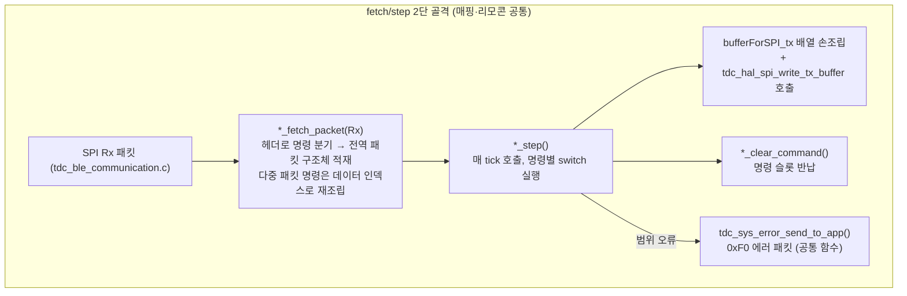
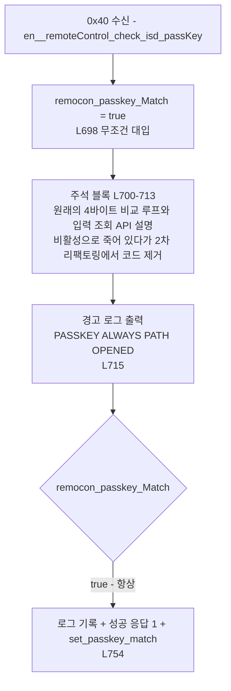

# 05 리모콘·기타 핸들러 해부

**TL;DR**: `tdc_ble_remote.c`(1,389줄)는 매핑 핸들러와 동일한 fetch/step 2단 골격·명령 루프백·`*_clear_command()` 반복 패턴을 쓰며, 데이터 인덱스 분기(0x4C·0x4D)도 매핑(0x6C·0x6D·0x66)과 동일한 다중 패킷 재조립 패턴이다. 패스키 인증은 `remocon_passkey_Match = true` 무조건 대입(L698)으로 영구 비활성. `tdc_ble_general_debug.c`는 이미 "패킷 포인터 주입 + `tx_index` 반환" 템플릿으로 분리돼 있고 `tdc_ble_gain_control.c`가 그 템플릿을 그대로 재사용했다. 0xA0 대역(믹싱 게인) 명령은 CM3 코드에 **미실재**.

## 0. 범위와 방법

대상 4개 `.c`/대응 `.h`를 전량 Read로 정독했고, 구조 대조를 위해 `tdc_ble_mapping.c`(2,196줄)·`tdc_ble_mapping.h`·`tdc_ble_protocol.h`·`tdc_ble_communication.c`·`tdc_sys_error.c`를 함께 확인했다. 0x8C 게인 경로는 CM3 공유메모리(`tdc_shm.h`)에서 CFX 쪽(`1__cfx/environment/shared_memory.h`, `1__cfx/systemControl/main.c`, `audioMixer.c`)까지 실측 추적했다. 읽기 전용으로 수행했으며 `src/` 아래 어떤 파일도 수정하지 않았다.

> [!NOTE]
> 위임 프롬프트의 파일 줄 수(1,139 / 180 / 122 / 126)는 현재 실측(1,389 / 272 / 150 / 156)과 다르다. 아래 표는 전부 실측 기준이다. `wc -l` 실행 결과: `tdc_ble_remote.c` 1389, `tdc_ble_remote.h` 50, `tdc_ble_remote_sp_para.c` 272, `tdc_ble_remote_sp_para.h` 12, `tdc_ble_gain_control.c` 150, `tdc_ble_gain_control.h` 54, `tdc_ble_general_debug.c` 156, `tdc_ble_general_debug.h` 24 (모두 `src/2__cm3/source/ble/` 하위).

## 1. 핵심 발견 요약

| 번호 | 발견 |
|---|---|
| 발견_1 | `tdc_ble_remote.c`는 매핑 핸들러와 동일한 fetch/step 2단 골격·`bufferForSPI_tx[]` 응답 조립·`*_clear_command()` 명령 종료 패턴을 반복한다(§4). |
| 발견_2 | 데이터 인덱스([1]번 인덱스, 헤더 다음 바이트) 분기는 매핑만의 문제가 아니라 **다중 패킷 재조립이 필요한 명령 전반의 BLE 프로토콜 패턴**이다. 리모콘 0x4C·0x4D가 매핑 0x66·0x6C·0x6D와 동일한 구조를 쓴다(§3). |
| 발견_3 | 에러 응답(0xF0)은 `tdc_sys_error_send_to_app()`(`tdc_sys_error.c:147-173`) 하나로 이미 완전히 공통화돼 있다. 반면 **정상 응답 조립은 명령마다 손으로 반복**된다(§5). |
| 발견_4 | 리모콘 0x57 핸들러(`tdc_ble_remote.c:1157-1164`)는 매핑 0x71 핸들러(`tdc_ble_mapping.c:2062-2069`)의 `if (... > 0x60) { mapping_clear } else { remote_clear }` 블록을 그대로 복사했는데, 리모콘 쪽 상수(0x57)는 항상 0x60보다 작아 `if`분기가 영구 도달 불가능한 죽은 코드다(§4.3, 중복 사례_1). |
| 발견_5 | 패스키 인증은 `#if 0`가 아니라 **평범한 대입문**(`remocon_passkey_Match = true;`, `tdc_ble_remote.c:698`)으로 비활성화돼 있다. 원래 비교 루프와 그 입력이던 조회 API(`tdc_shm_read_remocon_passkey_connected_isd`)는 살아있지만 호출부가 없는 고아 함수다(§6). |
| 발견_6 | `tdc_ble_remote_step()`의 반환 구조체 `ST__REMOTECONTROL_STATE`는 필드가 한 번도 채워지지 않고 항상 초기값(`en__isdStatus_NA, false, false`)으로 반환된다. 매핑의 대응 구조체 `ST__MAPPING_STATE`는 함수 끝에서 실제로 채워진다(`tdc_ble_mapping.c:2165-2168`). 다만 `tdc_ble_communication.c:432` 주석이 "현재는 리모콘 제어값을 적용하는 곳이 없다"고 이미 문서화하고 있어 의도된 상태로 보인다(§4.2). |
| 발견_7 | 0xA0~0xAF(믹싱 게인) 대역은 `tdc_ble_protocol.h`·`ble/` 전체·`main.c`(CM3) 어디에도 프로토콜 상수로 **존재하지 않는다**. 0x8C(`EN__SND_BT_CMD_GAIN_CONTROL`)가 게인 테이블 인덱스를 다루지만 0x80대 단일 명령이며 0xA0 그룹과 무관하다(§8.3). |
| 발견_8 | `tdc_ble_general_debug.c`는 "패킷을 인자로 주입받고, 처리 후 `tx_index`를 반환"하는 순수함수형 템플릿을 쓰며, `tdc_ble_gain_control.c`가 동일 템플릿을 그대로 복제했다(주석에서도 명시). 재구조화 시 다른 명령 분리의 1차 후보 템플릿이다(§9). |

## 2. 함수 인벤토리

| 파일 | 함수명 | static | 라인 범위 | 줄 수 | 역할 | 호출처 |
|---|---|---|---|---|---|---|
| tdc_ble_remote.c | `tdc_ble_remote_set_passkey_match` | 아니오 | 28-31 | 4 | `isd_PassKeyMatchResult` 전역을 true로 | `tdc_ble_remote.c:754` (0x40 성공 응답 직후) |
| tdc_ble_remote.c | `tdc_ble_remote_clear_passkey_match` | 아니오 | 33-36 | 4 | `isd_PassKeyMatchResult` 전역을 false로 | `tdc_ble_remote.c:672`(1500틱 미연결 타임아웃), `tdc_ble_communication.c:454`(BLE 연결해제 플래그 0x32) |
| tdc_ble_remote.c | `tdc_ble_remote_is_passkey_match` | 아니오 | 38-41 | 4 | 전역 조회 | `tdc_ble_remote.c:769` (step 전체 스위치 게이트) |
| tdc_ble_remote.c | `tdc_ble_remote_clear_command` | 아니오 | 43-46 | 4 | `remoteDataPacket.command = IDLE` | remote.c 내부 약 40곳, `tdc_isd_map_data.c` 11곳(예: 104, 321, 396), `tdc_ble_remote_sp_para.c:267`, `tdc_ble_mapping.c:2068`, `tdc_ble_communication.c:455` |
| tdc_ble_remote.c | `tdc_ble_remote_fetch_packet` | 아니오 | 50-619 | 570 | SPI Rx 파싱 → `remoteDataPacket` 적재(명령별 분기) | `tdc_ble_communication.c:300`(리모콘 0x40~0x59), `:337`(0x8C), `:341`(0x8F) |
| tdc_ble_remote.c | `tdc_ble_remote_step` | 아니오 | 638-1389 | 752 | 매 tick 명령 실행·응답 송신·연결상태 관리 | `tdc_ble_communication.c:401` |
| tdc_ble_remote_sp_para.c | `tdc_ble_remote_read_sp_para` | 아니오 | 11-272 | 262 | 0x52 자극 신호 읽기, `flowCounter`(0~7) 상태머신으로 8개 응답 패킷 분할 전송 | `tdc_ble_remote.c:1074` (case `en__remoteControl_readSoundSignal`) |
| tdc_ble_gain_control.c | `tdc_ble_gain_control_init` | 아니오 | 27-32 | 6 | 공유메모리 게인 인덱스 기본값(128/128) 초기화 | `tdc_sys_init.c:236` |
| tdc_ble_gain_control.c | `tdc_ble_gain_control_handle` | 아니오 | 34-74 | 41 | 0x8C 요청 처리(검증→읽기/쓰기→응답 조립), `tx_index` 반환 | `tdc_ble_remote.c:1202` (case `EN__SND_BT_CMD_GAIN_CONTROL`) |
| tdc_ble_gain_control.c | `gc_is_valid_request` | 예 | 76-101 | 26 | control_type/gain_type/gain_index 범위 검증 | `tdc_ble_gain_control_handle` 내부만 |
| tdc_ble_gain_control.c | `gc_read_index` | 예 | 103-111 | 9 | 현재 적용 인덱스 읽기(A/B) | 위와 동일 |
| tdc_ble_gain_control.c | `gc_write_index` | 예 | 113-123 | 11 | 공유메모리에 인덱스 기록(A/B) | 위와 동일 |
| tdc_ble_gain_control.c | `gc_save_to_file` | 예 | 126-150 | 25 | 연결된 ISD 슬롯 파일에 게인 설정 영속화 | 위와 동일 |
| tdc_ble_general_debug.c | `tdc_ble_general_debug_handle` | 아니오 | 35-60 | 26 | 0x8F option(1/2/3) 분기 진입점, `tx_index` 반환 | `tdc_ble_remote.c:1188` (case `EN__SND_BT_CMD_GENERAL_DEBUG`) |
| tdc_ble_general_debug.c | `gd_handle_touch_debug` | 예 | 62-100 | 39 | option 1: 터치센서 LTA/count/delta 등 조회 | `tdc_ble_general_debug_handle` 내부만 |
| tdc_ble_general_debug.c | `gd_handle_no_backtel` | 예 | 102-125 | 24 | option 2: OTA DFU 연결상태 강제 설정 | 위와 동일 |
| tdc_ble_general_debug.c | `gd_handle_map_init` | 예 | 127-156 | 30 | option 3: 지정 RL로 4슬롯 맵 데이터 강제 초기화 | 위와 동일 |

전역 상태(함수는 아니지만 구조 이해에 필요): `remoteDataPacket`(`tdc_ble_remote.c:24`, `ST__REMOTECONTROL_PACKET` 전역), `isd_PassKeyMatchResult`(`:26`), `writingStartSlot_index`(`:48`, static). `tdc_ble_gain_control.c`·`tdc_ble_general_debug.c`는 전역 패킷 대신 **인자로 주입받은 `const ST__REMOTECONTROL_PACKET *packet`**을 쓴다(§9).

## 3. `tdc_ble_remote.c` 명령별 해부

### 3.1 fetch 단계(`tdc_ble_remote_fetch_packet`, L50-619) — 명령별 규모

| 명령(헤더) | 라인 범위 | 줄 수 | 파싱 내용 |
|---|---|---|---|
| 0x4A `read_SlotData_ISD_N_USER` | 81-99 | 19 | 슬롯번호 1~4 범위검사 후 `remoteDataPacket.remocon_ReadWriteMapData_Flash` 적재 |
| 0x4C `write_SlotData_ISD_N_USER` | 101-338 | **238** | 데이터 인덱스 1~3 다중 패킷 재조립(내부기ID·사용자명·설정값), 인덱스별 중첩 switch(L126-307) |
| 0x4B `read_Mapdata_STIMUL_PARA` | 340-370 | 31 | 슬롯번호+맵번호 2단 범위검사 |
| 0x4D `write_Mapdata_STIMUL_PARA` | 372-573 | **202** | 데이터 인덱스 1~15 다중 패킷 재조립(자극 파라미터), 인덱스별 중첩 switch(L396-525) |
| 0x4E `erase_SlotData` | 574-581 | 8 | 슬롯번호만 적재, 검증 없음 |
| 0x4F `erase_mapData_STIMUL_PARA` | 583-590 | 8 | 슬롯+맵번호 적재, 검증 없음 |
| 0x50 `erase_mppingData_exceptSlot_1` | 592-600 | 9 | `writingStartSlot_index=2` 설정 후 적재 |
| 0x57 `recover_ALL_SlotData_ManufactureData` | 602-607 | 6 | `writingStartSlot_index=1` 설정만 |
| 그 외 전부(0x40·0x41-0x49·0x51-0x56·0x58·0x59·0x8C·0x8F 등) | 609-617(default) | 9 | `todoc_PayloadSize`(19바이트) 그대로 `remoteDataPacket.data[]`에 복사 |

0x4C·0x4D 두 명령이 fetch 570줄 중 440줄(77%)을 차지한다 — 매핑의 0x66/0x6C/0x6D와 동일하게 "다중 패킷 재조립"이 코드량을 지배한다.

### 3.2 step 단계(`tdc_ble_remote_step`, L638-1389) — 명령별 규모

| 명령(헤더) | 라인 범위 | 줄 수 | 실행 내용 |
|---|---|---|---|
| 0x40 `check_isd_passKey` | 696-766(스위치 밖) | 71 | 패스키 인증(영구 비활성, §6) |
| 0x41 `readInfoOfExtenalDevice` | 782-786 | 5 | 빈 case. nRF 자체 응답이라 실제 도달 안 함(주석) |
| 0x42 `readInfoOfMap` | 788-818 | 31 | 맵 스탬프+보유 맵 개수 응답 |
| 0x43 `readStatusOfExtenalDevice` | 822-847 | 26 | 배터리·맵번호·볼륨 등 8필드 응답 |
| 0x44 `changeMapNum` | 849-931 | 83 | 사용가능 맵 회전 탐색(증가/감소) |
| 0x45 `adjustStimulationVolume` | 933-969 | 37 | 자극 볼륨 증감 |
| 0x46 `adjustMicVolume` | 971-1007 | 37 | 마이크 볼륨 증감 |
| 0x47 `OnOffTelecoil` | 1009-1028 | 20 | 텔레코일 On/Off |
| 0x48 `OnOffStimulationIndicator` | 1030-1049 | 20 | 자극 알림 On/Off |
| 0x49 `OnOffLED` | 1051-1070 | 20 | LED On/Off |
| 0x52 `readSoundSignal` | 1072-1076 | 5 | `tdc_ble_remote_read_sp_para()` 위임 |
| 0x54 `read_Ezairo_FirmwareInfo` | 1078-1097 | 20 | 펌웨어 정보 14바이트 응답 |
| 0x4A `read_SlotData_ISD_N_USER` | 1099-1103 | 5 | `tdc_isd_map_read_info_setting()` 위임 |
| 0x4C `write_SlotData_ISD_N_USER` | 1105-1109 | 5 | `tdc_isd_map_write_info_setting()` 위임 |
| 0x4B `read_Mapdata_STIMUL_PARA` | 1111-1115 | 5 | `tdc_isd_map_read_stim_para()` 위임 |
| 0x4D `write_Mapdata_STIMUL_PARA` | 1117-1121 | 5 | `tdc_isd_map_write_stim_para()` 위임 |
| 0x4E `erase_SlotData` | 1123-1127 | 5 | `tdc_isd_map_reset_nvm_selected()` 위임 |
| 0x4F `erase_mapData_STIMUL_PARA` | 1129-1133 | 5 | `tdc_isd_map_reset_nvm_map_data()` 위임 |
| 0x50 `erase_mppingData_exceptSlot_1` | 1135-1139 | 5 | `tdc_isd_map_reset_nvm_2to4()` 위임 |
| 0x57 `recover_ALL_SlotData_ManufactureData` | 1141-1172 | 32 | `tdc_isd_map_reset_nvm_all()` 위임 + 죽은 분기(§4.3) |
| 0x8F `EN__SND_BT_CMD_GENERAL_DEBUG` | 1186-1193 | 8 | `tdc_ble_general_debug_handle()` 위임 |
| 0x8C `EN__SND_BT_CMD_GAIN_CONTROL` | 1200-1207 | 8 | `tdc_ble_gain_control_handle()` 위임 |
| 0x59 `specificSystemOperationSetting` | 1215-1363 | **149** | 옵션/세부옵션 3단 중첩 switch(묵음 처리 읽기/쓰기), 위임 없이 직접 처리 |
| IDLE | 1366-1369 | 4 | no-op |

**미도달 명령(스위치에 case 자체가 없음)**: 0x51 `read_OwnerNameOfExternalDevice`, 0x53 `read_NRF_FirmwareInfo`, 0x55 `write_SerialNumOfExternalDevice`, 0x56 `write_ParingKey`, 0x58 `readSystemErrorCode`. 이 중 0x55·0x56은 `tdc_ble_protocol.h:72-73` 주석에 "nRF 자체 처리"로 명시돼 있어 의도적이다. 0x58은 `tdc_ble_protocol.h:75` 주석이 스스로 "이거 보내면 묵묵부답으로 시간 초과 타임아웃 발생함"이라고 기록하고 있는데, 이는 정확히 `tdc_ble_remote_step()`의 switch에 0x58 case가 없어 응답이 전혀 나가지 않는 현상과 일치한다(코드와 주석이 서로를 확증). 0x51·0x53은 근거를 찾지 못해 **미확인**(nRF 자체 처리인지 단순 미구현인지 불명).

가장 무거운 명령은 fetch 기준 0x4C(238줄)·0x4D(202줄), step 기준 0x59(149줄)·0x44(83줄)다. 위임형 명령(0x4A/0x4B/0x4C/0x4D/0x4E/0x4F/0x50/0x57/0x8C/0x8F)은 step에서 5~32줄에 불과해 실질 로직이 다른 파일(`tdc_isd_map_data.c`, `tdc_ble_gain_control.c`, `tdc_ble_general_debug.c`)로 이미 옮겨져 있다.

## 4. 매핑 vs 리모콘 구조 대조

### 4.1 공통 골격

### 4.2 구조 대조표

| 항목 | `tdc_ble_remote.c` | `tdc_ble_mapping.c` | 비고 |
|---|---|---|---|
| fetch/step 분리 | 있음(`tdc_ble_remote_fetch_packet`/`tdc_ble_remote_step`) | 있음(`tdc_ble_mapping_fetch_packet`/`tdc_ble_mapping_step`) | 동일 골격 |
| 패킷 상태 구조체 | `ST__REMOTECONTROL_PACKET`(`tdc_ble_remote.h:24-31`), 필드 `command` 1개 | `ST__MAPPING_PACKET`(`tdc_ble_mapping.h:109-121`), 필드 `fetched_command`+`command` 2개 | 리모콘은 `fetched_command` 필드가 주석 처리(`tdc_ble_remote.h:26`)돼 있고, 코드 주석(`tdc_ble_remote.c:662-666`)이 "2차 리팩토링에서 제거"했다고 명시 |
| 명령 승격(2단계 스테이징) | 없음. fetch에서 바로 `remoteDataPacket.command` 대입 | 있음. `mappingPacket.fetched_command`를 `tdc_isd_is_connection_check_with_mapping()`이 끝난 뒤 `command`로 승격(`tdc_ble_mapping.c:1799-1817`) | 구조적 차이 실물. 매핑은 백텔 통신 중 명령 유예가 필요해서 유지, 리모콘은 제거됨 |
| 응답 조립 | 명령마다 `bufferForSPI_tx[]`를 손으로 채움(예: `tdc_ble_remote.c:835-844`) | 동일 패턴(예: `tdc_ble_mapping.c:1838-1840`) | 완전 동일 패턴 반복 |
| 에러 응답(0xF0) | `tdc_sys_error_send_to_app()` 호출(파일 내 24회) | 동일 함수 호출(파일 내 32회) | **이미 공통화됨**(`tdc_sys_error.c:147-173`) |
| 명령 종료 | `tdc_ble_remote_clear_command()` (약 40회 자체 호출 + 외부 12곳) | `tdc_ble_mapping_clear_command()` (다수 자체 호출) | 각 파일이 자기 전역을 리셋하는 대칭 함수 쌍 |
| 반환 상태 구조체 활용 | `ST__REMOTECONTROL_STATE` 필드 3개(`isdControlCommand`, `BLE_Off`, `remoconConnection`) — **함수 안에서 단 한 번도 대입되지 않음**(grep 결과 0건) | `ST__MAPPING_STATE` 필드 4개 — 함수 끝에서 전부 대입(`tdc_ble_mapping.c:2165-2168`) | 발견_6. `tdc_ble_communication.c:432` 주석이 "리모콘 제어값 적용하는 곳 없음"이라 문서화된 의도적 상태로 보임(미확인: 설계 의도인지 방치인지) |
| 플래시 읽기/쓰기 위임 | `tdc_isd_map_*` 8개 함수(`startFlag, command, slot_index[, map_index]`) 호출 | 동일 8개 함수를 자기 커맨드 값으로 호출 | **이미 공통 모듈**(`tdc_isd_map_data.c`)로 추출돼 있음 — 재구조화 필요 없는 영역 |
| 다중 패킷 재조립(데이터 인덱스) | 0x4C·0x4D에서 `subCommandData_Num_index`로 구현 | 0x66/0x6C/0x6D에서 동일 변수명·동일 로직으로 구현 | §3 참조, 완전 동일 패턴 |

### 4.3 중복 코드 사례 (라인 근거)

1. **죽은 조건부 명령-클리어 분기 복사** — `tdc_ble_remote.c:1157-1164`가 `tdc_ble_mapping.c:2062-2069`를 거의 그대로 복사했다.
   - 매핑 쪽(원본으로 추정): `if (en__mapping_recover_ALL_SlotData_ManufactureData > 0x60) { tdc_ble_mapping_clear_command(); } else { tdc_ble_remote_clear_command(); }` — `en__mapping_recover_ALL_SlotData_ManufactureData`는 0x71이라 조건이 **항상 참**.
   - 리모콘 쪽: `if (en__remoteControl_recover_ALL_SlotData_ManufactureData > 0x60) { tdc_ble_mapping_clear_command(); } else { tdc_ble_remote_clear_command(); }` — `en__remoteControl_recover_ALL_SlotData_ManufactureData`는 0x57이라 조건이 **항상 거짓**. 결과적으로 `tdc_ble_mapping_clear_command()` 호출부(L1159)는 리모콘 파일 안에서 영구 도달 불가능한 코드다. 동작 자체는 우연히 맞다(항상 else인 `tdc_ble_remote_clear_command()`가 정답이므로) — 하지만 **컴파일 시각적으로도, 코드 리뷰로도 즉시 드러나지 않는 복붙 잔재**라 재구조화 시 반드시 정리 대상이다.
2. **명령 루프백 + 페이로드 준비 + SPI 전송 + 명령 클리어 4단 시퀀스 반복** — 리모콘 쪽 0x43(`tdc_ble_remote.c:835-845`), 0x45(`:956-961`), 0x46(`:994-999`), 0x47(`:1015-1020`) 이 전부 "`bufferForSPI_tx[tx_index++] = command`" → 필드별 대입 → `tdc_hal_spi_write_tx_buffer()` → `tdc_ble_remote_clear_command()"의 동일 4단 시퀀스를 명령마다 손으로 새로 쓴다. 매핑 쪽 0x60(`tdc_ble_mapping.c:1838-1840`), 0x61(`:1852-1854`)도 동일 시퀀스다. 4개 파일(매핑·리모콘·게인제어·범용디버그) 전부에서 반복되는, 재구조화의 1순위 공통화 후보.
3. **다중 패킷 데이터 인덱스 순서 검증 로직 중복** — 리모콘 0x4C(`tdc_ble_remote.c:107-121`)의 `if (subCommandData_Num_index == 1) { prev_subCommandData_Num_index = 0; } if (subCommandData_Num_index != prev_subCommandData_Num_index + 1) { 에러 }` 블록이 0x4D(`:378-392`)에 그대로 반복되고, 매핑 0x66 하위명령1(`tdc_ble_mapping.c:347-357`), 0x68(`:973-985`), 0x6C(`:1169-1181`)에도 변수명까지 동일하게 반복된다. 총 5곳 이상에서 완전히 동일한 순서검증 패턴.
4. **에러 시 `dataRangeError` 플래그 후 일괄 처리** — 리모콘 0x4C(`tdc_ble_remote.c:309-335`)와 0x4D(`:527-570`)가 "각 필드 검사 중 `dataRangeError=true` 설정 → 루프 끝난 뒤 한 번에 `if (!dataRangeError) {정상} else {tdc_sys_error_send_to_app + clear_command}`" 패턴을 쓰는데, 매핑 0x62(`tdc_ble_mapping.c:139-170`, 다만 이쪽은 `break`로 즉시 탈출하는 변형)와 0x65(`:235-306`)도 동일 아이디어를 각자 손으로 구현한다.
5. **`tx_index`를 반환하는 하위 위임 함수 서명 반복** — `tdc_ble_gain_control_handle(const ST__REMOTECONTROL_PACKET *packet, int *tx_buf, int tx_index)`(`tdc_ble_gain_control.h:52`)와 `tdc_ble_general_debug_handle(const ST__REMOTECONTROL_PACKET *packet, int *tx_buf, int tx_index)`(`tdc_ble_general_debug.h:21-22`)는 이름 규칙과 시그니처가 완전히 동일하다. 이는 부정적 중복이 아니라 §9에서 다루는 **의도적으로 재사용된 템플릿**이며, 나머지 명령들(0x42~0x49, 0x59 등)은 아직 이 템플릿을 쓰지 않고 `tdc_ble_remote_step()` 안에 인라인돼 있다는 점이 재구조화 여지다.

## 5. 응답 패킷 조립 패턴

| 구분 | 정상 응답 | 에러 응답(0xF0) |
|---|---|---|
| 공통화 여부 | **없음.** 명령마다 `int bufferForSPI_tx[BLE_DataPacketSize]; int tx_index=0;` 선언 → 필드별 수동 대입 → `tdc_hal_spi_write_tx_buffer(buf, tx_index)` 호출을 반복 | **있음.** `tdc_sys_error_send_to_app(command, majorError, minorError, lineNumber)` 한 함수가 `[0]=0xF0, [1]=command, [2]=majorError, [3]=minorError, [4..5]=lineNumber(빅엔디안 16bit)` 6바이트 고정 포맷을 조립(`tdc_sys_error.c:147-173`) |
| 리모콘에서의 사용 | 예: 0x8C 응답 5워드(`tdc_ble_gain_control.c:67-71`), 0x8F 응답은 옵션별로 가변(`tdc_ble_general_debug.c:73-99` 등) | `tdc_ble_remote.c` 안에서 24회 호출, 전부 동일 시그니처 |
| 매핑에서의 사용 | 명령마다 개별(§4.3 사례_2) | `tdc_ble_mapping.c` 안에서 32회 호출, 리모콘과 완전히 같은 함수 |
| 현상 정리 | 정상 응답은 파일 4개(리모콘·매핑·게인제어·범용디버그)가 각자 "command loop-back + 필드 나열 + write_tx_buffer" 삼단 관용구를 손으로 반복한다. 공통화 여지가 뚜렷하다(예: `command`+가변 payload 배열을 받아 `tx_index`까지 채워 반환하는 헬퍼 하나로 축약 가능) | 이미 단일 함수로 수렴돼 있어 추가 공통화가 필요 없는 영역 |

## 6. 패스키 인증 경로

`tdc_ble_remote_clear_passkey_match()`는 두 지점에서 호출된다: ① `tdc_ble_remote_step()` 안에서 `isdConnection`이 false로 1500틱(`disconnectionCounter>=1500`) 연속되면(`tdc_ble_remote.c:667-675`), ② BLE 연결 해제 플래그(0x32) 수신 직후(`tdc_ble_communication.c:450-455`).

`en__remoteControl_check_isd_passKey`(0x40) 처리는 `tdc_ble_remote_step()`의 명령 switch **밖**, 함수 앞부분에서 별도 `if`로 처리된다(`tdc_ble_remote.c:696-766`):

- **비활성화 방식**: `#if 0`가 아니라 `bool remocon_passkey_Match = true;`(L698) 단순 대입이다. 이후 어떤 조건도 이 값을 false로 바꾸지 않으므로 `else` 분기(L756-759, 실패 시 `bufferForSPI_tx[tx_index++]=2`)는 도달 불가능한 죽은 코드다.
- **원래 로직(주석으로만 남음, L700-713)**: `connectedISD_num = tdc_shm_read_connected_isd_num()` 후 `tdc_shm_read_remocon_passkey_connected_isd(connectedISD_num)`로 4바이트 패스키를 읽어와 `remoteDataPacket.data[0..3]`과 비교, 하나라도 다르면 `remocon_passkey_Match = false`로 만드는 루프가 있었다. 그 루프가 `#if 0`로 죽어 있다가 2차 리팩토링에서 **코드 자체가 삭제**됐다(주석에 명시).
- **API 생존 확인**: `tdc_shm_read_remocon_passkey_connected_isd()`는 `tdc_shm.h:302`/`tdc_shm.c:241`에 여전히 정의돼 있으나, 코드베이스 전체에서 호출부는 없다(grep 결과 정의·선언 외 참조는 `tdc_ble_remote.c:704,709,710`의 **주석 텍스트뿐**). `tdc_shm_read_connected_isd_num()`은 다른 곳(`tdc_ble_communication.c:69`, `tdc_ble_gain_control.c:129`)에서 실사용 중이라 고아가 아니다.
- **활성화하려면(코드는 고치지 않음, 서술만)**: (1) `connectedISD_num`을 다시 조회하고, (2) `tdc_shm_read_remocon_passkey_connected_isd(connectedISD_num)`으로 4바이트 포인터를 얻고, (3) L698의 무조건 `true` 대입을 없애고 4바이트 비교 루프로 대체(하나라도 다르면 false), (4) L715의 `TDC_PRINTF_W("[PASSKEY] ALWAYS PATH OPENED...")` 경고 로그를 제거하면 된다. 공유메모리 조회 API는 그대로 쓸 수 있다.
- **연쇄 효과**: `tdc_ble_remote_is_passkey_match()`(L769)가 리모콘 명령 switch 전체를 게이팅하므로, 패스키 인증이 비활성인 현재는 **연결된 리모콘이면 무엇이든 즉시 모든 명령을 실행**할 수 있는 상태다(비인증 상태에서 명령을 보내면 `en__NO_SECURITY` 에러만 나감, L1373-1385).

## 7. `tdc_ble_remote_sp_para.c`

- **역할**: 파일명의 `sp_para`는 자극(stimulation) 파라미터로 추정되며, 실제 내용은 0x52 `readSoundSignal` 응답을 위한 **자극 DAC 설정값·32채널 자극 레벨·uA 환산값**을 8단계(`flowCounter` 0~7)로 나눠 순차 전송하는 상태머신 하나(`tdc_ble_remote_read_sp_para`, L11-272)로 구성된다(**미확인**: "sp_para"가 정식 약어인지 파일명 관례인지 근거 없음, 추측임을 명시).
- `remoteCommandStartFlag`(=`tdc_ble_remote_step()`에서 계산된 "명령이 방금 바뀌었는가" 플래그)를 `startFlag` 인자로 받아 상태머신을 리셋한다(L28-36).
- 각 단계가 `bufferForSPI_tx[]`를 직접 채우고 `tdc_hal_spi_write_tx_buffer()`를 직접 호출한다(L258-262) — 이는 §9의 "패킷 인자 주입 + `tx_index` 반환" 템플릿과 **다른 방식**이다. 이 파일은 전역 `remoteDataPacket`을 직접 참조하지 않지만 SPI 전송을 자체 완결하고, 완료 시점(`flowCounter==7`, L264-269)에 `tdc_ble_remote_clear_command()`를 직접 호출해 `tdc_ble_remote.c`의 전역 상태에 개입한다. 즉 `tdc_ble_gain_control.c`/`tdc_ble_general_debug.c`보다 결합도가 높다.
- `tdc_ble_remote.c`와의 관계: `tdc_ble_remote_step()`의 case `en__remoteControl_readSoundSignal`(L1072-1076)에서 `remoteCommandStartFlag`와 명령 코드만 넘겨 호출하는 얇은 위임 지점. `tdc_isd_map_*` 8개 함수와 동일한 "`startFlag, command[, ...]`" 계열 시그니처를 쓴다.

## 8. `tdc_ble_gain_control.c` (0x8C)

### 8.1 요청 처리 흐름

`tdc_ble_gain_control_handle()`(L34-74): `packet->data[0]`=control_type(0=Read/1=Write), `data[1]`=gain_type(1=Gain_A/2=Gain_B), `data[2]`=gain_index(0~255, `tdc_ble_gain_control.h:12-19`). `gc_is_valid_request()`(L76-101)로 범위 검증 → Write면 `gc_write_index()`(L113-123)로 공유메모리 갱신 후 `gc_save_to_file()`(L126-150)로 파일 영속화 → Read/Write 공통으로 `gc_read_index()`(L103-111)가 반환한 **현재 적용값**을 응답에 싣는다(L61, "쓰기 실패해도 공유메모리는 롤백하지 않는다"는 설계 의도가 주석 L51-53에 명시).

### 8.2 공유메모리 → CFX 전달 경로 (실측 추적)

```mermaid
flowchart LR
    App["앱"] -->|BLE| QCC["QCC"]
    QCC -->|SPI, 헤더 0x8C| Comm["tdc_ble_communication.c:335-338"]
    Comm --> Fetch["tdc_ble_remote_fetch_packet()<br/>(default case, 페이로드 그대로 적재)"]
    Fetch --> Step["tdc_ble_remote_step()<br/>case EN__SND_BT_CMD_GAIN_CONTROL, L1200-1207"]
    Step --> Handle["tdc_ble_gain_control_handle()"]
    Handle --> ShmCm3["cfx_cm3_sharedMemoryAll.gain_table_index_a / _b<br/>(tdc_shm.h:260-261)"]
    ShmCm3 -. 공유메모리 동일 오프셋 .-> ShmCfx["Addr_SharedMem 의 gain_table_index_a / _b<br/>1__cfx/environment/shared_memory.h:224-225"]
    ShmCfx --> Lookup["tdc_audio_gain_lookup_q8_16()<br/>(1__cfx/systemControl/audioMixer.c:282-290)<br/>호출부: main.c:451,455"]
    Lookup --> Mixer["U14 게인 적용 믹서<br/>Gain_A(마이크) / Gain_B(I2S 크래들 마이크)<br/>(audioMixer.c:321-325 주석)"]
```

CM3 쪽 구조체(`tdc_shm.h:260-261`)와 CFX 쪽 구조체(`shared_memory.h:224-225`)는 주석으로 "필드 순서가 반드시 일치해야 한다"(`shared_memory.h:222-223`)고 명시된 수동 미러링 관계다 — CFX-CM3 간 공유메모리는 별도 IPC 없이 오프셋 일치로 통신하는 구조로 보인다(**미확인**: 실제 물리 공유메모리 매핑/동기화 메커니즘은 `1__cfx`/`2__cm3` 링크 레이어 밖이라 이번 조사 범위에서 확인하지 못함).

### 8.3 0xA0 대역(믹싱 게인) 실재 여부

`tdc_ble_protocol.h` 전체(L1-123)와 `ble/` 디렉터리 전체, CM3 `main.c`를 대상으로 `0xA0`~`0xAF`를 검색한 결과, **CM3 코드베이스에 0xA0 대역 프로토콜 상수·case·enum이 존재하지 않는다**. `main.c`에서 유일하게 걸린 `0xA0`는 룩업 테이블 주석(`161, 162, ... /* 0xA0 ~ 0xAF */`, 오디오 게인과 무관한 다른 테이블)이었다. 0x8C(`EN__SND_BT_CMD_GAIN_CONTROL`, `tdc_ble_protocol.h:117`)가 게인 테이블 인덱스를 다루는 유일한 명령이며, 이는 0x80대(`EN__SND_BT_CMD_80_RANGE`, L115-119) 소속으로 0xA0 그룹과는 별개 대역이다. 오케스트레이터 사실_7("0xA0~0xAF 믹싱 게인_A0")은 은수님이 제시한 프로토콜 문서상의 대역 구획으로 보이며, **CM3 펌웨어 구현이 아직 이 대역을 처리하지 않는다**는 점이 이번 조사로 확인된 사실이다(문서상 정의와 구현 상태의 괴리 — 제거 제안 아님, 미구현 상태 기록).

## 9. `tdc_ble_general_debug.c` — 분리 패턴 분석 (재구조화 템플릿 후보)

### 9.1 구조

`tdc_ble_general_debug_handle(const ST__REMOTECONTROL_PACKET *packet, int *tx_buf, int tx_index)`(L35-60)는 `packet->data[0]`(option)로 3개 정적 하위 함수(`gd_handle_touch_debug`/`gd_handle_no_backtel`/`gd_handle_map_init`, 전부 `static`, L28-30 전방선언)에 분기하고, 각 하위 함수도 동일 시그니처(`packet, tx_buf, tx_index, option`)를 받아 **자신이 채운 만큼 늘어난 `tx_index`를 반환**한다. 옵션 미해당 시에도 최소 `command` 루프백 1워드는 채운다(L53-57).

### 9.2 인자 주입 방식 · 반환 규약

| 항목 | 방식 |
|---|---|
| 입력 | 전역 `remoteDataPacket`을 직접 참조하지 않고 `const ST__REMOTECONTROL_PACKET *packet` 포인터로 **주입**받는다(헤더 주석에 "전역 의존 없이 독립 수행"이라 명시, `tdc_ble_general_debug.h:7-13`) |
| 출력 버퍼 | 호출부(`tdc_ble_remote_step()`) 지역 배열 `bufferForSPI_tx`를 포인터로 넘겨받아 그 자리에서 채운다. 배열 소유권은 호출부에 남는다 |
| 반환값 | 갱신된 `tx_index`(다음에 쓸 오프셋)만 반환. SPI 전송(`tdc_hal_spi_write_tx_buffer`)과 명령 클리어(`tdc_ble_remote_clear_command`)는 **호출부 책임**으로 남긴다(`tdc_ble_remote.c:1188-1191`) |
| 부작용 | 하위 함수 내부에서 실제 부작용(터치 디버그 조회, DFU 연결상태 강제설정, 맵 데이터 강제 초기화)은 수행하지만, BLE 응답 송신·명령 상태 전이는 하지 않는다 — "계산은 여기서, 전송/상태전이는 호출부에서"로 책임이 갈라져 있다 |

### 9.3 `tdc_ble_gain_control.c`가 이 템플릿을 재사용한 증거

`tdc_ble_gain_control.c` 주석(L9-10) 원문: "수신 패킷은 인자(const 포인터)로 주입받아 전역 의존 없이 독립 수행된다. (0x8F 범용 디버깅 프로토콜 분리 방식과 동일)". 실제로 `tdc_ble_gain_control_handle(const ST__REMOTECONTROL_PACKET *packet, int *tx_buf, int tx_index)` 시그니처가 `tdc_ble_general_debug_handle()`과 완전히 동일한 계약을 따른다. 즉 **템플릿이 이미 한 번 검증된 재사용 사례를 갖고 있다**.

### 9.4 템플릿으로서의 평가

- **장점**: 전역 상태 의존이 없어 단위 테스트가 가능하다(입력 `packet`과 출력 `tx_buf`/`tx_index`만으로 순수 검증 가능). `tdc_ble_remote_step()`의 명령 switch가 "위임 호출 1줄 + SPI 전송 1줄 + 명령클리어 1줄" 3줄로 줄어드는 효과가 0x8C/0x8F 두 case(L1186-1207)에서 이미 확인된다.
- **한계**: 이 템플릿은 **단일 패킷·즉시 응답** 명령에만 맞는다. 0x4C/0x4D처럼 여러 패킷에 걸쳐 상태(`prev_subCommandData_Num_index`, `stimulPara_index`)를 이어가야 하는 명령이나, 0x52처럼 `flowCounter` static 변수로 여러 tick에 걸쳐 응답을 나눠 보내는 `tdc_ble_remote_sp_para.c` 유형에는 그대로 적용하기 어렵다(정적 상태를 어떻게 캡슐화할지 별도 설계 필요).
- **적용 후보**: 0x42~0x49(단일 패킷, 짧은 로직) 그룹과 0x59(단일 패킷이지만 149줄의 중첩 옵션트리)가 1차 후보로 보인다. 0x59는 특히 이미 내부적으로 옵션(L1217)→세부옵션1(L1239)→세부옵션2(L1243) 3단 트리 구조라 `gd_handle_*` 3분기 패턴과 형태적으로 유사하다.

## 10. 질문에 대한 답

- **데이터 인덱스 분기는 매핑만의 문제인가, BLE 전역 패턴인가?** — 전역 패턴이다. 리모콘 0x4C·0x4D가 매핑 0x66·0x68·0x6C·0x6D와 동일한 `subCommandData_Num_index`(헤더 다음 바이트) 순서검증·재조립 로직을 쓴다(§3, §4.3 사례_3). 반대로 0x44~0x49·0x59·0x8C·0x8F 같은 단일 패킷 명령은 데이터 인덱스 분기가 **없다** — "명령이 여러 20바이트 패킷에 걸쳐 큰 데이터(맵/자극 파라미터/사용자 정보)를 실어야 하는가"가 분기 여부를 가르는 기준이지, 매핑이냐 리모콘이냐가 기준이 아니다.
- **4개 파일에서 공통 골격으로 뽑을 수 있는 반복 패턴은 무엇인가?** — (1) "command loop-back + 필드 나열 + `tdc_hal_spi_write_tx_buffer`" 응답 조립 3단 관용구(§4.3 사례_2, §5), (2) 에러는 이미 `tdc_sys_error_send_to_app()`로 공통화됨(§5), (3) 다중 패킷 순서검증(§4.3 사례_3), (4) `tdc_ble_general_debug.c`/`tdc_ble_gain_control.c`가 이미 증명한 "패킷 포인터 주입 + `tx_index` 반환" 위임 템플릿(§9) — 이 넷 중 (1)이 미공통화 상태로 가장 크게 남아있다.
- **0xA0 대역(믹싱 게인)은 CM3 코드에 실재하는가?** — 실재하지 않는다(§8.3). 0x8C만 게인 테이블 인덱스를 다루며 0xA0 그룹과 헤더 값 자체가 다르다.

## 11. 미확인 목록

| 항목 | 내용 |
|---|---|
| 미확인_1 | `tdc_ble_remote_sp_para.c`의 "sp_para"가 정식 약어("stimulation parameter")인지 파일명 관례인지 근거 문서를 찾지 못했다(§7, 추정치로 기술) |
| 미확인_2 | 0x51(`read_OwnerNameOfExternalDevice`)·0x53(`read_NRF_FirmwareInfo`)이 step switch에 case가 없는 이유가 "nRF 자체 처리"인지 단순 미구현인지 확정 근거 없음(§3.2) |
| 미확인_3 | CFX-CM3 공유메모리(`Addr_SharedMem`)의 물리적 동기화/오프셋 매핑 메커니즘은 이번 조사 범위(`ble/` 4파일) 밖이라 상세 확인하지 못함(§8.2) |
| 미확인_4 | `ST__REMOTECONTROL_STATE` 필드 미사용(발견_6)이 설계 의도인지 리팩토링 중 누락인지는 `tdc_ble_communication.c:432` 주석 정황상 의도로 보이나 작성자 확인은 못함 |
