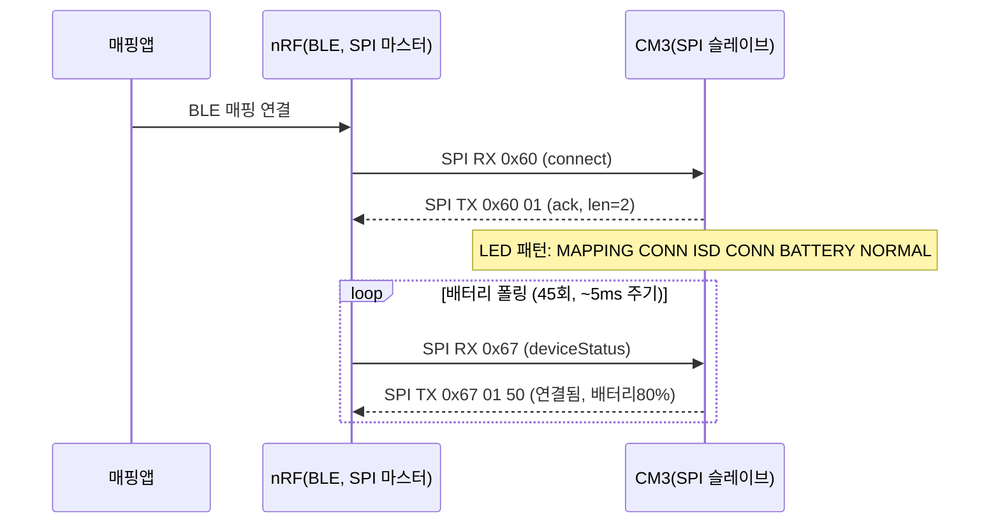
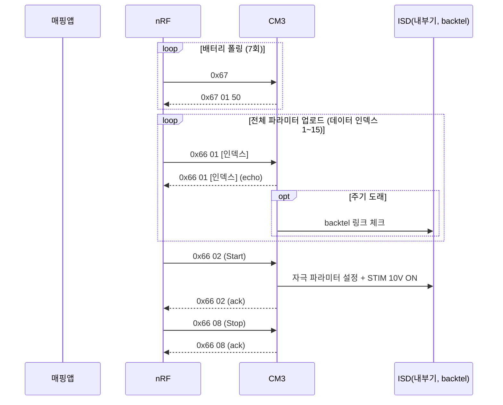
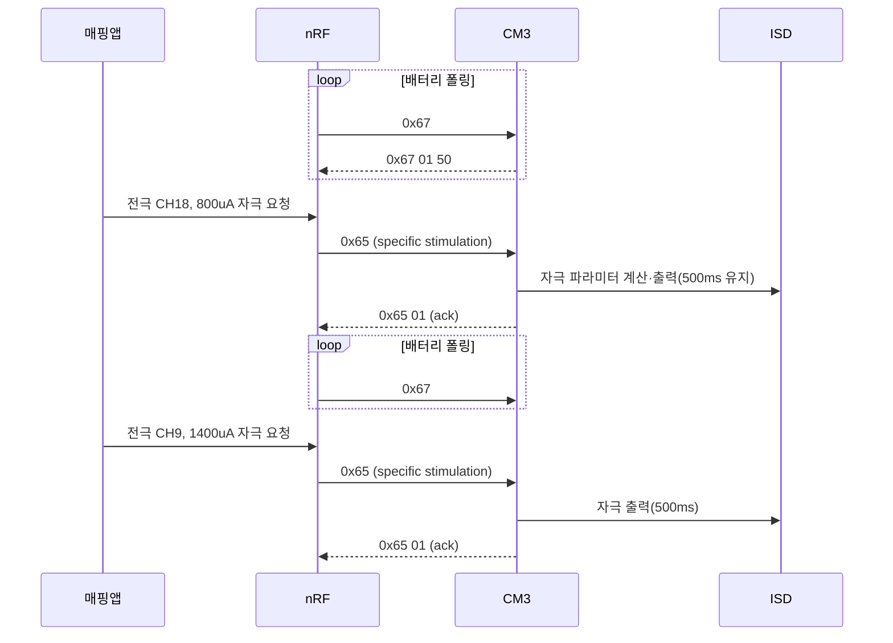
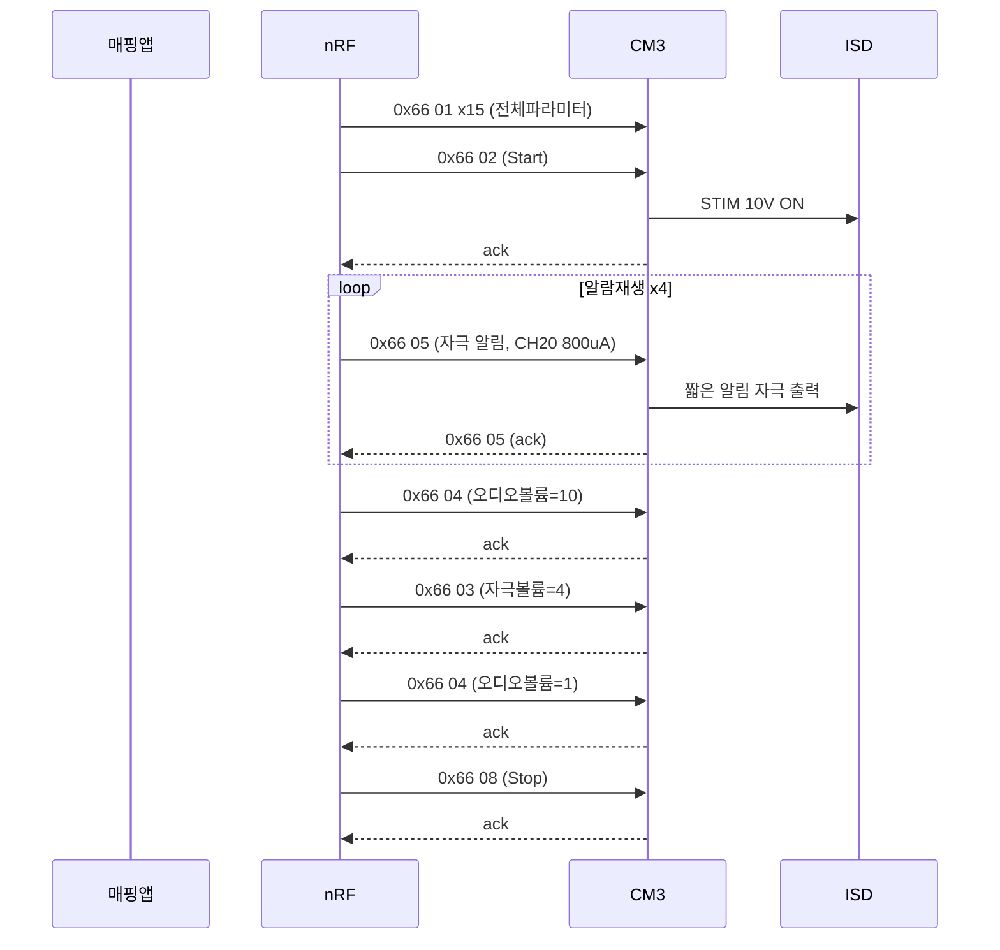
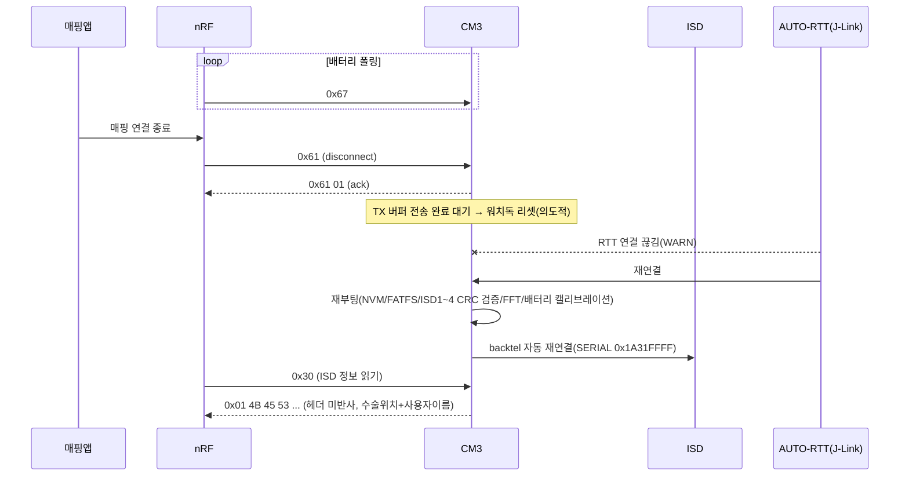
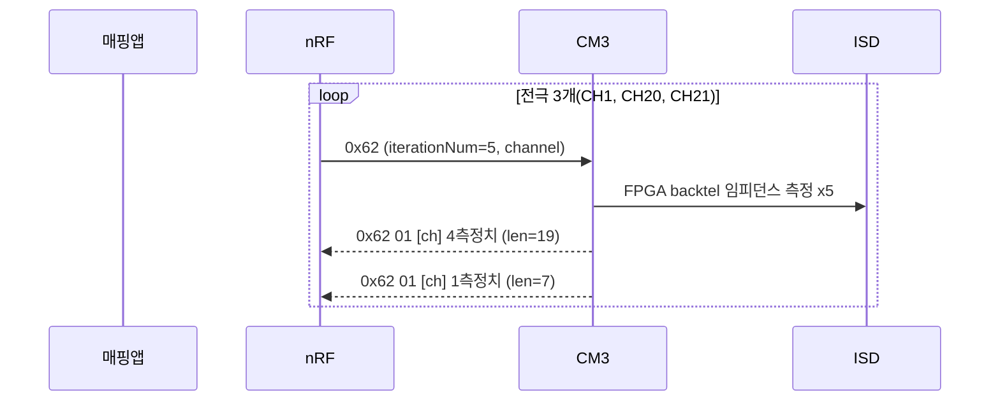
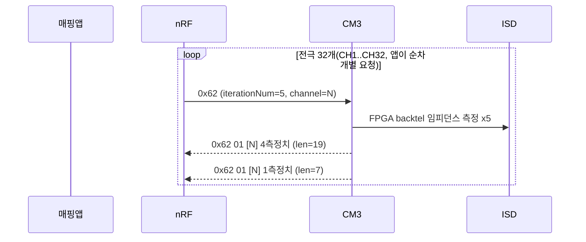
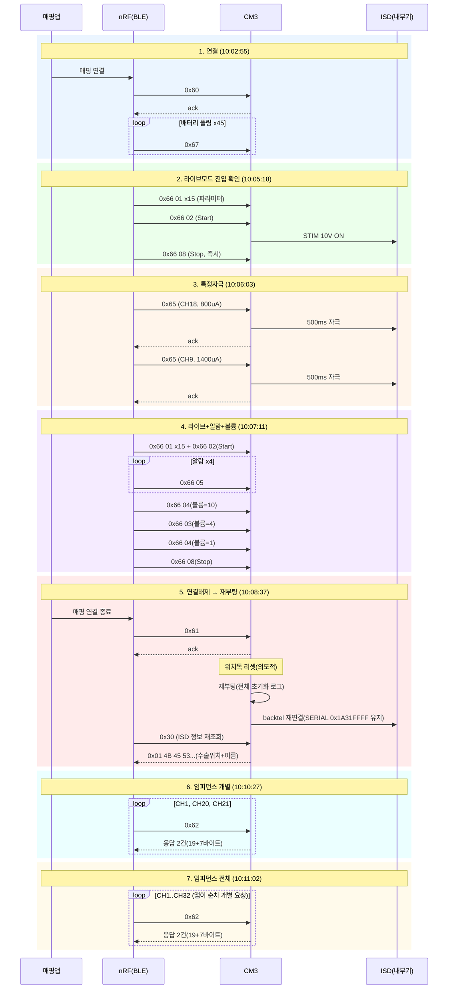

# 06 실측 로그 디코딩

**TL;DR**: `docs/참고/ble/` RTT 로그 7종(연결→라이브→특정자극→라이브+알람+볼륨→연결해제→임피던스 개별→전체)을 패킷 단위로 디코드했다. TX[20]은 `tdc_hal_spi.c:305`에서 명시적으로 기록하는 **전송 바이트 수(dataSize)**로 확정(코드 주석 `tdc_ble_communication.c:80-82`도 동일 진술). RX[20]은 CM3가 파싱에 전혀 쓰지 않으며, 디버그 출력부(`tdc_ble_communication.c:282`)가 20바이트짜리 `Rx_DataPacket` 배열의 인덱스 20을 읽어 **배열 범위를 벗어난 값**을 찍고 있다는 정황도 함께 확인했다(전 로그에서 예외 없이 `01` 고정). 에러 응답(0xF0)·재시도·데이터 누락은 없었고, 유일한 "타임아웃성" 경고는 연결해제(0x61) 직후 CM3가 **의도적으로 워치독 리셋을 거는 정상 동작**이었다.

## 목차

1. [명령 코드 ↔ 열거형 대조표](#1-명령-코드--열거형-대조표)
2. [21번째 바이트([20]) 규명](#2-21번째-바이트20-규명)
3. [요청-응답 규칙성](#3-요청-응답-규칙성)
4. [로그별 시퀀스 디코드](#4-로그별-시퀀스-디코드)
5. [라이브모드 로그 2종 정밀 대조](#5-라이브모드-로그-2종-정밀-대조)
6. [전체 세션 통합 타임라인](#6-전체-세션-통합-타임라인)
7. [이상 징후 목록](#7-이상-징후-목록)
8. [핵심 질문 요약 답변](#8-핵심-질문-요약-답변)

---

## 1. 명령 코드 ↔ 열거형 대조표

로그 7종에 **실제로 나타난** 헤더만 정리한다(근거: `src/2__cm3/source/ble/tdc_ble_protocol.h`).

| 헤더(hex) | 열거형 이름 | 그룹 | 근거 | 로그 출현 |
|---|---|---|---|---|
| `0x30` | `en__bleSetting_ReadConnected_ISD_info` | 통신 프로토콜(0x30대) | `tdc_ble_protocol.h:29` | 연결해제 로그(재부팅 후) |
| `0x60` | `en__mapping_connect` | 매핑(0x60대) | `tdc_ble_protocol.h:88` | 연결 로그 |
| `0x61` | `en__mapping_disconnect` | 매핑 | `tdc_ble_protocol.h:89` | 연결해제 로그 |
| `0x62` | `en__mapping_impedanceChekck` | 매핑 | `tdc_ble_protocol.h:90` | 임피던스 개별·전체 |
| `0x65` | `en__mapping_specific_stimulation` | 매핑 | `tdc_ble_protocol.h:93` | 특정자극 |
| `0x66` | `en__mapping_live_stimulation` | 매핑 | `tdc_ble_protocol.h:94` | 라이브모드, 라이브+알람+볼륨 |
| `0x67` | `en__mapping_deviceStatus` | 매핑 | `tdc_ble_protocol.h:95` | 전 로그(배터리·상태 폴링 노이즈) |

`0x66`(라이브 자극)의 서브커맨드(`Rx_dataPacket[1]`), 근거 `src/2__cm3/source/isd/tdc_isd_map_live.h:7-19`:

| 서브커맨드 값 | 열거형 이름 | 의미 | 로그 출현 |
|---|---|---|---|
| 0 | `en__Standby` | 대기(프로토콜 값으로 직접 오지 않음, 내부 상태) | - |
| 1 | `en__allParameter` | 전체 파라미터 전달(데이터 인덱스 1~15 분할 전송) | 라이브모드, 라이브+알람+볼륨 |
| 2 | `en__Start` | 라이브 모드 시작 | 라이브모드, 라이브+알람+볼륨 |
| 3 | `en__StimulationVolumeAdjust` | **자극 볼륨 조절** | 라이브+알람+볼륨 |
| 4 | `en__MicSensitivityAdjust` | **마이크 감도(=오디오 볼륨) 조절** | 라이브+알람+볼륨 |
| 5 | `en__mapping_Stimul_indicator` | **알림용 자극 출력("알람" 테스트)** | 라이브+알람+볼륨 |
| 6 | `en__readEqualizer` | 이퀄라이저 읽기 | 미관측 |
| 7 | `en__readDeviceStatus` | 장치 상태 읽기 | 미관측 |
| 8 | `en__Stop` | 라이브 모드 종료 | 라이브모드, 라이브+알람+볼륨 |
| 9 | `en__HoldOn` | 내부 유지 상태(프로토콜 값으로 직접 오지 않음) | - |

`0x62`(임피던스) 응답 서브값: `en__MonoPolar_impedance = 1` (`src/2__cm3/source/isd/tdc_isd_map_impedance.h:10`) — TX 페이로드 2번째 바이트 고정값.

> [!NOTE]
> **미출현 헤더**: 리모콘군(0x40~0x5F), eCAP(0x63/0x64), 매핑 파일 계열(0x68~0x71), 테스트자극/ISD ID(0x90/0x91), QCC 시스템정보(0x33~0x36), 게인제어(0x8C)·디버그(0x8F), DFU(0xC0~0xC3), 에러(0xF0) 모두 이 7개 로그에는 **한 번도 나타나지 않는다**. 이는 이 세션이 순수 "매핑 앱 ↔ nRF ↔ CM3" 흐름만 캡처했고 QCC(클래식 BT·오디오 코덱) 연동 패킷은 포함하지 않았음을 뜻한다 — 아래 §6 다이어그램의 참여자 정정 참고.

## 2. 21번째 바이트([20]) 규명

### TX 방향 — **확정**: 전송 바이트 수(dataSize)

`src/2__cm3/source/hal/tdc_hal_spi.c:287-305`:

```c
void tdc_hal_spi_write_tx_buffer(int *source, int dataSize)
{
    ...
    for (int i = 0; i < dataSize; i++) { SPI_Tx_Buffer[i] = source[i]; }
    for (int i = dataSize; i < TDC_HAL_SPI_COMM_PACKET_SIZE; i++) { SPI_Tx_Buffer[i] = 0; }
    SPI_Tx_Buffer[TDC_HAL_SPI_COMM_PACKET_SIZE - 1] = dataSize;  // 21 - 1 = 20, 20 인덱스에 dataSize 기록
```

즉 TX[20]은 그 호출에서 넘긴 `dataSize`(헤더+페이로드 유효 바이트 수) 그 자체다. 코드 주석으로도 명시적으로 확인된다(`tdc_ble_communication.c:80-82`, ISD 미연결 시 0x30 응답을 tx_index=0으로 보내는 분기 주석):

> "전송 크기가 0이므로 전송 바이트 수를 알려주는 마지막 바이트 즉, `[20]` 인덱스도 0으로 채워져서 보내질 것이다."

실측으로도 전부 일치한다(발췌):

| TX 패킷(요약) | dataSize(=TX[20]) | 호출부 근거 |
|---|---|---|
| `0x60 01 00...` (connect ack) | 2 | `tdc_ble_mapping.c:1838-1840` (`command`,`1`) |
| `0x61 01 00...` (disconnect ack) | 2 | `tdc_ble_mapping.c:1852-1854` |
| `0x67 01 50 00 00...` (deviceStatus) | 5 | `tdc_ble_mapping.c:1964-1989` (5개 필드) |
| `0x66 01 XX 00...` (전체파라미터 echo) | 3 | `tdc_ble_mapping.c` 내 echo 경로(command,liveSubCommand,dataIndex) |
| `0x66 02 00...` (라이브 시작 ack) | 2 | `tdc_isd_map_live.c:185-191` |
| `0x66 05 00...` (알람 ack) | 2 | `tdc_isd_map_live.c:311-317` |
| `0x66 03/04 XX 00...` (볼륨 ack) | 3 | `tdc_isd_map_live.c:228-236`, `:263-271` |
| `0x65 01 00...` (특정자극 ack) | 2 | `tdc_isd_map_specific_stim.c:490-497` |
| `0x62 01 XX ...` (임피던스 1차, 4측정치) | 0x13=19 | `tdc_isd_map_impedance.c:626-652` (3헤더+4×4바이트) |
| `0x62 01 XX ...` (임피던스 2차, 1측정치) | 0x07=7 | 동일(3헤더+1×4바이트) |
| `0x01 4B 45 53 00...` (0x30 응답) | 0x0B=11 | `tdc_ble_communication.c:70-77` (location 1 + 이름 10바이트) |

### RX 방향 — **미확인, 배열 범위 초과 읽기로 강하게 의심**

- 수신 DMA는 항상 21바이트 고정 프레임을 `SPI_Rx_Buffer[21]`에 채운다(`tdc_hal_spi.c:20`, `TDC_HAL_SPI_COMM_PACKET_SIZE=21`).
- 그러나 실제로 명령 파싱에 쓰이는 배열은 `Rx_DataPacket[BLE_DataPacketSize]` = **20개짜리 배열**(`tdc_hal_spi.c:22`, `BLE_DataPacketSize=20`)이고, 복사 루프도 `for (int i = 0; i < BLE_DataPacketSize; i++) Rx_DataPacket[i] = SPI_Rx_Buffer[i];`(`tdc_hal_spi.c:159-162`)로 **인덱스 0~19만** 채운다. 즉 마스터(nRF)가 실제로 보낸 21번째 바이트는 CM3 명령 처리 로직에 전혀 반영되지 않는다.
- 그럼에도 디버그 출력부 `tdc_ble_communication.c:275-283`은 `p_Rx_dataPacket[20]`까지 21개를 찍는다. `p_Rx_dataPacket`은 `tdc_hal_spi_get_rx_packet_addr()`가 반환하는 `&Rx_DataPacket[0]`(`tdc_hal_spi.c:44-47`)이므로, 이 `[20]` 읽기는 **20개짜리 배열의 인덱스 20을 읽는 배열 범위 초과(out-of-bounds) 읽기**다.
- 7개 로그 전체에서 RX[20]은 페이로드·헤더와 무관하게 **예외 없이 `01`**이었다(연결/임피던스/라이브/특정자극 등 모든 헤더에서 동일). 이는 실제로 SPI 버스를 타고 온 21번째 바이트라기보다, `Rx_DataPacket` 바로 뒤에 오는 다른 정적 변수(같은 파일의 `static bool TxBufferEmpty`, 초기값·상시값이 `true`=1인 변수)를 우연히 읽고 있을 가능성이 높다는 정황이다.
- **결론**: TX[20]과 달리 RX[20]의 "진짜 의미"(마스터가 실제로 보낸 21번째 바이트가 무엇을 나타내는지)는 CM3 코드만으로는 **미확인**이다(nRF 펌웨어 소스가 이 저장소 범위 밖). 다만 "CM3가 이 바이트를 프로토콜 해석에 전혀 쓰지 않는다"는 점과 "디버그 로그에 찍히는 `01`이 배열 범위 초과 읽기로 보인다"는 점은 코드로 확정된다. §7 이상 징후에도 재수록.

## 3. 요청-응답 규칙성

| 패턴 | 설명 | 예시 |
|---|---|---|
| **헤더 에코형** | TX[0]=RX[0](명령 헤더 그대로 반사) + TX[1]=서브커맨드/성공플래그 | `0x60→0x60 01`, `0x61→0x61 01`, `0x65→0x65 01`, `0x66 0N→0x66 0N ...` |
| **헤더+서브+값 에코형** | TX[0]=헤더, TX[1]=서브커맨드, TX[2]=공유메모리에서 즉시 재조회한 최신값(요청값이 아니라 저장 후 재독출값) | `0x66 03 04→0x66 03 04`(자극볼륨), `0x66 04 0A→0x66 04 0A`(오디오볼륨) |
| **완전 별도 포맷형** | TX[0]이 RX[0]과 무관 — 헤더를 아예 반사하지 않고 페이로드부터 바로 씀 | `0x30 RX → TX 0x01 4B 45 53...`(수술위치+사용자이름, 헤더 생략) |
| **다중 TX 분할형** | RX 1건에 TX 여러 건(측정치가 21바이트 한도를 넘어 분할) | `0x62`(임피던스): 4측정치(19바이트) + 나머지(7바이트) 2건 |
| **무응답형** | 관측 안 됨(7개 로그 내에서는 모든 RX가 TX를 받았다) | - |

**일관성 평가**: "헤더를 그대로 반사한다"는 공통 관례가 있지만 **완전히 일관되지는 않는다**. `0x60~0x67` 매핑 프로토콜군은 전부 헤더 에코를 지키는 반면, `0x30`(통신 프로토콜군, `tdc_ble_communication.c:59-90`)은 헤더를 생략하고 페이로드부터 바로 쓴다 — 명령마다 처리 함수가 다르고(`setting_nrf_ble_adv_info()` vs `tdc_ble_mapping_step()`) 공용 응답 빌더가 없기 때문으로 보인다(구조적 비일관성, 버그는 아님).

## 4. 로그별 시퀀스 디코드

### 4.1 매핑로그 - 연결.md (10:02:55, 223줄)

| 순번 | 방향 | 헤더 | 서브커맨드 | 데이터인덱스 | 주요 페이로드 | 해석 | 직후 로그 출력 |
|---|---|---|---|---|---|---|---|
| 1 | RX/TX | `0x60`/`0x60` | - | - | 전부 0 | 매핑 연결 요청 → ack(dataSize=2) | `매핑로그 - 연결.md:24`: `[DEBUG] LED PATTERN UPDATE TO MAPPING CONN ISD CONN BATTERY NORMAL` |
| 2~46 | RX/TX | `0x67`/`0x67` | - | - | RX 전부 0, TX `01 50 00 00`(연결됨, 배터리 80%, 에러 0) | 장치상태(배터리) 폴링, **45회 반복**(약 5ms 주기) | 없음(순수 폴링, `매핑로그 - 연결.md:28-223`) |

**요약**: 매핑 앱이 `0x60`으로 연결을 열고, 이후 세션 내내 `0x67` 장치상태(배터리 퍼센트) 폴링만 반복한다. 배터리 실측값은 `mV 3984→3993`으로 안정(`매핑로그 - 연결.md:5-19`). ISD 부팅/연결 로그(파일 CRC, ISD 시리얼 등)는 **이 로그에는 없다** — RTT 연결 시점이 이미 부팅 이후였기 때문으로 보이며, 해당 정보는 뒤의 연결해제 로그(재부팅 유발) 말미에서 관측된다(§6 참고).



### 4.2 매핑로그 - 라이브모드.md (10:05:18, 130줄)

| 순번 | 방향 | 헤더 | 서브커맨드 | 데이터인덱스 | 주요 페이로드 | 해석 | 직후 로그 출력 |
|---|---|---|---|---|---|---|---|
| 1~7 | RX/TX | `0x67` | - | - | 반복 | 배터리 폴링, **7회 반복** | 없음 |
| 8 | RX/TX | `0x66` | 1(전체파라미터) | 1 | stimVol=4, audioVol=1, 알림채널=0x14, 진폭=0x0219, 전략=1, 모드=2, 위상=0, 폭=0x19, 밴드=1 | 라이브 파라미터 묶음 시작 | `[MAPPING] LINK CHECK TRIGGERED (LIVE, STANDBY)`(`:38`) |
| 9~22 | RX/TX | `0x66` | 1 | 2~15 | 전극번호·기준전극·주파수밴드순서·T레벨·C레벨 청크 | 전체파라미터 분할 전송(**인덱스 2~15, 14건**, 각 TX echo dataSize=3) | 인덱스 5, 10, 13에서 `LINK CHECK TRIGGERED` 재출력(`:56,78,92`) |
| 23 | RX/TX | `0x66` | 2(Start) | - | 없음 | 라이브 자극 시작 | `[LIVE] LIVE ALL PARAMETER PAYLOAD...`→`[FFT]`→`[INDICATE]`→`[PARAM] PULSE PHASE WIDTH:25, FRAME NUM:2, CH NUM:12`→`[STIMULATION] TRIGGER/DONE`→`SUCCESS TO ENABLE STIM 10V BY EN__START`(`:101-118`) |
| 24 | RX/TX | `0x66` | 8(Stop) | - | 없음 | 즉시 라이브 종료 | 없음(`:126`) |
| 25~ | RX/TX | `0x67` | - | - | 반복 | 배터리 폴링 재개 | 없음 |

**요약**: 매핑 앱이 전체 파라미터(15개 데이터 인덱스, 32전극 규모)를 업로드한 뒤 `Start`로 자극을 켜고, **거의 곧바로 `Stop`으로 끈다**(START→STOP 사이 다른 명령 없음). "라이브 모드 진입·링크 체크"만 확인하는 짧은 시나리오다.



### 4.3 매핑로그 - 특정자극.md (10:06:03, 163줄)

| 순번 | 방향 | 헤더 | 서브커맨드 | 데이터인덱스 | 주요 페이로드 | 해석 | 직후 로그 출력 |
|---|---|---|---|---|---|---|---|
| 1~13 | RX/TX | `0x67` | - | - | 반복 | 배터리 폴링, **13회 반복** | 없음 |
| 14 | RX | `0x65` | - | - | 전극수32, 폭25, 위상0, 모드2, 자극전극18, 기준전극99(모노폴라), 레벨800uA, 유지시간500ms | 특정 전극(CH18) 단발 자극 요청 | `[SPEC]` 12줄(`:98-111`: USABLE ELEC~STIM CH NUM) |
| 15 | TX | `0x65` | 1(성공) | - | - | 500ms 자극 유지 후 ack(dataSize=2) | `[MAPPING] STIMULATION HOLD TIME FINISHED`(`:113`) |
| 16~ | RX/TX | `0x67` | - | - | 반복 | 배터리 폴링 재개(**약 8회**) | 없음 |
| 마지막 | RX | `0x65` | - | - | 전극수32, 폭25, 자극전극9, 기준전극99, 레벨1400uA, 유지시간500ms | 두 번째 특정 전극(CH9) 자극 요청 | `[SPEC]` 12줄(`:130-143`) |
|  | TX | `0x65` | 1(성공) | - | - | ack | `STIMULATION HOLD TIME FINISHED`(`:145`) |

**요약**: 사용자가 앱에서 특정 전극을 골라 단발 자극을 2회 실행(CH18@800uA, CH9@1400uA)한다. 두 요청 모두 `기준전극=99`(모노폴라 예외값, `tdc_ble_mapping.c:277`)를 써서 `STIM MODE: MP-R`로 표시된다. RX와 TX(ack) 사이의 로그 간격이 실제 500ms 유지시간에 비해 짧게 보이는 점은 §7 이상 징후에 기록했다.



### 4.4 매핑로그 - 라이브모드 + 알람재생 + 볼륨변경.md (10:07:11, 192줄)

§5에서 4.2와 정밀 대조하므로 표는 핵심 차이만 요약한다(공통부는 4.2와 동일).

| 순번 | 방향 | 헤더 | 서브커맨드 | 주요 페이로드 | 해석 | 직후 로그 출력 |
|---|---|---|---|---|---|---|
| 1~4 | RX/TX | `0x67` | - | 반복 | 배터리 폴링(**4회**) | 없음 |
| 5~19 | RX/TX | `0x66` | 1 | 데이터 인덱스 1~15 | 전체 파라미터 업로드(4.2와 동일 값) | `LINK CHECK TRIGGERED` 3회 |
| 20 | RX/TX | `0x66` | 2(Start) | - | 라이브 시작 | `[LIVE]`/`[PARAM]`/`[STIMULATION]` 동일(:121-138) + `LINK CHECK TRIGGERED`(:126) |
| 21 | RX/TX | `0x66` | 5(알람1) | 채널0x14, 진폭0x0320(800uA) | **알람재생 1회차** | 없음 |
| 22 | RX/TX | `0x66` | 5(알람2) | 동일 | **알람재생 2회차** | 없음 |
| 23 | RX/TX | `0x66` | 5(알람3) | 동일 | **알람재생 3회차** | 없음 |
| 24 | RX/TX | `0x66` | 4(볼륨) | 0x0A(10) | **오디오/마이크 볼륨 → 10** | 없음 |
| 25 | RX/TX | `0x66` | 3(볼륨) | 0x04(4) | **자극 볼륨 → 4** | 없음 |
| 26 | RX/TX | `0x66` | 5(알람4) | 채널0x14, 진폭0x0320 | **알람재생 4회차** | 없음 |
| 27 | RX/TX | `0x66` | 4(볼륨) | 0x01(1) | **오디오/마이크 볼륨 → 1로 복귀** | 없음 |
| 28 | RX/TX | `0x66` | 8(Stop) | - | 라이브 종료 | 없음 |
| 29~ | RX/TX | `0x67` | - | 반복 | 배터리 폴링 재개(**3회**) | 없음 |

**요약**: 4.2와 동일한 시작 시퀀스(파라미터 업로드→Start) 뒤에, 알람(서브커맨드5) 4회·자극볼륨 변경(서브3) 1회·오디오볼륨 변경(서브4) 2회가 인터리브되고 `Stop`으로 마친다. 세부 대조는 §5 참고.



### 4.5 매핑로그 - 연결해제.md (10:08:37, 207줄)

| 순번 | 방향 | 헤더 | 서브커맨드 | 주요 페이로드 | 해석 | 직후 로그 출력 |
|---|---|---|---|---|---|---|
| 1~7 | RX/TX | `0x67` | - | 반복 | 배터리 폴링(**7회**) | 없음 |
| 8 | RX/TX | `0x61` | - | 전부 0 | **연결해제 요청** → ack(dataSize=2) | 즉시 `[AUTO-RTT] WARN 타겟 응답 없음 → 연결 끊김 판정`(`:41`), 재연결 시도(`:42-65`) |
| — | (RTT 재연결) | - | - | - | J-Link 재연결 성공, up[0] 버퍼 복구 | `[INFO] MODEL: SULLIVAN 1.5, FW: 2.00`부터 전체 **부팅 시퀀스** 출력(NVM/FATFS/ISD1~4 파일 CRC 검증/FFT PASS BIN 32개/배터리 캘리브레이션 테이블/ACC/LSAD/LED/PMIC/FPGA)(`:48-165`) |
| 9 | — | — | - | - | `[ISD] CURRENTLY CONNECTED ISD SERIAL: 0x1A31FFFF`, `MASTER KEY DEVICE`, `ID MATCH NUM=1`(`:166-184`) | 재부팅 후 ISD 자동 재연결 |
| 10 | RX | `0x30` | - | 전부 0 | ISD 정보 읽기 요청 | - |
| 11 | TX | `0x01` | - | `4B 45 53`("KES"...) | **헤더 미반사** — 수술위치(1)+사용자이름 10바이트, dataSize=0x0B(11) | `[STIMULATION] DONE, START LIVE MODE`, LED패턴 `STIM OUT BATTERY NORMAL`(`:204-206`) |

**요약**: `0x61`(연결해제)을 받은 CM3는 ack를 보낸 뒤 **의도적으로 워치독 리셋을 걸어 재부팅**한다(`tdc_ble_mapping.c:1849-1874`). 이 재부팅이 RTT 연결 끊김의 원인이며, AUTO-RTT 툴이 자동 재연결해 부팅 전체 로그를 잡아냈다 — 코드 분석(§7)에서 정상 동작으로 확정.



### 4.6 매핑로그 - 임피던스 개별.md (10:10:27, 73줄)

| 순번 | 방향 | 헤더 | 반복수 | 채널 | 주요 페이로드 | 해석 | 직후 로그 출력 |
|---|---|---|---|---|---|---|---|
| 1~8 | RX/TX | `0x67` | 8회(분산) | - | 반복 | 배터리 폴링 | 없음 |
| A | RX | `0x62` | iterationNum=5 | 1 | 폭시작/끝=15/15, 레벨=0x0118(280uA) | CH1 임피던스 측정 요청 | `[MAPPING] CHECK IMPEDANCE, START FLAG IS SET` |
| A-1 | TX | `0x62` | - | 1 | `01 01 0A6B 0A5C 0A68 0A60`(4측정치) | 1차 응답(dataSize=0x13=19) | - |
| A-2 | TX | `0x62` | - | 1 | `01 01 0A62 0A5B`(1측정치) | 2차 응답(dataSize=0x07=7) | - |
| B | RX | `0x62` | iterationNum=5 | 0x14(20) | 동일 조건 | CH20 임피던스 측정 요청 | `CHECK IMPEDANCE, START FLAG IS SET` |
| B-1,2 | TX | `0x62` | - | 20 | 4측정치+1측정치(일부 음수: `FFFFFF9E` 등) | 응답 2건(19바이트+7바이트) | - |
| C | RX | `0x62` | iterationNum=5 | 0x15(21) | 동일 조건 | CH21 임피던스 측정 요청 | `CHECK IMPEDANCE, START FLAG IS SET` |
| C-1,2 | TX | `0x62` | - | 21 | 4측정치+1측정치 | 응답 2건 | - |

**요약**: 사용자가 앱에서 **개별 전극(CH1, CH20, CH21)을 선택**해 임피던스를 측정한다. 매 채널당 `iterationNum=5`회 반복 측정을 요청하고, 응답은 `Max_ImpedanceReturnDataSize=4`(`tdc_ble_protocol.h:121`) 단위로 쪼개져 4개+1개, TX 2건으로 온다.



### 4.7 매핑로그 - 임피던스 전체.md (10:11:02, 235줄)

| 순번 | 방향 | 헤더 | 채널 범위 | 주요 페이로드 | 해석 | 직후 로그 출력 |
|---|---|---|---|---|---|---|
| 1~8 | RX/TX | `0x67` | - | 반복 | 배터리 폴링(분산 8회) | 없음 |
| 1~32 | RX | `0x62` | CH1~CH32(`Rx[2]`=0x01~0x20 순차) | iterationNum=5 고정, 폭15/15, 레벨280uA | **32개 전극을 순차적으로 개별 요청**(각기 독립된 RX) | 매 채널마다 `CHECK IMPEDANCE, START FLAG IS SET` |
| 1~32 | TX | `0x62` | 동일 | 채널당 4측정치(len=19)+1측정치(len=7), 총 64건 | 채널별 임피던스 응답 | - |

**요약**: "전체" 임피던스는 프로토콜상 `channel=255`(전채널 자동 순회, `tdc_ble_mapping.c:600-620`)를 쓰는 게 아니라, **매핑 앱이 CH1부터 CH32까지 하나씩 개별 `0x62` 요청을 32번 순차 발행**하는 방식으로 구현되어 있다(`매핑로그 - 임피던스 전체.md:39,45,51,...`에서 `Rx[2]`가 01→02→...→20(hex, 32dec)로 1씩 증가). 즉 코드에 있는 "채널=255 전체 자동측정" 분기는 **이 로그에서는 실제로 쓰이지 않는다** — 다른 노드(프로토콜 카탈로그)가 "255=전채널" 기능을 문서화할 때 "현재 앱은 순차 개별요청 방식을 쓴다"는 실측 근거로 활용 가능.



## 5. 라이브모드 로그 2종 정밀 대조

`매핑로그 - 라이브모드.md`(이하 A) vs `매핑로그 - 라이브모드 + 알람재생 + 볼륨변경.md`(이하 B).

| 구간 | A(라이브모드) | B(라이브+알람+볼륨) | 차이 |
|---|---|---|---|
| 초기 배터리 폴링 | 7회(`:7-23`) | 4회(`:7-22`) | 세션 타이밍 차이일 뿐, 의미 없음 |
| 전체파라미터 업로드(0x66 01, 인덱스1~15) | 15건, 페이로드 완전 동일 | 15건, **페이로드 A와 바이트 단위로 완전 동일**(`:53-119` vs `:35-100`) | 없음(동일 맵 데이터 재사용) |
| Start(0x66 02) | 1건, `[LIVE]/[PARAM]/[STIMULATION]` 로그 동일 | 1건, 동일 로그 + `LINK CHECK TRIGGERED` 1회 추가(타이밍 우연) | 로그 문구 동일 |
| **알람재생(0x66 05)** | **없음** | **4건**, 매번 채널=`0x14`(20), 진폭=`0x0320`(800uA) 고정 | **B만의 고유 패킷** — 사용자가 "알람 테스트" 버튼을 4회 누른 것으로 해석 |
| **볼륨변경(0x66 03, 04)** | **없음** | 자극볼륨(0x66 03) 1건: `04`(4) / 오디오볼륨(0x66 04) 2건: `0A`(10)→`01`(1) | **B만의 고유 패킷** — 자극볼륨 1단계 상향, 오디오볼륨 10까지 올렸다가 1로 원복 |
| Stop(0x66 08) | 1건, Start 직후 바로 종료 | 1건, 알람·볼륨 조작 후 종료 | A는 "진입 확인용" 초단시간 세션, B는 실사용 시나리오 |
| 종료 후 배터리 폴링 | 재개(`:129-130`, 로그 끝) | 3회 재개 후 로그 종료(`:190-192`) | 없음 |

**정확한 패킷 특정 (요청사항 회신)**:
- **알람 재생** = 헤더 `0x66`, 서브커맨드 `0x05`(`en__mapping_Stimul_indicator`). 페이로드 `Rx[2]`=자극 채널 번호(로그에서는 `0x14`=20 고정), `Rx[3..4]`=자극 진폭 uA(`0x0320`=800uA 고정). ack는 `0x66 05`(dataSize=2)이며, 트리거 즉시 완료되는 짧은 자극이라 다음 RX 전에 ack가 바로 온다(`tdc_isd_map_live.c:286-334`).
- **볼륨 변경**은 두 갈래다: (1) 헤더 `0x66` 서브 `0x03`(`en__StimulationVolumeAdjust`, 자극볼륨 1~4범위) — 페이로드 `Rx[2]`=신규 볼륨값, ack `0x66 03 [읽은값]`(dataSize=3). (2) 헤더 `0x66` 서브 `0x04`(`en__MicSensitivityAdjust`, 코드 주석상 이름은 "마이크 감도"이나 실제로는 `tdc_shm_change_audio_volume()`을 호출해 **오디오 볼륨**을 바꾼다, 1~10범위) — 페이로드 `Rx[2]`=신규 볼륨값, ack `0x66 04 [읽은값]`(dataSize=3). 이 명명 불일치(함수명 "Mic감도" vs 실동작 "오디오볼륨")는 다른 노드(핸들러 골격)가 참고할 만한 코드 냄새다.

## 6. 전체 세션 통합 타임라인

7개 로그를 하나의 연속 세션으로 이어 그린다(로그 간 상태 연속성 반영: 연결 상태·ISD 시리얼·라이브 파라미터가 그대로 이월된다).



**상태 연속성 메모**:
- ISD 시리얼(`0x1A31FFFF`)·MAP NUM(1)·사용자 설정은 로그1~4에서 유지되다가, 로그5의 재부팅에서 **파일 시스템 재검증 후 동일 값으로 복원**된다(`매핑로그 - 연결해제.md:66-184`).
- 로그2/4의 전체파라미터 페이로드가 바이트 단위로 동일한 것은, 같은 맵(사용자설정 MAP NUM=1)을 두 번 다시 로드했기 때문으로 해석된다.
- 로그6/7의 임피던스 조건(iterationNum=5, 펄스폭 15/15, 레벨 280uA)이 완전히 동일한 것도 앱의 기본 임피던스 측정 프리셋이 고정값임을 시사한다(미확인: 앱 UI 소스는 이 저장소 밖).

## 7. 이상 징후 목록

| # | 징후 | 근거(로그) | 코드 경로 | 판정 |
|---|---|---|---|---|
| 이상징후_1 | `[AUTO-RTT] WARN 타겟 응답 없음`, `연결 끊김`, `연결 실패: Could not find supported CPU` | `매핑로그 - 연결해제.md:41-47,61-62` | `tdc_ble_mapping.c:1849-1874`(`en__mapping_disconnect` 처리부, `SYS_WATCHDOG_RESET()`) | **정상 동작**. 매핑 앱이 연결을 끊으면 CM3가 TX 버퍼 전송 완료를 기다린 뒤 **의도적으로 워치독 리셋**을 걸어 재부팅한다. RTT/J-Link 입장에서는 타겟이 사라진 것처럼 보여 WARN이 뜨지만 실제로는 설계된 종료 절차다. |
| 이상징후_2 | RX[20]이 모든 헤더·모든 로그에서 예외 없이 `01` | 전 로그 공통 | `tdc_ble_communication.c:275-283`(`p_Rx_dataPacket[20]` 출력) vs `tdc_hal_spi.c:22`(`Rx_DataPacket[BLE_DataPacketSize]`, 20개), `:159-162`(0~19만 채움) | **배열 범위 초과 읽기로 강하게 의심**(§2 상세). 기능 동작에는 영향 없음(파싱 로직은 인덱스 0~19만 사용) — 디버그 로그 신뢰성 문제로만 분류. |
| 이상징후_3 | `[SPI TX]` 로그에 `0A FFFFFF9E`처럼 8자리 16진수(음수 부호확장)가 섞여 나옴 | `매핑로그 - 임피던스 개별.md:62`, `매핑로그 - 임피던스 전체.md:47` 등 다수 | `tdc_isd_map_impedance.c:560-561`(`(char)` 캐스팅 후 `:637-641`에서 `(int)` 재캐스팅 → 부호확장) + `tdc_hal_spi.c:311-345`(TX 디버그 출력에 `& 0xFF` 마스크 없음, RX 쪽 에러덤프 `:97`은 마스크 있음과 대조) | **디버그 출력 전용 결함으로 판단**(미확인: 실제 SPI 와이어 값까지 확정하려면 HW 워드사이즈 확인 필요하나 `SPI_WORD_SIZE_8` 설정상 실전송은 8비트로 잘릴 것으로 추정). 임피던스 원시값이 음수(부호있는 char)일 때 `%02X` 포맷이 마스킹 없이 32비트 전체를 찍어서 발생. |
| 이상징후_4 | 특정자극(0x65) RX와 TX(ack) 사이에 500ms 유지시간에 해당하는 배터리 폴링(`[BATT]`, ~5ms 주기) 로그가 거의 안 보임 | `매핑로그 - 특정자극.md:97-113` | `tdc_isd_map_specific_stim.c:468-503`(`stimulationTime_msec >= stimulationHoldTime_msec` 대기 로직) | **미확인**. RTT 업 채널 버퍼가 1024B로 작아(`README.md:18` 참고), `[SPEC]` 디버그 12줄이 한꺼번에 쏟아지는 구간에서 버퍼 오버런으로 중간 `[BATT]` 출력이 유실됐을 가능성이 있으나, 이 저장소 코드만으로는 확정할 수 없다. |
| 이상징후_5 | 재부팅 후 명시적 `0x66 02`(Start) RX 없이 `[STIMULATION] START LIVE MODE` 로그가 자동 출력됨 | `매핑로그 - 연결해제.md:200-206` | 미확인(부팅 경로 내 자동 트리거로 추정, `src/2__cm3` 부팅 시퀀스 담당 모듈 별도 확인 필요) | **미확인**. 이 로그 구간만으로는 트리거 명령을 특정할 수 없음 — 다른 노드(디스패치 경로/부팅 시퀀스)가 확인할 여지. |
| 이상징후_6 | 에러 응답(`0xF0`), 재시도, 명령 순서 위반, 응답 누락, 중복 패킷 | 전 로그 | `en__ERROR_Response = 0xF0`(`tdc_ble_protocol.h:23`), `tdc_sys_error_send_to_app(...)` 호출부 다수 | **미관측**. 7개 로그 전체에서 `0xF0` 헤더나 `tdc_sys_error_send_to_app` 트리거 흔적(에러 코드 페이로드)이 전혀 없다 — 캡처된 세션은 전 구간 정상 경로만 지나갔다. |

## 8. 핵심 질문 요약 답변

- **21번째 바이트([20])는 무엇인가?**
  - **TX**: 확정 — `dataSize`(그 응답의 유효 바이트 수, 헤더+페이로드 길이). `tdc_hal_spi.c:305`에서 명시적으로 기록되고, 코드 주석(`tdc_ble_communication.c:80-82`)도 동일하게 진술.
  - **RX**: 미확인. CM3는 이 바이트를 명령 파싱에 전혀 쓰지 않으며(20바이트 배열까지만 복사), 로그에 찍히는 `01` 고정값은 20개짜리 배열의 범위를 벗어난 읽기(`Rx_DataPacket[20]`)로 강하게 의심된다. nRF가 실제로 보내는 21번째 바이트의 진짜 의미는 이 저장소만으로는 알 수 없다.

- **응답 패킷 형식에 일관된 규칙이 있는가, 명령마다 제각각인가?**
  - 대체로 "헤더 에코 + 서브커맨드/성공플래그" 관례를 따르지만(0x60~0x67 매핑군), `0x30`(통신 프로토콜군) 응답은 헤더를 아예 생략하고 페이로드부터 쓰는 등 **완전히 통일되어 있지는 않다**. 응답 빌더 함수가 명령군마다 따로 있어 규칙이 코드 위치별로 갈린다(§3).

- **로그에서 에러·재시도·타임아웃 징후가 있는가?**
  - 프로토콜 레벨 에러(`0xF0`)·재시도·데이터 누락은 **전무**하다. 유일하게 "이상해 보이는" 이벤트(연결해제 후 RTT 끊김 WARN)는 코드로 확인한 결과 **CM3의 의도적 워치독 리셋에 의한 정상 재부팅**이었다(이상징후_1). 배열 범위 초과 읽기(이상징후_2)와 디버그 출력 부호확장(이상징후_3)은 로그 신뢰성 문제이지 프로토콜 오류는 아니다.
