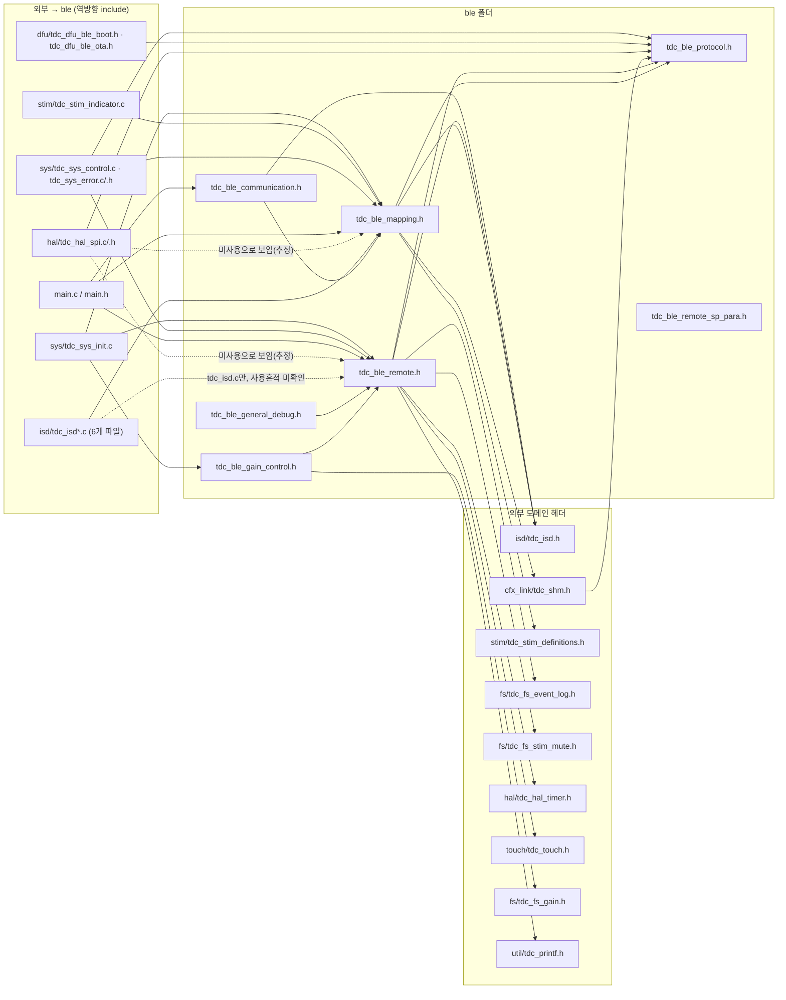

# 인접 모듈 결합도 분석

## TL;DR

`ble/`(7개 .c, 3,709줄 활성코드)는 `sys`(56회, 에러보고) · `cfx_link`(45회+직접 필드접근 12곳) · `hal`(44회, SPI 송신) 순으로 강결합이고, `isd/`와는 **양방향** 결합이다: `ble/`가 `isd_map_*_step()` 4종을 매 tick 트리거하고, 역으로 **`isd/` 6개 파일이 `tdc_ble_mapping_get_packet()`으로 ble 내부 구조체를 직접 읽고 `tdc_ble_mapping_clear_command()`를 39곳에서 호출**해 ble의 명령 상태를 지운다. `ble/`는 10V·DAC 레지스터를 직접 만지지 않지만 `isdControlCommand` 반환값으로 `tdc_isd_step()`을 다음 tick에 원격 트리거하고, 자극 안전범위(uA/전극수) 검사를 프로토콜 파싱 단계에서 수행한다. 헤더 순환include는 없으나 `mappingPacket`/`cfx_cm3_sharedMemoryAll` 구조체가 사실상 ble·isd·cfx 3자 공유 ABI라 매핑 관련 파일은 독립적으로 분리할 수 없다.

## 0. 조사 범위·방법

- 대상: `src/2__cm3/source/ble/` 7개 `.c`(`tdc_ble_communication.c` 474줄 · `tdc_ble_gain_control.c` 150줄 · `tdc_ble_general_debug.c` 156줄 · `tdc_ble_mapping.c` 2,196줄 · `tdc_ble_remote.c` 1,389줄 · `tdc_ble_remote_sp_para.c` 272줄, 사장 주석 제외 활성 약 3,700줄) + 6개 `.h`
- 방법: 정규식 기반 함수호출 전수추출 → 파일별 정의 여부 대조로 ble-내부/외부 함수 분리 → 각 호출 지점을 원문 대조해 **주석 안에 있는 죽은 호출(사장 코드)을 제외**하고 실계수 산출 → 외부 함수 정의 위치를 `grep`으로 확인해 소속 모듈(폴더) 매핑
- 정의를 `src/2__cm3/source/` 안에서 찾지 못한 것은 "미확인"으로 표기했고, 벤더 SDK(CMSIS/ON세미 RSL10 추정) 함수는 근거를 댈 수 없어 별도 그룹(`vendor_sdk`)으로 분리했다.
- 본 노드는 읽기 전용이며 `src/` 어떤 파일도 수정하지 않았다.

---

## 1. 나가는 의존 (ble → 외부) 전수표

### 1.1 모듈별 결합 강도 순위 (실행되는 호출 횟수 기준)

| 순위 | 모듈(폴더) | 호출 횟수(주석 제외 실계수) | 성격 |
|---|---|---|---|
| 1위 | `sys` | 57 | 에러 보고(56) + 에러 조회(1). 거의 전부 `tdc_sys_error_send_to_app` |
| 2위 | `util` | 46 | 로그 매크로(`TDC_PRINTF_*`) - 디버그 출력, 기능 결합 아님 |
| 3위 | `cfx_link` | 45 (+ 직접 필드접근 12곳, §2 참조) | CFX 공유메모리 접근자 - **ABI 성격상 가장 중요한 결합** |
| 4위 | `hal` | 44 | SPI 송신(33) 등 - 전송 계층, 프로토콜 처리에 구조적으로 필수 |
| 5위 | `isd` | 29 | 자극/내부기 상태 - **횟수는 적지만 안전 위험도 최상** (§4) |
| 6위 | `vendor_sdk`(추정) | 20 | NVIC/Sys_*/SYS_WATCHDOG - 레포 내 정의 미발견, HAL을 우회한 직접 접근 |
| 7위 | `pwr` | 13 | 배터리/충전기 상태 |
| 8위 | `fs` | 10 | 맵 초기화·이벤트로그·게인저장·묵음설정 |
| 9위 | `touch` | 7 | 디버그 프로토콜(0x8F, option1) 전용 |
| 9위 | `dfu` | 7 | OTA/부트 명령 전달 |
| 11위 | `main` | 2 | `readFirmwareInfo()` (모듈 아님, 진입점) |
| 12위 | `stim` | 1 | DAC 레지스터 조회 1회 |
| 12위 | `led` | 1 | LED 표시상태 반영 1회 |

> [!NOTE]
> **호출 빈도와 "결합의 중요도"는 다르다.** `sys`·`util`은 횟수는 최상위지만 로그·에러보고라 재구조화 시 위험이 낮다. **구조적으로 가장 위험한 결합은 `cfx_link`(공유 ABI)와 `isd`(자극 트리거 + 양방향 상태 공유, §4·§8)** 이며, 아래 §4·§8에서 별도로 다룬다.

### 1.2 모듈별 상세 (함수 / 호출 횟수 / 대표 호출 위치)

#### `sys` (57회) - `src/2__cm3/source/sys/`

| 함수 | 횟수 | 대표 호출 위치 | 용도 |
|---|---|---|---|
| `tdc_sys_error_send_to_app` | 56 | `tdc_ble_mapping.c:109`,`169`,`300` 외 다수 · `tdc_ble_remote.c:75`,`95` 외 다수 | 프로토콜 에러(범위초과·순서오류·미완료명령 등)를 앱에 응답 |
| `tdc_sys_error_read` | 1 | `tdc_ble_mapping.c:1980` | 장치상태 응답(0x67)에 실을 에러코드 조회 |

#### `util` (46회) - `src/2__cm3/source/util/tdc_printf.h`

`TDC_PRINTF_W`(14) · `TDC_PRINTF_E`(10) · `TDC_PRINTF_D`(9) · `TDC_PRINTF_I`(7) · `TDC_PRINTF_V`(6). 전 파일에 분산. 순수 로그 매크로로 기능 결합 아님.

#### `cfx_link` (45회, 접근자 함수) - `src/2__cm3/source/cfx_link/tdc_shm.c`

| 함수(대표) | 횟수 | 대표 위치 | 용도 |
|---|---|---|---|
| `tdc_shm_read_stimul_volume` 외 21종 read/change 계열 | 1~3 each | `tdc_ble_remote.c:838-1059` 다수 | 사용자 설정값(맵번호·볼륨·LED·텔레코일 등) 조회/변경 |
| `tdc_shm_get_pointer_current_map_data` | 1 | `tdc_ble_mapping.c:807` | **현재 CFX 맵데이터(T/C레벨 등) 포인터 획득 - 자극 안전범위 계산에 사용, §4 참조** |
| `tdc_shm_get_pointer_repository_for_read_write_map_data_isd_info` / `_stimul_para` | 3 / 2 | `tdc_ble_remote.c:103`,`375` | 플래시 저장용 리포지토리 버퍼 포인터(내부기정보/자극파라미터) |
| `tdc_shm_change_pcm_output_mode` | 1(직접) | `tdc_ble_mapping.c:31` | 명령 종료 시 PCM 출력모드를 Standby로 |
| `tdc_shm_change_system_mode_flag` | 2 | `tdc_ble_mapping.c:1864`,`2071` | 강제 리셋 전 시스템모드 플래그 설정 |

이 외 `cfx_cm3_sharedMemoryAll` **직접 필드 접근**(접근자 우회) 12곳은 §2에서 별도 표로 다룬다.

#### `hal` (44회) - `src/2__cm3/source/hal/`

| 함수 | 횟수 | 위치(대표) | 용도 |
|---|---|---|---|
| `tdc_hal_spi_write_tx_buffer` | 33 | 전 파일 전 핸들러 | SPI 송신 버퍼에 응답 패킷 적재 (사실상 모든 핸들러의 공통 출구) |
| `tdc_hal_spi_is_tx_buffer_empty` | 3 | `tdc_ble_mapping.c:1861`,`2060` · `tdc_ble_remote.c:1153` | 강제리셋 전 TX 버퍼 비움 대기 |
| `tdc_hal_spi_set_comm_state_idle` | 2 | `tdc_ble_communication.c:347`,`380` | SPI 통신 상태를 IDLE로 복귀 |
| `tdc_hal_spi_get_rx_packet_addr` / `_get_comm_state` / `_enable_dma` / `_clear_tx_buffer` | 1 each | `tdc_ble_communication.c:242`,`260`,`376`,`378` | 수신 패킷 주소 획득·통신상태 조회·**SPI 에러 복구 시퀀스**(§7) |
| `tdc_hal_timer_get_t3_tick` / `_update_reference_time` | 1 each | `tdc_ble_communication.c:356` · `tdc_ble_remote.c:736` | 로그 타임스탬프 / 리모콘 인증 시 참조시각 갱신 |

#### `isd` (29회) - `src/2__cm3/source/isd/` **(자극 계통, §4에서 정밀 분석)**

| 함수 | 횟수 | 위치 | 용도 |
|---|---|---|---|
| `tdc_isd_map_live_step` | 1 | `tdc_ble_mapping.c:1956` | **라이브 자극 매 tick 실행 트리거** |
| `tdc_isd_map_specific_stim_step` | 1 | `tdc_ble_mapping.c:1943` | **수동/특정 자극 실행 트리거** |
| `tdc_isd_map_impedance_step` | 1 | `tdc_ble_mapping.c:1902` | **임피던스 측정용 자극 실행 트리거** |
| `tdc_isd_map_ecap_step` | 1(활성, 1건은 주석 사장) | `tdc_ble_mapping.c:1919` | eCAP 측정용 자극 실행 트리거 (masking 명령만 활성, alternative 명령은 `:1933`에서 호출이 주석 처리되어 사장) |
| `tdc_isd_map_read_stim_para` / `_write_stim_para` | 2 / 2 | `tdc_ble_mapping.c:2024`,`2030` · `tdc_ble_remote.c:1113`,`1119` | 자극 파라미터(T/C레벨 등) 플래시 읽기/쓰기 |
| `tdc_isd_map_reset_nvm_selected` / `_map_data` / `_2to4` / `_all` | 2 each | `tdc_ble_mapping.c:2036,2042,2048,2054` · `tdc_ble_remote.c:1125-1145` | 맵데이터 삭제/공장초기화 |
| `tdc_isd_map_read_info_setting` / `_write_info_setting` / `_read_original_info_setting` / `_write_original_info_setting` | 2/2/1/1 | `tdc_ble_mapping.c:1997-2018` · `tdc_ble_remote.c:1101-1107` | 내부기·사용자 정보 읽기/쓰기 |
| `tdc_isd_read_connected_id` | 3 | `tdc_ble_mapping.c:2121` · `tdc_ble_remote_sp_para.c:117` | 연결된 내부기 ID 조회 |
| `tdc_isd_is_connection_check_with_mapping` | 1 | `tdc_ble_mapping.c:1801` | 백텔 연결확인 중인지 조회(명령 실행 대기 조건) |
| `tdc_isd_update_link_by_backtel_mapping` | 1 | `tdc_ble_mapping.c:2142` | IDLE 상태에서 주기적 연결확인(백텔) 트리거 |
| `tdc_isd_get_state` | 1 | `tdc_ble_communication.c:63` | ISD 상태 조회(0x30 응답용) |
| `tdc_isd_change_state` | 0(호출 없음, §7 참조) | - | grep 결과 ble 내 호출처 없음. 상태변경은 `isdControlCommand` 반환값을 통해 간접적으로만 일어난다(§4) |

> **사장 코드 흔적**: `tdc_isd_update_link_disconnected()`가 `tdc_ble_mapping.c:1880`,`1891`,`2094` 3곳에 주석으로만 남아 있다. `src/2__cm3/source/` 전체를 검색해도 이 함수의 정의를 찾지 못했다(완전히 삭제된 함수로 추정, 미확인).

#### `vendor_sdk` (추정 20회) - 레포 내 정의 미발견

| 함수 | 횟수 | 위치 | 용도 |
|---|---|---|---|
| `SYS_WATCHDOG_REFRESH` | 6 | `tdc_ble_mapping.c:1868,2077` · `tdc_ble_general_debug.c:137-143`(4회) | 워치독 급양(강제리셋 대기 루프·맵초기화 루프) |
| `NVIC_ClearPendingIRQ` | 4 | `tdc_ble_communication.c:369-371,385` | SPI 에러 복구 시 인터럽트 보류플래그 클리어 |
| `Sys_SPI_TransferConfig` / `Sys_DMA_Mode_Enable` / `SYS_WATCHDOG_RESET` / `Sys_Delay` | 2 each | `tdc_ble_communication.c:364,383` · `:366-367` · `tdc_ble_mapping.c:1872,2081` · `:1869,2078` | **SPI1/DMA 레지스터 직접 제어(§7 계층위반)** · 강제 리셋 · 리셋 대기 지연 |
| `NVIC_DisableIRQ` / `NVIC_EnableIRQ` | 1 each | `tdc_ble_communication.c:361`,`386` | SPI 에러 복구 시 인터럽트 비활성/재활성 |

정의를 찾지 못한 이유는 CMSIS/ON세미 RSL10 벤더 SDK가 `src/2__cm3/source/` 밖(Eclipse 프로젝트의 별도 SDK include 경로)에 있을 것으로 추정되기 때문이다(미확인, 추정).

> **사장 코드 흔적**: `Sys_GPIO_Set_Low(...)`가 `tdc_ble_remote.c:692`,`1169` 2곳에 주석으로만 남아 있다(둘 다 비활성).

#### `pwr` (13회) - `src/2__cm3/source/pwr/tdc_pwr_battery.c`

`tdc_pwr_charger_set_state`(3)·`tdc_pwr_battery_set_state`(3)·`tdc_pwr_battery_read_percentage`(2)·`tdc_pwr_battery_set_percent`/`_get_state`/`_get_percent`/`tdc_pwr_charger_get_state`/`tdc_pwr_cradle_set_cover_state`(1 each). 전부 `tdc_ble_communication.c:100-157`(QCC 0x33/0x34 특수패킷 처리) 및 `tdc_ble_remote.c:824`.

#### `fs` (10회) - `src/2__cm3/source/fs/`

| 함수 | 횟수 | 위치 | 용도 |
|---|---|---|---|
| `tdc_fs_map_init_map_data` | 4 | `tdc_ble_general_debug.c:136-142` | 디버그 프로토콜(0x8F option3) - 맵데이터 강제 초기화 |
| `tdc_fs_stim_mute_update` | 2 | `tdc_ble_remote.c:1260`,`1294` | **자극 묵음(mute) 기능 파일·공유메모리 갱신 (0x59 명령)** |
| `tdc_fs_event_log_update_bt_addr` / `_write` | 1 / 1(주석 1건 별도) | `tdc_ble_remote.c:746`,`749` | 연결 로그 기록(BT주소·연결이벤트) |
| `tdc_fs_gain_save` | 1 | `tdc_ble_gain_control.c:149` | 게인 테이블 인덱스 ISD 슬롯에 영속화 |

#### `touch` (7회) - `src/2__cm3/source/touch/tdc_touch.c`

`tdc_touch_debug_get_recent_*` 7종, 전부 `tdc_ble_general_debug.c:75-81`(디버그 프로토콜 0x8F option1) 1회씩.

#### `dfu` (7회) - `src/2__cm3/source/dfu/`

`tdc_dfu_set_conn_state`(4, `tdc_ble_communication.c:183,187` · `tdc_ble_general_debug.c:110,114`) · `tdc_dfu_ble_fetch_boot`/`_fetch_ota_start_end`/`_fetch_ota`(1 each, `tdc_ble_communication.c:324,329,333` - OTA 명령 디스패치).

#### `main` / `stim` / `led`

`readFirmwareInfo()`(2, `tdc_ble_remote.c:636` extern 선언 + `:1083` 호출, 정의는 `main.c`) · `tdc_stim_read_dac_register_value`(1, `tdc_ble_remote_sp_para.c:66`) · `tdc_led_set_ind_state`(1, `tdc_ble_communication.c:179`).

---

## 2. 전역 변수 결합 - `cfx_cm3_sharedMemoryAll` 직접 필드 접근

`cfx_link/tdc_shm.h:1-14`에 "**공유 ABI - 단독 rename/제거 금지**"로 명문화된 구조체다(CFX·calibration 프로젝트와 레이아웃 공유). `ble/`는 대부분 `tdc_shm_*` 접근자 함수(§1.2)를 통하지만, **아래 3개 파일에서는 접근자를 우회해 필드를 직접 읽거나 쓴다**:

| 필드 | 읽기/쓰기 | 위치 | 비고 |
|---|---|---|---|
| `is_i2s_source_cradle` | 쓰기 | `tdc_ble_communication.c:221` | 크래들 마이크 여부를 CFX 믹싱단에 전달(0x36 클래식 상태 처리) |
| `is_i2s_source_cradle` | 쓰기(초기화 0) | `tdc_ble_gain_control.c:31` | `tdc_ble_gain_control_init()`에서 기본값 설정 |
| `gain_table_index_a` | 쓰기 | `tdc_ble_gain_control.c:29`,`117` | 게인 초기화 + 쓰기 명령(0x8C) 처리 |
| `gain_table_index_b` | 쓰기 | `tdc_ble_gain_control.c:30`,`121` | 위와 동일(Gain_B) |
| `gain_table_index_a` / `_b` | 읽기 | `tdc_ble_gain_control.c:107`,`110`,`146`,`147` | 읽기 응답 조립 + 파일 저장용 값 복사 |
| `systemShare.system_opMode` | 읽기 | `tdc_ble_gain_control.c:132` | 매핑모드 여부 확인(정상모드가 아니면 게인 파일 저장 skip) |
| `is_enabled_mute_stimulation_under_t_level` | 읽기 | `tdc_ble_remote.c:1227`,`1274`,`1308` | 자극묵음 상태 응답(0x59) - **쓰기는 `tdc_fs_stim_mute_update()` 내부에서 수행, ble는 읽기만** |
| `mute_stimulation_t_level_offset` | 읽기 | `tdc_ble_remote.c:1228`,`1275`,`1294`,`1309` | 위와 동일 |

> [!IMPORTANT]
> 이 8개 필드 중 자극과 직결되는 것은 `mute_stimulation_t_level_offset`(자극 묵음 T레벨 오프셋)이다. 다만 **ble/는 이 값을 직접 쓰지 않고 읽기·응답에만 사용**하며, 실제 쓰기는 `tdc_fs_stim_mute_update()`(fs 모듈) 내부에서 이뤄진다(`tdc_ble_remote.c:1260`,`1294` 호출 인자로 새 값을 전달할 뿐). 자극 안전에 영향이 있는 것은 §4에서 다루는 `mappingPacket` 경로다.

읽기 전용 간접 접근(`tdc_shm_get_pointer_current_map_data()`가 반환하는 `ST__CFX_CM3_SharedMemory_mapData*`를 통한 T/C레벨 읽기)은 `tdc_ble_mapping.c:807-857`에 있으며 §4에서 별도로 다룬다.

---

## 3. 들어오는 의존 (외부 → ble) - 공개 API 면적

`ble/*.h`에 선언된 함수 중 **`ble/` 밖에서 실제로 호출되는 것**만 진짜 공개 API다. 전수 검색 결과, 헤더에 선언된 함수 대부분(`tdc_ble_mapping_fetch_packet`·`_step`·`tdc_ble_remote_fetch_packet`·`_step`·`_set/clear_passkey_match`·`_is_passkey_match`·`tdc_ble_remote_read_sp_para`·`tdc_ble_gain_control_handle`·`tdc_ble_general_debug_handle`·`tdc_ble_mapping_change_command_ble_disconnected`)은 **ble 폴더 내부(주로 `tdc_ble_communication.c`)에서만 호출**되고 외부 호출은 0건이다. 실제로 폴더 경계를 넘는 것은 아래 6개뿐이다.

| 함수 | 호출하는 외부 파일:라인 | 용도 |
|---|---|---|
| `tdc_ble_communication_step` | `main.c:586`(메인 루프 정상 tick) · `main.c:855`(크래들 라이트슬립 대기 루프, 더미 ISD 상태로 호출) | **유일한 정상 진입점**. main이 매 tick 호출 |
| `tdc_ble_mapping_get_packet` | `isd/tdc_isd_init.c:321` · `isd/tdc_isd_map_data.c:135` · `isd/tdc_isd_map_ecap.c:178` · `isd/tdc_isd_map_impedance.c:76` · `isd/tdc_isd_map_live.c:62` · `isd/tdc_isd_map_specific_stim.c:87` | **역방향 결합의 핵심**. isd 6개 파일이 ble 내부 `mappingPacket` 구조체를 통째로 읽어 자극 파라미터를 꺼내 씀(§8) |
| `tdc_ble_mapping_clear_command` | `isd/tdc_isd_map_data.c`(13곳: 100,193,204,317,392,564,624,685,703,864,882,940,957) · `isd/tdc_isd_map_ecap.c`(13곳) · `isd/tdc_isd_map_impedance.c`(9곳) · `isd/tdc_isd_map_live.c:771` · `isd/tdc_isd_map_specific_stim.c`(3곳: 101,408,500) | **isd가 ble의 명령 상태를 직접 지움**. 총 39개 호출 지점 - isd 처리 완료 시점마다 ble 쪽 `mappingPacket.command`를 IDLE로 되돌림 |
| `tdc_ble_remote_clear_command` | `isd/tdc_isd_map_data.c`(11곳: 104,321,396,568,628,689,707,868,886,944,961) | 위와 동일 메커니즘의 리모콘 버전 |
| `tdc_ble_mapping_change_command_waiting_ble_off` | `isd/tdc_isd_map_data.c:182` | isd가 ble 명령을 `en__mapping_waiting_for_BleOff`로 강제 전이 |
| `tdc_ble_gain_control_init` | `sys/tdc_sys_init.c:236` | 부팅 시퀀스에서 게인 공유메모리 초기화 (CFX iteration 시작 전 1회) |

> [!IMPORTANT]
> **공개 API 면적은 매우 작다(진입점 사실상 1개: `tdc_ble_communication_step`)** 는 표면적 결론이지만, 그 아래에서 `isd/`가 `tdc_ble_mapping_get_packet()`·`tdc_ble_mapping_clear_command()`·`tdc_ble_remote_clear_command()`로 **ble 내부 상태를 총 46회(6+39+11-중복조정 없이 합산 기준 약 46곳) 직접 조작**한다. 이것은 "외부가 ble의 공개 API를 호출한다"는 통상적 의미의 결합이 아니라 **ble와 isd가 하나의 상태머신을 두 폴더에 나눠 구현한 것에 가깝다**(§8에서 상세).

---

## 4. 자극 계통 접점 정밀 분석 (가장 중요)

### 4.1 ble → isd 자극 스텝 함수 직접 트리거 (4곳)

`tdc_ble_mapping_step()`(`tdc_ble_mapping.c:1777-2171`)이 매 tick 명령을 분기하며, 아래 4개 명령에서 isd의 자극 실행 함수를 **그 tick 안에서 직접 호출**한다. 자극 자체(펄스 생성·10V 인가)는 isd 내부에서 일어나지만, **"지금 자극을 실행하라"는 트리거는 ble에서 발생**한다.

| 위치 | 호출 | 하는 일 |
|---|---|---|
| `tdc_ble_mapping.c:1902` | `tdc_isd_map_impedance_step(mappingCommandStartFlag)` | 임피던스 체크용 저강도 자극 실행(0x62 명령, `ISD_state.conneded_ISD` 확인 후) |
| `tdc_ble_mapping.c:1919` | `tdc_isd_map_ecap_step(mappingCommandStartFlag)` | eCAP 측정용 자극 실행(0x63 명령만; 0x64는 `:1933`에서 호출이 주석 처리되어 비활성) |
| `tdc_ble_mapping.c:1943` | `tdc_isd_map_specific_stim_step(mappingCommandStartFlag)` | 수동/특정 전극 자극 실행(0x65 명령) |
| `tdc_ble_mapping.c:1956` | `tdc_isd_map_live_step(ISD_state)` | **라이브(상시) 자극 실행** - 0x66 명령, 매 tick 반복 호출되며 반환값(`sitmulationIndicatorTrigger`)이 `mappingStatus.StimulationIndicatorTrigger`(`:2165`)로 전파되어 `main.c`의 `tdc_stim_indicator_out()` 호출까지 이어짐 |

### 4.2 ble가 파싱 단계에서 직접 수행하는 자극 파라미터 안전범위 검사

프로토콜 파싱(`tdc_ble_mapping_fetch_packet()`, `tdc_ble_mapping.c:52-1775`) 시점에 **자극에 물리적 의미가 있는 값의 범위 검사가 ble 코드 안에서 직접 이뤄진다**. 대표:

- 임피던스(0x62): 펄스폭 13~255usec, 자극크기 1~1024uA (`tdc_ble_mapping.c:140-166`)
- 특정자극(0x65): 사용전극수 1~32, 펄스폭 13~255, 자극크기 0~1800uA, 유지시간 1~255×100msec (`tdc_ble_mapping.c:239-295`)
- 라이브자극(0x66) 전체파라미터: 자극볼륨 1~4, 오디오볼륨 1~10, 전극번호 1~100, T/C레벨 0~1800uA×32채널 (`tdc_ble_mapping.c:381-681`)
- **알림자극(0x66 하위명령5, `en__mapping_Stimul_indicator`)**: `tdc_shm_get_pointer_current_map_data()`(`:807`)로 **현재 CFX에 적재된 실제 T/C레벨**을 읽어 `max_C_uA`/`min_T_uA`를 계산(`:826-857`)하고, 요청된 알림자극 크기가 이 범위(`min_T_uA` ~ `max_C_uA`) 밖이면 거부한다(`:860-871`). **이것은 ble 코드가 실시간으로 CFX 자극 데이터를 읽어 안전범위를 계산·적용하는 지점**이다.

### 4.3 ble ↔ isd 양방향 상태 공유 (mappingPacket)

- `ST__MAPPING_PACKET`(`tdc_ble_mapping.h:109-121`)의 하위 구조체 필드명이 `tdc_isd_map_specific_stim_step`·`tdc_isd_map_live_step`과 **isd 함수명과 동일하게 명명**되어 있다(`tdc_ble_mapping.h:115-116`). 이는 우연이 아니라 "이 필드 뭉치가 그 isd 함수의 입력이다"라는 설계 의도로 읽힌다.
- isd 6개 파일이 `tdc_ble_mapping_get_packet()`(§3)으로 이 포인터를 얻어 `p_mappingPacket->tdc_isd_map_live_step.subCommand` 등 필드를 직접 읽는다(`isd/tdc_isd_map_live.c:62-70` 등). 라이브자극의 경우 읽은 값(`stimulationStrategy`·`firstPulsePhase`·`stimulationMode`·`T_level_uA[]`·`C_level_uA[]` 등)을 `tdc_shm_get_pointer_current_map_data()`가 반환하는 `ST__CFX_CM3_SharedMemory_mapData`에 그대로 복사한다(`isd/tdc_isd_map_live.c:80-90`대). **`ST__MAPPINGPAYLOAD_LIVE_STIMULATION`(ble, `tdc_ble_mapping.h:50-75`)과 `ST__CFX_CM3_SharedMemory_mapData`(cfx_link, `tdc_shm.h:114-131`)는 필드 구성이 거의 1:1 대응**한다 - ble의 파싱 결과 구조체가 CFX 공유메모리 구조체의 "미러"에 가깝다.
- isd는 처리를 마치면 `tdc_ble_mapping_clear_command()`(39곳)·`tdc_ble_remote_clear_command()`(11곳)로 ble 쪽 명령 상태를 직접 지운다(§3). 즉 **명령의 생성(ble)과 소멸(isd)이 서로 다른 폴더에서 일어나는 하나의 상태머신**이다.

### 4.4 ISD 전원/10V 상태머신에 대한 간접 트리거

- `EN__ISD_CONTROL_STATE`(`isd/tdc_isd.h:9-19`)에는 `en__isdStatus_ISD_pathOpen_Ok`(10V 출력 활성화) → `en__isdStatus_stimul_10V_Ok`(자극 출력 설정 시작) 전이가 있다.
- ble는 `tdc_isd_enable_stimul_10v()`·`tdc_isd_path_open()`(둘 다 `isd/tdc_isd_init.h`에 선언)을 **직접 호출하지 않는다**(전수 검색 결과 0건, 확인완료). 대신 `tdc_ble_communication_step()`·`tdc_ble_mapping_step()`이 반환하는 `isdControlCommand` 값(예: 매핑연결해제 시 `en__isdStatus_PowerIC_Reset`, `tdc_ble_communication.c:461` · `tdc_ble_mapping.c:1878`,`1889`)이 **`main.c:577-580`에서 다음 tick의 `tdc_isd_step()` 입력으로 그대로 전달**되어 ISD 전원 상태머신을 재시작시킨다(순서 의존은 `main.c:556-557` 주석에 명시: `tdc_sys_control_step → tdc_isd_step → tdc_ble_communication_step`).
- 즉 **ble는 10V/DAC 레지스터를 직접 만지지 않지만, "지금부터 전원 시퀀스를 처음부터 다시 밟아라"를 결정하는 유일한 트리거원**이다. BLE 연결해제·매핑연결해제가 즉시 내부기 재초기화(10V 재인가 경로 포함)로 이어진다.

### 4.5 요약 - "BLE가 자극을 직접 제어하는 지점은 몇 곳인가"

| 구분 | 개수 | 근거 |
|---|---|---|
| isd 자극 스텝 함수를 그 tick에 직접 호출 | 4곳 | §4.1 |
| CFX 실시간 자극 데이터를 읽어 안전범위를 계산·적용 | 1곳 | §4.2, `tdc_ble_mapping.c:807-871` |
| ISD 전원/10V 상태머신을 간접 트리거(재시작) | 2곳 | `tdc_ble_communication.c:461` · `tdc_ble_mapping.c:1878,1889` |
| 자극 파라미터 안전범위(uA·전극수·펄스폭) 파싱단계 검사 | 다수(§4.2 목록) | 데이터 인덱스별 분산 |
| 10V/DAC 레지스터 직접 조작 | **0곳(확인완료)** | isd/tdc_isd_init.c의 `tdc_isd_enable_stimul_10v`·`tdc_isd_path_open` 미호출 |

---

## 5. 헤더 의존 그래프

**순환 include 여부**: `ble/*.h` 파일들 사이, 그리고 `ble/*.h` ↔ 외부 헤더 사이에 **헤더 레벨 순환 include는 없다**(확인완료). `isd/tdc_isd_map_live.h` 등 isd의 개별 헤더는 ble를 include하지 않는다(`isd/tdc_isd_map_live.h:5`, `tdc_isd_map_specific_stim.h:4` 등 전부 `stdbool.h`만). **다만 `.c` 레벨의 상호 의존은 존재한다**: `ble/tdc_ble_mapping.c`는 `isd/tdc_isd_map_live.h` 등을 include해 isd 함수를 호출하고(§4.1), 거꾸로 `isd/tdc_isd_map_live.c` 등은 `ble/tdc_ble_mapping.h`를 include해 ble 구조체를 읽는다(§4.3) - 헤더 순환은 아니지만 **번역단위(.c) 수준의 상호 의존**이다.

**미사용으로 보이는 include(추정, 미확인)**: `hal/tdc_hal_spi.c:7,9`가 `tdc_ble_mapping.h`·`tdc_ble_remote.h`를 include하지만 두 헤더의 심볼(`ST__MAPPING_PACKET`·`ST__REMOTECONTROL_PACKET`·`EN__MAPPING_COMMAND`·`EN__REMOTE_CONTROL_COMMAND`·`tdc_ble_*` 함수) 사용은 grep으로 0건이었다. `hal/tdc_hal_spi.h:7`가 이미 `tdc_ble_protocol.h`를 직접 include하므로 `BLE_DataPacketSize` 등은 그것으로 충분해 보인다. `isd/tdc_isd.c:23`의 `tdc_ble_remote.h`도 같은 파일 안에서 `tdc_ble_remote_*`/`ST__REMOTECONTROL*`/`EN__REMOTE_CONTROL*` 사용이 0건이었다. `tdc_ble_mapping.c:20`의 `<FPGA.h>`, `:7`의 `<internalStimulationChip.h>`도 파일 내 `FPGA_*` 심볼 사용이 0건으로 미사용 include로 보인다(모두 컴파일 단위 전체를 정독하지 않았으므로 "미확인"으로 남긴다).

---

## 6. 타입 결합

| 외부 타입/매크로 | 정의 위치 | ble에서의 사용 | 분할 시 제약 |
|---|---|---|---|
| `ST__ISD_STATUS` | `isd/tdc_isd.h:21-26` | `tdc_ble_communication.h:6`,`tdc_ble_mapping.h:7` - 함수 시그니처(`tdc_ble_communication_step`,`tdc_ble_mapping_step`)의 파라미터 타입 | `ble/communication.h`·`ble/mapping.h`는 `isd/tdc_isd.h` 없이 컴파일 불가 |
| `EN__ISD_CONTROL_STATE` | `isd/tdc_isd.h:9-19` | `ST__BLE_COMMUNICATION_STATE.isdControlCommand`(`tdc_ble_communication.h:12`), `ST__MAPPING_STATE.isdControlCommand`(`tdc_ble_mapping.h:126`), `ST__REMOTECONTROL_STATE.isdControlCommand`(`tdc_ble_remote.h:36`) | ble의 **3개 반환 구조체 전부**가 이 타입을 필드로 가짐 - isd 상태 열거형이 ble의 공개 반환타입에 박혀 있음 |
| `EN___STIMULATION_MODE` | `cfx_link/tdc_shm.h:67-76` | `ST__MAPPINGPAYLOAD_LIVE_STIMULATION.stimulationMode`(`tdc_ble_mapping.h:62`) | `tdc_ble_mapping.h`가 `cfx_link/tdc_shm.h` 전체(409줄, 공유ABI 19타입)를 include해야 함(`tdc_ble_mapping.h:6`) |
| `df_MaxNumOfElectrode`(=32) | `stim/tdc_stim_definitions.h:68` | `tdc_ble_mapping.h`의 배열 크기(`usableStimulationElectrodIndex[df_MaxNumOfElectrode]` 등 7개 배열, `:67-73`), `tdc_ble_remote.c:546`,`552` 등 | 매핑 페이로드 구조체 크기가 stim 모듈의 매크로에 종속 |
| `EN__MAPPING_COMMAND` | `tdc_ble_protocol.h:84-113`(ble 자체 소유) | **역방향**: `sys/tdc_sys_error.h:6,155`가 이 타입을 `tdc_sys_error_send_to_app()`의 공개 함수 시그니처 파라미터로 채택 | sys 모듈이 ble 타입에 의존 - `sys/tdc_sys_error.h`가 `tdc_ble_mapping.h` 전체를 include(`:6`). 실제로는 `tdc_ble_remote.c`가 `EN__REMOTE_CONTROL_COMMAND` 값을 이 파라미터에 그대로 전달(예: `tdc_ble_remote.c:75`의 `tempCommand`)하는데, C의 enum-int 암묵변환으로 컴파일은 되지만 **타입상으로는 다른 enum을 넘기는 것**이다(미확인 - 컴파일러 경고 발생 여부는 실측하지 않음) |
| `BLE_DataPacketSize`(20) / `todoc_PayloadSize`(19) | `tdc_ble_protocol.h:5-6` | `hal/tdc_hal_spi.c`의 RX 버퍼 크기, `dfu/tdc_dfu_ble_ota.h:118`의 OTA 패킷 구조체 크기 | dfu·hal의 버퍼/구조체 크기가 ble 프로토콜 상수에 직접 종속(정상적 ABI 결합) |

**총평**: `isd/tdc_isd.h`의 2개 타입은 ble 공개 API의 파라미터/반환값 타입이라 **isd 없이는 ble 헤더 자체가 컴파일되지 않는다**. `cfx_link/tdc_shm.h`·`stim/tdc_stim_definitions.h`는 ble 내부 페이로드 구조체의 필드 타입/배열크기로 쓰여 더 깊이 박혀 있다. 반대로 `sys/tdc_sys_error.h`가 ble 타입을 가져다 쓰는 역방향 사례도 1건 확인됐다.

---

## 7. 계층 위반 탐지

### (가) BLE 프로토콜 처리 코드가 HAL을 직접 만지는 곳

`tdc_ble_communication.c`의 `SPI_CMMM_ERROR` 처리 블록(`:352-391`)에서 `tdc_hal_spi_*` 래퍼를 거치지 않고 **SPI1/DMA/NVIC 레지스터·벤더 SDK 함수를 직접 호출**한다:

- `NVIC_DisableIRQ(SPI1_COM_IRQn)`(`:361`) · `Sys_SPI_TransferConfig(SPI1, TDC_HAL_SPI_CTRL_DISABLE/ENABLE)`(`:364,383`) · `Sys_DMA_Mode_Enable(DMA0/DMA1, DMA_DISABLE)`(`:366-367`) · `NVIC_ClearPendingIRQ(...)`(`:369-371,385`) · `SPI1->STATUS = TDC_HAL_SPI_STATUS`(`:374`, 레지스터 직접 대입) · `NVIC_EnableIRQ(SPI1_COM_IRQn)`(`:386`)

이는 SPI 에러 복구 절차 전체가 프로토콜 처리 파일(`tdc_ble_communication.c`) 안에 하드웨어 레지스터 조작 수준으로 들어와 있다는 뜻이며, `hal/` 계층이 이 복구 로직을 캡슐화하지 않고 있다는 근거다.

또한 `tdc_ble_mapping.c:1869,2078`의 `Sys_Delay((SystemCoreClock/1000))`(강제 리셋 대기 busy-wait)도 HAL을 거치지 않는 벤더 SDK 직접 호출이다.

### (나) 자극 제어를 직접 수행하는 곳

§4에서 상세히 다뤘다. 요약하면 **레지스터/DAC/10V를 직접 만지는 지점은 없다(확인완료)**. 다만 isd 자극 스텝 함수를 직접 트리거(§4.1)하고, CFX 실시간 자극 데이터를 읽어 안전범위 계산까지 수행(§4.2)하는 것은 "프로토콜 파싱"의 범위를 넘어 "자극 로직의 일부"가 ble 파일 안에 들어와 있는 것으로 볼 수 있다. 이것을 계층 위반으로 볼지, 프로토콜 검증의 정상 범위로 볼지는 설계 판단 영역이라 이 문서에서는 사실만 보고한다.

### (다) 파일시스템을 직접 만지는 곳

`fs/tdc_fs_*` 접근자 함수(§1.2, `tdc_fs_map_init_map_data`·`tdc_fs_stim_mute_update`·`tdc_fs_event_log_*`·`tdc_fs_gain_save`)를 통해서만 접근하며, **ble 코드가 파일 디스크립터·경로·NVM 주소를 직접 다루는 지점은 발견되지 않았다**(확인완료). `tdc_isd_map_reset_nvm_*` 계열도 isd 모듈의 함수를 호출할 뿐 ble가 직접 NVM을 만지지 않는다.

### 요약

| 위반 유형 | 존재 여부 | 근거 |
|---|---|---|
| (가) HAL 직접 접근 | **있음** | `tdc_ble_communication.c:352-391`, `tdc_ble_mapping.c:1869,2078` |
| (나) 자극 레지스터 직접 제어 | **없음**(트리거·안전범위 계산은 있음, §4) | 전수 검색 결과 |
| (다) 파일시스템 직접 접근 | **없음** | 전수 검색 결과 |

---

## 8. 분할 가능성 평가 (제약 조건 수집)

`요구사항.md`가 예시로 든 `ble/mapping`·`ble/remote`·`ble/system` 같은 헤더 그룹별 하위 폴더 분할을 가정했을 때, **파일 단위로 깨끗이 갈라지지 않는 지점**을 정리한다. 이것은 설계 제안이 아니라 제약 조건 수집이다.

### 발견_1: `tdc_ble_mapping.c`/`.h`는 `isd/` 없이 독립적으로 옮길 수 없다

§4.3·§3에서 확인했듯 `isd/` 6개 파일이 `tdc_ble_mapping_get_packet()`으로 `mappingPacket`을 직접 읽고, 5개 파일이 `tdc_ble_mapping_clear_command()`를 39곳에서 호출해 명령 상태를 지운다. `tdc_ble_mapping.h`를 다른 하위폴더로 옮기면 `isd/tdc_isd_init.c`·`tdc_isd_map_data.c`·`tdc_isd_map_ecap.c`·`tdc_isd_map_impedance.c`·`tdc_isd_map_live.c`·`tdc_isd_map_specific_stim.c` 6개 파일의 include 경로(이 프로젝트는 `<파일명.h>` flat include라 경로 자체는 문제 없으나, **빌드 의존관계·소유권 경계**는 영향받는다)가 함께 움직여야 한다.

### 발견_2: `mappingPacket`의 페이로드 구조체는 `cfx_link`의 공유 ABI 구조체와 필드가 미러링되어 있다

§4.3에서 확인한 `ST__MAPPINGPAYLOAD_LIVE_STIMULATION`(`tdc_ble_mapping.h:50-75`)과 `ST__CFX_CM3_SharedMemory_mapData`(`cfx_link/tdc_shm.h:114-131`)의 필드 대응. `cfx_link/tdc_shm.h` 자체가 "공유 ABI - 단독 rename/제거 금지"(CFX·calibration과 3중 동기화 필요)로 명문화돼 있으므로(`tdc_shm.h:1-14`), `ble/mapping` 그룹을 옮기거나 리팩토링할 때 이 미러 구조를 깨면 **CFX·calibration 프로젝트와의 정합성까지 영향**받을 수 있다.

### 발견_3: `en__isdStatus_PowerIC_Reset` 반환 로직이 `mapping`·`remote`·`communication` 3곳에 중복 산재

BLE 연결해제·매핑연결해제 시 `isdControlCommand = en__isdStatus_PowerIC_Reset`을 설정하는 로직이 `tdc_ble_communication.c:461`(통신 계층)과 `tdc_ble_mapping.c:1878,1889`(매핑 계층) 양쪽에 있다. `communication`을 별도 그룹으로 분리하면 이 ISD 리셋 트리거 책임이 두 그룹에 걸쳐 있다는 점을 그대로 유지하거나 재설계해야 한다.

### 발견_4: `en__mapping_recover_ALL_SlotData_ManufactureData`(공장초기화) 강제리셋 루프가 mapping과 remote에 중복 구현

`tdc_ble_mapping.c:2058-2083`과 `tdc_ble_remote.c:1151-1170`이 **거의 동일한 패턴**(TX버퍼 비움 대기 → `tdc_ble_mapping_clear_command()` 또는 `tdc_ble_remote_clear_command()` 분기 → 시스템모드 리셋 플래그 → 워치독 급양 100회 루프 → 강제 워치독 리셋)의 코드를 각자 파일에 갖고 있다. `mapping`과 `remote`를 다른 하위폴더로 쪼개도 이 공통 패턴(강제리셋 시퀀스)은 두 그룹에 각각 존재하게 되어, 분할이 "중복 제거"를 자동으로 달성하지 못한다.

### 발견_5: `tdc_ble_gain_control.c`·`tdc_ble_general_debug.c`는 `remote`에 강결합되어 있으나 이미 파일 단위로 분리됨

두 파일 모두 `tdc_ble_remote.h`를 include해 `ST__REMOTECONTROL_PACKET` 타입을 그대로 쓰고(`tdc_ble_gain_control.h:22`, `tdc_ble_general_debug.h:12`), 디스패치는 `tdc_ble_remote.c`의 `switch(remoteDataPacket.command)` 안에서 `EN__SND_BT_CMD_GAIN_CONTROL`(0x8C)·`EN__SND_BT_CMD_GENERAL_DEBUG`(0x8F) case로 호출된다(`tdc_ble_remote.c:1186-1208`). 이 둘은 이미 "핸들러 로직을 별도 파일로 뽑되 타입은 remote에서 빌려쓰는" 패턴이 정착되어 있어, `ble/remote` 그룹 하위로 자연스럽게 들어간다(분할 걸림돌이 아니라 **이미 성공한 선례**로 기록).

### 발견_6: `tdc_ble_communication.c`는 `mapping`·`remote` 양쪽의 진입점이자 SPI 하드웨어 에러복구까지 담당해 세 그룹 어디에도 깔끔히 속하지 않는다

디스패치(`:291-345`), QCC 특수패킷(0x33~0x36) 처리, SPI 에러복구(§7-가), `mappingState`/`remoteControlState` 병합(`:406-471`)이 한 파일에 있다. `system` 그룹으로 분류한다면 QCC 특수패킷 처리는 오히려 별도 그룹 후보이고, SPI 에러복구는 계층상 `hal`에 가깝다(§7).

### 요약 표

| 그룹(가정) | 구성 파일 | 독립 분리 가능 여부 |
|---|---|---|
| `mapping` | `tdc_ble_mapping.c/.h` | **불가** - isd 6개 파일과 상태·데이터 상호 의존(발견_1), cfx_link 공유ABI와 구조 미러링(발견_2) |
| `remote` | `tdc_ble_remote.c/.h` + `tdc_ble_gain_control.*` + `tdc_ble_general_debug.*` + `tdc_ble_remote_sp_para.*` | 파일 자체는 분리 가능(발견_5). 단, 공장초기화 강제리셋 패턴이 mapping과 중복(발견_4) |
| `system`(통신/디스패치) | `tdc_ble_communication.c/.h` + `tdc_ble_protocol.h` | **불가** - mapping·remote 양쪽 결과 병합 책임과 SPI 하드웨어 에러복구가 섞여 있음(발견_6, 계층위반 §7-가) |

---

## 9. 질문에 대한 답

**Q1. `ble/`에서 가장 결합이 강한 외부 모듈 상위 3개는?**
호출 빈도 기준으로는 `sys`(57)·`util`(46)·`cfx_link`(45)이지만, `util`은 로그 매크로라 구조적 의미가 없다. **구조적 중요도 기준으로는 `cfx_link`(공유 ABI, §2·§4.3), `isd`(양방향 상태공유 + 자극 트리거, §4·§8), `hal`(SPI 송신 - 모든 핸들러의 공통 출구, §1.2)** 이 세 곳이 재구조화 시 실제로 신경 써야 할 상위 3개다.

**Q2. BLE 코드가 자극을 직접 제어하는 지점은 몇 곳이며 어디인가?**
레지스터/DAC/10V를 직접 조작하는 지점은 0곳(확인완료, §4.5). 대신 (1) isd 자극 스텝 함수 직접 호출 4곳(`tdc_ble_mapping.c:1902,1919,1943,1956`), (2) CFX 실시간 자극데이터 기반 안전범위 계산·적용 1곳(`tdc_ble_mapping.c:807-871`), (3) ISD 전원/10V 상태머신 간접 재시작 트리거 2곳(`tdc_ble_communication.c:461`, `tdc_ble_mapping.c:1878,1889`)이 있다.

**Q3. 헤더 그룹별로 폴더를 나눌 때 여러 그룹이 공유해서 못 나뉘는 코드는 무엇인가?**
`en__isdStatus_PowerIC_Reset` 트리거 로직(mapping·communication 중복, 발견_3)과 공장초기화 강제리셋 루프(mapping·remote 중복, 발견_4)가 그룹 경계를 넘어 중복 존재한다. 더 근본적으로는 `mappingPacket`(ble)과 isd map_* 5개 파일이 명령 생성(ble)-소비(isd)를 나눠 가진 **하나의 상태머신**이라, `mapping` 그룹은 `ble/` 폴더 자체를 넘어 `isd/`까지 걸쳐 있다(발견_1).

---

## 10. 미확인/추정 사항 정리

| 항목 | 상태 | 비고 |
|---|---|---|
| `Sys_*`/`NVIC_*`/`SYS_WATCHDOG_*` 함수의 정의 위치 | 미확인(추정: 레포 외부 CMSIS/RSL10 벤더 SDK) | `src/2__cm3/source/` 전체 검색으로 정의를 찾지 못함 |
| `tdc_isd_update_link_disconnected()` 정의 존재 여부 | 미확인(추정: 완전 삭제됨) | 주석 3곳(`tdc_ble_mapping.c:1880,1891,2094`) 외 흔적 없음 |
| `hal/tdc_hal_spi.c`의 `tdc_ble_mapping.h`/`tdc_ble_remote.h` include, `isd/tdc_isd.c`의 `tdc_ble_remote.h` include, `tdc_ble_mapping.c`의 `<FPGA.h>`/`<internalStimulationChip.h>` include | 미확인(추정: 미사용 include) | grep 심볼 매칭 0건이나 전체 파일을 정독하지 않아 확정하지 못함 |
| `sys/tdc_sys_error.h:155`에 `EN__REMOTE_CONTROL_COMMAND` 값을 `EN__MAPPING_COMMAND` 파라미터로 넘길 때 컴파일러 경고 발생 여부 | 미확인 | 실제 빌드 로그를 확인하지 않음 |
| `en__mapping_testStimulation`(0x90)의 실태 (요구사항.md 미결_2 관련 참고정보) | **확인** - `tdc_ble_mapping_fetch_packet()`의 switch에 case가 없어 `default:`로 빠져 `en__UndefinedCommand` 응답만 반환(`tdc_ble_mapping.c:1763-1773`). `ST__MAPPINGPAYLOAD_TEST_STIMULATION.testStimulation` 필드는 전체 파일에서 읽기/쓰기 0건(완전 미사용 구조체) | 이 노드의 주 임무는 아니나 §1.2 조사 중 확인되어 참고로 남김. 그룹 소속 판단은 다른 노드/은수님 소관 |

