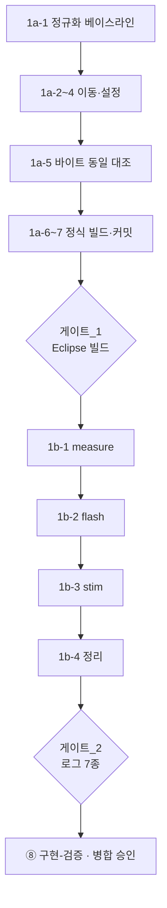

# 계획 - ble 폴더 개편

**TL;DR**: **5개 커밋**으로 나눈다 - 단계_1a(파일 이동, `-ffile-prefix-map` 으로 **`.elf` 바이트 동일 확증**) 이후 단계_1b 를 위험도 오름차순 3커밋(measure -> flash -> stim)으로 쪼개고, 마지막에 공유 상태 접근자를 정리한다. **각 커밋마다 CLI 빌드가 통과해야 다음으로 넘어간다.** 실기 게이트는 단계_1a 후 1회(Eclipse 빌드), 단계_1b 완료 후 1회(로그 7종)로 총 2회다.

## 1. 남은 판단 확정

| # | 판단 | **확정** | 근거 |
|---|---|---|---|
| 판단_1 | 0x66(646줄) 분해 수준 | **(나) 하위 명령 8개까지 함수 추출.** `en__allParameter`(401줄)의 데이터 인덱스 재분해는 **차기 작업으로 이월** | 3단 전부 분해는 라이브 상태 로직(근인_2)에 근접해 위험_4 가 커진다. 원칙_6(되돌릴 수 있는 크기) |
| 판단_2 | 정량 목표 | **파일당 900줄 이하 · 신규 추출 함수 250줄 이하**(`en__allParameter` 추출분 401줄은 예외로 명시) | 현재 2,196줄 -> 최대 796줄. 요구사항 결함_2 해소 |
| 판단_3 | 커밋 분할 | **1a -> 1b-1(measure) -> 1b-2(flash) -> 1b-3(stim) -> 1b-4(공유 상태 정리)** | 위험도 오름차순. 위험_7 |
| 판단_4 | `prev_subCommandData_Num_index` 대응 | **안_가 (접근자 함수)** | `tdc_ble_mapping_get_packet()` 로 확립된 기존 패턴 재사용 |

> [!NOTE]
> **판단_1 의 함의**: 이번 작업 후에도 `en__allParameter` 401줄 함수가 남는다. `fetch_packet` 1,724줄 -> 최대 401줄로 **76% 감소**하지만 근인_1 이 완전 해소되지는 않는다. 잔여분은 설계안 단계_3(디스크립터 테이블)이 흡수하는 것이 자연스럽다 - 데이터 인덱스 분기가 바로 그 대상이기 때문이다.

## 2. 단계_1a - 파일 이동

### 2.1 이동 대상

| 원본 | 이동 후 | `__FILE__` 영향 |
|---|---|---|
| `tdc_ble_communication.c/.h` | **루트 유지** | 없음 |
| `tdc_ble_protocol.h` | **루트 유지** (불가침) | - |
| `tdc_ble_remote.c/.h` | `remote/` | 있음 (`TDC_PRINTF_E` 7건) |
| `tdc_ble_remote_sp_para.c/.h` | `remote/` | 없음 |
| `tdc_ble_mapping.c/.h` | `mapping/` | 있음 (`TDC_PRINTF_E` 2건) |
| `tdc_ble_gain_control.c/.h` | `sound1/` | 없음 |
| `tdc_ble_general_debug.c/.h` | `sound1/` | 없음 |

**`system/` 폴더는 만들지 않는다** (분석 §3.1 - 넣을 파일 없음).

### 2.2 실행 순서

| # | 작업 | 명령·대상 |
|---|---|---|
| 1a-1 | **정규화 베이스라인 확보** | 이동 **전** 상태에서 `Debug/source/ble/subdir.mk` 에 `-ffile-prefix-map=../source/ble/=` 주입 -> clean 빌드 -> `.elf` md5 기록 -> 플래그 원복 |
| 1a-2 | 폴더 생성 + 이동 | `git mv` 로 10파일 (§2.1) |
| 1a-3 | `.cproject` 수정 | `:60-83` 컴파일러 `-I` 목록에 `source/ble/remote`·`source/ble/mapping`·`source/ble/sound1` **3줄 추가** (어셈블러 목록은 손대지 않음 - 분석 §2.2) |
| 1a-4 | `Debug/` 갱신 | 스크립트로 일괄: subdir.mk 20개에 `-I` 3개씩 추가 · 신규 subdir.mk 3개 생성 · `makefile` 3줄 · `sources.mk` SUBDIRS 3줄. **스크립트는 세션 임시 영역에 두고 커밋하지 않는다**(정본은 `.cproject`). 전문은 `구현-검증.md` 에 첨부 |
| 1a-5 | **정규화 대조 빌드** | 신규 3폴더 subdir.mk 에 각각 `-ffile-prefix-map=../source/ble/<폴더>/=` 주입 -> clean 빌드 -> md5 비교 -> 플래그 원복 |
| 1a-6 | 정식 빌드 | 플래그 없이 clean 빌드 -> 에러 0·경고 0 확인, 크기 증가분 실측 |
| 1a-7 | 커밋 | **`git diff .cproject` 로 추가된 `-I` 3줄 외 변경이 없음을 먼저 확인.** `git add` 는 `src/2__cm3/source/ble/**` + `.cproject` (Debug 는 gitignore) |

> [!IMPORTANT]
> **`Debug/` 수정분은 커밋되지 않는다**(gitignore). 정본은 `.cproject` 이며, 은수님이 Eclipse 에서 Clean+Build 하면 재생성된다. CLI 갱신은 **세션의 사전 검증 전용**이다.

### 2.3 수용 판정

| # | 기준 | 판정 방법 |
|---|---|---|
| 수용_1a_1 | 빌드 에러 0 · 경고 0 | 1a-6 출력 |
| **수용_1a_2** | **정규화 빌드 `.elf` md5 동일** | 1a-1 vs 1a-5 |
| 수용_1a_3 | 파일 히스토리 보존 | `git log --follow -- src/2__cm3/source/ble/mapping/tdc_ble_mapping.c` |
| 수용_1a_4 | 크기 증가가 `__FILE__` 문자열분으로 설명됨 | 1a-6 실측치 vs 예상(`mapping/` 8자 + `remote/` 7자 + 정렬) |
| 수용_1a_5 | Eclipse 빌드 성립 | **은수님 게이트_1** |

> [!CAUTION]
> **수용_1a_2 가 불일치하면 즉시 중단**하고 원인을 규명한다. 파일 내용을 한 글자도 바꾸지 않았으므로 불일치는 곧 **빌드 설정 오류**(include 순서·매크로 차이 등)를 뜻한다. 분석 결함_1(단일 파일 표본)이 현실화한 경우이므로 파일별로 좁혀 들어간다.

## 3. 단계_1b - 함수 추출

### 3.1 공통 설계

각 case 블록을 다음 형태의 static 함수로 추출한다.

```c
/* 개념 - 확정 시그니처는 커밋별로 입출력 계약표에서 확정 */
static void tdc_ble_map_<명령>(const uint8_t *Rx_dataPacket);
```

| 항목 | 방침 |
|---|---|
| 로직 | **연산 순서와 조건식은 바꾸지 않는다.** 들여쓰기 조정, `break` -> `return` 전환, §3.2 의 접근자 경유만 허용 |
| 파라미터 | `Rx_dataPacket` 은 명시 전달. 그 외 지역 변수는 각 함수 안으로 이동 |
| 반환 | 응답 송신까지 함수 안에서 완결하면 `void`. 상위에서 후처리가 필요하면 그 값만 반환 |
| 헤더 노출 | 신규 3파일의 함수는 **그룹 진입점 1개만** 헤더에 노출, 나머지는 파일 static |
| 명명 | `tdc_ble_map_<그룹>_<명령>` (제약_4) |

### 3.2 공유 상태 처리 (판단_4)

| 심볼 | 처리 |
|---|---|
| `mappingPacket` | 기존 `tdc_ble_mapping_get_packet()` 사용 (구현 확인이 **첫 작업** - 분석 결함_2) |
| **`prev_subCommandData_Num_index`** | `tdc_ble_mapping.c` 에 static 유지 + **접근자 2개 신설**: `int tdc_ble_mapping_get_seq_index(void)` / `void tdc_ble_mapping_set_seq_index(int)` |
| `writingStartSlot_index` | `map_flash.c` 로 이관 (flash 전용) |
| `max_C_uA` · `min_T_uA` | `map_stim.c` 로 이관 (stim 전용) |
| `stimulPara_index` | `map_flash.c` 로 이관 (flash 전용) |

> [!WARNING]
> **접근자 전환 시 대입 순서가 바뀌면 안 된다.** `prev_subCommandData_Num_index` 는 `!= prev + 1` 검사 직후 대입되는 패턴이 반복된다(`:352`->`:360` 등 23곳). 각 지점을 **읽기/쓰기로 분류한 표를 커밋 전에 작성**하고 1:1 대조한다.

### 3.3 커밋 1b-1 - measure 그룹 (최저 위험)

| 항목 | 값 |
|---|---|
| 대상 | 0x62(44줄)·0x63(30)·0x64(18) = 92줄 |
| 신규 | `mapping/tdc_ble_map_measure.c/.h` |
| 공유 상태 | **없음** (분석 §3.5 - measure 그룹은 어떤 static 도 안 씀) |
| 검증 | 빌드 + 디스어셈블 대조 + 입출력 계약표 |

가장 안전하므로 **추출 패턴을 여기서 확립**하고 이후 그룹에 적용한다.

### 3.4 커밋 1b-2 - flash 그룹

| 항목 | 값 |
|---|---|
| 대상 | 0x68·0x69·0x6A·0x6B·0x6C·0x6D·0x6E·0x6F·0x70·0x71 = 796줄 |
| 신규 | `mapping/tdc_ble_map_flash.c/.h` |
| 공유 상태 | `prev_subCommandData_Num_index` **15곳** (접근자 경유) · `stimulPara_index` 이관 · `writingStartSlot_index` 이관 |
| 검증 | 빌드 + 디스어셈블 + 계약표 + **읽기/쓰기 분류표 1:1 대조** |

### 3.5 커밋 1b-3 - stim 그룹 (최고 위험)

| 항목 | 값 |
|---|---|
| 대상 | 0x65(88줄)·0x66(646줄) = 734줄 |
| 신규 | `mapping/tdc_ble_map_stim.c/.h` |
| 내부 분해 | 0x66 의 하위 명령 **8개를 각각 static 함수로** (판단_1) |
| 공유 상태 | `prev_subCommandData_Num_index` **6곳** · `max_C_uA`/`min_T_uA` 이관 |
| 검증 | 위 전부 + **라이브 상태 전이 무변경 확인** |

> [!CAUTION]
> **`tdc_ble_mapping_step()` 은 건드리지 않는다.** 자극 FSM tick 구동(`isd/` 4종 호출)은 근인_3 소관이며 불가침_4(호출 순서·주기 불변)에 걸린다.

### 3.6 커밋 1b-4 - 정리

| 항목 | 내용 |
|---|---|
| 잔류 `tdc_ble_mapping.c` 정돈 | 0x60·0x61·0x67·0x91 + 디스패치 + `step` |
| 헤더 정리 | `tdc_ble_mapping.h` 의 외부 노출 심볼 불변 확인 (`isd/` 6파일·`hal/`·`sys/`·`main.c` 가 참조) |
| 최종 크기 대조 | `arm-none-eabi-size` |

### 3.7 수용 판정

| # | 기준 | 판정 방법 |
|---|---|---|
| 수용_1b_1 | 빌드 에러 0 · 경고 0 | 커밋마다 |
| 수용_1b_2 | 디스어셈블 대조 | **아래 판정 기준 4개** (`Debug/**/*.o.lst` 활용 - `-Wa,-adhlns` 로 이미 생성됨) |
| 수용_1b_3 | 입출력 계약표 | 커밋마다 문서 산출 |
| 수용_1b_4 | 브레이스·전처리 검산 | 추출 전후 `{`/`}` 개수, `#if`/`#endif` 깊이 대조 |
| 수용_1b_5 | **로그 7종 재현** | **은수님 게이트_2** |
| 수용_1b_6 | 크기 회귀 없음 | `size` 비교. 함수 호출 추가로 **소폭 증가는 정상** |
| 수용_1b_7 | 정량 목표 달성 | 파일당 900줄 이하, 신규 함수 250줄 이하(`en__allParameter` 예외) |

**수용_1b_2 판정 기준** (함수 추출은 구조가 반드시 달라지므로 "비교"만으로는 판정 불가)

| # | 확인 항목 | PASS 조건 |
|---|---|---|
| 기준_1 | 조건 분기 개수 | 추출 전 case 블록의 조건 분기(`b<cc>`) 총수 == 추출 후 함수 내 총수 |
| 기준_2 | 외부 함수 호출 | 호출 대상 심볼의 **종류와 순서** 동일. 신규 `bl <추출함수>`·접근자 호출은 **예외로 열거** |
| 기준_3 | 상수 리터럴 | 비교·대입에 쓰인 즉치값 집합 동일 |
| 기준_4 | 설명 불가 차이 | **0건** - 모든 차이가 "추출로 인한 예상 변화"로 분류돼야 한다 |

## 4. 은수님 게이트

| 게이트 | 시점 | 요청 내용 |
|---|---|---|
| **게이트_1** | 단계_1a 커밋 후 | **Eclipse Clean + Build.** `.cproject` 변경이 반영돼 신규 3폴더가 인식되는지 확인. 기대: 에러 0·경고 0, 크기 text 184,1xx (소폭 증가). **실기 불필요** (바이트 동일 확증 시) |
| **게이트_2** | 단계_1b 전체 후 | **실기 로그 7종 재현.** 연결 · 연결해제 · 임피던스 개별 · 임피던스 전체 · 특정자극 · 라이브모드 · 라이브모드+알람재생+볼륨변경. 기대: [`docs/참고/ble/매핑로그 - *.md`](../../../참고/ble/) 와 응답 바이트열·로그 문구 완전 일치 + **로그의 파일명 표시가 이전과 동일**(`__SHORT_FILE__` 이 basename 만 출력하므로 폴더 이동과 무관해야 함) |

> [!NOTE]
> 게이트_1 에서 Eclipse 가 `.cproject` 를 인식하지 못하면 **프로젝트 재-import** 가 필요할 수 있다(`.metadata` 캐시). 그 경우 절차를 별도 안내한다.

> [!IMPORTANT]
> **게이트_2 를 1회로 묶은 것은 트레이드오프다.** 커밋마다 실기하면 회귀 지점이 즉시 갈리지만 은수님 부담이 3배가 된다. 그 대가로 **중단_3(커밋 단위 이분 탐색)** 을 둔다 - 1b-1~1b-4 는 각각 독립 빌드가 가능하도록 설계돼 있어 되돌리며 좁힐 수 있다. 커밋마다 실기를 원하시면 게이트를 늘린다.

## 5. 일정·순서



## 6. 중단 조건

| # | 조건 | 조치 |
|---|---|---|
| 중단_1 | 수용_1a_2(바이트 동일) 불일치 | **즉시 중단**, 원인 규명 후 재계획 |
| 중단_2 | 디스어셈블 대조에서 설명 불가한 구조 차이 | 해당 커밋 되돌리고 추출 단위 축소 |
| 중단_3 | 게이트_2 에서 로그 불일치 | 해당 그룹 커밋 단위로 이분 탐색 |
| 중단_4 | 결함 발견 | **고치지 않는다**(원칙_4). `알려진 결함 목록.md` 에 추가만 |

## 7. 산출물

| 커밋 | 문서 |
|---|---|
| 1a | `구현-검증.md` §단계_1a (바이트 동일 증거) |
| 1b-1~3 | 그룹별 **입출력 계약표** + 읽기/쓰기 분류표 |
| 1b-4 | `구현-검증.md` 종합 |
| 전 구간 | `이력 및 결과.md` 갱신 |
