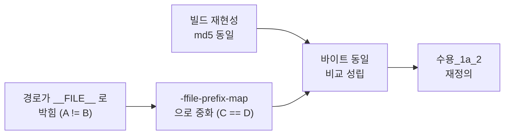

# 분석 검증 - ble 폴더 개편

**TL;DR**: 3축 검증 결과 **주장 20건 전부 실측 근거를 갖췄고**, 요구사항 단계의 미결 6건과 결함 3건이 모두 해소됐다. 검증 과정에서 **분석 초안의 라인 번호 오류 1건(0x66 하위 명령 +10 오차)과 누락 1건(함수 지역 static 4개)을 발견해 즉시 정정**했다. 정정 후 잔여 결함은 경미 2건이며 ⑤ 계획에서 처리한다.

## 1. 검증 축_1 - 지침 준수

| # | 지침 | 준수 | 근거 |
|---|---|---|---|
| 1 | 사실은 `파일:라인` 근거, 추측 금지 | O | 주장 20건 전부 라인 또는 실측 md5 제시 |
| 2 | 호출 경로·변수 사용처는 추정 금지, `Grep` 전수 확인 | O | `prev_subCommandData_Num_index` 23곳·`stimulPara_index` 등 전수 |
| 3 | HW·빌드 설정 변경 전 근거 확인 | O | `-ffile-prefix-map` 을 **실측 실험**으로 검증 (§1.3) |
| 4 | frontmatter + TL;DR | O | |
| 5 | 한글 라벨 (`판정_*`·`위험_*`·`미결_*`·`판단_*`) | O | |
| 6 | GitHub Alert 활용 | O | `[!IMPORTANT]`·`[!CAUTION]`·`[!WARNING]`·`[!NOTE]` |
| 7 | 코드 무변경 (③ 단계) | O | 실험용 `ble/probe/` 생성 후 **삭제 확인** |

**축_1 판정: PASS**

## 2. 검증 축_2 - 논리적 정합성

### 2.1 검증 전략의 논리 사슬

| 확인 | 결과 |
|---|---|
| 재현성 없이 바이트 동일 비교가 가능한가 | 불가능. §1.1 이 **선행 조건**을 먼저 확인한 것이 옳다 |
| A != B 만으로 "경로 때문"이라 단정 가능한가 | 단독으로는 불가. **C == D 가 반증 실험** 역할을 해 인과가 확정된다 |
| C == D 가 "코드가 동일하다"를 보장하는가 | 보장한다. 두 오브젝트가 바이트 동일이므로 코드·데이터·디버그 정보 전부 동일 |
| 실험이 `tdc_ble_mapping.c` 한 파일뿐인데 일반화 가능한가 | **부분적 한계** - 결함_1 참조 |

### 2.2 재분류의 타당성

| 확인 | 결과 |
|---|---|
| 0x6B 를 flash 로 넣는 근거 | `en__mapping_read_Mapdata_STIMUL_PARA` = "맵 프로그램 관리: 읽기 - 맵 데이터"(`tdc_ble_protocol.h:99`). 0x6D(쓰기)의 대응 명령이므로 같은 파일이 옳다 |
| 0x6E·0x6F·0x70·0x71 를 flash 로 | 삭제·복구 = 저장 계층 조작. `tdc_ble_protocol.h:104-109` |
| 0x67(deviceStatus)·0x91 를 잔류로 | 6줄·19줄로 작고 분류 그룹에 속하지 않음 |
| 재분류 후 파일 규모가 균등한가 | flash 796 · stim 734 · measure 92 · 잔류 약 540. **measure 가 과소**하나 명령 성격상 타당 |

### 2.3 자기 정합성

| 확인 | 결과 |
|---|---|
| §3.3 이 "0x66 통째로는 근인 미해소"라 하고 §6 판단_1 이 선택지로 남긴 것이 모순인가 | 모순 아님. 분석은 **사실과 함의**를 제시하고 선택은 ⑤ 계획·승인 소관 |
| §1.4 가 `-ffile-prefix-map` 상시 적용을 배제한 근거 | 범위 밖 + 로그 출력 영향 미확인. 타당 |
| §2.2 가 함정_1(어셈블러) 을 배제하면서 "빌드 실패 시 최우선 의심"으로 남긴 것 | **적절** - 배제 근거를 대되 안전망 유지 |

**축_2 판정: PASS**

## 3. 검증 축_3 - 근거 검증

### 3.1 실측 대조 결과

| # | 주장 | 검증 방법 | 판정 |
|---|---|---|---|
| 1 | 빌드 재현성 성립 | clean 후 2회 빌드, md5 `72025FA766AFDDF7E21F0EC29D3CAE64` 동일 | **확인** |
| 2 | 크기가 인수인계와 일치 | text 184,144 / data 4,668 / bss 21,804 | **확인** |
| 3 | 툴체인 10.2.1, `-ffile-prefix-map` 지원 | `--version`·`--help=common` | **확인** |
| 4 | `SHELL=cmd` 필수 | sh 로 실행 시 `-Dchess_storage(a)=` 괄호 파싱 에러 재현 | **확인** |
| 5 | `__FILE__` 활성 사용 | `tdc_printf.h:28`·`:36`, `TDC_PRINTF_INTERFACE`=SEGGER_RTT(`:19`), `ENABLE_ERROR`=1(`:21`) | **확인** |
| 6 | `TDC_PRINTF_E` 건수 (mapping 2·remote 7·comm 1·나머지 0) | `grep -c` | **확인** |
| 7 | A != B, +8바이트 | md5 `897D60B2…` vs `1576A2BA…` | **확인** |
| 8 | C == D | md5 `0454F23F…` 양쪽 동일 | **확인** |
| 9 | flat include 47건 | `grep -rn "include.*tdc_ble"` | **확인** |
| 10 | `.cproject` 컴파일러 `-I` = `:60-83`, ble = `:69` | 파일 직접 확인 | **확인** |
| 11 | 어셈블러 `-I` 에 SEGGER_RTT 만 (`:48-50`) | 동 | **확인** |
| 12 | `Debug/` gitignore | `git check-ignore -v` -> `src/2__cm3/.gitignore:2` | **확인** |
| 13 | subdir.mk 20개 전부 `-I ...ble` 보유 | `grep -rl` -> 20 / 전체 20 | **확인** |
| 14 | 0x30~0x36 이 `tdc_ble_communication.c` 내부 | `:59`·`:93`·`:113`·`:296`·`:317`·`:455` | **확인** |
| 15 | 최상위 case 19개와 각 시작 라인 | `awk` 전수 | **확인** |
| 16 | case 블록 합계 1,660 + 공통 64 = 1,724 | 라인 차 계산, `fetch_packet` 끝 `:1775` 확인 | **확인** |
| 17 | 명령 코드 대응 (0x72·0x90·0x91) | `tdc_ble_protocol.h:88-112` enum 연속값 | **확인** |
| 18 | 파일 static 2개 | `:24`·`:50` | **확인** |
| 19 | 함수 지역 static 4개 | `:58`·`:61`·`:72` | **확인 (정정 반영)** |
| 20 | `tdc_ble_map_*` 헤더명 미사용 | `find` -> 0건 | **확인** |

### 3.2 검증 중 발견해 정정한 사항

| # | 오류 | 정정 |
|---|---|---|
| 정정_1 | 0x66 하위 명령 라인 번호가 **전부 +10 오차** (351·752·758… ) | `sed` 상대 라인을 절대 라인으로 환산할 때 오프셋을 잘못 잡음. `awk` 절대 라인 실측으로 341·742·748·777·803·883·934·940 으로 정정 |
| 정정_2 | 하위 명령 "9종" | 실제 case 는 **8개**(주석의 "1~9" 와 불일치). 정정 |
| 정정_3 | "파일 static 2개"만 기술, **함수 지역 static 4개 누락** | §3.5 전면 보강. `prev_subCommandData_Num_index` 가 3그룹 공유임을 전수(23곳)로 확정하고 **최대 난점**으로 승격 |

> [!IMPORTANT]
> **정정_3 은 이 작업의 난도 평가를 바꾼다.** 설계안은 "`mappingPacket` 이 파일 경계를 넘음" 만 위험으로 적었으나, 실제로는 **연속성 검사 카운터가 잔류·stim·flash 3그룹에 걸쳐 공유**된다. 이를 모르고 분할했다면 멀티 패킷 명령(0x66 하위1·0x68·0x6C·0x6D)이 조용히 깨졌을 것이다.

**축_3 판정: PASS (정정 3건 반영 후)**

## 4. 잔여 결함

### 결함_1 (경미) - `-ffile-prefix-map` 중화 실험이 단일 파일 표본이다

§1.3 은 `tdc_ble_mapping.c` 하나로 검증했다. `tdc_ble_remote.c` 등 다른 이동 대상에서도 성립할 것으로 보이나(같은 컴파일러·같은 매크로 경로) **직접 확인하지는 않았다.**

**조치**: ⑦ 구현 시 **전체 빌드 단위로 `.elf` md5 를 비교**하므로 자동으로 커버된다. 만약 불일치하면 파일별로 원인을 좁힌다. ⑤ 계획의 검증 절차에 명시한다.

### 결함_2 (경미) - `mappingPacket` 접근자의 실제 반환 형태를 확인하지 않았다

§3.5 는 `tdc_ble_mapping_get_packet()`(`:45`)을 "접근자 기존재"로 기술했으나, 반환이 포인터인지 값 복사인지, 쓰기가 가능한지를 확인하지 않았다. 시그니처는 `ST__MAPPING_PACKET *tdc_ble_mapping_get_packet(void)` 로 **포인터 반환**임이 함수 목록에서 확인되나, 내부 구현(단순 `&mappingPacket` 반환인지)은 미확인이다.

**조치**: ⑦ 구현 착수 시 첫 확인 항목으로 둔다. 포인터 반환이므로 쓰기 접근이 가능할 가능성이 높다.

## 5. 판정

| 축 | 판정 |
|---|---|
| 축_1 지침 준수 | PASS |
| 축_2 논리 정합성 | PASS |
| 축_3 근거 검증 | PASS (정정 3건 반영) |

**종합: PASS** - 잔여 결함 2건은 모두 ⑦ 구현 시 자연히 확인되는 성격이라 ⑤ 계획으로 진행한다.
