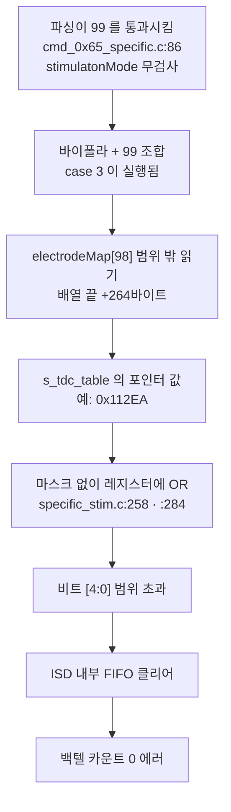

# 이력 및 결과 - 바이폴라 기준전극 99 · 0x65 경로 방어 (이월_D)

**상태**: **완료** - 구현 · 정적 검증 · 실기 확인 전부 통과 (2026-07-30).

**TL;DR**: 라이브(0x66) 경로가 2026-07-27 에 받은 **2중 방어**(전극번호 범위 검사 + 레지스터 `0x1F` 마스크)를 특정자극(0x65) 경로에 이식한다. 같은 결함·같은 전역인데 **한쪽만 고쳐진 비대칭**이 8개월 남아 있었다. 은수님 지적으로 직전 작업에서 확증했다.

> [!IMPORTANT]
> **이식이지 신규 설계가 아니다.** 두 경로는 구조가 동일하다 - `para_setting.c` 의 `case 8`(0~23) · `case 10`(24~31) 이 `specific_stim.c` 의 `case 5` · `case 7` 과 1:1 대응하며, **유일한 차이가 `0x1F &` 마스크의 유무**다. 범위 검사도 대입문 바로 앞에 같은 형태로 들어간다.

## 시계열 로그

### 2026-07-30

| 시각 | 단계 | 내용 |
|---|---|---|
| 선행 | 지적 | 은수님 - *"`tdc_isd_map_specific_stim_step()` 에도 전에 바이폴라 관련해서 인덱스 99 이슈가 있었잖아. 그게 여기 함수에도 있을텐데 확인 좀 해줘"* |
| 선행 | 확증 | 직전 작업(0x65 개명)의 [`구현-검증.md §3`](../20260730_ble-cmd-0x65-rename/구현-검증.md) 에 전수 조사 기록. 침범 대상 `s_tdc_table` 특정, 실기 로그값 교차 검증 |
| 선행 | 지시 | 은수님 - **"이월_D 지금 바로 진행해"** |
| 착수 | 브랜치 | `claude_feature_ble-cmd-0x65-rename` 에서 이어감 (§판단_1) |
| 착수 | **발견_1** | **인과 사슬의 뒷단이 이미 기록돼 있었다** (아래 §발견_1) |
| 착수 | 기준선 | `specific_stim.c` 594줄 · `if (` 21 · `else` 11 · `case` 19 · `for (` 12 · `0x1F` **0건**. text **184,908** |
| ① | 요구사항 | [`요구사항.md`](요구사항.md) - 요구사항 5건 · 제외 5건 · **HW 5게이트** · 완료 기준 7건 · 미결 3건 |
| ② | 요구사항 검증 | [`요구사항-검증.md`](요구사항-검증.md) - **조건부 PASS.** **HW 5게이트가 게이트_5 에서 미완결** - 불확실_3(커버리지 겹침)이 "변경의 충분성"에 관한 것이라 유일한 진짜 게이트로 판별. 불확실_1·2 는 "결함 발현 빈도·과거 인과"라 변경 금지 사유 아님. 결함 3건 발견 |
| ③ | 분석 | [`분석.md`](분석.md) - 두 경로 1:1 구조 대조, 이식 형태 결정(`continue` -> `if/else`), 커버리지 검산, 미결 3건 해소 |
| ④ | 분석 검증 | [`분석-검증.md`](분석-검증.md) - **PASS.** 인용 근거 **13건 자동 대조 일치**. 커버리지 검산으로 **5게이트 완결**(불확실_3 해소) |
| ⑤ | 계획 | [`계획.md`](계획.md) - 2커밋, 편집 전문 확정, 검증 11종, 실기 5항목 |
| ⑥ | 계획 검증 | [`계획-검증.md`](계획-검증.md) - **PASS.** 분기 증가분을 편집 전문에서 **손으로 세어 예측과 일치** 확인. 검증 절차 결함 2건 발견 -> ⑧ 에서 보강 |
| ⑥ 후 | 승인 | 은수님 "이월_D 지금 바로 진행해" 를 착수 지시로 해석 |
| ⑦ | 구현 | 방어 3곳 - `case 3` 범위 검사(주석 20줄 포함) + `case 5`·`case 7` 마스크. 594 -> **627줄** |
| ⑦ | **지표 오염 발견** | `grep -o "case "` 가 19->21 거짓 FAIL. **주석 안의 "case" 언급을 세고 있었다** (아래 §발견_2) |
| ⑧ | 구현 검증 | [`구현-검증.md`](구현-검증.md) - 검증_1~10 **전부 PASS**. 분기 증가분 **6개 지표 정확 일치**, text **184,908 -> 185,072 (+164B)** |
| ⑧ | **실기 통과** | 은수님 확인 - **"잘 동작해"**. 검증_11 **PASS**. 정상 바이폴라(기준전극 1~32)에서 `OUT OF RANGE` 로그 없이 자극 정상 -> **거짓 양성 배제 확증** |

## 완료 요약

**상태**: **완료** - 실기 확인까지 통과 (2026-07-30).

| 항목 | 결과 |
|---|---|
| 커밋 | `653173b`(방어 3곳) · `cf4883e`(문서) |
| 변경 | `case 3` 범위 검사 1블록 + `case 5`·`case 7` `0x1F` 마스크 2곳. 594 -> **627줄** |
| **불변량** | **정상 경로 불변 + 예측된 분기만 증가** - `case` 17 불변 · `if` +1 · `else` +1 · `for` 불변 · `\|\|` +3 · `&&` 불변 **6개 전부 일치** |
| 크기 | text **184,908 -> 185,072 (+164B)** - 감소가 아닌 증가 확인 |
| 호스트 테스트 | **301 PASS / 0 FAIL** |
| ARM 빌드 | 에러 0 · 경고 0 |
| 실기 | **통과** - 정상 바이폴라에서 `OUT OF RANGE` 없음 |
| 라이브 경로 | **무변경** (`para_setting.c`) |

### 실증 범위의 한계 (명시)

> [!IMPORTANT]
> **방어가 실제로 발동하는 경로는 미실증이다.** 바이폴라 + 기준전극 99 조합을 매핑 앱에서 만들 수 없어 확인하지 못했고, 호스트 테스트도 `isd/` 를 덮지 않는다.
>
> **확증된 것은 "정상 경로 무영향"까지**다. 방어 로직 자체의 정확성은 정적 검증(분기 6종 일치 · 마스크 정확 문자열 2건 · `0x1F & v == v` 손검산)에 의존한다.

### 이 작업에서 배운 것

> [!IMPORTANT]
> **검증 지표가 주석에 오염된다.** `grep -o "case "` 가 19 -> 21 로 거짓 FAIL 을 냈는데, 기준선 19 자체가 실제 레이블 17 + 주석 언급 2 였다. **구조 지표는 행 앵커(`^\s*`)로, 연산자는 주석 라인 제외로 재야 한다.** 이 프로젝트는 방어 코드에 경위를 길게 남기는 관례(라이브 11줄, 이번 20줄)라 특히 취약하며, 기존 작업들의 "분기 총수 보존"도 주석 증감이 없어 상쇄됐을 뿐이다.
>
> **불확실성을 "변경 금지 사유인가"로 분류하라.** HW 5게이트의 게이트_5 에서 불확실 3건이 남았는데, 셋을 같은 무게로 다뤘다면 착수하지 못했을 것이다. **"변경의 충분성"에 관한 것(커버리지)만이 진짜 게이트**이고, "결함 발현 빈도·과거 인과"는 정상 경로가 불변인 한 변경을 막지 않는다.
>
> **방어 추가의 실패 모드는 누락이 아니라 과잉이다.** 정적 지표는 과잉 차단을 못 잡는다. 실기 항목에 **"정상 입력에서 방어 로그가 뜨지 않을 것"** 을 명시한 것이 이를 덮었다.

### 발견_2 - 검증 지표가 주석에 오염된다 (2026-07-30)

> [!CAUTION]
> **문자열 카운트로 구조를 재면 주석이 지표를 움직인다.**

`grep -o "case "` 로 잰 첫 측정이 **19 -> 21** 로 나와 "case 불변" 예측을 위반했다. 원인은 코드가 아니라 **주석**이었다.

| 위치 | 내용 |
|---|---|
| `:210` (기존) | `// 1 + 6 = 7; case 7로 강제 설정한 뒤,` |
| `:456` (기존) | `// ... 별도의 case 문` |
| **`:238` (내가 추가)** | `* (case 5 - case 7 의 마스크 주석 참조).` <- **2건** |

**기준선 19 자체가 실제 `case` 레이블 17 + 주석 언급 2 였다.** 앵커 패턴(`^[[:space:]]*case `)으로 재면 **17 -> 17 불변**이다.

| 지표 | 잘못된 패턴 | 교정 | 결과 |
|---|---|---|---|
| `case` | `grep -o "case "` | `grep -cE "^[[:space:]]*case "` | **17 불변** |
| `if` | `grep -o "if ("` | `grep -cE "^[[:space:]]*if \("` | 21 -> 22 |
| `else` | `grep -o "else"` | `grep -cE "^[[:space:]]*else"` | 7 -> 8 |
| `\|\|` `&&` | 전체 라인 | 주석 라인(`^\s*[/*]`) 제외 | 0 -> 3, 0 불변 |

**이 프로젝트는 특히 취약하다** - 방어 코드에 경위를 길게 남기는 관례가 있다(라이브 경로 11줄, 이번 20줄). **이전 작업들의 "조건 분기 총수 보존" 검증도 같은 취약점을 갖는데, 주석 증감이 없어 오염이 상쇄됐을 뿐이다.** 앞으로 앵커 패턴을 기본으로 쓴다(이월_I).

## 판단

### 판단_1 - 새 브랜치가 아니라 현재 브랜치에서 이어간다

| 선택지 | 판단 |
|---|---|
| `claude_develop` 기준 새 브랜치 | **미채택** - 0x65 개명이 아직 병합 전이라 develop 에는 구 파일명이 있다. 문서가 `tdc_ble_cmd_0x65_specific.c:86` 을 참조하는데 그 파일이 없다 |
| **현재 브랜치에서 이어감** | **채택** - 파일명이 신 이름이라 참조 정합. **실기를 한 번에 볼 수 있다**(개명 4항목 + 결함 2항목) |

**개명의 `text` 불변량 검증은 커밋 `7f9c3dd` 시점에 이미 확정**됐으므로, 이후 커밋이 크기를 바꿔도 그 검증은 무효가 되지 않는다.

## 발견

### 발견_1 - 인과 사슬의 뒷단이 라이브 경로 주석에 이미 있었다 (2026-07-30)

직전 작업에서 **앞단**(쓰레기값의 출처 = `s_tdc_table` 의 포인터)을 확정했으나, `para_setting.c:471~473` TODO 가 *"쓰레기값이 BIPOLAR REF READ BACKTEL COUNT IS 0 의 직접 원인인지 미확정"* 이라 한 **뒷단**은 남아 있었다.

이식 원본을 읽다가 그 답이 **바로 그 파일의 주석**에 있는 것을 발견했다.

```c
// tdc_isd_stim_para_setting.c:576 (case 8) · :604 (case 10)
// 바이폴러 레퍼런스 전극 번호는 비트 [4:0] 범위, 범위 초과한 값 입력시
// FIFO 클리어 발생 -> 이후 백텔 카운트 0 에러 발생할 수 있음
w_isd_registerValue = w_isd_registerValue | (0x1F & bipolarReferenceElectrodeNum[i]);
```

**인과 사슬이 완성된다.**



| 구간 | 확정 근거 | 확정 시점 |
|---|---|---|
| A -> D (앞단) | 주소 계산 + 실기 로그값 `70378 = 0x112EA` 가 `.text` 범위 안 | 2026-07-30 (직전 작업) |
| E -> H (뒷단) | `para_setting.c:576` 주석 - 비트[4:0] 초과 시 FIFO 클리어 | **이미 기록돼 있었다** |

> [!IMPORTANT]
> **`para_setting.c:471~473` 의 TODO 는 사실상 해소 가능하다.** 앞단과 뒷단이 모두 확정됐으므로, 남은 것은 *"이 사슬이 실기에서 실제로 그 순서로 일어났는가"* 의 재현 확인뿐이다. TODO 문구를 갱신 대상으로 올린다.

**이 발견이 마스크의 중요도를 바꾼다.** 마스크는 "혹시 모를 상위 비트 오염 방지"가 아니라 **FIFO 클리어를 직접 막는 장치**다. 범위 검사만 넣고 마스크를 빼면, 다른 경로로 범위 밖 값이 들어왔을 때 같은 증상이 재발한다.
