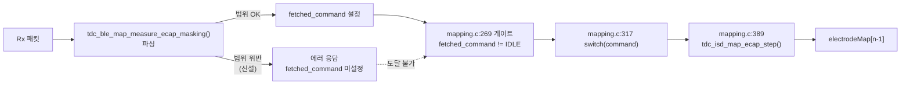

# 분석 - 0x63·0x64 eCAP 파싱 범위 검사

**TL;DR**: 0x63 의 14필드를 전수 조사해 **OOB 벡터는 2개 필드**(`stimulationElectrodeNum` · `measurementElectrodeNum`)로 확정했다. 대장이 위험으로 함께 묶었던 `bipolarReferenceElectrodeNum` 은 **인덱스가 아니라 루프 비교**여서 OOB 가 아니고, `maskerProbeInterval_numFrame` 은 **`isd/` 에 이미 검사가 있다**. 근거가 확실한 **9필드에 검사를 넣고 5필드는 잔여**로 남긴다.

## 1. 차단 기전 - 왜 파싱에서 막으면 끊기는가

파싱이 `fetched_command` 를 설정하지 않으면 `isd/` 에 **도달 자체를 못 한다**.



| 지점 | 근거 |
|---|---|
| 승격 게이트 | `tdc_ble_mapping.c:269` — `if (mappingPacket.fetched_command != en__mapping_IDLE)` |
| 승격 | `:273` — `mappingPacket.command = mappingPacket.fetched_command` |
| 디스패치 | `:317` — `switch (mappingPacket.command)` |
| 실행 | `:389` — `tdc_isd_map_ecap_step(mappingCommandStartFlag)` |

**이것이 0x62·0x65 가 쓰는 것과 같은 기전**이다. 새 기전을 만들지 않는다.

## 2. OOB 벡터 전수 - `electrodeMap[32]` 접근 4곳

`electrodeMap` 은 32원소다(`df_MaxNumOfElectrode` = 32, `tdc_stim_definitions.h:68`).

| 위치 | 인덱스 식 | 필드 | 판정 |
|---|---|---|---|
| `tdc_isd_map_ecap.c:688` | `electrodeMap[measurementElectrodeNum - 1] < 16` | `measurementElectrodeNum` | **OOB (읽기)** |
| `:749` | `w \| electrodeMap[measurementElectrodeNum - 1]` | 동 | **OOB (읽기 → 레지스터)** |
| `:906` | `w \| (electrodeMap[stimulationElectrodeNum - 1] << ...)` | `stimulationElectrodeNum` | **OOB (읽기 → 레지스터)** |
| `:1130` | 동 (프로브 경로) | 동 | **OOB (읽기 → 레지스터)** |
| `:465` · `:497` | `electrodeMap[bipolarFIFO_index]` | 루프 변수 | 안전 |
| `:469` · `:501` | `electrodeMap[31]` | 하드코딩 | 안전 |

**`uint8_t` 0~255 → 인덱스 -1~254.** 침범 대상은 대장 §2.2 에 실측돼 있다(`electrodeMap[254]` = `0x200084c8` = `s_manu_table` 내부).

### 발견_1 - `bipolarReferenceElectrodeNum` 은 OOB 가 아니다

대장 §2.2 와 인수인계 §4.2 는 이 필드를 위험군으로 함께 묶었으나, **0x63 경로에서는 배열 인덱스로 쓰이지 않는다.**

```c
// tdc_isd_map_ecap.c:461 (:494 도 동형)
if (bipolarFIFO_index == mappingPacket->eCapMeasurement.bipolarReferenceElectrodeNum - 1)
{
    w_isd_registerValue = ... | (electrodeMap[bipolarFIFO_index]);   // :465 - 인덱스는 루프 변수
}
else { ... electrodeMap[31] ... }                                     // :469 - 폴백
```

범위 밖 값이면 **조건이 영원히 불성립**해 `electrodeMap[31]` 폴백으로 떨어진다. 기능 오류이지 메모리 오류가 아니다.

> [!IMPORTANT]
> **0x65 와 다른 구조다.** 0x65 는 `tdc_isd_map_specific_stim.c:225` 에서 이 필드를 **직접 인덱스**로 썼기 때문에 99 가 `electrodeMap[98]` 이 됐다(이월_D). 0x63 은 그 구조가 아니다.
>
> 그래도 **검사는 넣는다** — 0x65 와 형태를 맞춰 99 예외까지 그대로 이식하면(제약_7) 필드 의미가 통일되고, 폴백이 조용히 발생하는 것보다 명시적 거부가 낫다.

### 발견_2 - `maskerProbeInterval_numFrame` 은 `isd/` 에 이미 검사가 있다

| 위치 | 검사 | 에러 코드 |
|---|---|---|
| `:355` | `< MinNumFrameForConfigProbe` | `en__MaskerProbe_InterVal_tooShort` |
| `:366` | `(numFramePerChannel << 1) + interval > 48` | `en__MaskerProbe_InterVal_tooLong` |

상한이 `numFramePerChannel`(런타임 값)에 의존하므로 **파싱 시점에는 판정할 수 없다.** 제약_3 에 따라 중복 검사를 넣지 않는다.

## 3. 필드별 범위 확정 - 0x63 (14필드)

> [!NOTE]
> **하한·상한은 반드시 `파일:라인` 에 귀속시킨다**(제약_2). 귀속 불가 필드는 검사하지 않는다.

| # | 필드 | 범위 | 근거 | 검사 |
|---|---|---|---|---|
| 1 | `iterationNum` | 1 ~ 255 | 0x62 `tdc_ble_map_measure.c:27~28` | **O** |
| 2 | `pulseWidth` | 13 ~ 255 | **`FPGA_pulsePhaseWidth_minimum`=13** (`board/FPGA_ver2_7_0.h:133`) — `isd:935`·`:1160` 이 이 상수를 빼므로 미만이면 언더플로. 0x65 `:55~56` 과 동값 | **O** |
| 3 | `firstPulsePhase` | 0 ~ 1 | 0x65 `:62~63` | **O** |
| 4 | `stimulatonMode` | 1 ~ 6 | **`EN___STIMULATION_MODE`** (`cfx_link/tdc_shm.h:67~76`) — `en__referenceNA`(0) 제외한 실모드 전체. 0x65 `:69~70` 과 동값 | **O** |
| 5 | **`stimulationElectrodeNum`** | **1 ~ 32** | **`int electrodeMap[32]`** (`board/electrodeMapping.c:3`) + `df_MaxNumOfElectrode`(`tdc_stim_definitions.h:68`) + 0x65 `:76~77` | **O (OOB 차단)** |
| 6 | `bipolarReferenceElectrodeNum` | 1 ~ 32 **또는 99** | 0x65 `:83~90` (99 예외 포함) | **O** |
| 7 | **`measurementElectrodeNum`** | **1 ~ 32** | `int electrodeMap[32]`(`electrodeMapping.c:3`) + `df_MaxNumOfElectrode` | **O (OOB 차단)** |
| 8 | `stimulationLevel_uA_masker` | 불확실 | 0x65 는 0~1800, 0x62 는 1~1024 — eCAP 기준 불명 | X |
| 9 | `stimulationLevel_uA_probe` | 불확실 | 동 | X |
| 10 | `maskerProbeInterval_numFrame` | 런타임 의존 | `isd/` 에 검사 존재 (발견_2) | X |
| 11 | `adcPreampGain` | 불확실 | `:701` 이 `<< 8` 인데 주석은 `[3:0]` — **불일치** | X |
| 12 | `adcSamplingFreq` | 0 ~ 7 | `:730~733` · `:764~767` 이 **3비트**만 내줌 | **O** |
| 13 | `adcMeasurementDelay` | 0 ~ 15 | `:680~681` 이 **4비트** + 주석 `[3:0]` | **O** |
| 14 | `measurementSampleNum` | 상한 무의미 | `:660~661` 이 8비트 = `uint8_t` 전 범위. 하한 근거 없음 | X |

**검사 9블록 · 잔여 5필드.**

### 비트폭 도출 근거 (필드 12·13)

```c
// :730~735  adcSamplingFreq 는 3비트
w_isd_registerValue = w_isd_registerValue << 3;
w_isd_registerValue = w_isd_registerValue | ...adcSamplingFreq;
w_isd_registerValue = w_isd_registerValue << 2;      // 여기서 밀리므로 3비트가 상한

// :680~681  adcMeasurementDelay 는 4비트
w_isd_registerValue = w_isd_registerValue << 4;
w_isd_registerValue = w_isd_registerValue | ...adcMeasurementDelay;  // 주석: 딜레이 [3:0]
```

**바이폴라 99 결함의 뒷단과 같은 실패 유형이다** — 비트폭 초과가 인접 필드를 오염시킨다. 그쪽은 `0x1F` 마스크로 막았고(`tdc_isd_map_specific_stim.c:258`·`:284`), 이쪽은 파싱 거부로 막는다.

> [!CAUTION]
> **필드 11 `adcPreampGain` 은 넣지 않는다.** `:701` 코드는 `<< 8`(8비트)인데 주석은 `[3:0]`(4비트)이고, 주석 문구 자체가 *"측정 갯수 [3:0]"* 로 **다른 필드(`measurementSampleNum`)의 라벨이 복사된 흔적**이다. 코드와 주석 중 어느 쪽이 ISD 스펙인지 확정할 근거가 이 repo 안에 없다. 추측으로 4비트를 박으면 정상 입력을 막을 수 있다(노하우_5). **잔여로 남긴다.**

## 4. 필드별 범위 확정 - 0x64 (7필드)

0x64 는 `firstPulsePhase` · probe · adc\* · interval · sampleNum 을 **파싱하지 않는다**(`tdc_ble_map_measure.c:93~113`). 매핑 패킷은 전역이고 초기화 시점이 없으므로 **실기에서는 직전 0x63 의 값이 잔류한다.**

> [!NOTE]
> `test_map_measure.c:222~225` 가 이 잔류를 시험하는 것처럼 읽히지만 **그렇지 않다** — `stub_reset()` 이 패킷을 통째로 0 으로 밀기 때문에(`stub_ble.c:40`) 잔류 상황이 만들어지지 않는다. 잔류는 파싱 코드로부터의 추론이며, 검사 대상을 «파싱하는 7필드» 로 한정한 근거도 그 테스트가 아니라 파싱 코드다 ([`계획-검증.md` 결함_3](계획-검증.md)).

| # | 필드 | 범위 | 검사 |
|---|---|---|---|
| 1 | `iterationNum` | 1 ~ 255 | **O** |
| 2 | `pulseWidth` | 13 ~ 255 | **O** |
| 3 | `stimulatonMode` | 1 ~ 6 | **O** |
| 4 | **`stimulationElectrodeNum`** | **1 ~ 32** | **O (OOB 차단)** |
| 5 | `bipolarReferenceElectrodeNum` | 1 ~ 32 또는 99 | **O** |
| 6 | **`measurementElectrodeNum`** | **1 ~ 32** | **O (OOB 차단)** |
| 7 | `stimulationLevel_uA_masker` | 불확실 | X |

**검사 6블록 · 잔여 1필드.**

0x64 는 실행부가 주석(`mapping.c:403`)이라 현재 무해하지만, 위험_2 의 *"주석 푸는 순간 동급"* 조건을 **선제 제거**한다.

## 5. 코드 형태 선택 - 0x65 의 평탄 방식

같은 파일의 0x62 는 **5중 중첩 `if`** 다(`:27~53`).

| 방식 | 0x62 (중첩) | 0x65 (평탄 + 플래그) |
|---|---|---|
| 구조 | 성공 시 가장 안쪽에서 `return` | `dataRangeError` 플래그 + 말미 `if/else` |
| 5필드 | 5중 중첩 | 5블록 |
| **9필드** | **9중 중첩** | 9블록 |

**0x65 방식을 택한다.** 9중 중첩은 이 프로젝트의 가독성 기준(*"사람이 눈으로 보고 관리하기 쉬운가"*)에 정면으로 어긋난다. 0x62 는 **손대지 않는다** — 동작하는 코드이고 이 작업 범위 밖이다.

## 6. 부작용 검토

| 항목 | 판정 |
|---|---|
| 정상 경로 비트 등가 | **등가.** 유효 범위 값은 검사를 통과해 기존과 동일 대입 |
| `isd/` 영향 | 없음. 파싱 통과값만 도달하므로 기존 동작 유지 |
| 에러 응답 규약 | 기존 사용. `tdc_sys_error.h` 는 `:5` 에 이미 include |
| 0x64 미파싱 필드 잔류 동작 | 불변. 검사는 파싱하는 필드에만 |
| 크기 | 증가 예상. 0x65 8블록이 58줄 → 9+6=15블록이면 유사 비율 |
| 테스트 | `test_map_measure.c:196` 단언이 **반드시 깨진다**(의도) + `adcSamplingFreq = 12` 정정 필요 |

## 7. 잔여 위험 (이번 작업으로 해소되지 않음)

| # | 내용 | 후속 |
|---|---|---|
| 잔여_1 | `stimulationLevel_uA_masker` · `_probe` 범위 미확정 | eCAP 자극 크기 상한을 은수님/스펙에서 확인 후 |
| 잔여_2 | `adcPreampGain` 코드-주석 불일치 (`<< 8` vs `[3:0]`) | ISD 데이터시트 대조 필요 |
| 잔여_3 | `measurementSampleNum` 하한 근거 없음 | 0 이 정상인지 확인 필요 |
| 잔여_4 | 위험_3 impedance 마스크 비대칭 | 별건 (대장 §2.4) |
| 잔여_5 | 0x63 실행 경로 존치 여부 | 은수님 판단 사안 |
