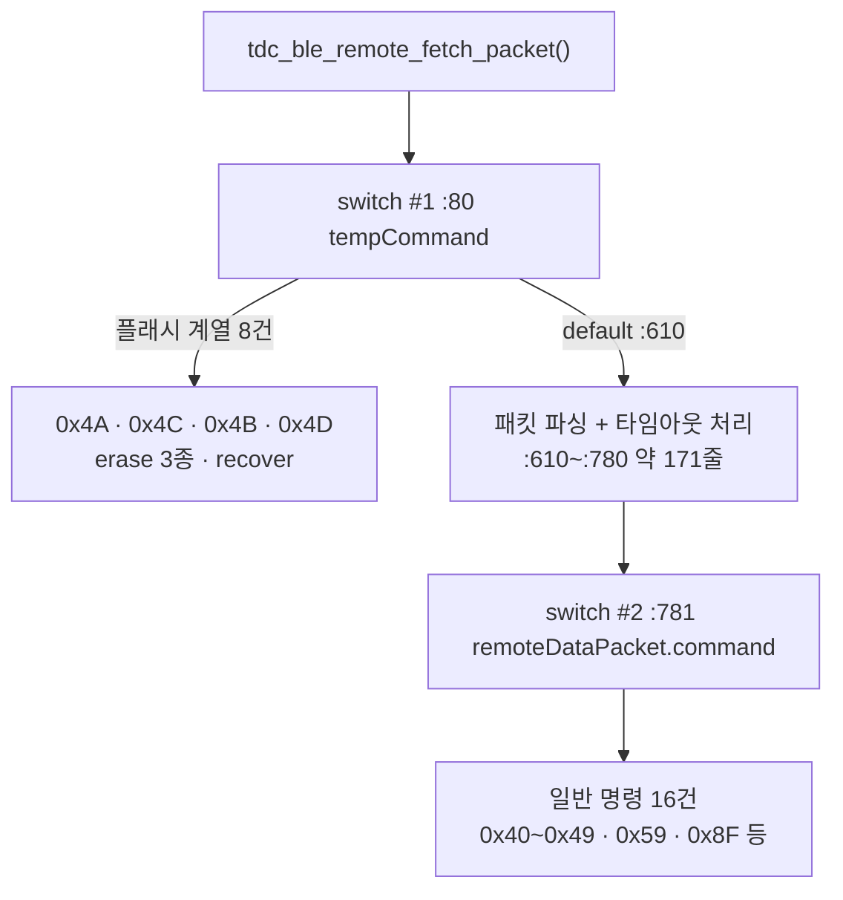

# 요구사항 - 이월_2 리모콘 0x40~0x59 분해

**TL;DR**: `tdc_ble_remote_fetch_packet()` 이 **1,340줄 단일 함수**(`:51`~`:1390`)로, `ble/` 에 남은 최대 부채다. 단계_1b 가 매핑 쪽 `fetch_packet`(1,724줄)에 한 것과 **같은 방식**(명령별 함수 추출 + 계층 네이밍)을 적용한다. 최대 위험은 **함수 지역 `static` 5개**의 호출 간 상태 유지이며, 단계_1b 의 접근자 패턴을 그대로 쓴다.

## 1. 배경

이월_2 는 단계_3(`20260729_ble-descriptor-table`)의 **발견_3** 에서 등록됐다. 명령 카탈로그를 함수 기준으로 재작성하자 미분해 그룹이 드러났다.

> 리모콘 0x40~0x59 는 전부 `tdc_ble_remote_fetch_packet()`(약 1,340줄) 안, Ezairo 0x33~0x36 은 전부 `setting_nrf_ble_adv_info()`(183줄) 안 - **다음 분해 후보**.

매핑 쪽은 단계_1a·1b 로 `tdc_ble_mapping.c` 2,196 → 664줄, `fetch_packet` 1,724줄 → 디스패치만 남는 상태가 됐다. **리모콘은 그 처리를 받지 않았다.**

## 2. 현황 실측 (2026-08-05)

| 항목 | 값 |
|---|---|
| `tdc_ble_remote.c` | **1,390줄** (67,231 B) |
| `tdc_ble_remote_fetch_packet()` | `:51`~`:1390` = **약 1,340줄** |
| 나머지 함수 4개 | `:29`~`:50` = 22줄 (passkey 3 + clear_command 1) |
| `switch` | **9개** (최대 4중 중첩) |
| `case` (행 앵커) | **65개** |
| `if` / `else` / `for` | 56 / 40 / 17 |
| `break` | 66 |
| **함수 지역 `static`** | **5개** |
| `__LINE__` | 24곳 |
| `tdc_ble_reply_*` 호출 | 50곳 |

### 2.1 구조 - 이중 switch

**바깥 switch 는 «플래시 접근이 필요한 명령» 을 먼저 걸러내고, 나머지를 `default` 에서 파싱한 뒤 두 번째 switch 로 보낸다.** 같은 명령(0x4A~0x4D 등)이 **양쪽 switch 에 모두 등장**한다(두 번째는 응답·에러 처리용으로 보인다 - 분석에서 확정).

### 2.2 최대 위험 - 함수 지역 `static` 5개

| 위치 | 변수 | 사용 | 성격 |
|---|---|---|---|
| `:53` | `prev_subCommandData_Num_index` | 11회 | 데이터 인덱스 연속성 |
| `:54` | `stimulPara_index` | 16회 | 자극 파라미터 누적 인덱스 |
| `:641` | `noCommandTime_counter` | - | 무명령 타임아웃 |
| `:642` | `prev_remotegCommand` | 3회 | 직전 명령 |
| `:643` | `disconnectionCounter` | - | 연결 해제 카운터 |

파일 수준에도 `:49` `writingStartSlot_index`(3회)가 있다.

> [!CAUTION]
> **단계_1b 가 똑같은 함정에 빠질 뻔했다.** 당시 설계안이 함수 지역 `static` 4개를 인지하지 못했고, `prev_subCommandData_Num_index` 가 3그룹 23곳에 공유돼 있었다. **접근자 2개로 노출하고 읽기/쓰기 분류표를 어셈블리 호출 수와 1:1 대조**해서 해결했다.
>
> 리모콘은 그때보다 `static` 이 **더 많다**(4 → 5+1). 같은 방식이 필요하며, 분해로 함수가 갈리는 순간 이 상태들이 **각 함수의 지역 static 으로 쪼개지면 동작이 깨진다.**

## 3. 목표

| # | 목표 |
|---|---|
| 목표_1 | `tdc_ble_remote_fetch_packet()` 을 **명령별 함수로 분해**하고 본체는 디스패치만 남긴다 |
| 목표_2 | 계층 네이밍 적용 - `tdc_ble_cmd_0xNN[_subMM]_<이름>` (불가침 규약) |
| 목표_3 | 함수 지역 `static` 을 **접근자로 노출**해 분해 후에도 단일 인스턴스를 유지한다 |
| 목표_4 | **동작 무변경.** 조건 분기 총수 보존을 불변량으로 삼는다 |
| 목표_5 | 명령 카탈로그의 리모콘 항목을 **함수 기준**으로 갱신한다 |

## 4. 범위

### 4.1 포함

| 대상 | 내용 |
|---|---|
| `ble/remote/tdc_ble_remote.c` | 함수 분해 · 계층 네이밍 · `static` 접근자화 |
| `ble/remote/tdc_ble_remote.h` | 접근자 선언 |
| 신규 파일 | 명령 그룹별 분할 (분석에서 확정) |
| `docs/참고/ble/프로토콜/명령 카탈로그.md` | 리모콘 소스 참조 갱신 |

### 4.2 제외

| 대상 | 이유 |
|---|---|
| 리모콘 패스키 인증 비활성(`:698`) | **보안 결정 사안** - 별도 이월. 이번 분해에서 코드는 옮기되 로직 무변경 |
| 0x51·0x53·0x58 핸들러 부재 | 별도 이월 (실사용 확인 선행) |
| `tdc_ble_remote_sp_para.c` (263줄) | 이미 분리돼 있다 |
| Ezairo 0x33~0x36 `setting_nrf_ble_adv_info()` | 별건 (같은 발견_3 이지만 다른 파일) |
| 범위 검사 추가·결함 수정 | **구조 변경과 섞지 않는다** (단계_0 원칙) |

## 5. 제약

| # | 제약 |
|---|---|
| 제약_1 | **동작 무변경.** 파싱 순서·상태 전이·응답 바이트가 모두 같아야 한다 |
| 제약_2 | **`static` 단일 인스턴스 유지.** 분해로 복제되면 즉시 결함 |
| 제약_3 | 계층 네이밍 규약 준수 (`tdc_ble_cmd_0xNN_...`) |
| 제약_4 | **테이블 주도 금지** (불가침) |
| 제약_5 | CP949 금지 문자 (`—` `–` `≈` `µ` `►`, 추가로 `«` `»`) |
| 제약_6 | 은수님 미커밋 파일 미포함 |
| 제약_7 | **`.elf` 바이트 동일은 성립하지 않는다.** 함수 추출은 인라인·레지스터 할당을 바꾼다 (단계_1b 에서 확정) |

## 6. 수용 기준

| # | 기준 | 확인 방법 |
|---|---|---|
| 수용_1 | `tdc_ble_remote_fetch_packet()` 이 디스패치만 남는다 | 줄 수 측정 |
| 수용_2 | **조건 분기 총수 보존** (`case`·`if`·`else`·`for`·`\|\|`·`&&`) | 행 앵커 패턴 (이월_I 대응) |
| 수용_3 | `static` 이 단일 인스턴스로 남는다 | 선언 위치 + 접근자 호출 수 대조 |
| 수용_4 | `tdc_ble_reply_*` 호출 50곳 보존 | 호출 수 대조 |
| 수용_5 | ARM 빌드 에러 0 · 경고 0 | `make` |
| 수용_6 | 호스트 테스트 회귀 없음 | `run.sh` (현재 리모콘 커버리지 0 - §7) |
| 수용_7 | **실기 통과** | 은수님 |

## 7. 검증 게이트의 특수성

> [!IMPORTANT]
> **리모콘은 호스트 테스트 커버리지가 0 이다.** `tests/unit/run.sh` 가 컴파일하는 `src/` 파일 4개는 전부 `ble/mapping/` 과 `ble/tdc_ble_reply.c` 이며 `ble/remote/` 는 없다.
>
> 따라서 이 작업은 **정적 지표 + 실기**로 검증해야 한다. 0x63 eCAP 과 반대 상황이다 - 그쪽은 앱이 안 보내 실기가 불가했고, 이쪽은 **실사용 기능이라 실기가 가능하다.**
>
> 단계_3 이 «테스트 선행» 으로 안전망을 깐 것처럼, **리모콘 파싱 테스트를 먼저 추가할지**를 계획에서 판단한다. 1,340줄을 테스트 없이 분해하는 것은 단계_3 이 명시적으로 권하지 않은 방식이다.
