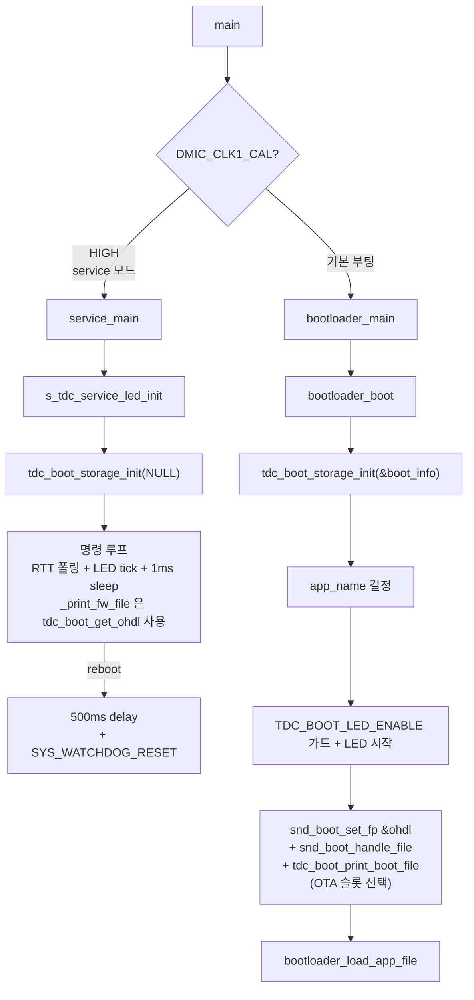

# service 모드 RTT 디버그 콘솔 — 분석

**TL;DR**: 부트로더는 이미 SEGGER_RTT 모듈·`rtt_getch()`·storage init 시퀀스를 모두 갖춤. service는 NVM/FATFS init 누락만 해소하면 됨. storage init 추출 경계 = NVMInit ~ `snd_boot_handle_file` ~ `tdc_boot_print_boot_file` (LED 가드·app_name 결정 제외). 헬퍼 함수명 = `tdc_boot_storage_init()`. RTT down 0 채널은 SEGGER_RTT lazy init이 default 16B 버퍼로 자동 할당 → 별도 설정 불필요. `--quit` 후 service 동작은 무한 LED tick fallback. 사이즈 추정 ~90 B 감소.

작성일: 2026-05-07
Rev: Rev.4 (2026-05-07, 사용자 피드백 4차 반영 — service 는 OTA 슬롯 처리 불필요라 `snd_boot_*`/`tdc_boot_print_boot_file` 호출 안 함. `tdc_boot_get_ohdl()` getter 는 service 의 `_print_fw_file` 이 부트로더 `ohdl` 재사용용으로만 사용 — 별도 fp 변수 폐기. 부트로더는 `&ohdl` 직접 사용)
Rev.3 (2026-05-07, 사용자 피드백 3차 반영 — 결정_2 헬퍼 책임 축소: `snd_boot_set_fp`/`snd_boot_handle_file`/`tdc_boot_print_boot_file` 헬퍼 외부 (OTA DFU 영역) + `tdc_boot_get_ohdl()` getter 신설)
Rev.2 (2026-05-07, 사용자 피드백 2차 반영 — 결정_5 `SYS_WATCHDOG_RESET()` 직접 호출 + 500 ms 사전 delay (RTT flush), 결정_7 line_terminator `\n` 확정)
Rev.1 (2026-05-07, 사용자 피드백 반영 — 결정_5 `reboot` 명령 = 워치독 리셋, §9 결정 사항 요약에 명령어 셋 추가)
Rev.0 (2026-05-07, 초안)

---

## 1. 영향 범위

| 파일 | 변경 성격 | 라인 영향 |
|---|---|---|
| [`bootloader.c`](../../../../src/0__bootloader/source/bootloader.c) | 헬퍼 추출 + `bootloader_boot()` 단순화 + `tdc_boot_debug_mode()` 호출 삭제 | ~210줄 이동 + ~1줄 삭제 |
| [`ci_boot.c`](../../../../src/0__bootloader/source/bootmgr/ci_boot.c) | 디버그 모드 4개 함수 + private 변수 삭제 | ~140줄 삭제 |
| [`ci_boot.h`](../../../../src/0__bootloader/include/bootmgr/ci_boot.h) | `tdc_boot_debug_mode` 선언 삭제, `tdc_boot_storage_init` 추가 | -1줄 / +1줄 |
| [`service.c`](../../../../src/0__bootloader/source/service/service.c) | LED 루프 → storage init + RTT 콘솔 + LED tick | ~120줄 추가 |
| [`service.h`](../../../../src/0__bootloader/include/service/service.h) | 변경 없음 (기존 선언 유지) | 0 |

---

## 2. 결정 사항

### 2.1 결정_1 — 헬퍼 위치

storage init 헬퍼는 [`bootloader.c`](../../../../src/0__bootloader/source/bootloader.c)의 기존 정적 변수(`fsmount`, `dir`, `ohdl`, `_data_temp_buffer`)를 사용하므로 **bootloader.c 내부에 정의**. 헤더는 [`ci_boot.h`](../../../../src/0__bootloader/include/bootmgr/ci_boot.h)에 외부 선언 추가 (service.c가 include 하기 위함).

| 대안 | 평가 |
|---|---|
| **선택**: bootloader.c 정의, ci_boot.h 선언 | 정적 변수 가시성 그대로, 추가 파일 없음 (사이즈 최소) |
| 반려: 별도 파일 `tdc_boot_storage.c/h` | 정적 변수 인계가 복잡 + 파일 추가 오버헤드 |

### 2.2 결정_2 — 헬퍼 함수명·시그니처

```c
/**
 * @brief NVM·FATFS 초기화 + boot status 파일 처리 (부트로더·service 공통)
 * @param[out] out_boot_info 부트로더 부팅 시 사용할 boot info (NULL 가능 — service에서)
 * @return 0 성공, < 0 실패 (bootloader_error에 코드 기록)
 */
int tdc_boot_storage_init(bootloader_boot_information *out_boot_info);
```

추출 범위 = [`bootloader.c`](../../../../src/0__bootloader/source/bootloader.c) `bootloader_boot()` 의 다음 시퀀스:

| 순서 | 동작 | 헬퍼 포함 |
|---|---|---|
| 1 | `bootloader_error = BOOTLOADER_EXIT_STATUS_CODE(0)` | ✅ |
| 2 | `NVMInit()` | ✅ |
| 3 | `bootloader_read_nvm_boot_info()` | ✅ |
| 4 | boot speed 분기 (AUTO/SSPI/DSPI/QSPI) + boot_info 재read | ✅ |
| 5 | `app_number` 처리 + `app_name` 결정 | ❌ `bootloader_boot()`에 남김 (service 불필요) |
| 6 | `bootloader_load_manu_table()` | ✅ |
| 7 | `TDC_BOOT_LED_ENABLE` 가드 + LED 시작 | ❌ `bootloader_boot()`에 남김 (§2.3) |
| 8 | `tdc_uart_init()` 재초기화 | ✅ |
| 9 | `f_mount()` | ✅ |
| 10 | `f_chdrive()` | ✅ |
| 11 | `f_opendir() + f_closedir()` | ✅ |
| 12 | `NVMSync()` | ✅ |
| 13 | `snd_boot_set_fp(&ohdl)` | ❌ `bootloader_boot()` 에 남김 — OTA DFU 이미지 슬롯 선택. **service 는 호출 안 함** (Rev.4 사용자 확정 — service 는 슬롯 처리 자체 불필요) |
| 14 | `snd_boot_handle_file()` | ❌ 동일 — 슬롯 결정 + 부팅 상태 파일 처리. service 미호출 |
| 15 | `tdc_boot_print_boot_file()` | ❌ 동일 — 슬롯 정보 디버그 출력. service 미호출 |

추출 후 `bootloader_boot()`은:

```c
int bootloader_boot(void)
{
    int                          ret;
    bootloader_boot_information  boot_info;
    char                         app_name[20];

    ret = tdc_boot_storage_init(&boot_info);
    if (ret < 0) return ret;

    /* app_name 결정 (5번 — 부트로더 전용) */
    uint32_t app_number = *((uint32_t *) SYSVAR_BOOT_APPN);
    if (app_number == 0) {
        ret = get_app_load_ext(&boot_info, app_name);
        if (ret <= 0) return -1;
    } else {
        // MANIFEST_<n>.TXT 빌드 (기존 로직)
    }

#if TDC_BOOT_LED_ENABLE
    /* 7번 — LED 가드 (부트로더 전용) */
    if (Sys_GPIO_Read(DIO_NUM_UART_ENABLE) != DIO_ACTIVE_LEVEL_UART_ENABLE) {
        tdc_boot_led_init();
        tdc_boot_led_start();
    }
#endif

    /* 13~15번 — OTA DFU 이미지 슬롯 선택 (bootloader_load_app_file 직전 의무) */
    snd_boot_set_fp(&ohdl);
    snd_boot_handle_file();
    tdc_boot_print_boot_file();

    return bootloader_load_app_file(app_name);
}
```

> **세부 (Rev.4 사용자 확정)**:
> - 헬퍼 내부 변수 = `uint32_t buf[128]`, `NVMCTRL_Options_t options`, `bootloader_boot_information *boot_info = (bootloader_boot_information *)buf` 모두 로컬 (헬퍼 외부 안 씀).
> - 함수 끝에서 `out_boot_info != NULL` 시 `memcpy(out_boot_info, boot_info, sizeof(bootloader_boot_information))`. service 는 NULL 전달.
> - **`tdc_boot_get_ohdl(void)` getter** 신설 (`bootloader.c` 정의, `ci_boot.h` 선언) — **service.c 의 `_print_fw_file` 이 부트로더 정적 변수 `ohdl` 을 그대로 재사용** (별도 fp 변수 안 만듦, 사이즈 절약).
> - 부트로더 자신은 `bootloader.c` 안의 정적 변수에 직접 접근하므로 `snd_boot_set_fp(&ohdl)` 직접 사용 (getter 불필요).
> - `snd_boot_set_fp` / `snd_boot_handle_file` / `tdc_boot_print_boot_file` 는 OTA DFU 이미지 슬롯 선택 로직 — **`bootloader_boot()` 에서만 호출** (`bootloader_load_app_file()` 직전). **service 는 슬롯 처리 자체 불필요라 3 함수 모두 호출 안 함**.
> - `ci_boot.h` 가 `bootloader_boot_information` 타입 + `FIL *` 타입을 알아야 하므로 필요한 헤더 의존 정리 (`bootloader_internal.h` / `ff.h` 등 — 구현 Step 1 시 fine-tune).

### 2.3 결정_3 — LED 가드는 헬퍼 제외

[`bootloader.c`](../../../../src/0__bootloader/source/bootloader.c)의 `TDC_BOOT_LED_ENABLE` 가드 부분은 부트로더 부팅 분기에만 의미가 있음 (service는 별도 LED 동작). 헬퍼에 포함시키면 service 측 LED tick과 충돌 가능 → **헬퍼에서 제외, `bootloader_boot()`에 남김**.

### 2.4 결정_4 — UART 재init은 헬퍼 포함

[`bootloader.c`](../../../../src/0__bootloader/source/bootloader.c) `tdc_uart_init()` 재초기화는 `Sys_Trims_SetOperatingFrequency()` 후 baud rate 재계산 목적. service에서도 클럭 변경 후 (load_manu_table 안에서) UART 핀 사용 가능성 있으므로 헬퍼에 포함 유지. 출력 사용 안 해도 무관.

### 2.5 결정_5 — `reboot` 명령 후 동작 = `SYS_WATCHDOG_RESET()` + 500 ms 사전 delay (Rev.2 사용자 피드백)

| 옵션 | 평가 |
|---|---|
| 반려: 무한 루프 (LED tick만 계속) | 사용자가 보드 전원을 끄지 않으면 회복 불가, 디버깅 후 자연스러운 재진입 불가 |
| 반려: `SYS_WATCHDOG_REFRESH()` 중단 + timeout 대기 | timeout 시간 비결정적 (워치독 설정에 따라 수백 ms ~ 수 sec). reset 발생 시점 불명확. RTT 메시지 flush 보장 어려움 |
| **선택**: `SYS_WATCHDOG_RESET()` 직접 호출 + 500 ms 사전 delay | 500 ms 동안 RTT 출력 버퍼 flush 보장 (사용자 명시 요구) → 즉시 reset trigger → timing 결정적. CM3 코드 4곳([`main.c:731`](../../../../src/2__cm3/Cortex-M3-src/main.c), [`mappingControl.c:1971,2177`](../../../../src/2__cm3/Cortex-M3-src/BleCommunication/mappingControl.c) 등)에서 강제 리셋용 사용 사례 확인 |
| 반려: `NVIC_SystemReset()` 직접 호출 | 동일 효과지만 watchdog 메커니즘 통일성 측면에서 SDK watchdog reset 우선 |
| 반려: 디버그 명령 루프 재진입 | `reboot` 의미 없어짐 |

#### 처리 시퀀스

```c
rtt_printf("[SERVICE] reboot requested. Resetting in 500ms...\r\n");
/* 500 ms 동안 LED tick + watchdog refresh 유지 → RTT 출력 버퍼 flush 보장 */
for (int i = 0; i < 500; i++) {
    SYS_WATCHDOG_REFRESH();
    s_tdc_service_led_tick();
    tdc_delay_ms(1);
}
SYS_WATCHDOG_RESET();   /* 즉시 HW reset → main() 재진입 */
while (1) { ; }         /* unreachable, 안전망 */
```

> **500 ms delay 의도** (사용자 명시 요구): `reboot` 명령 직전 출력 중이던 hex 덤프 등 RTT 메시지가 auto-rtt-viewer 호스트에 모두 도달하도록 buffer flush 시간 확보. SEGGER_RTT 는 host polling 기반(기본 100 ms 간격, [auto-rtt-viewer 사용법](../../../../../auto-rtt-viewer/docs/사용방법/사용법.md))이라 펌웨어가 즉시 reset 되면 마지막 chunk 가 손실 가능.

> **`SYS_WATCHDOG_RESET()` 부트로더 가용성**: CM3 측 사용 사례는 확인됨 (위 4 곳). 부트로더는 동일 SDK 헤더(`hw.h` 등)를 include 하므로 가용 추정. 미가용 시 fallback = `NVIC_SystemReset()` 또는 watchdog refresh 중단. **구현 Step 3 빌드 시 검증** (미해결 이슈로 등재).

> **service 무한 reboot 우려 회피**: 워치독 리셋으로 재부팅되면 `main()`이 다시 시작 → `DIO_NUM_DMIC_CLK1_CAL` 핀 검사 → 사용자가 그 사이 핀을 LOW로 바꿔놓았다면 일반 부팅, HIGH 유지면 service 재진입. 무한 reboot 은 사용자가 핀을 안 바꾼 경우인데 그건 의도된 동작 (service 모드를 다시 원하는 것).

### 2.6 결정_6 — RTT down 채널 설정

SEGGER_RTT의 lazy init (`_DoInit`)이 첫 호출 시 default control block 구성. down channel 0은 SEGGER_RTT_Conf.h의 `BUFFER_SIZE_DOWN`(보통 16B)로 자동 할당. 명시 `SEGGER_RTT_ConfigDownBuffer` 호출 불필요.

부트로더가 이미 `rtt_printf`를 다수 호출하므로 service 진입 시점에는 lazy init이 완료. 별도 처리 없음. 단, 구현 검증 단계에서 auto-rtt-viewer 로그 `down[0]=0x...(16B)` 표시 확인.

### 2.7 결정_7 — 명령 라인 터미네이터 = `\n` 확정 (Rev.2 사용자 확정)

auto-rtt-viewer 의 `write.line_terminator` = `\n` (사용자 확정 2026-05-07). 펌웨어 파서(`if (ch == '\n')`)와 일치. 별도 처리 불필요. service.c 코드의 `if (ch == '\r') continue;` 는 안전장치로 유지 (다른 도구로 입력 시 호환).

### 2.8 결정_8 — LED tick 메커니즘

부트로더에는 정밀 ms tick 카운터가 없음 (`tdc_delay_ms()`만 존재). 옵션:

| 옵션 | 평가 |
|---|---|
| 옵션 1: `tdc_delay_ms` 슬립 + 카운트 | 단순, 정확도 낮음 |
| 옵션 2: SysTick 기반 ms 카운터 신설 | 정확하지만 코드 추가 |
| **선택**: 옵션 3 — 단순 iteration 카운트 | 1 iter ≈ 1 ms (sleep 1ms 포함), 380 iter마다 색 변환. 가장 작은 코드 |

```c
static uint32_t s_tdc_service_led_iter = 0;
static uint8_t  s_tdc_service_led_color = 0;
#define TDC_SERVICE_LED_TICK_ITER 380

static void s_tdc_service_led_tick(void)
{
    if (++s_tdc_service_led_iter >= TDC_SERVICE_LED_TICK_ITER)
    {
        s_tdc_service_led_iter = 0;
        s_tdc_service_led_color = (s_tdc_service_led_color + 1) & 0x07;
        Sys_GPIO_Write(DIO_NUM_LED_R_UART_TX_E8300, !((s_tdc_service_led_color >> 0) & 0x01));
        Sys_GPIO_Write(DIO_NUM_LED_G_UART_RX_E8300, !((s_tdc_service_led_color >> 1) & 0x01));
        Sys_GPIO_Write(DIO_NUM_LED_B,               !((s_tdc_service_led_color >> 2) & 0x01));
    }
}
```

`tdc_delay_ms(1)`을 명령 루프 매 iteration 끝에 호출 → 사이클 1ms 보장. `_print_fw_file` 안에서도 LED tick 호출 → 큰 파일 출력 중에도 색 변환 유지.

---

## 3. 호출 흐름 (변경 후)



---

## 4. service 모드 진입 경로 정합성

[`main.c`](../../../../src/0__bootloader/main.c) 분기 점검:

```
main():
    Sys_DIO_Config(...)           DIO 초기화
    SWJ-DP, DEMCR(SEGGER RTT 활성)
    NVIC disable + clear
    DIO_NUM_QCC_*, DIO_NUM_UART_ENABLE 설정
    DIO_NUM_DMIC_CLK1_CAL 풀업 설정
    tdc_uart_set_enable + tdc_uart_init + tdc_uart_printf("\r\n\n\n")
    if DIO_NUM_DMIC_CLK1_CAL == ACTIVE: service_main()
    else: bootloader_main()
```

확인:

| 항목 | 결과 |
|---|---|
| SEGGER_RTT 활성화 (`CoreDebug->DEMCR` TRCENA) | ✅ main에서 이미 수행 → service에서 활용 가능 |
| NVIC 정리 | ✅ → service 폴링 동작 영향 없음 |
| `tdc_uart_init` 호출 | ✅ → UART 출력 가능 (사용 안 해도 무관) |
| NVMInit, f_mount 등 storage init | ⚠️ main에서 미수행 → service에서 직접 호출 필요 (= 본 작업) |

---

## 5. 부트로더 회귀 가능성 점검

| 회귀 시나리오 | 평가 |
|---|---|
| storage init 추출로 인한 동작 변경 | 추출 코드 그대로 이동 시 동일 (잘라내기·붙여넣기). 정적 변수 위치 변경 없음 → 영향 없음 |
| `tdc_boot_debug_mode()` 호출 삭제 | `CI_BOOT_COUNT_DOWN_SEC=0`이라 카운트다운 즉시 통과 + `\n` 미입력 시 디버그 모드 미진입. 기존 부팅 시퀀스에서 디버그 모드는 사실상 미사용 → 영향 없음 |
| 4개 함수·private 변수 삭제 | 외부 호출 없는 정적 함수 4개 + 정적 변수 — bootloader.c와 무관 |
| `boot_info` out 파라미터 도입 | 헬퍼가 boot_info를 외부로 전달, `bootloader_boot()`이 받아 `app_name` 결정에 사용. 기존 흐름 동일 |

---

## 6. 코드 사이즈 영향 추정

| 항목 | 사이즈 변화 |
|---|---|
| 부트로더 디버그 모드 4개 함수 삭제 | ~-300 B |
| storage init 헬퍼 추출 (코드 동일, 호출 wrapper 1개) | +4 B (BL 명령) |
| service.c RTT 디버그 콘솔 + LED tick 추가 | +200 B |
| storage init 헬퍼 호출 (service.c) | +4 B |
| **순 변화** | **~-90 B (감소)** |

추정치라 실측 필요 (Step 4). 수용_6의 100바이트 마진 충분.

---

## 7. RTT down 채널 검증

부트로더에서 RTT 사용 흔적:

- `rtt_printf` (up 0) — 다수 호출 ([`bootloader.c`](../../../../src/0__bootloader/source/bootloader.c), [`ci_boot.c`](../../../../src/0__bootloader/source/bootmgr/ci_boot.c))
- `rtt_getch` (down 0) — [`rtt_printf.c`](../../../../src/0__bootloader/source/segger_rtt/rtt_printf.c)에 정의되어 있으나 **부트로더 내 호출처는 0개** (cm3의 `tdc_ui_command.c`에서만 `SEGGER_RTT_Read` 사용)

→ 부트로더에서 down 0 사용은 처음. SEGGER_RTT lazy init이 default config block을 만들 때 down 0도 함께 alloc하므로 동작 보장.

검증 포인트 (구현 Step 3):

- auto-rtt-viewer 시작 시 로그 `down[0]=0x...(16B)` 표시 확인
- RTT down 0에서 `SEGGER_RTT_Read`의 반환값이 0~1 (블로킹 안 됨)

---

## 8. 위험 재평가 (요구사항 §6 대응)

| 위험 ID | 재평가 결과 |
|---|---|
| 위험_1 (RTT down 채널 미설정) | 해소 — lazy init이 default 16B 버퍼 alloc (§2.6) |
| 위험_2 (line_terminator 호환) | ✅ 해소 — `\n` 확정 (사용자 확정 2026-05-07). 안전장치 `\r` 무시 코드 service.c 에 유지 |
| 위험_3 (storage init 회귀) | 낮음 — 코드 이동만 (§5) |
| 위험_4 (service 미초기화 변수) | 무관 — service는 부팅 안 함 |
| 위험_5 (RTT down 16B overflow) | 낮음 — 명령어 최대 10자(`--print=mf`) |
| 위험_6 (사이즈) | 측정 필요, 추정상 감소 (§6) |

---

## 9. 구현계획 진입 시 결정 사항 요약

| 항목 | 결정 |
|---|---|
| 헬퍼 함수 | `tdc_boot_storage_init(bootloader_boot_information *out_boot_info)` + `tdc_boot_get_ohdl()` getter |
| 추출 경계 | NVMInit ~ NVMSync (LED 가드·app_name 결정·OTA 슬롯 선택[`snd_boot_*`/`tdc_boot_print_boot_file`] 모두 헬퍼 외부) |
| OTA 슬롯 선택 | `snd_boot_set_fp(&ohdl) + snd_boot_handle_file + tdc_boot_print_boot_file` — **부트로더만** 호출 (`bootloader_load_app_file()` 직전, `&ohdl` 직접). service 는 호출 안 함 (Rev.4) |
| `tdc_boot_get_ohdl()` 사용처 | service 의 `_print_fw_file` 이 `f_open`/`f_read`/`f_close` 시 부트로더 `ohdl` 재사용 (별도 fp 변수 폐기). 부트로더 자신은 `&ohdl` 직접 사용 (정적 변수 같은 파일) |
| 명령어 셋 | 5개: `manifest`, `app0`, `app1`, `app2`, `reboot` (요구사항 §4 수용_1~3) |
| `reboot` 명령 후 동작 | 500 ms 사전 delay (RTT flush 보장) → `SYS_WATCHDOG_RESET()` 직접 호출 → 즉시 HW reset → `main()` 재진입 |
| LED tick | iteration 카운트 기반 (380 iter ≈ 380 ms) |
| RTT down 0 | lazy init 의존, 별도 설정 없음 |
| line_terminator | `\n` 확정 (사용자 확정 2026-05-07). 안전장치로 `\r` 무시 코드 service.c 에 유지 |

---

## 자체 검토

### 지침 준수 여부

| 지침 | 준수 |
|---|---|
| `문서 작성 규칙.md` §9.1 frontmatter 5필드 | ✅ |
| `문서 작성 규칙.md` §9.2 TL;DR 80~250자 | ✅ |
| `문서 작성 규칙.md` §6.5 한글 라벨 + _번호 | ✅ (결정_1~8, 위험_1~6) |
| `문서 작성 규칙.md` §6.3 다이어그램 = Mermaid | ✅ (§3) |
| `네이밍 컨벤션` `tdc_` prefix | ✅ (`tdc_boot_storage_init`, `s_tdc_service_*`) |

### 논리적 정합성

| 점검 | 결과 |
|---|---|
| 요구사항의 결정사항 3개가 분석에 모두 반영 | ✅ |
| 추출 경계가 service 모드 동작에 영향 없는지 검증 | ✅ (§5) |
| 사이즈 추정이 수용_6 (100B 이내) 충족 | ✅ (§6) |
| RTT down 0 lazy init 가정의 근거 제시 | ✅ (§7) — 구현 단계 측정 검증 |
| `--quit` 후 동작 결정 (요구사항 미해결 이슈) | ✅ (§2.5 결정_5) |

### 미해결 이슈

| 이슈 | 처리 |
|---|---|
| ~~auto-rtt-viewer profile line_terminator 실값~~ | ✅ Rev.2 해소 — `\n` 확정 (사용자) |
| 사이즈 실측 | 구현 Step 4 binary 비교 |
| `_print_fw_file`에서 `ohdl` 재사용 vs 별도 fp | 구현 시점 미세 결정 (사이즈 영향 무시 가능) |
| `SYS_WATCHDOG_RESET()` 부트로더 빌드 가용성 | 구현 Step 3 빌드 시 검증. 미가용 시 fallback = `NVIC_SystemReset()` |
