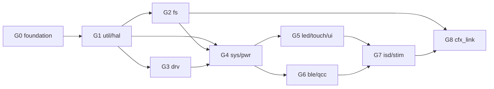

# 계획 — 2__cm3 전면 리팩토링

**TL;DR**: 루트 지침(네이밍 컨벤션 · 구현 패턴 · 밸리데이션 계층화)을 2__cm3 에 구체화한 **표준 5종**을 정의하고, **게이트 9단(G0 foundation → G8 공유 메모리 결합부)**으로 구현한다. 각 게이트 = 은수님 빌드 · 실기 확인 1회. 위험 최대(ISD 매핑 5대 FSM)는 G7 후반 배치. rename 보류 = 공유 ABI 심볼(타입 19 + 필드 105) + 복제 헤더 교차 심볼(G0 에서 전수 산출).

---

## 1. 분석-검증 위임 8건 반영

| # | 위임 | 반영 위치 |
|---|---|---|
| 1 | 네이밍 컨벤션 | §2 표준_1 |
| 2 | 폴더 재편안 | §3 표준_2 |
| 3 | FSM 표준 패턴 | §4 표준_3 |
| 4 | 파일 처리 표준 | §5 표준_4 |
| 5 | 로그 태그 정책 | §6 표준_5 |
| 6 | 복제 헤더 drift 방침 | §7 |
| 7 | 모듈 순서 · 게이트 · 검증 라벨 | §8 · §9 |
| 8 | 라이브러리 예외 목록 | §2.4 (승인 항목) |

---

## 2. 표준_1 — 네이밍 (루트 `코딩/네이밍 컨벤션.md` 준수)

**은수님 질의("`tdc_isd_` 로 가던지, 더 좋은 방향 제시")에 대한 답**: 루트 컨벤션이 이미 정확히 그 체계다 — `tdc_<모듈>_<동작>()`. 별도 발명 없이 **루트 컨벤션 그대로 + 도메인(모듈) 약어표만 확정**하는 것이 최선이다. 추가 제안 1건: MCU 내부 페리페럴용 역할 표식 `tdc_hal_` 신설(§2.2, 루트 지침 §역할 표식의 확장 절차 준수).

### 2.1 심볼 규칙 (루트 컨벤션 요약 + 2__cm3 대응)

| 종류 | 규칙 | 현행 → 예 |
|---|---|---|
| public 함수 | `tdc_<모듈>_<동작>()` | `isd_interface()` → `tdc_isd_process()` |
| **static 함수** | **접두어 불필요** (루트 지침 명시) | `gd_handle_touch_debug()` → `handle_touch_debug()` 유지 가능 — 오타 · 모호 약어만 정정 |
| extern 전역 | `g_tdc_<모듈>_<이름>` | `ISD_ConnectionHistory` → `g_tdc_isd_connection_history` |
| static 전역(파일) | `s_tdc_<이름>` | `s_snd_batt_state` → `s_tdc_battery_state` |
| static 지역(함수) | `s_<이름>` | 기존 세션 관례와 동일 |
| 타입 | `tdc_<이름>_t` | `ST__ISD_STATUS` → `tdc_isd_status_t` / `EN__SND_BATT_STATE` → `tdc_battery_state_t` |
| 매크로/enum 값 | `TDC_<모듈>_<이름>` | `df_Connected` → `TDC_CONN_STATE_CONNECTED` (단 §7 보류 검사 선행) |
| 파일 | `tdc_<모듈>[_<역할>].c/.h` | `batteryNPowerControl.c` → `tdc_pwr_battery.c` |
| 명확성 | 오타 · 모호 약어 정정 | `conneded`→`connected` · `Resgister`→`register` · `Defalut`→`default` · `dirver`→(파일명 정정) |

### 2.2 도메인(모듈) 약어표 (승인 대상)

| 도메인 | 접두어 | 현행 소스 |
|---|---|---|
| 시스템 제어 | `tdc_sys_` | systemControl.c · initialize.c · error.c |
| 전원/배터리/충전 | `tdc_pwr_` | batteryNPowerControl.c · ci_battery.c · ci_power.c |
| LED | `tdc_led_` | LedOutput.c (led_* 기존 함수 흡수) |
| 터치 | `tdc_touch_` | 기존 유지 (최근 정비 완료) |
| ISD (내부기) | `tdc_isd_` | isd_interface*.c 계열 전부 |
| BLE 통신 | `tdc_ble_` | remoteControl.c · mappingControl.c · ble_communication.c |
| QCC | `tdc_qcc_` | snd_qcc.c · QCC/ |
| 파일시스템 | `tdc_fs_` | ci_filesystem.c · ci_map.c · ci_stim_mute.c · ci_event_log.c |
| 부트 연동 | `tdc_boot_` | ci_boot.c |
| DFU/OTA | `tdc_dfu_` | ci_ota.c |
| UI 커맨드 | `tdc_ui_` | 기존 유지 |
| 자극 파라미터 | `tdc_stim_` | stimulationParaCal.c · indicatorByStimul.c |
| 공유 메모리 | `tdc_shm_` | cfx_cm3_sharedMemory.c (함수만 — 타입/필드는 보류 §7) |
| CFX 원격 명령 | `tdc_cfx_` | fn_fromCFX/ |
| MCU 페리페럴 (**신설 표식**) | `tdc_hal_<periph>_` | driver_SPI · driver_i2c · driver_timmer · ci_uart · ci_dio · ci_timer 등. **승인 시 루트 `지침/코딩/네이밍 컨벤션.md` §역할 표식에 행 추가**(rules repo 별도 커밋 — 지침의 확장 절차) |
| 외부 칩 드라이버 (기존 표식) | `tdc_drv_<chip>_` | driver_MIS2DH · driver_MAX17262 · driver_REN_ISL* · (IQS323 은 기존 `tdc_touch_iqs323` → `tdc_drv_iqs323` 정합 여부 G5 판단) |
| 범용 유틸 | `tdc_util_` / `tdc_crc_` / `tdc_fft_` / `tdc_printf_` | ci_util · ci_crc · ci_fft · ci_printf |

### 2.3 rename 보류 (불가침)

1. **공유 ABI**: `cfx_cm3_sharedMemory.h` 타입 19 + 필드 105 (③ §7 확정) — 헤더에 "공유 ABI, 단독 rename 금지" 주석
2. **복제 헤더 교차 심볼**: `processorDirective.h` · `definitionsForAlgorithm.h` 의 심볼 중 CFX/calibration 복제본에도 존재하는 것 — **G0 에서 스크립트 전수 산출 후 보류 목록 동결**
3. **SDK 심볼**: `Sys_*` · `SYS_*` · `hw.h` 계열 (ON Semi SDK 제공, 2__cm3 정의 아님 — census 가 정의 기준이라 자동 제외됨)

### 2.4 라이브러리 예외 (승인 대상)

| 대상 | 판정 |
|---|---|
| `SEGGER_RTT/` | 예외 확정 (은수님 지시) |
| `tiny-AES-c/` | **예외 제안** — vendored 서드파티, bootloader 와 동일 사본 |

---

## 3. 표준_2 — 폴더 재편안 (승인 대상)

원칙: **G0 는 골격 생성 + 루트 잔여물 처분만, 실제 이동은 각 게이트에서 해당 도메인만** (게이트 자기완결성 — Eclipse `.cproject` 파급을 게이트당 1회 빌드로 즉시 검증).

| 신규 | 이입 대상 (현행) |
|---|---|
| `app/` | main.c/.h (이동만, 내용 불변 — 일관성 패스 제외) |
| `sys/` | Cortex-M3-src/systemControl{systemControl, initialize, error} + 루트 `systemControl/`(shared_Memory_Addr 등) 통합 |
| `pwr/` | batteryNPowerControl · ci_battery · ci_power |
| `led/` · `touch/` · `ui/` | LedOutput / tdc_touch* / Gen1_5/ui |
| `isd/` | internalDevice/ 전부 + `isdExecution/`(dirver_PCM.h) 흡수 |
| `ble/` | BleCommunication/ + QCC/ |
| `stim/` | Cortex-M3-src/signalProcessing + 루트 `signalProcessing/` 통합 |
| `fs/` | Gen1_5/FS |
| `boot/` · `dfu/` | ci_boot / Gen1_5/dfu |
| `cfx_link/` | fn_fromCFX + cfx_cm3_sharedMemory (공유 결합부) |
| `hal/` | Gen1_5/common 의 페리페럴 계열 + driver_SPI/i2c/timmer |
| `drv/` | 외부 칩 드라이버 (MIS2DH · MAX17262 · REN_ISL* 등) |
| `lib/` | SEGGER_RTT · tiny-AES-c (원형 유지) |
| `board/` | 99_includeBoard (구 보드 3종 처분은 G0 판단) · DIO_PIN_Config |
| `config/` | processorDirective.h(→ `tdc_config.h`, 보류 심볼 동결 후) · 99_eeprom_address.h(→ `fs/` 또는 `config/`) · 99_errorCode.h(**삭제 후보** — 포함 0, 내용은 문서로 이전) |

---

## 4. 표준_3 — FSM 패턴 (루트 `코딩/구현 패턴.md` 구체화)

```c
/* 상태: 명시 enum */
typedef enum { TDC_<MOD>_ST_IDLE = 0, TDC_<MOD>_ST_..., } tdc_<mod>_state_t;

/* 상태 데이터: ctx 구조체 - 나체 static 산개 금지, 초기값은 designated initializer 로 명시 */
typedef struct {
    tdc_<mod>_state_t state;
    int               counter_xx;   /* 원본 초기값 승계 명시 (ISD 카운터 2000 교훈) */
} tdc_<mod>_ctx_t;

/* 단일 step: 매 tick 1회, 즉시 반환. 입력은 인자, 출력은 반환/out 파라미터 */
tdc_<mod>_result_t tdc_<mod>_step(const tdc_<mod>_input_t *in);

/* 상태별 처리는 static 핸들러로 분리, 부수효과는 전이 시점에만 */
static tdc_<mod>_state_t handle_<state>(tdc_<mod>_ctx_t *ctx, const tdc_<mod>_input_t *in);

/* 현재 상태 조회 (디버깅 가시화) */
tdc_<mod>_state_t tdc_<mod>_get_state(void);
```

- 적용 대상: ③ §4 의 FSM 인스턴스 (플래그+분기 누적형 암묵 상태머신 → 명시 FSM)
- **예외** (루트 지침): 1-shot · 순수 계산 · 단순 getter 는 FSM 화하지 않음 — 과도 추상화 금지
- systemControl 은 흡수된 선행 설계(핸들러 시그니처 · 초기값 대조표)를 이 템플릿에 맞춰 이행
- `step()` 은 유닛 후보 (밸리데이션 계층화 §7.1) — 게이트 설계 노트의 유닛맵에 등재

## 5. 표준_4 — 파일 처리 (`ci_stim_mute` 패턴 승격)

```c
/* 레코드 규약: magic_begin + version + size + payload + magic_end + crc16, all-or-nothing */
typedef struct { ... } tdc_fs_record_hdr_t;

bool tdc_fs_record_load(const char *path, void *payload, size_t size, const void *defaults);
bool tdc_fs_record_store(const char *path, const void *payload, size_t size);
```

- 실패 경로 전부 기본값 캐시로 폴백(즉시 재기록), 부분 손상 불가
- 소비자 이관: `ci_map` · `ci_event_log` · `ci_boot`(status file) · `ci_ota` — **이관 = 저장 포맷 변경일 수 있음 → 동작 보존 위반 위험. 포맷이 바뀌는 소비자는 G2 에서 개별 식별해 "구 포맷 읽기 호환" 또는 "별도 작업 분리"를 판단** (기기 내 기존 데이터 마이그레이션 문제)
- `fn_fromCFX` 는 공유 프로토콜 결합 — G8 에서 API 계층만 정리, 프로토콜 불변

## 6. 표준_5 — 로그 태그 정책

태그 문자열(55종, 도메인명 기반) **유지** — rename 과 독립, 외부 파서 호환 자동 보존. 로그 본문의 심볼명 인용만 추종 갱신. (③ §8 확정)

## 7. 복제 헤더 drift 방침

G0 에서 스크립트로 `processorDirective.h` · `definitionsForAlgorithm.h` × (CFX · calibration 복제본) 교차 심볼을 전수 산출 → **교차 존재 심볼은 보류 목록 동결**(공유 ABI 와 동급), 2__cm3 전용 심볼만 rename. 3벌 동시 rename 은 별도 작업 후보로 기록만.

---

## 8. 게이트 구성 (G0~G8) — "A 는 B 통과 전제"

각 게이트 착수 시 **게이트 설계 노트**(대상 파일 매핑 · 유닛/모듈 맵 · 검증 라벨 체크) 1건 작성 → 구현 → 정적 검증 → **은수님 빌드 + 실기 확인** → `claude_develop` 병합 → 다음 게이트.

| 게이트 | 범위 | 주요 작업 | 전제 |
|---|---|---|---|
| **G0** foundation | 루트 헤더 3종 · 골격 폴더 · 컨벤션 문서 | 보류 목록 동결(§7) · 99_errorCode.h 처분 · 오타 파일명 정정 · 공유 ABI 주석 · `tdc_convention.md`(소스 트리 내 규약 문서) | — |
| **G1** util/hal | Gen1_5/common · crc | `ci_*` 유틸 → `tdc_hal_*`/`tdc_util_*` | G0 |
| **G2** fs | Gen1_5/FS | `tdc_fs_record` 도입 + 소비자 이관 판단(§5) | G1 |
| **G3** drv | driver_* · dirver_* | `tdc_drv_<chip>_` · `tdc_hal_<periph>_` 분류 이관 | G1 |
| **G4** sys/pwr | systemControl · initialize · error · battery/power | **systemControl FSM 분해(흡수분 이행)** · heartbeat 계열 정합 | G1~G3 |
| **G5** led/touch/ui | LedOutput · tdc_touch* · tdc_ui | 소폭 rename + LED 사장 후보 실증 | G4 |
| **G6** ble/qcc | BleCommunication · QCC | 명령 디스패치 정리 · `import_*` 사장 실증 | G4 |
| **G7** isd/stim | internalDevice · stimulationParaCal | **매핑 5대 FSM 표준화** (최대 위험 — 1함수 = 1커밋) | G4~G6 |
| **G8** cfx_link | fn_fromCFX · cfx_cm3_sharedMemory · signalProcessing 잔여 | 공유 프로토콜 결합부 — API 정리만, ABI 불변 | G2 · G7 |



- **게이트 설계 노트 의무 항목**: 대상 파일 매핑표 · 유닛/모듈 맵 + 각 요소의 검증 방법 라벨(**[유닛테스트] / [통합테스트] / [로직설명]** — 밸리데이션 계층화 §7.3) · 사장 실증 대상 목록.
- **`ci_boot` 계보 주의**: `ci_boot.h` · `sdk_ci_boot.h` 는 0__bootloader 와 공유 계보(⑤에서 확인된 복제). **G2 에서 FS 소비자 이관과 함께 판단** — rename 시 bootloader 사본과 계보가 단절되므로, 단절 감수 여부를 게이트 노트에서 확정하고 승인받는다.
- 사장 코드 제거는 **소속 게이트에서 개별 실증 후** 수행 (③ §6 후보 약 70).

## 9. 검증 라벨

**공통 (매 게이트)**:

| 라벨 | 판정 기준 |
|---|---|
| 검증_공통_1 | 구 심볼 잔존 0 (게이트 범위 내, 보류 목록 제외) — 스크립트 |
| 검증_공통_2 | 공유 ABI 심볼 무변경 (`06_공유-인터페이스.md` 목록 대조) |
| 검증_공통_3 | 브레이스 · 전처리기 균형 / pre-commit 훅 통과 |
| 검증_공통_4 | 사장 제거 건별 "소비자 0" 실증 기록 (비호출 참조 · 테이블 · 매크로 경유 포함) |
| 검증_공통_5 | 은수님 Eclipse 빌드 + 실기 스모크 (게이트 폐쇄 조건) |

**특화**: G2 저장 포맷 호환성 판단 기록 · G4 systemControl 초기값 대조표(2000 승계) · G7 FSM 전이 등가 대조(상태 × 입력 → 상태 × 부수효과 표, 1함수 1커밋) · G8 공유 구조체 diff 0.

## 10. 커밋 · 병합 전략

- 단일 브랜치 `claude_feature_cm3-full-refactor` 에서 게이트당 커밋 1~5개 (G7 은 1함수 1커밋)
- **게이트 통과(빌드 확인) 시점마다 `claude_develop` 병합** — 회귀 시 이분 탐색 단위 = 게이트
- 첫 병합(G0) 시 베이스에 얹힌 fake-sleep 실기 게이트도 함께 확인

## 11. 위험 및 완화 (③ §10 승계 + 보강)

| 위험 | 완화 |
|---|---|
| ISD 매핑 FSM 회귀 (자극 제어) | G7 후반 배치 · 1함수 1커밋 · 전이 등가표 · 게이트 실기 |
| FS 포맷 변경 = 기기 내 데이터 비호환 | §5 — G2 에서 소비자별 호환 판단, 필요 시 별도 작업 분리 |
| Eclipse 설정 파급 | 게이트당 이동 최소화 + 즉시 빌드 게이트 |
| 보류 목록 누락 rename | G0 동결 목록 + 검증_공통_2 매 게이트 대조 |
| 장기 작업 중 develop 과 발산 | 게이트마다 병합으로 발산 최소화 |
