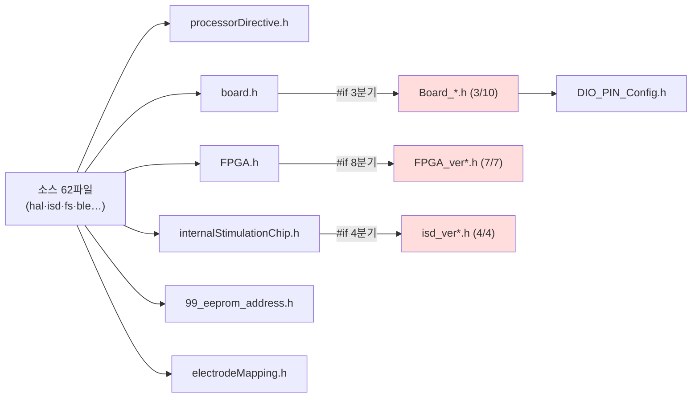

# ③ 분석 — 도달 가능성 기반 사장 판정

**TL;DR**: 버전 헤더는 **선택자 3개에서만** include 되고 소스가 직접 참조하는 곳은 **0건**이다. 선택자는 `#if/#elif` 로 **동시에 하나만** 활성이므로, 비선택 파일 삭제가 빌드에 영향을 줄 수 없음이 **연역적으로 증명**된다. 부수로 **선택자 구조 결함 2건**(도달 불가 파일 7개, `OTE_1_4` 선택 시 `#error` 터지는 함정)을 발견했다.

## 1. board/ 전수 (29파일)

| 분류 | 파일 | 상태 |
|---|---|---|
| **선택자 (3)** | `board.h` · `FPGA.h` · `internalStimulationChip.h` | 활성 |
| **공통 (5)** | `processorDirective.h` · `99_eeprom_address.h` · `DIO_PIN_Config.h` · `electrodeMapping.c` · `electrodeMapping.h` | 활성 |
| **Board_\* (10)** | `Board_OTE_ver1_5.h` | **선택됨** |
| | `Board_OTE_ver1_3.h` · `Board_TD_DEV_ver_1_4.h` | 분기 존재, 비선택 |
| | `ALASKA_3` · `Bingley_devBoard` · `Evaluation` · `OTE_ver1_0` · `OTE_ver1_1` · `OTE_ver1_2` · `OTE_ver1_4` (7) | **선택자에 분기 자체가 없음 = 도달 불가** |
| **FPGA_ver\* (7)** | `FPGA_ver2_7_0.h` | **선택됨** |
| | `1_0_0` · `1_1_0` · `2_0_0` · `2_1_0` · `2_4_0` · `2_8_0` (6) | 분기 존재, 비선택 |
| **isd_ver\* (4)** | `isd_ver1_1_2.h` | **선택됨** |
| | `1_0_0` · `1_1_0` · `1_1_1` (3) | 분기 존재, 비선택 |

## 2. 참조 관계 — 전수 grep 결과

**핵심**: 소스 파일이 `Board_*.h` · `FPGA_ver*.h` · `isd_ver*.h` 를 **직접 include 하는 곳은 단 한 건도 없다.** 전부 선택자를 거친다.

## 3. 삭제 안전성 증명

| 단계 | 명제 | 근거 |
|---|---|---|
| 전제_1 | 버전 헤더는 선택자를 통해서만 컴파일 단위에 진입한다 | §2 전수 grep — 직접 include 0건 |
| 전제_2 | 선택자는 `#if/#elif/#else` 이므로 **정확히 하나**만 include 된다 | `board.h:55-63` · `FPGA.h:7-25` · `internalStimulationChip.h:6-22` |
| 전제_3 | 현재 선택 조합은 OTE 1.5 · FPGA 2.7 · ISD 1.1.2 이며, **이 조합으로 빌드가 성공한다** | `processorDirective.h:10,16,21` + 은수님 빌드 확인(2026-07-22) |
| **결론** | 코드가 참조하는 모든 심볼은 **선택된 3파일 안에 존재**한다. 따라서 **비선택 18파일 삭제는 전처리 결과를 바꿀 수 없다** | 전제_1·2·3 |

> [!NOTE]
> 이 증명은 "심볼을 일일이 대조"하는 방식보다 강하다. 심볼 대조는 누락 위험이 있지만, **도달 불가능한 코드는 정의상 결과에 영향을 줄 수 없다**. 다만 §5 의 선택자 편집이 이 전제를 깨지 않도록 주의해야 한다.

## 4. 선택자 구조 결함 (부수 발견)

| ID | 결함 | 심각도 |
|---|---|---|
| 결함_A | **`Board_*.h` 10개 중 7개는 `board.h` 에 분기조차 없다.** 파일은 존재하나 어떤 `#define` 으로도 선택 불가 — 완전한 사장 | 낮음(무해하나 혼란) |
| 결함_B | **`processorDirective.h:11` 에 `// #define Board_is_OTE_VER_1_4` 가 주석으로 있는데 `board.h` 에 해당 분기가 없다.** 주석을 푸는 순간 `#error Board is NOT selected` 로 빌드 중단 — **선택지처럼 보이지만 함정** | **중간** — 실제로 밟기 쉬움 |
| 결함_C | `FPGA.h:15-16` 의 `FPGA_Ver_is_230` 이 `FPGA_ver2_1_0.h` 를 include (2.3.0 파일 없음) | 낮음(본 정리로 소멸) |

결함_B 가 이번 정리의 실질 효용이다 — **파일을 지우면서 선택자도 같이 좁히면, "고를 수 있는 것"과 "실제로 있는 것"이 일치**하게 된다.

## 5. FPGA 2.7 vs 2.8 (삭제 판단 근거 기록)

`FPGA_ver2_8_0.h` 는 2.7 의 **상위 호환이 아니라 비호환 리비전**이다. 삭제 전에 차이를 기록한다.

| 시스템 레지스터 1 비트 | 2_7_0 (유지) | 2_8_0 (삭제) |
|---|---|---|
| bit 6 | `CarringCaseOpen` | (없음) |
| bit 5 | `CarringCaseConnecton` | `BakcktelPause` |
| bit 4 | `BatteryCharging` | `StimulationTrigger` |
| `backterConfiguration_resetValue` | `0x2D` (11) | `0x31` (12) |

해당 심볼은 **코드에서 전혀 사용되지 않는다**(전수 grep — 헤더 정의만 존재). 따라서 어느 쪽을 선택해도 현재 코드는 컴파일된다. 은수님 판단으로 **2.7 유지·2.8 삭제**를 확정했으며, 필요 시 git 이력(`git show <커밋>:.../FPGA_ver2_8_0.h`)에서 복원 가능하다.

## 6. `board.h` 의 죽은 `#else` 블록

`board.h:9-53` 은 `Board_is_OTE_VER_1_5` 여부로 EEPROM SPI 핀·nRF 핀을 가른다. OTE 1.5 가 유일 선택지가 되면 `#else` 블록(45~52행: `DIO_NUM_NRF_SWDIO_NRESET=10` 등 nRF51822 시절 핀맵)은 **도달 불가**가 된다.

해당 블록은 `ENABLE_NRF_ADV_LowPower` 를 정의하는데, 이는 **1.5 분기에는 없다** → 현재 빌드에서 이미 미정의 상태다. 제거해도 전처리 결과 불변.

## 7. 검증 계층

로직 변경이 없으므로 유닛 계층은 성립하지 않는다.

| 계층 | 대상 | 라벨 |
|---|---|---|
| 구조 | 삭제 18 · 잔존 11 · 선택자 단일 분기 · 사라진 참조 0 | **[구조검사]** |
| 전처리 | **선택 조합의 전처리 산출물이 삭제 전후 동일** | **[전처리동등성]** |
| 빌드 | 컴파일·링크 성공 | **[빌드]** — 은수님 |
| 시스템 | 실기 동작 | **[통합테스트]** — 은수님 |

의존: [전처리동등성]은 [구조검사] 통과 전제, [빌드]는 [전처리동등성] 통과 전제.
