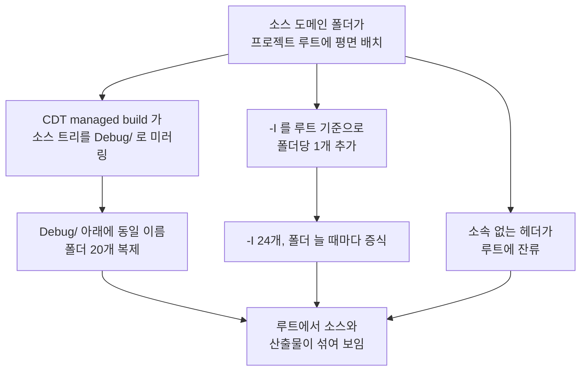

# ③ 분석 — 소스 루트 부재가 만드는 파생 결함

**TL;DR**: 관측된 불편 3가지(`Debug/` 혼재 · `-I` 증식 · 루트 잔여 헤더)는 모두 **"소스 루트가 없다"** 는 단일 원인의 파생이다. 업계 4구조 비교 결과 **소스 루트 단일화 + 모듈 co-location**(Zephyr·Pigweed·PlatformIO 계열)이 적합. include 는 flat `<>` 유지가 이 프로젝트 규모에 맞으며, 전제 조건(헤더명 유일)이 실측으로 충족된다.

## 1. 현행 구조 결함의 인과

`Debug/` 는 `.gitignore` 로 차단돼 git 에는 안 잡히지만, **Eclipse Project Explorer 와 파일 탐색기에서는 그대로 보인다**. 은수님이 겪는 불편은 여기서 발생한다.

### 1.1 "자동으로 include 되는 경로" 의 실체

`.cproject` 의 `-I` 목록 24개를 실사한 결과 **사장 경로 2건**을 확인했다.

| 경로 | 판정 |
|---|---|
| `${ProjName}/linked/include` | ❌ **사장** — `linked/` 폴더 미존재. `.project` 의 linked resource 도 0건 |
| `${ProjName}` (프로젝트 루트 자체) | ⚠️ **곧 불필요** — 루트 헤더 2개(`99_eeprom_address.h`·`processorDirective.h`)를 위해 존재. 이들을 `board/` 로 옮기면 소멸 |
| 나머지 22건 | ✅ 실존 폴더 |

## 2. 업계 폴더 구조 4가지 비교

| 방식 | 대표 사례 | 소스 루트 | 헤더 배치 | include 표기 | 이 프로젝트 적합성 |
|---|---|---|---|---|---|
| **가. 루트 평면 배치** | 옛 Eclipse/Keil 단일 프로젝트 | 없음 | co-location | flat | ❌ **현행**. 산출물 혼재가 구조적 결함 |
| **나. 소스 루트 단일화 + co-location** | Zephyr(app) · Pigweed · PlatformIO(`src/`) · ESP-IDF(`main/`) | 있음 | co-location | 프로젝트별 상이 | ✅ **채택**. 도메인 재편 성과를 그대로 살림 |
| **다. 헤더·소스 물리 분리** | STM32CubeIDE(`Core/Src`+`Core/Inc`) · 전통 ARM/Keil · 본 repo 의 `0__bootloader`·`5__calibration` | 있음 | 분리 | flat | ❌ 한 모듈 수정에 두 폴더 왕복. 최근 퇴조 |
| **라. 역할 계층 분리** | NXP/Renesas SDK · ESP-IDF `components/` | 있음 | 혼재 | 경로 명시 | ❌ 16 도메인 규모엔 과설계 |

### 2.1 왜 다(헤더 분리)를 택하지 않는가

형제 프로젝트 2개가 이미 `source/`+`include/` 를 쓰고 있어 일관성 관점에선 후보였다. 그러나:

- 2__cm3 는 G0~G8 로 **모듈 co-location 이 이미 정착**했고, 이를 되돌리면 리팩토링 성과를 훼손한다
- 헤더·소스 분리의 원래 동기는 **공개 API 경계 표시**인데, 단일 바이너리 펌웨어엔 "외부 소비자"가 없다
- 형제 프로젝트는 규모가 작아(`0__bootloader` 등) 분리 비용이 낮았을 뿐, 174파일에 적용하면 탐색 비용이 커진다

→ **루트 폴더 이름(`source/`)만 형제와 맞추고, 내부 배치는 co-location 유지**로 절충한다.

## 3. include 표기 분석

### 3.1 `<>` vs `""` — 기술적 차이

| | `#include "x.h"` | `#include <x.h>` |
|---|---|---|
| 탐색 순서 | **인클루드한 파일의 디렉터리** → `-I` 목록 → 시스템 | `-I` 목록 → 시스템 |
| 결정성 | 파일 위치에 따라 결과가 달라질 수 있음 | `-I` 순서로 **일관** |
| 관례 | 프로젝트 내부 헤더 | 시스템·외부 헤더 |

관례상 반론(`<>` 는 외부 헤더 신호)은 이 프로젝트에서 **`tdc_` 접두어가 대신 수행**한다 — `<tdc_hal_i2c.h>` 는 우리 것, `<stdint.h>` 는 시스템으로 즉시 구분된다. 반면 `""` 의 "현재 디렉터리 우선" 규칙은 동명 헤더가 생기면 파일마다 다른 결과를 낼 수 있어, 은수님이 겪은 **인덱서 이중 경로 류 혼란에 더 취약**하다.

→ 요구_3(`<>` 통일)은 관례를 거스르는 게 아니라 **이 프로젝트 조건에서 더 안전한 선택**이다.

### 3.2 flat include 의 전제 — 실측 충족

| 전제 | 실측 | 판정 |
|---|---|---|
| 헤더 basename 이 전역 유일해야 함 | 중복 **0건** (전면 리팩토링의 `tdc_` 정합 효과) | ✅ |
| 모든 헤더 폴더가 `-I` 에 등록돼야 함 | 실존 폴더 22건 전부 등록됨 | ✅ |
| 경로 접두어 include 가 없어야 함 | **0건** (G7 에서 `<isdExecution/driver_PCM.h>` 정리) | ✅ |

### 3.3 flat 유지의 대가와 관리 방법

`-I` 가 폴더당 1개로 남는다(약 22개). 이건 **경로 명시형으로 가지 않는 한 피할 수 없는 비용**이다. 실질 위험은 하나뿐이다 — **새 폴더를 만들고 `-I` 등록을 잊으면 빌드가 깨진다.** 이를 `tdc_convention.md` 규약으로 못박아 관리한다(비기능_5).

## 4. 이동 대상 전수

| 현행 | 신규 | 파일 |
|---|---|---|
| `hal` `drv` `led` `touch` `ui` `sys` `pwr` `fs` `ble` `qcc` `dfu` `isd` `stim` `cfx_link` `boot` `util` | `source/<동일>` | 138 |
| `Cortex-M3-src/{main.c,main.h}` | `source/{main.c,main.h}` | 2 |
| `Gen1_5/{SEGGER_RTT,tiny-AES-c}` | `source/lib/{SEGGER_RTT,tiny-AES-c}` | 9 |
| `99_includeBoard/*` | `source/board/*` | 27 |
| `99_eeprom_address.h` · `processorDirective.h` | `source/board/` | 2 |
| `tdc_convention.md` | `docs/참고/` (소스 트리 밖) | 1 |
| `sections.ld` | **루트 유지** | 1 |

계 **178항목**. 이동 후 프로젝트 루트에 남는 것: `source/` · `Debug/` · `sections.ld` · `.cproject` · `.project` · `.settings/` · `.gitignore`.

## 5. Eclipse 결속 지점 (변경 필수 개소)

| 개소 | 현행 | 조치 |
|---|---|---|
| `.cproject` `-I` 목록 (line 59~81) | `${ProjName}/<폴더>` 22건 + 사장 2건 | `${ProjName}/source/<폴더>` 로 갱신, 사장 2건 제거 |
| `.cproject` `sourceEntries` (line 131~136) | `name=""` + `excluding="99_includeBoard\|Cortex-M3-src\|Gen1_5"` + 개별 3건 | **`name="source"` 단일 entry** 로 단순화 |
| `.cproject` 링커 `-T` (line 105) | `${ProjName}/sections.ld` | **무변경** (루트 유지) |
| `Debug/makefile` `-T` (line 77) | 절대경로 `...\2__cm3\sections.ld` | **무변경**. 단 makefile 은 CDT 가 재생성하므로 Clean 필요 |
| `${eclipse_home}` SDK 경로 3건 | ON Semi SDK | **무변경** |

## 6. 위험 분석

| 위험 | 영향 | 완화 |
|---|---|---|
| `-I` 경로 갱신 누락 → 헤더 못 찾음 | 빌드 실패 | 갱신 후 **실존 검사 스크립트**로 22건 전수 확인 |
| `sections.ld` 이동 → 링크 실패 | 치명 | 루트 유지 확정(비기능_3). 직전 `.cproject` 정리에서 동일 실수 경험 있음 |
| 기존 `Debug/` 오브젝트가 구 경로 기준 | 링크 오류·유령 심볼 | **Clean 필수**를 게이트 절차에 명시 |
| Eclipse 인덱스 stale | 이중 경로 재발 | **Index Rebuild** 를 게이트 절차에 명시 |
| `""` → `<>` 치환이 문자열 리터럴 오염 | 컴파일 오류 | `#include` 로 시작하는 라인에만 한정한 정규식 사용 |
| git rename 미인식 | 이력 단절 | `git mv` 사용. 커밋 후 `--find-renames` 로 확인 |

## 7. 유닛/모듈 검증 계층

본 작업은 로직 변경이 없어 **유닛 단위 검증이 성립하지 않는다**. 검증 계층은 다음과 같이 잡는다.

| 계층 | 검증 대상 | 라벨 |
|---|---|---|
| 구조 | 파일 이동 누락 0 · 루트 잔여 정합 | **[구조검사]** |
| 빌드 | `-I` 해소 · 컴파일·링크 성공 | **[빌드]** |
| 시스템 | 실기 동작 (부팅·BLE·자극·EEPROM·터치·LED) | **[통합테스트]** — 은수님 게이트 |

의존: [빌드]는 [구조검사] 통과 전제, [통합테스트]는 [빌드] 통과 전제.
