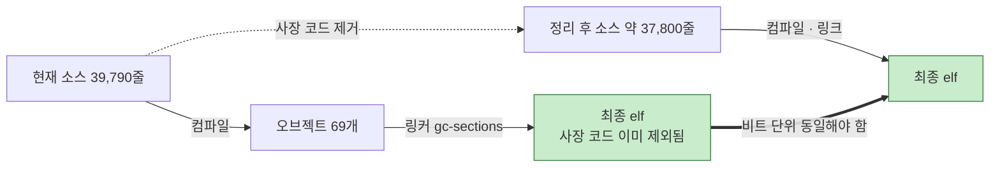
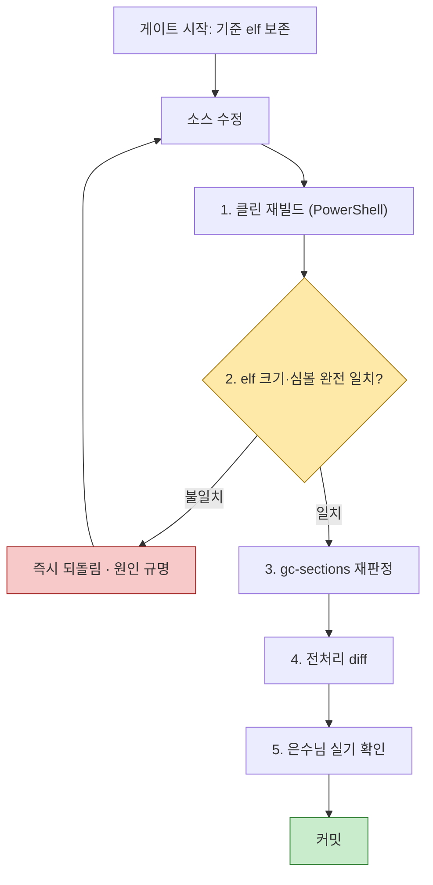

# ⑤ 계획 — 2__cm3 2차 리팩토링

**TL;DR**: 6개 게이트(G1~G6)로 나눠 진행한다. **G1~G3 · G5 는 "링커가 이미 버린 것"만 지우므로 최종 `.elf` 가 비트 단위로 동일해야 하고, 그것이 곧 합격 기준이다** — 실기 확인 부담이 거의 없다. 반면 **G4(모듈 통째 제거 5건)는 은수님 판단이 먼저 필요**하다. 총 제거 예상: 파일 12개 · 코드 약 2,000줄 · 함수 70 · 매크로 170여.

## 1. 이 계획의 핵심 아이디어

CM3 빌드는 `--gc-sections` 를 쓴다. **사장 함수는 이미 최종 바이너리에서 빠져 있다.** 따라서 소스에서 지워도 결과물이 달라지지 않는다.

> [!IMPORTANT]
> **합격 기준을 "동작이 같아 보인다"가 아니라 "바이너리가 같다"로 올릴 수 있다.** 1차 리팩토링은 전처리 diff(중) · `.o` 기계어 대조(강)까지 갔지만, 이번엔 **최종 `.elf` 완전 일치(최강)** 를 쓸 수 있다. 이게 성립하지 않는 게이트만 실기 확인이 필요하다.

| 게이트 | `.elf` 동일 성립? | 실기 확인 |
|---|---|---|
| G1 `FS_MEM_UART` 이관 | **성립** (심볼 이동만) | 최소 (CFX 채널 1회) |
| G2 UART 제거 | **성립** | 최소 |
| G3 사장 함수·데이터 제거 | **성립** | 최소 |
| G4 모듈 통째 제거 | 성립하나 **`IRQHandler` 제거 시 벡터 테이블 변화** | **필요** |
| G5 매크로·유령선언·`#if 0` | **성립** | 최소 |
| G6 미사용 지역변수 | 성립 (`-O0` 기준 스택 프레임 변할 수 있음) | 선택 |

## 2. 게이트 요약 — 한눈에 보기

| # | 게이트 | 무엇을 | 규모 | 위험 | 은수님 판단 |
|---|---|---|---|---|---|
| **G1** | `FS_MEM_UART` 이관 | `cfx_link/tdc_shm_debug.h` 신설, CM3↔CFX 공유메모리 이사 | 신규 1파일 | 낮음 | 불필요 |
| **G2** | UART 전면 제거 | `hal/tdc_hal_uart.*` 삭제 + 매크로·include·보드정의 정리 | -2파일 -229줄 | 낮음 | 불필요 |
| **G3** | 사장 함수·데이터 제거 | 링크 확정 사장 함수 64건 · 데이터 심볼 23건 | 약 -900줄 | 낮음 | 불필요 |
| **G4** | 모듈 통째 제거 | 5개 모듈 (§4) | -10파일 약 -1,600줄 | **중** | **필요 (5건)** |
| **G5** | 매크로·유령선언·죽은 블록 | 매크로 170여 · 유령 선언 17 · `#if 0` 블록 | 약 -400줄 | 낮음 | 일부 |
| **G6** | 미사용 지역변수 (선택) | `-Wall` 경고 130건 | 약 -130줄 | 낮음 | 선택 |

> [!NOTE]
> G3 의 "64건"은 링크 확정 70건에서 **G2 의 UART 2건과 G4 모듈에 속한 4건을 뺀 수**다. 게이트 간 중복 계상을 피했다.

## 3. G1 ~ G3 — 판단 없이 바로 갈 수 있는 것

### G1. `FS_MEM_UART` 이관 (선행 필수)

**왜 먼저인가**: UART 헤더를 먼저 지우면 CM3↔CFX 공유메모리 채널이 끊긴다.

| 작업 | 내용 |
|---|---|
| 신설 | `cfx_link/tdc_shm_debug.h` — 공유 ABI 경고 주석 + `FS_MEM_UART_T`(활성 3필드) + `FS_MEM_UART` 매크로 + `FS_MEM_UART_STATE_*` 5종 |
| 버림 | `#if 0` 확장 필드 19종 · `DebugMode_t` · `debug_agc_t` · `FS_MEM_UART_BUF_LEN` · `FS_MEM_DISABLE_CFX/ENABLE_CFX` · `FS_MEM_DEBUG_AGC_*` (CFX 사본에도 없거나 양쪽 비활성) |
| 불변 | **필드 이름·순서·타입** (ABI). 주소 매크로 `DSP_PRAM1_REMAP_BASE` 그대로 |
| include 수정 | `cfx_link/tdc_shm.c` 에 `#include <tdc_shm_debug.h>` 명시 추가 (현재는 전이 include 에 의존) |
| `.cproject` | 변경 없음 (`cfx_link` 는 이미 `-I` 등록됨) |

**검증**: `.elf` 완전 일치 + `.map` 에서 `FS_MEM_UART` 참조 주소가 이전과 동일 + CFX 사본과 필드 오프셋 대조표 산출

### G2. UART 전면 제거

| 작업 | 대상 |
|---|---|
| 파일 삭제 | `hal/tdc_hal_uart.c` · `hal/tdc_hal_uart.h` |
| 함수 | `tdc_hal_uart_printf()` · `tdc_hal_uart_uninit()` · 데이터 `m_tx_buf` |
| 매크로 | `TDC_HAL_UART_DIO_*` · `TDC_HAL_UART_TX_BUF_LEN` · `TDC_HAL_UART_BAUDRATE*` · `TDC_HAL_UART_CONFIG` |
| 보드 정의 | `board/Board_OTE_ver1_5.h:68-69` · `:118-119` 의 `DIO_PIN_INDEX_forUART_TX/RX` |
| 로그 분기 | `util/tdc_printf.h:18` `TDC_PRINTF_INTERFACE_UART` + `:34-35` UART 분기 |
| include 삭제 | `util/tdc_util.h:18` · `util/tdc_util.c:6` · `sys/tdc_sys_control.c:2` · `hal/tdc_hal_spi.c:13` · `main.c:41` · `ble/tdc_ble_communication.h:4` |
| include 교체 | `fs/tdc_fs.h:25` · `hal/tdc_hal_dio.h:18` → 필요 시 `<tdc_shm_debug.h>` 로 (실사용 심볼 확인 후) |
| 호출부 정리 | `sys/tdc_sys_init.c:193` (죽은 `tdc_sys_uninit()` 내부 — G4 에서 함수째 제거 예정이면 그때 함께) |

> [!NOTE]
> **`0__bootloader` 는 건드리지 않는다** (은수님 확정). 부트로더는 DIO32 판정으로 UART 를 OTA·부팅 로그에 실사용 중이다.

**왜 안전한가** (분석 §3):
1. CM3 에 `tdc_hal_uart_init()` · `Sys_UART_Config()` 가 0건 — UART 를 켠 적이 없다
2. `tdc_hal_uart_uninit()` 의 호출자 `tdc_sys_uninit()` 자체가 호출 0건 — 정리 코드가 실행된 적이 없다
3. 물리 핀 DIO20/21 은 `board.h:23,27` 에서 SPI 용도로 재정의돼 이미 사용 중 — 이름만 지우는 것

**검증**: `.elf` 완전 일치 + `Board_OTE_ver1_5.h` 수정 전후 전처리 diff 0

### G3. 사장 함수·데이터 제거 (64 + 23건)

링크 레벨로 확정된 것만. 도메인별:

| 도메인 | 건수 | 대표 |
|---|---|---|
| `isd/tdc_isd_fpga.c` | 11 | FPGA accessor (이월_1 G7) |
| `led/tdc_led_output.c` | 10 | `tdc_led_turn_on_red/green/blue` · `tdc_led_black/white` · `tdc_led_pattern_out` 등 |
| `cfx_link/tdc_shm.c` | 9 | 공유메모리 accessor (이월_1 G8) |
| `sys/` | 7 | `tdc_sys_uninit` · `error_blink` · `error_toggler` 등 |
| `touch/` | 7 | `tdc_touch_led_debug` · `led_debug_blink_*` · IQS323 ULP |
| `pwr/` | 2 | `tdc_pwr_battery_calculate_boundary` · `bootloader_CRC_calc` |
| `ble/` | 4 | mapping/remote command |
| 기타 | 14 | `tdc_fs_mount` · `tdc_stim_data_clear_bit` · `aes128_test` · `tdc_isd_is_i2c_free` 등 |

동반 삭제: 헤더 선언, 데이터 심볼 23건.

**보류 1건**: `main.c` 의 `devFwVer_type` · `devFwVer_num` → §5 확인_1

**검증**: `.elf` 완전 일치. 불일치하면 그 항목이 실제로는 살아있었다는 뜻이므로 **즉시 되돌리고 원인 규명**

## 4. G4 — 은수님 판단이 먼저 필요한 것 (모듈 통째 제거 5건)

각 모듈은 링크 레벨로 사장이 확정됐다. **기술적으로는 제거 가능하다.** 다만 "왜 남아 있었는가"가 코드로 판단되지 않아 여쭙는다.

| # | 모듈 | 규모 | 링크 판정 | 여쭙는 이유 |
|---|---|---|---|---|
| G4-1 | `dfu/tdc_dfu_ota.c` + `.h` | 470줄 | 함수 6/6 사장 | 실제 OTA 는 `tdc_dfu_ble_ota.c` 가 담당. **세대 교체된 구모듈로 보이나 확인 필요** |
| G4-2 | `sys/tdc_sys_earpiece.c` + `.h` | 112줄 | **생존 함수 0** | 유일 호출부 `main.c:695` 가 주석 처리됨. 이어피스 감지가 QCC 로 완전 이관됐는지, 미이관 TODO 인지 |
| G4-3 | `isd/tdc_isd_map_test_stim.c` | 944줄 | **빈 오브젝트** | `RELEASE` 매크로로 전체 비활성. 주석에 "메모리 부족으로 테스트용 자극 출력(동물실험 및 내부기 시험용) 비활성화" — **의도적 보존일 가능성** |
| G4-4 | `pwr/tdc_pwr_lsad.c` + `.h` | - | `LSAD_IRQHandler` 외 전부 사장 | QCC 0x34 기반 배터리 경로로 세대 교체됨. **QCC 통신 두절 시 비상 폴백으로 남길지** |
| G4-5 | `hal/tdc_hal_i2c_cfx.c` + `.h` | - | `CFX_1_IRQHandler` 외 전부 사장 | `processorDirective.h:105` `CM3_I2C_controls_FPAG` 상시정의로 CFX 경유 경로가 죽음. **되돌릴 계획 여부** |

> [!CAUTION]
> **G4-4 · G4-5 는 `*_IRQHandler` 를 포함한다.** 인터럽트 핸들러는 SDK 벡터 테이블이 이름으로 결속하므로 링커도 지우지 못한다(불가침 항목). 모듈을 통째로 지우면 **벡터 테이블 엔트리가 기본 핸들러로 바뀌어 `.elf` 가 달라진다.**
>
> 두 핸들러는 각각 `tdc_pwr_lsad_init()` · CFX I2C 초기화가 사장이라 **인터럽트가 활성화되지 않아 실행될 일이 없다.** 그래도 이 게이트만은 `.elf` 완전 일치가 성립하지 않으므로 **실기 확인이 필요하다.**
>
> 대안: 모듈 본체만 지우고 **핸들러는 빈 스텁으로 남기는** 방법도 있다. 은수님 선택 사항.

**제안**: G4 를 **G4a(판단 쉬운 것: G4-1, G4-3)** 와 **G4b(HW 결속: G4-2, G4-4, G4-5)** 로 쪼개 진행하는 것도 가능하다.

## 5. G5 — 매크로 · 유령 선언 · 죽은 블록

| 항목 | 건수 | 위험 | 비고 |
|---|---|---|---|
| `cfx_link/tdc_shm_addr.h` 오프셋 매크로 | 81 | 낮음 | 미참조 확인됨. 단 **공유 ABI 문서 역할**을 할 수 있어 주석으로 남길지 검토 |
| `board/99_eeprom_address.h` 매크로 | 약 40 | 낮음 | 이월_3. 전량 미사용 |
| `board/processorDirective.h` 무consumer 매크로 | 13 + 5 | 낮음 | `CFX_UART_USING_ISR` 등 포함 |
| `dfu/` OTA 헤더 미사용 상수 | 31 | 낮음 | G4-1 과 함께 처리 |
| 유령 함수 선언 (정의 없음) | 17 | **없음** | `main.h` 10 · `isd/` 4 · `ble/` 2 · `hal/tdc_hal_i2c.h:171` 1. **호출하면 링크 에러가 나므로 현재 호출 0건이 보장됨** |
| `#if 0` · 영구 거짓 분기 | 55건 후보 | 낮음~중 | 노드09 가 안전 18 · 주의 20 · 위험 17 로 분류. **주의·위험 37건은 개별 판단** |

**보존 권고** (제거 대상 아님):
- `FPGA_ver2_7_0.h` 백텔 캘리브레이션 값 — 현장실패 이력이 담긴 주석
- BLE 패스키 인증 비활성 블록 — 보안 관련, 되살릴 수 있음

## 6. G6 — 미사용 지역변수 (선택)

`-Wall -Wextra` 경고 130건. 순수 정리 작업이며 **은수님이 원치 않으면 생략 가능**하다. `-O0` 빌드라 스택 프레임 크기가 변할 수 있어 `.elf` 완전 일치가 성립하지 않을 수 있다.

## 7. 검증 절차 (전 게이트 공통)

각 게이트마다 순서대로 수행한다.

| 단계 | 명령 · 기준 |
|---|---|
| 1 | PowerShell 에서 `make clean; make all -j8` — **Git Bash 금지** (`-Dchess_storage(a)=` 파싱 실패) |
| 2 | `arm-none-eabi-size` 4개 값 + `arm-none-eabi-nm` 심볼 목록 완전 일치 |
| 3 | `--print-gc-sections` 재실행 — 제거한 항목이 목록에서 사라졌는지, 새 사장이 생겼는지 |
| 4 | `gcc -E` + `-fmacro-prefix-map` 으로 `__FILE__` 오염 차단 (노하우_3) |
| 5 | Eclipse 에서 **F5 Refresh → Clean → Build**. `.cproject` 변경 게이트는 **Index Rebuild** 추가 |

### 7.1 `__LINE__` 오염 — 반드시 알고 있어야 할 함정

**줄을 삭제하면 그 아래 코드의 `__LINE__` 값이 밀려서 바이너리가 달라진다.** 코드 변경이 아닌데도 diff 가 발생한다.

`util/tdc_printf.h:39-41` 의 `TDC_PRINTF_E` 매크로가 `tdc_printf_file_func_line(__SHORT_FILE__, __func__, __LINE__)` 를 호출하므로, 이 매크로를 쓰는 파일에서 위쪽 줄이 사라지면 즉시값이 바뀐다.

> [!NOTE]
> **실측 사례** (본 작업 G1+G2 사전 실험):
> - 줄을 **삭제**한 버전 → `.text` 9바이트 차이. 전부 `0x39→0x38`, `0x3F→0x3E`, `0x4B→0x4A` 처럼 **즉시값이 1씩 감소**
> - 줄을 **빈 줄로 치환**해 라인 수를 보존한 버전 → **`.text` md5 완전 일치** (`dc0c5fb2861cf6e7577c75c2bb66c1d6`)
>
> 노하우_3(`__FILE__` 경로 오염)의 같은 계열이다. **무관한 위치에서 균일한 소량 차이가 나면 `__LINE__` 이동을 의심하라.**

**대응**: 게이트 검증 시 **라인 수를 보존한 대조본**(삭제 대신 빈 줄 치환)을 별도로 만들어 baseline 과 비교한다. 그것이 완전 일치하면 실제 커밋본의 소량 차이는 `__LINE__` 이동으로 설명된다.

### 7.2 G1 + G2 는 이미 실증 완료

계획 수립 단계에서 임시 트리에 **G1 + G2 를 실제로 적용해 검증했다.**

| 검증 | 결과 |
|---|---|
| 전 소스 컴파일 (`-fsyntax-only`) | **에러 0 · 경고 0** (`.c` 68 → 67) |
| 전이 include 붕괴 여부 | **없음.** `tdc_hal_uart.h` 를 지워도 8개 파일 중 깨진 것 0건 |
| `size` (text/data/bss) | **완전 일치** — 187,212 / 4,728 / 21,940 |
| 심볼 테이블 (주소 포함) | **1,360개 완전 일치, 차이 0줄** |
| `.text` 바이너리 | **md5 완전 일치** (라인 수 보존 대조본 기준) |

실험에서 확인된 **필수 순서**: `cfx_link/tdc_shm.c:283` 의 `FS_MEM_UART` 와 `hal/tdc_hal_dio.c:121-122` 의 `TDC_HAL_UART_DIO_TX/RX` 가 유일한 실패 지점이었다. 따라서
1. **G1 이 반드시 선행**해야 하고 (`tdc_shm.c` 에 `<tdc_shm_debug.h>` 명시 include 추가)
2. **G2 에서 `tdc_hal_dio_configure_sleep()`(`hal/tdc_hal_dio.c:82-131`, 사장)을 함께 제거**해야 한다

> [!IMPORTANT]
> **은수님 실기 확인 포인트** — 각 게이트 종료 시 제가 다음을 명시해 드립니다.
> - Eclipse 에서 필요한 조작 (Refresh / Clean / Index Rebuild 중 무엇)
> - 확인할 동작 (예: G1 은 CFX 로그매핑 채널, G4-4 는 배터리 표시)
> - `.elf` 일치 여부와 불일치 시 그 이유

## 8. 실행 순서와 커밋 단위

| 순서 | 게이트 | 커밋 | 전제 |
|---|---|---|---|
| 1 | G1 | `Refactor(cm3): FS_MEM_UART를 cfx_link로 분리 이관` | - |
| 2 | G2 | `Refactor(cm3): UART 전면 제거` | G1 통과 |
| 3 | G3 | `Refactor(cm3): 링크 레벨 확정 사장 함수·데이터 제거` | G2 통과 |
| 4 | G5 | `Refactor(cm3): 미사용 매크로·유령 선언·죽은 전처리 블록 정리` | G3 통과 |
| 5 | G4 | 모듈별 개별 커밋 | **은수님 판단 후** |
| 6 | G6 | `Refactor(cm3): 미사용 지역변수 정리` | 선택 |

**G4 를 마지막에 두는 이유**: 판단이 필요하고 `.elf` 완전 일치가 성립하지 않는 유일한 게이트라, 앞 게이트들이 모두 무결하게 통과한 상태에서 진행해야 문제 발생 시 원인이 명확하다.

## 9. 은수님께 여쭐 것 — 정리

### 9.1 G4 진행 판단 (5건)

| # | 질문 | 제 권고 |
|---|---|---|
| 확인_1 | `dfu/tdc_dfu_ota.c` (470줄) 제거? | **제거** — `tdc_dfu_ble_ota.c` 로 세대 교체 확실 |
| 확인_2 | `sys/tdc_sys_earpiece.c` (112줄) 제거? | 이어피스 감지 QCC 이관 완료 여부만 확인되면 **제거** |
| 확인_3 | `isd/tdc_isd_map_test_stim.c` (944줄) 제거? | **보류 권고** — "동물실험 및 내부기 시험용" 주석. 향후 필요 가능성 |
| 확인_4 | `pwr/tdc_pwr_lsad.c` 제거? | 비상 폴백 계획 없으면 **제거**. `LSAD_IRQHandler` 처리 방식 선택 필요 |
| 확인_5 | `hal/tdc_hal_i2c_cfx.c` 제거? | CFX 경유 회귀 계획 없으면 **제거**. `CFX_1_IRQHandler` 처리 방식 선택 필요 |

### 9.2 개별 항목 (2건)

| # | 질문 | 제 권고 |
|---|---|---|
| 확인_6 | `main.c` 의 `devFwVer_type` · `devFwVer_num` 제거? | **보류 권고** — 외부 도구가 바이너리 문자열을 스캔할 가능성 |
| 확인_7 | `hal/tdc_hal_dio.c` 케이스 뚜껑 감지(`case_lid_open`) 제거? | 향후 사용 계획 없으면 제거 |

### 9.3 리팩토링과 별개 — 의료 안전 사안 (1건)

> [!WARNING]
> **확인_8. `stim/tdc_stim_para_cal.c:216` 의 자극 전하량 초과 안전 검사가 영구 비활성이다.**
>
> `#ifdef Df_MaxDeliveryChargeLimitation` 인데 실제 정의된 이름은 `board/processorDirective.h:112` 의 **`Df_MaxDeliveryChargeLimitationKKK`** 다. `MaxDeliveryChargeOver` 검사가 컴파일되지 않는다.
>
> `KKK` 심볼은 1차 리팩토링에서 **교차 프로젝트 복제 동결 대상**이라 임의 rename 불가. **본 리팩토링 범위 밖이며, 별도 작업으로 다룰지 은수님 판단이 필요하다.**

## 10. 되돌리기

각 게이트는 독립 커밋이므로 `git revert` 로 개별 되돌림이 가능하다. 브랜치는 `claude_feature_cm3-full-refactor-2nd` 이며, `claude_develop` 병합은 **전 게이트 통과 후 은수님 승인 시에만** 수행한다.
