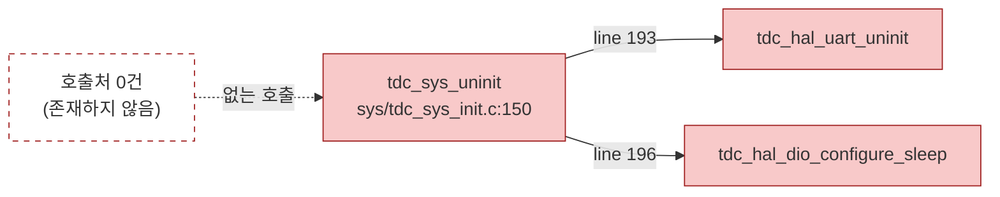
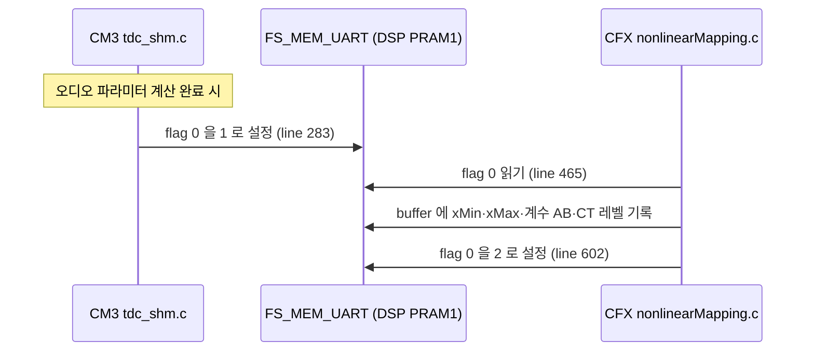

# ③ 분석 — 2__cm3 2차 리팩토링

**TL;DR**: 조사를 **3층**으로 수행했다 — ㉮ 링커 `--print-gc-sections`(사장 함수 70 · 데이터 24 확정) ㉯ 서브에이전트 10노드 병렬 조사(매크로·타입·전처리 블록 등 링커가 못 보는 영역) ㉰ 두 결과의 교차 심판. **노드 간 상충 7건을 링크 레벨 데이터로 전부 판정**했고, 그 과정에서 서브에이전트 3건의 오판과 1차 이월 목록의 오탐 3건을 잡아냈다. UART 제거는 예상보다 **훨씬 안전**하다 — 정리 코드가 애초에 실행된 적이 없기 때문이다.

## 1. 조사 방법 — 3층 구조

| 층 | 도구 | 강점 | 한계 |
|---|---|---|---|
| ㉮ 링크 레벨 | `--print-gc-sections` | **최종 바이너리 기준 사실.** 연쇄 사장 자동 포착 | 매크로·타입·미사용 `static inline` 헤더 함수를 못 봄 |
| ㉯ 소스 레벨 | 서브에이전트 10노드 (grep + 전처리 수동 평가) | 매크로·`#if 0` 블록·include 관계·설계 의도 파악 | `#if 0` 내부 호출 오판, 함수포인터 테이블 오판 |
| ㉰ 심판 | 두 결과 대조 + `nm` 생존 함수 확인 | 상충 해소 | - |

> [!IMPORTANT]
> **㉮ 와 ㉯ 는 상호 보완이지 중복이 아니다.** 링커는 "무엇이 최종 바이너리에 없는가"만 안다. 왜 없는지, 지워도 되는지, 매크로·타입은 어떤지는 소스 조사가 답한다. 반대로 소스 조사는 연쇄 사장과 함수포인터 간접 호출에서 반복적으로 틀렸다.

상세 원자료: [`분석-데이터/05_링크레벨-사장판정.md`](분석-데이터/05_링크레벨-사장판정.md) · [`에이전트-로그/`](에이전트-로그/) 10건

## 2. 노드 간 상충 심판 (이 분석의 핵심)

10노드가 병렬로 돌면서 서로 다른 판정을 낸 지점이 7건이다. 전부 링크 레벨 데이터로 판정했다.

| # | 쟁점 | 노드 주장 | **심판** | 근거 |
|---|---|---|---|---|
| 상충_1 | `isd/tdc_isd_map_test_stim.c` (944줄) | 노드05 "살아있음" / 노드06 "사장" | **노드06 승 — 완전 사장** | `nm` 결과 **함수 0개인 빈 오브젝트**. `:28 #ifndef RELEASE` ~ `:944 #endif` 가 파일 본문 전체를 감싸는데 `board/processorDirective.h:22` 가 `RELEASE` 를 무조건 정의 |
| 상충_2 | `tdc_hal_uart_uninit()` | 노드01 "사장" / 노드02 "사장 아님(DIO 원복 부수효과)" | **사장 확정** | 링커가 폐기. 호출자 `tdc_sys_uninit()` 자체가 호출 0건이라 부수효과가 발생할 경로가 없음 |
| 상충_3 | `tdc_led_memory_error` | 1차 G5 이월 "사장" / 노드04·10 "생존" | **생존 — 이월 목록의 오탐** | 링커 폐기 목록에 없음. `sys/tdc_sys_init.c:280` 실사용 |
| 상충_4 | `pwr/tdc_pwr_lsad.c` 모듈 | 노드03 "전체 사장" | **부분 정정** | 사장 4 + SDK노이즈 3, **`LSAD_IRQHandler` 생존**(벡터 테이블 결속) |
| 상충_5 | `hal/tdc_hal_i2c_cfx.c` 모듈 | 노드03 "전체 사장" | **부분 정정** | **`CFX_1_IRQHandler` 생존**(벡터 테이블 결속) |
| 상충_6 | `sys/tdc_sys_earpiece.c` 모듈 | 노드03 "전체 사장" | **확정 — 생존 함수 0** | `nm` 생존 0 |
| 상충_7 | G8 `cfx_link` accessor 19건 | 1차 이월 "19건 사장" / 노드07 "13건 생존" | **노드07 지지** | 링커 판정 사장은 **9건**뿐 |

### 심판에서 드러난 서브에이전트의 체계적 오판 유형

| 유형 | 사례 | 교훈 |
|---|---|---|
| 연쇄 사장 미인식 | 노드03 이 `tdc_pwr_lsad_*` 를 "호출됨"으로 본 것 (호출자가 사장) | grep 은 호출자의 생사를 모른다 |
| 함수포인터 테이블 오탐 | `ui/tdc_ui_command.c` static `handle_*` 12개 (노드04 가 자체 정정) | 디스패치 테이블 등록을 확인해야 함 |
| 벡터 테이블 결속 누락 | 노드03 의 "모듈 전체 사장" 3건 중 2건 | `*_IRQHandler` 는 링커도 못 지운다 |
| 전처리 가드 범위 오독 | 노드05 의 `test_stim` 판정 | 파일 전체를 감싸는 가드를 놓침 |

## 3. UART 제거 — 예상보다 안전하다

### 3.1 핵심 발견 — 정리 코드가 실행된 적이 없다

`tdc_sys_uninit()` 은 선언(`sys/tdc_sys_init.h:20`)과 정의(`sys/tdc_sys_init.c:150`)만 있고 **CM3 전역 호출처가 0건**이다. 링커도 폐기했다. 따라서 그 안의 `tdc_hal_uart_uninit()` · `tdc_hal_dio_configure_sleep()` 도 함께 죽어 있다.

> [!NOTE]
> **요구사항 §4 의 우려가 해소됐다.** "부트로더가 UART 를 켠 채 앱으로 점프하면 CM3 의 uninit 이 유일한 차단 지점"이라고 봤으나, 그 차단 지점은 **원래부터 동작한 적이 없다**. UART 제거로 잃는 기능이 없다.

### 3.2 물리 핀은 이미 SPI 가 쓰고 있다

`board/Board_OTE_ver1_5.h:25` 의 `#if 1 // Sullivan 1.5` 는 보드 매크로가 아닌 **리터럴 상수**라 `:68-69`(DIO20/21) 분기만 항상 컴파일된다. 은수님이 우려할 만한 DMIC 공유 핀 분기(`:118-119`, DIO17/DIO14)는 `:75 #else` 안이라 **영구 비활성**이다.

그리고 활성 분기의 DIO20/21 은 `board/board.h:23,27` 에서 `NRF_SPI_CS_PIN` · `GPIO_PIN_ReadCommandForSPI_Master` 로 **재정의되어 SPI 용도로 실사용 중**이다(`hal/tdc_hal_dio.c:59-67`, `tdc_hal_dio_configure_normal()`, 활성).

**결론: UART 이름을 지워도 물리 핀 동작은 변하지 않는다.**

### 3.3 UART 페리페럴은 켜진 적이 없다

CM3 전역에 `tdc_hal_uart_init()` · `Sys_UART_Config()` · `UART->CTRL = UART_ENABLE` 이 **0건**이다(노드01·02 독립 확인). CM3 는 UART 를 소비만 할 뿐 활성화하지 않는다.

### 3.4 제거 대상

| 분류 | 대상 |
|---|---|
| 파일 삭제 | `hal/tdc_hal_uart.c` · `hal/tdc_hal_uart.h` (단 `FS_MEM_UART` 부는 §4 로 이관 후) |
| 함수 | `tdc_hal_uart_printf()` · `tdc_hal_uart_uninit()` |
| 매크로 | `TDC_HAL_UART_DIO_*` · `TDC_HAL_UART_TX_BUF_LEN` · `TDC_HAL_UART_BAUDRATE*` · `TDC_HAL_UART_CONFIG` |
| 보드 정의 | `DIO_PIN_INDEX_forUART_TX/RX` (`board/Board_OTE_ver1_5.h:68-69`, `:118-119`) |
| 로그 분기 | `util/tdc_printf.h:18` `TDC_PRINTF_INTERFACE_UART` 와 `:34-35` 분기 |
| include | `tdc_hal_uart.h` 를 include 하는 8파일 중 **`FS_MEM_UART` 를 안 쓰는 6파일**은 단순 삭제 (`util/tdc_util.h:18` · `util/tdc_util.c:6` · `sys/tdc_sys_control.c:2` · `hal/tdc_hal_spi.c:13` · `main.c:41` · `ble/tdc_ble_communication.h:4`) |
| 데이터 | `m_tx_buf` (`hal/tdc_hal_uart.c:7`) |

## 4. `FS_MEM_UART` 이관 설계

### 4.1 ABI 정합 실증

| 항목 | CM3 | CFX | 일치 |
|---|---|---|---|
| 정의 위치 | `hal/tdc_hal_uart.h:81-138` | `1__cfx/OTE_1_5_gen/OTE_1_5_gen_UART.h:17-24` | - |
| 활성 필드 | `int state; int flag[32]; int buffer[512];` | 동일 | **O** |
| 베이스 주소 | `DSP_PRAM1_REMAP_BASE` | `D_DSP_PRAM1_BASE` | 명명 정황상 동일 뱅크 (§4.4 미확인) |
| `#if 0` 확장 필드 19종 | `:86-132` 비활성 | `stimulationStrategy.c:604-621` 도 비활성 | **양쪽 모두 사장** |
| `5__calibration` 사본 | 없음 | - | - |

### 4.2 살아있는 경로

### 4.3 이관안

| 항목 | 결정 |
|---|---|
| 새 파일 | `cfx_link/tdc_shm_debug.h` (노드02 제안 채택 — 헤더명 전역 유일 확인됨) |
| 옮길 것 | `FS_MEM_UART_T`(활성 3필드) · `FS_MEM_UART` 매크로 · `FS_MEM_UART_STATE_*` 5종 |
| 버릴 것 | `#if 0` 확장 필드 19종 · `DebugMode_t` · `debug_agc_t` · `FS_MEM_UART_BUF_LEN` · `FS_MEM_DISABLE_CFX` · `FS_MEM_ENABLE_CFX` · `FS_MEM_DEBUG_AGC_*` (CFX 사본에도 없거나 양쪽 비활성) |
| 필드 오프셋 | **절대 불변** — 이름·순서·타입 유지 |
| 타입명 | `FS_MEM_UART_T` 유지 권고 (CFX 사본과 이름까지 맞춰 두면 대조가 쉬움. `tdc_` 규약보다 ABI 대조 편의 우선) |
| 헤더 경고 | `cfx_link/tdc_shm.h` 상단과 같은 톤의 공유 ABI 경고 주석 |

> [!CAUTION]
> `cfx_link/tdc_shm.c` 는 현재 `FS_MEM_UART` 를 **전이 include** 로만 얻는다 (`tdc_shm.h:29` → `tdc_printf.h:15` → `tdc_hal_uart.h`). 이관 시 **명시적 include 를 추가**해야 한다. 누락하면 컴파일 에러로 즉시 드러나므로 실패 모드는 안전하다.

### 4.4 미확인 — 실주소 대조

`DSP_PRAM1_REMAP_BASE`(CM3) 와 `D_DSP_PRAM1_BASE`(CFX) 의 실제 값은 각각 외부 SDK 헤더가 제공하며 소스에 리터럴이 없다. `cfx_link/tdc_shm_addr.h:22` 주석으로 **PRAM5(주 ABI)와 PRAM1(FS_MEM_UART)이 다른 뱅크**임은 확인됐다. 이관은 주소를 건드리지 않으므로(매크로 그대로 이동) **이관 자체의 위험은 없다.** 다만 게이트 검증에서 `.map` 으로 최종 확인한다.

## 5. 사장 항목 통합 목록

### 5.1 파일 단위 (모듈 통째)

| 파일 | 규모 | 판정 | 위험도 |
|---|---|---|---|
| `dfu/tdc_dfu_ota.c` + `.h` | 470줄 | 함수 6/6 사장. 실제 OTA 는 `tdc_dfu_ble_ota.c` 가 담당 | **안전** |
| `sys/tdc_sys_earpiece.c` + `.h` | 112줄 | 생존 함수 0. 유일 호출부 `main.c:695` 주석 처리 | **주의** (이어피스 감지의 QCC 이관 여부 확인 필요) |
| `isd/tdc_isd_map_test_stim.c` | 944줄 | 빈 오브젝트. `RELEASE` 로 전체 비활성 | **주의** (동물실험·내부기 시험용 — 의도적 보존일 수 있음) |
| `pwr/tdc_pwr_lsad.c` + `.h` | - | `LSAD_IRQHandler` 제외 전부 사장 | **주의** (QCC 통신 두절 시 폴백 여부) |
| `hal/tdc_hal_i2c_cfx.c` + `.h` | - | `CFX_1_IRQHandler` 제외 전부 사장 | **주의** (FPGA I2C 를 CFX 경유로 되돌릴 계획 여부) |
| `hal/tdc_hal_uart.c` + `.h` | 229줄 | §3 | **안전** (`FS_MEM_UART` 이관 후) |

### 5.2 함수 단위

링크 레벨 확정 **70건**. 도메인별 분포와 전체 목록은 [`분석-데이터/05_링크레벨-사장판정.md §4`](분석-데이터/05_링크레벨-사장판정.md).

### 5.3 데이터 심볼 24건 · 미사용 지역변수 130건

[`분석-데이터/03_사장데이터심볼.tsv`](분석-데이터/03_사장데이터심볼.tsv) · [`분석-데이터/04_미사용변수-경고.tsv`](분석-데이터/04_미사용변수-경고.tsv)

### 5.4 유령 심볼 (선언만 있고 정의가 없음)

링커가 볼 수 없는 유형이다. 호출되면 링크 에러가 나므로 **현재 호출이 0건임이 보장된다**.

| 위치 | 건수 | 내용 |
|---|---|---|
| `main.h` | 10 | 고아 함수 선언 (노드07) |
| `isd/` | 4 | `tdc_isd_update_link_connected/disconnected` · `tdc_isd_clear_command_start_flag` · `tdc_isd_is_connected` (노드05) |
| `ble/` | 2 | `tdc_ble_communication_reset_globals` · `tdc_ble_mapping_is_program_connected` (노드06) |
| `hal/tdc_hal_i2c.h:171` | 1 | `tdc_hal_i2c_comm()` — `TDC_HAL_I2C_USING_ISR` 상시정의로 정의가 존재한 적 없음 (노드03·08) |

### 5.5 매크로 · 전처리

| 항목 | 건수 | 출처 |
|---|---|---|
| `cfx_link/tdc_shm_addr.h` 오프셋 매크로 | 81 | 노드07 |
| `board/99_eeprom_address.h` 매크로 | 약 40 | 노드10 (이월_3) |
| `board/processorDirective.h` 무consumer 매크로 | 13 | 노드09 |
| `board/processorDirective.h:117-137` `CFX_UART_USING_ISR` 등 | 5 | 노드01 |
| `dfu/` OTA 헤더 미사용 상수 | 31 | 노드06 |
| `#if 0` / 영구 거짓 분기 | 55건 후보 | 노드09 |

## 6. 안전 관련 발견 (제거와 별개 — 즉시 보고)

> [!WARNING]
> **`stim/tdc_stim_para_cal.c:216` 의 자극 전하량 초과 안전 검사가 영구 비활성 상태다.**
>
> `#ifdef Df_MaxDeliveryChargeLimitation` 로 검사하는데, `board/processorDirective.h:112` 에 실제 정의된 이름은 **`Df_MaxDeliveryChargeLimitationKKK`** 다. 이름이 달라 조건이 항상 거짓이고, `MaxDeliveryChargeOver` 안전 검사가 컴파일되지 않는다.
>
> `KKK` 심볼은 1차 리팩토링에서 **교차 프로젝트 복제 동결 대상**으로 지정돼 임의 rename 이 불가하다. **의료기기 안전 검사이므로 본 리팩토링 범위와 무관하게 은수님 판단이 필요하다.**

> [!NOTE]
> 노드09 가 BLE 패스키 인증 영구 비활성(보안), `FPGA_ver2_7_0.h` 의 현장실패 이력이 담긴 백텔 캘리브레이션 값도 보고했다. 둘 다 제거 대상이 아니라 **인지 사항**이다.

## 7. 은수님 확인이 필요한 사항

| # | 항목 | 왜 필요한가 |
|---|---|---|
| 확인_1 | `main.c` 의 `devFwVer_type` · `devFwVer_num` 제거 가부 | 펌웨어 버전 문자열. 외부 도구가 바이너리를 문자열 스캔할 가능성 |
| 확인_2 | `isd/tdc_isd_map_test_stim.c`(944줄) 제거 가부 | "동물실험 및 내부기 시험용" — 의도적 비활성일 수 있음 |
| 확인_3 | `pwr/tdc_pwr_lsad.c` 제거 가부 | QCC 통신 두절 시 배터리 측정 비상 폴백으로 남길지 |
| 확인_4 | `hal/tdc_hal_i2c_cfx.c` 제거 가부 | FPGA I2C 제어를 CFX 경유 방식으로 되돌릴 계획 여부 |
| 확인_5 | `sys/tdc_sys_earpiece.c` 제거 가부 | 이어피스 감지가 QCC 로 완전 이관됐는지, 미이관 TODO 인지 |
| 확인_6 | `stim/tdc_stim_para_cal.c:216` 안전 검사 (§6) | **의료 안전** — 리팩토링과 별개 사안 |
| 확인_7 | `hal/tdc_hal_dio.c` 케이스 뚜껑 감지(`case_lid_open`) 향후 사용 계획 | 가속도계는 폐기 확정 주석이 있으나 뚜껑 쪽은 불명확 |

## 8. 이월 항목 처리 결과

| 이월 | 1차 기록 | **재판정** |
|---|---|---|
| 이월_1 G5 LED/touch 11건 | 사장 11 | 노드04·10 재판정 — **9건 사장 · 3건 생존**(`tdc_led_memory_error` · `tdc_touch_iqs323_clear_ulp` · `tdc_led_is_test_trigger_enabled`). 링크 레벨로는 LED 10 + touch 7 = 17건 사장 |
| 이월_1 G7 FPGA accessor 15건 | 사장 15 | **링크 레벨 11건 확정.** 노드10 은 13건 주장(원 문서 "15건" 표기와 불일치). 링크 판정 채택 |
| 이월_1 G8 cfx_link accessor 19건 | 사장 19 | **링크 레벨 9건 확정.** EEPROM 원격 계열은 내부 호출 체인으로 생존 (노드07) |
| 이월_2 공유 ABI drift | calibration 사본 미동기 | 노드10 — **3파 드리프트**(01-20 / 02-24 / 07-20) + **enum 값 자체가 다른 항목** 신규 발견. 본 작업 범위 밖(3프로젝트 동시 빌드 필요) |
| 이월_3 board 잔여 | 3건 | `99_eeprom_address.h` 매크로 약 40종 미사용 확인 · `electrodeMapping.c` 는 **사장 아님**(실사용) · `board/` `tdc_` rename 은 별건 |
