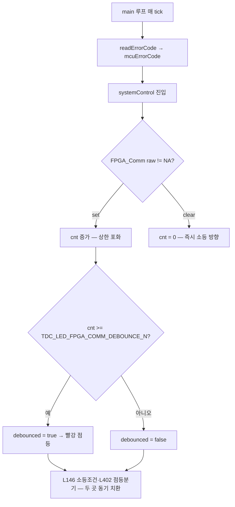

# 계획 — init 콜트리 errorCodeUpdate 디바운스 (개정판)

**TL;DR**: 워크플로우 적대적 검증 결과 초판 권장 관점 A(set측)는 SET↔CLEAR 진동 절반만 막아 reject. **은수님 목적(초반 과도기 LED 파르르르 제거) 확정 → ㉮ LED 표시측 디바운스 채택**(systemControl 1파일, 점등 연속 N·소등 즉시, init 콜트리·복구·앱 진단 무수정). 구현은 새 브랜치에서 진행.

> [!IMPORTANT]
> **결정 완료(2026-06-10)**: §4 게이트 0 = **㉮ LED 표시측** 확정(은수님 목적 = 초반 과도기 파르르르 제거). 게이트 1 = COMM만, 게이트 2 = **점등 연속 N·소등 즉시**, 게이트 3 = `#define` 기본값 은수님 실기 튜닝, 게이트 4 = 기존 카운터 무수정. 이하 §3 갈래 ㉮가 구현 대상.

---

## 1. 워크플로우 검증 요약 (13 에이전트, 833K tokens)

### 1.1 사실 검증 — 5건 전부 confirmed
분석.md §3 errorCodeUpdate 전수 표·§4 디바운스 현황·§6 LED 연결·콜트리 완전성이 **현재 working tree와 정확히 일치**. 정정 1건(minor): `earpieceUpate`는 공유 함수 미호출 + dead path → 범위 제외(분석.md §5 NOTE 반영). 보강: RF_PowerIC/CONFIG 플래그는 dead-read(분석.md §6 IMPORTANT).

### 1.2 설계 4안 적대적 비평 결과

| 안 | 판정 | 핵심 사유 |
|---|---|---|
| **A. 컨텍스트 플래그 + SET 단일 카운터** (초판 권장) | **reject** | 흔들림=SET↔CLEAR 진동인데 SET만 디바운스. clearErrorFlag(COMM) 3곳·change_isd_state 강등 미처리 → 진동 절반 잔존. "성공마다 리셋"이 교번 글리치에서 임계 도달 영구 차단 → 디바운스 무력화. 산발 카운터 13개 제거가 범위 밖 경로 디바운스 벗김(회귀) |
| **B. detailError 종류 기반** | **reject** | 리셋 훅(clearErrorFlag(COMM))이 3곳뿐 → 운영 루프 성공에서 카운터 리셋 안 됨(수용기준 5 위반). init 콜트리 한정 구조적 불가(계획 초판이 이미 기각한 옵션 C 재탕). 이중 디바운스 곱셈 지연(안전 리스크) |
| **C. 소비측 LED 판정 디바운스** (systemControl.c) | **recommend_with_changes** | 침습 최소(1파일+카운터1). SET/CLEAR 진동 동시 흡수. errorCode 원본 보존. 단 L146·L402 두 지점 동기 치환 필수, 점등/소등 비대칭 필요, 요구 ① 문언과 스코프 상이 |
| **D. 컨텍스트 게이트 + 포화 단일 카운터** | **recommend_with_changes** | 복구경로 불간섭(좋은 원칙). 단 리셋 매핑 오류(clear 3곳에 묶으면 가짜 에러 잔존), read_FPGA_FIFO_counter >10 관용 파괴(split-brain), tick당 2~3회 호출로 단일 카운터 무력화 |

**수렴점**: C·D 비평이 **공통으로 소비측 디바운스를 최선의 단순·견고 대안**으로 추천. 단 모두 "목적이 LED 증상인지 errorCode 노이즈인지 선결"을 전제.

## 2. 흔들림 원인 재정의 (분석.md §7)

- 흔들림 = **SET↔CLEAR 진동** + **change_isd_state 강등 재시작** 동역학. main 루프가 매 tick set/clear를 systemControl LED에 그대로 반영.
- **SET만 막으면 절반만 해결**. clearErrorFlag(COMM) 3곳(init_FPGA.c 내 case11·205·210)이 성공 순간 즉시 LED를 끔.
- change_isd_state는 errorCodeUpdate와 분리(다음 줄 인접) → **어느 디바운스 안이든 복구는 안 깨짐**.

## 3. 재설계 — 목적별 두 갈래

흔들림의 인과상, 올바른 안은 **목적**에 따라 갈린다. 이것이 최우선 결정 게이트다.

### 갈래 ㉮ — 목적이 "LED 흔들림 증상 제거" → **소비측 디바운스 (권장 1순위)**

systemControl LED 판정에서 COMM 플래그를 평활. **set/clear 진동을 한 지점에서 동시 흡수**.

- **변경**: `systemControl.c` 1파일 + `#define TDC_LED_FPGA_COMM_DEBOUNCE_N`(3~10) + `static uint8_t s_tdc_led_fpga_comm_err_cnt`.
- **필수 수정(비평 지적)**: `systemControl.c:146`(소등 AND체인)과 `:402`(점등 분기)의 `FPGA_CommunicationErrorFlag` 비교를 **둘 다** `debounced` 값으로 치환. 한 곳만 바꾸면 점등 도달 불가.
- **점등/소등 비대칭(안전)**: 점등은 빠르게(작은 N) 또는 즉시, **소등만 디바운스**하거나 그 반대 — 환자 안전상 "고장은 빨리 알리고, 흔들림(빠른 회복)만 평활"이 바람직. 방향은 은수님 확인.
- 장점: init 콜트리 13개 함수·clearErrorFlag 3곳·change_isd_state·범위 경계·공유 함수 **전부 무수정** → 회귀 표면 최소. errorCode 원본 보존(앱 진단 무손상). 비-init 경로(isd_interface.c 상태머신)의 COMM 점멸까지 덤으로 안정화.
- 단점: 요구 ① 문언("콜트리 errorCodeUpdate 디바운스")과 지점이 다름. errorCode 구조체 노이즈 자체는 남음(앱 device-status가 COMM을 폴링하면 미해결 — 단 현재 그런 소비처 미확인).

### 갈래 ㉯ — 목적이 "errorCode set 노이즈 자체 안정화" → **set측 in-place 임계 통일 (권장 2순위)**

errorCodeUpdate 구간을 정말 손대야 한다면, 비평이 짚은 함정(단일 카운터·리셋 매핑·FIFO >10)을 피하는 **가장 보수적** 형태:

- **카운터를 새로 통합하지 않는다.** 기존 함수별 `error_cnt` 13개의 **리셋(=0)을 기존 자리에 그대로 유지**(per-통신 성공 리셋이 정확히 동작하는 유일한 지점). 비평 D가 입증: clearErrorFlag(COMM) 3곳에 리셋을 묶으면 가짜 에러 잔존.
- **임계만 `#define` 1개로 통일** — `>3`/`>10` 혼재를 한 상수로. 단 `read_FPGA_FIFO_counter`의 `>10`은 **의도적 관용**(FIFO flaky)이므로 별도 상수(`..._FIFO`)로 보존 또는 통일값을 충분히 크게.
- **누락 함수에 동일 패턴 확산**: 디바운스 없는 통신 함수(check_FPGA_FIFO_empty, read_FPGA_backtelConfig, write_FPGA_clear_FIFO 등)에 같은 `error_cnt>임계` 패턴 추가 → 일관성 확보(요구 ④ 일부).
- **CLEAR 대칭 디바운스(흔들림 해결 필수)**: SET만으론 부족하므로, clearErrorFlag(COMM) 3곳도 "연속 K회 성공 후에만 clear"로 대칭 처리해야 진동이 멎음. ← 이 항을 빠뜨리면 ㉯도 흔들림 못 잡음.
- 단점: 침습 큼(다수 함수+clear 3곳 수정), 회귀 표면 큼. "콜트리 한정"을 위해 컨텍스트 게이트가 필요하나, 공유 함수가 isd_interface.c 상태머신에서도 쓰여 게이트 배치가 까다로움.

> 비평 종합 판단: **갈래 ㉮(소비측)가 ㉯(set측)보다 회귀 면적·견고성 모두에서 우월**. ㉯는 요구 ① 문언에 충실하나 본질 복잡도가 높고 흔들림 해결엔 CLEAR 대칭까지 필요.

## 4. 결정 게이트 (은수님 — 구현 전 선결)

| # | 질문 | 선택지 | 영향 |
|---|---|---|---|
| **0 (최우선)** | 흔들림을 어디서 잡나 | ㉮ LED 표시(소비측) / ㉯ errorCode set 노이즈(set측) | 전체 설계 갈림 |
| 1 | 디바운스 대상 | COMM만 / 전체 majorError | ㉮는 COMM만 가능(LED가 COMM만 봄). RF_PowerIC/CONFIG는 dead-read라 디바운스 무의미 |
| 2 | 점등/소등 대칭 | 점등 즉시·소등 평활 / 양방향 / 점등 평활 | 환자 안전(고장 인지 지연) vs 흔들림 |
| 3 | 임계 기본값 | 3 / 5 / 10 (`#define`) | FIFO `>10` 관용 별도 보존 여부 포함 |
| 4 | 기존 산발 카운터 13개 | ㉮ 채택 시 그대로 둠(무수정) / ㉯ 채택 시 임계 통일 | ㉮면 정리 불요(회귀 0), ㉯면 정리 대상 |

> 권장 묶음: **㉮ + COMM만 + (점등 즉시·소등 디바운스) + 기본 5 + 기존 카운터 무수정**. = 최소 침습으로 흔들림 제거, 안전성 보존, errorCode·복구·앱 진단 무손상.

## 5. 구현 단계 (목적 확정·승인 후 단계④)

### ㉮ 채택 시
1. `systemControl.c`에 `#define`(또는 error.h) + `static uint8_t s_tdc_led_fpga_comm_err_cnt`.
2. systemControl 진입부에서 `mcuErrorCode.FPGA_CommunicationErrorFlag` 기준 카운터 증감(포화) → `debounced` 산출.
3. L146 소등조건·L402 점등분기 **두 곳 동기** 치환(점등/소등 비대칭 규칙 반영).
4. 기존 init 코드·카운터 무수정(회귀 0 확인).

### ㉯ 채택 시
1. `#define` 임계(+ FIFO 별도 상수) 추가, 기존 13개 카운터 임계를 상수 참조로 치환.
2. 디바운스 누락 통신 함수에 동일 패턴 확산.
3. clearErrorFlag(COMM) 3곳 CLEAR 대칭 디바운스 추가.
4. (필요 시) 컨텍스트 게이트로 콜트리 한정 — isd_interface.c switch 3 case 감싸기(분석 §5 공유 함수 주의).

## 6. 검증 계획 (단계④ 후)
- **정적**: 빌드(은수님 Eclipse) · 디바운스 적용 전수 grep · 범위 밖/복구경로 비영향 확인 · L146·L402 동기 치환 확인(㉮) · 괄호/심볼 일관성. 서브에이전트 fan-out 병렬, 전수 PASS까지 루프(상한 3회).
- **실기**: I2C 간헐 실패 상황에서 ① 흔들림이 사라지는가 ② 만성 단선 시 빨강이 (지연 N 이내) 점등하는가 ③ 정상 연결이 안 깨지는가.

> ⚠️ 빌드·실기는 분석자 환경(WSL)에서 불가 — 은수님 환경 필수.
