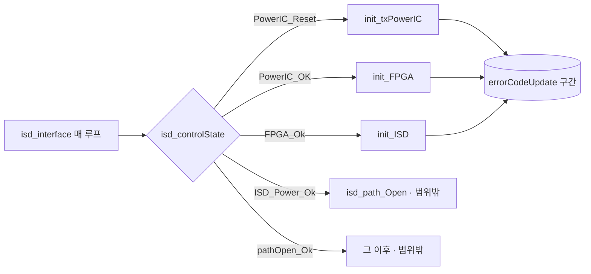

# 분석 — init 콜트리 errorCodeUpdate 현황

**TL;DR**: init 3함수 콜트리 내 `errorCodeUpdate()` 호출을 직접 grep으로 전수 확정(서브에이전트 라인 환각 배제). 현행 디바운스는 함수 레벨 `error_cnt` 8개(`>3`×7·`>10`×1)와 init 본문 명명 카운터 5개로 **산발 적용**, 임계 혼재·다수 누락. 범위 한정의 핵심 난점은 하위 통신 함수가 mapping/stimulation 등 **범위 밖에서도 공유 호출**된다는 점.

---

## 1. 분석 방법 (신뢰성 주의)

- 서브에이전트 fan-out으로 콜트리를 추출했으나 **라인 번호 불일치·존재하지 않는 변수명** 등 부정확이 있었다. 원인: 은수님이 리뷰 중에도 코드를 계속 수정해 파일이 실시간 진화 → 에이전트가 본 최신본과 분석자 이전 Read가 혼선.
- 따라서 **모든 구체 라인·majorError·디바운스 현황은 직접 `grep`/`Read`로 재확정**했다. 본 문서의 표는 2026-06-10 12:1x working tree 스냅샷 기준 ground truth.

## 2. 상태 머신 호출 구조

`isd_interface()` (`isd_interface.c:179~`)는 상태별로 init 함수를 분기 호출한다.

- 세 함수는 **순차 분기**이며 서로를 중첩 호출하지 않는다(`init_FPGA`가 `init_ISD`를 부르지 않음). 콜트리는 각자 독립.
- 실패 시 대부분 하위 함수가 `change_isd_state(en__isdStatus_PowerIC_OK)`로 상태를 강등 → 다음 루프에 앞 단계부터 재시도. 이 재시도 반복이 LED 흔들림의 동역학적 원인.

## 3. errorCodeUpdate 호출 전수 — init 콜트리 (ground truth)

> 파일 약어: `init` = `isd_interface_init_FPGA.c`, `fpga` = `isd_interface_FPGA.c`
> 디바운스 현황: `함수 error_cnt>N` = 하위 함수 자체 static 카운터 / `init본문 <이름>>3` = init 함수 본문 명명 카운터 / `없음` = 즉시 set

### 3.1 init_txPowerIC 콜트리

| 위치 | 호출 함수 | majorError | 맥락 | 디바운스 |
|---|---|---|---|---|
| init:72 | init_txPowerIC 본문(case 10) | RF_PowerIC / NON_RESETTABLE | `Reset_REN_ISL9122()` 실패 | 없음 |
| fpga:459/479/512 | read_txPowerLevel(보드 1_2/1_4+/1_3) | RF_PowerIC / I2C_RFPOW_Read | I2C 읽기 실패 | 없음 |
| fpga:789/806/831/841 | write_change_TxPowerLevel(보드별) | RF_PowerIC / I2C_RFPOW_Write | I2C 쓰기 실패 | 없음 |

### 3.2 init_FPGA 콜트리

| 위치 | 호출 함수 | majorError | 맥락 | 디바운스 |
|---|---|---|---|---|
| init:186 | init_FPGA 본문(case 11) | FPGA_COMM / FPGA_ResetValueError | 리셋 후 상태값 불일치 | init본문 `no_reset_value_error_cnt>3` |
| init:252 | init_FPGA 본문(case 20) | FPGA_CONFIG / RegisterConfig | PCM 상태 불일치 | init본문 `no_disabled_rf_error_cnt>3` |
| fpga:670 | write_FPGA_reset | FPGA_COMM / I2C_Write | I2C 쓰기 실패 | 함수 `error_cnt>3` |
| fpga:156 | read_FPGA_version | FPGA_COMM / I2C_Read | I2C 읽기 실패 | 함수 `error_cnt>3` |
| fpga:182 | read_FPGA_systemResgister_1st | FPGA_COMM / I2C_Read | I2C 읽기 실패 | 함수 `error_cnt>3` |

### 3.3 init_ISD 콜트리

| 위치 | 호출 함수 | majorError | 맥락 | 디바운스 |
|---|---|---|---|---|
| init:350 | init_ISD 본문(case 200) | FPGA_CONFIG / RF_Tx_enableError | RF TX 활성화 실패 | init본문 `inner_rf_tx_error_cnt>3` |
| init:372 | init_ISD 본문(case 200) | FPGA_CONFIG / RF_Tx_enableError | RF TX 비활성화 실패 | init본문 `outer_rf_tx_error_cnt>3` |
| init:421 | init_ISD 본문(case 205) | RF_PowerIC / writtenReadVlaueIsNotSame | TX 파워 값 불일치 | 없음 |
| init:449 | init_ISD 본문(case 205) | FPGA_CONFIG / PulseWidthDifferent | 펄스폭 불일치 | init본문 `pulse_width_error_cnt>3` |
| init:501 | init_ISD 본문(case 210) | FPGA_CONFIG / FIFO_NotCleared | FIFO 미클리어 | 없음 |
| init:524 | init_ISD 본문(case 210) | FPGA_CONFIG / RegisterConfig | 백텔 레지스터 불일치 | 없음 |
| init:655 | init_ISD 본문(case 260) | ISD / BackTelCounterZero | 백텔 응답 없음 | 없음 |
| fpga:239 | check_FPGA_PCM_Error | FPGA_COMM / I2C_Read | I2C 읽기 실패 | 함수 `error_cnt>3` |
| fpga:765 | write_FPGA_disable_RF_tx | FPGA_COMM / I2C_Write | I2C 쓰기 실패 | 없음 |
| fpga:738 | is_RF_tx_eanble | FPGA_COMM / I2C_Read | I2C 읽기 실패 | 함수 `error_cnt>3` |
| fpga:703 | write_FPGA_enable_RF_tx | FPGA_COMM / I2C_Write | I2C 쓰기 실패 | 함수 `error_cnt>3` |
| fpga:338 | read_FPGA_PulseWidth | FPGA_COMM / I2C_Read | I2C 읽기 실패 | 함수 `error_cnt>3` |
| fpga:402 | read_FPGA_backtelConfig | FPGA_COMM / I2C_Read | I2C 읽기 실패 | 없음 |
| fpga:869 | write_FPGA_clear_FIFO | FPGA_COMM / I2C_Write | I2C 쓰기 실패 | 없음 |
| fpga:273 | check_FPGA_FIFO_empty | FPGA_COMM / I2C_Read | I2C 읽기 실패 | 없음 |
| fpga:363 | read_FPGA_FIFO_counter | FPGA_COMM / I2C_Read | I2C 읽기 실패 | 함수 `error_cnt>10` ⚠ |
| fpga:440 | read_FPGA_backtel_FIFO | FPGA_COMM / I2C_Read | I2C 읽기 실패 | 없음 |
| fpga:311 | read_FPGA_backtelError_Flag | FPGA_COMM / I2C_Read | I2C 읽기 실패 | 없음 |

## 4. 현행 디바운스 산발 현황 (문제의 핵심)

### 4.1 함수 레벨 `error_cnt` — `isd_interface_FPGA.c` 8개

| 함수 | 선언 line | 임계 |
|---|---|---|
| read_FPGA_version | 139 | `>3` |
| read_FPGA_systemResgister_1st | 165 | `>3` |
| check_FPGA_PCM_Error | 211 | `>3` |
| read_FPGA_PulseWidth | 320 | `>3` |
| read_FPGA_FIFO_counter | 347 | **`>10`** |
| write_FPGA_reset | 650 | `>3` |
| write_FPGA_enable_RF_tx | 681 | `>3` |
| is_RF_tx_eanble | 713 | `>3` |

### 4.2 init 본문 명명 카운터 — `isd_interface_init_FPGA.c` 5개

| 변수 | 선언 line | 위치 | 임계 |
|---|---|---|---|
| no_reset_value_error_cnt | 175 | init_FPGA case 11 | `>3` |
| no_disabled_rf_error_cnt | 229 | init_FPGA case 20 | `>3` |
| outer_rf_tx_error_cnt | 329 | init_ISD case 200 | `>3` |
| inner_rf_tx_error_cnt | 342 | init_ISD case 200 | `>3` |
| pulse_width_error_cnt | 400 | init_ISD case 205 | `>3` |

### 4.3 문제점

1. **누락 다수**: init_ISD 콜트리만 봐도 `read_FPGA_backtelConfig`·`write_FPGA_clear_FIFO`·`check_FPGA_FIFO_empty`·`read_FPGA_backtel_FIFO`·`read_FPGA_backtelError_Flag`·`write_FPGA_disable_RF_tx`·`read_txPowerLevel`·`write_change_TxPowerLevel` 및 init 본문 case 205/210/260의 일부가 **즉시 set**. 정작 첫 분석의 흔들림 발생원 case 210·260 경로에 누락이 몰려 있다.
2. **임계 불일치**: 대부분 `>3`인데 `read_FPGA_FIFO_counter`만 `>10`.
3. **카운터 난립**: 동일 목적 카운터가 `error_cnt`·`no_reset_value_error_cnt` 등 13개로 분산. 유지보수·일관성 저하.
4. **공유 함수 누적 간섭**: 함수 레벨 `static`은 범위 밖(mapping 등) 호출과 카운터를 공유 → init 컨텍스트 외 성공/실패가 카운터를 오염.

## 5. 범위 한정의 난점 — 공유 함수

init 콜트리의 하위 통신 함수 대부분(`read_FPGA_*`·`write_FPGA_*`·`read_txPowerLevel`·`write_change_TxPowerLevel` 등)은 **`isd_path_Open`·`enableStimul_10v`(`isd_interface_init_ISD.c`)·`isd_interface_mapping_*`(5개 파일)·`stimulationParaSetting`·`initialize.c`, 그리고 `isd_interface.c` 자신의 정상 상태머신 경로(예: `read_FPGA_PulseWidth`:301/455/658)에서도 호출**된다(grep 전수 확인). 따라서:

> [!NOTE]
> **정정(워크플로우 검증)**: 본 초판이 범위 밖 공유 호출처로 나열했던 `earpieceUpate`는 명명 공유 함수를 **하나도 호출하지 않는다**(자체 저수준 `read_ISD_by_CM3_I2C`/`cfx_i2c_read` 직접 사용, `errorCodeUpdate(COMM)`은 `earpieceUpate.c:99`에서 직접). 게다가 그 호출 경로(`updateEarPieceStatus`)는 `main.c:481`에서 주석 처리된 **dead path**다. 따라서 earpiece는 본 작업 범위·회귀 고려에서 제외한다. 반면 `isd_interface.c` 자체 상태머신 경로는 공유 함수를 다수 호출하므로 범위 경계 판단 시 반드시 함께 고려해야 한다.

- 단순히 "그 함수 안에서 디바운스"하면 **범위 밖 호출도 디바운스**되어 은수님의 "init 콜트리 한정" 요구와 어긋난다.
- "init 컨텍스트일 때만" 카운트하려면 호출 컨텍스트를 식별하는 장치(전역 플래그 등)가 필요하다. → 계획.md §설계 옵션에서 다룬다.

비공유(init_ISD 전용) 함수는 `write_FPGA_disable_RF_tx`·`is_RF_tx_eanble`·`write_FPGA_enable_RF_tx` 정도로 소수.

## 6. LED 연결 관계 (디바운스 대상 판단 근거)

- `systemControl.c:144` LED 소등 판정은 `dataProcessing`·`accelerometer`·**`FPGA_Communication`**·`data_logging` 4개 플래그만 본다. init 콜트리에서 흔한 `FPGA_CONFIGUARATION`·`RF_PowerIC`·`ISD` 에러는 **LED에 직접 영향 없음**.
- 즉 "LED 흔들림"만이 목적이라면 디바운스 대상은 `en__FPGA_COMMUNICATION_ERROR`로 충분. 다만 은수님 표현("errorCodeUpdate 구간")은 더 넓을 수 있어 결정 필요(계획.md).

> [!IMPORTANT]
> **워크플로우 검증 강화 근거**: `RF_PowerIC`(`PowerIcErrorFlag`)·`CONFIG`(`FPGA_ConfiguraionErrorFlag`) 플래그는 `error.c` **밖에서 read 0건인 완전 dead-read 필드**다(LED·앱·부저 어디서도 소비 안 함). `ISD_ErrorFlag`만 `mappingControl.c:2081` device-status 앱 패킷으로 전송되나 이는 매핑 컨텍스트(init 아님). 따라서 **init_txPowerIC를 디바운스해도 LED와 완전 무관**(RF_PowerIC만 냄). LED 흔들림 해소가 목적이면 COMM 디바운스만으로 충분하다는 §6 결론은 코드로 확정됨.

## 7. 흔들림의 진짜 원인 재정의 (워크플로우 검증 핵심 발견)

초판 분석은 "errorCodeUpdate(SET) 1회로 LED가 켜진다"에 초점을 뒀으나, 워크플로우 적대적 검증이 **흔들림의 인과를 더 정확히** 짚었다.

### 7.1 흔들림 = SET ↔ CLEAR 진동

- main 루프는 매 tick `readErrorCode()`(main.c:387) → `systemControl()`(LED 판정, main.c:438) → `isd_interface()`(init, main.c:452) 순서로 돈다.
- init 콜트리가 통신 실패 시 `errorCodeUpdate(COMM)`로 **set**, 통신 성공 시 `clearErrorFlag(en__FPGA_COMMUNICATION_ERROR)`로 **즉시 clear**. 이 clear는 `isd_interface_init_FPGA.c` **3곳**에만 존재: init_FPGA case 11(L197 부근), init_ISD case 205(L404 부근), init_ISD case 210(L487 부근) — 모두 은수님 1차 수정으로 추가된 것.
- I2C가 간헐 실패하면 tick마다 set→clear가 토글되고, 바로 다음 tick `systemControl`이 그대로 LED에 반영(`LED_ST_ERROR_FPGA` ↔ `LED_ST_NONE`) → **빨강 점멸**.

### 7.2 change_isd_state 강등 동역학

- 모든 COMM 실패 경로는 `errorCodeUpdate`와 **무관하게** `change_isd_state(en__isdStatus_PowerIC_OK)`로 상태를 강등 → 다음 tick init 재시작. 이 재시도 반복도 흔들림의 동역학적 축이다.
- **중요(좋은 소식)**: `change_isd_state` 호출은 모든 COMM `errorCodeUpdate` site **바로 다음 줄**에 인접(fpga.c:156→158, 182→184, 239→241 …). 즉 **errorCodeUpdate만 디바운스해도 상태머신 복구·강등은 100% 보존**된다.

### 7.3 함의 (설계 방향 전환)

| 발견 | 설계 함의 |
|---|---|
| 흔들림은 SET↔CLEAR 진동 | **SET만 디바운스(초판 권장 관점 A)는 진동의 절반만 막음** → 불완전 |
| LED는 매 tick COMM 플래그만 평가 | **소비측(systemControl LED 판정)에서 디바운스**하면 SET/CLEAR 진동을 한 지점에서 동시 흡수 |
| change_isd_state는 errorCodeUpdate와 분리 | 복구 경로는 디바운스와 독립 — 어느 안이든 복구는 안 깨짐 |
| `read_FPGA_FIFO_counter`는 의도적 `>10` 관용 | FIFO는 본질적으로 flaky → 일괄 통일 시 이 관용을 깎으면 **회귀** |
| init_ISD case 0·200은 한 tick에 COMM site 2~3회 호출 | **단일 카운터**는 1 tick에 임계 초과 → 디바운스 무력화 위험 |
