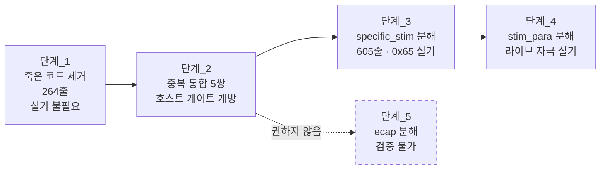

# 분석 - isd 대형 함수 분해

**TL;DR**: `isd/` 8,849줄 중 덩치는 세 파일에 몰려 있고, 공통 성격은 **«거대 함수 하나 = 파일 하나»** 다. 가장 큰 `tdc_isd_map_ecap.c` 는 **호스트·실기 두 게이트가 모두 닫혀 있어 분해해도 검증할 수 없고**, 그 15.5%가 죽은 코드다. **분해보다 먼저 할 일이 있다** — 죽은 코드 264줄 제거와 `stimulationMode` 중복 5쌍 통합이며, 후자는 **닫혀 있던 호스트 게이트를 여는 통로**다. 분해 1순위는 `specific_stim`(605줄 단일 함수, 0x65 로 실기 가능, 폭발 반경 작음)이다.

## 1. 대상 실측

### 1.1 후보 선별 - 지표는 줄 수가 아니라 «줄 수 / 함수 수»

`src/2__cm3/source` 의 `.c` 68개 중 500줄 이상은 26개다. 상위 후보를 실측했다.

| 파일 | 줄 | 함수 | **줄/함수** | 판정 |
|---|---|---|---|---|
| `lib/SEGGER_RTT/SEGGER_RTT.c` | 2,285 | — | — | **제외** (벤더) |
| `isd/tdc_isd_map_ecap.c` | 1,519 | **2** | **760** | **대상_1** |
| `isd/tdc_isd_stim_para_setting.c` | 1,178 | 6 | **196** | **대상_2** |
| `main.c` | 1,121 | **44** | 25 | 제외 |
| `ui/tdc_ui_command.c` | 958 | **35** | 27 | 제외 |
| `isd/tdc_isd_map_specific_stim.c` | 629 | **1** | **629** | **대상_3** |

> [!IMPORTANT]
> **전제_뒤집힘_1**: 줄 수만 보면 `main.c`(1,121)가 3위지만 **함수가 44개**라 이미 분해돼 있다. `ui_command.c` 도 35함수에 명령 테이블 구조다. **줄 수는 분해 필요성의 지표가 아니다.**
>
> 자산_3(«이월 항목의 전제는 착수 시점에 자주 뒤집힌다»)이 또 맞았다. 이번이 4번째다.

### 1.2 `isd/` 모듈 전경

| 파일 | 줄 | 죽은 코드 |
|---|---|---|
| `tdc_isd_map_ecap.c` | 1,519 | **235 (15.5%)** |
| `tdc_isd_stim_para_setting.c` | 1,178 | 10 (0.8%) |
| `tdc_isd_map_data.c` | 964 | 미조사 |
| `tdc_isd_init.c` | 962 | 미조사 |
| `tdc_isd_map_live.c` | 809 | 미조사 |
| `tdc_isd.c` | 674 | 미조사 |
| `tdc_isd_map_impedance.c` | 664 | 미조사 |
| `tdc_isd_fpga.c` | 664 | 미조사 |
| `tdc_isd_init_fpga.c` | 647 | 미조사 |
| `tdc_isd_map_specific_stim.c` | 629 | 19 (3.0%) |
| `tdc_isd_stim_standalone.c` | 139 | 미조사 |
| **합계** | **8,849** | |

## 2. 발견_1 - `ecap` 은 두 게이트가 모두 닫혀 있다

이것이 이 분석의 **가장 중요한 결과**다.

### 2.1 호스트 게이트 - 닫힘

`tests/unit/run.sh` 가 컴파일하는 소스는 `COMMON_SRC` 와 `TEST_TARGETS` 둘뿐이다.

```sh
COMMON_SRC=( "$HERE/stub_ble.c"  "$SRC/ble/tdc_ble_reply.c" )       # run.sh:129~132
TEST_TARGETS=( [map_measure]=... [map_flash]=... [map_stim]=... [remote]=... )  # run.sh:140~145
```

**`isd/` 의 `.c` 는 하나도 없다.** `-I "$SRC/isd"`(run.sh:109)는 **include 경로일 뿐** 컴파일 대상이 아니다.

> [!CAUTION]
> **`-I` 를 커버리지로 오해하기 쉽다.** 헤더는 읽지만 `.c` 는 링크되지 않는다. 431 PASS 는 `isd/` 를 **한 줄도** 검증하지 않는다.

### 2.2 실기 게이트 - 닫힘

`tdc_isd_map_ecap_step()` 의 호출처는 전수로 **두 곳**이다.

| 위치 | 상태 |
|---|---|
| `ble/mapping/tdc_ble_mapping.c:389` | `case en__mapping_eCAP_Measurement_masking:` 안에서 **호출** |
| `ble/mapping/tdc_ble_mapping.c:403` | `case en__mapping_eCAP_Measurement_alternative:` 안에서 **주석 처리** |

그리고 [`상시 점검 대장.md`](../../../상시%20점검%20대장.md) §2.1 표의 «앱 사용» 열이 0x63(masking)·0x64(alternative) 둘 다 **«사용 X»** 다(2026-07-30 전수 조사).

**즉 `tdc_isd_map_ecap_step()` 은 실기에서도 실행되지 않는다.**

### 2.3 이 판정이 뜻하는 것

| 관점 | 결론 |
|---|---|
| 분해 **위험** | **거의 0** — 실행되지 않는 코드다 |
| 분해 **효용** | **낮다** — 지금 아무도 쓰지 않는다 |
| 분해 **검증** | **불가능** — 두 게이트가 다 닫혀 확인할 방법이 없다 |

> [!WARNING]
> **«위험이 0이니 마음껏 해도 된다» 가 아니다.** 검증할 수 없다는 것은, 언젠가 eCAP 기능을 켜는 날 **분해 때 심은 결함이 그때 처음 드러난다**는 뜻이다. 위험이 사라진 게 아니라 **미래로 미뤄진다.**
>
> 위험_1(0x63 파싱 검사) 때 같은 구조에서 «파싱이 유일하게 검증 가능한 위치» 라는 이유로 조치 위치를 옮겼다. 여기서는 옮길 곳이 없다.

## 3. 발견_2 - `stimulationMode` 인코딩이 3파일 5쌍 중복

### 3.1 중복 위치 전수

같은 «자극 모드 → 레지스터 비트» 변환이 **쌍(기준전극 2비트 + 출력모드 2비트)** 단위로 5번 나타난다.

| # | 파일 | 기준전극 스위치 | 출력모드 스위치 |
|---|---|---|---|
| 1 | `tdc_isd_map_ecap.c` | `:858` | `:879` |
| 2 | `tdc_isd_map_ecap.c` | `:1081` | `:1103` |
| 3 | `tdc_isd_map_specific_stim.c` | `:368` | `:386` |
| 4 | `tdc_isd_stim_para_setting.c` | `:189` | `:211` |
| 5 | `tdc_isd_stim_para_setting.c` | `:907` | `:928` |

전수 근거: `grep -rn "en__referenceNA"` 와 `grep -rn "en__semi_simultaneously"` 가 각각 위 지점만 낸다.

### 3.2 내용이 의미상 동일하다

`ecap:858~897` 과 `stim_para:189~231` 을 대조하면 차이는 셋뿐이다.

| 차이 | 내용 |
|---|---|
| 입력 표현 | `mappingPacket->eCapMeasurement.stimulationMode` vs `p_mapdata->stimulationMode` |
| 공백·주석 배치 | 의미 없음 |
| 후속 1줄 | `stim_para` 만 `sent_stimulConfig = w_isd_registerValue & 0xFF;` 추가 |

**분기 구조·상수·순서가 전부 같다.** 공통 함수 2개로 접을 수 있다.

```c
/* 제안 (구현 아님) */
static int tdc_isd_pack_reference_mode(EN___STIMULATION_MODE mode);    /* 기준전극 2비트 */
static int tdc_isd_pack_stim_output_mode(EN___STIMULATION_MODE mode);  /* 출력모드 2비트 */
```

### 3.3 관찰 - 출력모드 스위치에 `default` 가 없다

5쌍 전부, 출력모드 스위치는 6개 `case` 만 있고 `default` 가 없다.

```c
switch (mode) {
    case en__monopolr_body: case en__monopolr_rod: case en__monopolr_BothRodBody:
        w_isd_registerValue |= 0; break;
    case en__bipolar:              w_isd_registerValue |= 1; break;
    case en__commonground:         w_isd_registerValue |= 2; break;
    case en__semi_simultaneously:  w_isd_registerValue |= 3; break;
    /* default 없음 */
}
```

바로 앞에서 `w_isd_registerValue <<= 2` 를 하므로, 범위 밖 값이 오면 **아무것도 OR 되지 않아 하위 2비트가 0** = 모노폴라로 조용히 동작한다.

> [!NOTE]
> **이것을 결함으로 단정하지 않는다.** `EN___STIMULATION_MODE` 는 `en__referenceNA = 0` 부터 `en__semi_simultaneously = 6` 까지이고(`cfx_link/tdc_shm.h:67~76`), 0(`referenceNA`)만이 미처리 값이다. **0 이 실제로 도달 가능한지는 확인하지 않았다.**
>
> - 0x63·0x64 파싱은 2026-08-05 부터 1~6 을 강제한다
> - `stim_para_setting` 의 `p_mapdata` 는 **플래시 맵 데이터**에서 온다. 초기화 전·손상 시 0 이 될 수 있는지는 **미조사**
>
> 착수 조건: `p_mapdata->stimulationMode` 의 생산 경로를 역추적해 0 도달 가능성을 판정한 뒤에 방어 여부를 정한다. **지금 방어를 넣는 것은 근거가 부족하다**(제약_4 · HW 5게이트 «불확실성 명시»).

## 4. 발견_3 - `ecap` 의 15.5%가 컴파일되지 않는다

### 4.1 계량

`#if 0` / `#else` / 중첩을 추적해 **실제로 컴파일되지 않는 줄**을 셌다.

| 파일 | 전체 | 죽은 줄 | 비율 |
|---|---|---|---|
| `tdc_isd_map_ecap.c` | 1,519 | **235** | **15.5%** |
| `tdc_isd_map_specific_stim.c` | 629 | 19 | 3.0% |
| `tdc_isd_stim_para_setting.c` | 1,178 | 10 | 0.8% |

`ecap` 의 죽은 구역 10곳이다.

| 구역 | 줄 범위 | 크기 | 소속 |
|---|---|---|---|
| `#if 0` | 394~398 | 3 | `case 1` |
| `#if 0` | 405~415 | 9 | `case 1` |
| `#if 0` | **528~589** | **60** | `case 4` |
| `#if 0` | 608~612 | 3 | `case 4` |
| `#if 0` | 619~633 | 13 | `case 4` |
| `#else` | 771~773 | 1 | `case 5` (`#if 1` 의 뒷가지) |
| `#if 0` | 934~939 | 4 | `case 5` |
| `#if 0` | **1247~1285** | **37** | `switch` 밖 |
| `#if 0` | **1334~1435** | **100** | `switch` 밖 |
| `#if 0` | 1446~1454 | 7 | `switch` 밖 |

> [!CAUTION]
> **계량 방법이 함정이다.** 첫 시도에서 `#if 0`~`#endif` 를 단순 매칭했다가 틀린 값(267줄)을 냈다. `#if 0 ... #else ... #endif` 에서는 **앞 가지**가, `#if 1 ... #else ... #endif` 에서는 **뒷 가지**가 죽는다. 중첩(`528` 안의 `554~563`)도 이중 계산된다.
>
> 이것은 **자산_6**(«검증 도구의 실패 모드는 틀린 값이 아니라 매번 다른 방식»)의 새 사례다.

### 4.2 죽은 코드를 먼저 지우면 대상이 줄어든다

235줄을 제거하면 `ecap` 은 1,519 → **1,284줄**이 된다. 분해 대상 자체가 15% 작아진다.

**그리고 이 제거는 두 게이트가 닫혀 있어도 안전하다** — 컴파일되지 않던 줄이므로 `.text` 가 바뀌지 않아야 하고, **그것이 검증 수단이 된다**(§6.1).

## 5. 발견_4 - `switch` 밖에 275줄이 더 있다 (자산_5 함정)

`tdc_isd_map_ecap_step()`(100~1519)의 구조다.

| 구간 | 줄 범위 | 크기 |
|---|---|---|
| 머리 (변수·초기화) | 100~168 | 69 |
| `switch (flowCounter)` `case 0` | 172~384 | 213 |
| `case 1` | 385~434 | 50 |
| `case 2` | 435~481 | 47 |
| `case 3` | 482~518 | 37 |
| `case 4` | 519~646 | 128 |
| **`case 5`** | 647~953 | **307** |
| **`case 6`** | 954~1202 | **249** |
| `case 7` | 1203~1217 | 15 |
| `case 8` | 1218~1237 | 20 |
| `default` | 1238~1240 | 3 |
| **`switch` 밖 `if (flowCounter == backtelStart_flowCounter)`** | **1242~1516** | **275** |
| `flowCounter++;` | 1518 | 1 |

> [!CAUTION]
> **`case` 기준으로 기계 추출하면 마지막 275줄이 통째로 빠진다.**
>
> 자산_5 가 기록한 두 사례와 **완전히 같은 유형**이다.
> - 이월_F: 0x64 경계 케이스 4건 누락
> - 이월_2: 0x40 — `case` 가 아니라 게이트 밖 `if` 라서 누락
>
> **세 번째다.** 이제는 «`switch` 밖에 뭐가 있는지 먼저 본다» 를 절차로 고정해야 한다.

`case 5`·`case 6` 은 내부에 `stimulPattern_index` 스위치와 `stimulationMode` 스위치를 각각 품은 **4~5중 중첩**이다. 다만 둘의 바깥 로직은 다르다(`case 5` = eCAP 샘플링 레지스터 설정, `case 6` = 인터벌 템플릿 생성)이므로 **서로의 복제는 아니다.**

## 6. 착수 순서 제안

**분해가 마지막이다.** 앞의 두 단계가 대상을 줄이고 검증 수단을 만든다.

### 6.1 단계_1 - 죽은 코드 제거 (권장 1순위)

| 항목 | 내용 |
|---|---|
| 대상 | `ecap` 235줄 · `specific_stim` 19줄 · `stim_para` 10줄 |
| 효과 | `ecap` 1,519 → 1,284줄 |
| **검증** | **`.text`/`.data` 바이트 동일** — 컴파일되지 않던 줄이므로 |
| 위험 | 낮음. 다만 `#if 0` 안에 «나중에 되살릴 참고 코드» 가 있을 수 있어 **은수님 확인 필요** |

> [!IMPORTANT]
> **자산_1·자산_2 를 적용한다.**
> - 불변량은 `.elf` md5 가 **아니라** 로드 섹션 바이트 동일이다(자산_2)
> - 줄이 밀리면 `__LINE__` 즉치가 바뀐다. `TDC_PRINTF_*` 가 `util/tdc_printf.h:36` 에서 `__LINE__` 을 품기 때문이다(자산_1)
>
> **따라서 «죽은 코드 제거» 는 줄을 미는 편집이라 `.text` 가 바뀐다.** 바이트 동일을 기대하려면 **제거 대신 파일 끝으로 몰거나**, 아니면 **`.text` 차이가 `__LINE__` 즉치뿐임을 `cmp -l` 로 전수 입증**해야 한다. 후자가 정직하다.

### 6.2 단계_2 - `stimulationMode` 중복 통합

| 항목 | 내용 |
|---|---|
| 대상 | 3파일 5쌍 (스위치 10블록) |
| 효과 | **약 150줄 순감소** + **인코딩 규칙이 한 곳에 모인다** |
| **검증** | 호스트 테스트 신설 가능 — **순수 함수**라 shim 없이 링크된다 |
| 위험 | 중. 자극 본체를 건드린다 |

효과 계산: 한 쌍이 35~43줄(`specific_stim:368~402` = 35, `ecap:858~896` = 39, `stim_para:189~231` = 43)이라 5쌍 ≈ 195줄. 공통 함수 2개 + 호출부 5곳 ≈ 40줄이 새로 생기므로 순감소 약 150줄이다.

> [!NOTE]
> **이 단계가 호스트 게이트를 여는 첫 통로다.** 뽑아낼 두 함수는 `EN___STIMULATION_MODE` 만 받아 `int` 를 내는 **순수 함수**라 `isd/` 의 의존 사슬(shm·i2c·FPGA)을 타지 않는다. `tests/unit/` 에 6개 모드 × 2함수 = 12케이스를 바로 붙일 수 있다.
>
> **즉 §2 에서 «닫혀 있다» 고 판정한 호스트 게이트를, 이 작업 자체가 부분적으로 연다.**

> [!IMPORTANT]
> **조건 — 새 파일로 떼야 한다.** 두 함수를 `isd/` 의 기존 `.c` 안에 두면 그 파일 전체를 링크해야 해서 게이트가 안 열린다. `isd/tdc_isd_stim_mode_encode.c` 같은 **새 파일**이어야 `run.sh` 의 `TEST_TARGETS` 에 단독으로 넣을 수 있다.

### 6.3 단계_3 - `specific_stim` 분해

`tdc_isd_map_specific_stim_step()`(`:25~629`, **605줄 단일 함수**)를 상태별로 나눈다.

| 항목 | 내용 |
|---|---|
| **검증** | **실기 가능** — 0x65 는 앱이 보내고 2026-07-30 실기 확인 이력이 있다(대장 §4) |
| 위험 | **중.** 매핑(피팅) 중에만 쓰이는 진단 기능이라 일상 청취를 막지 않는다 |
| 선행 | 단계_2 |

> [!IMPORTANT]
> **이 파일이 `stim_para_setting` 보다 먼저인 이유** — 세 지표가 전부 같은 방향이다.
>
> | 지표 | `specific_stim` | `stim_para_setting` |
> |---|---|---|
> | 줄/함수 | **629** (1함수) | 196 (6함수) |
> | 실기 | 가능 (0x65) | 가능 (라이브) |
> | 폭발 반경 | 특정자극만 | **모든 자극** |
>
> 분해 효용은 더 크고 실패 시 피해는 더 작다.

### 6.4 단계_4 - `stim_para_setting` 분해

`monopolar`(355줄) · `bipolar`(739줄)를 `flowControlCounter` 상태별로 나눈다. 리모콘 `step()` 분해와 **같은 형태**다(이월_2 선례).

| 항목 | 내용 |
|---|---|
| **검증** | **실기 가능** — 라이브 자극이 매번 지나는 경로(`tdc_isd_map_live.c:161`·`:549`·`:588`·`:731`) |
| 위험 | **높음.** 자극 본체. 실패하면 소리가 안 난다 |
| 선행 | 단계_2 · 단계_3 (같은 형태를 낮은 위험에서 먼저 연습한다) |

### 6.5 단계_5 - `ecap` 분해 (권장하지 않음, 마지막)

| 항목 | 내용 |
|---|---|
| **검증** | **불가능** (§2) |
| 효용 | 낮음 — 실행되지 않는 코드 |
| 함정 | `switch` 밖 275줄 (§5) |

> [!WARNING]
> **§2.3 의 결론을 다시 적는다.** 검증할 수 없는 분해는 위험을 없애는 게 아니라 **eCAP 을 켜는 날로 미룬다.** 단계_1(죽은 코드 제거)만 하고 분해는 **eCAP 기능을 실제로 쓸 계획이 생길 때** 착수하는 것이 맞다.

### 6.6 순서 요약



| 단계 | 대상 | 실기 | 위험 |
|---|---|---|---|
| 1 | 죽은 코드 264줄 제거 | 불필요 | 낮음 (`#if 0` 보존 여부만 확인) |
| 2 | `stimulationMode` 중복 5쌍 통합 | 자극 1회 | 중 |
| 3 | `specific_stim` 605줄 분해 | 0x65 1회 | 중 |
| 4 | `stim_para_setting` 분해 | 라이브 자극 | **높음** |
| 5 | `ecap` 분해 | **불가** | 권하지 않음 |

## 7. 발견_5 - 오탐 배제 기록

다음 사람이 같은 조사를 반복하지 않도록 남긴다.

### 오탐_1 - `| en__referenceNA` 는 결함이 아니다

`ecap:873`·`:1096` 등의 `default` 절이 이렇게 돼 있다.

```c
default:
    w_isd_registerValue = w_isd_registerValue | en__referenceNA;  // 리셋값이 3이며, 바이폴라, 공통접지, 동시 자극의 경우는 접지를 끊는다.
```

`en__referenceNA = 0`(`tdc_shm.h:69`)이라 이 OR 는 **아무 일도 하지 않는다.** 주석의 «리셋값이 3» 과 어긋나 보인다.

**어긋나지 않는다.** 이 2비트 필드의 인코딩은 열거형 값 그대로다.

| 값 | 의미 |
|---|---|
| 0 | `en__referenceNA` — 기준전극 없음 (접지 끊김) |
| 1 | `en__monopolr_body` |
| 2 | `en__monopolr_rod` |
| 3 | `en__monopolr_BothRodBody` — **하드웨어 리셋값** |

주석은 «HW 리셋값이 3(both)이니 접지를 끊으려면 **명시적으로 0을 써야 한다**» 는 뜻이다. 앞에서 `<<= 2` 로 하위 2비트를 이미 0으로 만들었으므로 `| 0` 은 **의도를 문서화하는 no-op** 이다. **코드와 주석이 일치한다.**

### 오탐_2 - `-I "$SRC/isd"` 는 커버리지가 아니다

§2.1 참조. `run.sh` 의 include 경로에 `isd` 가 있어 «테스트된다» 고 오해하기 쉽다.

## 8. 근거 목록

| 주장 | 근거 |
|---|---|
| `ecap` 함수 2개 | `tdc_isd_map_ecap.c:36`·`:100` |
| `ecap_step` 호출처 2곳 | `tdc_ble_mapping.c:389`(호출)·`:403`(주석) |
| 앱이 0x63·0x64 미사용 | [`상시 점검 대장.md`](../../../상시%20점검%20대장.md) §2.1 |
| 호스트가 `isd/` 미컴파일 | `tests/unit/run.sh:129~132`(COMMON_SRC)·`:140~145`(TEST_TARGETS) |
| 중복 5쌍 | `grep -rn "en__referenceNA"` · `grep -rn "en__semi_simultaneously"` 전수 |
| 죽은 코드 235줄 | `#if`/`#else`/중첩 추적 스크립트 |
| `switch` 밖 275줄 | `tdc_isd_map_ecap.c:1242~1516` |
| `EN___STIMULATION_MODE` 0~6 | `cfx_link/tdc_shm.h:67~76` |
| `__LINE__` 이 `TDC_PRINTF` 에 숨음 | `util/tdc_printf.h:36` (자산_1) |
