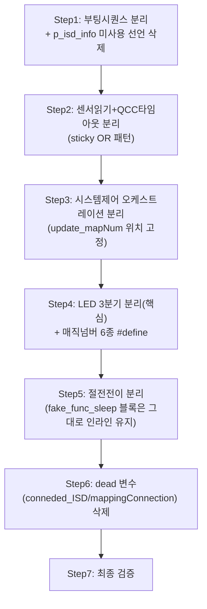

# 계획: func_normal() 리팩토링

**TL;DR**: `func_normal()`(`main.c:334-742`)을 결합도 낮은 순서(부팅시퀀스→센서읽기→시스템제어→LED 3분기→절전전이)로 7단계 atomic commit으로 분해한다. `fake_func_sleep()` 탈출 경로(730~735행)는 은수님 결정대로 이번엔 손대지 않고 원본 그대로 남긴다(다른 브랜치에서 그 코드 자체가 삭제될 예정). dead 지역변수·매직넘버는 전부 정리한다(은수님 승인). 두 브랜치(LED ISR·이번 작업)는 독립 진행, 병합 순서는 추후 결정.

## 1. 전체 시퀀스



결합도가 가장 낮은 구역(부팅시퀀스)부터 시작해 가장 복잡한 구역(절전전이, 비반환 함수 2종 포함)을 뒤로 미룬다. LED 3분기(Step4)는 은수님이 지목한 핵심이라 중간에 배치해 앞 3단계로 안정화된 상태에서 집중 처리한다.

## 2. 단계별 상세

### Step 1: 부팅시퀀스 분리

**작업**: `main.c:362-371`(CFX 시작 대기)을 `static void tdc_cfx_wait_started(void)`로, `386-435`(ISD1 정보 RTT 로그)를 `static void tdc_isd_log_boot_info(void)`로 추출. 후자 추출 시 미사용 선언 `p_isd_info`(01번 문서 발견) 삭제. `func_normal()`에서 `tdc_cfx_wait_started(); Initialize(); ...; tdc_isd_log_boot_info();` 순서로 호출.

**영향 파일**: `main.c`
**검증**: 두 함수 모두 파라미터·반환값 없음(01번 문서 §2 확인) — 추출 후 `func_normal()` 해당 구간이 3줄(두 함수 호출 + `Initialize()`)로 축약되는지 확인.
**commit 메시지**: `Refactor(main): func_normal() 부팅시퀀스를 tdc_cfx_wait_started/tdc_isd_log_boot_info로 분리`

### Step 2: 센서읽기+QCC타임아웃 분리

**작업**: 5종 센서 읽기(441~452행)를 `tdc_sensor_snapshot_t tdc_read_sensor_snapshot(void)`(구조체 반환, 02번 문서 §4 코드 그대로 채택)로, `#if 1` fake_0x34 블록(456~485행)을 `bool tdc_qcc_batt_check_timeout(void)`(static `fake_0x34`/`fake_0x34_done`을 함수 내부로 이전)로 추출. 호출부는 **반드시**:
```c
tdc_sensor_snapshot_t snap = tdc_read_sensor_snapshot();
if (tdc_qcc_batt_check_timeout()) { qcc_batt_timeout = true; }
```
직접 대입(`qcc_batt_timeout = tdc_qcc_batt_check_timeout();`)은 **금지** — sticky 회귀 버그 원인(02번 문서 §3).

**영향 파일**: `main.c`
**검증**: `qcc_batt_timeout`이 최초 타임아웃 감지 이후에도 계속 `true`로 남는지(다음 iteration에서 `tdc_qcc_batt_check_timeout()`이 `false`를 반환해도 `qcc_batt_timeout`이 `false`로 덮이지 않는지) 코드 리뷰로 확인.
**commit 메시지**: `Refactor(main): func_normal() 센서읽기/QCC타임아웃감지를 tdc_read_sensor_snapshot/tdc_qcc_batt_check_timeout으로 분리`

### Step 3: 시스템제어 오케스트레이션 분리

**작업**: A~F(492~524행, `systemControl→update_mapNum→isd_interface→bleCommunication→stimulation→PMIC`)를 `tdc_update_subsystem_states(...)`(03번 문서 §2 코드 채택, `isd_state`/`BLE_communicationState`는 포인터 in-out 파라미터)로, G(526~536행, 모드 플래그 분기)를 `tdc_update_system_mode_flag(bool mappingConnection)`으로 분리.

> [!WARNING]
> `update_mapNum()`(현재 위치: A 다음, C 이전) 호출 위치를 옮기지 말 것 — 1-iteration 지연 구조가 의도된 동작(03번 문서 §1 WARNING). 추출 함수 내부에서도 A→B→C→D→E→F 순서를 텍스트 그대로 유지.

**영향 파일**: `main.c`
**검증**: `isd_state`/`BLE_communicationState`가 `func_normal()`의 지역변수로 계속 존재하고(신규 함수가 static으로 재선언하지 않고) 포인터로만 전달되는지 확인 — 루프 캐리 변수 보존이 이 Step의 최대 위험(03번 문서 §1 IMPORTANT).
**commit 메시지**: `Refactor(main): func_normal() 서브시스템 상태갱신을 tdc_update_subsystem_states/tdc_update_system_mode_flag로 분리`

### Step 4: LED 3분기 분리 (핵심)

**작업**: 은수님이 지목한 배터리/ISD/매핑 LED 요청 블록(538~655행)을 `tdc_led_request_battery()`/`tdc_led_request_isd()`/`tdc_led_request_mapping()` 3개 함수로 분리 — **04번 문서 §5의 코드 제안을 그대로 채택**(`prev_batt_st`/`s_map_low_active`는 각 함수 내부 `static` 유지, `led_set_isd_conn_state()`는 `tdc_led_request_isd()`의 마지막 statement로 캡슐화). 매직넘버 6종을 `#define`으로 상수화(값 불변, 옛 주석값은 나란히 보존):

```c
#define BATT_CRITICAL_ENTER_PCT   40   /* 구주석 옛값 10 */
#define BATT_CRITICAL_EXIT_PCT    41   /* 구주석 옛값 12 */
#define BATT_READY_ENTER_PCT      65   /* 구주석 옛값 80 */
#define BATT_READY_EXIT_PCT       64   /* 구주석 옛값 78 */
#define MAP_LOW_BATT_ENTER_PCT    20
#define MAP_LOW_BATT_EXIT_PCT     22
```

호출 순서(배터리→ISD→매핑)는 반드시 유지 — ISD 블록이 배터리의 `batt_st`를, 매핑 블록이 ISD의 `isd_conn`을 재사용하는 순서 의존 체인(04번 문서 §4).

**영향 파일**: `main.c`
**검증**: 04번 문서 §6 체크리스트 6항목 전부 확인(오버라이드-무관 static 갱신, 호출 순서, `led_set_isd_conn_state()` 위치, ISD 미연결 시 배터리 LED 재송출, 매직넘버 값 불변, `ENABLE_UI_CMD` 미정의 빌드 동일 동작).
**commit 메시지**: `Refactor(main): func_normal() 배터리/ISD/매핑 LED 요청을 3개 함수로 분리 + 매직넘버 상수화`

### Step 5: 절전전이 분리

**작업**: `main.c:657-728`을 책임별로 분리:
- `tdc_power_periodic_io_tick(...)` — NRF_On_OFF·UI 커맨드 polling (645~665행, iteration 안, 상태 공유 없음)
- `tdc_qcc_timeout_to_sleep(bool qcc_batt_timeout, bool *qcc_timeout_poweroff_started, ST__SYSTEM_STATE *systemState)` — QCC 타임아웃→`systemOff` 변환 (679~691행)
- 크래들 뚜껑 분기(694~699행)는 `func_cradle_lid_closed_loop()`가 반환하지 않는 특성 때문에 **별도 함수로 묶지 않고 `func_normal()`에 인라인 유지**(05번 문서 §4 권고)
- `tdc_sleep_guard_check(...)` — systemOff 가드(701~728행), `break` 시맨틱을 `bool`(진입해야 하면 true) 반환으로 치환

> [!NOTE]
> **`fake_func_sleep()` 탈출 경로(730~735행)는 이번 Step·이번 작업 전체에서 손대지 않는다**(은수님 결정 — 최소 처리). `tdc_get_fake_op_mode()`/`fake_func_sleep()` 호출은 원본 그대로 `func_normal()`에 인라인으로 남고, 위 4개 분리 함수 중 어디에도 흡수되지 않는다. 이 코드는 별도 브랜치(`claude_feature_led-isr-table-refactor`)에서 전체 삭제될 예정이라, 그 브랜치가 병합되면 이 지점은 자연 소멸한다.

**영향 파일**: `main.c`
**검증**: `break` 반환값 치환이 원래 제어 흐름과 100% 동일한지(진입 시 `led_force_fade_off()` 후 루프 탈출), `LED_SRC_BLE_IND` 조회(전역 arbiter API)가 함수 분해 후에도 순서(bleCommunication 이후, QCC 타임아웃 처리 이후)를 유지하는지 확인(05번 문서 §3).
**commit 메시지**: `Refactor(main): func_normal() 절전전이 로직을 책임별 함수로 분리(fake_func_sleep 블록은 제외)`

### Step 6: dead 지역변수 삭제

**작업**: `conneded_ISD`(347행)·`mappingConnection`(348행) — 선언 후 프로그램 전체에서 미참조 확인됨(06번 검증 문서) — 삭제.

**영향 파일**: `main.c`
**검증**: 전 트리 grep으로 bare 식별자(`conneded_ISD`/`mappingConnection`, 구조체 필드 `isd_state.conneded_ISD`/`BLE_communicationState.mappingConnection` 제외) 잔존 0건 확인.
**commit 메시지**: `Remove(main): func_normal() 죽은 지역변수(conneded_ISD/mappingConnection) 삭제`

### Step 7: 최종 검증

**작업**: `func_normal()` 전체를 재독해 Step1~6이 원본과 동일한 순서·동작을 재현하는지 최종 확인. 전 트리 grep으로 신규 함수 이름 충돌 없음 확인.

**영향 파일**: 없음(검증만)
**검증**: §3 참조
**commit 메시지**: 해당 없음(검증 전용, 커밋 없음 — 문제 발견 시 이전 Step으로 회귀)

## 3. 검증 절차

### 3.1 단계별
- 각 commit 직전 `git status`+`git diff --stat`로 영향 파일이 계획 범위 내인지 확인.
- Step2·Step4는 각 Step 설명의 검증 항목(sticky 패턴, 6항목 체크리스트)을 커밋 전 코드 리뷰로 통과.

### 3.2 최종
- 전 트리 grep: 신규 함수명(`tdc_cfx_wait_started`/`tdc_isd_log_boot_info`/`tdc_read_sensor_snapshot`/`tdc_qcc_batt_check_timeout`/`tdc_update_subsystem_states`/`tdc_update_system_mode_flag`/`tdc_led_request_battery`/`tdc_led_request_isd`/`tdc_led_request_mapping`/`tdc_power_periodic_io_tick`/`tdc_qcc_timeout_to_sleep`/`tdc_sleep_guard_check`) 충돌 0건.
- `p_isd_info`/`conneded_ISD`/`mappingConnection`(bare) 잔존 0건.
- **빌드**: Eclipse 워크스페이스(은수님 환경) 필요 — 본 세션은 정적 검증(grep·브레이스 균형)까지만.
- **실기 확인 필요 항목**: 배터리 LED 히스테리시스(충전기 연결/분리로 pct 오르내리며 40/41/65/64 경계 통과 시 색 전환 확인), ISD 연결/해제 시 1-tick 잔상 재발 여부, QCC 미연결 상태 부팅 시 타임아웃→POWER_OFF 시퀀스 재현.

## 4. 위험 관리

| 위험 | 가능성 | 영향 | 완화 |
|---|---|---|---|
| Step3에서 `isd_state`/`BLE_communicationState`를 실수로 신규 함수 내부 static/지역으로 재선언 | 중 | 높음(루프 캐리 깨짐, 매 iteration stale 재현) | `func_normal()` 지역변수 유지 원칙을 Step3 작업 시작 전 재확인, 리뷰 시 포인터 전달 여부 확인 |
| Step2 sticky 패턴을 직접 대입으로 잘못 구현 | 중 | 높음(파워오프 시퀀스 중단) | Step2 설명의 정확한 호출 패턴을 코드에 그대로 반영, 리뷰 시 `=` 직접 대입 여부 grep 확인 |
| Step4 매직넘버 상수화 시 ENTER/EXIT 값 순서 오기입 | 낮음 | 중(히스테리시스 반전) | 04번 문서 §5.1 표와 1:1 대조 |
| Step5 `break`→반환값 치환 시 크래들 뚜껑 분기(비반환) 처리 누락 | 낮음 | 중 | 크래들 분기를 별도 함수로 묶지 않고 인라인 유지(이미 계획에 반영) |
| Step7 전 fake_func_sleep 블록을 실수로 건드림 | 낮음 | 낮음(다른 브랜치와 충돌 소지) | Step5 NOTE에 명시적으로 "손대지 않음" 기재 |

## 5. 작업 분담

Step1~7은 같은 파일(`main.c`)의 순차 종속 수정(뒤 Step이 앞 Step으로 이미 축약된 코드 위에서 작업)이라 **서브에이전트 병렬 위임 없이 오케스트레이터가 순차 직접 구현**한다(서브에이전트 활용.md §1.1).

## 6. 진행 추적

- [ ] Step 1: 부팅시퀀스 분리
- [ ] Step 2: 센서읽기+QCC타임아웃 분리
- [ ] Step 3: 시스템제어 오케스트레이션 분리
- [ ] Step 4: LED 3분기 분리 + 매직넘버 상수화
- [ ] Step 5: 절전전이 분리
- [ ] Step 6: dead 지역변수 삭제
- [ ] Step 7: 최종 검증

체크 진행 상황은 `이력 및 결과.md` 시계열 로그에 동시 기록.

## 7. 관련 산출물

- [요구사항.md](요구사항.md)
- [분석.md](분석.md)
- [이력 및 결과.md](이력%20및%20결과.md)
- `에이전트-로그/04_led-request-logic-diagnostician.md` — Step4 상세 코드 제안 원문

## 자체 검토

### 지침 준수 여부
| 지침 | 준수 |
|---|---|
| [`작업 진행 규칙.md`](../../../../지침/일반/작업%20진행%20규칙.md) | ✅ |
| [`서브에이전트 활용.md`](../../../../지침/일반/서브에이전트%20활용.md) | ✅ |
| [`Git/브랜치, 병합 규칙.md`](../../../../지침/Git/브랜치,%20병합%20규칙.md) | ✅ (`claude_feature_func-normal-refactor` 유지) |

### 논리적 정합성
| 점검 | 결과 |
|---|---|
| 분석.md 결정이 계획에 반영 | ✅ (결정_1~7 전부 Step으로 구체화) |
| 단계 시퀀스 의존성 명확 | ✅ (결합도 낮은 순 → 핵심(LED) → 복잡(절전전이) → 정리) |
| 위험·완화 식별 | ✅ |
| 서브에이전트 분담 명시 | ✅ (순차 종속이라 직접 처리로 명시) |

### 미해결 이슈
| 이슈 | 처리 |
|---|---|
| 두 브랜치 병합 순서 | 은수님 결정대로 독립 진행, 추후 결정 |
| 빌드·실기 검증 | 은수님 환경에서 수행, 결과를 이력 및 결과.md에 반영 |
