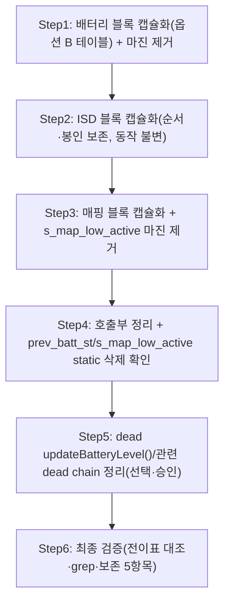

# 계획: 배터리·LED 코드 리팩토링

**TL;DR**: `func_normal()`의 배터리·매핑 LED 블록을 신규 `tdc_led_request_battery()`/`tdc_led_request_mapping()`(+순서 보존용 `tdc_led_request_isd()`)로 캡슐화하고, 배터리 등급을 **옵션 B(경계 테이블 `s_tdc_batt_led_table[]`)**로 데이터화하며, 배터리 `prev_batt_st`·매핑 `s_map_low_active` 히스테리시스(변화 마진)를 제거한다. 마진 제거는 **의도된 동작 변경**이라 전후 전이표를 명시한다. 5단계 atomic commit, 보존 필수 5항목을 각 단계 검증에 포함. **구현은 은수님 승인 후** — §0 결정사항 6건 먼저 확정 필요.

## 0. 승인 전 확정 필요 (은수님 결정)

| # | 결정 | 계획 기본 채택안 | 대안 |
|---|---|---|---|
| 이슈_1 | 미커밋 `10/12/80/78` baseline | 은수님 WIP로 보존, 단일 컷 **10/80** baseline | 커밋본 40/65로 되돌린 뒤 진행 |
| 이슈_2 | 매핑 컷·경계 편입 | `pct <= 20` LOW 유지 | `pct < 20` 등 |
| 이슈_3 | updateBatteryLevel 적용 방식 | 신규 `tdc_` 함수(구조 참고) | — (직접 부활 불가) |
| 이슈_4 | percent vs level | 두 블록 **percent 기반 통일** | 매핑만 level 재사용 |
| 이슈_5 | dead `updateBatteryLevel()` 정의 삭제 | **삭제**(Step 5) | 보류 |
| 이슈_6 | 배터리 옵션 A vs B | **B(테이블)** | A(단일 임계 상수, 저위험) |

> 이 표가 확정되기 전에는 코드 변경(Step 1~5)에 착수하지 않는다.

## 1. 전체 시퀀스



배터리(핵심·마진 제거의 중심)부터 시작하고, ISD는 동작 불변(순서 보존 목적)이라 중간, 매핑 마진 제거를 그다음, static 정리·dead code는 뒤로.

## 2. 단계별 상세

### Step 1: 배터리 블록 캡슐화 (옵션 B) + 마진 제거

**작업**: `main.c:542~578`을 신규 `static led_state_t tdc_led_request_battery(int pct, bool ovr_batt_active, bool batt_is_reset_state)`로 추출. 등급 판정을 경계 테이블로 데이터화, `prev_batt_st`(555행)·sticky 분기 2줄(565·569) 제거.

```c
typedef struct { int min_pct; led_state_t state; } tdc_batt_led_bin_t;

/* 내림차순 필수(첫 매치 채택). 값 변경/등급 추가는 이 표만 편집. */
static const tdc_batt_led_bin_t s_tdc_batt_led_table[] = {
    { 80, LED_ST_BATT_READY    },   /* pct >= 80        */
    { 10, LED_ST_BATT_MID      },   /* 10 <= pct < 80   */
    {  0, LED_ST_BATT_CRITICAL },   /* pct < 10 (fallback) */
};
#define TDC_BATT_LED_TABLE_LEN (sizeof(s_tdc_batt_led_table)/sizeof(s_tdc_batt_led_table[0]))

static led_state_t tdc_led_request_battery(int pct, bool ovr_batt_active, bool batt_is_reset_state)
{
    led_state_t batt_st = LED_ST_BATT_CRITICAL;   /* 매치 실패 시 안전측 */
    if (!ovr_batt_active && batt_is_reset_state) {
        batt_st = LED_ST_IDLE;                    /* 보존 5-⑤ RESET 최우선 */
    } else {
        for (size_t i = 0; i < TDC_BATT_LED_TABLE_LEN; ++i)
            if (pct >= s_tdc_batt_led_table[i].min_pct) { batt_st = s_tdc_batt_led_table[i].state; break; }
    }
#ifdef ENABLE_UI_CMD
    if (!tdc_ui_command_is_led_override(LED_SRC_BATTERY))   /* 보존 5-① 출력 게이트 */
#endif
        led_request(LED_SRC_BATTERY, batt_st);
    return batt_st;                                /* 보존 5-② ISD 재송출용 */
}
```

**전후 동작 변화(의도된 사양 변경)** — baseline 10/80:

| pct 구간 | 변경 전(마진) | 변경 후(마진 제거) |
|---|---|---|
| `pct < 10` | CRITICAL | CRITICAL |
| `10 ≤ pct < 12` | prev==CRITICAL면 CRITICAL, 아니면 MID | **MID(항상)** |
| `12 ≤ pct < 78` | MID | MID |
| `78 ≤ pct < 80` | prev==READY면 READY, 아니면 MID | **MID(항상)** |
| `pct ≥ 80` | READY | READY |

즉 sticky band(`{10,11}`, `{78,79}`)에서만 동작이 바뀐다 — 그 구간은 이제 `prev` 무관하게 MID.

**검증**: pct 0~100 전 구간 트레이스가 위 표와 일치(옵션 B는 06 검증서 §3.1에서 무결함 확인). override 출력 게이트 위치·반환값 보존.
**commit**: `Refactor(main): 배터리 LED 등급을 tdc_led_request_battery(테이블 구동)로 캡슐화 + 변화 마진 제거`

### Step 2: ISD 블록 캡슐화 (동작 불변)

**작업**: `main.c:580~618`을 `static bool tdc_led_request_isd(bool isd_conn, led_state_t batt_st)`로 추출. `led_set_isd_conn_state()`를 함수 **마지막 statement**로 봉인(보존 5-③). ISD 미연결 시 `led_request(LED_SRC_BATTERY, batt_st)` 재송출 유지(보존 5-②). **마진과 무관 — 순수 구조 이동, 동작 100% 불변.**

> [!NOTE]
> 이 Step은 이번 작업의 마진 제거와 직접 관련이 없다. 순서 의존(배터리→ISD→매핑)을 데이터 흐름(`batt_st`/`isd_conn` 인자·반환)으로 강제하려면 ISD도 함수화하는 게 자연스러워 포함. 최소 변경을 원하면 Step 2를 생략하고 ISD 블록을 인라인 유지해도 무방(은수님 선택).

**검증**: `led_set_isd_conn_state()` 호출이 `led_request(LED_SRC_ISD,...)` 뒤 마지막인지, `readLED_indicatorOnOff()` 분기 동일 재현.
**commit**: `Refactor(main): ISD LED 블록을 tdc_led_request_isd로 캡슐화(순서·봉인 보존, 동작 불변)`

### Step 3: 매핑 블록 캡슐화 + 마진 제거

**작업**: `main.c:620~654`를 `static void tdc_led_request_mapping(int pct, bool map_conn, bool isd_conn)`로 추출. `s_map_low_active` static 래치를 지역 `bool map_low_active = (pct <= TDC_MAP_LOW_BATT_PCT)`로 대체(마진 제거·순수 계산화).

```c
#define TDC_MAP_LOW_BATT_PCT 20   /* pct <= 20 -> LOW (진입 컷 유지) */
```

**전후 동작 변화**: `pct==21`이 변경 전엔 직전 상태 유지였으나, 변경 후엔 `pct<=20`이 아니므로 **항상 READY 편입**. `pct<=20`은 LOW(변경 전 진입과 동일).

**검증**: `map_conn`×`isd_conn`×`map_low_active` 4분기 LED 상태가 원본과 동일(경계 `pct==20/21` 제외). override 게이트 보존.
**commit**: `Refactor(main): 매핑 LED 블록을 tdc_led_request_mapping으로 캡슐화 + s_map_low_active 마진 제거`

### Step 4: 호출부 정리 + static 삭제 확인

**작업**: `func_normal()`의 배터리/ISD/매핑 3블록을 아래 호출부로 대체. `pct`·override 입력값을 **1회 계산해 공유**(보존 5-④).

```c
bool ovr_batt_active = false;
int  pct;
#ifdef ENABLE_UI_CMD
ovr_batt_active = tdc_ui_command_override_battery_active();
pct = ovr_batt_active ? (int)tdc_ui_command_override_battery_percent() : snd_batt_get_percent();
#else
pct = snd_batt_get_percent();
#endif
bool batt_is_reset_state = (snd_batt_get_state() == EN__SND_BATT_STATE_RESET);

led_state_t batt_st = tdc_led_request_battery(pct, ovr_batt_active, batt_is_reset_state);
/* isd_conn_raw 계산(override 반영) 후 */
bool isd_conn = tdc_led_request_isd(isd_conn_raw, batt_st);
/* map_conn 계산(override 반영) 후 */
tdc_led_request_mapping(pct, map_conn, isd_conn);
```

**검증**: `prev_batt_st`·`s_map_low_active` bare 식별자 grep 잔존 0건(→ static 완전 삭제 확인). 배터리→ISD→매핑 순서 유지.
**commit**: `Refactor(main): func_normal() 배터리/ISD/매핑 LED 호출부 정리 + 잔여 static 삭제`

### Step 5: dead `updateBatteryLevel()` 정리 (선택·승인)

**작업**(이슈_5 승인 시): `batteryNPowerControl.c:336~685` `updateBatteryLevel()` 정의 + `batteryNPowerControl.h:35` 선언 삭제. `main.c:448` 주석 처리된 호출도 삭제. (연관 dead chain — `ci_battery_init()` 등 — 은 이번 범위 넘으니 기록만.)

**검증**: 전 트리 grep `updateBatteryLevel` 잔존 0건, 빌드 심볼 미참조 확인.
**commit**: `Remove(main): dead code updateBatteryLevel() 정의·선언·주석 호출 삭제`

### Step 6: 최종 검증

**작업**: `func_normal()` 재독해, Step1~5 전이표 대조, 신규 함수명 충돌 grep, 보존 5항목 체크리스트 전수.
**commit**: 없음(검증 전용).

## 3. 검증 절차

### 3.1 보존 필수 5항목 체크리스트 (커밋 전 매 Step)
- [ ] override 2단(입력 호출부·출력 게이트 함수 내부)
- [ ] 배터리→ISD→매핑 순서 + `batt_st`/`isd_conn` 인자 전달
- [ ] `led_set_isd_conn_state()` ISD 함수 마지막 봉인
- [ ] `pct` 1회 계산 공유
- [ ] RESET→IDLE 최우선 분기

### 3.2 정적 검증(본 세션 범위)
- 전 트리 grep: 신규 함수명(`tdc_led_request_battery/isd/mapping`)·상수(`TDC_BATT_LED_*`/`TDC_MAP_LOW_BATT_PCT`) 충돌 0.
- `prev_batt_st`/`s_map_low_active` bare 잔존 0.
- 옵션 B 테이블 내림차순 불변식 주석 존재.

### 3.3 빌드·실기(은수님 환경)
- 빌드: Eclipse 워크스페이스.
- 실기: 마진 제거 전후 배터리 LED 전이(충전기 착탈로 pct 경계 10/80·매핑 20 통과 시 색 전환), 부팅 초기 RESET→IDLE(노란 LED 안 켜짐), ISD 착탈 1-tick 잔상 무재발.
- (권고·선택) 실측 게이트: 임계 근처 QCC percent 로깅·`0x34` 수신 간격·충전기 바운스 percent 로깅(분석 §3).

## 4. 작업 분담
Step 1~6은 같은 `main.c`(+ Step5 `batteryNPowerControl.*`) 순차 종속 수정이라 **오케스트레이터 직접 구현**(서브에이전트 병렬 없음, 분석 fan-out은 이미 완료).

## 5. 진행 추적
- [x] Step 1: 배터리 캡슐화(옵션 B) + 마진 제거 — 커밋 `6cd6bd0`
- [x] Step 2: ISD 캡슐화(동작 불변) — 커밋 `6cd6bd0`
- [x] Step 3: 매핑 캡슐화 + 마진 제거 — 커밋 `6cd6bd0`
- [x] Step 4: 호출부 정리 + static 삭제 — 커밋 `6cd6bd0` (Step1~4 단일 리팩토링 커밋)
- [ ] Step 5: dead updateBatteryLevel 정리(선택) — **보류**(요구사항 §5.2 최종 삭제 승인 대기, 빌드 안전 확인됨)
- [x] Step 6: 최종 검증 — 정적 검증 완료(브레이스 136/136·잔여 식별자 0·전이 등가). 빌드·실기는 은수님 환경

## 6. 관련 산출물
- [요구사항.md](요구사항.md) · [분석.md](분석.md) · [이력 및 결과.md](이력%20및%20결과.md)
- [에이전트-로그/](에이전트-로그/) — 04(설계 옵션 원문)·06(검증)

## 자체 검토

### 지침 준수 여부
| 지침 | 준수 |
|---|---|
| 루트 `작업 진행 규칙.md`(⑤ 계획, ⑥ 검증) | ✅ |
| `Git/브랜치, 병합 규칙.md`(atomic commit, main 직접 금지) | ✅ |
| `코딩/작업 규칙.md`(신규 심볼 `tdc_`) | ✅ |

### 논리적 정합성
| 점검 | 결과 |
|---|---|
| 분석 결정_1~5가 Step으로 구체화 | ✅ |
| 마진 제거 전후 전이표 명시 | ✅ (Step1·Step3) |
| 보존 5항목이 검증에 포함 | ✅ (§3.1) |
| 동작 변경 vs 불변 Step 구분 | ✅ (Step2=불변, Step1·3=변경) |

### 미해결 이슈
| 이슈 | 처리 |
|---|---|
| §0 결정 6건 | 승인 게이트에서 확정 후 착수 |
| 빌드·실기·실측 게이트 | 은수님 환경, 결과를 이력에 반영 |
