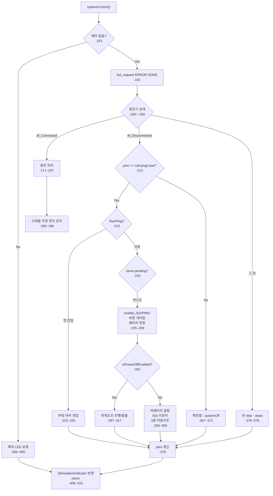

# 분석 — systemControl() FSM 분해

**TL;DR**: 실측 결과 **중첩 깊이는 5**(추정 7~8은 오류 — 요구사항 전제 정정). 진짜 문제는 중첩이 아니라 **281줄 길이 + `static` 상태 7개 분산**이다. `static` 10개 중 **3개가 쓰기 전용 dead**이고 **빈 `else` 블록 1개**가 추가 발견됐다. 충전기 축을 최상위로 5개 핸들러 분해를 제안한다.

---

## 1. 요구사항 검증에서 위임받은 3건 해소

| 결함 | 내용 | 해소 결과 |
|---|---|---|
| 결함_1 | 최대 중첩 깊이 정확 측정 | **깊이 5** (최심 `systemControl.c:182`). 추정 7~8은 **오류** |
| 결함_2 | `static` 10개 사용처 전수 후 그룹 확정 | 전수 완료 (§3). **dead 3개 발견** |
| 결함_3 | 1-tick 지연 소비처 현재 라인 갱신 | `conneded_ISD` 310/328/342, `mappingConnected` 241 (§5) |

### 결함_1 정정의 파급 (중요)

중첩 깊이별 라인 분포 (함수 본문 281줄 기준):

| 깊이 | 0 | 1 | 2 | 3 | 4 | 5 |
|---|---|---|---|---|---|---|
| 라인 수 | 76 | 71 | 38 | 35 | 7 | 8 |

깊이 4~5는 **15줄에 불과**하고 185줄이 0~3이다. **"중첩이 심해서 분해한다"는 명분은 성립하지 않는다.**

> [!IMPORTANT]
> `요구사항.md §3 요구사항_2` 의 "최대 중첩 깊이가 현재의 절반 이하" 수용 기준은 **폐기**한다. 분해의 실제 근거는 아래 §2 로 대체한다.

---

## 2. 분해의 실제 근거 (재정립)

| 문제 | 실측 | 분해로 얻는 것 |
|---|---|---|
| 함수 길이 | 281줄 단일 함수 | 단계별 핸들러 30~80줄 |
| 상태 분산 | `static` 7개(dead 제거 후)가 본문 전역에서 접근 | 상태를 소유 단계에 귀속 |
| 관심사 혼재 | 에러 / 충전 / 크래들 / 부팅 / 파워오프 / ISD 가 한 함수 | 축별 독립 판독 |
| dead code | `static` 3개 + 빈 `else` 1개 | 제거 |

즉 이 작업은 **"중첩 완화"가 아니라 "길이·상태 분산·관심사 혼재 해소"** 다.

---

## 3. `static` 상태 전수 (결함_2 해소)

### 3.1 dead 판정 (쓰기만 있고 읽기 0)

| 변수 | 선언 | 쓰기 | 읽기 | 판정 |
|---|---|---|---|---|
| `PowerOn_StartCounter` | `:138` | `:223`, `:363` | **0** | **dead** |
| `normalModeCounter` | `:140` | `:237`, `:238` | **0** | **dead** |
| `CounterAfterCoverClosed` | `:141` | `:183`, `:192`, `:200` | **0** | **dead** |

> [!NOTE]
> `systemControl.c:220` 주석이 이미 자백하고 있다 — *"StartFlag · PowerOn_StartCounter 변수 자체 정리는 별도 cleanup 작업으로 위임 (사용처 dead 확인됨)"*. **본 작업이 그 위임받은 cleanup 이다.**
>
> 단 주석은 `StartFlag` 도 dead 라 했으나 **오류**다. `StartFlag` 는 `:215` 에서 읽힌다(§3.2). 주석의 "dead 확인됨"은 `PowerOn_StartCounter` 에만 해당한다.

`normalModeCounter` 는 `:237~238` 에서 `++` 후 `& 0xFFFF` 마스킹까지 하지만 아무도 읽지 않는다.

### 3.2 실사용 (읽기 있음)

| 변수 | 읽기 | 소유 단계 (귀속 제안) |
|---|---|---|
| `StartFlag` | `:215` | 부팅 |
| `PowerOff_StartCounter` | `:297` | 파워오프 |
| `isPowerOffEnabled` | `:270`, `:291` | 파워오프 |
| `s_tdc_cradle_cover_closed_edge` | `:189` | 크래들 |
| `ISD_Disconnection_counter` | `:248`, `:351` | ISD |
| `lowBatteryIndicatorCounter` | `:330` | 배터리 |
| `prev_batteryChargerConnectionStatus` | `:213`, `:367` | 충전기 |

**dead 3개 제거 시 7개.** 그룹은 6개(부팅 / 파워오프 2 / 크래들 / ISD / 배터리 / 충전기).

---

## 4. 추가 발견 (dead / 이상)

### 발견_1 — 빈 `else` 블록 (`:376~378`)

```c
        }  // end battery Charging
        else
        {
        }
```

`chargerConnectorPluggedIn` 이 `df_Connected` 도 `df_Disconnected` 도 아닌 경우(= `df_Defalut`, QCC 0x34 수신 전)로 **본문이 비어 있다**. 제거해도 동작 동일.

### 발견_2 — `prev_batteryChargerConnectionStatus` 네이밍·의미 불일치

| 라인 | 코드 | 문제 |
|---|---|---|
| `:379` | `prev_batteryChargerConnectionStatus = chargerState.carryingCasePluggedIn;` | **`carryingCase`** 를 저장 |
| `:213` | `if (prev_batteryChargerConnectionStatus == chargerState.carryingCasePluggedIn)` | `carryingCase` 와 비교 (정합) |
| `:367` | `if (prev_batteryChargerConnectionStatus == df_Disconnected)` | **`df_Disconnected`** 와 비교 |

변수명은 `batteryCharger` 인데 실제로 담는 값은 `carryingCase` 다. `:367` 의 비교는 "직전 tick 의 carryingCase 상태가 df_Disconnected 였나"를 묻는 셈인데, 이름만 보면 "직전 충전기 상태"로 읽힌다.

> [!WARNING]
> **동작 변경 없이 이름만 정정**할 수 있다(`prev_carrying_case_state`). 다만 `:367` 의 의도가 "충전기"였다면 이는 **버그**다. 판단 근거가 코드에 없으므로 **이번 범위에서는 이름만 정정하고 동작은 보존**한다. 의도 확인은 은수님께 질의 (§7).

### 발견_3 — `PowerOn_StartCounter++` 위치 (`:363`)

`if (prev == carryingCase)` 블록 **안쪽 끝**에 있어 조건 참일 때만 증가한다. dead 이므로 제거 시 무관하나, 위치 자체가 의도 불명이었음을 기록한다.

---

## 5. 1-tick 지연 소비처 (결함_3 해소 — 라인 갱신)

| 입력 | 현재 라인 | 용도 | 지연 민감도 |
|---|---|---|---|
| `mappingConnected` | `:241` | 매핑 중 전원버튼 무시 | 인간 조작 스케일 |
| `conneded_ISD` | `:310` | 파워오프 루틴 탈출 | 인간 조작 스케일 |
| `conneded_ISD` | `:328` | 저배터리 자극 알림(10분 주기) | 시간 누적 |
| `conneded_ISD` | `:342` | `ISD_Disconnection_counter` 리셋/증가 | 시간 누적 |

**결론 불변**: 4곳 전부 1ms 지연에 둔감. `요구사항.md §4` 의 "1-tick 지연 유지" 유효.

---

## 6. 구조 골격 (실측)



---

## 7. 분해 설계 (제안)

### 7.1 상태 구조체

```c
/* systemControl 전용 상태. 단계별로 소유를 나눈다. */
typedef struct
{
    bool start_flag;                 /* 부팅 첫 진입 완료 표시 */
} tdc_sysctl_boot_state_t;

typedef struct
{
    bool cover_closed_edge;          /* 크래들 뚜껑 닫힘 엣지 (1회성) */
} tdc_sysctl_cradle_state_t;

typedef struct
{
    bool enabled;                    /* 파워오프 시퀀스 진행 중 */
    int  start_counter;              /* burst 종료 검출용 */
} tdc_sysctl_poweroff_state_t;

typedef struct
{
    int disconnection_counter;       /* ISD 미연결 누적 (3분 타임아웃) */
} tdc_sysctl_isd_state_t;

typedef struct
{
    int low_indicator_counter;       /* 저배터리 자극 알림 10분 주기 */
} tdc_sysctl_batt_state_t;

typedef struct
{
    tdc_sysctl_boot_state_t     boot;
    tdc_sysctl_cradle_state_t   cradle;
    tdc_sysctl_poweroff_state_t poweroff;
    tdc_sysctl_isd_state_t      isd;
    tdc_sysctl_batt_state_t     batt;
    int                         prev_carrying_case_state;  /* 구 prev_batteryChargerConnectionStatus */
} tdc_sysctl_state_t;

static tdc_sysctl_state_t s_sysctl;
```

### 7.2 핸들러 분해

| 핸들러 | 담당 | 원본 라인 | 예상 길이 |
|---|---|---|---|
| `tdc_sysctl_handle_error()` | 에러 LED 요청 | `:384~405` | ~22 |
| `tdc_sysctl_handle_charging()` | 충전기 연결 시 처리 (크래들 포함) | `:171~207` | ~37 |
| `tdc_sysctl_gate_power_button()` | 매핑 / ISD 최근연결 시 버튼 무시 | `:241~254` | ~14 |
| `tdc_sysctl_handle_poweroff()` | 파워오프 진행 / 탈출 | `:291~318` | ~28 |
| `tdc_sysctl_handle_running()` | 저배터리 알림 / ISD 카운터 / 3분 타임아웃 | `:319~360` | ~42 |
| `systemControl()` (잔여) | 축 분기 + 조립 | — | ~60 |

### 7.3 제거 목록 (근거 포함)

| 대상 | 근거 |
|---|---|
| `PowerOn_StartCounter` (선언 `:138`, 쓰기 `:223`/`:363`) | 읽기 0 (§3.1) |
| `normalModeCounter` (선언 `:140`, 쓰기 `:237`/`:238`) | 읽기 0 (§3.1) |
| `CounterAfterCoverClosed` (선언 `:141`, 쓰기 `:183`/`:192`/`:200`) | 읽기 0 (§3.1) |
| 빈 `else` 블록 `:376~378` | 본문 없음 (§4 발견_1) |

### 7.4 이름 정정 (동작 불변)

| 현재 | 변경 | 근거 |
|---|---|---|
| `prev_batteryChargerConnectionStatus` | `prev_carrying_case_state` | 실제 담는 값이 `carryingCasePluggedIn` (§4 발견_2) |

---

## 8. 은수님 확인 필요 사항

### 질문_1 — `:367` 의 의도

```c
else  // 충전기가 꼽혔다가 빠진 상태.
{
    if (prev_batteryChargerConnectionStatus == df_Disconnected)
    {
        systemStatus.enablePMIC = false;
        systemStatus.systemOff  = true;
    }
}
```

`prev_...` 에는 `carryingCasePluggedIn` 이 담긴다. 즉 이 조건은 실제로 **"직전 tick 의 캐리잉 케이스가 df_Disconnected 였나"** 를 묻는다. 주석은 "충전기가 꼽혔다가 빠진 상태"라 한다.

- **가능성_1**: 의도대로다. 캐리잉 케이스 상태로 판정하는 게 맞다 → 이름만 정정
- **가능성_2**: 원래 충전기 상태를 보려 했으나 `carryingCase` 를 담아버린 **버그** → 동작 변경 필요

코드에 판단 근거가 없다. **이번 범위에서는 가능성_1 로 간주(동작 보존)** 하고 이름만 정정한다. 가능성_2 라면 별도 작업으로 분리해야 한다.

---

## 9. 위험

| 위험 | 완화 |
|---|---|
| 상태 구조체 도입 시 초기값 누락 | 원본 선언 초기값 전수 대조 (`ISD_Disconnection_counter = Df_Disconnection_BLE_Time_ms` 주의 — 0 이 아님) |
| 핸들러 분리 중 `veryLowBattery` / `stimulationTrigger` 지역변수 전달 누락 | 두 값은 `systemControl()` 지역이며 `:408` 에서 출력에 반영. 핸들러 시그니처에 명시 |
| `powerButtonPushed` 지역 수정(`:246`/`:253`)이 핸들러 밖으로 전파 안 됨 | 게이트 핸들러는 **값을 반환**해 호출자가 재대입 |
| 빌드 검증 불가 | 은수님 Eclipse 빌드 (제약, `요구사항.md §5`) |
