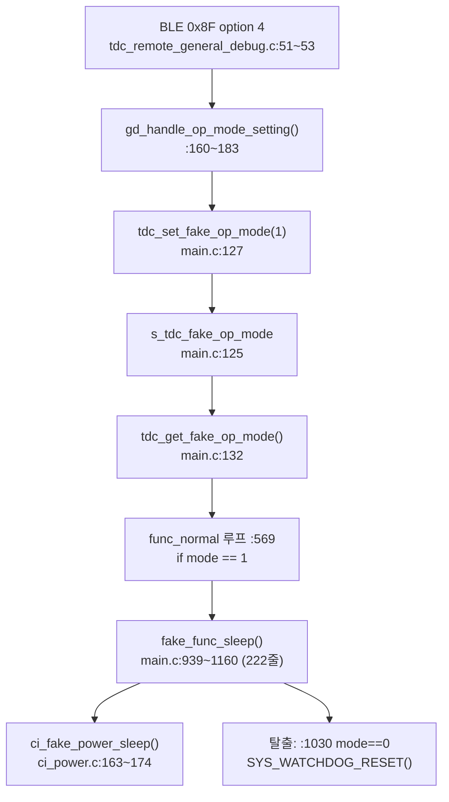

# 계획 — fake sleep mode 제거

**TL;DR**: 터치센서 계측을 위해 "클럭을 안 내리는 가짜 절전"으로 만든 체인 약 **270줄**을 제거한다. `fake_func_sleep()` 은 진짜 `func_sleep()` 의 ULP 헬퍼를 **하나도 공유하지 않아** 독립 제거가 가능하다. 유일한 판단 지점은 **BLE 프로토콜 0x8F option 4** 를 없앨지 유지할지다.

---

## 1. 배경

은수님 지시(2026-07-20):

> `tdc_get_fake_op_mode()`를 비롯한, 이 fake sleep mode가 더 이상 필요 없어. 이거 터치센서 측정을 위해서 억지로 만든 코드였어.

### 1.1 "가짜"였던 이유 (코드 근거)

`ci_power.c` 의 두 함수 비교:

| 함수 | SYSCLK | 라인 |
|---|---|---|
| `ci_power_sleep()` (진짜) | `SYS_FREQ_2M56` (2.56MHz 로 **낮춤**) | `ci_power.c:181` |
| `ci_fake_power_sleep()` (가짜) | `SYS_FREQ_30M72` (30.72MHz **유지**) | `ci_power.c:167` |

즉 절전 시퀀스(FPGA reset · PMIC off · CFX ULP 진입 · LED off)는 그대로 밟되 **CM3 클럭만 안 내린다**. 클럭을 유지해야 I2C/디버그 출력으로 터치센서를 계측할 수 있기 때문이다. **은수님 설명과 정확히 일치.**

---

## 2. 제거 대상 체인 (전수)



| # | 대상 | 위치 | 규모 |
|---|---|---|---|
| 1 | `fake_func_sleep()` 정의 | `main.c:939~1160` | **222줄** |
| 2 | `func_normal()` 호출 분기 | `main.c:569~574` | 6줄 |
| 3 | `s_tdc_fake_op_mode` + getter/setter | `main.c:125~135` | 11줄 |
| 4 | `main.h` 선언 3개 | `main.h:70~72` | 3줄 |
| 5 | `ci_fake_power_sleep()` 정의 | `ci_power.c:163~174` | 12줄 |
| 6 | `ci_power.h` 선언 | `ci_power.h:99` | 1줄 |
| 7 | `gd_handle_op_mode_setting()` | `tdc_remote_general_debug.c:160~183` | 24줄 |
| 8 | option 4 분기 + 전방선언 | `tdc_remote_general_debug.c:31`, `:51~53` | 4줄 |

**직접 대상 283줄.**

### 2.1 파생 고아 (③ 분석에서 추가 발견)

`fake_func_sleep()` 이 유일한 호출자였던 심볼:

| # | 대상 | 위치 | 규모 |
|---|---|---|---|
| 9 | `tdc_touch_debug_set_recent_*` 7개 정의 | `tdc_touch.c:56`/`66`/`76`/`86`/`96`/`106`/`116` | 21줄 |
| 10 | 동 선언 7개 | `tdc_touch.h:43`/`45`/`47`/`49`/`51`/`53`/`55` 계열 | 7줄 |

**총계 약 311줄** (`main.c` 1396 → 약 1157줄).

> [!CAUTION]
> **`get_recent_*` 7개와 `s_debug_recent_*` static 7개는 제거하지 않는다.** BLE option 1 이 getter 를 쓰고, 정상 폴링 경로(`tdc_touch.c:337~343`)가 static 을 직접 채운다. 상세: `분석.md §5`.

---

## 3. 안전성 근거 (조사 완료)

### 근거_1 — `func_sleep()` 의 ULP 헬퍼를 공유하지 않는다 (핵심)

`func_sleep()` 은 리팩토링(2026-07-02)으로 헬퍼 5개를 갖는다:

| 헬퍼 | 위치 |
|---|---|
| `tdc_touch_sleep_log_debug()` | `main.c:1166` / `:1194` (`#if` 분기 2벌) |
| `tdc_touch_sleep_handle_ati_error()` | `main.c:1204` |
| `tdc_touch_sleep_handle_notouch_gate()` | `main.c:1237` |
| `tdc_touch_sleep_handle_touch_reboot()` | `main.c:1267` |
| `tdc_touch_sleep_log_state_transition()` | `main.c:1297` |

**`fake_func_sleep()`(`:939~1160`) 본문에서 이 헬퍼들의 사용은 0건**(grep 실측). 즉 fake 는 ULP 루프를 **자체 인라인 구현**으로 갖고 있어, 제거해도 `func_sleep()` 에 영향이 없다.

### 근거_2 — `ci_fake_power_sleep()` 은 fake 전용

호출처 `main.c:991` **1곳뿐**. `func_sleep()` 은 `ci_power_sleep()`(`main.c:1360`)을 쓴다.

### 근거_3 — 진짜 절전 경로는 무관

`func_sleep()` 호출은 `main.c:364`(메인 루프 break 후). fake 체인과 진입점이 완전히 분리돼 있다.

### 근거_4 — 외부 프로젝트 영향 없음

fake 관련 심볼 전수 census 결과 `2__cm3` 내부에만 존재(`1__cfx` / `3__hear` / `4__eeprom` / `5__calibration` 사용 0).

---

## 4. 판단 필요 — BLE 프로토콜 option 4

`gd_handle_op_mode_setting()` 은 BLE **0x8F(General Debug) option 4** 핸들러다. 제거 방식이 두 가지다.

### 방안_A — option 4 통째 제거 (권장)

```c
else if (option == 4)  // 운영 모드 설정   ← 분기 삭제
```

- **장점**: 죽은 프로토콜이 남지 않음. 가장 깨끗
- **위험**: 외부 도구(모바일 앱 · 테스트 지그)가 option 4 를 계속 보내면 **응답이 사라진다**. 현재 코드는 미지정 option 에 대해 어떻게 처리하는지 확인 필요(§6 확인_1)

### 방안_B — option 4 를 no-op 로 유지

핸들러는 남기되 내부를 로그 + loop-back 응답만 남긴다.

- **장점**: 외부 도구 호환 유지
- **단점**: 죽은 프로토콜이 잔존. "안 쓰이는 건 없앤다" 방침에 어긋남

> [!IMPORTANT]
> **은수님 판단 필요**: 0x8F option 4 를 쓰는 외부 도구가 있는지. 없다면 방안_A.

---

## 5. 단계 구성

의존성은 테스트 순서로 표현한다(루트 지침 §7).

| 순서 | 작업 | 전제 | 검증 |
|---|---|---|---|
| 1 | BLE 진입점 제거 (#7, #8) | 없음 | option 4 도달 불가 |
| 2 | `func_normal()` 호출 분기 제거 (#2) | 1 | `fake_func_sleep()` 호출 0 |
| 3 | `fake_func_sleep()` 정의 제거 (#1) | 2 | 심볼 잔존 0 |
| 4 | op_mode getter/setter + 선언 제거 (#3, #4) | 3 | 심볼 잔존 0 |
| 5 | `ci_fake_power_sleep()` + 선언 제거 (#5, #6) | 3 | 심볼 잔존 0 |
| 6 | 고아 setter 7개 + 선언 제거 (#9, #10) | 3 | 호출 0 확인 후 제거 |

> [!NOTE]
> 위 순서는 **작업 순서**이지 커밋 경계가 아니다. 중간 상태가 "선언은 있는데 정의가 없는" 컴파일 불가 상태라 단계별 독립 빌드 검증이 성립하지 않기 때문이다. 따라서 **커밋 1개**로 묶는다.
>
> (⑥ 검증 결함_2 정정: 초판은 "단계 5개 + 전제"를 적어 단계별 독립 검증이 가능한 것처럼 읽혔다.)

---

## 6. 구현 전 확인 사항

### 확인_1 — 미지정 option 처리 (해결됨)

`tdc_remote_general_debug.c:55~59` 에 `else` 블록이 있다:

```c
else
{
    // 송신 데이터 준비
    tx_buf[tx_index++] = packet->command;  //     command : loop-back
}
```

미지정 option 은 **command 만 loop-back 하고 조용히 무시**된다. 따라서 option 4 를 제거해도 외부 도구가 보냈을 때 **응답은 오되(loop-back) 동작만 안 한다** - 무응답이나 크래시가 아니다.

> [!NOTE]
> **방안_A 의 위험이 낮음이 확인됐다.** 외부 도구가 option 4 응답의 payload(`option`, `op_mode` 3바이트)를 파싱한다면 길이 불일치를 볼 수 있으나, 애초에 fake sleep 을 안 쓸 거라면 그 도구도 호출하지 않을 것이다.

### 확인_2 — `fake_func_sleep()` 내부의 재사용 가치

222줄 안에 절전 ULP 계측 로직이 들어 있다. 이 중 **나중에 다시 필요할 만한 계측 코드**가 있는지 은수님 확인. 있다면 제거 전 `docs/참고/` 로 스냅샷을 남긴다.

> 제 판단: `func_sleep()` 이 이미 동일 계측을 헬퍼로 갖고 있으므로 **재사용 가치 낮음**. git 이력에 남으므로 별도 스냅샷 불필요.

---

## 7. 검증 라벨 (구현 후 확인)

| 라벨 | 항목 | 판정 기준 |
|---|---|---|
| 검증_1 | 심볼 잔존 | `fake_func_sleep` / `tdc_get_fake_op_mode` / `tdc_set_fake_op_mode` / `s_tdc_fake_op_mode` / `ci_fake_power_sleep` 잔존 0 (주석 제외) |
| 검증_2 | `func_sleep()` 무영향 | 헬퍼 5개 + `ci_power_sleep()` 호출 그대로 (요구사항_2 불변식) |
| 검증_3 | **BLE option 1 공급 유지** | `tdc_touch.c:337~343` 의 `s_debug_recent_*` 직접 대입 7건 보존. `get_recent_*` 7개 보존 (요구사항_3 불변식, **회귀 1순위**) |
| 검증_4 | 고아 setter 제거 | `tdc_touch_debug_set_recent_*` 7개 정의·선언 제거, 잔존 호출 0 |
| 검증_5 | 브레이스 균형 | `main.c` / `ci_power.c` / `tdc_remote_general_debug.c` / `tdc_touch.c` |
| 검증_6 | 전처리기 균형 | `main.c` (fake 내부에 `#if 1` · `#if 0` 존재) depth 0 |
| 검증_7 | BLE 응답 | option 1/2/3 정상 (회귀 없음) |
| 검증_8 | 인코딩 | pre-commit 훅 통과 |
| 검증_9 | 빌드 | 은수님 Eclipse + 실기 |

---

## 8. 예상 결과

| 항목 | 현재 | 제거 후 |
|---|---|---|
| `main.c` 길이 | 1396줄 | 약 1157줄 |
| `func_normal()` 루프 | fake 분기 6줄 포함 | 제거 |
| BLE 0x8F option | 1/2/3/4 | 1/2/3 (방안_A) |
| 절전 경로 | `func_sleep()` + `fake_func_sleep()` 2개 | `func_sleep()` 단일 |
| 터치 debug API | getter 7 + setter 7 | **getter 7 만** (setter 는 호출자 소멸) |
| BLE option 1 기능 | 동작 | **동작 유지** (공급원 `tdc_touch_process()`) |

---

## 9. 위험

| 위험 | 완화 |
|---|---|
| 외부 도구가 option 4 사용 | §4 은수님 판단. 불확실하면 방안_B |
| `fake_func_sleep()` 내 공유 심볼 누락 제거 | §3 근거_1 로 헬퍼 비공유 확인됨. 구현 시 본문 전수 스캔 재확인 |
| 빌드 검증 불가 | 은수님 Eclipse (제약 불변) |
