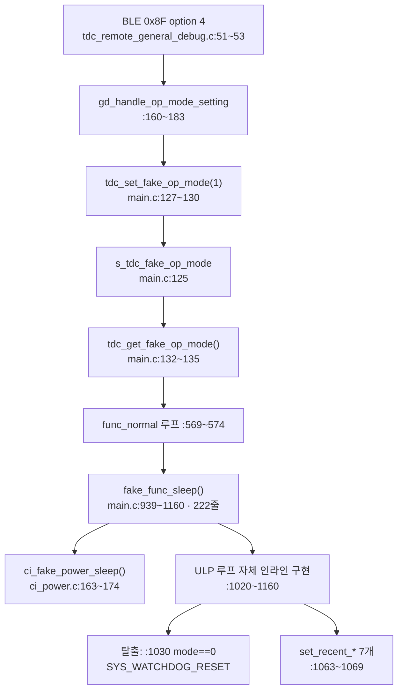

# 분석 — fake sleep mode 제거

**TL;DR**: fake 가 "가짜"인 이유는 **SYSCLK 를 30.72MHz 로 유지**해 계측을 가능케 한 것이다(진짜는 2.56MHz). 체인은 BLE option 4 진입 ~ 222줄 본체까지. `func_sleep()` 과 **헬퍼를 하나도 공유하지 않아** 독립 제거가 가능하다. 고아 심볼 8개를 찾았고, 그중 **BLE option 1 커플링 의심은 무해로 확정**됐다 — 정상 폴링 경로(`tdc_touch_process()`)가 같은 데이터를 별도로 채우기 때문이다.

---

## 1. fake 가 "가짜"인 이유 (확정)

`ci_power.c` 의 쌍둥이 함수 비교:

| 함수 | SYSCLK 설정 | 라인 |
|---|---|---|
| `ci_power_sleep()` (진짜) | `tdc_Trims_SetOperatingFrequency(SYS_FREQ_2M56)` | `ci_power.c:181` |
| `ci_fake_power_sleep()` (가짜) | `tdc_Trims_SetOperatingFrequency(SYS_FREQ_30M72)` | `ci_power.c:167` |

절전 시퀀스(FPGA reset · PMIC off · CFX ULP 진입 · LED off)는 **동일하게 밟되 CM3 클럭만 안 내린다**. 클럭이 살아 있어야 I2C 폴링과 디버그 출력으로 터치센서를 계측할 수 있다. 부수 차이로 `SLOWCLK_PRESCALE` 도 다르다(fake `_24` / 진짜 `_2`).

**은수님 설명("터치센서 측정을 위해서 억지로 만든 코드")과 정확히 일치.**

---

## 2. 체인 전수



| # | 대상 | 위치 | 줄 |
|---|---|---|---|
| 1 | `fake_func_sleep()` 정의 | `main.c:939~1160` | 222 |
| 2 | `func_normal()` 호출 분기 | `main.c:569~574` | 6 |
| 3 | `s_tdc_fake_op_mode` + getter/setter | `main.c:125~135` | 11 |
| 4 | `main.h` 선언 3개 | `main.h:70~72` | 3 |
| 5 | `ci_fake_power_sleep()` 정의 | `ci_power.c:163~174` | 12 |
| 6 | `ci_power.h` 선언 | `ci_power.h:99` | 1 |
| 7 | `gd_handle_op_mode_setting()` | `tdc_remote_general_debug.c:160~183` | 24 |
| 8 | option 4 분기 + 전방선언 | `tdc_remote_general_debug.c:31`, `:51~53` | 4 |

**직접 대상 283줄.**

---

## 3. 공유 자산 조사 (요구사항_2 불변식 근거)

### 3.1 `func_sleep()` ULP 헬퍼 — 비공유 확정

`func_sleep()` 은 리팩토링(`touch/20260702_func-sleep-refactor`)으로 헬퍼 5종을 갖는다:

| 헬퍼 | 위치 |
|---|---|
| `tdc_touch_sleep_log_debug()` | `main.c:1166` / `:1194` (`#if` 분기 2벌) |
| `tdc_touch_sleep_handle_ati_error()` | `main.c:1204` |
| `tdc_touch_sleep_handle_notouch_gate()` | `main.c:1237` |
| `tdc_touch_sleep_handle_touch_reboot()` | `main.c:1267` |
| `tdc_touch_sleep_log_state_transition()` | `main.c:1297` |

**`fake_func_sleep()` 본문(`:939~1160`)에서 이 헬퍼 사용 0건** (grep 실측). fake 는 ULP 루프를 **자체 인라인**으로 갖는다. 두 함수는 코드를 공유하지 않는다.

### 3.2 `ci_fake_power_sleep()` — fake 전용

호출처 `main.c:991` **1곳뿐**. `func_sleep()` 은 `ci_power_sleep()`(`main.c:1360`)을 쓴다.

### 3.3 진입점 분리

| 경로 | 진입 |
|---|---|
| 진짜 절전 | `func_normal()` 메인 루프 break → `main.c:364 func_sleep()` |
| fake | `main.c:569 tdc_get_fake_op_mode()==1` → `fake_func_sleep()` |

**결론: 요구사항_2 불변식은 안전하다.**

---

## 4. 고아 심볼 조사 (요구사항_4)

`fake_func_sleep()` 이 호출하는 41개 심볼 중, **fake 밖 호출이 0** 인 것을 추출했다(스크립트 실측).

| 심볼 | fake 안 | fake 밖 | 판정 |
|---|---|---|---|
| `tdc_touch_debug_set_recent_lta` | 1 | **0** | 고아 |
| `tdc_touch_debug_set_recent_count` | 1 | **0** | 고아 |
| `tdc_touch_debug_set_recent_delta` | 1 | **0** | 고아 |
| `tdc_touch_debug_set_recent_abs_thr` | 1 | **0** | 고아 |
| `tdc_touch_debug_set_recent_pressed` | 1 | **0** | 고아 |
| `tdc_touch_debug_set_recent_ati_error` | 1 | **0** | 고아 |
| `tdc_touch_debug_set_recent_ati_active` | 1 | **0** | 고아 |
| `public_touch_settings` | 1 | **0** | 고아 (단 `#if 0` 안 — §4.2) |

공유로 판정되어 **유지**할 것: `turnON_RedLED`(밖 3) · `tdc_touch_iqs323_re_ati`(2) · `tdc_touch_iqs323_reseed`(3) · `tdc_touch_iqs323_read_debug`(2) · `tdc_touch_iqs323_read_status`(5) · `tdc_touch_state_name`(2) · `write_FPGA_reset`(3) · `i2c_set_master_prescale`(1) · `ci_timer_init_prescaled`(2) · `changePcmOutputMode`(114) · `turnOffLED`(4) 등.

### 4.1 `set_recent_*` 7개의 정의 위치

`tdc_touch.c:56` / `:66` / `:76` / `:86` / `:96` / `:106` / `:116` (각 3줄), 선언은 `tdc_touch.h:43` 등. **1차 파생이므로 제거 대상**(요구사항-검증 결함_2 상한 준수).

### 4.2 `public_touch_settings` — 이미 dead

fake 내 유일 참조가 `main.c:979~988` 의 **`#if 0` 블록 안**이다. 즉 현재도 컴파일되지 않는다. fake 제거로 참조가 완전히 사라진다.

> [!NOTE]
> `public_touch_settings` 자체의 정의 제거는 **2차 파생**에 해당하고 터치 공개 API 일 수 있으므로, 이번 범위에서는 **목록 기록만** 하고 손대지 않는다(요구사항-검증 결함_2 상한).

---

## 5. BLE option 1 커플링 (요구사항_3 불변식 근거) — 핵심

### 5.1 의심 제기

`set_recent_*` 7개가 채우는 값을 **BLE 0x8F option 1(터치센서 디버깅 프로토콜)** 이 읽는다:

```
tdc_remote_general_debug.c:77~83
    lta = tdc_touch_debug_get_recent_lta();  ... (7개)
```

그리고 §4 조사에서 **setter 의 유일한 호출처가 fake 내부**(`main.c:1063~1069`)로 나왔다. 액면 그대로면 **fake 제거 시 option 1 이 죽는다**(stale 0 반환).

### 5.2 반증 — 정상 폴링 경로가 별도로 채운다

`tdc_touch.c:337~343` 을 확인한 결과, **setter 를 거치지 않고 static 변수를 직접 대입**한다:

```
s_debug_recent_lta        = dbg.lta;
s_debug_recent_count      = dbg.counts;
s_debug_recent_delta      = delta;
s_debug_recent_abs_thr    = abs_thr;
s_debug_recent_pressed    = in.pressed ? 1 : 0;
s_debug_recent_ati_error  = in.ati_error ? 1 : 0;
s_debug_recent_ati_active = in.ati_active ? 1 : 0;
```

이 코드가 든 함수는 **`tdc_touch_process()`**(`tdc_touch.c:273`)이고, 이는 메인 루프가 **매 tick 호출**한다(`main.c:614`, `tdc_collect_events()` 내부).

### 5.3 결론

| 대상 | fake 제거 영향 |
|---|---|
| BLE option 1 기능 | **무해** — 데이터 공급원이 `tdc_touch_process()` 로 독립 |
| `get_recent_*` 7개 | **유지** — option 1 이 사용 |
| `set_recent_*` 7개 | **제거** — 호출처가 fake 뿐이었음 |
| `s_debug_recent_*` static 7개 | **유지** — 정상 경로가 쓰고 getter 가 읽음 |

**요구사항_3 불변식은 안전하다.** 다만 setter 제거 후 "정상 경로가 static 을 직접 쓴다"는 사실이 유일한 공급 경로가 되므로, ⑧ 검증에서 이를 명시 확인한다.

> [!IMPORTANT]
> **`계획.md`(⑤ 선행 작성분)는 §4·§5 를 담고 있지 않다.** 계획을 ①~④ 없이 먼저 쓴 탓에 고아 심볼과 option 1 커플링을 놓쳤다. `계획-검증.md` 에서 정정한다.

---

## 6. 규모 재집계

| 구분 | 줄 |
|---|---|
| 직접 대상 (§2) | 283 |
| 고아 setter 7개 (`tdc_touch.c` 정의 21 + `tdc_touch.h` 선언 7) | 28 |
| **합계** | **약 311** |

`main.c` 는 1396 → 약 1157줄로 줄어든다.

---

## 7. 위험

| 위험 | 완화 |
|---|---|
| option 1 회귀 | §5 로 무해 확정. ⑧ 검증 라벨로 재확인 |
| `#if` 블록 불균형 (fake 내부에 `#if 1` · `#if 0` 존재) | 제거 후 전처리기 depth 검증 |
| 2차 파생 연쇄 | 1차 상한 준수. `public_touch_settings` 는 기록만 |
| 빌드 검증 불가 | 은수님 Eclipse |
