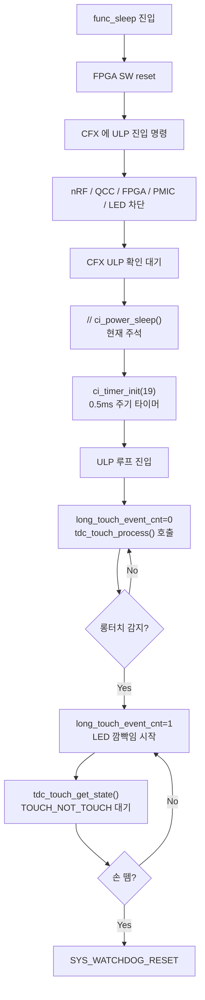
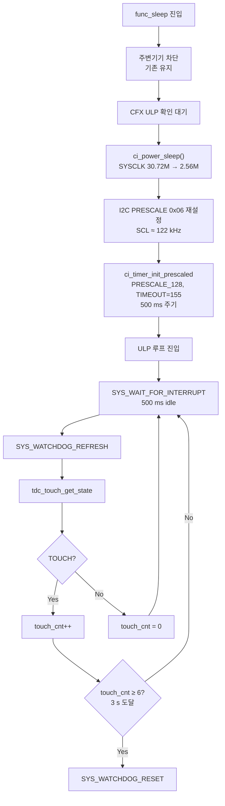

# 저전력 모드 전환 구현 계획

**TL;DR**: ULP 모드에서 SYSCLK을 30.72 MHz → 2.56 MHz로 낮추고 500 ms 웨이크업 + 카운터 기반 롱터치 판정으로 ULP 루프 단순화, 롱터치 감지 시 즉시 워치독 리셋. `func_sleep()`의 `ci_power_sleep()` 활성화·I2C PRESCALE 조정·`ci_timer_init` 긴 주기 오버로드 추가 등 기능 동등성·하위 호환성 유지하며 Rev.0 초안으로 리뷰 대기.

작성자: 김은수
최종 갱신: 2026-04-22 (Rev.0 — 초안)
상태: 리뷰 대기

> [!TIP]
> **관련 문서**
> - [`tasks/power/20260422_low-power-mode/분석.md`](분석.md) — 영향 정량 분석
> - [`참고/칩/Ezairo 8300 클럭·타이머·I2C 스펙 정리.md`](../../../참고/칩/Ezairo%208300%20클럭·타이머·I2C%20스펙%20정리.md) — 칩 스펙 발췌

---

## 1. 요구사항

### 1.1 배경

ULP 모드에서 소비 전력을 줄이기 위해 SYSCLK 을 30.72 MHz → 2.56 MHz 로 낮추고, 타이머 웨이크업 주기를 길게 가져가 CPU idle 비율을 극대화한다. 동시에 롱-터치 해제 감지 로직이 불필요해진 배경(터치 센서 덤프 모드 적용으로 ATI 에러 해소) 을 반영하여 ULP 루프를 단순화한다.

### 1.2 목표

1. `func_sleep()` 진입 시 `ci_power_sleep()` 활성화하여 SYSCLK 저주파 모드로 전환.
2. ULP 루프를 500 ms 웨이크업 + 카운터 기반 롱-터치 판정 구조로 재설계.
3. 롱-터치 감지 시 즉시 워치독 리셋 (해제 대기 로직 제거).
4. I2C 통신 속도를 Sleep 모드에서도 실용 범위 (~100 kHz 이상) 로 유지.

### 1.3 제약

- **기능 동등성** — Sleep 모드 진입 조건·롱-터치 3 s 판정·워치독 리셋 경로는 동일하게 유지.
- **기존 `ci_timer_init(tick)` API 유지** — 하위 호환성. 긴 주기 전용 오버로드를 추가하는 방식.
- **`tdc_touch` 기능 레이어 변경 최소** — 이미 검증된 레이어 구조 유지. ULP 루프에선 `tdc_touch_get_state()` 만 호출.
- **레지스터 변경은 [`지침/레지스터 변경 검증 체크리스트.md`](../../../지침/레지스터%20변경%20검증%20체크리스트.md) 준수** — I2C PRESCALE 변경 시.

### 1.4 UX 전제

- 롱-터치 응답 시간은 3 s → 3.5 s (최악 0.5 s 지연) 까지 허용. 500 ms 웨이크업 주기에 따른 최대 지연.
- Sleep 진입 중 LED 색상 변화는 제거 (blue/cyan 깜빡임 삭제). 손 뗌 확인이 불필요해졌으므로 UX 상 불필요.

---

## 2. 현상 분석

### 2.1 현재 ULP 진입 흐름



### 2.2 현재 타이머·시간 기준

- `ci_timer_init(19)` 실제 주기: **500 μs** (HW p.763 공식 `2^PRESCALE × (TIMEOUT_VALUE+1) / f_SLOWCLK_DIV32` 기준, 2026-04-21 실측 확인)
- ULP 루프 속도: 약 2000 Hz (타이머 IRQ 마다 WFI 깨어남)
- `tdc_touch_process()` 내부 `TDC_TOUCH_POLL_INTERVAL=100` → 약 50 ms 간격 폴링

### 2.3 현재 I2C 속도

- PRESCALE = `0x4F` (240 분주)
- SCL @ SYSCLK=30.72 MHz: **128 kHz**
- SCL @ SYSCLK=2.56 MHz (동일 PRESCALE): **10.67 kHz** — IQS323 표준 범위 하회

### 2.4 제거 대상 코드 ([main.c:689-771](../src/2__cm3/Cortex-M3-src/main.c))

```c
static int long_touch_event_cnt = 0;
int blue_cnt   = 0;
int cyan_cnt   = 0;
int color_type = 0;

while (1)  // ULP loop
{
    SYS_WATCHDOG_REFRESH();

    if (long_touch_event_cnt == 0) {
        if (tdc_touch_process()) {
            ci_printi("[MAIN] LONG TOUCH DETECTED, WAIT RELEASE \r\n");
            long_touch_event_cnt = 1;
        }
    } else if (long_touch_event_cnt == 1) {
        tdc_touch_state_t curr_touch_state = TDC_TOUCH_STATE_TOUCH;

        if (tdc_touch_get_state(&curr_touch_state)) {
            if (curr_touch_state == TDC_TOUCH_STATE_NOT_TOUCH) {
                Sys_GPIO_Set_Low(DIO_PIN_INDEX_for_LED_color_R);
                Sys_GPIO_Set_Low(DIO_PIN_INDEX_for_LED_color_G);
                Sys_GPIO_Set_Low(DIO_PIN_INDEX_for_LED_color_B);
                ci_printi("[MAIN] TOUCH RELEASED SO, WAKE UP! \r\n");
                delay_ms(20);
                SYS_WATCHDOG_RESET();
                break;
            }
        }

        // cyan/blue 교대 깜빡임 (switch-case 약 40 줄)
    }

    SYS_WAIT_FOR_INTERRUPT;
    /* 가속도 센서/캐링케이스 감지는 #if 0 블록 */
}
```

---

## 3. 변경 목표 구조

### 3.1 ULP 진입 흐름 (목표)



### 3.2 책임 분리

| 컴포넌트 | 역할 | 변경 여부 |
|---|---|---|
| `ci_power` | SYSCLK·파생 클럭 전환 | **무변경** (기존 함수 사용) |
| `ci_timer` | 타이머 래핑 API | **확장** — `ci_timer_init_prescaled` 추가 |
| `driver_i2c` | I2C 설정·전송 | **확장** — Sleep 용 PRESCALE 매크로·재설정 API 추가 |
| `tdc_touch` | 터치 상태 조회 | **무변경** |
| `main.c::func_sleep` | Sleep 진입·ULP 루프 | **재작성** (롱터치 감지 후 즉시 리셋) |

---

## 4. 세부 변경 지점

### 4.1 `ci_timer_init_prescaled` 신설 ([ci_timer.c](../src/2__cm3/Gen1_5/common/ci_timer.c))

**헤더 선언 추가** ([ci_timer.h](../src/2__cm3/Gen1_5/common/ci_timer.h)):
```c
int ci_timer_init_prescaled(uint32_t prescale_field, uint32_t tick);
```

**구현**:
```c
int ci_timer_init_prescaled(uint32_t prescale_field, uint32_t tick)
{
    Sys_Timer_Stop(OTE_1_5_GEN_TIMER_INSTANCE);

    NVIC_ClearPendingIRQ(OTE_1_5_GEN_TIMER_IRQn);
    NVIC_EnableIRQ(OTE_1_5_GEN_TIMER_IRQn);

    Sys_Timer_Config(OTE_1_5_GEN_TIMER_INSTANCE, prescale_field, TIMER_FREE_RUN, tick);
    Sys_Timer_Start(OTE_1_5_GEN_TIMER_INSTANCE);

    return df_True;
}

int ci_timer_init(uint32_t tick)
{
    return ci_timer_init_prescaled(TIMER_PRESCALE_1, tick);
}
```

### 4.2 I2C Sleep 모드 PRESCALE 매크로 및 재설정 API ([driver_i2c.h](../src/2__cm3/Cortex-M3-src/systemControl/driver_i2c.h))

**현재** (라인 12-13):
```c
#define I2C_MASTER_PRESCALE_240 ((uint32_t) (0x4FU << I2C_CFG_MASTER_PRESCALE_Pos))  // 128 kHz
#define I2C_MASTER_PRESCALE_243 ((uint32_t) (0x50U << I2C_CFG_MASTER_PRESCALE_Pos))  // 126.42 kHz
```

**추가**:
```c
// Sleep 모드 (SYSCLK=2.56 MHz) 전용: SCL ≈ 122 kHz
#define I2C_MASTER_PRESCALE_21  ((uint32_t) (0x06U << I2C_CFG_MASTER_PRESCALE_Pos))
```

**재설정 API 추가** ([driver_i2c.c](../src/2__cm3/Cortex-M3-src/systemControl/driver_i2c.c)):
```c
void i2c_set_master_prescale(uint32_t prescale_mask)
{
    // 진행 중 트랜잭션 완료 대기
    while (!isI2cDriverStatusIdle()) { /* spin */ }

    uint32_t cfg = I2C0->CFG;
    cfg = (cfg & ~I2C_CFG_MASTER_PRESCALE_Mask) | prescale_mask;
    I2C0->CFG = cfg;
}
```

### 4.3 `func_sleep()` 재작성 ([main.c:636-803](../src/2__cm3/Cortex-M3-src/main.c))

**변경 전 구조**:
- 라인 636~688: 주변기기 차단 (유지)
- 라인 680: `// ci_power_sleep();` 주석 (해제)
- 라인 685: `ci_timer_init(19)` (재작성)
- 라인 689~771: ULP 루프 (재작성)
- 라인 773~803: 미사용 `#if 0` 블록 (삭제)

**매크로 신설** (main.c 상단, 기능별 파라미터 한곳 집중):

```c
/* ULP 모드 롱터치 감지 파라미터 — 튜닝 시 아래 값만 수정 */
#define ULP_WAKE_INTERVAL_MS       500         /* 웨이크업 주기 (ms) */
#define ULP_LONG_TOUCH_MS          3000        /* 롱터치 판정 시간 (ms) */

/* 유도값 — 웨이크업 N회 연속 TOUCH 시 리셋 (올림 나눗셈으로 안전 마진 확보) */
#define ULP_LONG_TOUCH_COUNT \
    ((ULP_LONG_TOUCH_MS + ULP_WAKE_INTERVAL_MS - 1) / ULP_WAKE_INTERVAL_MS)

/* 타이머 하드웨어 설정값
 * 공식: T[ms] = 2^PRESCALE × (TIMEOUT+1) / 40
 * 현재: 2^7 × 156 / 40 = 499.2 ms ≈ ULP_WAKE_INTERVAL_MS(500)
 * 주기 변경 시 PRESCALE / TIMEOUT 도 재계산 필요 */
#define ULP_TIMER_PRESCALE         TIMER_PRESCALE_128
#define ULP_TIMER_TIMEOUT_VALUE    155
```

**변경 후 핵심 구간**:

```c
/* 주변기기 차단 — 기존 코드 유지 (라인 636~676) */
// ...

// Uninitialize(); /* Disable peripherals and DIOs */

ci_power_sleep();                                                     /* SYSCLK 30.72M → 2.56M */
i2c_set_master_prescale(I2C_MASTER_PRESCALE_21);                      /* SCL ≈ 122 kHz 유지 */

ci_timer_init_prescaled(ULP_TIMER_PRESCALE, ULP_TIMER_TIMEOUT_VALUE); /* ≈ 500 ms 주기 */

SYS_WATCHDOG_REFRESH();

int touch_cnt = 0;

while (1)  // ULP loop
{
    SYS_WAIT_FOR_INTERRUPT;          /* ULP_WAKE_INTERVAL_MS 동안 idle */

    SYS_WATCHDOG_REFRESH();          /* 워치독 3.28s 대비 매 웨이크업마다 refresh */

    tdc_touch_state_t state = TDC_TOUCH_STATE_RESET;
    if (tdc_touch_get_state(&state) && state == TDC_TOUCH_STATE_TOUCH)
    {
        touch_cnt++;
        if (touch_cnt >= ULP_LONG_TOUCH_COUNT)
        {
            ci_printi("[MAIN] LONG TOUCH, RESET \r\n");
            delay_ms(20);            /* RTT 로그 드레인 */
            SYS_WATCHDOG_RESET();
            break;
        }
    }
    else
    {
        touch_cnt = 0;
    }
}

return 0;
```

> [!NOTE]
> **튜닝 가이드**: 웨이크업 주기 변경 시 `ULP_WAKE_INTERVAL_MS` 와 `ULP_TIMER_PRESCALE` / `ULP_TIMER_TIMEOUT_VALUE` 를 동시에 갱신. 예:
> - 1 s 주기: `ULP_WAKE_INTERVAL_MS=1000`, `ULP_TIMER_PRESCALE=TIMER_PRESCALE_128`, `ULP_TIMER_TIMEOUT_VALUE=311`
> - 롱터치 3.5 s 로 변경: `ULP_LONG_TOUCH_MS=3500` (COUNT 자동 재계산)

### 4.4 `tdc_touch` — 변경 없음

ULP 루프에서 `tdc_touch_process()` 는 호출하지 않고 `tdc_touch_get_state()` 만 사용. Run 모드의 기존 호출자 (systemControl.c) 는 그대로 유지.

---

## 5. 구현 순서 (단계 분할)

각 단계가 독립적으로 빌드·커밋 가능하도록 분할. 가능한 한 회귀 범위를 좁힘.

### Step 1 — 롱-터치 해제 감지 제거

- **대상**: [main.c:689-771](../src/2__cm3/Cortex-M3-src/main.c) 의 `long_touch_event_cnt` 상태머신, LED 깜빡임
- **결과**: ULP 루프가 `tdc_touch_process() == true` 시 즉시 워치독 리셋
- **Side effect 없음** — Sleep 클럭 전환과 무관
- **검증**: 실기에서 Sleep 진입 → 3 s 롱-터치 → 즉시 리셋 확인

### Step 2 — `ci_timer_init_prescaled` 헬퍼 신설

- **대상**: [ci_timer.h](../src/2__cm3/Gen1_5/common/ci_timer.h), [ci_timer.c](../src/2__cm3/Gen1_5/common/ci_timer.c)
- **결과**: 기존 `ci_timer_init(tick)` 동작 유지 (내부에서 `ci_timer_init_prescaled(TIMER_PRESCALE_1, tick)` 호출)
- **회귀 위험**: 거의 없음 (동작 등가)
- **검증**: 빌드 성공 + 기존 동작 재확인 (필요 시 `CI_TIMER_DEBUG_TOGGLE_LED_R` 재삽입)

### Step 3 — I2C 재설정 API 추가

- **대상**: [driver_i2c.h](../src/2__cm3/Cortex-M3-src/systemControl/driver_i2c.h), [driver_i2c.c](../src/2__cm3/Cortex-M3-src/systemControl/driver_i2c.c)
- **추가**:
  - 매크로 `I2C_MASTER_PRESCALE_21`
  - 함수 `i2c_set_master_prescale(uint32_t)`
- **이 단계까지는 호출자 없음** — 기능 추가뿐, 기존 동작 불변
- **검증**: 빌드 성공

### Step 4 — `ci_power_sleep()` 활성화 + I2C 재설정 + 긴 주기 타이머

- **대상**: [main.c:680, 685](../src/2__cm3/Cortex-M3-src/main.c)
- **변경**:
  ```c
  ci_power_sleep();
  i2c_set_master_prescale(I2C_MASTER_PRESCALE_21);
  ci_timer_init_prescaled(TIMER_PRESCALE_128, 155);
  ```
- **예상 동작**: Sleep 진입 후 500 ms 마다 웨이크업, 롱-터치 즉시 리셋 (Step 1 덕분에)
- **검증**:
  - 실기에서 Sleep 진입 후 터치 유지 → ~3 s 내 리셋 확인
  - 오실로스코프로 I2C SCL 주파수 ≈ 122 kHz 확인
  - (선택) `CI_TIMER_DEBUG_TOGGLE_LED_R` 삽입하여 타이머 500 ms 주기 실측

### Step 5 — 미사용 코드 청소

- **대상**: [main.c:773-803](../src/2__cm3/Cortex-M3-src/main.c) 의 `#if 0` 블록 (가속도·캐링케이스)
- **결과**: Dead code 제거
- **검증**: 빌드 성공

### Step 6 — 통합 검증

- 실기 전체 시나리오:
  - 정상 부팅 → Run 모드 동작 확인
  - 커버 닫기 / 충전기 분리 등으로 Sleep 트리거
  - Sleep 진입 로그 확인 (`[INFO] CFX HAS ENTERED SLEEP MODE`)
  - 3 s 롱-터치 → 재부팅 확인
  - 반복 테스트 (Sleep ↔ Wake 10회) 에서 ATI 에러 없음
- 소비 전력 측정 (가능하면)

---

## 6. 검증 방법

### 6.1 타이머 주기 실측 (선택적)

`CI_TIMER_DEBUG_TOGGLE_LED_R` 매크로를 `ci_timer.c` 에 임시 삽입하여 빨간 LED 토글. 스코프 측정:

| 설정 | 예상 주기 (LED High 구간) |
|---|---|
| `TIMER_PRESCALE_1` + tick=19 | 500 μs |
| `TIMER_PRESCALE_1` + tick=39 | 1 ms |
| `TIMER_PRESCALE_128` + tick=155 | 500 ms |

### 6.2 I2C SCL 실측

로직 아날라이저로 SCL 라인 측정:
- Active 모드: 128 kHz (현재와 동일)
- Sleep 모드 진입 후: 약 122 kHz (변경 후)

### 6.3 롱-터치 리셋 시나리오

1. 정상 부팅
2. Sleep 트리거 (커버 닫기 / 충전 분리)
3. Sleep 진입 확인 (RTT 로그)
4. 터치 유지 시작 → 스톱워치로 측정
5. 예상: 3.0 ~ 3.5 s 사이에 재부팅 (500 ms 주기 × 6회 카운트)
6. 재부팅 후 ATI 에러 없이 정상 동작 확인

### 6.4 워치독 여유 검증

- 500 ms 타이머 IRQ 마다 `SYS_WATCHDOG_REFRESH()` 호출
- 워치독 기본 타임아웃 3.28 s → 여유 ×6.5
- 실패 조건: 타이머 IRQ 6 회 연속 누락 시 워치독 리셋 → 비정상 상황 자동 복구

---

## 7. 파급 영향 점검

### 7.1 Run 모드에 영향 없음

- `ci_timer_init()` 기존 호출자는 전부 Run 모드용. API 동작 동일.
- I2C PRESCALE 변경은 **Sleep 진입 시에만** 수행, Run 모드엔 영향 없음.
- `tdc_touch` 레이어 무변경.

### 7.2 Sleep → Wake 경로 (워치독 리셋 후)

- 워치독 리셋 후 재부팅 → 전체 초기화 경로 실행 → `ci_power_run()` 호출되어 SYSCLK 30.72M 복원
- I2C PRESCALE 도 `init_I2c()` 에서 `CM3_I2C_CFG_VAL_AsMaster` (PRESCALE=0x4F) 로 재설정됨 → Run 모드 SCL=128 kHz 복원
- **별도 Restore 코드 불필요**

### 7.3 tdc_touch_process() 내부 tick 의존

Run 모드의 `TDC_TOUCH_POLL_INTERVAL=100` 은 CFX IRQ 기반 tick (약 1 ms) 기준으로 동작 → Run 모드 내 로직 불변. ULP 모드에선 `tdc_touch_process()` 자체를 호출하지 않으므로 영향 없음.

---

## 8. §9 결정 결과 (2026-04-22 사용자 승인)

| # | 항목 | 결정 |
|---|---|---|
| 1 | PDF 2건 커밋 여부 | **포함 커밋** — 이후 세션에서 Claude 가 스펙 재확인 시 재사용 |
| 2 | 타이머 주기·카운트 | **500 ms 주기 × 6회 카운트, 매크로로 분리** — `ULP_WAKE_INTERVAL_MS`, `ULP_LONG_TOUCH_MS` 등 |
| 3 | I2C PRESCALE 변경 | **런타임 재설정 (0x06, ≈ 122 kHz)** — 저속(10.67 kHz)은 응답성 저하 |
| 4 | Step 1 (해제 감지 제거) | **별도 커밋** — 회귀 범위 좁힘 |
| 5 | 미사용 `#if 0` 블록 | **이번 작업 포함, 제거** |

---

## 9. 브랜치 전략

- 작업 브랜치: `claude_feature_low-power-mode` (베이스: `claude_main`)
- 머지 대상: `claude_main` (터치 레이어 분리 작업과 동일 패턴)
- 각 Step 을 개별 커밋으로 구성 (Step 1 ~ Step 6)
- 완료 시 `--no-ff` 머지, claude_develop 에도 동시 적용

---

## 10. 참고

- 타이머 주기 실측 결과 (2026-04-21): `ci_timer_init(19)` → 500 μs ✓ HW p.763 공식 일치
- 스펙 근거 문서: [`참고/칩/Ezairo 8300 클럭·타이머·I2C 스펙 정리.md`](../../../참고/칩/Ezairo%208300%20클럭·타이머·I2C%20스펙%20정리.md)
- 레지스터 변경 체크리스트: [`지침/레지스터 변경 검증 체크리스트.md`](../../../지침/레지스터%20변경%20검증%20체크리스트.md) (I2C PRESCALE 변경 시 적용)
