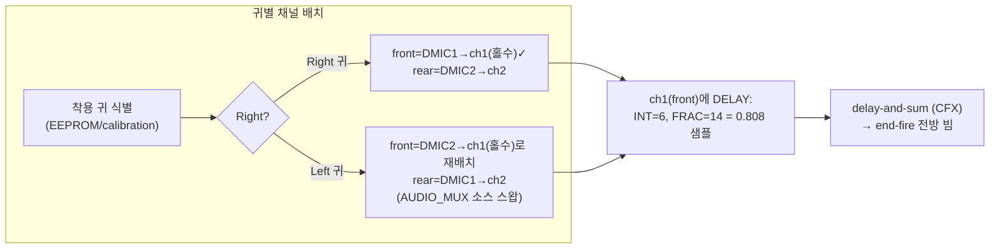

# 이론적 구현 방향 (후속 작업 제안)

**TL;DR**: end-fire 빔포밍은 **HW decimation delay(`DELAY_INTEGER`+`DELAY_FRACTIONAL`)만으로 SW 버퍼 시프트 없이 구현 가능**. 핵심 전략은 **"front mic을 홀수 채널(ch1/ch3)에 배치"** — decimation 시분할 스큐가 음향 선행을 자동 보정하여 필요 레지스터 지연이 0.808 샘플(`INT=6, FRAC=14`)로 HW 단독 범위에 들어온다. 착용 귀(Left/Right)에 따라 front mic이 바뀌므로 **귀별 채널 배치·지연 설정**이 필요. 본 문서는 이론 방향만 제시하며, **코드 변경은 별도 작업·승인 대상**.

> [!IMPORTANT]
> 본 작업(`20260623_beam-forming`)은 **타당성 이론 분석**까지가 범위. 아래 구현 방향은 후속 코딩 작업의 입력이며, 실제 소스 변경 전 별도 4단계·승인이 필요하다.

---

## 1. 결론 — 타당성

| 질문 | 결론 |
|---|---|
| 입력 패스에 채널 간 고유 지연이 있나? | **예** — decimation 시분할로 짝수 채널(ch0·2)이 홀수(ch1·3)보다 1/8 샘플(7.81µs) 선행 (HW p.222·445). 은수님 가설 정확. |
| SW 1샘플 시프트 없이 HW 내부 지연이 되나? | **예** — `AUDIO_ADC_DEC_CTRL`의 `DELAY_INTEGER`(1/8 단위)+`DELAY_FRACTIONAL`(1/240 해상도)로 채널별 독립 부여 (HW p.450-451·563). |
| 2cm·16kHz 빔포밍 성립하나? | **예** — 필요 지연 0.933 샘플, HW로 0.024µs 오차 내 구현. |

## 2. 권장 구현 전략 — "front mic = 홀수 채널" 규칙

- **원리**: front mic은 전방 음원에 먼저 노출(음향 선행 0.933 샘플). 이를 홀수 채널에 두면 HW 시분할 스큐(홀수 채널 0.125 지연)가 선행분을 빼주어 **순 필요 지연 = 0.933 − 0.125 = 0.808 샘플**.
- **레지스터 값**: `DELAY_INTEGER = 6`(6/8 = 0.75) + `DELAY_FRACTIONAL = 14`(14/240 = 0.0583) = **0.8083 샘플 = 50.5µs**. 양자화 오차 0.024µs. HW 상한 0.9958 샘플 내 여유.
- **rear mic 채널(짝수)**: `DELAY_INTEGER=0, FRAC=0` 유지.

## 3. 단계별 후속 작업 (제안)

| 단계 | 작업 | 산출물·검증 |
|---|---|---|
| 후속_1 | **데이터시트 추가 확인** — AUDIO_MUX가 임의 DMIC→임의 채널 재배치(Left 귀 DMIC2→ch1) 허용 여부, 착용 귀 식별 소스(EEPROM 필드) | HW §13 mux 소스 인코딩 정밀 확인 |
| 후속_2 | **2-DMIC 활성화** — `LIB_AUDIO_IN_DMIC_ENABLE_COUNT=2`, DIO10/17 활성, ch2 ADC_CFG/DEC_CTRL 추가 | 빌드·2채널 캡처 RTT 확인 |
| 후속_3 | **귀별 채널 배치·지연 설정** — Right/Left 빌드별 front=홀수 채널, front 채널 `INT=6/FRAC=14` | 두 채널 위상차 실측 |
| 후속_4 | **delay-and-sum 빔포머**(CFX) — 정렬 후 합산, 전방 빔 형성 | 지향성(전방/후방 SNR) 벤치 검증 |
| 후속_5 | **QCC DMIC2 공유 정책** — SPI 프로토콜로 통화 시 DMIC2 점유 협의, 빔포밍 가용 구간 정의(10ms 대기) | QCC 연동 시나리오 검증 |

## 4. 위험·미해결

| 항목 | 위험 | 대응 |
|---|---|---|
| 위험_1 | AUDIO_MUX 재배치 불가 시 Left 귀 필요지연 1.058 샘플 > HW 상한 | **하이브리드** — SW FIFO 1샘플 시프트 + HW fractional(0.058) |
| 위험_2 | QCC가 DMIC2 점유(통화) 중 빔포밍 불가 | I2S_FLAG+SPI 상태로 빔포밍 ON/OFF, 단일 mic fallback |
| 위험_3 | 음속 온도 변동(0→40°C, 4.12µs) | fractional 재튜닝 여지(15.8 LSB), 고정값으로도 허용 오차 |
| 위험_4 | end-fire 유효 대역 ~1~8kHz 한계 | 저역/고역 빔 성능 벤치 후 대역별 가중 검토 |
| 미해결_1 | 착용 귀 식별 소스 | 후속_1에서 EEPROM/calibration 확인 |
| 미해결_2 | 2-mic 상시 동작 전력 비용 | 후속_2에서 정량 측정 |

## 5. 한 줄 권고

> **빔포밍은 이론적으로 성립하고 HW만으로 구현 가능하다. "front mic을 홀수 채널에 배치 + 해당 채널에 `DELAY_INTEGER=6, FRAC=14`"가 SW 부담 없는 최적 경로이며, 남은 변수는 (1) AUDIO_MUX 재배치 가능성, (2) QCC DMIC2 공유 정책 두 가지다.**
